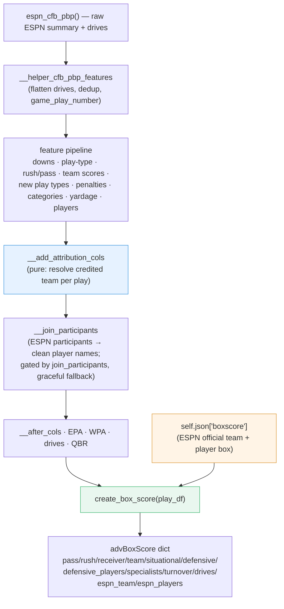
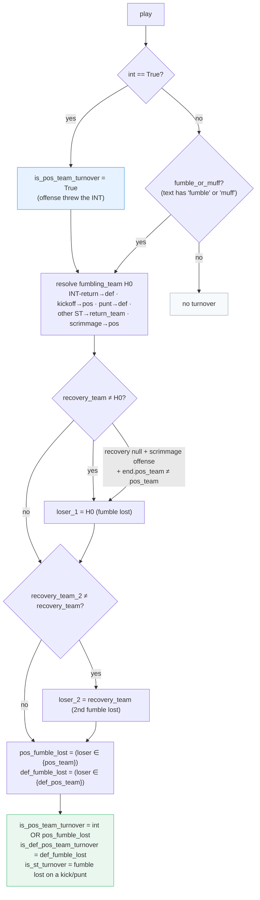
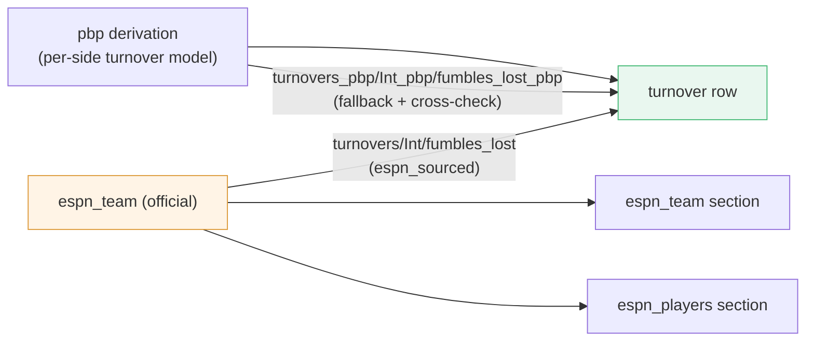

<!-- START doctoc generated TOC please keep comment here to allow auto update -->
<!-- DON'T EDIT THIS SECTION, INSTEAD RE-RUN doctoc TO UPDATE -->
**Table of Contents**  *generated with [DocToc](https://github.com/thlorenz/doctoc)*

- [CFB Advanced Box Score — Attribution Architecture](#cfb-advanced-box-score--attribution-architecture)
  - [1. Overview](#1-overview)
  - [2. Data flow](#2-data-flow)
  - [3. The attribution layer (`__add_attribution_cols`)](#3-the-attribution-layer-__add_attribution_cols)
    - [3.1 Special-teams team resolution (verified)](#31-special-teams-team-resolution-verified)
    - [3.2 Role → credited team](#32-role-%E2%86%92-credited-team)
  - [4. Turnover detection — per-side possession chain](#4-turnover-detection--per-side-possession-chain)
    - [4.1 Blocked-kick turnovers (`is_blocked_punt_turnover` / `is_blocked_fg_turnover`)](#41-blocked-kick-turnovers-is_blocked_punt_turnover--is_blocked_fg_turnover)
    - [4.2 ESPN native flags as cross-check (`isTurnover` / `isPenalty`)](#42-espn-native-flags-as-cross-check-isturnover--ispenalty)
  - [5. ESPN-sourced totals](#5-espn-sourced-totals)
  - [6. Player-name identity (`__join_participants`)](#6-player-name-identity-__join_participants)
  - [7. Play-type reclassification (`__add_new_play_types`)](#7-play-type-reclassification-__add_new_play_types)
  - [8. Output schema notes (additive)](#8-output-schema-notes-additive)
  - [9. Known limitations & empirical accuracy](#9-known-limitations--empirical-accuracy)
  - [10. Testing & reconciliation](#10-testing--reconciliation)
  - [11. Era coverage (2004-2019+)](#11-era-coverage-2004-2019)

<!-- END doctoc generated TOC please keep comment here to allow auto update -->

# CFB Advanced Box Score — Attribution Architecture

Developer reference for how `CFBPlayProcess.create_box_score()` attributes plays to teams and
players, how turnovers are detected, and how the output reconciles to ESPN's official box.

- **Module:** `sportsdataverse/cfb/cfb_pbp.py`
- **Entry points:** `CFBPlayProcess.run_processing_pipeline()` → `create_box_score()`
- **Design history:** `docs/superpowers/specs/2026-06-03-cfb-boxscore-attribution-design.md`,
  `docs/superpowers/plans/2026-06-03-cfb-boxscore-attribution.md`
- **Tests:** `tests/cfb/test_cfb_attribution.py`,
  `tests/cfb/test_box_score_attribution_offline.py`,
  `tests/cfb/test_box_score_espn_reconcile.py`,
  `tests/cfb/test_espn_flag_tripwires.py`

## 1. Overview

`create_box_score()` turns a fully-processed play-by-play frame into an advanced box score:
per-team and per-player aggregates including EPA, success rates, situational splits, havoc,
turnovers, penalties, and drive summaries. It returns a dict of sections keyed by `pass`,
`rush`, `receiver`, `team`, `situational`, `defensive`, `defensive_players`, `specialists`,
`turnover`, `drives`, plus the ESPN-sourced `espn_team` and `espn_players`.

The central problem the attribution layer solves: **`pos_team` and `def_pos_team` swap roles
between play types**, so a stat's owning team depends on its *role* on the play, not on a fixed
column. On a scrimmage play `pos_team` is the offense; on a kickoff `pos_team` is the
*receiving* team; on a punt `pos_team` is the *punting* team. Aggregating blindly by `pos_team`
mis-attributes special-teams stats and silently drops special-teams turnovers.

Two principles drive the design:

- **Derive, then reconcile.** The play-by-play derivation is the only source for the advanced
  metrics ESPN doesn't publish (EPA, success rate, havoc, per-play team credit). Countable
  totals (turnovers, fumbles, INTs, yards, penalties) are **sourced from ESPN's official box**
  where available, with the pbp derivation kept as a validated cross-check and offline fallback.
- **Attribute by resolved team, not by `pos_team`.** A pure per-play step resolves the credited
  team for every event into explicit columns; aggregations group by those.

## 2. Data flow

`__add_attribution_cols` is pure/deterministic (no I/O); it reads existing flags and the play
text and writes resolved-team columns. `__join_participants` is the only network step inside the
pipeline and is fully guarded (see §6).

## 3. The attribution layer (`__add_attribution_cols`)

### 3.1 Special-teams team resolution (verified)

| Play type | `kicking_team` | `return_team` |
|---|---|---|
| kickoff (`kickoff_play`) | `def_pos_team` | `pos_team` |
| punt (`punt`) | `pos_team` | `def_pos_team` |
| field goal (`fg_attempt`) | `pos_team` | `def_pos_team` |
| scrimmage | — | — |

Because ESPN sometimes reclassifies a punt/kickoff return fumble to a `Fumble Recovery (...)`
type and drops the `punt`/`kickoff_play`/`sp` flags, the layer also derives `_is_punt_return` /
`_is_kick_return` from the play text (flag **or** text), so reclassified return fumbles still
resolve to the returning side.

### 3.2 Role → credited team

| Role / event | Credited team |
|---|---|
| passer, rusher, receiver, target, completion, pass/rush TD | `pos_team` |
| sack, pass-breakup, interception (made), forced fumble | `def_pos_team` |
| interception **thrown** | `pos_team` |
| kicker (FG), punter | `kicking_team` |
| kick / punt returner | `return_team` |
| fumble recovery | parsed recovering team (`recovery_team`), else gaining/own team |
| penalty | `penalized_team` (defensive fouls → `def_pos_team`, else `pos_team`) |

Resolved columns written: `kicking_team`, `return_team`, `fumbling_team`, `recovery_team`,
`recovery_team_2`, `penalized_team`, `penalty_yards_signed`, the per-side turnover flags
(§4), and the per-event team columns consumed by the player boxes (`sack_team`,
`fumble_recovery_team`, `punt_return_team`, …). All team-id columns are cast to `Int32` for
join compatibility.

## 4. Turnover detection — per-side possession chain

A turnover is **per side**: a single play can be a turnover for *both* teams (an interception
returned and fumbled back; a sack-strip the defense recovers and then fumbles back). The model
emits two booleans per play — `is_pos_team_turnover` and `is_def_pos_team_turnover` — by walking
the recovery chain `fumbling_team → recovery_team → recovery_team_2`, charging a fumble-lost each
time possession changes. The parsed `recovered by {ABBR}` text is authoritative; possession
columns are a last-resort fallback for scrimmage offense fumbles only.

Worked examples (all verified against ESPN):

- **Muffed punt** (`"… muffed by #24 K.Kirkland … recovered by NCSU …"`): `fumble_or_muff` via
  "muff"; punt → `fumbling_team = def_pos_team` (receiving FSU); recovery = NCSU ⇒ FSU turnover,
  `is_st_turnover`.
- **INT returned & fumbled back** (ASU/BYU): `int_turnover` charges the passing team (BYU); the
  return fumble charges the interceptor's team (ASU) ⇒ both teams +1.
- **Overturned strip-sack**: the `(Original Play: …)` clause is stripped before parsing, so the
  reversed fumble is not counted.

### 4.1 Blocked-kick turnovers (`is_blocked_punt_turnover` / `is_blocked_fg_turnover`)

`is_turnover` deliberately models only **giveaways** (interceptions + fumbles lost), matching
ESPN's official-box `turnovers` definition so the `*_pbp` cross-check (§5) stays exact. A blocked
kick the defense recovers is a possession loss but **not** a giveaway — the official box does not
count it (verified: on blocked-kick games the kicking team's official `turnovers` equals its
INT+fumbles-lost, excluding the block). Folding it into `is_turnover` would make `turnovers_pbp`
exceed the box and break reconciliation.

Two **standalone** flags surface these, kept out of `is_turnover` / `is_st_turnover`:

- `is_blocked_punt_turnover`: `True` on a `Blocked Punt Touchdown` (always a turnover) or a non-TD
  `Blocked Punt` where `change_of_poss` is `True` (the defense, not the kicking team, recovered).
- `is_blocked_fg_turnover`: `True` on a `Blocked Field Goal Touchdown` or a non-TD `Blocked Field
  Goal` with `change_of_poss`. ESPN sometimes **mislabels** a blocked FG returned by the defense as
  `Extra Point Missed` (routing it through PAT-scoring EPA logic); `__add_new_play_types` (§7)
  relabels these to the correct `Blocked Field Goal[ Touchdown]` type — gated on `"blocked"` plus
  an FG/`field goal` text token so a genuine blocked PAT is left untouched — which also fixes the
  EPA. The turnover flag then keys off the corrected label.

Together these cover the possession-losing classes ESPN's per-play `isTurnover` flag catches that
the giveaway-based derivation does not.

### 4.2 ESPN native flags as cross-check (`isTurnover` / `isPenalty`)

ESPN ships two native booleans on every play — `isTurnover` and `isPenalty` (populated back to
2018) — which pass through the flattener unchanged as columns. They are **not** used as a source
of truth: `isTurnover` is coarser and silently drops ~16% of plain interceptions on sparse-text
plays, and has no per-side / special-teams concept; `isPenalty` marks only the *primary*-penalty
plays, whereas `penalty_flag` (penalty mentioned anywhere) also catches penalties tacked onto real
plays. They are valuable as **regression tripwires** (see §10): `isTurnover ⇒ is_turnover OR
is_blocked_punt_turnover OR is_blocked_fg_turnover`, and `isPenalty ⇒ penalty_flag`. The first
invariant would have caught the interception-erasure bug.

Validated across **150 games / 24,876 plays**: the blocked-kick flags captured all blocked-punt
**and** blocked-FG possession losses with **100% ESPN agreement and zero leakage** into
`is_turnover` / `is_st_turnover`; the penalty tripwire had **0 violations**; overall
`isTurnover` vs `is_turnover` agreement was **99.6%**. After the blocked-kick flags, the residual
`isTurnover=True / derived=False` plays are *not* derivation gaps: they are ESPN **false positives**
(the offense recovered its own fumble, so the stricter derivation is correct) plus the occasional
blocked kick the kicking team retained.

## 5. ESPN-sourced totals

ESPN's official box (`summary['boxscore']`) is the authoritative source for countable totals.
Two helpers parse it: `_parse_espn_team_box` and `_parse_espn_player_box`.

- **`espn_team`** section: ESPN team statistics verbatim (turnovers, fumblesLost, interceptions,
  totalYards, netPassingYards, rushingYards, `penalties`/`penalty_yards` split from
  `totalPenaltiesYards`, firstDowns, possessionTime, …).
- **`espn_players`** section: one row per (team, category, athlete) with clean display names and
  official stat lines (passing/rushing/receiving/defensive/fumbles/interceptions/returns/kicking/
  punting).
- **`turnover`** section: `turnovers` / `Int` / `fumbles_lost` are taken from `espn_team` when
  present (`espn_sourced = True`); the play-by-play derivation is preserved under `turnovers_pbp`
  / `Int_pbp` / `fumbles_lost_pbp` and is validated against ESPN by the reconciliation test.
  Margins and luck are keyed by team identity (never list order).

## 6. Player-name identity (`__join_participants`)

`run_processing_pipeline()` joins ESPN's per-play participants
(`espn_cfb_play_participants(game_id)`) onto the processed frame (`id` ↔ `play_id`) and coalesces
clean display names over the regex-extracted names (which carried team prefixes, e.g.
`"BYU Dayan Ghanwoloku"` → `"Dayan Ghanwoloku"`). Properties:

- **Total fault isolation:** the body is wrapped in `try/except Exception → return original frame`
  — it can never raise into the pipeline.
- **Gated:** skipped when `self.join_participants is False` (set by offline reprocessing and the
  offline test suite, so neither touches the network).
- **Non-destructive:** touches only `*_player_name` columns (never team attribution); the shared
  `returner` role is cleanup-only (it does not introduce a name where the regex was silent).

## 7. Play-type reclassification (`__add_new_play_types`)

Before attribution runs, `__add_new_play_types` (pipeline **step 5**, well ahead of
`__add_attribution_cols` at step 9) normalizes and corrects ESPN's `type.text`. ESPN's original
value is preserved as `orig_play_type` (captured before any rule fires), so the two can be
compared directly.

**The layer is a conservative safety net, not a relabeler.** Across an 18-game / 3,145-play
sample, only **~1%** of plays end with a `type.text` different from ESPN's original. ESPN already
labels the common cases (`Pass Completion`, `Rushing Touchdown`, `Passing Touchdown`, …)
correctly, so the ~50 rules are no-ops except on the rare plays ESPN labels *generically*
(`"Pass"`, `"Kickoff"`) or *wrongly*. Of the plays that do change, ~84% are pure
**interception-label normalization** (`Pass Interception Return` / `Interception` →
`Interception Return`) — not "better" data than ESPN, but the single canonical token the
`model_vars` vectors (`int_vec`, `defense_score_vec`, …) and the EPA/WPA/box layers key on.

**Signal available here: `change_of_poss`, not `is_turnover`.** `is_turnover` (and
`fumbling_team` / `recovery_team`) are built in `__add_attribution_cols` (step 9), so the
reclassifier at step 5 can only use `change_of_poss` from `__add_team_score_variables` (step 4).
The two signals are **not** interchangeable:

- `change_of_poss` is `True` on **every** possession flip — punts, kickoffs, downs turnovers,
  end-of-half — not just turnovers.
- `is_turnover` is `True` only on an actual INT / fumble-lost (net of the 2-deep recovery chain).

Measured over 20 games (3,439 plays) they agree 93.7% of the time. The disagreement is almost
entirely the `change_of_poss=True / is_turnover=False` cell (215 plays) — structural flips that
are not turnovers. On the turnover-relevant subset, `is_turnover` is consistently the correct
football signal and `change_of_poss` generates false positives on (a) punt/kickoff returns where
the receiving team fumbles and **recovers its own** ball, and (b) interception- or sack-return
fumbles where the ball comes **back** to the original offense.

**The interception-return-fumble guard (shipped).** The two pass "strip-sack → fumble" rules
fire on `fumble_vec & pass & change_of_poss==1`. Because an interception *also* sets
`change_of_poss=1`, a pick whose returner then fumbled matched the predicate and was relabeled
`Fumble Recovery (Opponent)` — erasing the interception. And since the `int` flag is derived
from `type.text` *downstream* (`__add_play_category_flags`, step 7), the corruption propagated to
EPA/WPA and the box. Both pass rules now additionally require `type.text` ∉ `int_vec`, so these
plays keep their interception label (normalized to `Interception Return`). The fix is applied at
step 5 **at the source** — stopping the mislabel before any `type.text`-derived flag is computed
— rather than as a post-attribution correction that would have to recompute `int`/`rush`/`pass`.
A 20-game before/after diff changed exactly **one** play
(`Fumble Recovery (Opponent)` → `Interception Return`); genuine strip-sacks were untouched.

**`Kickoff Team Fumble Recovery` is correct, not coarse.** When a kickoff returner fumbles and
the **kicking** team recovers, `change_of_poss==1` (the receiving team is `pos_team`), and the
label means "fumble recovered *by* the kickoff team" — confirmed by `kickoff_turnovers` /
`kickoff_vec` membership in `model_vars`. Renaming it would break those membership tests and
EPA/WPA; it is intentionally left as is.

**Post-attribution refinement (`__refine_play_types_post_attribution`).** Two label cases that the
in-method `change_of_poss` signal cannot fix — and that the `int_vec` guard does not cover — are
corrected in a dedicated step that runs **after** `__add_attribution_cols`, where `is_turnover` /
`recovery_team` are available:

1. A sack-fumble the offense **recovers itself** was relabeled `Fumble Recovery (Opponent)`
   because `change_of_poss` was spuriously `1`; `is_turnover == False` restores
   `Fumble Recovery (Own)`.
2. A punt-return fumble the **punting team** recovers stayed `Punt Return` (the punt-fumble rule
   keyed on `type.text == "Punt"`); a real ST turnover with `recovery_team == pos_team` becomes
   `Punt Team Fumble Recovery`.

Only this module's own first-pass relabels are undone (guarded on `orig_play_type`, so an
ESPN-native `Fumble Recovery (Opponent)` is never second-guessed). Because the step mutates
`type.text` after the step-7 flag derivation, it recomputes the two frozen `type.text`-derived
columns that EPA/WPA read — `downs_turnover` (`normalplay` membership: `Fumble Recovery (Own)`
newly joins it, so a 4th-down self-recovery short of the sticks correctly becomes a turnover on
downs) and `pos_score_diff_end` (`end_change_vec` membership). The EPA/WPA turnover sign-flips
read `type.text ∈ end_change_vec` *live*, so they self-heal; ESPN-sourced box turnover totals are
untouched. Verified across a 20-game / 3,439-play before/after diff: exactly **2** plays changed
(both intended relabels), EPA moved only on those 2 plays (plus their team EPA roll-ups), and all
ESPN-sourced turnover totals were unchanged. These cases are rare (≈1 play / 20 games each); the
shipped countable totals are ESPN-sourced regardless (§5), so the refinement's value is label and
EPA correctness, not turnover counts.

## 8. Output schema notes (additive)

All pre-existing field names are preserved; corrections change values in place, and new fields
are additive. Notable:

- `turnover[]`: existing fields kept; added `team_id`, `st_turnovers_lost`,
  `st_turnovers_gained`, `takeaways`, `fumble_recoveries_gained`, `*_pbp`, `espn_sourced`. The
  list is ordered `[home, away]`; **consumers should key by `team_id`**, not list index (the
  previous order came from an unordered group-by).
- `team[]`: added correctly-attributed `penalty_yards` beside the legacy `total_pen_yards`;
  first-down breakdown via `passing_first_downs_created` / `rushing_first_downs_created` /
  `penalty_first_downs_created` / `first_downs_created` (+ `*_rate`).
- New sections `espn_team`, `espn_players`.
- Per-play frame: new `is_blocked_punt_turnover` / `is_blocked_fg_turnover` flags (§4.1). ESPN's
  native `isTurnover` / `isPenalty` booleans pass through unchanged (§4.2) for use as cross-checks.

## 9. Known limitations & empirical accuracy

Measured on an 18-game random sample of the 2024 season (pbp derivation vs ESPN's official
box). The countable totals shipped in the output are **sourced from ESPN** (§5), so these are
the accuracy of the pbp cross-check / offline fallback, not of the shipped numbers.

- **Turnovers** — the pbp derivation matches ESPN **~85% (total) / ~94% (INT) / ~91% (fumbles
  lost)** of team-rows. Every miss is an *undercount* (the pbp never invents a turnover ESPN
  lacks). Root causes, in order: (1) **team-abbreviation parse failures** — the `recovered by
  {ABBR}` token doesn't always match `homeTeamAbbrev`/`awayTeamAbbrev`, leaving
  `recovery_team` null and forcing the imperfect possession-change fallback; (2)
  **reclassified / multi-event fumbles** (`Fumble Return Touchdown`, recover-then-advance);
  (3) **games with no pbp coverage**. The 5 frozen fixtures match ESPN 100% but are not
  representative — random games run ~85-94%.
- **First downs cannot be faithfully reproduced from the pbp.** Four definitions were tested
  vs ESPN's `firstDowns`: `"1ST DOWN"` text marker (mean err −2.6), raw `end.down==1` (+0.7,
  ±2.1), chain-movers + accepted penalties (−2.4), and chain-movers + dedup-penalty +
  line-to-gain TDs (+2.2). None converge — ESPN's total is systematically ~2-2.6 higher than
  **every** pbp signal, including ESPN's own in-text `"1ST DOWN"` markers, so its official
  count draws on data not present in the pbp. Contributing factors that do *not* net out:
  rush/pass first downs that also carry a penalty are **double-counted** (~1/team; DPI-on-
  incompletion counted as both passing and penalty), touchdowns are partially missed, and
  turnover/punt plays do **not** create first downs (verified: 1 turnover + 3 punt markers in
  14 games). The authoritative total is `espn_team.firstDowns`; the passing/rushing/penalty
  breakdown is best-effort. Only the declined/offsetting-penalty exclusion is a clean fix.
- **Three-or-more fumbles on one play** are not fully modeled (the recovery chain is 2-deep);
  realistic two-direction sequences are covered.
- **Offensive pass interference** is correctly attributed via the `PENALTY {TEAM}` text token
  (`_parse_penalty_abbrev`), overriding the `penalty_detail` defensive-set heuristic.

## 10. Testing & reconciliation

- **Unit** (`test_cfb_attribution.py`): the pure helpers and `__add_attribution_cols` on
  synthetic plays — every play type × event, including the nested double-direction fumble.
- **Golden offline** (`test_box_score_attribution_offline.py`): the box on 5 captured fixtures
  with `download` mocked and `join_participants` disabled (no network).
- **ESPN reconciliation** (`test_box_score_espn_reconcile.py`): the pbp derivation
  (`*_pbp`) must equal ESPN's official box for all 5 fixtures; turnover margin antisymmetry and
  `turnovers == Int + fumbles_lost`; `espn_team`/`espn_players` presence and self-consistency
  (`totalYards == netPassing + rushing`).
- **ESPN-flag tripwires** (`test_espn_flag_tripwires.py`): on the 5 fixtures, every play ESPN
  flags `isTurnover=True` must be covered by `is_turnover`, `is_blocked_punt_turnover`, or
  `is_blocked_fg_turnover`, and every `isPenalty=True` play must trip `penalty_flag` — regression
  guards against future play-type/turnover mislabels (the first would have caught the
  interception-erasure bug).

Fixtures: `tests/cfb/fixtures/summary_{401754598,401309854,401112081,401135269,401032062}.json`,
captured via `tools/capture_cfb_fixtures.py`.

## 11. Era coverage (2004-2019+)

Validated on a 240-game sweep (15 games × 2004-2019). **The pipeline runs end-to-end in every
era**: of the 209 sampled games that had play-by-play, **209 produced valid EPA, WPA, and a full
advanced box score** (zero failures). The remaining games returned 0 plays and exit early
gracefully (no box, no error). `wpa` is always computed in-house, so it is present in every era
regardless of ESPN's own win-probability array.

Three era boundaries and how each is handled:

- **2014 — separate extra-point rows + participants.** Before 2014, made/missed PATs are their
  own play rows (`Extra Point Good` / `Extra Point Missed`, ~6-8/game) and the
  `espn_cfb_play_participants` endpoint returns nothing; from 2014 on, PATs are embedded and
  participants are populated. Pre-2014 player attribution therefore comes from **text extraction
  only** (no athlete IDs); `__join_participants` already falls back to regex names. Separate PAT
  rows carry the no-down sentinel (`down = -1`, normalized in `__add_new_play_types` for the few
  pre-2005 games that ship a real down) and a flat PAT EPA, and score correctly (TD row → 6, PAT
  row → +1).
- **2016 — ESPN win-probability array** begins; irrelevant functionally (we compute `wpa`).
- **Pre-2008 — sparse PBP.** Availability falls to ~80% (2005-07) and ~47% (2004); missing games
  exit early. Pass plays in ≤2013 use `Pass Completion`/`Pass Incompletion` (2014+ uses
  `Pass Reception`); both are mapped by the reclassifier.

**Legacy label normalization** (`__add_new_play_types`, gated on the raw label so it is a no-op on
modern data): pre-2014 `2pt Conversion` (ESPN's *successful* two-point label) →
`Two-Point Conversion Good`/`Missed` via `scoringPlay`; 2004 `Unknown` rows → `End Period` for
period/game markers (so non-plays are excluded instead of scoring garbage EPA) and →
`Field Goal Missed`/`Extra Point Missed`/`...Good` for the handful of misclassified kicks;
`Kickoff Return (Defense)` (pre-2014 onside-kick-recovered) → `Kickoff`. Residual unrecognizable
`Unknown` rows are left as-is (graceful, not guessed) and a relabeled `End Period` marker still
carries a cosmetic per-play EPA value but is excluded from all aggregates (`play=False`).
