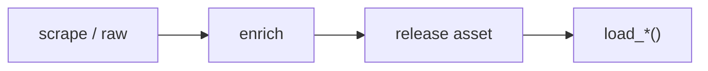

# CFB dataset loaders



## Automation status

| Dataset | Release tag | Pipeline |
|---|---|---|
| `load_cfb_pbp` | [espn_cfb_pbp](https://github.com/sportsdataverse/sportsdataverse-data/releases/tag/espn_cfb_pbp) | — |
| `load_cfb_ratings` | [cfb_ratings](https://github.com/sportsdataverse/sportsdataverse-data/releases/tag/cfb_ratings) | — |
| `load_cfb_recruiting_proj` | [cfb_recruiting_proj](https://github.com/sportsdataverse/sportsdataverse-data/releases/tag/cfb_recruiting_proj) | — |
| `load_cfb_rosters` | [cfbfastR-data](https://github.com/sportsdataverse/sportsdataverse-data/releases/tag/cfbfastR-data) | — |
| `load_cfb_schedule` | [cfbfastR-data](https://github.com/sportsdataverse/sportsdataverse-data/releases/tag/cfbfastR-data) | — |
| `load_cfb_team_info` | [cfbfastR-data](https://github.com/sportsdataverse/sportsdataverse-data/releases/tag/cfbfastR-data) | — |
| `load_cfb_teams_crosswalk` | [cfb_crosswalk](https://github.com/sportsdataverse/sportsdataverse-data/releases/tag/cfb_crosswalk) | — |
| `load_cfb_schedule_crosswalk` | [cfb_crosswalk](https://github.com/sportsdataverse/sportsdataverse-data/releases/tag/cfb_crosswalk) | — |
| `load_cfb_team_box` | [espn_cfb_team_box](https://github.com/sportsdataverse/sportsdataverse-data/releases/tag/espn_cfb_team_box) | — |
| `load_cfb_player_box` | [espn_cfb_player_box](https://github.com/sportsdataverse/sportsdataverse-data/releases/tag/espn_cfb_player_box) | — |
| `load_cfb_drives` | [espn_cfb_drives](https://github.com/sportsdataverse/sportsdataverse-data/releases/tag/espn_cfb_drives) | — |
| `load_cfb_play_participants` | [espn_cfb_play_participants](https://github.com/sportsdataverse/sportsdataverse-data/releases/tag/espn_cfb_play_participants) | — |
| `load_cfb_game_rosters` | [espn_cfb_game_rosters](https://github.com/sportsdataverse/sportsdataverse-data/releases/tag/espn_cfb_game_rosters) | — |
| `load_cfb_linescores` | [espn_cfb_linescores](https://github.com/sportsdataverse/sportsdataverse-data/releases/tag/espn_cfb_linescores) | — |
| `load_cfb_betting` | [espn_cfb_betting](https://github.com/sportsdataverse/sportsdataverse-data/releases/tag/espn_cfb_betting) | — |
| `load_cfb_power_index` | [espn_cfb_power_index](https://github.com/sportsdataverse/sportsdataverse-data/releases/tag/espn_cfb_power_index) | — |
| `load_cfb_adv_team` | [espn_cfb_adv_team](https://github.com/sportsdataverse/sportsdataverse-data/releases/tag/espn_cfb_adv_team) | — |
| `load_cfb_adv_passing` | [espn_cfb_adv_passing](https://github.com/sportsdataverse/sportsdataverse-data/releases/tag/espn_cfb_adv_passing) | — |
| `load_cfb_adv_rushing` | [espn_cfb_adv_rushing](https://github.com/sportsdataverse/sportsdataverse-data/releases/tag/espn_cfb_adv_rushing) | — |
| `load_cfb_adv_receiving` | [espn_cfb_adv_receiving](https://github.com/sportsdataverse/sportsdataverse-data/releases/tag/espn_cfb_adv_receiving) | — |
| `load_cfb_adv_defensive` | [espn_cfb_adv_defensive](https://github.com/sportsdataverse/sportsdataverse-data/releases/tag/espn_cfb_adv_defensive) | — |
| `load_cfb_adv_defensive_players` | [espn_cfb_adv_defensive_players](https://github.com/sportsdataverse/sportsdataverse-data/releases/tag/espn_cfb_adv_defensive_players) | — |
| `load_cfb_adv_drives` | [espn_cfb_adv_drives](https://github.com/sportsdataverse/sportsdataverse-data/releases/tag/espn_cfb_adv_drives) | — |
| `load_cfb_adv_situational` | [espn_cfb_adv_situational](https://github.com/sportsdataverse/sportsdataverse-data/releases/tag/espn_cfb_adv_situational) | — |
| `load_cfb_adv_specialists` | [espn_cfb_adv_specialists](https://github.com/sportsdataverse/sportsdataverse-data/releases/tag/espn_cfb_adv_specialists) | — |
| `load_cfb_adv_turnover` | [espn_cfb_adv_turnover](https://github.com/sportsdataverse/sportsdataverse-data/releases/tag/espn_cfb_adv_turnover) | — |
| `load_cfb_model_pbp` | [espn_cfb_model_pbp](https://github.com/sportsdataverse/sportsdataverse-data/releases/tag/espn_cfb_model_pbp) | — |
| `load_cfb_passing` | [espn_cfb_passing](https://github.com/sportsdataverse/sportsdataverse-data/releases/tag/espn_cfb_passing) | — |
| `load_cfb_percentiles` | [espn_cfb_percentiles](https://github.com/sportsdataverse/sportsdataverse-data/releases/tag/espn_cfb_percentiles) | — |
| `load_cfb_receiving` | [espn_cfb_receiving](https://github.com/sportsdataverse/sportsdataverse-data/releases/tag/espn_cfb_receiving) | — |
| `load_cfb_rushing` | [espn_cfb_rushing](https://github.com/sportsdataverse/sportsdataverse-data/releases/tag/espn_cfb_rushing) | — |
| `load_cfb_team_summaries` | [espn_cfb_team_summaries](https://github.com/sportsdataverse/sportsdataverse-data/releases/tag/espn_cfb_team_summaries) | — |
| `load_cfb_adv_team_gamelog` | [espn_cfb_adv_team_gamelog](https://github.com/sportsdataverse/sportsdataverse-data/releases/tag/espn_cfb_adv_team_gamelog) | — |
| `load_cfb_ratings_weekly` | [cfb_ratings_weekly](https://github.com/sportsdataverse/sportsdataverse-data/releases/tag/cfb_ratings_weekly) | — |
| `load_cfb_team_summaries_weekly` | [cfb_team_summaries_weekly](https://github.com/sportsdataverse/sportsdataverse-data/releases/tag/cfb_team_summaries_weekly) | — |

## `load_cfb_pbp`

Release: [espn_cfb_pbp](https://github.com/sportsdataverse/sportsdataverse-data/releases/tag/espn_cfb_pbp) · asset `https://github.com/sportsdataverse/sportsdataverse-data/releases/download/espn_cfb_pbp/play_by_play_{season}.parquet`
### Returns

| col_name | type | description |
|---|---|---|
| `id` | Int32 | 247Sports referencing id for the recruit. |
| `sequenceNumber` | String | Broadcast sequence order number. |
| `text` | String | Full play description. |
| `awayScore` | Int32 | Away team score after the goal. |
| `homeScore` | Int32 | Home team score after the goal. |
| `scoringPlay` | Boolean |  |
| `priority` | Boolean | `TRUE` if ESPN flags the play as a priority highlight. |
| `modified` | String | ISO timestamp the play record was last modified. |
| `statYardage` | Int32 |  |
| `type.id` | String |  |
| `type.text` | String |  |
| `period.number` | Int32 |  |
| `clock.displayValue` | String |  |
| `start.down` | Int32 |  |
| `start.distance` | Int32 |  |
| `start.yardLine` | Int32 |  |
| `start.yardsToEndzone` | Int32 |  |
| `start.downDistanceText` | String |  |
| `start.shortDownDistanceText` | String |  |
| `start.possessionText` | String |  |
| `start.team.id` | Int32 |  |
| `end.down` | Int32 |  |
| `end.distance` | Int32 |  |
| `end.yardLine` | Int32 |  |
| `end.yardsToEndzone` | Int32 |  |
| `end.downDistanceText` | String |  |
| `end.shortDownDistanceText` | String |  |
| `end.possessionText` | String |  |
| `end.team.id` | Int32 |  |
| `drive.id` | String |  |
| `drive.displayResult` | String |  |
| `drive.isScore` | Boolean |  |
| `drive.team.shortDisplayName` | String |  |
| `drive.team.displayName` | String |  |
| `drive.team.name` | String |  |
| `drive.team.abbreviation` | String |  |
| `drive.yards` | Int32 |  |
| `drive.offensivePlays` | Int32 |  |
| `drive.result` | String |  |
| `drive.description` | String |  |
| `drive.shortDisplayResult` | String |  |
| `drive.timeElapsed.displayValue` | String |  |
| `drive.start.period.number` | Int32 |  |
| `drive.start.period.type` | String |  |
| `drive.start.yardLine` | Int32 |  |
| `drive.start.clock.displayValue` | String |  |
| `drive.start.text` | String |  |
| `drive.end.period.number` | Int32 |  |
| `drive.end.period.type` | String |  |
| `drive.end.yardLine` | Int32 |  |
| `drive.end.clock.displayValue` | String |  |
| `game_id` | Int32 | ESPN game identifier. |
| `season` | Int32 | Season (4-digit year). |
| `seasonType` | Int32 |  |
| `homeTeamId` | Int32 |  |
| `awayTeamId` | Int32 |  |
| `homeTeamName` | String |  |
| `awayTeamName` | String |  |
| `homeTeamMascot` | String |  |
| `awayTeamMascot` | String |  |
| `homeTeamAbbrev` | String |  |
| `awayTeamAbbrev` | String |  |
| `homeTeamNameAlt` | String |  |
| `awayTeamNameAlt` | String |  |
| `homeTeamSpread` | Float64 |  |
| `gameSpread` | Float64 |  |
| `gameSpreadAvailable` | Boolean |  |
| `overUnder` | Float64 |  |
| `homeFavorite` | Boolean |  |
| `clock.minutes` | String |  |
| `clock.seconds` | String |  |
| `half` | Int32 | Half indicator (1 or 2). |
| `lead_half` | Int32 | A lead column on the half |
| `start.TimeSecsRem` | Int32 |  |
| `start.adj_TimeSecsRem` | Int32 |  |
| `lead_text` | String |  |
| `lead_start_team` | String |  |
| `lead_start_yardsToEndzone` | Int32 |  |
| `lead_start_down` | Int32 |  |
| `lead_start_distance` | Int32 |  |
| `lead_scoringPlay` | Boolean |  |
| `text_dupe` | Boolean |  |
| `game_play_number` | Int32 | Sequential play number within the game (excludes timeouts/end markers). |
| `start.pos_team.id` | Int32 |  |
| `start.def_pos_team.id` | Int32 |  |
| `end.def_team.id` | Int32 |  |
| `end.pos_team.id` | Int32 |  |
| `end.def_pos_team.id` | Int32 |  |
| `start.pos_team.name` | String |  |
| `start.def_pos_team.name` | String |  |
| `end.pos_team.name` | String |  |
| `end.def_pos_team.name` | String |  |
| `start.is_home` | Boolean |  |
| `end.is_home` | Boolean |  |
| `homeTimeoutCalled` | Boolean |  |
| `awayTimeoutCalled` | Boolean |  |
| `end.homeTeamTimeouts` | Int32 |  |
| `end.awayTeamTimeouts` | Int32 |  |
| `start.homeTeamTimeouts` | Int32 |  |
| `start.awayTeamTimeouts` | Int32 |  |
| `end.TimeSecsRem` | Int32 |  |
| `end.adj_TimeSecsRem` | Int32 |  |
| `start.posTeamTimeouts` | Int32 |  |
| `start.defPosTeamTimeouts` | Int32 |  |
| `end.posTeamTimeouts` | Int32 |  |
| `end.defPosTeamTimeouts` | Int32 |  |
| `firstHalfKickoffTeamId` | Int32 |  |
| `period` | Int32 | Period (quarter) number. |
| `start.yard` | Int32 |  |
| `end.yard` | Int32 |  |
| `playType` | String |  |
| `week` | Int32 | Game week of the season. |
| `end_of_half` | Boolean | Binary flag for the last play of a half. |
| `down_1` | Boolean |  |
| `down_2` | Boolean |  |
| `down_3` | Boolean |  |
| `down_4` | Boolean |  |
| `down_1_end` | Boolean |  |
| `down_2_end` | Boolean |  |
| `down_3_end` | Boolean |  |
| `down_4_end` | Boolean |  |
| `scoring_play` | Boolean | `TRUE` if the play resulted in a score. |
| `td_play` | Boolean | Binary flag for a touchdown play. |
| `touchdown` | Boolean | Binary flag for a touchdown (duplicate of td_play for downstream use). |
| `td_check` | Boolean |  |
| `safety` | Boolean | Binary flag for a safety. |
| `fumble_vec` | Boolean | Binary flag for a play involving a fumble. |
| `forced_fumble` | Boolean |  |
| `kickoff_play` | Boolean | Binary flag for a kickoff play. |
| `kickoff_tb` | Boolean | Binary flag for a kickoff touchback. |
| `kickoff_onside` | Boolean | Binary flag for an onside kickoff attempt. |
| `kickoff_oob` | Boolean | Binary flag for a kickoff out of bounds. |
| `kickoff_fair_catch` | Boolean | Binary flag for a kickoff fair catch. |
| `kickoff_downed` | Boolean | Binary flag for a kickoff downed in the field of play. |
| `kick_play` | Boolean | Binary flag for any kicking play (kickoff or field goal). |
| `kickoff_safety` | Boolean | Binary flag for a kickoff safety. |
| `punt` | Boolean | Binary flag for a punt play. |
| `punt_play` | Boolean | Binary flag for any punt-related play (includes blocks/returns). |
| `punt_tb` | Boolean | Binary flag for a punt touchback. |
| `punt_oob` | Boolean | Binary flag for a punt out of bounds. |
| `punt_fair_catch` | Boolean | Binary flag for a punt fair catch. |
| `punt_downed` | Boolean | Binary flag for a punt downed in the field of play. |
| `punt_safety` | Boolean | Binary flag for a punt safety. |
| `penalty_safety` | Boolean | Binary flag for a safety scored on a penalty. |
| `punt_blocked` | Boolean | Binary flag for a blocked punt. |
| `rush` | Boolean | Binary flag for a rushing play. |
| `pass` | Boolean | Binary flag for a passing play (includes sacks). |
| `sack_vec` | Boolean | Binary flag for a sack play. |
| `pos_team` | Int32 | Team name in possession at the start of the play (offense, kickoff-aware). |
| `def_pos_team` | Int32 | Team name on defense at the start of the play. |
| `is_home` | Boolean | Whether the subject team was the home team. |
| `HA_score_diff` | Int32 |  |
| `lag_homeScore` | Int32 |  |
| `lag_awayScore` | Int32 |  |
| `start.homeScore` | Int32 |  |
| `start.awayScore` | Int32 |  |
| `end.homeScore` | Int32 |  |
| `end.awayScore` | Int32 |  |
| `pos_team_score` | Int32 | Score for the team in possession at the start of the play. |
| `def_pos_team_score` | Int32 | Score for the defensive team at the start of the play. |
| `start.pos_team_score` | Int32 |  |
| `start.def_pos_team_score` | Int32 |  |
| `start.pos_score_diff` | Int32 |  |
| `end.pos_team_score` | Int32 |  |
| `end.def_pos_team_score` | Int32 |  |
| `end.pos_score_diff` | Int32 |  |
| `lag_pos_team` | Int32 | Possession team on the previous play (lag value). |
| `lead_pos_team` | Int32 | Possession team on the next play (lead value). |
| `lead_pos_team2` | Int32 | Possession team two plays ahead (lead 2 of pos_team). |
| `pos_score_diff` | Int32 | Score differential from the possession team's perspective. |
| `lag_pos_score_diff` | Int32 | pos_score_diff from the previous play (lag value). |
| `pos_score_pts` | Int32 | Points scored on the play attributed to the possession team. |
| `pos_score_diff_start` | Int32 | Score differential for the possession team at the start of the play. |
| `start.pos_team_receives_2H_kickoff` | Boolean |  |
| `end.pos_team_receives_2H_kickoff` | Boolean |  |
| `change_of_poss` | Int32 | Binary flag for change of possession on the play (CFBD offense field). |
| `penalty_flag` | Boolean | TRUE when a penalty was flagged on the play. |
| `penalty_declined` | Boolean | TRUE when the penalty was declined. |
| `penalty_no_play` | Boolean | TRUE when the penalty nullified the play (no play counted). |
| `penalty_offset` | Boolean | TRUE when offsetting penalties were called. |
| `penalty_1st_conv` | Boolean | TRUE when the penalty resulted in a first down conversion. |
| `penalty_in_text` | Boolean |  |
| `sack` | Boolean | Binary flag for a sack (duplicate of sack_vec for downstream use). |
| `int` | Boolean | Binary flag for an interception. |
| `int_td` | Boolean | Binary flag for an interception returned for a touchdown. |
| `completion` | Boolean | Binary flag for a completed pass. |
| `pass_attempt` | Boolean | Binary flag for a pass attempt. |
| `target` | Boolean | Binary flag for a targeted receiver on the play. |
| `pass_breakup` | Boolean |  |
| `pass_td` | Boolean | Binary flag for a passing touchdown. |
| `rush_td` | Boolean | Binary flag for a rushing touchdown. |
| `turnover_vec` | Boolean | Binary flag for any play classified as a turnover. |
| `offense_score_play` | Boolean | Binary flag for an offensive scoring play. |
| `defense_score_play` | Boolean | Binary flag for a defensive scoring play. |
| `downs_turnover` | Boolean | Binary flag for a turnover on downs. |
| `fg_attempt` | Boolean |  |
| `fg_made` | Boolean | TRUE when the field goal attempt was successful. |
| `pos_unit` | String | Possession-team unit label (offense or special teams). |
| `def_pos_unit` | String | Defensive possession-team unit label (defense or special teams). |
| `lead_play_type` | String | Play type on the next play (lead value). |
| `sp` | Boolean | Binary indicator for whether or not a score occurred on the play. |
| `play` | Boolean | Binary flag indicating the row is a counted play (excludes end markers/timeouts/penalties). |
| `scrimmage_play` | Boolean |  |
| `change_of_pos_team` | Boolean | Binary flag for change of possession-team on the play. |
| `pos_score_diff_end` | Int32 |  |
| `fumble_lost` | Boolean | Binary indicator for if the fumble was lost. |
| `fumble_recovered` | Boolean |  |
| `receiver_player_name` | String | Name of the receiver on a passing play. |
| `passer_player_name` | String | Name of the passer on a passing play. |
| `new_down` | Int32 |  |
| `new_distance` | Int32 |  |
| `middle_8` | Boolean | TRUE for plays in the middle-8 window (final 4 min of 1H, first 4 min of 2H). |
| `rz_play` | Boolean | Binary flag for a red-zone play (yards_to_goal <= 20). |
| `scoring_opp` | Boolean | Binary flag for a scoring opportunity (yards_to_goal <= 40). |
| `stuffed_run` | Boolean | Binary flag for a stuffed run (zero or negative yards gained). |
| `stopped_run` | Boolean |  |
| `opportunity_run` | Boolean |  |
| `highlight_run` | Boolean |  |
| `short_rush_success` | Boolean |  |
| `short_rush_attempt` | Boolean |  |
| `power_rush_success` | Boolean |  |
| `power_rush_attempt` | Boolean |  |
| `early_down` | Boolean |  |
| `late_down` | Boolean |  |
| `early_down_pass` | Boolean |  |
| `early_down_rush` | Boolean |  |
| `late_down_pass` | Boolean |  |
| `late_down_rush` | Boolean |  |
| `standard_down` | Boolean |  |
| `passing_down` | Boolean |  |
| `TFL` | Boolean |  |
| `TFL_pass` | Boolean |  |
| `TFL_rush` | Boolean |  |
| `havoc` | Boolean |  |
| `start.pos_team_spread` | Float64 |  |
| `start.elapsed_share` | Float64 |  |
| `start.spread_time` | Float64 |  |
| `end.pos_team_spread` | Float64 |  |
| `end.elapsed_share` | Float64 |  |
| `end.spread_time` | Float64 |  |
| `start.yardsToEndzone.touchback` | Int32 |  |
| `EP_start_touchback` | Float64 |  |
| `EP_start` | Float64 |  |
| `EP_end` | Float64 |  |
| `lag_change_of_pos_team` | Boolean | change_of_pos_team from the previous play (lag value). |
| `EPA` | Float64 | Expected Points Added on the play (cfbfastR EPA model output). |
| `def_EPA` | Float64 | EPA for the defensive team on the play (sign-flipped offense EPA). |
| `EPA_scrimmage` | Float64 |  |
| `EPA_pass` | Float64 |  |
| `EPA_explosive` | Boolean |  |
| `EPA_non_explosive` | Float64 |  |
| `EPA_explosive_pass` | Boolean |  |
| `EPA_explosive_rush` | Boolean |  |
| `first_down_created` | Boolean |  |
| `EPA_success` | Boolean |  |
| `EPA_success_early_down` | Boolean |  |
| `EPA_success_early_down_pass` | Boolean |  |
| `EPA_success_early_down_rush` | Boolean |  |
| `EPA_success_late_down` | Boolean |  |
| `EPA_success_late_down_pass` | Boolean |  |
| `EPA_success_late_down_rush` | Boolean |  |
| `EPA_success_standard_down` | Boolean |  |
| `EPA_success_passing_down` | Boolean |  |
| `EPA_success_pass` | Boolean |  |
| `EPA_success_rush` | Boolean |  |
| `EPA_success_rush_EPA` | Boolean |  |
| `EPA_middle_8_success` | Boolean |  |
| `EPA_middle_8_success_pass` | Boolean |  |
| `EPA_middle_8_success_rush` | Boolean |  |
| `EPA_sp` | Float64 |  |
| `start.ExpScoreDiff_touchback` | Float64 |  |
| `start.ExpScoreDiff` | Float64 |  |
| `start.ExpScoreDiff_Time_Ratio_touchback` | Float64 |  |
| `start.ExpScoreDiff_Time_Ratio` | Float64 |  |
| `end.ExpScoreDiff` | Float64 |  |
| `end.ExpScoreDiff_Time_Ratio` | Float64 |  |
| `wp_before` | Float64 | Win probability for the possession team before the play (0-1). |
| `wp_touchback` | Float64 |  |
| `def_wp_before` | Float64 | Win probability for the defensive team before the play (0-1). |
| `home_wp_before` | Float64 | Home team win probability before the play (0-1). |
| `away_wp_before` | Float64 | Away team win probability before the play (0-1). |
| `lead_wp_before` | Float64 | Win probability on the next play (lead of wp_before). |
| `lead_wp_before2` | Float64 | Win probability two plays ahead (lead 2 of wp_before). |
| `wp_after` | Float64 | Win probability for the possession team after the play (0-1). |
| `def_wp_after` | Float64 | Win probability for the defensive team after the play (0-1). |
| `home_wp_after` | Float64 | Home team win probability after the play (0-1). |
| `away_wp_after` | Float64 | Away team win probability after the play (0-1). |
| `wpa` | Float64 | Win Probability Added on the play (cfbfastR WP model output). |
| `drive_start` | Int32 |  |
| `drive_stopped` | Boolean |  |
| `drive_play_index` | Int32 |  |
| `drive_offense_plays` | Int32 |  |
| `prog_drive_EPA` | Float64 |  |
| `prog_drive_WPA` | Float64 |  |
| `drive_offense_yards` | Int32 |  |
| `drive_total_yards` | Int32 |  |
| `qbr_epa` | Float64 |  |
| `weight` | Float64 | Listed weight (lbs). |
| `non_fumble_sack` | Boolean |  |
| `pass_epa` | Float64 |  |
| `pass_weight` | Float64 |  |
| `action_play` | Boolean |  |
| `athlete_name` | String | Player full name. |
| `type.abbreviation` | String |  |
| `lag_half` | String | A lag column on the half |
| `lag_scoringPlay` | Boolean |  |
| `lag_HA_score_diff` | Int32 |  |
| `net_HA_score_pts` | Int32 |  |
| `H_score_diff` | Int32 |  |
| `A_score_diff` | Int32 |  |
| `yds_rushed` | Int32 | Rushing yards gained on the play. |
| `rusher_player_name` | String | Name of the rusher on a rushing play. |
| `adj_rush_yardage` | Int32 |  |
| `line_yards` | Float64 |  |
| `second_level_yards` | Float64 |  |
| `open_field_yards` | Int32 |  |
| `highlight_yards` | Float64 |  |
| `opp_highlight_yards` | Float64 |  |
| `lag_EP_end` | Float64 |  |
| `EP_between` | Float64 |  |
| `EPA_rush` | Float64 |  |
| `EPA_success_EPA` | Float64 |  |
| `EPA_success_passing_down_EPA` | Float64 |  |
| `rush_epa` | Float64 |  |
| `rush_weight` | Float64 |  |
| `penalty_detail` | String | Parsed penalty description extracted from play text. |
| `penalty_text` | String | TRUE when penalty information is detectable in the play text. |
| `yds_penalty` | Int32 | Yardage assessed on the penalty. |
| `EPA_penalty` | Float64 |  |
| `pen_epa` | Float64 |  |
| `pen_weight` | Float64 |  |
| `yds_punt_gained` | Int32 | Net yards gained on the punt (punt distance minus return). |
| `yds_punt_return` | Int32 | Yards gained on the punt return. |
| `punter_player_name` | String | Name of the punter. |
| `punt_return_player_name` | String |  |
| `EPA_punt` | Float64 |  |
| `EPA_success_standard_down_EPA` | Float64 |  |
| `yds_receiving` | Int32 | Receiving yards gained on the play. |
| `EPA_success_pass_EPA` | Float64 |  |
| `interception_player_name` | String | Name of the defender credited with the interception. |
| `scoringType.name` | String |  |
| `scoringType.displayName` | String |  |
| `scoringType.abbreviation` | String |  |
| `yds_kickoff_return` | Int32 | Yards gained on the kickoff return. |
| `kickoff_player_name` | String | Name of the kickoff specialist. |
| `kickoff_return_player_name` | String |  |
| `down` | Int32 | Down of the play (1-4). |
| `distance` | Int32 | Yards to gain for a first down (or to the goal line in goal-to-go situations). |
| `EPA_kickoff` | Float64 |  |
| `yds_fg` | Int32 | Distance of the field goal attempt in yards. |
| `EPA_fg` | Float64 |  |
| `fumble_player_name` | String | Name of the player who fumbled. |
| `fumble_recovered_player_name` | String | Name of the player who recovered the fumble. |
| `yds_sacked` | Int32 | Yards lost on the sack. |
| `sack_epa` | Float64 |  |
| `sack_weight` | Float64 |  |
| `date` | String | Date of the poll release. |
| `fg_kicker_player_name` | String | Name of the field goal kicker. |
| `yds_int_return` | Int32 | Yards gained on an interception return. |
| `yds_punted` | Int32 | Yards the ball traveled on the punt. |
| `game_date_time` | Datetime(time_unit='us', time_zone='America/New_York') | Game start date/time (ISO 8601). |
| `game_date` | Date | Kickoff date-time (ISO 8601, UTC). |

```python
load_cfb_pbp(seasons=2024)
```

## `load_cfb_ratings`

Release: [cfb_ratings](https://github.com/sportsdataverse/sportsdataverse-data/releases/tag/cfb_ratings) · asset `https://github.com/sportsdataverse/sportsdataverse-data/releases/download/cfb_ratings/cfb_ratings_{season}.parquet`
### Returns

| col_name | type | description |
|---|---|---|
| `season` | Int64 | Season (4-digit year). |
| `team_id` | Int64 | ESPN team id. |
| `adj_off_epa` | Float64 |  |
| `adj_def_epa` | Float64 |  |
| `adj_st_epa` | Float64 |  |
| `adj_net` | Float64 |  |
| `fei_off` | Float64 |  |
| `fei_def` | Float64 |  |
| `fei_net` | Float64 |  |
| `games` | Int64 | Number of games included in the ATS summary. |
| `off_pace` | Float64 |  |
| `off_rank` | Int64 |  |
| `def_rank` | Int64 |  |
| `net_rank` | Int64 |  |
| `net_z` | Float64 |  |

```python
load_cfb_ratings(seasons=2024)
```

## `load_cfb_recruiting_proj`

Release: [cfb_recruiting_proj](https://github.com/sportsdataverse/sportsdataverse-data/releases/tag/cfb_recruiting_proj) · asset `https://github.com/sportsdataverse/sportsdataverse-data/releases/download/cfb_recruiting_proj/cfb_recruiting_proj_{season}.parquet`
### Returns

| col_name | type | description |
|---|---|---|
| `season` | Int64 | Season (4-digit year). |
| `team_id` | Int64 | ESPN team id. |
| `pred_wins` | Float64 |  |
| `pred_margin` | Float64 |  |
| `pred_net_epa` | Float64 |  |

```python
load_cfb_recruiting_proj(seasons=2024)
```

## `load_cfb_rosters`

Release: [cfbfastR-data](https://github.com/sportsdataverse/sportsdataverse-data/releases/tag/cfbfastR-data) · asset `https://raw.githubusercontent.com/sportsdataverse/cfbfastR-data/main/rosters/parquet/cfb_rosters_{season}.parquet`
### Returns

| col_name | type | description |
|---|---|---|
| `athlete_id` | String | ESPN athlete id. |
| `first_name` | String | Athlete first name. |
| `last_name` | String | Athlete last name. |
| `team` | String | Team name. |
| `weight` | Int32 | Listed weight (lbs). |
| `height` | Int32 | Listed height (inches). |
| `jersey` | Int32 | Jersey number. |
| `year` | Int32 | Four-digit season year (e.g. 2019). |
| `position` | String | Athlete position. |
| `home_city` | String | Hometown of the athlete. |
| `home_state` | String | Hometown state of the athlete. |
| `home_country` | String | Hometown country of the athlete. |
| `home_latitude` | String | Hometown latitude. |
| `home_longitude` | String | Hometown longitude. |
| `home_county_fips` | String | Hometown FIPS code. |
| `recruit_ids` | List(Int32) |  |
| `headshot_url` | String | Player ESPN headshot url. |
| `season` | Int32 | Season (4-digit year). |

```python
load_cfb_rosters(seasons=2024)
```

## `load_cfb_schedule`

Release: [cfbfastR-data](https://github.com/sportsdataverse/sportsdataverse-data/releases/tag/cfbfastR-data) · asset `https://raw.githubusercontent.com/sportsdataverse/cfbfastR-data/main/schedules/parquet/cfb_schedules_{season}.parquet`
### Returns

| col_name | type | description |
|---|---|---|
| `game_id` | Int32 | ESPN game identifier. |
| `season` | Int32 | Season (4-digit year). |
| `week` | Int32 | Game week of the season. |
| `season_type` | String | ESPN season type (2 = regular, 3 = postseason). |
| `start_date` | String | Season start timestamp (ISO 8601, UTC). |
| `start_time_tbd` | Boolean | TRUE/FALSE flag for if the game's start time is to be determined. |
| `completed` | Boolean | `TRUE` if the game is complete. |
| `neutral_site` | Boolean | TRUE/FALSE flag for if the game took place at a neutral site. |
| `conference_game` | Boolean | TRUE/FALSE flag for this game qualifying as a conference game. |
| `attendance` | Int32 | Reported attendance at the game. |
| `venue_id` | Int32 | Referencing venue id. |
| `venue` | String | Venue name. |
| `home_id` | Int32 | Home team referencing id. |
| `home_team` | String | Home team name. |
| `home_conference` | String | Home team conference. |
| `home_division` | String | Home team division. |
| `home_points` | Int32 | Home team total points scored in the game so far. |
| `home_post_win_prob` | Boolean | Home team post-game win probability. |
| `home_pregame_elo` | Int32 | Home team pre-game ELO rating. |
| `home_postgame_elo` | Int32 | Home team post-game ELO rating. |
| `away_id` | Int32 | Away team referencing id. |
| `away_team` | String | Away team name. |
| `away_conference` | String | Away team conference. |
| `away_division` | String | Away team division. |
| `away_points` | Int32 | Away team total points scored in the game so far. |
| `away_post_win_prob` | Boolean | Away team post-game win probability. |
| `away_pregame_elo` | Int32 | Away team pre-game ELO rating. |
| `away_postgame_elo` | Int32 | Away team post-game ELO rating. |
| `excitement_index` | Boolean | Game excitement index. |
| `highlights` | Boolean | Game highlight urls. |
| `notes` | String | Game notes. |

```python
load_cfb_schedule(seasons=2024)
```

## `load_cfb_team_info`

Release: [cfbfastR-data](https://github.com/sportsdataverse/sportsdataverse-data/releases/tag/cfbfastR-data) · asset `https://raw.githubusercontent.com/sportsdataverse/cfbfastR-data/main/team_info/parquet/cfb_team_info_{season}.parquet`
### Returns

| col_name | type | description |
|---|---|---|
| `team_id` | Int64 | ESPN team id. |
| `school` | String | Team name. |
| `mascot` | String | Team mascot. |
| `abbreviation` | String | Metric abbreviation. |
| `alt_name1` | String | Team alternate name 1 (as it appears in `play_text`). |
| `alt_name2` | String | Team alternate name 2 (as it appears in `play_text`). |
| `alt_name3` | String | Team alternate name 3 (as it appears in `play_text`). |
| `conference` | String | Conference of the team. |
| `classification` | String | Conference classification (fbs, fcs, ii, iii). |
| `color` | String | Primary team color (hex, no `#`). |
| `alt_color` | String | Team color (alternate). |
| `logo` | String | Team or league logo URL. |
| `logo_2` | String |  |
| `twitter` | String |  |
| `venue_id` | Int32 | Referencing venue id. |
| `venue_name` | String | Full name of the franchise's venue. |
| `city` | String | Venue city. |
| `state` | String | Venue state. |
| `zip` | String | Team/venue zip code. |
| `country_code` | String | Team/venue country code. |
| `timezone` | String | Time zone in which the venue resides (i.e. Eastern Time -> "America/New_York"). |
| `latitude` | Float64 | Venue latitude in decimal degrees. |
| `longitude` | Float64 | Venue longitude in decimal degrees. |
| `elevation` | String | Venue elevation above sea level. |
| `capacity` | Int32 | Stadium capacity. |
| `year_constructed` | Int32 | Year in which the venue was constructed. |
| `grass` | Boolean | TRUE/FALSE response on whether the field is grass or not. |
| `dome` | Boolean | TRUE/FALSE response to whether the venue has a dome or not. |

```python
load_cfb_team_info(seasons=2024)
```

## `load_cfb_teams_crosswalk`

Release: [cfb_crosswalk](https://github.com/sportsdataverse/sportsdataverse-data/releases/tag/cfb_crosswalk) · asset `https://github.com/sportsdataverse/sportsdataverse-data/releases/download/cfb_crosswalk/cfb_teams_crosswalk_{season}.parquet`
### Returns

| col_name | type | description |
|---|---|---|
| `norm_key` | String |  |
| `espn_team_id` | Int64 | ESPN team id (canonical key). |
| `espn_team` | String |  |
| `espn_abbreviation` | String | ESPN abbreviation. |
| `fox_team_id` | String | Fox Bifrost team id (NA if unmatched). |
| `fox_team` | String |  |
| `fox_abbreviation` | String |  |
| `yahoo_team_id` | String | Yahoo team id (NA placeholder). |
| `yahoo_team` | String |  |
| `yahoo_abbreviation` | String |  |
| `matched_sources` | String |  |

```python
load_cfb_teams_crosswalk(seasons=2024)
```

## `load_cfb_schedule_crosswalk`

Release: [cfb_crosswalk](https://github.com/sportsdataverse/sportsdataverse-data/releases/tag/cfb_crosswalk) · asset `https://github.com/sportsdataverse/sportsdataverse-data/releases/download/cfb_crosswalk/cfb_schedule_crosswalk_{season}.parquet`
### Returns

| col_name | type | description |
|---|---|---|
| `matchup_key` | String |  |
| `espn_game_id` | Int64 | ESPN game id (NA for bart-only rows). |
| `fox_game_id` | String | Fox game id (NA placeholder). |
| `yahoo_game_id` | String | Yahoo game id (NA placeholder). |
| `yahoo_global_game_id` | String |  |
| `home_team` | String | Home team name. |
| `away_team` | String | Away team name. |
| `espn_date` | String |  |
| `fox_date` | String |  |
| `yahoo_date` | String |  |
| `matched_sources` | String |  |

```python
load_cfb_schedule_crosswalk(seasons=2024)
```

## `load_cfb_team_box`

Release: [espn_cfb_team_box](https://github.com/sportsdataverse/sportsdataverse-data/releases/tag/espn_cfb_team_box) · asset `https://github.com/sportsdataverse/sportsdataverse-data/releases/download/espn_cfb_team_box/team_box_{season}.parquet`
### Returns

| col_name | type | description |
|---|---|---|
| `firstDowns` | String |  |
| `thirdDownEff` | String |  |
| `fourthDownEff` | String |  |
| `totalYards` | String |  |
| `netPassingYards` | String |  |
| `completionAttempts` | String |  |
| `yardsPerPass` | String |  |
| `rushingYards` | String |  |
| `rushingAttempts` | String |  |
| `yardsPerRushAttempt` | String |  |
| `totalPenaltiesYards` | String |  |
| `turnovers` | String | Turnovers total. |
| `fumblesLost` | String |  |
| `interceptions` | String | Passing interceptions. |
| `possessionTime` | String |  |
| `team_id` | Int64 | ESPN team id. |
| `team_abbreviation` | String | Team abbreviation; `team_detail = TRUE` only. |
| `team_name` | String | Team nickname; `team_detail = TRUE` only. |
| `home_away` | String | `home` or `away`. |
| `game_id` | Int64 | ESPN game identifier. |
| `season` | Int64 | Season (4-digit year). |

```python
load_cfb_team_box(seasons=2024)
```

## `load_cfb_player_box`

Release: [espn_cfb_player_box](https://github.com/sportsdataverse/sportsdataverse-data/releases/tag/espn_cfb_player_box) · asset `https://github.com/sportsdataverse/sportsdataverse-data/releases/download/espn_cfb_player_box/player_box_{season}.parquet`
### Returns

| col_name | type | description |
|---|---|---|
| `completions/passingAttempts` | String |  |
| `passingYards` | String |  |
| `yardsPerPassAttempt` | String |  |
| `passingTouchdowns` | String |  |
| `interceptions` | String | Passing interceptions. |
| `adjQBR` | String |  |
| `category` | String | CFBD stats category name (e.g. passing, rushing, defensive). |
| `athlete_id` | Int64 | ESPN athlete id. |
| `athlete_name` | String | Player full name. |
| `jersey` | Null | Jersey number. |
| `team_id` | Int64 | ESPN team id. |
| `rushingAttempts` | String |  |
| `rushingYards` | String |  |
| `yardsPerRushAttempt` | String |  |
| `rushingTouchdowns` | String |  |
| `longRushing` | String |  |
| `receptions` | String | The number of pass receptions. Lateral receptions officially don't count as reception. |
| `receivingYards` | String |  |
| `yardsPerReception` | String |  |
| `receivingTouchdowns` | String |  |
| `longReception` | String |  |
| `interceptionYards` | String |  |
| `interceptionTouchdowns` | String |  |
| `puntReturns` | String |  |
| `puntReturnYards` | String |  |
| `yardsPerPuntReturn` | String |  |
| `longPuntReturn` | String |  |
| `puntReturnTouchdowns` | String |  |
| `fieldGoalsMade/fieldGoalAttempts` | String |  |
| `fieldGoalPct` | String |  |
| `longFieldGoalMade` | String |  |
| `extraPointsMade/extraPointAttempts` | String |  |
| `totalKickingPoints` | String |  |
| `punts` | String |  |
| `puntYards` | String |  |
| `grossAvgPuntYards` | String |  |
| `touchbacks` | String |  |
| `puntsInside20` | String |  |
| `longPunt` | String |  |
| `game_id` | Int64 | ESPN game identifier. |
| `season` | Int64 | Season (4-digit year). |
| `stat_1` | String |  |
| `stat_2` | String |  |
| `stat_3` | String |  |
| `stat_4` | String |  |
| `stat_5` | String |  |

```python
load_cfb_player_box(seasons=2024)
```

## `load_cfb_drives`

Release: [espn_cfb_drives](https://github.com/sportsdataverse/sportsdataverse-data/releases/tag/espn_cfb_drives) · asset `https://github.com/sportsdataverse/sportsdataverse-data/releases/download/espn_cfb_drives/drives_{season}.parquet`
### Returns

| col_name | type | description |
|---|---|---|
| `drive_id` | String | CFBD drive identifier the play belongs to. |
| `team_id` | Int64 | ESPN team id. |
| `result` | String | Drive result code (e.g. `PUNT`, `TD`). |
| `display_result` | String | Drive-result label (e.g. `Punt`, `Touchdown`). |
| `short_display_result` | String | Short drive-result label. |
| `description` | String | ESPN's description of the stat. |
| `yards` | Int64 | Total yards gained on the drive. |
| `offensive_plays` | Int64 | Number of offensive plays on the drive. |
| `is_score` | Boolean | `TRUE` if the drive resulted in a score. |
| `start_period` | Int64 | Period (quarter) in which the drive starts. |
| `start_yard_line` | Int64 | Yard line at the start of the play. |
| `start_clock` | String | Game clock display value at the start of the drive. |
| `start_text` | String | Field-position text at the start of the drive. |
| `end_period` | Int64 | Period (quarter) in which the drive ends. |
| `end_yard_line` | Int64 | Yard line at the end of the play. |
| `end_clock` | String | Game clock display value at the end of the drive. |
| `time_elapsed` | String | Elapsed game time for the drive (`MM:SS`). |
| `n_plays` | Int64 |  |
| `game_id` | Int64 | ESPN game identifier. |
| `season` | Int64 | Season (4-digit year). |

```python
load_cfb_drives(seasons=2024)
```

## `load_cfb_play_participants`

Release: [espn_cfb_play_participants](https://github.com/sportsdataverse/sportsdataverse-data/releases/tag/espn_cfb_play_participants) · asset `https://github.com/sportsdataverse/sportsdataverse-data/releases/download/espn_cfb_play_participants/play_participants_{season}.parquet`
### Returns

| col_name | type | description |
|---|---|---|
| `game_id` | Int64 | ESPN game identifier. |
| `play_id` | Int64 | ESPN play id. |
| `kicker_player_name` | String | String name for the kicker on FG or kickoff. |
| `returner_player_name` | String |  |
| `passer_player_name` | String | Name of the passer on a passing play. |
| `receiver_player_name` | String | Name of the receiver on a passing play. |
| `rusher_player_name` | String | Name of the rusher on a rushing play. |
| `penalized_player_name` | String |  |
| `scorer_player_name` | String |  |
| `pass_defender_player_name` | String |  |
| `punter_player_name` | String | Name of the punter. |
| `pat_scorer_player_name` | String |  |
| `sacked_by_player_name` | String |  |
| `kicker_player_id` | String | Unique identifier for the kicker on FG or kickoff. |
| `returner_player_id` | String |  |
| `passer_player_id` | String | Unique identifier for the player that attempted the pass. |
| `receiver_player_id` | String | Unique identifier for the receiver that was targeted on the pass. |
| `rusher_player_id` | String | Unique identifier for the player that attempted the run. |
| `penalized_player_id` | String |  |
| `scorer_player_id` | String |  |
| `pass_defender_player_id` | String |  |
| `punter_player_id` | String | Unique identifier for the punter. |
| `pat_scorer_player_id` | String |  |
| `sacked_by_player_id` | String |  |
| `kicker_player_names` | String |  |
| `returner_player_names` | String |  |
| `passer_player_names` | String |  |
| `receiver_player_names` | String |  |
| `rusher_player_names` | String |  |
| `penalized_player_names` | String |  |
| `scorer_player_names` | String |  |
| `pass_defender_player_names` | String |  |
| `punter_player_names` | String |  |
| `pat_scorer_player_names` | String |  |
| `sacked_by_player_names` | String |  |
| `kicker_player_ids` | String |  |
| `returner_player_ids` | String |  |
| `passer_player_ids` | String |  |
| `receiver_player_ids` | String |  |
| `rusher_player_ids` | String |  |
| `penalized_player_ids` | String |  |
| `scorer_player_ids` | String |  |
| `pass_defender_player_ids` | String |  |
| `punter_player_ids` | String |  |
| `pat_scorer_player_ids` | String |  |
| `sacked_by_player_ids` | String |  |
| `season` | Int64 | Season (4-digit year). |
| `week` | Int64 | Game week of the season. |
| `recoverer_player_name` | String |  |
| `recoverer_player_id` | String |  |
| `recoverer_player_names` | String |  |
| `recoverer_player_ids` | String |  |
| `tackler_player_name` | String |  |
| `assisted_by_player_name` | String |  |
| `forced_by_player_name` | String |  |
| `tackler_player_id` | String |  |
| `assisted_by_player_id` | String |  |
| `forced_by_player_id` | String |  |
| `tackler_player_names` | String |  |
| `assisted_by_player_names` | String |  |
| `forced_by_player_names` | String |  |
| `tackler_player_ids` | String |  |
| `assisted_by_player_ids` | String |  |
| `forced_by_player_ids` | String |  |
| `pat_passer_player_name` | String |  |
| `pat_passer_player_id` | String |  |
| `pat_passer_player_names` | String |  |
| `pat_passer_player_ids` | String |  |

```python
load_cfb_play_participants(seasons=2024)
```

## `load_cfb_game_rosters`

Release: [espn_cfb_game_rosters](https://github.com/sportsdataverse/sportsdataverse-data/releases/tag/espn_cfb_game_rosters) · asset `https://github.com/sportsdataverse/sportsdataverse-data/releases/download/espn_cfb_game_rosters/game_rosters_{season}.parquet`
### Returns

| col_name | type | description |
|---|---|---|
| `athlete_id` | Int64 | ESPN athlete id. |
| `athlete_uid` | String | ESPN athlete UID (universal identifier). |
| `athlete_guid` | String | ESPN athlete GUID. |
| `athlete_type` | String | Athlete type / class. |
| `first_name` | String | Athlete first name. |
| `last_name` | String | Athlete last name. |
| `full_name` | String | Venue full name (e.g. `Tenney Stadium`). |
| `athlete_display_name` | String | Player display name; `athlete_detail = TRUE` only. |
| `short_name` | String | Ranking source short name (e.g. `AP Poll`). |
| `weight` | Float64 | Listed weight (lbs). |
| `display_weight` | String | Human-readable weight (e.g. `205 lbs`). |
| `height` | Float64 | Listed height (inches). |
| `display_height` | String | Human-readable height (e.g. `6' 1"`). |
| `age` | Float64 | Player age (in years). |
| `date_of_birth` | String | Player date of birth (if published). |
| `slug` | String | URL slug for the team. |
| `jersey` | String | Jersey number. |
| `linked` | Boolean | TRUE if the record is linked to a related entity. |
| `active` | Boolean | `TRUE` if the player was active for the game. |
| `alternate_ids_sdr` | String | Alternate ids sdr. |
| `birth_place_city` | String | Birth place city. |
| `birth_place_state` | String | Birth place state. |
| `experience_years` | Float64 | Years of experience. |
| `experience_display_value` | String | Experience display value. |
| `experience_abbreviation` | String | Experience abbreviation. |
| `status_id` | String | ESPN commitment status id. |
| `status_name` | String | Status-type key (e.g. `STATUS_FINAL`). |
| `status_type` | String | Status type. |
| `status_abbreviation` | String | Status abbreviation. |
| `birth_place_country` | String | Birth place country. |
| `birth_country_alternate_id` | String |  |
| `birth_country_abbreviation` | String | Birth country abbreviation. |
| `flag_href` | String |  |
| `flag_alt` | String |  |
| `flag_rel` | String |  |
| `starter` | Boolean | `TRUE` if the athlete started the game. |
| `valid` | Boolean | `TRUE` if the roster entry is flagged valid by ESPN. |
| `did_not_play` | Boolean | `TRUE` if the athlete did not play. |
| `athlete_href` | String |  |
| `position_href` | String |  |
| `statistics_href` | String |  |
| `team_id` | Int64 | ESPN team id. |
| `order` | Int64 | Team order within the competition (0 = first). |
| `home_away` | String | `home` or `away`. |
| `winner` | Boolean | `TRUE` if this team won the game. |
| `team_guid` | String | ESPN team GUID. |
| `team_uid` | String | ESPN universal team identifier (UID format 's:40~l:...~t:...'). |
| `team_slug` | String | Team slug for the stat row. |
| `team_location` | String | Team location / school name; `team_detail = TRUE` only. |
| `team_name` | String | Team nickname; `team_detail = TRUE` only. |
| `team_nickname` | String | Team nickname label; `team_detail = TRUE` only. |
| `team_abbreviation` | String | Team abbreviation; `team_detail = TRUE` only. |
| `team_display_name` | String | Full team display name; `team_detail = TRUE` only. |
| `team_short_display_name` | String | Short team display name; `team_detail = TRUE` only. |
| `team_color` | String | Primary team color; `team_detail = TRUE` only. |
| `team_alternate_color` | String | Alternate team color; `team_detail = TRUE` only. |
| `is_active` | Boolean | Whether the team is currently active. |
| `is_all_star` | Boolean | Whether the team is an all-star team. |
| `team_alternate_ids_sdr` | String |  |
| `logo_href` | String | URL of the default team logo. |
| `logo_dark_href` | String | URL of the dark-variant team logo. |
| `game_id` | Int64 | ESPN game identifier. |
| `season` | Int64 | Season (4-digit year). |
| `week` | Int64 | Game week of the season. |
| `draft_display_text` | String | Draft display text. |
| `draft_round` | Float64 | Round of the draft selection. |
| `draft_year` | Float64 | Draft year (4-digit). |
| `draft_selection` | Float64 | Draft selection. |
| `draft_team_href` | String |  |
| `middle_name` | String | Middle name of the player. |
| `headshot_href` | String | URL of the athlete headshot image. |
| `headshot_alt` | String | Alternative-text label for the headshot. |

```python
load_cfb_game_rosters(seasons=2024)
```

## `load_cfb_linescores`

Release: [espn_cfb_linescores](https://github.com/sportsdataverse/sportsdataverse-data/releases/tag/espn_cfb_linescores) · asset `https://github.com/sportsdataverse/sportsdataverse-data/releases/download/espn_cfb_linescores/linescores_{season}.parquet`
### Returns

| col_name | type | description |
|---|---|---|
| `team_id` | Int64 | ESPN team id. |
| `period` | Int64 | Period (quarter) number. |
| `value` | String | Metric value. |
| `game_id` | Int64 | ESPN game identifier. |
| `season` | Int64 | Season (4-digit year). |

```python
load_cfb_linescores(seasons=2024)
```

## `load_cfb_betting`

Release: [espn_cfb_betting](https://github.com/sportsdataverse/sportsdataverse-data/releases/tag/espn_cfb_betting) · asset `https://github.com/sportsdataverse/sportsdataverse-data/releases/download/espn_cfb_betting/betting_{season}.parquet`
### Returns

| col_name | type | description |
|---|---|---|
| `game_id` | Int64 | ESPN game identifier. |
| `season` | Int64 | Season (4-digit year). |
| `week` | Int64 | Game week of the season. |
| `game_spread` | Float64 | Game spread in (-X Team) format. There are almost none, I would recommend not trusting any of these three columns |
| `over_under` | Float64 | Pre-game over/under total from the selected provider. |
| `home_favorite` | Boolean | `TRUE` if the home team is the favorite. |
| `home_team_spread` | Float64 | The game spread with respect to the home team |
| `game_spread_available` | Boolean | Logical (TRUE/FALSE) indicating whether the spread was available from ESPN. Basically, I would just not recommend using any of the spread information, I think I defaulted a lot of them to -2.5 for the home team. Most games probably do not have spread information. This column should really be listed first |
| `odds_source` | String |  |

```python
load_cfb_betting(seasons=2024)
```

## `load_cfb_power_index`

Release: [espn_cfb_power_index](https://github.com/sportsdataverse/sportsdataverse-data/releases/tag/espn_cfb_power_index) · asset `https://github.com/sportsdataverse/sportsdataverse-data/releases/download/espn_cfb_power_index/power_index_{season}.parquet`
### Returns

| col_name | type | description |
|---|---|---|
| `$ref` | String |  |
| `game_id` | Int64 | ESPN game identifier. |
| `season` | Int64 | Season (4-digit year). |
| `week` | Int64 | Game week of the season. |

```python
load_cfb_power_index(seasons=2024)
```

## `load_cfb_adv_team`

Release: [espn_cfb_adv_team](https://github.com/sportsdataverse/sportsdataverse-data/releases/tag/espn_cfb_adv_team) · asset `https://github.com/sportsdataverse/sportsdataverse-data/releases/download/espn_cfb_adv_team/adv_team_{season}.parquet`
### Returns

| col_name | type | description |
|---|---|---|
| `pos_team_id` | Int64 |  |
| `pos_team` | String | Team name in possession at the start of the play (offense, kickoff-aware). |
| `rushing_highlight_yards_per_opp` | Float64 |  |
| `total_pen_yards` | Int64 |  |
| `EPA_penalty` | Float64 |  |
| `penalty_first_downs_created` | Int64 |  |
| `penalty_first_downs_created_rate` | Float64 |  |
| `penalties` | Int64 | Total number of penalties. |
| `penalty_yards` | Int64 | Yards gained (or lost) by the posteam from the penalty. |
| `special_teams_plays` | Int64 |  |
| `EPA_sp` | Float64 |  |
| `EPA_special_teams` | Float64 |  |
| `field_goals` | Int64 |  |
| `EPA_fg` | Float64 |  |
| `punt_plays` | Int64 |  |
| `EPA_punt` | Float64 |  |
| `kickoff_plays` | Int64 |  |
| `EPA_kickoff` | Float64 |  |
| `rushes` | Int64 |  |
| `rush_yards` | Float64 | The number of rushing yards gained |
| `yards_per_rush` | Float64 |  |
| `rushing_power_rate` | Float64 |  |
| `rushing_first_downs_created` | Int64 |  |
| `rushing_first_downs_created_rate` | Float64 |  |
| `EPA_rushing_overall` | Float64 |  |
| `EPA_rushing_per_play` | Float64 |  |
| `EPA_explosive_rushing` | Int64 |  |
| `EPA_explosive_rushing_rate` | Float64 |  |
| `EPA_non_explosive_rushing` | Float64 |  |
| `EPA_non_explosive_rushing_per_play` | Float64 |  |
| `passes` | Int64 | Passes. |
| `pass_yards` | Float64 | Number of yards gained on pass plays |
| `yards_per_pass` | Float64 | Team game yards per pass. |
| `passing_first_downs_created` | Int64 |  |
| `passing_first_downs_created_rate` | Float64 |  |
| `EPA_passing_overall` | Float64 |  |
| `EPA_passing_per_play` | Float64 |  |
| `EPA_explosive_passing` | Int64 |  |
| `EPA_explosive_passing_rate` | Float64 |  |
| `EPA_non_explosive_passing` | Float64 |  |
| `EPA_non_explosive_passing_per_play` | Float64 |  |
| `scrimmage_plays` | Int64 |  |
| `EPA_overall_off` | Float64 |  |
| `EPA_overall_offense` | Float64 |  |
| `EPA_per_play` | Float64 |  |
| `EPA_non_explosive` | Float64 |  |
| `EPA_non_explosive_per_play` | Float64 |  |
| `EPA_explosive` | Int64 |  |
| `EPA_explosive_rate` | Float64 |  |
| `passes_rate` | Float64 |  |
| `off_yards` | Int64 |  |
| `total_off_yards` | Int64 |  |
| `yards_per_play` | Float64 |  |
| `EPA_plays` | Int64 |  |
| `total_yards` | Int64 | Team total yards. |
| `EPA_overall_total` | Float64 |  |
| `rushes_rate` | Float64 |  |
| `first_downs_created` | Int64 |  |
| `first_downs_created_rate` | Float64 |  |
| `EPA_rushing_power` | Float64 |  |
| `EPA_rushing_power_per_play` | Float64 |  |
| `rushing_power_success` | Int64 | Rushing power success rate. |
| `rushing_power_success_rate` | Float64 |  |
| `rushing_power` | Int64 |  |
| `rushing_stuff` | Int64 |  |
| `rushing_stuff_rate` | Float64 | Rushing stuff rate. |
| `rushing_stopped` | Int64 |  |
| `rushing_stopped_rate` | Float64 |  |
| `rushing_opportunity` | Int64 |  |
| `rushing_opportunity_rate` | Float64 |  |
| `rushing_highlight` | Int64 |  |
| `rushing_highlight_rate` | Float64 |  |
| `rushing_highlight_yards` | Float64 | Opponent-adjusted offensive highlight yards per opportunity rush. |
| `line_yards` | Float64 |  |
| `line_yards_per_carry` | Float64 |  |
| `second_level_yards` | Float64 |  |
| `open_field_yards` | Float64 |  |
| `game_id` | Int64 | ESPN game identifier. |
| `season` | Int64 | Season (4-digit year). |
| `week` | Int64 | Game week of the season. |

```python
load_cfb_adv_team(seasons=2024)
```

## `load_cfb_adv_passing`

Release: [espn_cfb_adv_passing](https://github.com/sportsdataverse/sportsdataverse-data/releases/tag/espn_cfb_adv_passing) · asset `https://github.com/sportsdataverse/sportsdataverse-data/releases/download/espn_cfb_adv_passing/adv_passing_{season}.parquet`
### Returns

| col_name | type | description |
|---|---|---|
| `pos_team_id` | Int64 |  |
| `pos_team` | String | Team name in possession at the start of the play (offense, kickoff-aware). |
| `passer_player_name` | String | Name of the passer on a passing play. |
| `Comp` | Int64 |  |
| `Att` | Int64 |  |
| `xComp` | Float64 |  |
| `Yds` | Float64 |  |
| `Pass_TD` | Int64 |  |
| `Int` | Int64 |  |
| `YPA` | Float64 |  |
| `EPA` | Float64 | Expected Points Added on the play (cfbfastR EPA model output). |
| `EPA_per_Play` | Float64 |  |
| `WPA` | Float64 | Win Probability Added. |
| `SR` | Float64 |  |
| `Sck` | Int64 |  |
| `CompPct` | Float64 |  |
| `xCompPct` | Float64 |  |
| `CPOE` | Float64 |  |
| `qbr_epa` | Float64 |  |
| `sack_epa` | Float64 |  |
| `pass_epa` | Float64 |  |
| `rush_epa` | Float64 |  |
| `pen_epa` | Float64 |  |
| `spread` | Float64 | Pre-game point spread from the selected provider. |
| `era0` | Int64 |  |
| `era1` | Int64 |  |
| `era2` | Int64 |  |
| `era3` | Int64 |  |
| `exp_qbr` | Float64 |  |
| `game_id` | Int64 | ESPN game identifier. |
| `season` | Int64 | Season (4-digit year). |
| `week` | Int64 | Game week of the season. |

```python
load_cfb_adv_passing(seasons=2024)
```

## `load_cfb_adv_rushing`

Release: [espn_cfb_adv_rushing](https://github.com/sportsdataverse/sportsdataverse-data/releases/tag/espn_cfb_adv_rushing) · asset `https://github.com/sportsdataverse/sportsdataverse-data/releases/download/espn_cfb_adv_rushing/adv_rushing_{season}.parquet`
### Returns

| col_name | type | description |
|---|---|---|
| `pos_team_id` | Int64 |  |
| `pos_team` | String | Team name in possession at the start of the play (offense, kickoff-aware). |
| `rusher_player_name` | String | Name of the rusher on a rushing play. |
| `Car` | Int64 |  |
| `Yds` | Float64 |  |
| `Rush_TD` | Int64 |  |
| `YPC` | Float64 |  |
| `EPA` | Float64 | Expected Points Added on the play (cfbfastR EPA model output). |
| `EPA_per_Play` | Float64 |  |
| `WPA` | Float64 | Win Probability Added. |
| `SR` | Float64 |  |
| `Fum` | Int64 |  |
| `Fum_Lost` | Int64 |  |
| `game_id` | Int64 | ESPN game identifier. |
| `season` | Int64 | Season (4-digit year). |
| `week` | Int64 | Game week of the season. |

```python
load_cfb_adv_rushing(seasons=2024)
```

## `load_cfb_adv_receiving`

Release: [espn_cfb_adv_receiving](https://github.com/sportsdataverse/sportsdataverse-data/releases/tag/espn_cfb_adv_receiving) · asset `https://github.com/sportsdataverse/sportsdataverse-data/releases/download/espn_cfb_adv_receiving/adv_receiving_{season}.parquet`
### Returns

| col_name | type | description |
|---|---|---|
| `pos_team_id` | Int64 |  |
| `pos_team` | String | Team name in possession at the start of the play (offense, kickoff-aware). |
| `receiver_player_name` | String | Name of the receiver on a passing play. |
| `Rec` | Int64 |  |
| `Tar` | Int64 |  |
| `Yds` | Float64 |  |
| `Rec_TD` | Int64 |  |
| `YPT` | Float64 |  |
| `EPA` | Float64 | Expected Points Added on the play (cfbfastR EPA model output). |
| `EPA_per_Play` | Float64 |  |
| `WPA` | Float64 | Win Probability Added. |
| `SR` | Float64 |  |
| `Fum` | Int64 |  |
| `Fum_Lost` | Int64 |  |
| `game_id` | Int64 | ESPN game identifier. |
| `season` | Int64 | Season (4-digit year). |
| `week` | Int64 | Game week of the season. |

```python
load_cfb_adv_receiving(seasons=2024)
```

## `load_cfb_adv_defensive`

Release: [espn_cfb_adv_defensive](https://github.com/sportsdataverse/sportsdataverse-data/releases/tag/espn_cfb_adv_defensive) · asset `https://github.com/sportsdataverse/sportsdataverse-data/releases/download/espn_cfb_adv_defensive/adv_defensive_{season}.parquet`
### Returns

| col_name | type | description |
|---|---|---|
| `def_pos_team_id` | Int64 |  |
| `def_pos_team` | String | Team name on defense at the start of the play. |
| `scrimmage_plays` | Int64 |  |
| `TFL` | Int64 |  |
| `TFL_pass` | Int64 |  |
| `TFL_rush` | Int64 |  |
| `havoc_total` | Int64 | Total havoc rate. |
| `havoc_total_rate` | Float64 |  |
| `fumbles` | Int64 |  |
| `def_int` | Int64 |  |
| `drive_stopped_rate` | Float64 |  |
| `num_pass_plays` | Int64 |  |
| `havoc_total_pass` | Int64 |  |
| `havoc_total_pass_rate` | Float64 |  |
| `sacks` | Int64 | Team sacks. |
| `sacks_rate` | Float64 |  |
| `pass_breakups` | Int64 |  |
| `havoc_total_rush` | Int64 |  |
| `havoc_total_rush_rate` | Float64 |  |
| `game_id` | Int64 | ESPN game identifier. |
| `season` | Int64 | Season (4-digit year). |
| `week` | Int64 | Game week of the season. |

```python
load_cfb_adv_defensive(seasons=2024)
```

## `load_cfb_adv_defensive_players`

Release: [espn_cfb_adv_defensive_players](https://github.com/sportsdataverse/sportsdataverse-data/releases/tag/espn_cfb_adv_defensive_players) · asset `https://github.com/sportsdataverse/sportsdataverse-data/releases/download/espn_cfb_adv_defensive_players/adv_defensive_players_{season}.parquet`
### Returns

| col_name | type | description |
|---|---|---|
| `def_pos_team_id` | Int64 | ESPN team id of the team on defense. Present for every season 2004+. |
| `def_pos_team` | String | Display name of the team on defense (e.g. 'Ohio State Buckeyes'). Held an ESPN team id until the 2026-08 republish; the id now lives in def_pos_team_id. |
| `player_name` | String | Display name of the defender. |
| `fumble_recoveries` | Int64 | Fumbles recovered by the defender. Available for every season 2004+. |
| `fumble_recoveries_yards` | Int64 | Yards returned on the defender's fumble recoveries. Available for every season 2004+. |
| `game_id` | Int64 | ESPN game identifier. |
| `season` | Int64 | Season (4-digit year). |
| `week` | Int64 | Game week of the season. |
| `sacks` | Int64 | Sacks recorded by the defender. Available from 2005 on; null for 2004. |
| `sacks_yards` | Int64 | Yards lost by the offense on the defender's sacks. Available from 2005 on; null for 2004. |
| `pass_breakups` | Int64 | Passes broken up by the defender. Available from 2005 on; null for 2004. |
| `forced_fumbles` | Int64 | Fumbles forced by the defender. Available from 2005 on; null for 2004, which ESPN ships with only the fumble-recovery statistics. |
| `interceptions` | Int64 | Passes intercepted by the defender. Available from 2014 on; null for 2004-2013, which ESPN ships without interception statistics in this block. |
| `interceptions_yards` | Int64 | Yards returned on the defender's interceptions. Available from 2014 on; null for 2004-2013. |

```python
load_cfb_adv_defensive_players(seasons=2024)
```

## `load_cfb_adv_drives`

Release: [espn_cfb_adv_drives](https://github.com/sportsdataverse/sportsdataverse-data/releases/tag/espn_cfb_adv_drives) · asset `https://github.com/sportsdataverse/sportsdataverse-data/releases/download/espn_cfb_adv_drives/adv_drives_{season}.parquet`
### Returns

| col_name | type | description |
|---|---|---|
| `pos_team_id` | Int64 |  |
| `pos_team` | String | Team name in possession at the start of the play (offense, kickoff-aware). |
| `drive_total_available_yards` | Float64 |  |
| `drive_total_gained_yards` | Int64 |  |
| `avg_field_position` | Float64 |  |
| `plays_per_drive` | Float64 |  |
| `yards_per_drive` | Float64 |  |
| `drives` | Int64 |  |
| `drive_total_gained_yards_rate` | Float64 |  |
| `game_id` | Int64 | ESPN game identifier. |
| `season` | Int64 | Season (4-digit year). |
| `week` | Int64 | Game week of the season. |

```python
load_cfb_adv_drives(seasons=2024)
```

## `load_cfb_adv_situational`

Release: [espn_cfb_adv_situational](https://github.com/sportsdataverse/sportsdataverse-data/releases/tag/espn_cfb_adv_situational) · asset `https://github.com/sportsdataverse/sportsdataverse-data/releases/download/espn_cfb_adv_situational/adv_situational_{season}.parquet`
### Returns

| col_name | type | description |
|---|---|---|
| `pos_team_id` | Int64 |  |
| `pos_team` | String | Team name in possession at the start of the play (offense, kickoff-aware). |
| `EPA_success` | Int64 |  |
| `EPA_success_rate` | Float64 |  |
| `EPA_success_pass` | Int64 |  |
| `EPA_success_pass_rate` | Float64 |  |
| `EPA_success_rush` | Int64 |  |
| `EPA_success_rush_rate` | Float64 |  |
| `EPA_success_rz` | Int64 |  |
| `EPA_success_rate_rz` | Float64 |  |
| `EPA_success_third` | Int64 |  |
| `EPA_success_rate_third` | Float64 |  |
| `EPA_success_early_down` | Int64 |  |
| `EPA_success_early_down_rate` | Float64 |  |
| `early_downs` | Int64 |  |
| `early_down_pass_rate` | Float64 |  |
| `early_down_rush_rate` | Float64 |  |
| `EPA_early_down` | Float64 |  |
| `EPA_early_down_per_play` | Float64 |  |
| `early_down_first_down` | Int64 |  |
| `early_down_first_down_rate` | Float64 |  |
| `early_down_pass` | Int64 |  |
| `EPA_early_down_pass` | Float64 |  |
| `EPA_early_down_pass_per_play` | Float64 |  |
| `EPA_success_early_down_pass` | Int64 |  |
| `EPA_success_early_down_pass_rate` | Float64 |  |
| `early_down_rush` | Int64 |  |
| `EPA_early_down_rush` | Float64 |  |
| `EPA_early_down_rush_per_play` | Float64 |  |
| `EPA_success_early_down_rush` | Int64 |  |
| `EPA_success_early_down_rush_rate` | Float64 |  |
| `middle_8` | Int64 | TRUE for plays in the middle-8 window (final 4 min of 1H, first 4 min of 2H). |
| `middle_8_pass_rate` | Float64 |  |
| `middle_8_rush_rate` | Float64 |  |
| `EPA_middle_8` | Float64 |  |
| `EPA_middle_8_per_play` | Float64 |  |
| `EPA_middle_8_success` | Int64 |  |
| `EPA_middle_8_success_rate` | Float64 |  |
| `middle_8_pass` | Int64 |  |
| `EPA_middle_8_pass` | Float64 |  |
| `EPA_middle_8_pass_per_play` | Float64 |  |
| `EPA_middle_8_success_pass` | Int64 |  |
| `EPA_middle_8_success_pass_rate` | Float64 |  |
| `middle_8_rush` | Int64 |  |
| `EPA_middle_8_rush` | Float64 |  |
| `EPA_middle_8_rush_per_play` | Float64 |  |
| `EPA_middle_8_success_rush` | Int64 |  |
| `EPA_middle_8_success_rush_rate` | Float64 |  |
| `EPA_success_late_down` | Int64 |  |
| `EPA_success_late_down_pass` | Int64 |  |
| `EPA_success_late_down_rush` | Int64 |  |
| `late_downs` | Int64 |  |
| `late_down_pass` | Int64 |  |
| `late_down_rush` | Int64 |  |
| `EPA_late_down` | Float64 |  |
| `EPA_late_down_per_play` | Float64 |  |
| `EPA_success_late_down_rate` | Float64 |  |
| `EPA_success_late_down_pass_rate` | Float64 |  |
| `EPA_success_late_down_rush_rate` | Float64 |  |
| `late_down_pass_rate` | Float64 |  |
| `late_down_rush_rate` | Float64 |  |
| `EPA_success_standard_down` | Int64 |  |
| `EPA_success_standard_down_rate` | Float64 |  |
| `EPA_standard_down` | Float64 |  |
| `EPA_standard_down_per_play` | Float64 |  |
| `standard_downs` | Int64 |  |
| `EPA_success_passing_down` | Int64 |  |
| `EPA_success_passing_down_rate` | Float64 |  |
| `EPA_passing_down` | Float64 |  |
| `EPA_passing_down_per_play` | Float64 |  |
| `passing_downs` | Int64 |  |
| `game_id` | Int64 | ESPN game identifier. |
| `season` | Int64 | Season (4-digit year). |
| `week` | Int64 | Game week of the season. |

```python
load_cfb_adv_situational(seasons=2024)
```

## `load_cfb_adv_specialists`

Release: [espn_cfb_adv_specialists](https://github.com/sportsdataverse/sportsdataverse-data/releases/tag/espn_cfb_adv_specialists) · asset `https://github.com/sportsdataverse/sportsdataverse-data/releases/download/espn_cfb_adv_specialists/adv_specialists_{season}.parquet`
### Returns

| col_name | type | description |
|---|---|---|
| `pos_team_id` | Int64 |  |
| `pos_team` | String | Team name in possession at the start of the play (offense, kickoff-aware). |
| `player_name` | String | Player name. |
| `punts` | Int64 |  |
| `punts_yards` | Int64 |  |
| `kick_returns` | Int64 | Number of kick returns. |
| `kick_returns_yards` | Int64 |  |
| `punt_returns` | Int64 | Number of punt returns. |
| `punt_returns_yards` | Int64 |  |
| `game_id` | Int64 | ESPN game identifier. |
| `season` | Int64 | Season (4-digit year). |
| `week` | Int64 | Game week of the season. |
| `field_goals` | Int64 |  |
| `field_goals_yards` | Int64 |  |

```python
load_cfb_adv_specialists(seasons=2024)
```

## `load_cfb_adv_turnover`

Release: [espn_cfb_adv_turnover](https://github.com/sportsdataverse/sportsdataverse-data/releases/tag/espn_cfb_adv_turnover) · asset `https://github.com/sportsdataverse/sportsdataverse-data/releases/download/espn_cfb_adv_turnover/adv_turnover_{season}.parquet`
### Returns

| col_name | type | description |
|---|---|---|
| `pos_team_id` | Int64 |  |
| `pos_team` | String | Team name in possession at the start of the play (offense, kickoff-aware). |
| `turnovers` | Int64 | Turnovers total. |
| `st_turnovers_lost` | Int64 |  |
| `Int` | Int64 |  |
| `fumbles_lost` | Int64 | Fumbles lost. |
| `pass_breakups` | Int64 |  |
| `total_fumbles` | Int64 | Team total fumbles. |
| `fumbles_recovered` | Int64 | Team fumbles recovered. |
| `team_id` | Int64 | ESPN team id. |
| `turnovers_pbp` | Int64 |  |
| `Int_pbp` | Int64 |  |
| `fumbles_lost_pbp` | Int64 |  |
| `espn_sourced` | Boolean |  |
| `expected_turnovers` | Float64 |  |
| `expected_turnover_margin` | Float64 |  |
| `turnover_margin` | Int64 |  |
| `turnover_luck` | Float64 |  |
| `takeaways` | Int64 | Takeaways. |
| `st_turnovers_gained` | Int64 |  |
| `fumble_recoveries_gained` | Int64 |  |
| `game_id` | Int64 | ESPN game identifier. |
| `season` | Int64 | Season (4-digit year). |
| `week` | Int64 | Game week of the season. |

```python
load_cfb_adv_turnover(seasons=2024)
```

## `load_cfb_model_pbp`

Release: [espn_cfb_model_pbp](https://github.com/sportsdataverse/sportsdataverse-data/releases/tag/espn_cfb_model_pbp) · asset `https://github.com/sportsdataverse/sportsdataverse-data/releases/download/espn_cfb_model_pbp/model_pbp_{season}.parquet`
### Returns

| col_name | type | description |
|---|---|---|
| `game_id` | Int64 | ESPN game identifier. |
| `id` | String | 247Sports referencing id for the recruit. |
| `sequenceNumber` | String | Broadcast sequence order number. |
| `game_play_number` | Int64 | Sequential play number within the game (excludes timeouts/end markers). |
| `drive.id` | String |  |
| `season` | Int64 | Season (4-digit year). |
| `week` | Int64 | Game week of the season. |
| `period` | Int64 | Period (quarter) number. |
| `pos_team` | Int64 | Team name in possession at the start of the play (offense, kickoff-aware). |
| `def_pos_team` | Int64 | Team name on defense at the start of the play. |
| `start.pos_team.name` | String |  |
| `homeTeamId` | Int64 |  |
| `awayTeamId` | Int64 |  |
| `homeTeamName` | String |  |
| `awayTeamName` | String |  |
| `type.text` | String |  |
| `text` | String | Full play description. |
| `start.down` | Int64 |  |
| `start.distance` | Int64 |  |
| `start.yardsToEndzone` | Int64 |  |
| `pos_score_diff_start` | Int64 | Score differential for the possession team at the start of the play. |
| `start.TimeSecsRem` | Int64 |  |
| `start.is_home` | Boolean |  |
| `passing_down` | Boolean |  |
| `pass` | Boolean | Binary flag for a passing play (includes sacks). |
| `rush` | Boolean | Binary flag for a rushing play. |
| `completion` | Boolean | Binary flag for a completed pass. |
| `scoring_play` | Boolean | `TRUE` if the play resulted in a score. |
| `statYardage` | Int64 |  |
| `passer_player_name` | String | Name of the passer on a passing play. |
| `ep_before` | Float64 | Expected points value before the play (cfbfastR EPA model). |
| `ep_after` | Float64 | Expected points value after the play (cfbfastR EPA model). |
| `epa` | Float64 | Expected points added (EPA) by the posteam for the given play. |
| `wp_before` | Float64 | Win probability for the possession team before the play (0-1). |
| `wp_after` | Float64 | Win probability for the possession team after the play (0-1). |
| `wpa` | Float64 | Win Probability Added on the play (cfbfastR WP model output). |
| `completion_prob` | Float64 |  |
| `cpoe` | Float64 | For a single pass play this is 1 - cp when the pass was completed or 0 - cp when the pass was incomplete. Analyzed for a whole game or season an indicator for the passer how much over or under expectation his completion percentage was. |
| `model_pbp_version` | String |  |
| `cp_model_version` | String |  |
| `ep_model_version` | String |  |
| `wp_model_version` | String |  |
| `scored_date` | String |  |

```python
load_cfb_model_pbp(seasons=2024)
```

## `load_cfb_passing`

Release: [espn_cfb_passing](https://github.com/sportsdataverse/sportsdataverse-data/releases/tag/espn_cfb_passing) · asset `https://github.com/sportsdataverse/sportsdataverse-data/releases/download/espn_cfb_passing/cfb_passing_{season}.parquet`
### Returns

| col_name | type | description |
|---|---|---|
| `team_id` | Int64 | ESPN team id. |
| `pos_team` | String | Team name in possession at the start of the play (offense, kickoff-aware). |
| `division` | String | Division in the conference for the team. |
| `conference` | String | Conference of the team. |
| `season` | Int64 | Season (4-digit year). |
| `player_id` | Int64 | ESPN player id from the roster entry. |
| `passer_player_name` | String | Name of the passer on a passing play. |
| `plays` | UInt32 | Total qualifying passing plays included in the WEPA calculation. |
| `games` | UInt32 | Number of games included in the ATS summary. |
| `team_games` | UInt32 |  |
| `playsgame` | Float64 |  |
| `TEPA` | Float64 |  |
| `EPAplay` | Float64 |  |
| `EPAgame` | Float64 |  |
| `yards` | Int64 | Total yards gained on the drive. |
| `yardsplay` | Float64 |  |
| `yardsgame` | Float64 |  |
| `success` | Float64 | Binary success-rate flag using the 50/70/100 percent down-state thresholds. |
| `comp` | Float64 |  |
| `att` | Float64 |  |
| `comppct` | Float64 |  |
| `passing_td` | Float64 | Passing touchdowns thrown. |
| `sacked` | UInt32 |  |
| `sack_yds` | Int64 |  |
| `pass_int` | UInt32 |  |
| `detmer` | Float64 |  |
| `detmergame` | Float64 |  |
| `dropbacks` | Float64 |  |
| `sack_adj_yards` | Int64 |  |
| `yardsdropback` | Float64 |  |
| `TEPA_rank` | Float64 |  |
| `EPAgame_rank` | Float64 |  |
| `EPAplay_rank` | Float64 |  |
| `success_rank` | Float64 |  |
| `comppct_rank` | Float64 |  |
| `yards_rank` | Float64 |  |
| `yardsplay_rank` | Float64 |  |
| `yardsgame_rank` | Float64 |  |
| `sack_adj_yards_rank` | Float64 |  |
| `yardsdropback_rank` | Float64 |  |
| `detmer_rank` | Float64 |  |
| `detmergame_rank` | Float64 |  |
| `fbs_class` | String |  |

```python
load_cfb_passing(seasons=2024)
```

## `load_cfb_percentiles`

Release: [espn_cfb_percentiles](https://github.com/sportsdataverse/sportsdataverse-data/releases/tag/espn_cfb_percentiles) · asset `https://github.com/sportsdataverse/sportsdataverse-data/releases/download/espn_cfb_percentiles/cfb_percentiles_{season}.parquet`
### Returns

| col_name | type | description |
|---|---|---|
| `pctile` | Float64 |  |
| `GEI` | Float64 |  |
| `EPAplay` | Float64 |  |
| `pass_success` | Float64 |  |
| `rush_success` | Float64 |  |
| `early_down_success` | Float64 |  |
| `early_down_EPA` | Float64 |  |
| `late_down_success` | Float64 |  |
| `success` | Float64 | Binary success-rate flag using the 50/70/100 percent down-state thresholds. |
| `yardsplay` | Float64 |  |
| `dropbacks` | Float64 |  |
| `rushes` | Float64 |  |
| `EPAdropback` | Float64 |  |
| `EPArush` | Float64 |  |
| `yardsdropback` | Float64 |  |
| `pass_explosive` | Float64 |  |
| `rush_explosive` | Float64 |  |
| `explosive` | Float64 |  |
| `third_down_success` | Float64 |  |
| `red_zone_success` | Float64 |  |
| `play_stuffed` | Float64 |  |
| `nonExplosiveEpaPerPlay` | Float64 |  |
| `havoc` | Float64 |  |
| `yardsrush` | Float64 |  |
| `lineyards` | Float64 |  |
| `opportunity_run` | Float64 |  |
| `third_down_distance` | Float64 |  |

```python
load_cfb_percentiles(seasons=2024)
```

## `load_cfb_receiving`

Release: [espn_cfb_receiving](https://github.com/sportsdataverse/sportsdataverse-data/releases/tag/espn_cfb_receiving) · asset `https://github.com/sportsdataverse/sportsdataverse-data/releases/download/espn_cfb_receiving/cfb_receiving_{season}.parquet`
### Returns

| col_name | type | description |
|---|---|---|
| `team_id` | Int64 | ESPN team id. |
| `pos_team` | String | Team name in possession at the start of the play (offense, kickoff-aware). |
| `division` | String | Division in the conference for the team. |
| `conference` | String | Conference of the team. |
| `season` | Int64 | Season (4-digit year). |
| `player_id` | Int64 | ESPN player id from the roster entry. |
| `receiver_player_name` | String | Name of the receiver on a passing play. |
| `plays` | UInt32 | Total qualifying passing plays included in the WEPA calculation. |
| `games` | UInt32 | Number of games included in the ATS summary. |
| `team_games` | UInt32 |  |
| `playsgame` | Float64 |  |
| `TEPA` | Float64 |  |
| `EPAplay` | Float64 |  |
| `EPAgame` | Float64 |  |
| `yards` | Int64 | Total yards gained on the drive. |
| `yardsplay` | Float64 |  |
| `yardsgame` | Float64 |  |
| `success` | Float64 | Binary success-rate flag using the 50/70/100 percent down-state thresholds. |
| `comp` | UInt32 |  |
| `targets` | UInt32 | The number of pass plays where the player was the targeted receiver. |
| `catchpct` | Float64 |  |
| `passing_td` | Float64 | Passing touchdowns thrown. |
| `fumbles` | Float64 |  |
| `TEPA_rank` | Float64 |  |
| `EPAgame_rank` | Float64 |  |
| `EPAplay_rank` | Float64 |  |
| `success_rank` | Float64 |  |
| `catchpct_rank` | Float64 |  |
| `yards_rank` | Float64 |  |
| `yardsplay_rank` | Float64 |  |
| `yardsgame_rank` | Float64 |  |
| `fbs_class` | String |  |

```python
load_cfb_receiving(seasons=2024)
```

## `load_cfb_rushing`

Release: [espn_cfb_rushing](https://github.com/sportsdataverse/sportsdataverse-data/releases/tag/espn_cfb_rushing) · asset `https://github.com/sportsdataverse/sportsdataverse-data/releases/download/espn_cfb_rushing/cfb_rushing_{season}.parquet`
### Returns

| col_name | type | description |
|---|---|---|
| `team_id` | Int64 | ESPN team id. |
| `pos_team` | String | Team name in possession at the start of the play (offense, kickoff-aware). |
| `division` | String | Division in the conference for the team. |
| `conference` | String | Conference of the team. |
| `season` | Int64 | Season (4-digit year). |
| `player_id` | Int64 | ESPN player id from the roster entry. |
| `rusher_player_name` | String | Name of the rusher on a rushing play. |
| `plays` | UInt32 | Total qualifying passing plays included in the WEPA calculation. |
| `games` | UInt32 | Number of games included in the ATS summary. |
| `team_games` | UInt32 |  |
| `playsgame` | Float64 |  |
| `TEPA` | Float64 |  |
| `EPAplay` | Float64 |  |
| `EPAgame` | Float64 |  |
| `yards` | Int64 | Total yards gained on the drive. |
| `yardsplay` | Float64 |  |
| `yardsgame` | Float64 |  |
| `success` | Float64 | Binary success-rate flag using the 50/70/100 percent down-state thresholds. |
| `rushing_td` | Float64 | Rushing touchdowns. |
| `fumbles` | Float64 |  |
| `TEPA_rank` | Float64 |  |
| `EPAgame_rank` | Float64 |  |
| `EPAplay_rank` | Float64 |  |
| `success_rank` | Float64 |  |
| `yards_rank` | Float64 |  |
| `yardsplay_rank` | Float64 |  |
| `yardsgame_rank` | Float64 |  |
| `fbs_class` | String |  |

```python
load_cfb_rushing(seasons=2024)
```

## `load_cfb_team_summaries`

Release: [espn_cfb_team_summaries](https://github.com/sportsdataverse/sportsdataverse-data/releases/tag/espn_cfb_team_summaries) · asset `https://github.com/sportsdataverse/sportsdataverse-data/releases/download/espn_cfb_team_summaries/cfb_team_summaries_{season}.parquet`
### Returns

| col_name | type | description |
|---|---|---|
| `team_id` | Int64 | ESPN team id. |
| `pos_team` | String | Team name in possession at the start of the play (offense, kickoff-aware). |
| `division` | String | Division in the conference for the team. |
| `conference` | String | Conference of the team. |
| `season` | Int64 | Season (4-digit year). |
| `plays_off` | UInt32 |  |
| `playsgame_off` | Float64 |  |
| `passrate_off` | Float64 |  |
| `rushrate_off` | Float64 |  |
| `havoc_off` | Float64 |  |
| `explosive_off` | Float64 |  |
| `TEPA_off` | Float64 |  |
| `EPAplay_off` | Float64 |  |
| `EPAdrive_off` | Float64 |  |
| `EPAgame_off` | Float64 |  |
| `yards_off` | Int64 |  |
| `yardsplay_off` | Float64 |  |
| `yardsgame_off` | Float64 |  |
| `play_stuffed_off` | Float64 |  |
| `drives_off` | UInt32 |  |
| `drivesgame_off` | Float64 |  |
| `yardsdrive_off` | Float64 |  |
| `playsdrive_off` | Float64 |  |
| `success_off` | Float64 |  |
| `red_zone_success_off` | Float64 |  |
| `third_down_success_off` | Float64 |  |
| `third_down_distance_off` | Float64 |  |
| `late_down_success_off` | Float64 |  |
| `early_down_EPA_off` | Float64 |  |
| `start_position_off` | Float64 |  |
| `nonExplosiveEpaPerPlay_off` | Float64 |  |
| `line_yards_off` | Float64 |  |
| `opportunity_rate_off` | Float64 |  |
| `playsgame_off_rank` | Float64 |  |
| `TEPA_off_rank` | Float64 |  |
| `EPAgame_off_rank` | Float64 |  |
| `EPAplay_off_rank` | Float64 |  |
| `EPAdrive_off_rank` | Float64 |  |
| `early_down_EPA_off_rank` | Float64 |  |
| `success_off_rank` | Float64 |  |
| `yards_off_rank` | Float64 |  |
| `yardsplay_off_rank` | Float64 |  |
| `yardsgame_off_rank` | Float64 |  |
| `drivesgame_off_rank` | Float64 |  |
| `yardsdrive_off_rank` | Float64 |  |
| `playsdrive_off_rank` | Float64 |  |
| `play_stuffed_off_rank` | Float64 |  |
| `red_zone_success_off_rank` | Float64 |  |
| `third_down_success_off_rank` | Float64 |  |
| `late_down_success_off_rank` | Float64 |  |
| `third_down_distance_off_rank` | Float64 |  |
| `start_position_off_rank` | Float64 |  |
| `havoc_off_rank` | Float64 |  |
| `explosive_off_rank` | Float64 |  |
| `passrate_off_rank` | Float64 |  |
| `rushrate_off_rank` | Float64 |  |
| `nonExplosiveEpaPerPlay_off_rank` | Float64 |  |
| `line_yards_off_rank` | Float64 |  |
| `opportunity_rate_off_rank` | Float64 |  |
| `plays_def` | UInt32 |  |
| `playsgame_def` | Float64 |  |
| `passrate_def` | Float64 |  |
| `rushrate_def` | Float64 |  |
| `havoc_def` | Float64 |  |
| `explosive_def` | Float64 |  |
| `TEPA_def` | Float64 |  |
| `EPAplay_def` | Float64 |  |
| `EPAdrive_def` | Float64 |  |
| `EPAgame_def` | Float64 |  |
| `yards_def` | Int64 |  |
| `yardsplay_def` | Float64 |  |
| `yardsgame_def` | Float64 |  |
| `play_stuffed_def` | Float64 |  |
| `drives_def` | UInt32 |  |
| `drivesgame_def` | Float64 |  |
| `yardsdrive_def` | Float64 |  |
| `playsdrive_def` | Float64 |  |
| `success_def` | Float64 |  |
| `red_zone_success_def` | Float64 |  |
| `third_down_success_def` | Float64 |  |
| `third_down_distance_def` | Float64 |  |
| `late_down_success_def` | Float64 |  |
| `early_down_EPA_def` | Float64 |  |
| `start_position_def` | Float64 |  |
| `nonExplosiveEpaPerPlay_def` | Float64 |  |
| `line_yards_def` | Float64 |  |
| `opportunity_rate_def` | Float64 |  |
| `playsgame_def_rank` | Float64 |  |
| `TEPA_def_rank` | Float64 |  |
| `EPAgame_def_rank` | Float64 |  |
| `EPAplay_def_rank` | Float64 |  |
| `EPAdrive_def_rank` | Float64 |  |
| `early_down_EPA_def_rank` | Float64 |  |
| `success_def_rank` | Float64 |  |
| `yards_def_rank` | Float64 |  |
| `yardsplay_def_rank` | Float64 |  |
| `yardsgame_def_rank` | Float64 |  |
| `drivesgame_def_rank` | Float64 |  |
| `yardsdrive_def_rank` | Float64 |  |
| `playsdrive_def_rank` | Float64 |  |
| `play_stuffed_def_rank` | Float64 |  |
| `red_zone_success_def_rank` | Float64 |  |
| `third_down_success_def_rank` | Float64 |  |
| `late_down_success_def_rank` | Float64 |  |
| `third_down_distance_def_rank` | Float64 |  |
| `start_position_def_rank` | Float64 |  |
| `havoc_def_rank` | Float64 |  |
| `explosive_def_rank` | Float64 |  |
| `passrate_def_rank` | Float64 |  |
| `rushrate_def_rank` | Float64 |  |
| `nonExplosiveEpaPerPlay_def_rank` | Float64 |  |
| `line_yards_def_rank` | Float64 |  |
| `opportunity_rate_def_rank` | Float64 |  |
| `TEPA_margin` | Float64 |  |
| `EPAplay_margin` | Float64 |  |
| `EPAdrive_margin` | Float64 |  |
| `EPAgame_margin` | Float64 |  |
| `success_margin` | Float64 |  |
| `yardsplay_margin` | Float64 |  |
| `TEPA_margin_rank` | Float64 |  |
| `EPAgame_margin_rank` | Float64 |  |
| `EPAdrive_margin_rank` | Float64 |  |
| `EPAplay_margin_rank` | Float64 |  |
| `success_margin_rank` | Float64 |  |
| `yardsplay_margin_rank` | Float64 |  |
| `start_position_margin` | Float64 |  |
| `start_position_margin_rank` | Float64 |  |
| `total_available_yards_off` | Float64 |  |
| `total_gained_yards_off` | Int64 |  |
| `available_yards_pct_off` | Float64 |  |
| `available_yards_pct_off_rank` | Float64 |  |
| `total_available_yards_def` | Float64 |  |
| `total_gained_yards_def` | Int64 |  |
| `available_yards_pct_def` | Float64 |  |
| `available_yards_pct_def_rank` | Float64 |  |
| `total_available_yards_margin` | Float64 |  |
| `total_gained_yards_margin` | Int64 |  |
| `available_yards_pct_margin` | Float64 |  |
| `total_available_yards_margin_rank` | Float64 |  |
| `total_gained_yards_margin_rank` | Float64 |  |
| `available_yards_pct_margin_rank` | Float64 |  |
| `plays_off_pass` | UInt32 |  |
| `playsgame_off_pass` | Float64 |  |
| `passrate_off_pass` | Float64 |  |
| `rushrate_off_pass` | Float64 |  |
| `havoc_off_pass` | Float64 |  |
| `explosive_off_pass` | Float64 |  |
| `TEPA_off_pass` | Float64 |  |
| `EPAplay_off_pass` | Float64 |  |
| `EPAdrive_off_pass` | Float64 |  |
| `EPAgame_off_pass` | Float64 |  |
| `yards_off_pass` | Int64 |  |
| `yardsplay_off_pass` | Float64 |  |
| `yardsgame_off_pass` | Float64 |  |
| `play_stuffed_off_pass` | Float64 |  |
| `drives_off_pass` | UInt32 |  |
| `drivesgame_off_pass` | Float64 |  |
| `yardsdrive_off_pass` | Float64 |  |
| `playsdrive_off_pass` | Float64 |  |
| `success_off_pass` | Float64 |  |
| `red_zone_success_off_pass` | Float64 |  |
| `third_down_success_off_pass` | Float64 |  |
| `third_down_distance_off_pass` | Float64 |  |
| `late_down_success_off_pass` | Float64 |  |
| `early_down_EPA_off_pass` | Float64 |  |
| `nonExplosiveEpaPerPlay_off_pass` | Float64 |  |
| `line_yards_off_pass` | Float64 |  |
| `opportunity_rate_off_pass` | Float64 |  |
| `playsgame_off_pass_rank` | Float64 |  |
| `TEPA_off_pass_rank` | Float64 |  |
| `EPAgame_off_pass_rank` | Float64 |  |
| `EPAplay_off_pass_rank` | Float64 |  |
| `EPAdrive_off_pass_rank` | Float64 |  |
| `early_down_EPA_off_pass_rank` | Float64 |  |
| `success_off_pass_rank` | Float64 |  |
| `yards_off_pass_rank` | Float64 |  |
| `yardsplay_off_pass_rank` | Float64 |  |
| `yardsgame_off_pass_rank` | Float64 |  |
| `drivesgame_off_pass_rank` | Float64 |  |
| `yardsdrive_off_pass_rank` | Float64 |  |
| `playsdrive_off_pass_rank` | Float64 |  |
| `play_stuffed_off_pass_rank` | Float64 |  |
| `red_zone_success_off_pass_rank` | Float64 |  |
| `third_down_success_off_pass_rank` | Float64 |  |
| `late_down_success_off_pass_rank` | Float64 |  |
| `third_down_distance_off_pass_rank` | Float64 |  |
| `havoc_off_pass_rank` | Float64 |  |
| `explosive_off_pass_rank` | Float64 |  |
| `passrate_off_pass_rank` | Float64 |  |
| `rushrate_off_pass_rank` | Float64 |  |
| `nonExplosiveEpaPerPlay_off_pass_rank` | Float64 |  |
| `line_yards_off_pass_rank` | Float64 |  |
| `opportunity_rate_off_pass_rank` | Float64 |  |
| `plays_def_pass` | UInt32 |  |
| `playsgame_def_pass` | Float64 |  |
| `passrate_def_pass` | Float64 |  |
| `rushrate_def_pass` | Float64 |  |
| `havoc_def_pass` | Float64 |  |
| `explosive_def_pass` | Float64 |  |
| `TEPA_def_pass` | Float64 |  |
| `EPAplay_def_pass` | Float64 |  |
| `EPAdrive_def_pass` | Float64 |  |
| `EPAgame_def_pass` | Float64 |  |
| `yards_def_pass` | Int64 |  |
| `yardsplay_def_pass` | Float64 |  |
| `yardsgame_def_pass` | Float64 |  |
| `play_stuffed_def_pass` | Float64 |  |
| `drives_def_pass` | UInt32 |  |
| `drivesgame_def_pass` | Float64 |  |
| `yardsdrive_def_pass` | Float64 |  |
| `playsdrive_def_pass` | Float64 |  |
| `success_def_pass` | Float64 |  |
| `red_zone_success_def_pass` | Float64 |  |
| `third_down_success_def_pass` | Float64 |  |
| `third_down_distance_def_pass` | Float64 |  |
| `late_down_success_def_pass` | Float64 |  |
| `early_down_EPA_def_pass` | Float64 |  |
| `nonExplosiveEpaPerPlay_def_pass` | Float64 |  |
| `line_yards_def_pass` | Float64 |  |
| `opportunity_rate_def_pass` | Float64 |  |
| `playsgame_def_pass_rank` | Float64 |  |
| `TEPA_def_pass_rank` | Float64 |  |
| `EPAgame_def_pass_rank` | Float64 |  |
| `EPAplay_def_pass_rank` | Float64 |  |
| `EPAdrive_def_pass_rank` | Float64 |  |
| `early_down_EPA_def_pass_rank` | Float64 |  |
| `success_def_pass_rank` | Float64 |  |
| `yards_def_pass_rank` | Float64 |  |
| `yardsplay_def_pass_rank` | Float64 |  |
| `yardsgame_def_pass_rank` | Float64 |  |
| `drivesgame_def_pass_rank` | Float64 |  |
| `yardsdrive_def_pass_rank` | Float64 |  |
| `playsdrive_def_pass_rank` | Float64 |  |
| `play_stuffed_def_pass_rank` | Float64 |  |
| `red_zone_success_def_pass_rank` | Float64 |  |
| `third_down_success_def_pass_rank` | Float64 |  |
| `late_down_success_def_pass_rank` | Float64 |  |
| `third_down_distance_def_pass_rank` | Float64 |  |
| `havoc_def_pass_rank` | Float64 |  |
| `explosive_def_pass_rank` | Float64 |  |
| `passrate_def_pass_rank` | Float64 |  |
| `rushrate_def_pass_rank` | Float64 |  |
| `nonExplosiveEpaPerPlay_def_pass_rank` | Float64 |  |
| `line_yards_def_pass_rank` | Float64 |  |
| `opportunity_rate_def_pass_rank` | Float64 |  |
| `TEPA_margin_pass` | Float64 |  |
| `EPAplay_margin_pass` | Float64 |  |
| `EPAdrive_margin_pass` | Float64 |  |
| `EPAgame_margin_pass` | Float64 |  |
| `success_margin_pass` | Float64 |  |
| `yardsplay_margin_pass` | Float64 |  |
| `TEPA_margin_pass_rank` | Float64 |  |
| `EPAgame_margin_pass_rank` | Float64 |  |
| `EPAdrive_margin_pass_rank` | Float64 |  |
| `EPAplay_margin_pass_rank` | Float64 |  |
| `success_margin_pass_rank` | Float64 |  |
| `yardsplay_margin_pass_rank` | Float64 |  |
| `plays_off_rush` | UInt32 |  |
| `playsgame_off_rush` | Float64 |  |
| `passrate_off_rush` | Float64 |  |
| `rushrate_off_rush` | Float64 |  |
| `havoc_off_rush` | Float64 |  |
| `explosive_off_rush` | Float64 |  |
| `TEPA_off_rush` | Float64 |  |
| `EPAplay_off_rush` | Float64 |  |
| `EPAdrive_off_rush` | Float64 |  |
| `EPAgame_off_rush` | Float64 |  |
| `yards_off_rush` | Int64 |  |
| `yardsplay_off_rush` | Float64 |  |
| `yardsgame_off_rush` | Float64 |  |
| `play_stuffed_off_rush` | Float64 |  |
| `drives_off_rush` | UInt32 |  |
| `drivesgame_off_rush` | Float64 |  |
| `yardsdrive_off_rush` | Float64 |  |
| `playsdrive_off_rush` | Float64 |  |
| `success_off_rush` | Float64 |  |
| `red_zone_success_off_rush` | Float64 |  |
| `third_down_success_off_rush` | Float64 |  |
| `third_down_distance_off_rush` | Float64 |  |
| `late_down_success_off_rush` | Float64 |  |
| `early_down_EPA_off_rush` | Float64 |  |
| `nonExplosiveEpaPerPlay_off_rush` | Float64 |  |
| `line_yards_off_rush` | Float64 |  |
| `opportunity_rate_off_rush` | Float64 |  |
| `playsgame_off_rush_rank` | Float64 |  |
| `TEPA_off_rush_rank` | Float64 |  |
| `EPAgame_off_rush_rank` | Float64 |  |
| `EPAplay_off_rush_rank` | Float64 |  |
| `EPAdrive_off_rush_rank` | Float64 |  |
| `early_down_EPA_off_rush_rank` | Float64 |  |
| `success_off_rush_rank` | Float64 |  |
| `yards_off_rush_rank` | Float64 |  |
| `yardsplay_off_rush_rank` | Float64 |  |
| `yardsgame_off_rush_rank` | Float64 |  |
| `drivesgame_off_rush_rank` | Float64 |  |
| `yardsdrive_off_rush_rank` | Float64 |  |
| `playsdrive_off_rush_rank` | Float64 |  |
| `play_stuffed_off_rush_rank` | Float64 |  |
| `red_zone_success_off_rush_rank` | Float64 |  |
| `third_down_success_off_rush_rank` | Float64 |  |
| `late_down_success_off_rush_rank` | Float64 |  |
| `third_down_distance_off_rush_rank` | Float64 |  |
| `havoc_off_rush_rank` | Float64 |  |
| `explosive_off_rush_rank` | Float64 |  |
| `passrate_off_rush_rank` | Float64 |  |
| `rushrate_off_rush_rank` | Float64 |  |
| `nonExplosiveEpaPerPlay_off_rush_rank` | Float64 |  |
| `line_yards_off_rush_rank` | Float64 |  |
| `opportunity_rate_off_rush_rank` | Float64 |  |
| `plays_def_rush` | UInt32 |  |
| `playsgame_def_rush` | Float64 |  |
| `passrate_def_rush` | Float64 |  |
| `rushrate_def_rush` | Float64 |  |
| `havoc_def_rush` | Float64 |  |
| `explosive_def_rush` | Float64 |  |
| `TEPA_def_rush` | Float64 |  |
| `EPAplay_def_rush` | Float64 |  |
| `EPAdrive_def_rush` | Float64 |  |
| `EPAgame_def_rush` | Float64 |  |
| `yards_def_rush` | Int64 |  |
| `yardsplay_def_rush` | Float64 |  |
| `yardsgame_def_rush` | Float64 |  |
| `play_stuffed_def_rush` | Float64 |  |
| `drives_def_rush` | UInt32 |  |
| `drivesgame_def_rush` | Float64 |  |
| `yardsdrive_def_rush` | Float64 |  |
| `playsdrive_def_rush` | Float64 |  |
| `success_def_rush` | Float64 |  |
| `red_zone_success_def_rush` | Float64 |  |
| `third_down_success_def_rush` | Float64 |  |
| `third_down_distance_def_rush` | Float64 |  |
| `late_down_success_def_rush` | Float64 |  |
| `early_down_EPA_def_rush` | Float64 |  |
| `nonExplosiveEpaPerPlay_def_rush` | Float64 |  |
| `line_yards_def_rush` | Float64 |  |
| `opportunity_rate_def_rush` | Float64 |  |
| `playsgame_def_rush_rank` | Float64 |  |
| `TEPA_def_rush_rank` | Float64 |  |
| `EPAgame_def_rush_rank` | Float64 |  |
| `EPAplay_def_rush_rank` | Float64 |  |
| `EPAdrive_def_rush_rank` | Float64 |  |
| `early_down_EPA_def_rush_rank` | Float64 |  |
| `success_def_rush_rank` | Float64 |  |
| `yards_def_rush_rank` | Float64 |  |
| `yardsplay_def_rush_rank` | Float64 |  |
| `yardsgame_def_rush_rank` | Float64 |  |
| `drivesgame_def_rush_rank` | Float64 |  |
| `yardsdrive_def_rush_rank` | Float64 |  |
| `playsdrive_def_rush_rank` | Float64 |  |
| `play_stuffed_def_rush_rank` | Float64 |  |
| `red_zone_success_def_rush_rank` | Float64 |  |
| `third_down_success_def_rush_rank` | Float64 |  |
| `late_down_success_def_rush_rank` | Float64 |  |
| `third_down_distance_def_rush_rank` | Float64 |  |
| `havoc_def_rush_rank` | Float64 |  |
| `explosive_def_rush_rank` | Float64 |  |
| `passrate_def_rush_rank` | Float64 |  |
| `rushrate_def_rush_rank` | Float64 |  |
| `nonExplosiveEpaPerPlay_def_rush_rank` | Float64 |  |
| `line_yards_def_rush_rank` | Float64 |  |
| `opportunity_rate_def_rush_rank` | Float64 |  |
| `TEPA_margin_rush` | Float64 |  |
| `EPAplay_margin_rush` | Float64 |  |
| `EPAdrive_margin_rush` | Float64 |  |
| `EPAgame_margin_rush` | Float64 |  |
| `success_margin_rush` | Float64 |  |
| `yardsplay_margin_rush` | Float64 |  |
| `TEPA_margin_rush_rank` | Float64 |  |
| `EPAgame_margin_rush_rank` | Float64 |  |
| `EPAdrive_margin_rush_rank` | Float64 |  |
| `EPAplay_margin_rush_rank` | Float64 |  |
| `success_margin_rush_rank` | Float64 |  |
| `yardsplay_margin_rush_rank` | Float64 |  |
| `fbs_class` | String |  |
| `valid_games` | UInt32 |  |
| `adj_off_epa` | Float64 |  |
| `adj_def_epa` | Float64 |  |
| `def_strength_faced` | Float64 |  |
| `off_strength_faced` | Float64 |  |
| `net_adj_epa` | Float64 |  |
| `adj_off_epa_rank` | Float64 |  |
| `adj_def_epa_rank` | Float64 |  |
| `net_adj_epa_rank` | Float64 |  |

```python
load_cfb_team_summaries(seasons=2024)
```

## `load_cfb_adv_team_gamelog`

Release: [espn_cfb_adv_team_gamelog](https://github.com/sportsdataverse/sportsdataverse-data/releases/tag/espn_cfb_adv_team_gamelog) · asset `https://github.com/sportsdataverse/sportsdataverse-data/releases/download/espn_cfb_adv_team_gamelog/adv_team_gamelog_{season}.parquet`
### Returns

| col_name | type | description |
|---|---|---|
| `season` | Int64 | Season (4-digit year). |
| `week` | Int64 | Game week of the season. |
| `season_type` | Int32 | ESPN season type (2 = regular, 3 = postseason). |
| `game_id` | Int64 | ESPN game identifier. |
| `start_date` | String | Season start timestamp (ISO 8601, UTC). |
| `team_id` | Int64 | ESPN team id. |
| `team` | String | Team name. |
| `opponent_id` | Int64 | ESPN team id of the opponent. |
| `opponent` | String | Opponent team name. |
| `is_home` | Boolean | Whether the subject team was the home team. |
| `neutral_site` | Boolean | TRUE/FALSE flag for if the game took place at a neutral site. |
| `points_for` | Int64 | Goals/points scored. |
| `points_against` | Int64 | Points allowed. |
| `margin` | Int64 |  |
| `win` | Boolean | Whether the game was a win (goalie). |
| `rushing_highlight_yards_per_opp` | Float64 |  |
| `total_pen_yards` | Int64 |  |
| `EPA_penalty` | Float64 |  |
| `penalty_first_downs_created` | Int64 |  |
| `penalty_first_downs_created_rate` | Float64 |  |
| `penalties` | Int64 | Total number of penalties. |
| `penalty_yards` | Int64 | Yards gained (or lost) by the posteam from the penalty. |
| `special_teams_plays` | Int64 |  |
| `EPA_sp` | Float64 |  |
| `EPA_special_teams` | Float64 |  |
| `field_goals` | Int64 |  |
| `EPA_fg` | Float64 |  |
| `punt_plays` | Int64 |  |
| `EPA_punt` | Float64 |  |
| `kickoff_plays` | Int64 |  |
| `EPA_kickoff` | Float64 |  |
| `rushes` | Int64 |  |
| `rush_yards` | Float64 | The number of rushing yards gained |
| `yards_per_rush` | Float64 |  |
| `rushing_power_rate` | Float64 |  |
| `rushing_first_downs_created` | Int64 |  |
| `rushing_first_downs_created_rate` | Float64 |  |
| `EPA_rushing_overall` | Float64 |  |
| `EPA_rushing_per_play` | Float64 |  |
| `EPA_explosive_rushing` | Int64 |  |
| `EPA_explosive_rushing_rate` | Float64 |  |
| `EPA_non_explosive_rushing` | Float64 |  |
| `EPA_non_explosive_rushing_per_play` | Float64 |  |
| `passes` | Int64 | Passes. |
| `pass_yards` | Float64 | Number of yards gained on pass plays |
| `yards_per_pass` | Float64 | Team game yards per pass. |
| `passing_first_downs_created` | Int64 |  |
| `passing_first_downs_created_rate` | Float64 |  |
| `EPA_passing_overall` | Float64 |  |
| `EPA_passing_per_play` | Float64 |  |
| `EPA_explosive_passing` | Int64 |  |
| `EPA_explosive_passing_rate` | Float64 |  |
| `EPA_non_explosive_passing` | Float64 |  |
| `EPA_non_explosive_passing_per_play` | Float64 |  |
| `scrimmage_plays` | Int64 |  |
| `EPA_overall_off` | Float64 |  |
| `EPA_overall_offense` | Float64 |  |
| `EPA_per_play` | Float64 |  |
| `EPA_non_explosive` | Float64 |  |
| `EPA_non_explosive_per_play` | Float64 |  |
| `EPA_explosive` | Int64 |  |
| `EPA_explosive_rate` | Float64 |  |
| `passes_rate` | Float64 |  |
| `off_yards` | Int64 |  |
| `total_off_yards` | Int64 |  |
| `yards_per_play` | Float64 |  |
| `EPA_plays` | Int64 |  |
| `total_yards` | Int64 | Team total yards. |
| `EPA_overall_total` | Float64 |  |
| `rushes_rate` | Float64 |  |
| `first_downs_created` | Int64 |  |
| `first_downs_created_rate` | Float64 |  |
| `EPA_rushing_power` | Float64 |  |
| `EPA_rushing_power_per_play` | Float64 |  |
| `rushing_power_success` | Int64 | Rushing power success rate. |
| `rushing_power_success_rate` | Float64 |  |
| `rushing_power` | Int64 |  |
| `rushing_stuff` | Int64 |  |
| `rushing_stuff_rate` | Float64 | Rushing stuff rate. |
| `rushing_stopped` | Int64 |  |
| `rushing_stopped_rate` | Float64 |  |
| `rushing_opportunity` | Int64 |  |
| `rushing_opportunity_rate` | Float64 |  |
| `rushing_highlight` | Int64 |  |
| `rushing_highlight_rate` | Float64 |  |
| `rushing_highlight_yards` | Float64 | Opponent-adjusted offensive highlight yards per opportunity rush. |
| `line_yards` | Float64 |  |
| `line_yards_per_carry` | Float64 |  |
| `second_level_yards` | Float64 |  |
| `open_field_yards` | Float64 |  |

```python
load_cfb_adv_team_gamelog(seasons=2024)
```

## `load_cfb_ratings_weekly`

Release: [cfb_ratings_weekly](https://github.com/sportsdataverse/sportsdataverse-data/releases/tag/cfb_ratings_weekly) · asset `https://github.com/sportsdataverse/sportsdataverse-data/releases/download/cfb_ratings_weekly/cfb_ratings_weekly_{season}.parquet`
### Returns

| col_name | type | description |
|---|---|---|
| `season` | Int64 | Season (4-digit year). |
| `team_id` | Int64 | ESPN team id. |
| `adj_off_epa` | Float64 |  |
| `adj_def_epa` | Float64 |  |
| `adj_st_epa` | Float64 |  |
| `adj_net` | Float64 |  |
| `fei_off` | Float64 |  |
| `fei_def` | Float64 |  |
| `fei_net` | Float64 |  |
| `games` | Int64 | Number of games included in the ATS summary. |
| `off_pace` | Float64 |  |
| `off_rank` | Int64 |  |
| `def_rank` | Int64 |  |
| `net_rank` | Int64 |  |
| `net_z` | Float64 |  |
| `through_week` | Int32 |  |

```python
load_cfb_ratings_weekly(seasons=2024)
```

## `load_cfb_team_summaries_weekly`

Release: [cfb_team_summaries_weekly](https://github.com/sportsdataverse/sportsdataverse-data/releases/tag/cfb_team_summaries_weekly) · asset `https://github.com/sportsdataverse/sportsdataverse-data/releases/download/cfb_team_summaries_weekly/cfb_team_summaries_weekly_{season}.parquet`
### Returns

| col_name | type | description |
|---|---|---|
| `team_id` | Int64 | ESPN team id. |
| `pos_team` | String | Team name in possession at the start of the play (offense, kickoff-aware). |
| `division` | String | Division in the conference for the team. |
| `conference` | String | Conference of the team. |
| `season` | Int64 | Season (4-digit year). |
| `plays_off` | UInt32 |  |
| `passrate_off` | Float64 |  |
| `rushrate_off` | Float64 |  |
| `havoc_off` | Float64 |  |
| `explosive_off` | Float64 |  |
| `TEPA_off` | Float64 |  |
| `EPAplay_off` | Float64 |  |
| `yards_off` | Int64 |  |
| `yardsplay_off` | Float64 |  |
| `play_stuffed_off` | Float64 |  |
| `success_off` | Float64 |  |
| `red_zone_success_off` | Float64 |  |
| `third_down_success_off` | Float64 |  |
| `third_down_distance_off` | Float64 |  |
| `late_down_success_off` | Float64 |  |
| `early_down_EPA_off` | Float64 |  |
| `start_position_off` | Float64 |  |
| `nonExplosiveEpaPerPlay_off` | Float64 |  |
| `line_yards_off` | Float64 |  |
| `opportunity_rate_off` | Float64 |  |
| `playsgame_off` | Float64 |  |
| `EPAdrive_off` | Float64 |  |
| `EPAgame_off` | Float64 |  |
| `yardsgame_off` | Float64 |  |
| `drives_off` | UInt32 |  |
| `drivesgame_off` | Float64 |  |
| `yardsdrive_off` | Float64 |  |
| `playsdrive_off` | Float64 |  |
| `playsgame_off_rank` | Float64 |  |
| `TEPA_off_rank` | Float64 |  |
| `EPAgame_off_rank` | Float64 |  |
| `EPAplay_off_rank` | Float64 |  |
| `EPAdrive_off_rank` | Float64 |  |
| `early_down_EPA_off_rank` | Float64 |  |
| `success_off_rank` | Float64 |  |
| `yards_off_rank` | Float64 |  |
| `yardsplay_off_rank` | Float64 |  |
| `yardsgame_off_rank` | Float64 |  |
| `drivesgame_off_rank` | Float64 |  |
| `yardsdrive_off_rank` | Float64 |  |
| `playsdrive_off_rank` | Float64 |  |
| `play_stuffed_off_rank` | Float64 |  |
| `red_zone_success_off_rank` | Float64 |  |
| `third_down_success_off_rank` | Float64 |  |
| `late_down_success_off_rank` | Float64 |  |
| `third_down_distance_off_rank` | Float64 |  |
| `start_position_off_rank` | Float64 |  |
| `havoc_off_rank` | Float64 |  |
| `explosive_off_rank` | Float64 |  |
| `passrate_off_rank` | Float64 |  |
| `rushrate_off_rank` | Float64 |  |
| `nonExplosiveEpaPerPlay_off_rank` | Float64 |  |
| `line_yards_off_rank` | Float64 |  |
| `opportunity_rate_off_rank` | Float64 |  |
| `plays_def` | UInt32 |  |
| `passrate_def` | Float64 |  |
| `rushrate_def` | Float64 |  |
| `havoc_def` | Float64 |  |
| `explosive_def` | Float64 |  |
| `TEPA_def` | Float64 |  |
| `EPAplay_def` | Float64 |  |
| `yards_def` | Int64 |  |
| `yardsplay_def` | Float64 |  |
| `play_stuffed_def` | Float64 |  |
| `success_def` | Float64 |  |
| `red_zone_success_def` | Float64 |  |
| `third_down_success_def` | Float64 |  |
| `third_down_distance_def` | Float64 |  |
| `late_down_success_def` | Float64 |  |
| `early_down_EPA_def` | Float64 |  |
| `start_position_def` | Float64 |  |
| `nonExplosiveEpaPerPlay_def` | Float64 |  |
| `line_yards_def` | Float64 |  |
| `opportunity_rate_def` | Float64 |  |
| `playsgame_def` | Float64 |  |
| `EPAdrive_def` | Float64 |  |
| `EPAgame_def` | Float64 |  |
| `yardsgame_def` | Float64 |  |
| `drives_def` | UInt32 |  |
| `drivesgame_def` | Float64 |  |
| `yardsdrive_def` | Float64 |  |
| `playsdrive_def` | Float64 |  |
| `playsgame_def_rank` | Float64 |  |
| `TEPA_def_rank` | Float64 |  |
| `EPAgame_def_rank` | Float64 |  |
| `EPAplay_def_rank` | Float64 |  |
| `EPAdrive_def_rank` | Float64 |  |
| `early_down_EPA_def_rank` | Float64 |  |
| `success_def_rank` | Float64 |  |
| `yards_def_rank` | Float64 |  |
| `yardsplay_def_rank` | Float64 |  |
| `yardsgame_def_rank` | Float64 |  |
| `drivesgame_def_rank` | Float64 |  |
| `yardsdrive_def_rank` | Float64 |  |
| `playsdrive_def_rank` | Float64 |  |
| `play_stuffed_def_rank` | Float64 |  |
| `red_zone_success_def_rank` | Float64 |  |
| `third_down_success_def_rank` | Float64 |  |
| `late_down_success_def_rank` | Float64 |  |
| `third_down_distance_def_rank` | Float64 |  |
| `start_position_def_rank` | Float64 |  |
| `havoc_def_rank` | Float64 |  |
| `explosive_def_rank` | Float64 |  |
| `passrate_def_rank` | Float64 |  |
| `rushrate_def_rank` | Float64 |  |
| `nonExplosiveEpaPerPlay_def_rank` | Float64 |  |
| `line_yards_def_rank` | Float64 |  |
| `opportunity_rate_def_rank` | Float64 |  |
| `TEPA_margin` | Float64 |  |
| `EPAplay_margin` | Float64 |  |
| `EPAdrive_margin` | Float64 |  |
| `EPAgame_margin` | Float64 |  |
| `success_margin` | Float64 |  |
| `yardsplay_margin` | Float64 |  |
| `TEPA_margin_rank` | Float64 |  |
| `EPAplay_margin_rank` | Float64 |  |
| `EPAdrive_margin_rank` | Float64 |  |
| `EPAgame_margin_rank` | Float64 |  |
| `success_margin_rank` | Float64 |  |
| `yardsplay_margin_rank` | Float64 |  |
| `start_position_margin` | Float64 |  |
| `start_position_margin_rank` | Float64 |  |
| `total_available_yards_off` | Float64 |  |
| `total_gained_yards_off` | Int64 |  |
| `available_yards_pct_off` | Float64 |  |
| `available_yards_pct_off_rank` | Float64 |  |
| `total_available_yards_def` | Float64 |  |
| `total_gained_yards_def` | Int64 |  |
| `available_yards_pct_def` | Float64 |  |
| `available_yards_pct_def_rank` | Float64 |  |
| `total_available_yards_margin` | Float64 |  |
| `total_gained_yards_margin` | Int64 |  |
| `available_yards_pct_margin` | Float64 |  |
| `total_available_yards_margin_rank` | Float64 |  |
| `total_gained_yards_margin_rank` | Float64 |  |
| `available_yards_pct_margin_rank` | Float64 |  |
| `plays_off_pass` | UInt32 |  |
| `passrate_off_pass` | Float64 |  |
| `rushrate_off_pass` | Float64 |  |
| `havoc_off_pass` | Float64 |  |
| `explosive_off_pass` | Float64 |  |
| `TEPA_off_pass` | Float64 |  |
| `EPAplay_off_pass` | Float64 |  |
| `yards_off_pass` | Int64 |  |
| `yardsplay_off_pass` | Float64 |  |
| `play_stuffed_off_pass` | Float64 |  |
| `success_off_pass` | Float64 |  |
| `red_zone_success_off_pass` | Float64 |  |
| `third_down_success_off_pass` | Float64 |  |
| `third_down_distance_off_pass` | Float64 |  |
| `late_down_success_off_pass` | Float64 |  |
| `early_down_EPA_off_pass` | Float64 |  |
| `nonExplosiveEpaPerPlay_off_pass` | Float64 |  |
| `line_yards_off_pass` | Float64 |  |
| `opportunity_rate_off_pass` | Float64 |  |
| `playsgame_off_pass` | Float64 |  |
| `EPAdrive_off_pass` | Float64 |  |
| `EPAgame_off_pass` | Float64 |  |
| `yardsgame_off_pass` | Float64 |  |
| `drives_off_pass` | UInt32 |  |
| `drivesgame_off_pass` | Float64 |  |
| `yardsdrive_off_pass` | Float64 |  |
| `playsdrive_off_pass` | Float64 |  |
| `playsgame_off_pass_rank` | Float64 |  |
| `TEPA_off_pass_rank` | Float64 |  |
| `EPAgame_off_pass_rank` | Float64 |  |
| `EPAplay_off_pass_rank` | Float64 |  |
| `EPAdrive_off_pass_rank` | Float64 |  |
| `early_down_EPA_off_pass_rank` | Float64 |  |
| `success_off_pass_rank` | Float64 |  |
| `yards_off_pass_rank` | Float64 |  |
| `yardsplay_off_pass_rank` | Float64 |  |
| `yardsgame_off_pass_rank` | Float64 |  |
| `drivesgame_off_pass_rank` | Float64 |  |
| `yardsdrive_off_pass_rank` | Float64 |  |
| `playsdrive_off_pass_rank` | Float64 |  |
| `play_stuffed_off_pass_rank` | Float64 |  |
| `red_zone_success_off_pass_rank` | Float64 |  |
| `third_down_success_off_pass_rank` | Float64 |  |
| `late_down_success_off_pass_rank` | Float64 |  |
| `third_down_distance_off_pass_rank` | Float64 |  |
| `havoc_off_pass_rank` | Float64 |  |
| `explosive_off_pass_rank` | Float64 |  |
| `passrate_off_pass_rank` | Float64 |  |
| `rushrate_off_pass_rank` | Float64 |  |
| `nonExplosiveEpaPerPlay_off_pass_rank` | Float64 |  |
| `line_yards_off_pass_rank` | Float64 |  |
| `opportunity_rate_off_pass_rank` | Float64 |  |
| `plays_def_pass` | UInt32 |  |
| `passrate_def_pass` | Float64 |  |
| `rushrate_def_pass` | Float64 |  |
| `havoc_def_pass` | Float64 |  |
| `explosive_def_pass` | Float64 |  |
| `TEPA_def_pass` | Float64 |  |
| `EPAplay_def_pass` | Float64 |  |
| `yards_def_pass` | Int64 |  |
| `yardsplay_def_pass` | Float64 |  |
| `play_stuffed_def_pass` | Float64 |  |
| `success_def_pass` | Float64 |  |
| `red_zone_success_def_pass` | Float64 |  |
| `third_down_success_def_pass` | Float64 |  |
| `third_down_distance_def_pass` | Float64 |  |
| `late_down_success_def_pass` | Float64 |  |
| `early_down_EPA_def_pass` | Float64 |  |
| `nonExplosiveEpaPerPlay_def_pass` | Float64 |  |
| `line_yards_def_pass` | Float64 |  |
| `opportunity_rate_def_pass` | Float64 |  |
| `playsgame_def_pass` | Float64 |  |
| `EPAdrive_def_pass` | Float64 |  |
| `EPAgame_def_pass` | Float64 |  |
| `yardsgame_def_pass` | Float64 |  |
| `drives_def_pass` | UInt32 |  |
| `drivesgame_def_pass` | Float64 |  |
| `yardsdrive_def_pass` | Float64 |  |
| `playsdrive_def_pass` | Float64 |  |
| `playsgame_def_pass_rank` | Float64 |  |
| `TEPA_def_pass_rank` | Float64 |  |
| `EPAgame_def_pass_rank` | Float64 |  |
| `EPAplay_def_pass_rank` | Float64 |  |
| `EPAdrive_def_pass_rank` | Float64 |  |
| `early_down_EPA_def_pass_rank` | Float64 |  |
| `success_def_pass_rank` | Float64 |  |
| `yards_def_pass_rank` | Float64 |  |
| `yardsplay_def_pass_rank` | Float64 |  |
| `yardsgame_def_pass_rank` | Float64 |  |
| `drivesgame_def_pass_rank` | Float64 |  |
| `yardsdrive_def_pass_rank` | Float64 |  |
| `playsdrive_def_pass_rank` | Float64 |  |
| `play_stuffed_def_pass_rank` | Float64 |  |
| `red_zone_success_def_pass_rank` | Float64 |  |
| `third_down_success_def_pass_rank` | Float64 |  |
| `late_down_success_def_pass_rank` | Float64 |  |
| `third_down_distance_def_pass_rank` | Float64 |  |
| `havoc_def_pass_rank` | Float64 |  |
| `explosive_def_pass_rank` | Float64 |  |
| `passrate_def_pass_rank` | Float64 |  |
| `rushrate_def_pass_rank` | Float64 |  |
| `nonExplosiveEpaPerPlay_def_pass_rank` | Float64 |  |
| `line_yards_def_pass_rank` | Float64 |  |
| `opportunity_rate_def_pass_rank` | Float64 |  |
| `TEPA_margin_pass` | Float64 |  |
| `EPAplay_margin_pass` | Float64 |  |
| `EPAdrive_margin_pass` | Float64 |  |
| `EPAgame_margin_pass` | Float64 |  |
| `success_margin_pass` | Float64 |  |
| `yardsplay_margin_pass` | Float64 |  |
| `TEPA_margin_pass_rank` | Float64 |  |
| `EPAplay_margin_pass_rank` | Float64 |  |
| `EPAdrive_margin_pass_rank` | Float64 |  |
| `EPAgame_margin_pass_rank` | Float64 |  |
| `success_margin_pass_rank` | Float64 |  |
| `yardsplay_margin_pass_rank` | Float64 |  |
| `plays_off_rush` | UInt32 |  |
| `passrate_off_rush` | Float64 |  |
| `rushrate_off_rush` | Float64 |  |
| `havoc_off_rush` | Float64 |  |
| `explosive_off_rush` | Float64 |  |
| `TEPA_off_rush` | Float64 |  |
| `EPAplay_off_rush` | Float64 |  |
| `yards_off_rush` | Int64 |  |
| `yardsplay_off_rush` | Float64 |  |
| `play_stuffed_off_rush` | Float64 |  |
| `success_off_rush` | Float64 |  |
| `red_zone_success_off_rush` | Float64 |  |
| `third_down_success_off_rush` | Float64 |  |
| `third_down_distance_off_rush` | Float64 |  |
| `late_down_success_off_rush` | Float64 |  |
| `early_down_EPA_off_rush` | Float64 |  |
| `nonExplosiveEpaPerPlay_off_rush` | Float64 |  |
| `line_yards_off_rush` | Float64 |  |
| `opportunity_rate_off_rush` | Float64 |  |
| `playsgame_off_rush` | Float64 |  |
| `EPAdrive_off_rush` | Float64 |  |
| `EPAgame_off_rush` | Float64 |  |
| `yardsgame_off_rush` | Float64 |  |
| `drives_off_rush` | UInt32 |  |
| `drivesgame_off_rush` | Float64 |  |
| `yardsdrive_off_rush` | Float64 |  |
| `playsdrive_off_rush` | Float64 |  |
| `playsgame_off_rush_rank` | Float64 |  |
| `TEPA_off_rush_rank` | Float64 |  |
| `EPAgame_off_rush_rank` | Float64 |  |
| `EPAplay_off_rush_rank` | Float64 |  |
| `EPAdrive_off_rush_rank` | Float64 |  |
| `early_down_EPA_off_rush_rank` | Float64 |  |
| `success_off_rush_rank` | Float64 |  |
| `yards_off_rush_rank` | Float64 |  |
| `yardsplay_off_rush_rank` | Float64 |  |
| `yardsgame_off_rush_rank` | Float64 |  |
| `drivesgame_off_rush_rank` | Float64 |  |
| `yardsdrive_off_rush_rank` | Float64 |  |
| `playsdrive_off_rush_rank` | Float64 |  |
| `play_stuffed_off_rush_rank` | Float64 |  |
| `red_zone_success_off_rush_rank` | Float64 |  |
| `third_down_success_off_rush_rank` | Float64 |  |
| `late_down_success_off_rush_rank` | Float64 |  |
| `third_down_distance_off_rush_rank` | Float64 |  |
| `havoc_off_rush_rank` | Float64 |  |
| `explosive_off_rush_rank` | Float64 |  |
| `passrate_off_rush_rank` | Float64 |  |
| `rushrate_off_rush_rank` | Float64 |  |
| `nonExplosiveEpaPerPlay_off_rush_rank` | Float64 |  |
| `line_yards_off_rush_rank` | Float64 |  |
| `opportunity_rate_off_rush_rank` | Float64 |  |
| `plays_def_rush` | UInt32 |  |
| `passrate_def_rush` | Float64 |  |
| `rushrate_def_rush` | Float64 |  |
| `havoc_def_rush` | Float64 |  |
| `explosive_def_rush` | Float64 |  |
| `TEPA_def_rush` | Float64 |  |
| `EPAplay_def_rush` | Float64 |  |
| `yards_def_rush` | Int64 |  |
| `yardsplay_def_rush` | Float64 |  |
| `play_stuffed_def_rush` | Float64 |  |
| `success_def_rush` | Float64 |  |
| `red_zone_success_def_rush` | Float64 |  |
| `third_down_success_def_rush` | Float64 |  |
| `third_down_distance_def_rush` | Float64 |  |
| `late_down_success_def_rush` | Float64 |  |
| `early_down_EPA_def_rush` | Float64 |  |
| `nonExplosiveEpaPerPlay_def_rush` | Float64 |  |
| `line_yards_def_rush` | Float64 |  |
| `opportunity_rate_def_rush` | Float64 |  |
| `playsgame_def_rush` | Float64 |  |
| `EPAdrive_def_rush` | Float64 |  |
| `EPAgame_def_rush` | Float64 |  |
| `yardsgame_def_rush` | Float64 |  |
| `drives_def_rush` | UInt32 |  |
| `drivesgame_def_rush` | Float64 |  |
| `yardsdrive_def_rush` | Float64 |  |
| `playsdrive_def_rush` | Float64 |  |
| `playsgame_def_rush_rank` | Float64 |  |
| `TEPA_def_rush_rank` | Float64 |  |
| `EPAgame_def_rush_rank` | Float64 |  |
| `EPAplay_def_rush_rank` | Float64 |  |
| `EPAdrive_def_rush_rank` | Float64 |  |
| `early_down_EPA_def_rush_rank` | Float64 |  |
| `success_def_rush_rank` | Float64 |  |
| `yards_def_rush_rank` | Float64 |  |
| `yardsplay_def_rush_rank` | Float64 |  |
| `yardsgame_def_rush_rank` | Float64 |  |
| `drivesgame_def_rush_rank` | Float64 |  |
| `yardsdrive_def_rush_rank` | Float64 |  |
| `playsdrive_def_rush_rank` | Float64 |  |
| `play_stuffed_def_rush_rank` | Float64 |  |
| `red_zone_success_def_rush_rank` | Float64 |  |
| `third_down_success_def_rush_rank` | Float64 |  |
| `late_down_success_def_rush_rank` | Float64 |  |
| `third_down_distance_def_rush_rank` | Float64 |  |
| `havoc_def_rush_rank` | Float64 |  |
| `explosive_def_rush_rank` | Float64 |  |
| `passrate_def_rush_rank` | Float64 |  |
| `rushrate_def_rush_rank` | Float64 |  |
| `nonExplosiveEpaPerPlay_def_rush_rank` | Float64 |  |
| `line_yards_def_rush_rank` | Float64 |  |
| `opportunity_rate_def_rush_rank` | Float64 |  |
| `TEPA_margin_rush` | Float64 |  |
| `EPAplay_margin_rush` | Float64 |  |
| `EPAdrive_margin_rush` | Float64 |  |
| `EPAgame_margin_rush` | Float64 |  |
| `success_margin_rush` | Float64 |  |
| `yardsplay_margin_rush` | Float64 |  |
| `TEPA_margin_rush_rank` | Float64 |  |
| `EPAplay_margin_rush_rank` | Float64 |  |
| `EPAdrive_margin_rush_rank` | Float64 |  |
| `EPAgame_margin_rush_rank` | Float64 |  |
| `success_margin_rush_rank` | Float64 |  |
| `yardsplay_margin_rush_rank` | Float64 |  |
| `fbs_class` | String |  |
| `valid_games` | UInt32 |  |
| `adj_off_epa` | Float64 |  |
| `adj_def_epa` | Float64 |  |
| `off_strength_faced` | Float64 |  |
| `def_strength_faced` | Float64 |  |
| `net_adj_epa` | Float64 |  |
| `adj_off_epa_rank` | Float64 |  |
| `adj_def_epa_rank` | Float64 |  |
| `net_adj_epa_rank` | Float64 |  |
| `through_week` | Int32 |  |

```python
load_cfb_team_summaries_weekly(seasons=2024)
```
