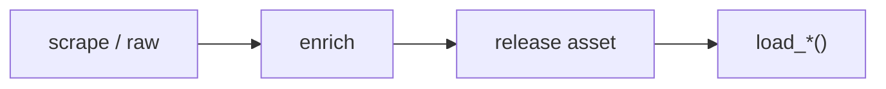

# CFB dataset loaders



## Automation status

| Dataset | Release tag | Pipeline |
|---|---|---|
| `load_cfb_pbp` | [espn_cfb_pbp](https://github.com/sportsdataverse/sportsdataverse-data/releases/tag/espn_cfb_pbp) | — |
| `load_cfb_ratings` | [cfb_ratings](https://github.com/sportsdataverse/sportsdataverse-data/releases/tag/cfb_ratings) | — |
| `load_cfb_recruiting_proj` | [cfb_recruiting_proj](https://github.com/sportsdataverse/sportsdataverse-data/releases/tag/cfb_recruiting_proj) | — |
| `load_cfb_recruits` | [cfb_recruits](https://github.com/sportsdataverse/sportsdataverse-data/releases/tag/cfb_recruits) | — |
| `load_cfb_returning_production` | [cfb_returning_production](https://github.com/sportsdataverse/sportsdataverse-data/releases/tag/cfb_returning_production) | — |
| `load_cfb_rosters` | [cfbfastR-data](https://github.com/sportsdataverse/sportsdataverse-data/releases/tag/cfbfastR-data) | — |
| `load_cfb_schedule` | [cfb_schedules](https://github.com/sportsdataverse/sportsdataverse-data/releases/tag/cfb_schedules) | — |
| `load_cfb_team_info` | [cfbfastR-data](https://github.com/sportsdataverse/sportsdataverse-data/releases/tag/cfbfastR-data) | — |
| `load_cfb_team_talent` | [cfb_team_talent](https://github.com/sportsdataverse/sportsdataverse-data/releases/tag/cfb_team_talent) | — |
| `load_cfb_teams_crosswalk` | [cfb_crosswalk](https://github.com/sportsdataverse/sportsdataverse-data/releases/tag/cfb_crosswalk) | — |
| `load_cfb_schedule_crosswalk` | [cfb_crosswalk](https://github.com/sportsdataverse/sportsdataverse-data/releases/tag/cfb_crosswalk) | — |
| `load_cfb_team_box` | [espn_cfb_team_box](https://github.com/sportsdataverse/sportsdataverse-data/releases/tag/espn_cfb_team_box) | — |
| `load_cfb_player_box` | [espn_cfb_player_box](https://github.com/sportsdataverse/sportsdataverse-data/releases/tag/espn_cfb_player_box) | — |
| `load_cfb_drives` | [espn_cfb_drives](https://github.com/sportsdataverse/sportsdataverse-data/releases/tag/espn_cfb_drives) | — |
| `load_cfb_play_participants` | [espn_cfb_play_participants](https://github.com/sportsdataverse/sportsdataverse-data/releases/tag/espn_cfb_play_participants) | — |
| `load_cfb_game_rosters` | [espn_cfb_game_rosters](https://github.com/sportsdataverse/sportsdataverse-data/releases/tag/espn_cfb_game_rosters) | — |
| `load_cfb_linescores` | [espn_cfb_linescores](https://github.com/sportsdataverse/sportsdataverse-data/releases/tag/espn_cfb_linescores) | — |
| `load_cfb_betting` | [espn_cfb_betting](https://github.com/sportsdataverse/sportsdataverse-data/releases/tag/espn_cfb_betting) | — |
| `load_cfb_fpi_weekly` | [cfb_fpi_weekly](https://github.com/sportsdataverse/sportsdataverse-data/releases/tag/cfb_fpi_weekly) | — |
| `load_cfb_power_index` | [espn_cfb_power_index](https://github.com/sportsdataverse/sportsdataverse-data/releases/tag/espn_cfb_power_index) | — |
| `load_cfb_adv_team` | [espn_cfb_adv_team](https://github.com/sportsdataverse/sportsdataverse-data/releases/tag/espn_cfb_adv_team) | — |
| `load_cfb_adv_passing` | [espn_cfb_adv_passing](https://github.com/sportsdataverse/sportsdataverse-data/releases/tag/espn_cfb_adv_passing) | — |
| `load_cfb_adv_rushing` | [espn_cfb_adv_rushing](https://github.com/sportsdataverse/sportsdataverse-data/releases/tag/espn_cfb_adv_rushing) | — |
| `load_cfb_adv_receiving` | [espn_cfb_adv_receiving](https://github.com/sportsdataverse/sportsdataverse-data/releases/tag/espn_cfb_adv_receiving) | — |
| `load_cfb_adv_defensive` | [espn_cfb_adv_defensive](https://github.com/sportsdataverse/sportsdataverse-data/releases/tag/espn_cfb_adv_defensive) | — |
| `load_cfb_adv_defensive_players` | [espn_cfb_adv_defensive_players](https://github.com/sportsdataverse/sportsdataverse-data/releases/tag/espn_cfb_adv_defensive_players) | — |
| `load_cfb_adv_drives` | [espn_cfb_adv_drives](https://github.com/sportsdataverse/sportsdataverse-data/releases/tag/espn_cfb_adv_drives) | — |
| `load_cfb_adv_situational` | [espn_cfb_adv_situational](https://github.com/sportsdataverse/sportsdataverse-data/releases/tag/espn_cfb_adv_situational) | — |
| `load_cfb_adv_specialists` | [espn_cfb_adv_specialists](https://github.com/sportsdataverse/sportsdataverse-data/releases/tag/espn_cfb_adv_specialists) | — |
| `load_cfb_adv_turnover` | [espn_cfb_adv_turnover](https://github.com/sportsdataverse/sportsdataverse-data/releases/tag/espn_cfb_adv_turnover) | — |
| `load_cfb_model_pbp` | [espn_cfb_model_pbp](https://github.com/sportsdataverse/sportsdataverse-data/releases/tag/espn_cfb_model_pbp) | — |
| `load_cfb_passing` | [espn_cfb_passing](https://github.com/sportsdataverse/sportsdataverse-data/releases/tag/espn_cfb_passing) | — |
| `load_cfb_percentiles` | [espn_cfb_percentiles](https://github.com/sportsdataverse/sportsdataverse-data/releases/tag/espn_cfb_percentiles) | — |
| `load_cfb_receiving` | [espn_cfb_receiving](https://github.com/sportsdataverse/sportsdataverse-data/releases/tag/espn_cfb_receiving) | — |
| `load_cfb_rushing` | [espn_cfb_rushing](https://github.com/sportsdataverse/sportsdataverse-data/releases/tag/espn_cfb_rushing) | — |
| `load_cfb_team_summaries` | [espn_cfb_team_summaries](https://github.com/sportsdataverse/sportsdataverse-data/releases/tag/espn_cfb_team_summaries) | — |
| `load_cfb_adv_team_gamelog` | [espn_cfb_adv_team_gamelog](https://github.com/sportsdataverse/sportsdataverse-data/releases/tag/espn_cfb_adv_team_gamelog) | — |
| `load_cfb_ratings_weekly` | [cfb_ratings_weekly](https://github.com/sportsdataverse/sportsdataverse-data/releases/tag/cfb_ratings_weekly) | — |
| `load_cfb_team_summaries_weekly` | [cfb_team_summaries_weekly](https://github.com/sportsdataverse/sportsdataverse-data/releases/tag/cfb_team_summaries_weekly) | — |
| `load_cfb_pbp_r` | [cfbfastR_cfb_pbp](https://github.com/sportsdataverse/sportsdataverse-data/releases/tag/cfbfastR_cfb_pbp) | — |

## `load_cfb_pbp`

Release: [espn_cfb_pbp](https://github.com/sportsdataverse/sportsdataverse-data/releases/tag/espn_cfb_pbp) · asset `https://github.com/sportsdataverse/sportsdataverse-data/releases/download/espn_cfb_pbp/play_by_play_{season}.parquet`
### Returns

| col_name | type | description |
|---|---|---|
| `season` | Int64 | Season (4-digit year). |
| `game_id` | Int64 | ESPN game identifier. |
| `game_play_number` | Int64 | Sequential play number within the game (excludes timeouts/end markers). |
| `pos_team` | Int64 | Team name in possession at the start of the play (offense, kickoff-aware). |
| `def_pos_team` | Int64 | Team name on defense at the start of the play. |
| `pos_team_score` | Int64 | Score for the team in possession at the start of the play. |
| `def_pos_team_score` | Int64 | Score for the defensive team at the start of the play. |
| `half` | Int64 | Half indicator (1 or 2). |
| `period` | Int64 | Period (quarter) number. |
| `down` | Int64 | Down of the play (1-4). |
| `distance` | Int64 | Yards to gain for a first down (or to the goal line in goal-to-go situations). |
| `EPA` | Float64 | Expected Points Added on the play (cfbfastR EPA model output). |
| `wpa` | Float64 | Win Probability Added on the play (cfbfastR WP model output). |
| `wp_before` | Float64 | Win probability for the possession team before the play (0-1). |
| `wp_after` | Float64 | Win probability for the possession team after the play (0-1). |
| `def_wp_before` | Float64 | Win probability for the defensive team before the play (0-1). |
| `def_wp_after` | Float64 | Win probability for the defensive team after the play (0-1). |
| `penalty_detail` | String | Parsed penalty description extracted from play text. |
| `yds_penalty` | String | Yardage assessed on the penalty. |
| `penalty_1st_conv` | Boolean | TRUE when the penalty resulted in a first down conversion. |
| `def_EPA` | Float64 | EPA for the defensive team on the play (sign-flipped offense EPA). |
| `rz_play` | Boolean | Binary flag for a red-zone play (yards_to_goal <= 20). |
| `scoring_opp` | Boolean | Binary flag for a scoring opportunity (yards_to_goal <= 40). |
| `middle_8` | Boolean | TRUE for plays in the middle-8 window (final 4 min of 1H, first 4 min of 2H). |
| `stuffed_run` | Boolean | Binary flag for a stuffed run (zero or negative yards gained). |
| `change_of_pos_team` | Boolean | Binary flag for change of possession-team on the play. |
| `downs_turnover` | Boolean | Binary flag for a turnover on downs. |
| `pos_score_diff_start` | Int64 | Score differential for the possession team at the start of the play. |
| `pos_score_pts` | Int64 | Points scored on the play attributed to the possession team. |
| `home_wp_before` | Float64 | Home team win probability before the play (0-1). |
| `away_wp_before` | Float64 | Away team win probability before the play (0-1). |
| `home_wp_after` | Float64 | Home team win probability after the play (0-1). |
| `away_wp_after` | Float64 | Away team win probability after the play (0-1). |
| `end_of_half` | Boolean | Binary flag for the last play of a half. |
| `lead_pos_team` | Int64 | Value of pos_team on the next play, used for sequence-aware derivations. |
| `lead_play_type` | String | Value of play_type on the next play, used for sequence-aware derivations. |
| `lag_pos_team` | Int64 | Value of pos_team on the previous play, used for sequence-aware derivations. |
| `orig_play_type` | String | Original CFBD play type label before cfbfastR cleaning. |
| `offense_score_play` | Boolean | Binary flag for an offensive scoring play. |
| `defense_score_play` | Boolean | Binary flag for a defensive scoring play. |
| `pos_score_diff` | Int64 | Score differential from the possession team's perspective. |
| `change_of_poss` | Boolean | Binary flag for change of possession on the play (CFBD offense field). |
| `rusher_player_name` | String | Name of the rusher on a rushing play. |
| `yds_rushed` | Int64 | Rushing yards gained on the play. |
| `passer_player_name` | String | Name of the passer on a passing play. |
| `receiver_player_name` | String | Name of the receiver on a passing play. |
| `yds_receiving` | Int64 | Receiving yards gained on the play. |
| `yds_sacked` | Int64 | Yards lost on the sack. |
| `sack_players` | String | Combined names of all sack participants. |
| `sack_player_name` | String | Primary sack player name. |
| `sack_player_name2` | String | Secondary sack player name (when split between two defenders). |
| `pass_breakup_player_name` | String | Name of the defender credited with the pass breakup. |
| `interception_player_name` | String | Name of the defender credited with the interception. |
| `yds_int_return` | Int64 | Yards gained on an interception return. |
| `fumble_player_name` | String | Name of the player who fumbled. |
| `fumble_forced_player_name` | String | Name of the player who forced the fumble. |
| `fumble_recovered_player_name` | String | Name of the player who recovered the fumble. |
| `yds_fumble_return` | Int64 | Yards gained on a fumble return. |
| `punter_player_name` | String | Name of the punter. |
| `yds_punted` | Int64 | Yards the ball traveled on the punt. |
| `yds_punt_return` | Int64 | Yards gained on the punt return. |
| `yds_punt_gained` | Int64 | Net yards gained on the punt (punt distance minus return). |
| `punt_block_player_name` | String | Name of the player credited with blocking the punt. |
| `punt_block_return_player_name` | String | Name of the player returning a blocked punt. |
| `fg_kicker_player_name` | String | Name of the field goal kicker. |
| `yds_fg` | Int64 | Distance of the field goal attempt in yards. |
| `fg_block_player_name` | String | Name of the player credited with blocking the field goal. |
| `fg_return_player_name` | String | Name of the player returning the blocked/missed field goal. |
| `kickoff_player_name` | String | Name of the kickoff specialist. |
| `yds_kickoff` | Int64 | Yards the ball traveled on the kickoff. |
| `yds_kickoff_return` | Int64 | Yards gained on the kickoff return. |
| `rush` | Boolean | Binary flag for a rushing play. |
| `rush_td` | Boolean | Binary flag for a rushing touchdown. |
| `pass` | Boolean | Binary flag for a passing play (includes sacks). |
| `pass_td` | Boolean | Binary flag for a passing touchdown. |
| `completion` | Boolean | Binary flag for a completed pass. |
| `pass_attempt` | Boolean | Binary flag for a pass attempt. |
| `target` | Boolean | Binary flag for a targeted receiver on the play. |
| `sack_vec` | Boolean | Binary flag for a sack play. |
| `sack` | Boolean | Binary flag for a sack (duplicate of sack_vec for downstream use). |
| `int` | Boolean | Binary flag for an interception. |
| `int_td` | Boolean | Binary flag for an interception returned for a touchdown. |
| `turnover_vec` | Boolean | Binary flag for any play classified as a turnover. |
| `kickoff_play` | Boolean | Binary flag for a kickoff play. |
| `scoring_play` | Boolean | `TRUE` if the play resulted in a score. |
| `td_play` | Boolean | Binary flag for a touchdown play. |
| `touchdown` | Boolean | Binary flag for a touchdown (duplicate of td_play for downstream use). |
| `safety` | Boolean | Binary flag for a safety. |
| `fumble_vec` | Boolean | Binary flag for a play involving a fumble. |
| `kickoff_tb` | Boolean | Binary flag for a kickoff touchback. |
| `kickoff_onside` | Boolean | Binary flag for an onside kickoff attempt. |
| `kickoff_oob` | Boolean | Binary flag for a kickoff out of bounds. |
| `kickoff_fair_catch` | Boolean | Binary flag for a kickoff fair catch. |
| `kickoff_downed` | Boolean | Binary flag for a kickoff downed in the field of play. |
| `kickoff_safety` | Boolean | Binary flag for a kickoff safety. |
| `kick_play` | Boolean | Binary flag for any kicking play (kickoff or field goal). |
| `punt` | Boolean | Binary flag for a punt play. |
| `punt_play` | Boolean | Binary flag for any punt-related play (includes blocks/returns). |
| `punt_tb` | Boolean | Binary flag for a punt touchback. |
| `punt_oob` | Boolean | Binary flag for a punt out of bounds. |
| `punt_fair_catch` | Boolean | Binary flag for a punt fair catch. |
| `punt_downed` | Boolean | Binary flag for a punt downed in the field of play. |
| `punt_safety` | Boolean | Binary flag for a punt safety. |
| `punt_blocked` | Boolean | Binary flag for a blocked punt. |
| `penalty_safety` | Boolean | Binary flag for a safety scored on a penalty. |
| `fg_made` | Boolean | TRUE when the field goal attempt was successful. |
| `fg_make_prob` | Float64 | Predicted probability of making the field goal (cfbfastR FG model, 0-1). |
| `penalty_flag` | Boolean | TRUE when a penalty was flagged on the play. |
| `penalty_declined` | Boolean | TRUE when the penalty was declined. |
| `penalty_no_play` | Boolean | TRUE when the penalty nullified the play (no play counted). |
| `penalty_offset` | Boolean | TRUE when offsetting penalties were called. |
| `penalty_text` | String | TRUE when penalty information is detectable in the play text. |
| `lead_wp_before2` | Float64 | Value of wp_before 2 plays ahead, used for sequence-aware derivations. |
| `lead_wp_before` | Float64 | Value of wp_before on the next play, used for sequence-aware derivations. |
| `lead_pos_team2` | Int64 | Value of pos_team 2 plays ahead, used for sequence-aware derivations. |
| `lag_change_of_pos_team` | Boolean | Value of change_of_pos_team on the previous play, used for sequence-aware derivations. |
| `lag_pos_score_diff` | Int64 | Value of pos_score_diff on the previous play, used for sequence-aware derivations. |
| `id` | Int64 | 247Sports referencing id for the recruit. |
| `sequenceNumber` | Int64 | Broadcast sequence order number. |
| `text` | String | Full play description. |
| `awayScore` | Int64 | Away team score after the goal. |
| `homeScore` | Int64 | Home team score after the goal. |
| `scoringPlay` | Boolean | ESPN flag marking the play as a scoring play. |
| `priority` | Boolean | `TRUE` if ESPN flags the play as a priority highlight. |
| `modified` | String | ISO timestamp the play record was last modified. |
| `wallclock` | String | Real-world ISO timestamp of the play. |
| `teamParticipants` | String |  |
| `isPenalty` | Boolean |  |
| `statYardage` | Int64 | Yardage ESPN credits to the play for statistical purposes. |
| `isTurnover` | Boolean |  |
| `type.id` | String | ESPN's numeric identifier for the play type. |
| `type.text` | String | ESPN's text label for the play type. |
| `type.abbreviation` | String | ESPN's abbreviation for the play type. |
| `period.number` | Int64 | Period (quarter) number in which the play occurred. |
| `clock.displayValue` | String | Game clock at the play, as the displayed mm:ss string. |
| `start.down` | Int64 | ESPN's `down` value for the play state at the start of the play. |
| `start.distance` | Int64 | ESPN's `distance` value for the play state at the start of the play. |
| `start.yardLine` | Int64 | ESPN's `yardLine` value for the play state at the start of the play. |
| `start.yardsToEndzone` | Int64 | ESPN's `yardsToEndzone` value for the play state at the start of the play. |
| `start.team.id` | Int64 | ESPN's `team.id` value for the play state at the start of the play. |
| `end.down` | Int64 | ESPN's `down` value for the play state at the end of the play. |
| `end.distance` | Int64 | ESPN's `distance` value for the play state at the end of the play. |
| `end.yardLine` | Int64 | ESPN's `yardLine` value for the play state at the end of the play. |
| `end.yardsToEndzone` | Int64 | ESPN's `yardsToEndzone` value for the play state at the end of the play. |
| `end.downDistanceText` | String | ESPN's `downDistanceText` value for the play state at the end of the play. |
| `end.shortDownDistanceText` | String | ESPN's `shortDownDistanceText` value for the play state at the end of the play. |
| `end.possessionText` | String | ESPN's `possessionText` value for the play state at the end of the play. |
| `end.team.id` | Int64 | ESPN's `team.id` value for the play state at the end of the play. |
| `start.downDistanceText` | String | ESPN's `downDistanceText` value for the play state at the start of the play. |
| `start.shortDownDistanceText` | String | ESPN's `shortDownDistanceText` value for the play state at the start of the play. |
| `start.possessionText` | String | ESPN's `possessionText` value for the play state at the start of the play. |
| `scoringType.name` | String | ESPN's name for the scoring type (e.g. touchdown, field goal). |
| `scoringType.displayName` | String | ESPN's display label for the scoring type. |
| `scoringType.abbreviation` | String | ESPN's abbreviation for the scoring type. |
| `pointAfterAttempt.id` | Float64 |  |
| `pointAfterAttempt.text` | String |  |
| `pointAfterAttempt.abbreviation` | String |  |
| `pointAfterAttempt.value` | Float64 |  |
| `drive.id` | String | ESPN's `id` field for the drive containing this play. |
| `drive.displayResult` | String | ESPN's `displayResult` field for the drive containing this play. |
| `drive.isScore` | Boolean | ESPN's `isScore` field for the drive containing this play. |
| `drive.team.shortDisplayName` | String | ESPN's `team.shortDisplayName` field for the drive containing this play. |
| `drive.team.displayName` | String | ESPN's `team.displayName` field for the drive containing this play. |
| `drive.team.name` | String | ESPN's `team.name` field for the drive containing this play. |
| `drive.team.abbreviation` | String | ESPN's `team.abbreviation` field for the drive containing this play. |
| `drive.yards` | Int64 | ESPN's `yards` field for the drive containing this play. |
| `drive.offensivePlays` | Int64 | ESPN's `offensivePlays` field for the drive containing this play. |
| `drive.result` | String | ESPN's `result` field for the drive containing this play. |
| `drive.description` | String | ESPN's `description` field for the drive containing this play. |
| `drive.shortDisplayResult` | String | ESPN's `shortDisplayResult` field for the drive containing this play. |
| `drive.timeElapsed.displayValue` | String | ESPN's `timeElapsed.displayValue` field for the drive containing this play. |
| `drive.start.period.number` | Int64 | ESPN's `start.period.number` field for the drive containing this play. |
| `drive.start.period.type` | String | ESPN's `start.period.type` field for the drive containing this play. |
| `drive.start.yardLine` | Int64 | ESPN's `start.yardLine` field for the drive containing this play. |
| `drive.start.clock.displayValue` | String | ESPN's `start.clock.displayValue` field for the drive containing this play. |
| `drive.start.text` | String | ESPN's `start.text` field for the drive containing this play. |
| `drive.end.period.number` | Int64 | ESPN's `end.period.number` field for the drive containing this play. |
| `drive.end.period.type` | String | ESPN's `end.period.type` field for the drive containing this play. |
| `drive.end.yardLine` | Int64 | ESPN's `end.yardLine` field for the drive containing this play. |
| `drive.end.clock.displayValue` | String | ESPN's `end.clock.displayValue` field for the drive containing this play. |
| `seasonType` | Int64 | ESPN season type for the game (2 = regular season, 3 = postseason). |
| `week` | Int64 | Game week of the season. |
| `status_type_completed` | Boolean | Whether the game is complete. |
| `homeTeamId` | Int64 | ESPN's home-team Id for the game, stamped on every play. |
| `awayTeamId` | Int64 | ESPN's away-team Id for the game, stamped on every play. |
| `homeTeamName` | String | ESPN's home-team Name for the game, stamped on every play. |
| `awayTeamName` | String | ESPN's away-team Name for the game, stamped on every play. |
| `homeTeamMascot` | String | ESPN's home-team Mascot for the game, stamped on every play. |
| `awayTeamMascot` | String | ESPN's away-team Mascot for the game, stamped on every play. |
| `homeTeamAbbrev` | String | ESPN's home-team Abbrev for the game, stamped on every play. |
| `awayTeamAbbrev` | String | ESPN's away-team Abbrev for the game, stamped on every play. |
| `homeTeamNameAlt` | String | ESPN's home-team NameAlt for the game, stamped on every play. |
| `awayTeamNameAlt` | String | ESPN's away-team NameAlt for the game, stamped on every play. |
| `gameSpread` | Float64 | Point spread used as an input to the win-probability model. |
| `homeFavorite` | Boolean | True when the home team was favoured by the spread. |
| `gameSpreadAvailable` | Boolean | True when a spread was available for the game. |
| `overUnder` | Float64 | Over/under total used as a model input. |
| `homeTeamSpread` | Float64 | ESPN's home-team Spread for the game, stamped on every play. |
| `clock.minutes` | Int64 | Minutes remaining on the game clock at the play. |
| `clock.seconds` | Int64 | Seconds component of the game clock at the play. |
| `lag_half` | Int64 | Value of half on the previous play, used for sequence-aware derivations. |
| `lead_half` | Int64 | Value of half on the next play, used for sequence-aware derivations. |
| `start.TimeSecsRem` | Int64 | ESPN's `TimeSecsRem` value for the play state at the start of the play. |
| `start.adj_TimeSecsRem` | Int64 | ESPN's `adj_TimeSecsRem` value for the play state at the start of the play. |
| `lead_text` | String | Value of text on the next play, used for sequence-aware derivations. |
| `lead_start_team` | String | Value of start_team on the next play, used for sequence-aware derivations. |
| `lead_start_yardsToEndzone` | Int64 | Value of start_yardsToEndzone on the next play, used for sequence-aware derivations. |
| `lead_start_down` | Int64 | Value of start_down on the next play, used for sequence-aware derivations. |
| `lead_start_distance` | Int64 | Value of start_distance on the next play, used for sequence-aware derivations. |
| `lead_scoringPlay` | Boolean | Value of scoringPlay on the next play, used for sequence-aware derivations. |
| `text_dupe` | Boolean | True when the play description duplicates the previous row's text. |
| `end_state_missing` | Boolean |  |
| `start.pos_team.id` | Int64 | ESPN's `pos_team.id` value for the play state at the start of the play. |
| `start.def_pos_team.id` | Int64 | ESPN's `def_pos_team.id` value for the play state at the start of the play. |
| `end.def_pos_team.id` | Int64 | ESPN's `def_pos_team.id` value for the play state at the end of the play. |
| `end.pos_team.id` | Int64 | ESPN's `pos_team.id` value for the play state at the end of the play. |
| `start.pos_team.name` | String | ESPN's `pos_team.name` value for the play state at the start of the play. |
| `start.def_pos_team.name` | String | ESPN's `def_pos_team.name` value for the play state at the start of the play. |
| `end.pos_team.name` | String | ESPN's `pos_team.name` value for the play state at the end of the play. |
| `end.def_pos_team.name` | String | ESPN's `def_pos_team.name` value for the play state at the end of the play. |
| `start.is_home` | Boolean | ESPN's `is_home` value for the play state at the start of the play. |
| `end.is_home` | Boolean | ESPN's `is_home` value for the play state at the end of the play. |
| `homeTimeoutCalled` | Boolean | True when the home team called a timeout on the play. |
| `awayTimeoutCalled` | Boolean | True when the away team called a timeout on the play. |
| `end.homeTeamTimeouts` | Int64 | ESPN's `homeTeamTimeouts` value for the play state at the end of the play. |
| `end.awayTeamTimeouts` | Int64 | ESPN's `awayTeamTimeouts` value for the play state at the end of the play. |
| `start.homeTeamTimeouts` | Int64 | ESPN's `homeTeamTimeouts` value for the play state at the start of the play. |
| `start.awayTeamTimeouts` | Int64 | ESPN's `awayTeamTimeouts` value for the play state at the start of the play. |
| `end.TimeSecsRem` | Int64 | ESPN's `TimeSecsRem` value for the play state at the end of the play. |
| `end.adj_TimeSecsRem` | Int64 | ESPN's `adj_TimeSecsRem` value for the play state at the end of the play. |
| `start.posTeamTimeouts` | Int64 | ESPN's `posTeamTimeouts` value for the play state at the start of the play. |
| `start.defPosTeamTimeouts` | Int64 | ESPN's `defPosTeamTimeouts` value for the play state at the start of the play. |
| `end.posTeamTimeouts` | Int64 | ESPN's `posTeamTimeouts` value for the play state at the end of the play. |
| `end.defPosTeamTimeouts` | Int64 | ESPN's `defPosTeamTimeouts` value for the play state at the end of the play. |
| `firstHalfKickoffTeamId` | Int64 | ESPN id of the team that received the opening kickoff. |
| `start.yard` | Int64 | ESPN's `yard` value for the play state at the start of the play. |
| `end.yard` | Int64 | ESPN's `yard` value for the play state at the end of the play. |
| `lag_scoringPlay` | Boolean | Value of scoringPlay on the previous play, used for sequence-aware derivations. |
| `down_1` | Boolean | True when it is 1st down at the start of the play. |
| `down_2` | Boolean | True when it is 2nd down at the start of the play. |
| `down_3` | Boolean | True when it is 3rd down at the start of the play. |
| `down_4` | Boolean | True when it is 4th down at the start of the play. |
| `down_1_end` | Boolean | True when it is 1st down at the end of the play. |
| `down_2_end` | Boolean | True when it is 2nd down at the end of the play. |
| `down_3_end` | Boolean | True when it is 3rd down at the end of the play. |
| `down_4_end` | Boolean | True when it is 4th down at the end of the play. |
| `td_check` | Boolean | Internal flag used while reconciling whether the play produced a touchdown. |
| `forced_fumble` | Boolean | True when the defense forced a fumble on the play. |
| `is_home` | Boolean | Whether the subject team was the home team. |
| `lag_HA_score_diff` | Int64 | Value of HA_score_diff on the previous play, used for sequence-aware derivations. |
| `HA_score_diff` | Int64 | Home score minus away score for the play. |
| `net_HA_score_pts` | Int64 | Net points the play added to the home-minus-away score margin. |
| `H_score_diff` | Int64 | Home team's score minus the away team's, from the home perspective. |
| `A_score_diff` | Int64 | Away team's score minus the home team's, from the away perspective. |
| `lag_homeScore` | Int64 | Value of homeScore on the previous play, used for sequence-aware derivations. |
| `lag_awayScore` | Int64 | Value of awayScore on the previous play, used for sequence-aware derivations. |
| `start.homeScore` | Int64 | ESPN's `homeScore` value for the play state at the start of the play. |
| `start.awayScore` | Int64 | ESPN's `awayScore` value for the play state at the start of the play. |
| `end.homeScore` | Int64 | ESPN's `homeScore` value for the play state at the end of the play. |
| `end.awayScore` | Int64 | ESPN's `awayScore` value for the play state at the end of the play. |
| `start.pos_team_score` | Int64 | ESPN's `pos_team_score` value for the play state at the start of the play. |
| `start.def_pos_team_score` | Int64 | ESPN's `def_pos_team_score` value for the play state at the start of the play. |
| `start.pos_score_diff` | Int64 | ESPN's `pos_score_diff` value for the play state at the start of the play. |
| `end.pos_team_score` | Int64 | ESPN's `pos_team_score` value for the play state at the end of the play. |
| `end.def_pos_team_score` | Int64 | ESPN's `def_pos_team_score` value for the play state at the end of the play. |
| `end.pos_score_diff` | Int64 | ESPN's `pos_score_diff` value for the play state at the end of the play. |
| `start.pos_team_receives_2H_kickoff` | Boolean | ESPN's `pos_team_receives_2H_kickoff` value for the play state at the start of the play. |
| `end.pos_team_receives_2H_kickoff` | Boolean | ESPN's `pos_team_receives_2H_kickoff` value for the play state at the end of the play. |
| `penalty_in_text` | Boolean | True when the play description mentions a penalty. |
| `pass_breakup` | Boolean | True when a defender broke up the pass. |
| `pass_depth` | String |  |
| `pass_direction` | String |  |
| `rush_direction` | String |  |
| `qb_hurry` | Boolean |  |
| `fg_attempt` | Boolean | True when the play was a field-goal attempt. |
| `pos_unit` | String | Possession-team unit label (offense or special teams). |
| `def_pos_unit` | String | Defensive possession-team unit label (defense or special teams). |
| `sp` | Boolean | Binary indicator for whether or not a score occurred on the play. |
| `play` | Boolean | Binary flag indicating the row is a counted play (excludes end markers/timeouts/penalties). |
| `cleaned_text` | String |  |
| `kneel_down` | Boolean |  |
| `scrimmage_play` | Boolean | True when the play is a play from scrimmage rather than a special-teams or administrative row. |
| `pos_score_diff_end` | Int64 | Score differential from the possessing team's perspective at the end of the play. |
| `fumble_lost` | Boolean | Binary indicator for if the fumble was lost. |
| `fumble_recovered` | Boolean | True when a fumble on the play was recovered. |
| `field_goal_result` | String | String indicator for result of field goal attempt: made, missed, or blocked. |
| `extra_point_result` | String | String indicator for the result of the extra point attempt: good, failed, blocked, safety (touchback in defensive endzone is 1 point apparently), or aborted. |
| `two_point_conv_result` | String | String indicator for result of two point conversion attempt: success, failure, safety (touchback in defensive endzone is 1 point apparently), or return. |
| `air_yardsToEndzone` | Int64 |  |
| `air_yards` | Int64 | Numeric value for distance in yards perpendicular to the line of scrimmage at where the targeted receiver either caught or didn't catch the ball. |
| `yards_after_catch` | Int64 | Numeric value for distance in yards perpendicular to the yard line where the receiver made the reception to where the play ended. |
| `kicking_team` | Int64 |  |
| `return_team` | Int64 | String abbreviation of the return team. Returns may occur on any of: interception, fumble, kickoff, punt, or blocked kicks. |
| `fumble_or_muff` | Boolean |  |
| `recovery_team` | Int64 |  |
| `recovery_team_2` | Int64 |  |
| `fumbling_team` | Int64 |  |
| `int_turnover` | Boolean |  |
| `pos_fumble_lost` | Boolean |  |
| `def_fumble_lost` | Boolean |  |
| `is_pos_team_turnover` | Boolean |  |
| `is_def_pos_team_turnover` | Boolean |  |
| `is_turnover` | Boolean | `TRUE` if the play was a turnover. |
| `turnover_team` | Int64 |  |
| `is_st_turnover` | Boolean |  |
| `is_blocked_punt_turnover` | Boolean |  |
| `is_blocked_fg_turnover` | Boolean |  |
| `sack_team` | Int64 |  |
| `interception_team` | Int64 |  |
| `pass_breakup_team` | Int64 |  |
| `forced_fumble_team` | Int64 |  |
| `fumble_recovery_team` | Int64 |  |
| `punt_return_team` | Int64 |  |
| `kick_return_team` | Int64 |  |
| `fg_team` | Int64 |  |
| `punt_team` | Int64 |  |
| `penalized_team` | Int64 |  |
| `penalty_yards_signed` | Int64 |  |
| `new_down` | Int64 | Down after the play, including any penalty enforcement. |
| `new_distance` | Int64 | Distance to go after the play, including any penalty enforcement. |
| `under_2` | Boolean |  |
| `goal_to_go` | Boolean | Binary indicator for whether or not the posteam is in a goal down situation. |
| `stopped_run` | Boolean | True when the rush was stopped at or behind the line of scrimmage. |
| `opportunity_run` | Boolean | True when a rush reached 4 yards -- the carries on which the blocking did its job. Matches cfbfastR's espn_cfb_15 definition. Assets published before the 2026-08 fix carry the inverted (4 yards or fewer) flag. |
| `highlight_run` | Boolean | True when the rush gained 8 or more yards. |
| `adj_rush_yardage` | Int64 | Rushing yards capped at 8, the input to the line-yards decomposition. |
| `line_yards` | Float64 | Yards credited to the offensive line on a rush, using the standard sliding scale: 1.2x the capped yardage on a loss, all of it through 3 yards, half of each yard from 4 to 8, and a 5.5-yard ceiling beyond that. |
| `second_level_yards` | Float64 | Rushing yards earned from 4 to 8, split evenly between line and carrier under the line-yards decomposition. |
| `open_field_yards` | Int64 | Rushing yards gained beyond 8, credited to the ball carrier rather than the line. |
| `highlight_yards` | Float64 | Second-level plus open-field yards -- the yardage credited to the carrier. |
| `opp_highlight_yards` | Float64 | Highlight yards earned on opportunity runs, isolating carrier production on carries where the blocking succeeded. Assets published before the 2026-08 fix are identically 0 here, because the inverted opportunity_run gate could never co-occur with non-zero highlight yards. |
| `short_rush_success` | Boolean | True when a short-yardage rush gained the yardage needed. |
| `short_rush_attempt` | Boolean | True when the play is a rush in a short-yardage situation. |
| `power_rush_success` | Boolean | True when a power rushing attempt gained the yardage needed. |
| `power_rush_attempt` | Boolean | True when the play is a short-yardage power rushing attempt. |
| `early_down` | Boolean | True when the play is a scrimmage play on first or second down. |
| `late_down` | Boolean | True when the play is a scrimmage play on third or fourth down. |
| `early_down_pass` | Boolean | True when the play is a pass on an early down. |
| `early_down_rush` | Boolean | True when the play is a rush on an early down. |
| `late_down_pass` | Boolean | True when the play is a pass on a late down. |
| `late_down_rush` | Boolean | True when the play is a rush on a late down. |
| `standard_down` | Boolean | True when the offense is on schedule for the series -- first down, second down needing fewer than 8, or third/fourth down needing fewer than 5. |
| `passing_down` | Boolean | True when the offense is behind schedule for the series -- second down needing 8 or more, or third/fourth down needing 5 or more. |
| `TFL` | Boolean | True when the play was a tackle for loss. |
| `TFL_pass` | Boolean | True when the play was a tackle for loss on a pass play (a sack). |
| `TFL_rush` | Boolean | True when the play was a tackle for loss on a rush play. |
| `havoc` | Boolean | True when the defense disrupted the play: a pass breakup, tackle for loss, interception or forced fumble. |
| `start.pos_team_spread` | Float64 | ESPN's `pos_team_spread` value for the play state at the start of the play. |
| `start.elapsed_share` | Float64 | ESPN's `elapsed_share` value for the play state at the start of the play. |
| `start.spread_time` | Float64 | ESPN's `spread_time` value for the play state at the start of the play. |
| `end.pos_team_spread` | Float64 | ESPN's `pos_team_spread` value for the play state at the end of the play. |
| `end.elapsed_share` | Float64 | ESPN's `elapsed_share` value for the play state at the end of the play. |
| `end.spread_time` | Float64 | ESPN's `spread_time` value for the play state at the end of the play. |
| `penalty_assessed_on_kickoff` | Boolean |  |
| `start.yardsToEndzone.touchback` | Int64 | ESPN's `yardsToEndzone.touchback` value for the play state at the start of the play. |
| `EP_start_touchback` | Float64 | Expected points the offense would have had from a touchback on this play. |
| `EP_start` | Float64 | Expected points for the offense at the start of the play. |
| `EP_end` | Float64 | Expected points for the offense at the end of the play. |
| `lag_EP_end` | Float64 | Value of EP_end on the previous play, used for sequence-aware derivations. |
| `EP_between` | Float64 | Change in expected points across the play, before penalty adjustment. |
| `EPA_scrimmage` | Float64 | EPA credited to the play on plays from scrimmage. |
| `EPA_rush` | Float64 | EPA credited to the play on rush plays. |
| `EPA_pass` | Float64 | EPA credited to the play on pass plays. |
| `EPA_explosive` | Boolean | True when the play was explosive. |
| `EPA_non_explosive` | Float64 | EPA credited to the play on non-explosive plays. |
| `EPA_explosive_pass` | Boolean | True when the pass play was explosive. |
| `EPA_explosive_rush` | Boolean | True when the rush play was explosive. |
| `first_down_created` | Boolean | True when the play produced a first down for the offense. |
| `EPA_success` | Boolean | True when the play was successful by EPA. |
| `EPA_success_early_down` | Boolean | True when the play on an early down was successful by EPA. |
| `EPA_success_early_down_pass` | Boolean | True when the pass play on an early down was successful by EPA. |
| `EPA_success_early_down_rush` | Boolean | True when the rush play on an early down was successful by EPA. |
| `EPA_success_late_down` | Boolean | True when the play on a late down was successful by EPA. |
| `EPA_success_late_down_pass` | Boolean | True when the pass play on a late down was successful by EPA. |
| `EPA_success_late_down_rush` | Boolean | True when the rush play on a late down was successful by EPA. |
| `EPA_success_standard_down` | Boolean | True when the play on a standard down was successful by EPA. |
| `EPA_success_passing_down` | Boolean | True when the play on a passing down was successful by EPA. |
| `EPA_success_pass` | Boolean | True when the pass play was successful by EPA. |
| `EPA_success_rush` | Boolean | True when the rush play was successful by EPA. |
| `EPA_success_EPA` | Float64 | EPA on successful plays. |
| `EPA_success_standard_down_EPA` | Float64 | EPA on successful plays on a standard down. |
| `EPA_success_passing_down_EPA` | Float64 | EPA on successful plays on a passing down. |
| `EPA_success_pass_EPA` | Float64 | EPA on successful pass plays. |
| `EPA_success_rush_EPA` | Float64 | EPA on successful rush plays. |
| `EPA_middle_8_success` | Boolean | True when the play in the middle eight was successful by EPA. |
| `EPA_middle_8_success_pass` | Boolean | True when the pass play in the middle eight was successful by EPA. |
| `EPA_middle_8_success_rush` | Boolean | True when the rush play in the middle eight was successful by EPA. |
| `EPA_penalty` | Float64 | EPA credited to the play attributable to penalties. |
| `EPA_sp` | Float64 | EPA credited to the play on special-teams plays. |
| `EPA_fg` | Float64 | EPA credited to the play on field-goal attempts. |
| `EPA_punt` | Float64 | EPA credited to the play on punt plays. |
| `EPA_kickoff` | Float64 | EPA credited to the play on kickoff plays. |
| `start.ExpScoreDiff_touchback` | Float64 | ESPN's `ExpScoreDiff_touchback` value for the play state at the start of the play. |
| `start.ExpScoreDiff` | Float64 | ESPN's `ExpScoreDiff` value for the play state at the start of the play. |
| `start.ExpScoreDiff_Time_Ratio_touchback` | Float64 | ESPN's `ExpScoreDiff_Time_Ratio_touchback` value for the play state at the start of the play. |
| `start.ExpScoreDiff_Time_Ratio` | Float64 | ESPN's `ExpScoreDiff_Time_Ratio` value for the play state at the start of the play. |
| `end.ExpScoreDiff` | Float64 | ESPN's `ExpScoreDiff` value for the play state at the end of the play. |
| `end.ExpScoreDiff_Time_Ratio` | Float64 | ESPN's `ExpScoreDiff_Time_Ratio` value for the play state at the end of the play. |
| `wp_touchback` | Float64 | Win probability the offense would have had starting from a touchback. |
| `wp_before_naive` | Float64 |  |
| `wp_touchback_naive` | Float64 |  |
| `wp_after_naive` | Float64 |  |
| `def_wp_before_naive` | Float64 |  |
| `home_wp_before_naive` | Float64 |  |
| `away_wp_before_naive` | Float64 |  |
| `lead_wp_before_naive` | Float64 |  |
| `lead_wp_before2_naive` | Float64 |  |
| `def_wp_after_naive` | Float64 |  |
| `home_wp_after_naive` | Float64 |  |
| `away_wp_after_naive` | Float64 |  |
| `wpa_naive` | Float64 |  |
| `cp` | Float64 | Numeric value indicating the probability for a complete pass based on comparable game situations. |
| `cpoe` | Float64 | For a single pass play this is 1 - cp when the pass was completed or 0 - cp when the pass was incomplete. Analyzed for a whole game or season an indicator for the passer how much over or under expectation his completion percentage was. |
| `era` | Int64 | one of pre2018 (2006-2017) or post2018 (2018+) |
| `xpass` | Float64 | Probability of dropback scaled from 0 to 1. |
| `pass_oe` | Float64 | Dropback percent over expected on a given play scaled from 0 to 100. |
| `drive_start` | Float64 | Yard line at which the drive began. |
| `drive_stopped` | Boolean | True when the play ended the drive. |
| `drive_play_index` | Int64 | Sequence number of the play within its drive. |
| `drive_offense_plays` | Int64 | Offensive plays run on the drive. |
| `prog_drive_EPA` | Float64 | Cumulative EPA accrued by the drive up to and including this play. |
| `prog_drive_WPA` | Float64 | Cumulative win-probability added by the drive up to and including this play. |
| `drive_offense_yards` | Int64 | Offensive yards gained on the drive. |
| `drive_total_yards` | Int64 | Total yards gained on the drive. |
| `qbr_epa` | Float64 | EPA variant used as an input to the QBR calculation. |
| `weight` | Float64 | Listed weight (lbs). |
| `non_fumble_sack` | Boolean | True when the play was a sack that did not produce a fumble. |
| `sack_epa` | Float64 | EPA credited to the play when it is a sack. |
| `pass_epa` | Float64 | EPA credited to the play when it is a pass. |
| `rush_epa` | Float64 | EPA credited to the play when it is a rush. |
| `pen_epa` | Float64 | EPA attributable to a penalty on the play. |
| `sack_weight` | Float64 | Weighting applied to the sack component of the play. |
| `pass_weight` | Float64 | Weighting applied to the pass component of the play. |
| `rush_weight` | Float64 | Weighting applied to the rush component of the play. |
| `pen_weight` | Float64 | Weighting applied to the penalty component of the play. |
| `action_play` | Boolean | True when the play advanced the game state -- excludes timeouts, end-of-period markers and other non-action rows. |
| `athlete_name` | String | Player full name. |
| `rusher_player_id` | Int64 | Unique identifier for the player that attempted the run. |
| `passer_player_id` | Int64 | Unique identifier for the player that attempted the pass. |
| `receiver_player_id` | Int64 | Unique identifier for the receiver that was targeted on the pass. |
| `fumble_player_id` | Int64 | CFBD athlete_id of the player who fumbled. |
| `sack_player_id` | Int64 | Comma-separated CFBD athlete_id(s) of the sacking defender(s). |
| `sack_player_id2` | Int64 |  |
| `interception_player_id` | Int64 | CFBD athlete_id of the defender credited with an interception. |
| `pass_breakup_player_id` | Int64 | CFBD athlete_id of the defender credited with the pass breakup (PBU). |
| `fumble_forced_player_id` | Int64 | CFBD athlete_id of the defender credited with forcing the fumble. |
| `fumble_recovered_player_id` | Int64 | CFBD athlete_id of the player recovering the fumble. |
| `fg_kicker_player_id` | Int64 |  |
| `punter_player_id` | Int64 | Unique identifier for the punter. |
| `kickoff_player_id` | Int64 |  |
| `kickoff_return_player_id` | Int64 |  |
| `punt_return_player_id` | Int64 |  |
| `fg_block_player_id` | Int64 |  |
| `punt_block_player_id` | Int64 |  |
| `fg_return_player_id` | Int64 |  |
| `punt_block_return_player_id` | Null |  |
| `go_wp` | Float64 |  |
| `first_down_prob` | Float64 |  |
| `wp_succeed` | Float64 |  |
| `wp_fail` | Float64 |  |
| `make_fg_wp` | Float64 |  |
| `miss_fg_wp` | Float64 |  |
| `fg_wp` | Float64 |  |
| `punt_wp` | Float64 |  |
| `go_boost` | Float64 |  |
| `go_wp_diff` | Float64 |  |
| `fg_wp_diff` | Float64 |  |
| `punt_wp_diff` | Float64 |  |
| `fourth_down_recommendation` | String |  |
| `two_pt_wp` | Float64 |  |
| `xp_wp` | Float64 |  |
| `prob_2pt` | Float64 |  |
| `two_pt_recommendation` | String |  |
| `two_pt_wp_diff` | Float64 |  |

```python
load_cfb_pbp(seasons=2024)
```

## `load_cfb_ratings`

Release: [cfb_ratings](https://github.com/sportsdataverse/sportsdataverse-data/releases/tag/cfb_ratings) · asset `https://github.com/sportsdataverse/sportsdataverse-data/releases/download/cfb_ratings/cfb_ratings_{season}.parquet`
### Returns

| col_name | type | description |
|---|---|---|
| `season` | Int64 | Season (4-digit year). |
| `team_id` | Int64 | ESPN team id. |
| `adj_off_epa` | Float64 | Opponent-adjusted offensive EPA per play: the team's raw per-game EPA on pass and rush plays net of each opponent's ridge-fitted defensive strength, averaged over its games. |
| `adj_def_epa` | Float64 | Opponent-adjusted EPA per play allowed, netted the same way as the offensive rating, so lower is better because it measures EPA surrendered. |
| `adj_st_epa` | Float64 | Special-teams composite in EPA units: per-play mean EPA on field goals, punts, and kick returns, each centered on that unit's league mean and summed across the three units. |
| `adj_net` | Float64 | adj_off_epa minus adj_def_epa, the team's overall efficiency rating in EPA per play; special teams is deliberately excluded. |
| `fei_off` | Float64 | Drive-level offensive rating from a ridge fit on per-drive EPA, the Fremeau-style drive-efficiency counterpart to adj_off_epa. |
| `fei_def` | Float64 | Drive-level defensive rating from the same per-drive ridge fit, on the same scale as fei_off. |
| `fei_net` | Float64 | fei_off minus fei_def, the team's overall drive-efficiency rating, with the ridge's dropped reference team pinned at zero. |
| `games` | Int64 | Number of games included in the ATS summary. |
| `off_pace` | Float64 | Tempo measure: scrimmage plays (pass plus rush) per game, centering near 65 and used as the pace input to the totals model. |
| `off_rank` | Int64 | Dense rank of adj_off_epa in descending order, so rank 1 is the season's most efficient offense. |
| `def_rank` | Int64 | Dense rank of adj_def_epa in ascending order, so rank 1 is the season's stingiest defense. |
| `net_rank` | Int64 | Dense rank of adj_net in descending order, so rank 1 is the season's strongest overall team. |
| `net_z` | Float64 | adj_net restated as a z-score against the mean and standard deviation of adj_net across the rated teams that season. |

```python
load_cfb_ratings(seasons=2024)
```

## `load_cfb_recruiting_proj`

Release: [cfb_recruiting_proj](https://github.com/sportsdataverse/sportsdataverse-data/releases/tag/cfb_recruiting_proj) · asset `https://github.com/sportsdataverse/sportsdataverse-data/releases/download/cfb_recruiting_proj/cfb_recruiting_proj_{season}.parquet`
### Returns

| col_name | type | description |
|---|---|---|
| `season` | Int64 | Season (4-digit year). |
| `team_id` | Int64 | ESPN team id. |
| `pred_wins` | Float64 | Ridge projection of the team's season win total, fit strictly on prior seasons from talent composite, blue-chip ratio, offensive and defensive returning production, and prior wins. |
| `pred_margin` | Float64 | Ridge projection of the team's average per-game scoring margin, from the same preseason-known feature set as pred_wins. |
| `pred_net_epa` | Float64 | Reserved slot for a projected adjusted net EPA; it ships all-null because the adjusted-EPA training target is not currently loadable. |

```python
load_cfb_recruiting_proj(seasons=2024)
```

## `load_cfb_recruits`

Release: [cfb_recruits](https://github.com/sportsdataverse/sportsdataverse-data/releases/tag/cfb_recruits) · asset `https://github.com/sportsdataverse/sportsdataverse-data/releases/download/cfb_recruits/cfb_recruits_{season}.parquet`
### Returns

| col_name | type | description |
|---|---|---|
| `season` | Int64 | Season (4-digit year). |
| `team_id` | Int64 | ESPN team id. |
| `team_id_247` | String |  |
| `team` | String | Team name. |
| `recruit_id` | String | ESPN recruit id. |
| `player_name` | String | Full name of player |
| `stars` | Int64 | Recruit star rating on the 247Sports scale (2-5). |
| `grade` | Float64 | ESPN recruit grade (0-100; `0` = not rated). |
| `position` | String | Athlete position. |

```python
load_cfb_recruits(seasons=2024)
```

## `load_cfb_returning_production`

Release: [cfb_returning_production](https://github.com/sportsdataverse/sportsdataverse-data/releases/tag/cfb_returning_production) · asset `https://github.com/sportsdataverse/sportsdataverse-data/releases/download/cfb_returning_production/cfb_returning_production_{season}.parquet`
### Returns

| col_name | type | description |
|---|---|---|
| `season` | Int64 | Season (4-digit year). |
| `team_id` | Int64 | ESPN team id. |
| `off_returning` | Float64 |  |
| `def_returning` | Float64 |  |
| `overall_returning` | Float64 |  |
| `n_returning` | Int64 |  |

```python
load_cfb_returning_production(seasons=2024)
```

## `load_cfb_rosters`

Release: [cfbfastR-data](https://github.com/sportsdataverse/sportsdataverse-data/releases/tag/cfbfastR-data) · asset `https://raw.githubusercontent.com/sportsdataverse/cfbfastR-data/main/rosters/parquet/cfb_rosters_{season}.parquet`
### Returns

| col_name | type | description |
|---|---|---|
| `athlete_id` | String | ESPN athlete id. |
| `first_name` | String | Athlete first name. |
| `last_name` | String | Athlete last name. |
| `team` | String | Team name. |
| `weight` | Int32 | Listed weight (lbs). |
| `height` | Int32 | Listed height (inches). |
| `jersey` | Int32 | Jersey number. |
| `year` | Int32 | Four-digit season year (e.g. 2019). |
| `position` | String | Athlete position. |
| `home_city` | String | Hometown of the athlete. |
| `home_state` | String | Hometown state of the athlete. |
| `home_country` | String | Hometown country of the athlete. |
| `home_latitude` | Float64 | Hometown latitude. |
| `home_longitude` | Float64 | Hometown longitude. |
| `home_county_fips` | String | Hometown FIPS code. |
| `recruit_ids` | List(Int32) | List of recruiting-database profile ids matched to the player; real ids run in the six-figure range and a lone 0 entry means no recruiting profile was matched. |
| `headshot_url` | String | Player ESPN headshot url. |
| `season` | Float64 | Season (4-digit year). |

```python
load_cfb_rosters(seasons=2024)
```

## `load_cfb_schedule`

Release: [cfb_schedules](https://github.com/sportsdataverse/sportsdataverse-data/releases/tag/cfb_schedules) · asset `https://github.com/sportsdataverse/sportsdataverse-data/releases/download/cfb_schedules/cfb_schedules_{season}.parquet`
### Returns

| col_name | type | description |
|---|---|---|
| `game_id` | Int64 | ESPN game id, and the primary key: exactly one row per game. Every CFB surface in this package keys on the same id -- pbp, box scores, rosters, the crosswalks -- so this column joins them all. Pinned to Int64 on every build path so a join never fails on a dtype mismatch. |
| `season` | Int64 | Season year the game belongs to, matching the season argument you asked for. Bowl and playoff games played in January carry the PRIOR calendar year here, so group on this rather than on the year inside start_date. |
| `week` | Int64 | Week number within the season as ESPN numbers it, restarting at 1 for the postseason. Pair it with season_type before using it as a sort or join key -- week 1 is ambiguous on its own. |
| `season_type` | String | ESPN's season-type label, snake_cased: "regular", "postseason", "offseason" (all-star games), and 2020's COVID-only "spring_regular" / "spring_postseason". Always agrees with season_type_id; use whichever reads better in your code. |
| `season_type_id` | Int64 | ESPN's season-type integer, the canonical form ESPN publishes at /seasons/{year}/types: 1 preseason, 2 regular, 3 postseason, 4 offseason, 5 spring regular and 6 spring postseason (2020 only). A strict 1:1 partner to season_type, and the value to filter on when joining ESPN endpoints that take a numeric season type. |
| `start_date` | String | Scheduled kickoff instant from ESPN, ISO-8601 in UTC -- not local time, so a Saturday-night kickoff on the West Coast lands on the Sunday date. Parse it before comparing; sorting the raw string works only within one season. |
| `start_time_tbd` | Boolean | True while ESPN has announced the date but not the kickoff time, which is normal for games more than a few weeks out. When true, treat the time portion of start_date as a placeholder rather than a real kickoff. |
| `completed` | Boolean | True once the game has been played to a final. False covers both a future game and one that was cancelled or postponed -- read status to tell those apart. Filter on this before aggregating points or winners. |
| `neutral_site` | Boolean | True when neither team was hosting -- bowls, playoff games, and neutral kickoff-weekend matchups. The home/away labels still populate, so use this flag rather than assuming the home team had home-field advantage. |
| `conference_game` | Boolean | True when the two teams share a conference, derived from their conference membership for the season. Prefer it over comparing home_conference to away_conference, which mislabels independents and conference realignment. |
| `conference_competition` | Boolean | ESPN's own flag on the competition record for whether the game counts as a conference matchup. Kept alongside conference_game because the two measurably disagree on a handful of games each season -- membership says one thing, the game record another. Null for games ESPN's native feed does not carry. |
| `attendance` | Int64 | Announced attendance for the game as reported to ESPN. Null for games with no announced figure and for closed-door 2020 games; a null is unknown, not zero, so exclude it rather than filling it. |
| `venue_id` | Int64 | ESPN's identifier for the stadium hosting the game. Stable across seasons and across renames, so it is the join key for venue metadata in cfb_team_info. Null for games with no recorded venue. |
| `venue` | String | Stadium the game was played in, as ESPN spells it that season. Sponsor renames change this string between seasons for the same building -- join on venue_id instead of on this text. |
| `status` | String | ESPN's game-status enum ("STATUS_FINAL", "STATUS_SCHEDULED", "STATUS_POSTPONED", "STATUS_CANCELED", ...). This is what separates a scheduled-then-cancelled game from an unplayed future one -- the 121 COVID postponements and cancellations in 2020 are found here, not through completed. Null for games ESPN's native feed does not carry. |
| `home_id` | Int64 | ESPN team id of the home team. The join key to every other team-level CFB table in this package; join on it rather than on home_team, which is a display string. |
| `home_team` | String | School name of the home team as ESPN spells it. Display text only -- spellings drift across seasons and endpoints, so join on home_id. |
| `home_abbreviation` | String | Short ESPN abbreviation for the home team ("OSU", "MICH"), the form that fits a scoreboard or a chart axis. Abbreviations are not unique across all of college football, so never join on this. Null for games ESPN's native feed does not carry. |
| `home_division` | String | Home team's NCAA classification: "fbs", "fcs", "ii", "iii", or null for a team outside that classification. A null is a genuinely non-FBS opponent, not missing data -- filter with fbs_game / fbs_participant rather than comparing this column, because a null comparison yields null in polars and silently drops rows. |
| `home_conference` | String | Conference the home team played in that season, as ESPN records it. It follows realignment, so the same school carries different values across seasons -- exactly what you want for a season-by-season breakdown. |
| `home_points` | Int64 | Final points scored by the home team. Null until the game is played, so filter on completed before summing or differencing scores. |
| `home_winner` | Boolean | True when the home team won. Taken from ESPN's winner flag where it is set and otherwise derived from the final score, so it is populated for the full history rather than only recent seasons. Null when the game is not completed or carries no score -- a tie is not representable here. |
| `away_id` | Int64 | ESPN team id of the away team. Same role as home_id: the join key to every other team-level CFB table. |
| `away_team` | String | School name of the away team as ESPN spells it. Display text only -- join on away_id. |
| `away_abbreviation` | String | Short ESPN abbreviation for the away team; see home_abbreviation for the display-only caveat. |
| `away_division` | String | Away team's NCAA classification, same vocabulary and same null-reads-as-non-FBS caveat as home_division. This is the column that is null most often, because FBS schools schedule opponents outside ESPN's classified universe. |
| `away_conference` | String | Conference the away team played in that season, as ESPN records it; follows realignment season by season. |
| `away_points` | Int64 | Final points scored by the away team. Null until the game is played. |
| `away_winner` | Boolean | True when the away team won; same ESPN-flag-then-derived-from-score handling and the same nulls as home_winner. |
| `fbs_game` | Boolean | True when BOTH teams are FBS -- the filter for an FBS-only schedule. A null division reads False rather than null, so this is directly usable as a mask without any fill_null. |
| `fbs_participant` | Boolean | True when AT LEAST ONE team is FBS -- the filter that keeps an FBS team's games against FCS and lower opponents. A null division reads False, never null. |
| `highlights` | String | Link to ESPN's highlight package for the game, where one was published. Null for most games and for the whole early history. |
| `notes` | String | Free-text note ESPN attaches to the game -- typically the bowl or event name, occasionally a weather or relocation note. Unstructured; do not parse it for bowl identity, use playoff_bowl_name. |
| `playoff_competition` | String | Playoff competition the game belongs to (e.g. "cfp"). Null for every non-playoff game, which makes is_not_null() the playoff filter. |
| `playoff_format` | String | Playoff format in effect for the game (e.g. "four_team", "twelve_team_2025"). Lets you compare bracket eras without hard-coding season cutoffs. |
| `playoff_round` | String | Playoff round slug (e.g. "first_round", "quarterfinal", "semifinal", "championship") -- the machine-readable partner to playoff_round_name. |
| `playoff_round_name` | String | Playoff round as ESPN displays it (e.g. "Semifinal"). Snake_cased column name here; cfbfastR's flatten emitted it as playoff_roundName. |
| `playoff_bracket_slot` | String | Slot the game occupies in the bracket (e.g. "SF1", "FR4"), which is what lets you reconstruct the bracket tree rather than just list the games. |
| `playoff_home_seed` | Int64 | Seed the home team entered the playoff with. Null outside the playoff and for the seasons before seeding was published. |
| `playoff_away_seed` | Int64 | Seed the away team entered the playoff with; same nulls as playoff_home_seed. |
| `playoff_bowl_name` | String | Bowl hosting the playoff game (e.g. "Rose Bowl") -- the reliable way to attribute a playoff game to a bowl site, rather than parsing notes. |

```python
load_cfb_schedule(seasons=2024)
```

## `load_cfb_team_info`

Release: [cfbfastR-data](https://github.com/sportsdataverse/sportsdataverse-data/releases/tag/cfbfastR-data) · asset `https://raw.githubusercontent.com/sportsdataverse/cfbfastR-data/main/team_info/parquet/cfb_team_info_{season}.parquet`
### Returns

| col_name | type | description |
|---|---|---|
| `team_id` | Int64 | ESPN team id. |
| `school` | String | Team name. |
| `mascot` | String | Team mascot. |
| `abbreviation` | String | Metric abbreviation. |
| `alt_name1` | String | Team alternate name 1 (as it appears in `play_text`). |
| `alt_name2` | String | Team alternate name 2 (as it appears in `play_text`). |
| `alt_name3` | String | Team alternate name 3 (as it appears in `play_text`). |
| `conference` | String | Conference of the team. |
| `division` | String | Division in the conference for the team. |
| `classification` | String | Conference classification (fbs, fcs, ii, iii). |
| `color` | String | Primary team color (hex, no `#`). |
| `alt_color` | String | Team color (alternate). |
| `logo` | String | Team or league logo URL. |
| `logo_2` | String | URL of the team's alternate dark-background 500-pixel logo on ESPN's CDN, null for programs with no dark variant. |
| `twitter` | String | The football program's Twitter/X handle including the leading at sign, populated for only a minority of listed teams. |
| `venue_id` | Int32 | Referencing venue id. |
| `venue_name` | String | Full name of the franchise's venue. |
| `city` | String | Venue city. |
| `state` | String | Venue state. |
| `zip` | String | Team/venue zip code. |
| `country_code` | String | Team/venue country code. |
| `timezone` | String | Time zone in which the venue resides (i.e. Eastern Time -> "America/New_York"). |
| `latitude` | Float64 | Venue latitude in decimal degrees. |
| `longitude` | Float64 | Venue longitude in decimal degrees. |
| `elevation` | String | Venue elevation above sea level. |
| `capacity` | Int32 | Stadium capacity. |
| `year_constructed` | Int32 | Year in which the venue was constructed. |
| `grass` | Boolean | TRUE/FALSE response on whether the field is grass or not. |
| `dome` | Boolean | TRUE/FALSE response to whether the venue has a dome or not. |

```python
load_cfb_team_info(seasons=2024)
```

## `load_cfb_team_talent`

Release: [cfb_team_talent](https://github.com/sportsdataverse/sportsdataverse-data/releases/tag/cfb_team_talent) · asset `https://github.com/sportsdataverse/sportsdataverse-data/releases/download/cfb_team_talent/cfb_team_talent_{season}.parquet`
### Returns

| col_name | type | description |
|---|---|---|
| `season` | Int64 | Season (4-digit year). |
| `team_id` | Int64 | ESPN team id. |
| `team` | String | Team name. |
| `talent_composite` | Float64 |  |
| `talent_rank` | Int64 |  |
| `blue_chip_ratio` | Float64 |  |
| `n_recruits` | Int64 |  |

```python
load_cfb_team_talent(seasons=2024)
```

## `load_cfb_teams_crosswalk`

Release: [cfb_crosswalk](https://github.com/sportsdataverse/sportsdataverse-data/releases/tag/cfb_crosswalk) · asset `https://github.com/sportsdataverse/sportsdataverse-data/releases/download/cfb_crosswalk/cfb_teams_crosswalk_{season}.parquet`
### Returns

| col_name | type | description |
|---|---|---|
| `norm_key` | String | Shared join key across providers: the team name lowercased, ASCII-folded, stripped of punctuation, whitespace-collapsed, and alias-mapped. |
| `espn_team_id` | Int64 | ESPN team id for the crosswalk row. |
| `espn_team` | String | ESPN's full team display name, school plus mascot, null when the row was anchored on a non-ESPN provider. |
| `espn_abbreviation` | String | ESPN abbreviation. |
| `fox_team_id` | String | Fox Sports team id for the same team. |
| `fox_team` | String | Fox Sports' team name, which that feed ships in all capitals. |
| `fox_abbreviation` | String | Fox Sports' short team code, which frequently differs from the ESPN abbreviation for the same school. |
| `yahoo_team_id` | String | Yahoo Sports team id for the same team. |
| `yahoo_team` | String | Yahoo Sports' team display name, school plus mascot. |
| `yahoo_abbreviation` | String | Yahoo Sports' short team code for the school. |
| `matched_sources` | String | Plus-joined provenance tag naming which of espn, fox, and yahoo contributed a directory row for this team. |

```python
load_cfb_teams_crosswalk(seasons=2024)
```

## `load_cfb_schedule_crosswalk`

Release: [cfb_crosswalk](https://github.com/sportsdataverse/sportsdataverse-data/releases/tag/cfb_crosswalk) · asset `https://github.com/sportsdataverse/sportsdataverse-data/releases/download/cfb_crosswalk/cfb_schedule_crosswalk_{season}.parquet`
### Returns

| col_name | type | description |
|---|---|---|
| `matchup_key` | String | Order-independent key for the game: the two normalized team names sorted alphabetically and joined with a pipe. |
| `espn_game_id` | Int64 | ESPN game id for the crosswalk row. |
| `fox_game_id` | String | Fox Sports game id for the same game. |
| `yahoo_game_id` | String | Yahoo Sports game id for the same game. |
| `yahoo_global_game_id` | String | Yahoo's cross-season global game key in ncaaf.g.<number> form, distinct from the date-encoded yahoo_game_id. |
| `home_team` | String | Home team name. |
| `away_team` | String | Away team name. |
| `espn_date` | String | Kickoff date as YYYY-MM-DD taken from ESPN's schedule, null on games that matched no ESPN row. |
| `fox_date` | String | Kickoff date as YYYY-MM-DD taken from the Fox Sports schedule, null on games that matched no Fox row. |
| `yahoo_date` | String | Kickoff date as YYYY-MM-DD, parsed from Yahoo's RFC-2822 start_time string. |
| `matched_sources` | String | Plus-joined provenance tag naming which of espn, fox, and yahoo actually supplied a row for this game. |

```python
load_cfb_schedule_crosswalk(seasons=2024)
```

## `load_cfb_team_box`

Release: [espn_cfb_team_box](https://github.com/sportsdataverse/sportsdataverse-data/releases/tag/espn_cfb_team_box) · asset `https://github.com/sportsdataverse/sportsdataverse-data/releases/download/espn_cfb_team_box/team_box_{season}.parquet`
### Returns

| col_name | type | description |
|---|---|---|
| `firstDowns` | String | Total first downs ESPN credits the team, carried verbatim from the box score as a string. |
| `thirdDownEff` | String | Third-down efficiency as ESPN's conversions-attempts string, for example 5-15. |
| `fourthDownEff` | String | Fourth-down efficiency as a conversions-attempts string, for example 3-4. |
| `totalYards` | String | Total offensive yards for the team, matching rushingYards plus netPassingYards in about 99.8 percent of games. |
| `netPassingYards` | String | Passing yards after yardage lost to sacks is deducted, the numerator behind yardsPerPass. |
| `completionAttempts` | String | Completions and pass attempts as a slash-separated string, for example 23/41. |
| `yardsPerPass` | String | Net passing yards per pass attempt, netPassingYards divided by the attempt count in completionAttempts and rounded to one decimal. |
| `rushingYards` | String | Net rushing yards gained. |
| `rushingAttempts` | String | Rushing attempts. |
| `yardsPerRushAttempt` | String | Yards gained per rushing attempt. |
| `totalPenaltiesYards` | String | Penalties and penalty yards as a hyphen-separated string, for example 7-64. |
| `turnovers` | String | Turnovers total. |
| `fumblesLost` | String | Number of fumbles the team lost to the opponent, carried as a string. |
| `interceptions` | String | Passing interceptions. |
| `possessionTime` | String | Time of possession as mm:ss; the two teams' values add up to 60 minutes in a regulation game. |
| `team_id` | Int64 | ESPN team id. |
| `team_abbreviation` | String | Team abbreviation; `team_detail = TRUE` only. |
| `team_name` | String | Team nickname; `team_detail = TRUE` only. |
| `home_away` | String | `home` or `away`. |
| `game_id` | Int64 | ESPN game identifier. |
| `season` | Int64 | Season (4-digit year). |

```python
load_cfb_team_box(seasons=2024)
```

## `load_cfb_player_box`

Release: [espn_cfb_player_box](https://github.com/sportsdataverse/sportsdataverse-data/releases/tag/espn_cfb_player_box) · asset `https://github.com/sportsdataverse/sportsdataverse-data/releases/download/espn_cfb_player_box/player_box_{season}.parquet`
### Returns

| col_name | type | description |
|---|---|---|
| `stat_1` | String | First value of ESPN's raw athlete stats array, written only when the category's key list does not line up with the stats list; on those rows the named per-category columns are all null. |
| `stat_2` | String | Second value of ESPN's raw athlete stats array, written only on rows where the category keys did not line up and the named columns could not be filled. |
| `stat_3` | String | Third value of ESPN's raw athlete stats array, written only on rows where the category keys did not line up and the named columns could not be filled. |
| `stat_4` | String | Fourth value of ESPN's raw athlete stats array, written only on rows where the category keys did not line up and the named columns could not be filled. |
| `stat_5` | String | Fifth value of ESPN's raw athlete stats array, written only on rows where the category keys did not line up and the named columns could not be filled. |
| `category` | String | CFBD stats category name (e.g. passing, rushing, defensive). |
| `athlete_id` | Int64 | ESPN athlete id. |
| `athlete_name` | String | Player full name. |
| `jersey` | String | Jersey number. |
| `team_id` | Int64 | ESPN team id. |
| `rushingAttempts` | String | Rushing attempts. |
| `rushingYards` | String | Net rushing yards gained. |
| `yardsPerRushAttempt` | String | Yards gained per rushing attempt. |
| `rushingTouchdowns` | String | Rushing touchdowns. |
| `longRushing` | String | Longest rush of the game, in yards. |
| `receptions` | String | The number of pass receptions. Lateral receptions officially don't count as reception. |
| `receivingYards` | String | Receiving yards gained. |
| `yardsPerReception` | String | Yards gained per reception. |
| `receivingTouchdowns` | String | Receiving touchdowns. |
| `longReception` | String | Longest reception of the game, in yards. |
| `fumbles` | String |  |
| `fumblesLost` | String |  |
| `fumblesRecovered` | String |  |
| `kickReturns` | String |  |
| `kickReturnYards` | String |  |
| `yardsPerKickReturn` | String |  |
| `longKickReturn` | String |  |
| `kickReturnTouchdowns` | String |  |
| `puntReturns` | String | Punt returns attempted. |
| `puntReturnYards` | String | Yards gained on punt returns. |
| `yardsPerPuntReturn` | String | Yards gained per punt return. |
| `longPuntReturn` | String | Longest punt return of the game, in yards. |
| `puntReturnTouchdowns` | String | Touchdowns scored on punt returns. |
| `fieldGoalsMade/fieldGoalAttempts` | String | Field goals made and attempted, as ESPN's combined string. |
| `fieldGoalPct` | String | Field-goal percentage. |
| `longFieldGoalMade` | String | Longest field goal made, in yards. |
| `extraPointsMade/extraPointAttempts` | String | Extra points made and attempted, as ESPN's combined string. |
| `totalKickingPoints` | String | Total points scored by kicking. |
| `punts` | String | Punts attempted. |
| `puntYards` | String | Total punt yards. |
| `grossAvgPuntYards` | String | Gross average yards per punt, before return yardage. |
| `touchbacks` | String | Punts or kickoffs that resulted in a touchback. |
| `puntsInside20` | String | Punts downed inside the opponent 20-yard line. |
| `longPunt` | String | Longest punt of the game, in yards. |
| `game_id` | Int64 | ESPN game identifier. |
| `season` | Int64 | Season (4-digit year). |
| `interceptions` | String | Passing interceptions. |
| `interceptionYards` | String | Yards returned on interceptions. |
| `interceptionTouchdowns` | String | Touchdowns scored on interception returns. |
| `totalTackles` | String |  |
| `soloTackles` | String |  |
| `sacks` | String | Team sacks. |
| `tacklesForLoss` | String |  |
| `passesDefended` | String |  |
| `hurries` | String |  |
| `defensiveTouchdowns` | String |  |
| `completions/passingAttempts` | String | Completions and pass attempts, as ESPN's combined string. |
| `passingYards` | String | Net passing yards gained. |
| `yardsPerPassAttempt` | String | Yards gained per pass attempt. |
| `passingTouchdowns` | String | Passing touchdowns. |
| `adjQBR` | String | Adjusted Total QBR for the quarterback. |

```python
load_cfb_player_box(seasons=2024)
```

## `load_cfb_drives`

Release: [espn_cfb_drives](https://github.com/sportsdataverse/sportsdataverse-data/releases/tag/espn_cfb_drives) · asset `https://github.com/sportsdataverse/sportsdataverse-data/releases/download/espn_cfb_drives/drives_{season}.parquet`
### Returns

| col_name | type | description |
|---|---|---|
| `drive_id` | String | CFBD drive identifier the play belongs to. |
| `team_id` | Int64 | ESPN team id. |
| `result` | String | Drive result code (e.g. `PUNT`, `TD`). |
| `display_result` | String | Drive-result label (e.g. `Punt`, `Touchdown`). |
| `short_display_result` | String | Short drive-result label. |
| `description` | String | ESPN's description of the stat. |
| `yards` | Int64 | Total yards gained on the drive. |
| `offensive_plays` | Int64 | Number of offensive plays on the drive. |
| `is_score` | Boolean | `TRUE` if the drive resulted in a score. |
| `start_period` | Int64 | Period (quarter) in which the drive starts. |
| `start_yard_line` | Int64 | Yard line at the start of the play. |
| `start_clock` | String | Game clock display value at the start of the drive. |
| `start_text` | String | Field-position text at the start of the drive. |
| `end_period` | Int64 | Period (quarter) in which the drive ends. |
| `end_yard_line` | Int64 | Yard line at the end of the play. |
| `end_clock` | String | Game clock display value at the end of the drive. |
| `time_elapsed` | String | Elapsed game time for the drive (`MM:SS`). |
| `n_plays` | Int64 | Number of entries in ESPN's raw plays array for the drive, which is generally at least offensive_plays because it also counts penalties and other non-offensive snaps. |
| `game_id` | Int64 | ESPN game identifier. |
| `season` | Int64 | Season (4-digit year). |

```python
load_cfb_drives(seasons=2024)
```

## `load_cfb_play_participants`

Release: [espn_cfb_play_participants](https://github.com/sportsdataverse/sportsdataverse-data/releases/tag/espn_cfb_play_participants) · asset `https://github.com/sportsdataverse/sportsdataverse-data/releases/download/espn_cfb_play_participants/play_participants_{season}.parquet`
### Returns

| col_name | type | description |
|---|---|---|
| `game_id` | Int64 | ESPN game identifier. |
| `play_id` | Int64 | ESPN play id. |
| `kicker_player_name` | String | Display name of the kicker -- the FIRST participant in that role on the play. |
| `tackler_player_name` | String | Display name of a defender credited with the tackle -- the FIRST participant in that role on the play. |
| `returner_player_name` | String | Display name of the player returning the kick or punt -- the FIRST participant in that role on the play. |
| `rusher_player_name` | String | Display name of the ball carrier on a rush -- the FIRST participant in that role on the play. |
| `passer_player_name` | String | Display name of the passer -- the FIRST participant in that role on the play. |
| `receiver_player_name` | String | Display name of the targeted receiver -- the FIRST participant in that role on the play. |
| `punter_player_name` | String | Display name of the punter -- the FIRST participant in that role on the play. |
| `assisted_by_player_name` | String | Display name of a defender credited with an assisted tackle -- the FIRST participant in that role on the play. |
| `penalized_player_name` | String | Display name of the penalized player -- the FIRST participant in that role on the play. |
| `scorer_player_name` | String | Display name of the player credited with the score -- the FIRST participant in that role on the play. |
| `pat_scorer_player_name` | String | Display name of the player credited with the point-after score -- the FIRST participant in that role on the play. |
| `sacked_by_player_name` | String | Display name of a defender credited with the sack -- the FIRST participant in that role on the play. |
| `kicker_player_id` | String | ESPN athlete id of the kicker -- the FIRST participant in that role on the play. |
| `tackler_player_id` | String | ESPN athlete id of a defender credited with the tackle -- the FIRST participant in that role on the play. |
| `returner_player_id` | String | ESPN athlete id of the player returning the kick or punt -- the FIRST participant in that role on the play. |
| `rusher_player_id` | String | ESPN athlete id of the ball carrier on a rush -- the FIRST participant in that role on the play. |
| `passer_player_id` | String | ESPN athlete id of the passer -- the FIRST participant in that role on the play. |
| `receiver_player_id` | String | ESPN athlete id of the targeted receiver -- the FIRST participant in that role on the play. |
| `punter_player_id` | String | ESPN athlete id of the punter -- the FIRST participant in that role on the play. |
| `assisted_by_player_id` | String | ESPN athlete id of a defender credited with an assisted tackle -- the FIRST participant in that role on the play. |
| `penalized_player_id` | String | ESPN athlete id of the penalized player -- the FIRST participant in that role on the play. |
| `scorer_player_id` | String | ESPN athlete id of the player credited with the score -- the FIRST participant in that role on the play. |
| `pat_scorer_player_id` | String | ESPN athlete id of the player credited with the point-after score -- the FIRST participant in that role on the play. |
| `sacked_by_player_id` | String | ESPN athlete id of a defender credited with the sack -- the FIRST participant in that role on the play. |
| `kicker_player_names` | String | List of the display names of EVERY participant credited as the kicker on the play, so multi-entry roles such as split sacks or gang tackles are not collapsed to one. |
| `tackler_player_names` | String | List of the display names of EVERY participant credited as a defender credited with the tackle on the play, so multi-entry roles such as split sacks or gang tackles are not collapsed to one. |
| `returner_player_names` | String | List of the display names of EVERY participant credited as the player returning the kick or punt on the play, so multi-entry roles such as split sacks or gang tackles are not collapsed to one. |
| `rusher_player_names` | String | List of the display names of EVERY participant credited as the ball carrier on a rush on the play, so multi-entry roles such as split sacks or gang tackles are not collapsed to one. |
| `passer_player_names` | String | List of the display names of EVERY participant credited as the passer on the play, so multi-entry roles such as split sacks or gang tackles are not collapsed to one. |
| `receiver_player_names` | String | List of the display names of EVERY participant credited as the targeted receiver on the play, so multi-entry roles such as split sacks or gang tackles are not collapsed to one. |
| `punter_player_names` | String | List of the display names of EVERY participant credited as the punter on the play, so multi-entry roles such as split sacks or gang tackles are not collapsed to one. |
| `assisted_by_player_names` | String | List of the display names of EVERY participant credited as a defender credited with an assisted tackle on the play, so multi-entry roles such as split sacks or gang tackles are not collapsed to one. |
| `penalized_player_names` | String | List of the display names of EVERY participant credited as the penalized player on the play, so multi-entry roles such as split sacks or gang tackles are not collapsed to one. |
| `scorer_player_names` | String | List of the display names of EVERY participant credited as the player credited with the score on the play, so multi-entry roles such as split sacks or gang tackles are not collapsed to one. |
| `pat_scorer_player_names` | String | List of the display names of EVERY participant credited as the player credited with the point-after score on the play, so multi-entry roles such as split sacks or gang tackles are not collapsed to one. |
| `sacked_by_player_names` | String | List of the display names of EVERY participant credited as a defender credited with the sack on the play, so multi-entry roles such as split sacks or gang tackles are not collapsed to one. |
| `kicker_player_ids` | String | List of the athlete ids of EVERY participant credited as the kicker on the play, so multi-entry roles such as split sacks or gang tackles are not collapsed to one. |
| `tackler_player_ids` | String | List of the athlete ids of EVERY participant credited as a defender credited with the tackle on the play, so multi-entry roles such as split sacks or gang tackles are not collapsed to one. |
| `returner_player_ids` | String | List of the athlete ids of EVERY participant credited as the player returning the kick or punt on the play, so multi-entry roles such as split sacks or gang tackles are not collapsed to one. |
| `rusher_player_ids` | String | List of the athlete ids of EVERY participant credited as the ball carrier on a rush on the play, so multi-entry roles such as split sacks or gang tackles are not collapsed to one. |
| `passer_player_ids` | String | List of the athlete ids of EVERY participant credited as the passer on the play, so multi-entry roles such as split sacks or gang tackles are not collapsed to one. |
| `receiver_player_ids` | String | List of the athlete ids of EVERY participant credited as the targeted receiver on the play, so multi-entry roles such as split sacks or gang tackles are not collapsed to one. |
| `punter_player_ids` | String | List of the athlete ids of EVERY participant credited as the punter on the play, so multi-entry roles such as split sacks or gang tackles are not collapsed to one. |
| `assisted_by_player_ids` | String | List of the athlete ids of EVERY participant credited as a defender credited with an assisted tackle on the play, so multi-entry roles such as split sacks or gang tackles are not collapsed to one. |
| `penalized_player_ids` | String | List of the athlete ids of EVERY participant credited as the penalized player on the play, so multi-entry roles such as split sacks or gang tackles are not collapsed to one. |
| `scorer_player_ids` | String | List of the athlete ids of EVERY participant credited as the player credited with the score on the play, so multi-entry roles such as split sacks or gang tackles are not collapsed to one. |
| `pat_scorer_player_ids` | String | List of the athlete ids of EVERY participant credited as the player credited with the point-after score on the play, so multi-entry roles such as split sacks or gang tackles are not collapsed to one. |
| `sacked_by_player_ids` | String | List of the athlete ids of EVERY participant credited as a defender credited with the sack on the play, so multi-entry roles such as split sacks or gang tackles are not collapsed to one. |
| `season` | Int64 | Season (4-digit year). |
| `week` | Int64 | Game week of the season. |
| `pass_defender_player_name` | String | Display name of the defender credited with defending the pass -- the FIRST participant in that role on the play. |
| `pass_defender_player_id` | String | ESPN athlete id of the defender credited with defending the pass -- the FIRST participant in that role on the play. |
| `pass_defender_player_names` | String | List of the display names of EVERY participant credited as the defender credited with defending the pass on the play, so multi-entry roles such as split sacks or gang tackles are not collapsed to one. |
| `pass_defender_player_ids` | String | List of the athlete ids of EVERY participant credited as the defender credited with defending the pass on the play, so multi-entry roles such as split sacks or gang tackles are not collapsed to one. |
| `recoverer_player_name` | String | Display name of the player who recovered the fumble -- the FIRST participant in that role on the play. |
| `fumbler_player_name` | String |  |
| `recoverer_player_id` | String | ESPN athlete id of the player who recovered the fumble -- the FIRST participant in that role on the play. |
| `fumbler_player_id` | String |  |
| `recoverer_player_names` | String | List of the display names of EVERY participant credited as the player who recovered the fumble on the play, so multi-entry roles such as split sacks or gang tackles are not collapsed to one. |
| `fumbler_player_names` | String |  |
| `recoverer_player_ids` | String | List of the athlete ids of EVERY participant credited as the player who recovered the fumble on the play, so multi-entry roles such as split sacks or gang tackles are not collapsed to one. |
| `fumbler_player_ids` | String |  |
| `forced_by_player_name` | String | Display name of the defender who forced the fumble -- the FIRST participant in that role on the play. |
| `forced_by_player_id` | String | ESPN athlete id of the defender who forced the fumble -- the FIRST participant in that role on the play. |
| `forced_by_player_names` | String | List of the display names of EVERY participant credited as the defender who forced the fumble on the play, so multi-entry roles such as split sacks or gang tackles are not collapsed to one. |
| `forced_by_player_ids` | String | List of the athlete ids of EVERY participant credited as the defender who forced the fumble on the play, so multi-entry roles such as split sacks or gang tackles are not collapsed to one. |
| `pat_passer_player_name` | String | Display name of the passer on the point-after attempt -- the FIRST participant in that role on the play. |
| `pat_passer_player_id` | String | ESPN athlete id of the passer on the point-after attempt -- the FIRST participant in that role on the play. |
| `pat_passer_player_names` | String | List of the display names of EVERY participant credited as the passer on the point-after attempt on the play, so multi-entry roles such as split sacks or gang tackles are not collapsed to one. |
| `pat_passer_player_ids` | String | List of the athlete ids of EVERY participant credited as the passer on the point-after attempt on the play, so multi-entry roles such as split sacks or gang tackles are not collapsed to one. |

```python
load_cfb_play_participants(seasons=2024)
```

## `load_cfb_game_rosters`

Release: [espn_cfb_game_rosters](https://github.com/sportsdataverse/sportsdataverse-data/releases/tag/espn_cfb_game_rosters) · asset `https://github.com/sportsdataverse/sportsdataverse-data/releases/download/espn_cfb_game_rosters/game_rosters_{season}.parquet`
### Returns

| col_name | type | description |
|---|---|---|
| `athlete_id` | Int64 | ESPN athlete id. |
| `athlete_uid` | String | ESPN athlete UID (universal identifier). |
| `athlete_guid` | String | ESPN athlete GUID. |
| `athlete_type` | String | Athlete type / class. |
| `first_name` | String | Athlete first name. |
| `last_name` | String | Athlete last name. |
| `full_name` | String | Venue full name (e.g. `Tenney Stadium`). |
| `athlete_display_name` | String | Player display name; `athlete_detail = TRUE` only. |
| `short_name` | String | Ranking source short name (e.g. `AP Poll`). |
| `weight` | Float64 | Listed weight (lbs). |
| `display_weight` | String | Human-readable weight (e.g. `205 lbs`). |
| `height` | Float64 | Listed height (inches). |
| `display_height` | String | Human-readable height (e.g. `6' 1"`). |
| `slug` | String | URL slug for the team. |
| `jersey` | String | Jersey number. |
| `linked` | Boolean | TRUE if the record is linked to a related entity. |
| `active` | Boolean | `TRUE` if the player was active for the game. |
| `alternate_ids_sdr` | String | Alternate ids sdr. |
| `birth_place_city` | String | Birth place city. |
| `birth_place_state` | String | Birth place state. |
| `birth_place_country` | String | Birth place country. |
| `birth_country_alternate_id` | String | ESPN's internal alternate identifier for the athlete's birth country, paired with birth_place_country and the flag fields. |
| `birth_country_abbreviation` | String | Birth country abbreviation. |
| `headshot_href` | String | URL of the athlete headshot image. |
| `headshot_alt` | String | Alternative-text label for the headshot. |
| `hand_type` | String | Hand type. |
| `hand_abbreviation` | String | Hand abbreviation. |
| `hand_display_value` | String | Hand display value. |
| `flag_href` | String | URL of the birth-country flag image hosted on ESPN's CDN under teamlogos/countries. |
| `flag_alt` | String | Alt text ESPN attaches to the birth-country flag image, which is the country's name spelled out. |
| `flag_rel` | String | Stringified relationship list ESPN ships with the flag image; the only non-null value observed is a single country-flag entry. |
| `experience_years` | Float64 | Years of experience. |
| `experience_display_value` | String | Experience display value. |
| `experience_abbreviation` | String | Experience abbreviation. |
| `status_id` | String | ESPN commitment status id. |
| `status_name` | String | Status-type key (e.g. `STATUS_FINAL`). |
| `status_type` | String | Status type. |
| `status_abbreviation` | String | Status abbreviation. |
| `middle_name` | String | Middle name of the player. |
| `starter` | Boolean | `TRUE` if the athlete started the game. |
| `jersey_right` | String |  |
| `valid` | Boolean | `TRUE` if the roster entry is flagged valid by ESPN. |
| `did_not_play` | Boolean | `TRUE` if the athlete did not play. |
| `display_name` | String | Human-readable metric name. |
| `athlete_href` | String | ESPN Core v2 API reference URL for the athlete's season record, ending in the athlete id. |
| `position_href` | String | ESPN Core v2 API reference URL for the position resource ESPN lists the athlete at. |
| `statistics_href` | String | ESPN Core v2 API reference URL for this athlete's stat line in this game, null for the roughly 71 percent of listed players who recorded no stats. |
| `team_id` | Int64 | ESPN team id. |
| `order` | Int64 | Team order within the competition (0 = first). |
| `home_away` | String | `home` or `away`. |
| `winner` | Boolean | `TRUE` if this team won the game. |
| `team_guid` | String | ESPN team GUID. |
| `team_uid` | String | ESPN universal team identifier (UID format 's:40~l:...~t:...'). |
| `team_slug` | String | Team slug for the stat row. |
| `team_location` | String | Team location / school name; `team_detail = TRUE` only. |
| `team_name` | String | Team nickname; `team_detail = TRUE` only. |
| `team_nickname` | String | Team nickname label; `team_detail = TRUE` only. |
| `team_abbreviation` | String | Team abbreviation; `team_detail = TRUE` only. |
| `team_display_name` | String | Full team display name; `team_detail = TRUE` only. |
| `team_short_display_name` | String | Short team display name; `team_detail = TRUE` only. |
| `team_color` | String | Primary team color; `team_detail = TRUE` only. |
| `team_alternate_color` | String | Alternate team color; `team_detail = TRUE` only. |
| `is_active` | Boolean | Whether the team is currently active. |
| `is_all_star` | Boolean | Whether the team is an all-star team. |
| `team_alternate_ids_sdr` | String | The team's Sportradar alternate identifier, which maps one-to-one with team_id. |
| `logo_href` | String | URL of the default team logo. |
| `logo_dark_href` | String | URL of the dark-variant team logo. |
| `game_id` | Int64 | ESPN game identifier. |
| `season` | Int64 | Season (4-digit year). |
| `week` | Int64 | Game week of the season. |
| `age` | Float64 | Age as of last pipeline build, rounded to one decimal. Pipeline is built on a weekly basis. |
| `date_of_birth` | String | Player date of birth (if published). |
| `citizenship` | String | Citizenship. |
| `draft_display_text` | String | Draft display text. |
| `draft_round` | Float64 | Round that player was drafted in |
| `draft_year` | Float64 | Year that player was drafted |
| `draft_selection` | Float64 | Draft selection. |
| `draft_team_href` | String | API link to the team that drafted the player. Sparse: absent entirely from the 2023 and 2024 assets and populated on only a small share of 2025 rows. |

```python
load_cfb_game_rosters(seasons=2024)
```

## `load_cfb_linescores`

Release: [espn_cfb_linescores](https://github.com/sportsdataverse/sportsdataverse-data/releases/tag/espn_cfb_linescores) · asset `https://github.com/sportsdataverse/sportsdataverse-data/releases/download/espn_cfb_linescores/linescores_{season}.parquet`
### Returns

| col_name | type | description |
|---|---|---|
| `team_id` | Int64 | ESPN team id. |
| `period` | Int64 | Period (quarter) number. |
| `value` | String | Metric value. |
| `game_id` | Int64 | ESPN game identifier. |
| `season` | Int64 | Season (4-digit year). |

```python
load_cfb_linescores(seasons=2024)
```

## `load_cfb_betting`

Release: [espn_cfb_betting](https://github.com/sportsdataverse/sportsdataverse-data/releases/tag/espn_cfb_betting) · asset `https://github.com/sportsdataverse/sportsdataverse-data/releases/download/espn_cfb_betting/betting_{season}.parquet`
### Returns

| col_name | type | description |
|---|---|---|
| `game_id` | Int64 | ESPN game identifier. |
| `season` | Int64 | Season (4-digit year). |
| `week` | Int64 | Game week of the season. |
| `game_spread` | Float64 | Game spread in (-X Team) format. There are almost none, I would recommend not trusting any of these three columns |
| `over_under` | Float64 | Pre-game over/under total from the selected provider. |
| `home_favorite` | Boolean | `TRUE` if the home team is the favorite. |
| `home_team_spread` | Float64 | The game spread with respect to the home team |
| `game_spread_available` | Boolean | Logical (TRUE/FALSE) indicating whether the spread was available from ESPN. Basically, I would just not recommend using any of the spread information, I think I defaulted a lot of them to -2.5 for the home team. Most games probably do not have spread information. This column should really be listed first |
| `odds_source` | String | Provenance of the spread and over/under used for the game: summary_pickcenter when ESPN's own pickcenter carried them, core_odds_api when they came from the live odds endpoint, default when neither resolved, injected when supplied by an offline rebuild. |

```python
load_cfb_betting(seasons=2024)
```

## `load_cfb_fpi_weekly`

Release: [cfb_fpi_weekly](https://github.com/sportsdataverse/sportsdataverse-data/releases/tag/cfb_fpi_weekly) · asset `https://github.com/sportsdataverse/sportsdataverse-data/releases/download/cfb_fpi_weekly/cfb_fpi_weekly_{season}.parquet`
### Returns

| col_name | type | description |
|---|---|---|
| `season` | Int64 | Season (4-digit year). |
| `season_type` | Int64 | ESPN season type (2 = regular, 3 = postseason). |
| `week` | Int64 | Game week of the season. |
| `team_id` | Int64 | ESPN team id. |
| `last_updated` | String | Timestamp ESPN last refreshed the power index. |
| `run_date_time_key` | Int64 | ESPN's run key for the snapshot, as an integer timestamp (e.g. 20241021040000). This is the AS-OF date the snapshot represents, which is not the same as last_updated (when ESPN computed it); the gap between the two is what snapshot_is_contemporaneous flags. |
| `snapshot_out_of_sequence` | Boolean | True when this snapshot was computed AFTER one belonging to a later week of the same season type -- so it cannot be read as an as-of-that-week rating. Almost always the week-1 slot, which ESPN overwrites with a late-season computation (2024 week 1 is stamped 2024-12-15). Filter these out for any point-in-time or backtest use. |
| `fpi` | Float64 | Football Power Index that measures team's true strength on net points scale; expected point margin vs average opponent on neutral field. |
| `fpirank` | Float64 | ESPN's FPI rank field. Agrees with rank on 99.4% of rows; on the ~0.6% where they differ it is stale -- it never matches the rank implied by the published fpi, while rank always does. Prefer rank. |
| `projectedw` | Float64 | Projected overall W-L, accounting for results to date and FPI-based projections for remaining scheduled games (and potential conference championship games). May not sum to a whole number because of differing number of games played in each simulation. |
| `projectedl` | Float64 | Projected overall Losses, accounting for results to date and FPI-based projections for remaining scheduled games (including potential conference championship games). May not sum to a whole number because of differing number of games played in each simulation. |
| `projectedt` | Null | Projected ties. Always null -- college football abolished ties in 1996, and ESPN emits the key beside projectedw/projectedl without ever populating it. Retained so the column set matches the upstream payload. |
| `projectedwpctrank` | Float64 | Rank among FBS teams by projected win percentage. ESPN publishes the rank without the underlying percentage; derive it from projectedw and projectedl. |
| `probwinout` | Float64 | Percent of season simulations in which team won all remaining scheduled games as well as conference championship game (if applicable). |
| `probwinconf` | Float64 | Percent of season simulations in which team won its conference, incorporating chance of getting to and winning conference championship game (if applicable). Accounts for shared conference titles in conferences that allow them. |
| `sosremainingrank` | Float64 | Rank among all FBS teams of remaining schedule strength, from perspective of an average FBS team. |
| `accomplishment` | Float64 | Reflects chance that an average Top 25 team would have team's record or better, given the schedule. On a 0 to 100 scale, where 100 is best. |
| `accomplishmentrank` | Float64 | Strength of Record rank. Reflects chance that an average Top 25 team would have team's record or better, given the schedule. |
| `adjwins` | Float64 | Team's Wins adjusted for chance an average FBS team would have team's record or better, given the schedule. |
| `adjlosses` | Float64 | Team's Losses adjusted for chance an average FBS team would have team's record or better, given the schedule. |
| `adjwinpctrank` | Float64 | Rank among FBS teams by adjusted win percentage. ESPN publishes the rank without the underlying percentage; derive it from adjwins and adjlosses. 0 is an unranked placeholder, not a rank -- it appears where the underlying value is null. |
| `gamecontrol` | Float64 | Reflects chance that an average Top 25 team would control games from start to end the way this team did, given the schedule. On a 0 to 100 scale, where 100 is best. |
| `gamecontrolrank` | Float64 | Game Control rank. Reflects chance that an average Top 25 team would control games from start to end the way this team did, given the schedule. |
| `adjavgingamewp` | Float64 | Team's average in-game win probability adjusted for chance that an average FBS team would control games from start to end the way this team did, given the schedule. |
| `adjavgingamewprank` | Float64 | Rank among FBS teams by adjavgingamewp (average in-game win probability adjusted for opponent). Null for most pre-2019 snapshots. 0 is an unranked placeholder, not a rank. |
| `avgingamewp` | Float64 | Team's average in-game win probability across all plays of all games played, not adjusted for site or opponent. |
| `avgingamewprank` | Float64 | Team's average in-game win probability rank adjusted for chance that an average FBS team would control games from start to end the way this team did, given the schedule. |
| `avgsosrank` | Float64 | Rank among all FBS teams of games already played schedule strength, from perspective of an average Top 25 team. |
| `topsosrank` | Float64 | Rank among all FBS teams of games already played schedule strength, from perspective of an top FBS team. |
| `epaoffense` | Float64 | Offensive component of FPI. Offensive contribution to expected point margin vs average opponent on neutral field. |
| `epadefense` | Float64 | Defensive component of FPI. Defensive contribution to expected point margin vs average opponent on neutral field. |
| `epaspecialteams` | Float64 | Special teams component of FPI. Special teams contribution to expected point margin vs average opponent on neutral field. |
| `probwindiv` | Float64 | Percent of season simulations in which team won its conference division, for those conferences that have divisions. |
| `probmakeplayoffs` | Float64 | Chance to make the CFB Playoff, according to the Playoff Predictor. |
| `probmaketitlegame` | Float64 | Chance to make the CFB Playoff National Championship game, according to the Playoff Predictor. |
| `numwins` | Float64 | Actual wins to date at the time of the snapshot. Distinct from projectedw (full-season projection) and adjwins (opponent-adjusted). |
| `numlosses` | Float64 | Actual losses to date at the time of the snapshot. Distinct from projectedl (full-season projection) and adjlosses (opponent-adjusted). |
| `numties` | Float64 | Actual ties to date. Never nonzero -- college football abolished ties in 1996; the column is null or 0 in every published row. |
| `probwintitle` | Float64 | Chance to win the CFB Playoff National Championship, according to the Playoff Predictor. |
| `rankchange7days` | Float64 | FPI Rank change from previous week. |
| `prob6wins` | Float64 | Percent of season simulations in which a team won at least 6 games (typically bowl-eligible). |
| `rank` | Float64 | FPI rank among FBS teams for this snapshot (1 = best). Prefer this over fpirank: the two agree on 99.4% of rows, and on the ~0.6% where they differ, rank is always the one consistent with the published fpi value. |
| `offefficiency` | Float64 | Offensive efficiency on 0-100 scale; based on offense's contribution to scoring margin on per-play basis, adjusted for strength of opposing defenses faced. |
| `offefficiencyrank` | Float64 | Team's offensive efficiency rank among all FBS teams. |
| `defefficiency` | Float64 | Defensive efficiency on 0-100 scale; based on defense's contribution to scoring margin on per-play basis, adjusted for strength of opposing offenses faced. |
| `defefficiencyrank` | Float64 | Team's defensive efficiency rank among all FBS teams. |
| `stefficiency` | Float64 | Special teams efficiency on 0-100 scale; based on special teams' contribution to scoring margin on per-play basis, adjusted for strength of opposing special teams faced. |
| `stefficiencyrank` | Float64 | Team's special teams efficiency rank among all FBS teams. |
| `totefficiency` | Float64 | Net efficiency on 0-100 scale; incorporates offense, defense and special teams efficiencies into a single schedule-adjusted measure of per-play efficiency. |
| `totefficiencyrank` | Float64 | Team's overall efficiency rank among all FBS teams. |
| `snapshot_is_contemporaneous` | Boolean | True when the snapshot was computed inside its own season's window (August of the season year through February of the next), i.e. it is a live weekly run rather than a retrospective backfill. False for every row before 2015, which ESPN computed in one pass afterwards. A retrospective row is a reconstruction, not an as-of-week rating. |

```python
load_cfb_fpi_weekly(seasons=2024)
```

## `load_cfb_power_index`

Release: [espn_cfb_power_index](https://github.com/sportsdataverse/sportsdataverse-data/releases/tag/espn_cfb_power_index) · asset `https://github.com/sportsdataverse/sportsdataverse-data/releases/download/espn_cfb_power_index/power_index_{season}.parquet`
### Returns

| col_name | type | description |
|---|---|---|
| `season` | Int64 | Season (4-digit year). |
| `game_id` | Int64 | ESPN game identifier. |
| `team_id` | Int64 | ESPN team id. |
| `teampredptdiff` | Float64 | Expected margin of victory for the FPI favorite. |
| `gameprojection` | Float64 | Team's predicted win percentage in this game at time of given BPI run. |
| `matchupquality` | Float64 | A measure of projected competitiveness and excitement in the game, using a 0 to 100 scale, with 100 as the most exciting. |
| `teamadjgamescore` | Float64 | A measure of how well a team performed compared to their expected performance and the expected performance of a typical top 25 team. |

```python
load_cfb_power_index(seasons=2024)
```

## `load_cfb_adv_team`

Release: [espn_cfb_adv_team](https://github.com/sportsdataverse/sportsdataverse-data/releases/tag/espn_cfb_adv_team) · asset `https://github.com/sportsdataverse/sportsdataverse-data/releases/download/espn_cfb_adv_team/adv_team_{season}.parquet`
### Returns

| col_name | type | description |
|---|---|---|
| `pos_team_id` | Int64 | ESPN team id of the team on offense. Present for every season 2004+. |
| `pos_team` | String | Team name in possession at the start of the play (offense, kickoff-aware). |
| `rushing_highlight_yards_per_opp` | Float64 | Highlight yards per rushing opportunity. |
| `total_pen_yards` | Int64 | Total penalty yards assessed. |
| `EPA_penalty` | Float64 | Total EPA attributed to penalties. |
| `penalty_first_downs_created` | Int64 | Number of first downs the team gained via opponent penalty. |
| `penalty_first_downs_created_rate` | Float64 | Share of the team's first downs that came via opponent penalty. |
| `penalties` | Int64 | Number of penalties assessed against the team. |
| `penalty_yards` | Int64 | Net penalty yardage assessed against the team; can be negative when enforcement moved the team forward on balance. |
| `special_teams_plays` | Int64 | Number of special-teams plays. |
| `EPA_sp` | Float64 | Total special-teams EPA, ESPN's abbreviated field for the same phase. |
| `EPA_special_teams` | Float64 | Total EPA generated on special-teams plays. |
| `field_goals` | Int64 | Number of field-goal attempts. |
| `EPA_fg` | Float64 | Total EPA on field-goal attempts. |
| `punt_plays` | Int64 | Number of punt plays. |
| `EPA_punt` | Float64 | Total EPA on punt plays. |
| `kickoff_plays` | Int64 | Number of kickoff plays. |
| `EPA_kickoff` | Float64 | Total EPA on kickoff plays. |
| `rushes` | Int64 | Number of rushing attempts. |
| `rush_yards` | Float64 | Total yards the team gained on rush plays. |
| `yards_per_rush` | Float64 | Yards gained per rushing attempt. |
| `rushing_power_rate` | Float64 | Share of carries that were power rushing attempts. |
| `rushing_first_downs_created` | Int64 | Number of first downs created on rush plays. |
| `rushing_first_downs_created_rate` | Float64 | Share of rush plays that created a first down. |
| `EPA_rushing_overall` | Float64 | Total EPA on rush plays. |
| `EPA_rushing_per_play` | Float64 | EPA per rush play. |
| `EPA_explosive_rushing` | Int64 | Count of explosive rush plays. A play count, not an EPA total. |
| `EPA_explosive_rushing_rate` | Float64 | Explosive-play rate on rush plays, over ESPN's qualifying-play denominator. |
| `EPA_non_explosive_rushing` | Float64 | Total EPA on rush plays with explosive plays excluded. |
| `EPA_non_explosive_rushing_per_play` | Float64 | EPA per rush play with explosive plays excluded. |
| `passes` | Int64 | Number of pass plays the team ran. |
| `pass_yards` | Float64 | Total yards the team gained on pass plays. |
| `yards_per_pass` | Float64 | Team game yards per pass. |
| `passing_first_downs_created` | Int64 | Number of first downs created on pass plays. |
| `passing_first_downs_created_rate` | Float64 | Share of pass plays that created a first down. |
| `EPA_passing_overall` | Float64 | Total EPA on pass plays. |
| `EPA_passing_per_play` | Float64 | EPA per pass play. |
| `EPA_explosive_passing` | Int64 | Count of explosive pass plays. A play count, not an EPA total. |
| `EPA_explosive_passing_rate` | Float64 | Explosive-play rate on pass plays, over ESPN's qualifying-play denominator. |
| `EPA_non_explosive_passing` | Float64 | Total EPA on pass plays with explosive plays excluded. |
| `EPA_non_explosive_passing_per_play` | Float64 | EPA per pass play with explosive plays excluded. |
| `scrimmage_plays` | Int64 | Number of plays from scrimmage (rushes plus passes), excluding special teams. |
| `EPA_overall_off` | Float64 | Total offensive EPA for the team. Duplicated exactly by EPA_overall_offense in every published season checked -- prefer one and ignore the other. |
| `EPA_overall_offense` | Float64 | Total offensive EPA. An exact duplicate of EPA_overall_off. |
| `EPA_per_play` | Float64 | Offensive EPA per play. |
| `EPA_non_explosive` | Float64 | Total EPA with explosive plays excluded, isolating the team's routine-down production. |
| `EPA_non_explosive_per_play` | Float64 | EPA per play with explosive plays excluded. |
| `EPA_explosive` | Int64 | Count of explosive plays, per ESPN's advanced box score. Despite the EPA_ prefix this is a play COUNT, not an EPA total. |
| `EPA_explosive_rate` | Float64 | Explosive-play rate. Note this is NOT EPA_explosive divided by EPA_plays -- ESPN divides by its own smaller qualifying-play count, so deriving it yourself will not reproduce this value. |
| `passes_rate` | Float64 | Share of the team's plays from scrimmage that were pass plays. |
| `off_yards` | Int64 | Offensive yards gained from scrimmage. |
| `total_off_yards` | Int64 | Total offensive yards across all plays. |
| `yards_per_play` | Float64 | Yards gained per play. |
| `EPA_plays` | Int64 | Number of plays ESPN's advanced box score scored for the team. |
| `total_yards` | Int64 | Total yards the team gained across all plays. |
| `EPA_overall_total` | Float64 | Total EPA across all phases, which is why it differs from the offense-only EPA_overall_off. |
| `rushes_rate` | Float64 | Share of the team's plays from scrimmage that were rush plays. |
| `first_downs_created` | Int64 | Number of first downs the team created. |
| `first_downs_created_rate` | Float64 | Share of the team's plays that created a first down. |
| `EPA_rushing_power` | Float64 | Total EPA on power rushing situations, as classified by ESPN's advanced box score. |
| `EPA_rushing_power_per_play` | Float64 | EPA per play on power rushing situations. |
| `rushing_power_success` | Int64 | Count of power rushing attempts that gained the yardage needed. An integer count, not a rate -- the rate is published separately as rushing_power_success_rate. |
| `rushing_power_success_rate` | Float64 | Share of power rushing attempts that succeeded. |
| `rushing_power` | Int64 | Count of power rushing attempts, in short-yardage situations as classified by ESPN's advanced box score. |
| `rushing_stuff` | Int64 | Count of stuffed rushing attempts. |
| `rushing_stuff_rate` | Float64 | Share of the team's carries that were stuffed at or behind the line of scrimmage. |
| `rushing_stopped` | Int64 | Count of rushing attempts stopped at or behind the line of scrimmage. |
| `rushing_stopped_rate` | Float64 | Share of carries stopped at or behind the line of scrimmage. |
| `rushing_opportunity` | Int64 | Count of rushing opportunities -- carries that reached ESPN's opportunity threshold. |
| `rushing_opportunity_rate` | Float64 | Share of carries that qualified as rushing opportunities. |
| `rushing_highlight` | Int64 | Highlight yards -- rushing yardage credited to the back rather than the offensive line. |
| `rushing_highlight_rate` | Float64 | Share of rushing yardage that was highlight (back-credited) yardage. |
| `rushing_highlight_yards` | Float64 | Total highlight yards the team accumulated -- the yardage credited to ball carriers rather than the line. The per-carry figure is rushing_highlight_yards_per_opp. |
| `line_yards` | Float64 | Line yards -- the portion of rushing yardage credited to the offensive line under the standard rushing decomposition. ESPN applies its own qualifying threshold for the yardage split. |
| `line_yards_per_carry` | Float64 | Line yards per rushing attempt. |
| `second_level_yards` | Float64 | Second-level yards -- rushing yardage earned just beyond the line of scrimmage. |
| `open_field_yards` | Float64 | Open-field yards -- rushing yardage earned well downfield, past the second level. |
| `game_id` | Int64 | ESPN game identifier. |
| `season` | Int64 | Season (4-digit year). |
| `week` | Int64 | Game week of the season. |

```python
load_cfb_adv_team(seasons=2024)
```

## `load_cfb_adv_passing`

Release: [espn_cfb_adv_passing](https://github.com/sportsdataverse/sportsdataverse-data/releases/tag/espn_cfb_adv_passing) · asset `https://github.com/sportsdataverse/sportsdataverse-data/releases/download/espn_cfb_adv_passing/adv_passing_{season}.parquet`
### Returns

| col_name | type | description |
|---|---|---|
| `pos_team_id` | Int64 | ESPN team id of the team on offense. Present for every season 2004+. |
| `pos_team` | String | Team name in possession at the start of the play (offense, kickoff-aware). |
| `passer_player_name` | String | Display name of the passer -- the FIRST participant in that role on the play. |
| `Comp` | Int64 | Completed passes recorded in the advanced box score. |
| `Att` | Int64 | Pass attempts recorded in the advanced box score. |
| `xComp` | Float64 | Expected completions, summed from the per-play completion model. |
| `Yds` | Float64 | Passing yards from the advanced box score. |
| `Pass_TD` | Int64 | Passing touchdowns. |
| `Int` | Int64 | Interceptions thrown. |
| `YPA` | Float64 | Yards per pass attempt. |
| `EPA` | Float64 | Expected Points Added on the play (cfbfastR EPA model output). |
| `EPA_per_Play` | Float64 | EPA per play on the passer's plays. |
| `WPA` | Float64 | Win Probability Added. |
| `SR` | Float64 | Success rate on the passer's plays. |
| `Sck` | Int64 | Times the passer was sacked. |
| `CompPct` | Float64 | Completion percentage from the advanced box score. |
| `xCompPct` | Float64 | Expected completion percentage from the per-play completion model. |
| `CPOE` | Float64 | Completion percentage over expected -- actual minus modelled completion rate. |
| `qbr_epa` | Float64 | EPA variant used as an input to the QBR calculation. |
| `sack_epa` | Float64 | EPA credited to the player's sacks taken. |
| `pass_epa` | Float64 | EPA credited to the player's pass plays. |
| `rush_epa` | Float64 | EPA credited to the player's rush plays. |
| `pen_epa` | Float64 | EPA attributable to penalties on the player's plays. |
| `spread` | Float64 | Pre-game point spread from the selected provider. |
| `era0` | Int64 | Rule-era indicator for the earliest modelled era. |
| `era1` | Int64 | Rule-era indicator for the second modelled era. |
| `era2` | Int64 | Rule-era indicator for the third modelled era. |
| `era3` | Int64 | Rule-era indicator for the most recent modelled era. |
| `exp_qbr` | Float64 | Expected QBR for the passer. |
| `game_id` | Int64 | ESPN game identifier. |
| `season` | Int64 | Season (4-digit year). |
| `week` | Int64 | Game week of the season. |

```python
load_cfb_adv_passing(seasons=2024)
```

## `load_cfb_adv_rushing`

Release: [espn_cfb_adv_rushing](https://github.com/sportsdataverse/sportsdataverse-data/releases/tag/espn_cfb_adv_rushing) · asset `https://github.com/sportsdataverse/sportsdataverse-data/releases/download/espn_cfb_adv_rushing/adv_rushing_{season}.parquet`
### Returns

| col_name | type | description |
|---|---|---|
| `pos_team_id` | Int64 | ESPN team id of the team on offense. Present for every season 2004+. |
| `pos_team` | String | Team name in possession at the start of the play (offense, kickoff-aware). |
| `rusher_player_name` | String | Display name of the ball carrier on a rush -- the FIRST participant in that role on the play. |
| `Car` | Int64 | Rushing attempts credited to this ball carrier in the game. |
| `Yds` | Float64 | Passing yards from the advanced box score. |
| `Rush_TD` | Int64 | Rushing touchdowns scored by this ball carrier in the game. |
| `YPC` | Float64 | Yards per carry, the mean rushing yardage across the player's attempts in the game. |
| `EPA` | Float64 | Expected Points Added on the play (cfbfastR EPA model output). |
| `EPA_per_Play` | Float64 | EPA per play on the passer's plays. |
| `WPA` | Float64 | Win Probability Added. |
| `SR` | Float64 | Success rate on the passer's plays. |
| `Fum` | Int64 | Count of the carrier's rush attempts whose play text mentions a fumble; it is a play-level flag, not a fumble charged to this player. |
| `Fum_Lost` | Int64 | Count of the carrier's rush attempts on which a fumble was lost to the opponent. |
| `game_id` | Int64 | ESPN game identifier. |
| `season` | Int64 | Season (4-digit year). |
| `week` | Int64 | Game week of the season. |

```python
load_cfb_adv_rushing(seasons=2024)
```

## `load_cfb_adv_receiving`

Release: [espn_cfb_adv_receiving](https://github.com/sportsdataverse/sportsdataverse-data/releases/tag/espn_cfb_adv_receiving) · asset `https://github.com/sportsdataverse/sportsdataverse-data/releases/download/espn_cfb_adv_receiving/adv_receiving_{season}.parquet`
### Returns

| col_name | type | description |
|---|---|---|
| `pos_team_id` | Int64 | ESPN team id of the team on offense. Present for every season 2004+. |
| `pos_team` | String | Team name in possession at the start of the play (offense, kickoff-aware). |
| `receiver_player_name` | String | Display name of the targeted receiver -- the FIRST participant in that role on the play. |
| `Rec` | Int64 | Receptions credited to the receiver, the number of completions on plays where this player was the targeted receiver. |
| `Tar` | Int64 | Times the player was targeted on a pass attempt, the denominator behind YPT. |
| `Yds` | Float64 | Passing yards from the advanced box score. |
| `Rec_TD` | Int64 | Receiving touchdowns, the count of the player's targeted plays that ended in a passing touchdown. |
| `YPT` | Float64 | Receiving yards per target, the mean of receiving yardage over every target rather than over receptions only. |
| `EPA` | Float64 | Expected Points Added on the play (cfbfastR EPA model output). |
| `EPA_per_Play` | Float64 | EPA per play on the passer's plays. |
| `WPA` | Float64 | Win Probability Added. |
| `SR` | Float64 | Success rate on the passer's plays. |
| `Fum` | Int64 | Count of the receiver's targeted pass plays whose text mentions a fumble; it is a play-level flag, not a fumble charged to this player. |
| `Fum_Lost` | Int64 | Count of the receiver's targeted plays on which a fumble was lost to the opponent. |
| `game_id` | Int64 | ESPN game identifier. |
| `season` | Int64 | Season (4-digit year). |
| `week` | Int64 | Game week of the season. |

```python
load_cfb_adv_receiving(seasons=2024)
```

## `load_cfb_adv_defensive`

Release: [espn_cfb_adv_defensive](https://github.com/sportsdataverse/sportsdataverse-data/releases/tag/espn_cfb_adv_defensive) · asset `https://github.com/sportsdataverse/sportsdataverse-data/releases/download/espn_cfb_adv_defensive/adv_defensive_{season}.parquet`
### Returns

| col_name | type | description |
|---|---|---|
| `def_pos_team_id` | Int64 | ESPN team id of the team on defense. Present for every season 2004+. |
| `def_pos_team` | String | Team name on defense at the start of the play. |
| `scrimmage_plays` | Int64 | Number of plays from scrimmage (rushes plus passes), excluding special teams. |
| `TFL` | Int64 | Count of scrimmage plays the defense held to negative yardage (non-penalty, non-special-teams, ESPN statYardage below zero) plus every sack. |
| `TFL_pass` | Int64 | The TFL count restricted to plays classified as passes, so it covers sacks together with completions and laterals stopped behind the line. |
| `TFL_rush` | Int64 | The TFL count restricted to plays classified as rushes, that is rushing attempts the defense stopped for negative yardage. |
| `havoc_total` | Int64 | Total havoc rate. |
| `havoc_total_rate` | Float64 | Share of the defense's scrimmage plays producing a havoc event, a 0-to-1 fraction equal to havoc_total divided by scrimmage_plays. |
| `fumbles` | Int64 | Fumbles the defense forced, counted from plays whose narrative contains the phrase forced by, not the total number of fumbles on the play. |
| `def_int` | Int64 | Interceptions the defense recorded, counted from plays ESPN types as Interception Return or Interception Return Touchdown. |
| `drive_stopped_rate` | Float64 | Percentage from 0 to 100 of the defense's scrimmage plays that occurred on drives ending in a punt, fumble, interception, or turnover on downs; the denominator is plays, not drives. |
| `num_pass_plays` | Int64 | Number of pass scrimmage plays the defense faced, the denominator behind havoc_total_pass_rate and sacks_rate. |
| `havoc_total_pass` | Int64 | Havoc events (tackle for loss, sack, interception, forced fumble, or pass breakup) recorded on the pass plays the defense faced. |
| `havoc_total_pass_rate` | Float64 | havoc_total_pass divided by num_pass_plays, the defense's havoc rate against the pass as a 0-to-1 fraction. |
| `sacks` | Int64 | Team sacks. |
| `sacks_rate` | Float64 | Sacks divided by pass plays faced, the defense's per-pass-play sack rate as a 0-to-1 fraction. |
| `pass_breakups` | Int64 | Passes the defense broke up, counted from plays whose narrative contains the phrase broken up by. |
| `havoc_total_rush` | Int64 | Havoc events recorded on the rush plays the defense faced, in practice tackles for loss and forced fumbles. |
| `havoc_total_rush_rate` | Float64 | Havoc events per rush play faced, the mean of the havoc flag over the defense's rush scrimmage plays. |
| `game_id` | Int64 | ESPN game identifier. |
| `season` | Int64 | Season (4-digit year). |
| `week` | Int64 | Game week of the season. |

```python
load_cfb_adv_defensive(seasons=2024)
```

## `load_cfb_adv_defensive_players`

Release: [espn_cfb_adv_defensive_players](https://github.com/sportsdataverse/sportsdataverse-data/releases/tag/espn_cfb_adv_defensive_players) · asset `https://github.com/sportsdataverse/sportsdataverse-data/releases/download/espn_cfb_adv_defensive_players/adv_defensive_players_{season}.parquet`
### Returns

| col_name | type | description |
|---|---|---|
| `def_pos_team_id` | Int64 | ESPN team id of the team on defense. Present for every season 2004+. |
| `def_pos_team` | String | Display name of the team on defense (e.g. 'Ohio State Buckeyes'). Held an ESPN team id until the 2026-08 republish; the id now lives in def_pos_team_id. |
| `player_name` | String | Display name of the defender. |
| `sacks` | Int64 | Sacks recorded by the defender. Available from 2005 on; null for 2004. |
| `sacks_yards` | Int64 | Yards lost by the offense on the defender's sacks. Available from 2005 on; null for 2004. |
| `fumble_recoveries` | Int64 | Fumbles recovered by the defender. Available for every season 2004+. |
| `fumble_recoveries_yards` | Int64 | Yards returned on the defender's fumble recoveries. Available for every season 2004+. |
| `game_id` | Int64 | ESPN game identifier. |
| `season` | Int64 | Season (4-digit year). |
| `week` | Int64 | Game week of the season. |
| `pass_breakups` | Int64 | Passes broken up by the defender. Available from 2005 on; null for 2004. |
| `interceptions` | Int64 | Passes intercepted by the defender. Available from 2014 on; null for 2004-2013, which ESPN ships without interception statistics in this block. |
| `interceptions_yards` | Int64 | Yards returned on the defender's interceptions. Available from 2014 on; null for 2004-2013. |
| `forced_fumbles` | Int64 | Fumbles forced by the defender. Available from 2005 on; null for 2004, which ESPN ships with only the fumble-recovery statistics. |

```python
load_cfb_adv_defensive_players(seasons=2024)
```

## `load_cfb_adv_drives`

Release: [espn_cfb_adv_drives](https://github.com/sportsdataverse/sportsdataverse-data/releases/tag/espn_cfb_adv_drives) · asset `https://github.com/sportsdataverse/sportsdataverse-data/releases/download/espn_cfb_adv_drives/adv_drives_{season}.parquet`
### Returns

| col_name | type | description |
|---|---|---|
| `pos_team_id` | Int64 | ESPN team id of the team on offense. Present for every season 2004+. |
| `pos_team` | String | Team name in possession at the start of the play (offense, kickoff-aware). |
| `drive_total_available_yards` | Float64 | Sum of each drive's starting distance to the opponent end zone taken across every scrimmage play, so a drive contributes its available yards once per play rather than once per drive. |
| `drive_total_gained_yards` | Int64 | Sum of ESPN's per-drive yardage repeated across every scrimmage play of that drive, so a drive contributes its yardage once per play. |
| `avg_field_position` | Float64 | Mean distance to the opponent end zone at drive start averaged over the team's scrimmage plays, exactly drive_total_available_yards divided by that play count. |
| `plays_per_drive` | Float64 | Mean of ESPN's per-drive offensivePlays taken over plays rather than over drives, which weights every drive by its own length. |
| `yards_per_drive` | Float64 | Mean of ESPN's per-drive yardage taken over plays rather than over drives, exactly drive_total_gained_yards divided by the team's scrimmage-play count. |
| `drives` | Int64 | Number of distinct ESPN drive ids on which the team ran at least one scrimmage play. |
| `drive_total_gained_yards_rate` | Float64 | Available-yards conversion as a percentage, 100 times drive_total_gained_yards over drive_total_available_yards with both sums play-weighted. |
| `game_id` | Int64 | ESPN game identifier. |
| `season` | Int64 | Season (4-digit year). |
| `week` | Int64 | Game week of the season. |

```python
load_cfb_adv_drives(seasons=2024)
```

## `load_cfb_adv_situational`

Release: [espn_cfb_adv_situational](https://github.com/sportsdataverse/sportsdataverse-data/releases/tag/espn_cfb_adv_situational) · asset `https://github.com/sportsdataverse/sportsdataverse-data/releases/download/espn_cfb_adv_situational/adv_situational_{season}.parquet`
### Returns

| col_name | type | description |
|---|---|---|
| `pos_team_id` | Int64 | ESPN team id of the team on offense. Present for every season 2004+. |
| `pos_team` | String | Display name of the team on offense (e.g. 'Ohio State Buckeyes'). |
| `EPA_success` | Int64 | Count of successful plays. Despite the EPA_ prefix this is a play COUNT, not an EPA total. |
| `EPA_success_rate` | Float64 | Success rate -- the share of those plays ESPN scored as successful. |
| `EPA_success_pass` | Int64 | Count of successful plays on pass plays. Despite the EPA_ prefix this is a play COUNT, not an EPA total. |
| `EPA_success_pass_rate` | Float64 | Success rate on pass plays -- the share of those plays ESPN scored as successful. |
| `EPA_success_rush` | Int64 | Count of successful plays on rush plays. Despite the EPA_ prefix this is a play COUNT, not an EPA total. |
| `EPA_success_rush_rate` | Float64 | Success rate on rush plays -- the share of those plays ESPN scored as successful. |
| `EPA_success_rz` | Int64 | Count of successful plays on the red zone. Despite the EPA_ prefix this is a play COUNT, not an EPA total. |
| `EPA_success_rate_rz` | Float64 | Success rate on the red zone -- the share of those plays ESPN scored as successful. |
| `EPA_success_third` | Int64 | Count of successful plays on third down. Despite the EPA_ prefix this is a play COUNT, not an EPA total. |
| `EPA_success_rate_third` | Float64 | Success rate on third down -- the share of those plays ESPN scored as successful. |
| `EPA_success_early_down` | Int64 | Count of successful plays on early downs. Despite the EPA_ prefix this is a play COUNT, not an EPA total. |
| `EPA_success_early_down_rate` | Float64 | Success rate on early downs -- the share of those plays ESPN scored as successful. |
| `early_downs` | Int64 | Number of plays the team ran on early downs. |
| `early_down_pass_rate` | Float64 | Share of the team's plays on early downs that were pass plays. |
| `early_down_rush_rate` | Float64 | Share of the team's plays on early downs that were rush plays. |
| `EPA_early_down` | Float64 | Total EPA the team generated on early downs. |
| `EPA_early_down_per_play` | Float64 | EPA per play on early downs. |
| `early_down_first_down` | Int64 | Number of early-down plays that produced a first down. |
| `early_down_first_down_rate` | Float64 | Share of early-down plays that produced a first down. |
| `early_down_pass` | Int64 | Number of pass plays the team ran on early downs. |
| `EPA_early_down_pass` | Float64 | Total EPA the team generated on early downs on pass plays. |
| `EPA_early_down_pass_per_play` | Float64 | EPA per play on early downs on pass plays. |
| `EPA_success_early_down_pass` | Int64 | Count of successful plays on early downs on pass plays. Despite the EPA_ prefix this is a play COUNT, not an EPA total. |
| `EPA_success_early_down_pass_rate` | Float64 | Success rate on early downs on pass plays -- the share of those plays ESPN scored as successful. |
| `early_down_rush` | Int64 | Number of rush plays the team ran on early downs. |
| `EPA_early_down_rush` | Float64 | Total EPA the team generated on early downs on rush plays. |
| `EPA_early_down_rush_per_play` | Float64 | EPA per play on early downs on rush plays. |
| `EPA_success_early_down_rush` | Int64 | Count of successful plays on early downs on rush plays. Despite the EPA_ prefix this is a play COUNT, not an EPA total. |
| `EPA_success_early_down_rush_rate` | Float64 | Success rate on early downs on rush plays -- the share of those plays ESPN scored as successful. |
| `middle_8` | Int64 | Number of plays the team ran in the middle eight -- the closing minutes of the first half and opening minutes of the second. |
| `middle_8_pass_rate` | Float64 | Share of the team's plays on the middle eight -- the closing minutes of the first half and opening minutes of the second that were pass plays. |
| `middle_8_rush_rate` | Float64 | Share of the team's plays on the middle eight -- the closing minutes of the first half and opening minutes of the second that were rush plays. |
| `EPA_middle_8` | Float64 | Total EPA the team generated on the middle eight -- the closing minutes of the first half and opening minutes of the second. |
| `EPA_middle_8_per_play` | Float64 | EPA per play on the middle eight -- the closing minutes of the first half and opening minutes of the second. |
| `EPA_middle_8_success` | Int64 | Count of successful plays on the middle eight -- the closing minutes of the first half and opening minutes of the second. Despite the EPA_ prefix this is a play COUNT, not an EPA total. |
| `EPA_middle_8_success_rate` | Float64 | Success rate on the middle eight -- the closing minutes of the first half and opening minutes of the second -- the share of those plays ESPN scored as successful. |
| `middle_8_pass` | Int64 | Number of pass plays the team ran on the middle eight -- the closing minutes of the first half and opening minutes of the second. |
| `EPA_middle_8_pass` | Float64 | Total EPA the team generated on the middle eight -- the closing minutes of the first half and opening minutes of the second on pass plays. |
| `EPA_middle_8_pass_per_play` | Float64 | EPA per play on the middle eight -- the closing minutes of the first half and opening minutes of the second on pass plays. |
| `EPA_middle_8_success_pass` | Int64 | Count of successful plays on the middle eight -- the closing minutes of the first half and opening minutes of the second on pass plays. Despite the EPA_ prefix this is a play COUNT, not an EPA total. |
| `EPA_middle_8_success_pass_rate` | Float64 | Success rate on the middle eight -- the closing minutes of the first half and opening minutes of the second on pass plays -- the share of those plays ESPN scored as successful. |
| `middle_8_rush` | Int64 | Number of rush plays the team ran on the middle eight -- the closing minutes of the first half and opening minutes of the second. |
| `EPA_middle_8_rush` | Float64 | Total EPA the team generated on the middle eight -- the closing minutes of the first half and opening minutes of the second on rush plays. |
| `EPA_middle_8_rush_per_play` | Float64 | EPA per play on the middle eight -- the closing minutes of the first half and opening minutes of the second on rush plays. |
| `EPA_middle_8_success_rush` | Int64 | Count of successful plays on the middle eight -- the closing minutes of the first half and opening minutes of the second on rush plays. Despite the EPA_ prefix this is a play COUNT, not an EPA total. |
| `EPA_middle_8_success_rush_rate` | Float64 | Success rate on the middle eight -- the closing minutes of the first half and opening minutes of the second on rush plays -- the share of those plays ESPN scored as successful. |
| `EPA_success_late_down` | Int64 | Count of successful plays on late downs. Despite the EPA_ prefix this is a play COUNT, not an EPA total. |
| `EPA_success_late_down_pass` | Int64 | Count of successful plays on late downs on pass plays. Despite the EPA_ prefix this is a play COUNT, not an EPA total. |
| `EPA_success_late_down_rush` | Int64 | Count of successful plays on late downs on rush plays. Despite the EPA_ prefix this is a play COUNT, not an EPA total. |
| `late_downs` | Int64 | Number of plays the team ran on late downs. |
| `late_down_pass` | Int64 | Number of pass plays the team ran on late downs. |
| `late_down_rush` | Int64 | Number of rush plays the team ran on late downs. |
| `EPA_late_down` | Float64 | Total EPA the team generated on late downs. |
| `EPA_late_down_per_play` | Float64 | EPA per play on late downs. |
| `EPA_success_late_down_rate` | Float64 | Success rate on late downs -- the share of those plays ESPN scored as successful. |
| `EPA_success_late_down_pass_rate` | Float64 | Success rate on late downs on pass plays -- the share of those plays ESPN scored as successful. |
| `EPA_success_late_down_rush_rate` | Float64 | Success rate on late downs on rush plays -- the share of those plays ESPN scored as successful. |
| `late_down_pass_rate` | Float64 | Share of the team's plays on late downs that were pass plays. |
| `late_down_rush_rate` | Float64 | Share of the team's plays on late downs that were rush plays. |
| `EPA_success_standard_down` | Int64 | Count of successful plays on standard downs (the team ahead of schedule for the series). Despite the EPA_ prefix this is a play COUNT, not an EPA total. |
| `EPA_success_standard_down_rate` | Float64 | Success rate on standard downs (the team ahead of schedule for the series) -- the share of those plays ESPN scored as successful. |
| `EPA_standard_down` | Float64 | Total EPA the team generated on standard downs (the team ahead of schedule for the series). |
| `EPA_standard_down_per_play` | Float64 | EPA per play on standard downs (the team ahead of schedule for the series). |
| `standard_downs` | Int64 | Number of plays the team ran on standard downs (the team ahead of schedule for the series). |
| `EPA_success_passing_down` | Int64 | Count of successful plays on passing downs (the team behind schedule for the series). Despite the EPA_ prefix this is a play COUNT, not an EPA total. |
| `EPA_success_passing_down_rate` | Float64 | Success rate on passing downs (the team behind schedule for the series) -- the share of those plays ESPN scored as successful. |
| `EPA_passing_down` | Float64 | Total EPA the team generated on passing downs (the team behind schedule for the series). |
| `EPA_passing_down_per_play` | Float64 | EPA per play on passing downs (the team behind schedule for the series). |
| `passing_downs` | Int64 | Number of plays the team ran on passing downs (the team behind schedule for the series). |
| `game_id` | Int64 | ESPN game identifier. |
| `season` | Int64 | Season (4-digit year). |
| `week` | Int64 | Game week of the season. |

```python
load_cfb_adv_situational(seasons=2024)
```

## `load_cfb_adv_specialists`

Release: [espn_cfb_adv_specialists](https://github.com/sportsdataverse/sportsdataverse-data/releases/tag/espn_cfb_adv_specialists) · asset `https://github.com/sportsdataverse/sportsdataverse-data/releases/download/espn_cfb_adv_specialists/adv_specialists_{season}.parquet`
### Returns

| col_name | type | description |
|---|---|---|
| `pos_team_id` | Int64 | ESPN team id of the team on offense. Present for every season 2004+. |
| `pos_team` | String | Team name in possession at the start of the play (offense, kickoff-aware). |
| `player_name` | String | Full name of player |
| `field_goals` | Int64 | Number of field-goal attempts. |
| `field_goals_yards` | Int64 | Sum of the field-goal attempt distances parsed out of the play text; it stays at zero when no distance could be parsed from the narrative. |
| `punts` | Int64 | Punts attempted. |
| `punts_yards` | Int64 | Total gross punt yardage parsed from the play text for this punter, working out to roughly 42 yards per punt league-wide. |
| `kick_returns` | Int64 | Number of kick returns. |
| `kick_returns_yards` | Int64 | Total yards the team gained returning kickoffs. |
| `punt_returns` | Int64 | Number of punt returns. |
| `punt_returns_yards` | Int64 | Total punt-return yardage credited to this returner, with fair catches, downed punts, and out-of-bounds punts scored as zero. |
| `game_id` | Int64 | ESPN game identifier. |
| `season` | Int64 | Season (4-digit year). |
| `week` | Int64 | Game week of the season. |

```python
load_cfb_adv_specialists(seasons=2024)
```

## `load_cfb_adv_turnover`

Release: [espn_cfb_adv_turnover](https://github.com/sportsdataverse/sportsdataverse-data/releases/tag/espn_cfb_adv_turnover) · asset `https://github.com/sportsdataverse/sportsdataverse-data/releases/download/espn_cfb_adv_turnover/adv_turnover_{season}.parquet`
### Returns

| col_name | type | description |
|---|---|---|
| `pos_team_id` | Int64 | ESPN team id of the team on offense. Present for every season 2004+. |
| `pos_team` | String | Team name in possession at the start of the play (offense, kickoff-aware). |
| `turnovers` | Int64 | Turnovers total. |
| `st_turnovers_lost` | Int64 | Turnovers the team lost on special-teams plays. |
| `Int` | Int64 | Interceptions thrown. |
| `fumbles_lost` | Int64 | Fumbles lost. |
| `pass_breakups` | Int64 | Passes thrown by this offense that the opposing defense broke up; it equals the opponent's row in the advanced defensive table exactly. |
| `total_fumbles` | Int64 | Team total fumbles. |
| `fumbles_recovered` | Int64 | Team fumbles recovered. |
| `team_id` | Int64 | ESPN team id. |
| `turnovers_pbp` | Int64 | Turnover count derived from the play-by-play, retained unchanged so it can be reconciled against the ESPN-sourced turnovers total. |
| `Int_pbp` | Int64 | Interception count derived from the play-by-play, kept alongside the ESPN-sourced Int for reconciliation. |
| `fumbles_lost_pbp` | Int64 | Fumbles-lost count derived from the play-by-play, kept alongside the ESPN-sourced fumbles_lost for reconciliation. |
| `espn_sourced` | Boolean | CONSTANT: true on every published row. It records that the row was built from the ESPN feed rather than an alternate provider, and no other provider is currently used. |
| `expected_turnovers` | Float64 | Turnover expectation for this team, computed as half its total fumbles plus 0.22 times the sum of its pass breakups and interceptions. |
| `expected_turnover_margin` | Float64 | The opponent's expected_turnovers minus this team's, so positive means the team was expected to win the turnover battle. |
| `turnover_margin` | Int64 | The opponent's turnovers minus this team's turnovers, positive when the team gained more possessions than it gave away. |
| `turnover_luck` | Float64 | Points of scoring luck attributed to turnovers, five points per turnover times the gap between turnover_margin and expected_turnover_margin. |
| `takeaways` | Int64 | Takeaways. |
| `st_turnovers_gained` | Int64 | Special-teams turnovers this team recovered, taken as the opponent's st_turnovers_lost. |
| `fumble_recoveries_gained` | Int64 | Opponent fumbles this team recovered, taken as the opponent's fumbles_lost. |
| `game_id` | Int64 | ESPN game identifier. |
| `season` | Int64 | Season (4-digit year). |
| `week` | Int64 | Game week of the season. |

```python
load_cfb_adv_turnover(seasons=2024)
```

## `load_cfb_model_pbp`

Release: [espn_cfb_model_pbp](https://github.com/sportsdataverse/sportsdataverse-data/releases/tag/espn_cfb_model_pbp) · asset `https://github.com/sportsdataverse/sportsdataverse-data/releases/download/espn_cfb_model_pbp/model_pbp_{season}.parquet`
### Returns

| col_name | type | description |
|---|---|---|
| `game_id` | Int64 | ESPN game identifier. |
| `id` | String | 247Sports referencing id for the recruit. |
| `sequenceNumber` | String | Broadcast sequence order number. |
| `game_play_number` | Int64 | Sequential play number within the game (excludes timeouts/end markers). |
| `drive.id` | String | ESPN's drive identifier, formed as the game id followed by the drive's sequence number within that game. |
| `season` | Int64 | Season (4-digit year). |
| `week` | Int64 | Game week of the season. |
| `period` | Int64 | Period (quarter) number. |
| `pos_team` | Int64 | Team name in possession at the start of the play (offense, kickoff-aware). |
| `def_pos_team` | Int64 | Team name on defense at the start of the play. |
| `start.pos_team.name` | String | School name of the team with possession at the snap, taken from ESPN's team location field so it carries no mascot. |
| `homeTeamId` | Int64 | ESPN team id of the home team, read off the game header and stamped on every play. |
| `awayTeamId` | Int64 | ESPN team id of the away team, read off the game header and stamped on every play. |
| `homeTeamName` | String | Home team's school name from ESPN's team location field, without the mascot. |
| `awayTeamName` | String | Away team's school name from ESPN's team location field, without the mascot. |
| `type.text` | String | ESPN's play-type label, for example Rush, Pass Reception, Sack, Punt, Penalty, or Timeout. |
| `text` | String | Full play description. |
| `start.down` | Int64 | Down at the snap as ESPN reports it; 0 marks the small share of rows ESPN leaves without a down, overwhelmingly timeouts and penalty administrations. |
| `start.distance` | Int64 | Yards the offense needs for a first down at the snap, carried through from ESPN without correction. |
| `start.yardsToEndzone` | Int64 | Distance in yards from the offense's spot at the snap to the opponent's end zone, ranging 0 to 100. |
| `pos_score_diff_start` | Int64 | Score differential for the possession team at the start of the play. |
| `start.TimeSecsRem` | Int64 | Seconds remaining in the half at the snap, so it tops out at 1800 rather than counting down from a full game. |
| `start.is_home` | Boolean | True when the team holding possession at the snap is the home team. |
| `passing_down` | Boolean | True on second and eight or longer, third and five or longer, or fourth and five or longer, the standard obvious-passing-situation flag. |
| `pass` | Boolean | Binary flag for a passing play (includes sacks). |
| `rush` | Boolean | Binary flag for a rushing play. |
| `completion` | Boolean | Binary flag for a completed pass. |
| `scoring_play` | Boolean | `TRUE` if the play resulted in a score. |
| `statYardage` | Int64 | Yards gained on the play as ESPN reports it, negative on plays that lost yardage. |
| `passer_player_name` | String | Display name of the passer -- the FIRST participant in that role on the play. |
| `ep_before` | Float64 | Expected points value before the play (cfbfastR EPA model). |
| `ep_after` | Float64 | Expected points value after the play (cfbfastR EPA model). |
| `epa` | Float64 | Expected points added (EPA) by the posteam for the given play. |
| `wp_before` | Float64 | Win probability for the possession team before the play (0-1). |
| `wp_after` | Float64 | Win probability for the possession team after the play (0-1). |
| `wpa` | Float64 | Win Probability Added on the play (cfbfastR WP model output). |
| `completion_prob` | Float64 | Modelled probability the pass is completed. |
| `cpoe` | Float64 | For a single pass play this is 1 - cp when the pass was completed or 0 - cp when the pass was incomplete. Analyzed for a whole game or season an indicator for the passer how much over or under expectation his completion percentage was. |
| `model_pbp_version` | String | Version of the model-scored play-by-play build. |
| `cp_model_version` | String | Version of the completion-probability model that scored the play. |
| `ep_model_version` | String | Version of the expected-points model that scored the play. |
| `wp_model_version` | String | Version of the win-probability model that scored the play. |
| `scored_date` | String | Date on which the play was scored by the models. |

```python
load_cfb_model_pbp(seasons=2024)
```

## `load_cfb_passing`

Release: [espn_cfb_passing](https://github.com/sportsdataverse/sportsdataverse-data/releases/tag/espn_cfb_passing) · asset `https://github.com/sportsdataverse/sportsdataverse-data/releases/download/espn_cfb_passing/cfb_passing_{season}.parquet`
### Returns

| col_name | type | description |
|---|---|---|
| `team_id` | Int64 | ESPN team id. |
| `pos_team` | String | Team name in possession at the start of the play (offense, kickoff-aware). |
| `division` | String | Division in the conference for the team. |
| `conference` | String | Conference of the team. |
| `season` | Int64 | Season (4-digit year). |
| `player_id` | Int64 | ESPN player id from the roster entry. |
| `passer_player_name` | String | Display name of the passer -- the FIRST participant in that role on the play. |
| `plays` | UInt32 | Total qualifying passing plays included in the WEPA calculation. |
| `games` | UInt32 | Number of games included in the ATS summary. |
| `team_games` | UInt32 | Games the team played, used as the per-game denominator. |
| `TEPA` | Float64 | Total EPA summed over every play. |
| `EPAplay` | Float64 | EPA generated per play. |
| `yards` | Float64 | Total yards gained on the drive. |
| `success` | Float64 | Success rate across the team plays. |
| `comp` | Float64 | Completed passes. |
| `att` | Float64 | Pass attempts thrown. |
| `comppct` | Float64 | Completion percentage. |
| `passing_td` | Float64 | Passing touchdowns thrown. |
| `playsgame` | Float64 | Plays per game. |
| `EPAgame` | Float64 | EPA generated per game. |
| `yardsplay` | Float64 | Yards per play. |
| `yardsgame` | Float64 | Yards per game. |
| `sacked` | UInt32 | Times the passer was sacked. |
| `sack_yds` | Int64 | Yards lost to sacks. |
| `sack_epa` | Float64 | EPA lost on the sacks the team's passers took -- the expected-points cost of those plays. |
| `pass_int` | UInt32 | Interceptions thrown. |
| `int_epa` | Float64 | EPA lost on the team's interceptions thrown -- the expected-points cost of the turnovers, not a count. |
| `detmer` | Float64 | Detmer rating -- the composite passing-efficiency measure this pipeline publishes, named for the college passing-efficiency tradition. |
| `detmergame` | Float64 | Detmer rating expressed per game. |
| `dropbacks` | Float64 | Dropbacks taken by the passer. |
| `sack_adj_yards` | Float64 | Passing yards adjusted for sack yardage lost. |
| `yardsdropback` | Float64 | Yards per dropback. |
| `TEPA_rank` | Float64 | National rank of the team's total EPA summed over every play, where 1 is best. |
| `EPAgame_rank` | Float64 | National rank of the team's EPA generated per game, where 1 is best. |
| `EPAplay_rank` | Float64 | National rank of the team's EPA generated per play, where 1 is best. |
| `success_rank` | Float64 | National rank of the team's success rate across the team plays, where 1 is best. |
| `comppct_rank` | Float64 | National rank of the team's completion percentage, where 1 is best. |
| `yards_rank` | Float64 | National rank of the team's total yards, where 1 is best. |
| `yardsplay_rank` | Float64 | National rank of the team's yards per play, where 1 is best. |
| `yardsgame_rank` | Float64 | National rank of the team's yards per game, where 1 is best. |
| `sack_adj_yards_rank` | Float64 | National rank of the team's passing yards adjusted for sack yardage lost, where 1 is best. |
| `yardsdropback_rank` | Float64 | National rank of the team's yards per dropback, where 1 is best. |
| `detmer_rank` | Float64 | National rank of the team's detmer rating -- the composite passing-efficiency measure this pipeline publishes, named for the college passing-efficiency tradition, where 1 is best. |
| `detmergame_rank` | Float64 | National rank of the team's detmer rating expressed per game, where 1 is best. |
| `fbs_class` | String | Power/Group classification for the season: P4 or G6 from 2024 on, P5 or G5 through 2023, derived from conference membership. Null for teams outside FBS. |

```python
load_cfb_passing(seasons=2024)
```

## `load_cfb_percentiles`

Release: [espn_cfb_percentiles](https://github.com/sportsdataverse/sportsdataverse-data/releases/tag/espn_cfb_percentiles) · asset `https://github.com/sportsdataverse/sportsdataverse-data/releases/download/espn_cfb_percentiles/cfb_percentiles_{season}.parquet`
### Returns

| col_name | type | description |
|---|---|---|
| `pctile` | Float64 | Percentile bucket the row reports, from 0 to 100. |
| `GEI` | Float64 | Value of game excitement index at the percentile this row reports. |
| `EPAplay` | Float64 | Value of EPA generated per play at the percentile this row reports. |
| `pass_success` | Float64 | Value of success rate on pass plays at the percentile this row reports. |
| `rush_success` | Float64 | Value of success rate on rush plays at the percentile this row reports. |
| `early_down_success` | Float64 | Value of success rate on early downs at the percentile this row reports. |
| `early_down_EPA` | Float64 | Value of EPA per early-down play at the percentile this row reports. |
| `late_down_success` | Float64 | Value of success rate on late downs at the percentile this row reports. |
| `success` | Float64 | Value of success rate across the team plays at the percentile this row reports. |
| `yardsplay` | Float64 | Value of yards per play at the percentile this row reports. |
| `dropbacks` | Float64 | Value of dropbacks taken by the passer at the percentile this row reports. |
| `rushes` | Float64 | Value of rushing attempts at the percentile this row reports. |
| `EPAdropback` | Float64 | Value of EPA generated per dropback at the percentile this row reports. |
| `EPArush` | Float64 | Value of EPA generated per rushing attempt at the percentile this row reports. |
| `yardsdropback` | Float64 | Value of yards per dropback at the percentile this row reports. |
| `pass_explosive` | Float64 | Value of explosive-play rate on pass plays at the percentile this row reports. |
| `rush_explosive` | Float64 | Value of explosive-play rate on rush plays at the percentile this row reports. |
| `explosive` | Float64 | Value of explosive-play rate at the percentile this row reports. |
| `third_down_success` | Float64 | Value of success rate on third down at the percentile this row reports. |
| `red_zone_success` | Float64 | Value of success rate in the red zone at the percentile this row reports. |
| `play_stuffed` | Float64 | Value of stuffed-play rate at the percentile this row reports. |
| `nonExplosiveEpaPerPlay` | Float64 | Value of EPA per play excluding explosive plays at the percentile this row reports. |
| `havoc` | Float64 | Value of havoc rate at the percentile this row reports. |
| `yardsrush` | Float64 | Value of yards per rush at the percentile this row reports. |
| `lineyards` | Float64 | Value of line yards per rush at the percentile this row reports. |
| `opportunity_run` | Float64 | Value of opportunity-run rate at the percentile this row reports. |
| `third_down_distance` | Float64 | Value of average yards to go on third down at the percentile this row reports. |

```python
load_cfb_percentiles(seasons=2024)
```

## `load_cfb_receiving`

Release: [espn_cfb_receiving](https://github.com/sportsdataverse/sportsdataverse-data/releases/tag/espn_cfb_receiving) · asset `https://github.com/sportsdataverse/sportsdataverse-data/releases/download/espn_cfb_receiving/cfb_receiving_{season}.parquet`
### Returns

| col_name | type | description |
|---|---|---|
| `team_id` | Int64 | ESPN team id. |
| `pos_team` | String | Team name in possession at the start of the play (offense, kickoff-aware). |
| `division` | String | Division in the conference for the team. |
| `conference` | String | Conference of the team. |
| `season` | Int64 | Season (4-digit year). |
| `player_id` | Int64 | ESPN player id from the roster entry. |
| `receiver_player_name` | String | Display name of the targeted receiver -- the FIRST participant in that role on the play. |
| `plays` | UInt32 | Total qualifying passing plays included in the WEPA calculation. |
| `games` | UInt32 | Number of games included in the ATS summary. |
| `team_games` | UInt32 | Games the team played, used as the per-game denominator. |
| `TEPA` | Float64 | Total EPA summed over every play. |
| `EPAplay` | Float64 | EPA generated per play. |
| `yards` | Int64 | Total yards gained on the drive. |
| `success` | Float64 | Success rate across the team plays. |
| `comp` | UInt32 | Completed passes. |
| `targets` | UInt32 | The number of pass plays where the player was the targeted receiver. |
| `passing_td` | Float64 | Passing touchdowns thrown. |
| `fumbles` | Float64 | Count of the receiver's targeted pass plays across the season whose play text mentions a fumble by either team. |
| `playsgame` | Float64 | Plays per game. |
| `EPAgame` | Float64 | EPA generated per game. |
| `yardsplay` | Float64 | Yards per play. |
| `yardsgame` | Float64 | Yards per game. |
| `catchpct` | Float64 | Catch rate on a 0-to-1 scale, receptions divided by targets for the season. |
| `TEPA_rank` | Float64 | National rank of the team's total EPA summed over every play, where 1 is best. |
| `EPAgame_rank` | Float64 | National rank of the team's EPA generated per game, where 1 is best. |
| `EPAplay_rank` | Float64 | National rank of the team's EPA generated per play, where 1 is best. |
| `success_rank` | Float64 | National rank of the team's success rate across the team plays, where 1 is best. |
| `catchpct_rank` | Float64 | Season rank of catchpct with the best catch rate first, computed only for receivers clearing the leaderboard minimum of 1.875 targets per team game and using averaged ranks for ties. |
| `yards_rank` | Float64 | National rank of the team's total yards, where 1 is best. |
| `yardsplay_rank` | Float64 | National rank of the team's yards per play, where 1 is best. |
| `yardsgame_rank` | Float64 | National rank of the team's yards per game, where 1 is best. |
| `fbs_class` | String | Power/Group classification for the season: P4 or G6 from 2024 on, P5 or G5 through 2023, derived from conference membership. Null for teams outside FBS. |

```python
load_cfb_receiving(seasons=2024)
```

## `load_cfb_rushing`

Release: [espn_cfb_rushing](https://github.com/sportsdataverse/sportsdataverse-data/releases/tag/espn_cfb_rushing) · asset `https://github.com/sportsdataverse/sportsdataverse-data/releases/download/espn_cfb_rushing/cfb_rushing_{season}.parquet`
### Returns

| col_name | type | description |
|---|---|---|
| `team_id` | Int64 | ESPN team id. |
| `pos_team` | String | Team name in possession at the start of the play (offense, kickoff-aware). |
| `division` | String | Division in the conference for the team. |
| `conference` | String | Conference of the team. |
| `season` | Int64 | Season (4-digit year). |
| `player_id` | Int64 | ESPN player id from the roster entry. |
| `rusher_player_name` | String | Display name of the ball carrier on a rush -- the FIRST participant in that role on the play. |
| `plays` | UInt32 | Total qualifying passing plays included in the WEPA calculation. |
| `games` | UInt32 | Number of games included in the ATS summary. |
| `team_games` | UInt32 | Games the team played, used as the per-game denominator. |
| `TEPA` | Float64 | Total EPA summed over every play. |
| `EPAplay` | Float64 | EPA generated per play. |
| `yards` | Int64 | Total yards gained on the drive. |
| `success` | Float64 | Success rate across the team plays. |
| `rushing_td` | Float64 | Rushing touchdowns. |
| `fumbles` | Float64 | Count of the ball carrier's rush attempts across the season whose play text mentions a fumble by either team. |
| `playsgame` | Float64 | Plays per game. |
| `EPAgame` | Float64 | EPA generated per game. |
| `yardsplay` | Float64 | Yards per play. |
| `yardsgame` | Float64 | Yards per game. |
| `TEPA_rank` | Float64 | National rank of the team's total EPA summed over every play, where 1 is best. |
| `EPAgame_rank` | Float64 | National rank of the team's EPA generated per game, where 1 is best. |
| `EPAplay_rank` | Float64 | National rank of the team's EPA generated per play, where 1 is best. |
| `success_rank` | Float64 | National rank of the team's success rate across the team plays, where 1 is best. |
| `yards_rank` | Float64 | National rank of the team's total yards, where 1 is best. |
| `yardsplay_rank` | Float64 | National rank of the team's yards per play, where 1 is best. |
| `yardsgame_rank` | Float64 | National rank of the team's yards per game, where 1 is best. |
| `fbs_class` | String | Power/Group classification for the season: P4 or G6 from 2024 on, P5 or G5 through 2023, derived from conference membership. Null for teams outside FBS. |

```python
load_cfb_rushing(seasons=2024)
```

## `load_cfb_team_summaries`

Release: [espn_cfb_team_summaries](https://github.com/sportsdataverse/sportsdataverse-data/releases/tag/espn_cfb_team_summaries) · asset `https://github.com/sportsdataverse/sportsdataverse-data/releases/download/espn_cfb_team_summaries/cfb_team_summaries_{season}.parquet`
### Returns

| col_name | type | description |
|---|---|---|
| `team_id` | Int64 | ESPN team id. |
| `pos_team` | String | Team name in possession at the start of the play (offense, kickoff-aware). |
| `division` | String | Division in the conference for the team. |
| `conference` | String | Conference of the team. |
| `season` | Int64 | Season (4-digit year). |
| `plays_off` | UInt32 | Plays run, with the team on offense. |
| `passrate_off` | Float64 | Share of plays that were pass plays, with the team on offense. |
| `rushrate_off` | Float64 | Share of plays that were rush plays, with the team on offense. |
| `havoc_off` | Float64 | Havoc rate -- the share of plays carrying the defensive-disruption flag, with the team on offense. |
| `explosive_off` | Float64 | Explosive-play rate -- the share of plays carrying the explosive flag, with the team on offense. |
| `TEPA_off` | Float64 | Total EPA summed over every play, with the team on offense. |
| `EPAplay_off` | Float64 | EPA per play, with the team on offense. |
| `yards_off` | Int64 | Total yards gained, with the team on offense. |
| `yardsplay_off` | Float64 | Yards gained per play, with the team on offense. |
| `play_stuffed_off` | Float64 | Stuffed-play rate -- the share of plays carrying the stuffed flag, with the team on offense. |
| `success_off` | Float64 | Success rate -- the share of plays flagged as successful by EPA, with the team on offense. |
| `red_zone_success_off` | Float64 | Success rate on red-zone plays, with the team on offense. |
| `third_down_success_off` | Float64 | Success rate on third-down plays, with the team on offense. |
| `third_down_distance_off` | Float64 | Average yards to go on third down, with the team on offense. |
| `late_down_success_off` | Float64 | Success rate on late-down plays, with the team on offense. |
| `early_down_EPA_off` | Float64 | EPA per early-down play, with the team on offense. |
| `start_position_off` | Float64 | Average drive start position, measured in yards from the opponent goal line, with the team on offense. |
| `nonExplosiveEpaPerPlay_off` | Float64 | EPA per play with explosive plays excluded, with the team on offense. |
| `line_yards_off` | Float64 | Average line yards credited to the offensive line on rushes, with the team on offense. |
| `opportunity_rate_off` | Float64 | Opportunity rate -- the share of rushes carrying the opportunity flag, with the team on offense. |
| `playsgame_off` | Float64 | Plays run per game, with the team on offense. |
| `EPAdrive_off` | Float64 | EPA per drive (total EPA divided by drives), with the team on offense. |
| `EPAgame_off` | Float64 | EPA per game (total EPA divided by games), with the team on offense. |
| `yardsgame_off` | Float64 | Yards gained per game, with the team on offense. |
| `drives_off` | UInt32 | Offensive drives, with the team on offense. |
| `drivesgame_off` | Float64 | Drives per game, with the team on offense. |
| `yardsdrive_off` | Float64 | Yards gained per drive, with the team on offense. |
| `playsdrive_off` | Float64 | Plays run per drive, with the team on offense. |
| `playsgame_off_rank` | Float64 | National rank of the team's plays run per game with the team on offense, where 1 is best. |
| `TEPA_off_rank` | Float64 | National rank of the team's total EPA summed over every play with the team on offense, where 1 is best. |
| `EPAgame_off_rank` | Float64 | National rank of the team's EPA per game (total EPA divided by games) with the team on offense, where 1 is best. |
| `EPAplay_off_rank` | Float64 | National rank of the team's EPA per play with the team on offense, where 1 is best. |
| `EPAdrive_off_rank` | Float64 | National rank of the team's EPA per drive (total EPA divided by drives) with the team on offense, where 1 is best. |
| `early_down_EPA_off_rank` | Float64 | National rank of the team's EPA per early-down play with the team on offense, where 1 is best. |
| `success_off_rank` | Float64 | National rank of the team's success rate -- the share of plays flagged as successful by EPA with the team on offense, where 1 is best. |
| `yards_off_rank` | Float64 | National rank of the team's total yards gained with the team on offense, where 1 is best. |
| `yardsplay_off_rank` | Float64 | National rank of the team's yards gained per play with the team on offense, where 1 is best. |
| `yardsgame_off_rank` | Float64 | National rank of the team's yards gained per game with the team on offense, where 1 is best. |
| `drivesgame_off_rank` | Float64 | National rank of the team's drives per game with the team on offense, where 1 is best. |
| `yardsdrive_off_rank` | Float64 | National rank of the team's yards gained per drive with the team on offense, where 1 is best. |
| `playsdrive_off_rank` | Float64 | National rank of the team's plays run per drive with the team on offense, where 1 is best. |
| `play_stuffed_off_rank` | Float64 | National rank of the team's stuffed-play rate -- the share of plays carrying the stuffed flag with the team on offense, where 1 is best. |
| `red_zone_success_off_rank` | Float64 | National rank of the team's success rate on red-zone plays with the team on offense, where 1 is best. |
| `third_down_success_off_rank` | Float64 | National rank of the team's success rate on third-down plays with the team on offense, where 1 is best. |
| `late_down_success_off_rank` | Float64 | National rank of the team's success rate on late-down plays with the team on offense, where 1 is best. |
| `third_down_distance_off_rank` | Float64 | National rank of the team's average yards to go on third down with the team on offense, where 1 is best. |
| `start_position_off_rank` | Float64 | National rank of the team's average drive start position, measured in yards from the opponent goal line with the team on offense, where 1 is best. |
| `havoc_off_rank` | Float64 | National rank of the team's havoc rate -- the share of plays carrying the defensive-disruption flag with the team on offense, where 1 is best. |
| `explosive_off_rank` | Float64 | National rank of the team's explosive-play rate -- the share of plays carrying the explosive flag with the team on offense, where 1 is best. |
| `passrate_off_rank` | Float64 | National rank of the team's share of plays that were pass plays with the team on offense, where 1 is best. |
| `rushrate_off_rank` | Float64 | National rank of the team's share of plays that were rush plays with the team on offense, where 1 is best. |
| `nonExplosiveEpaPerPlay_off_rank` | Float64 | National rank of the team's EPA per play with explosive plays excluded with the team on offense, where 1 is best. |
| `line_yards_off_rank` | Float64 | National rank of the team's average line yards credited to the offensive line on rushes with the team on offense, where 1 is best. |
| `opportunity_rate_off_rank` | Float64 | National rank of the team's opportunity rate -- the share of rushes carrying the opportunity flag with the team on offense, where 1 is best. |
| `plays_def` | UInt32 | Plays run, with the team on defense (i.e. allowed to opponents). |
| `passrate_def` | Float64 | Share of plays that were pass plays, with the team on defense (i.e. allowed to opponents). |
| `rushrate_def` | Float64 | Share of plays that were rush plays, with the team on defense (i.e. allowed to opponents). |
| `havoc_def` | Float64 | Havoc rate -- the share of plays carrying the defensive-disruption flag, with the team on defense (i.e. allowed to opponents). |
| `explosive_def` | Float64 | Explosive-play rate -- the share of plays carrying the explosive flag, with the team on defense (i.e. allowed to opponents). |
| `TEPA_def` | Float64 | Total EPA summed over every play, with the team on defense (i.e. allowed to opponents). |
| `EPAplay_def` | Float64 | EPA per play, with the team on defense (i.e. allowed to opponents). |
| `yards_def` | Int64 | Total yards gained, with the team on defense (i.e. allowed to opponents). |
| `yardsplay_def` | Float64 | Yards gained per play, with the team on defense (i.e. allowed to opponents). |
| `play_stuffed_def` | Float64 | Stuffed-play rate -- the share of plays carrying the stuffed flag, with the team on defense (i.e. allowed to opponents). |
| `success_def` | Float64 | Success rate -- the share of plays flagged as successful by EPA, with the team on defense (i.e. allowed to opponents). |
| `red_zone_success_def` | Float64 | Success rate on red-zone plays, with the team on defense (i.e. allowed to opponents). |
| `third_down_success_def` | Float64 | Success rate on third-down plays, with the team on defense (i.e. allowed to opponents). |
| `third_down_distance_def` | Float64 | Average yards to go on third down, with the team on defense (i.e. allowed to opponents). |
| `late_down_success_def` | Float64 | Success rate on late-down plays, with the team on defense (i.e. allowed to opponents). |
| `early_down_EPA_def` | Float64 | EPA per early-down play, with the team on defense (i.e. allowed to opponents). |
| `start_position_def` | Float64 | Average drive start position, measured in yards from the opponent goal line, with the team on defense (i.e. allowed to opponents). |
| `nonExplosiveEpaPerPlay_def` | Float64 | EPA per play with explosive plays excluded, with the team on defense (i.e. allowed to opponents). |
| `line_yards_def` | Float64 | Average line yards credited to the offensive line on rushes, with the team on defense (i.e. allowed to opponents). |
| `opportunity_rate_def` | Float64 | Opportunity rate -- the share of rushes carrying the opportunity flag, with the team on defense (i.e. allowed to opponents). |
| `playsgame_def` | Float64 | Plays run per game, with the team on defense (i.e. allowed to opponents). |
| `EPAdrive_def` | Float64 | EPA per drive (total EPA divided by drives), with the team on defense (i.e. allowed to opponents). |
| `EPAgame_def` | Float64 | EPA per game (total EPA divided by games), with the team on defense (i.e. allowed to opponents). |
| `yardsgame_def` | Float64 | Yards gained per game, with the team on defense (i.e. allowed to opponents). |
| `drives_def` | UInt32 | Offensive drives, with the team on defense (i.e. allowed to opponents). |
| `drivesgame_def` | Float64 | Drives per game, with the team on defense (i.e. allowed to opponents). |
| `yardsdrive_def` | Float64 | Yards gained per drive, with the team on defense (i.e. allowed to opponents). |
| `playsdrive_def` | Float64 | Plays run per drive, with the team on defense (i.e. allowed to opponents). |
| `playsgame_def_rank` | Float64 | National rank of the team's plays run per game with the team on defense (i.e. allowed to opponents), where 1 is best. |
| `TEPA_def_rank` | Float64 | National rank of the team's total EPA summed over every play with the team on defense (i.e. allowed to opponents), where 1 is best. |
| `EPAgame_def_rank` | Float64 | National rank of the team's EPA per game (total EPA divided by games) with the team on defense (i.e. allowed to opponents), where 1 is best. |
| `EPAplay_def_rank` | Float64 | National rank of the team's EPA per play with the team on defense (i.e. allowed to opponents), where 1 is best. |
| `EPAdrive_def_rank` | Float64 | National rank of the team's EPA per drive (total EPA divided by drives) with the team on defense (i.e. allowed to opponents), where 1 is best. |
| `early_down_EPA_def_rank` | Float64 | National rank of the team's EPA per early-down play with the team on defense (i.e. allowed to opponents), where 1 is best. |
| `success_def_rank` | Float64 | National rank of the team's success rate -- the share of plays flagged as successful by EPA with the team on defense (i.e. allowed to opponents), where 1 is best. |
| `yards_def_rank` | Float64 | National rank of the team's total yards gained with the team on defense (i.e. allowed to opponents), where 1 is best. |
| `yardsplay_def_rank` | Float64 | National rank of the team's yards gained per play with the team on defense (i.e. allowed to opponents), where 1 is best. |
| `yardsgame_def_rank` | Float64 | National rank of the team's yards gained per game with the team on defense (i.e. allowed to opponents), where 1 is best. |
| `drivesgame_def_rank` | Float64 | National rank of the team's drives per game with the team on defense (i.e. allowed to opponents), where 1 is best. |
| `yardsdrive_def_rank` | Float64 | National rank of the team's yards gained per drive with the team on defense (i.e. allowed to opponents), where 1 is best. |
| `playsdrive_def_rank` | Float64 | National rank of the team's plays run per drive with the team on defense (i.e. allowed to opponents), where 1 is best. |
| `play_stuffed_def_rank` | Float64 | National rank of the team's stuffed-play rate -- the share of plays carrying the stuffed flag with the team on defense (i.e. allowed to opponents), where 1 is best. |
| `red_zone_success_def_rank` | Float64 | National rank of the team's success rate on red-zone plays with the team on defense (i.e. allowed to opponents), where 1 is best. |
| `third_down_success_def_rank` | Float64 | National rank of the team's success rate on third-down plays with the team on defense (i.e. allowed to opponents), where 1 is best. |
| `late_down_success_def_rank` | Float64 | National rank of the team's success rate on late-down plays with the team on defense (i.e. allowed to opponents), where 1 is best. |
| `third_down_distance_def_rank` | Float64 | National rank of the team's average yards to go on third down with the team on defense (i.e. allowed to opponents), where 1 is best. |
| `start_position_def_rank` | Float64 | National rank of the team's average drive start position, measured in yards from the opponent goal line with the team on defense (i.e. allowed to opponents), where 1 is best. |
| `havoc_def_rank` | Float64 | National rank of the team's havoc rate -- the share of plays carrying the defensive-disruption flag with the team on defense (i.e. allowed to opponents), where 1 is best. |
| `explosive_def_rank` | Float64 | National rank of the team's explosive-play rate -- the share of plays carrying the explosive flag with the team on defense (i.e. allowed to opponents), where 1 is best. |
| `passrate_def_rank` | Float64 | National rank of the team's share of plays that were pass plays with the team on defense (i.e. allowed to opponents), where 1 is best. |
| `rushrate_def_rank` | Float64 | National rank of the team's share of plays that were rush plays with the team on defense (i.e. allowed to opponents), where 1 is best. |
| `nonExplosiveEpaPerPlay_def_rank` | Float64 | National rank of the team's EPA per play with explosive plays excluded with the team on defense (i.e. allowed to opponents), where 1 is best. |
| `line_yards_def_rank` | Float64 | National rank of the team's average line yards credited to the offensive line on rushes with the team on defense (i.e. allowed to opponents), where 1 is best. |
| `opportunity_rate_def_rank` | Float64 | National rank of the team's opportunity rate -- the share of rushes carrying the opportunity flag with the team on defense (i.e. allowed to opponents), where 1 is best. |
| `TEPA_margin` | Float64 | Margin in total EPA summed over every play: the team's offensive value minus the value it allowed on defense. |
| `EPAplay_margin` | Float64 | Margin in EPA per play: the team's offensive value minus the value it allowed on defense. |
| `EPAdrive_margin` | Float64 | Margin in EPA per drive (total EPA divided by drives): the team's offensive value minus the value it allowed on defense. |
| `EPAgame_margin` | Float64 | Margin in EPA per game (total EPA divided by games): the team's offensive value minus the value it allowed on defense. |
| `success_margin` | Float64 | Margin in success rate -- the share of plays flagged as successful by EPA: the team's offensive value minus the value it allowed on defense. |
| `yardsplay_margin` | Float64 | Margin in yards gained per play: the team's offensive value minus the value it allowed on defense. |
| `TEPA_margin_rank` | Float64 | Margin in total EPA summed over every play: the team's offensive value minus the value it allowed on defense. National rank of that margin, 1 = largest. |
| `EPAplay_margin_rank` | Float64 | Margin in EPA per play: the team's offensive value minus the value it allowed on defense. National rank of that margin, 1 = largest. |
| `EPAdrive_margin_rank` | Float64 | Margin in EPA per drive (total EPA divided by drives): the team's offensive value minus the value it allowed on defense. National rank of that margin, 1 = largest. |
| `EPAgame_margin_rank` | Float64 | Margin in EPA per game (total EPA divided by games): the team's offensive value minus the value it allowed on defense. National rank of that margin, 1 = largest. |
| `success_margin_rank` | Float64 | Margin in success rate -- the share of plays flagged as successful by EPA: the team's offensive value minus the value it allowed on defense. National rank of that margin, 1 = largest. |
| `yardsplay_margin_rank` | Float64 | Margin in yards gained per play: the team's offensive value minus the value it allowed on defense. National rank of that margin, 1 = largest. |
| `start_position_margin` | Float64 | Field-position margin: the team's own average starting field position minus the average starting field position it allowed, both measured as yards gained from their own goal line. Positive means the team started closer to scoring than its opponents. |
| `start_position_margin_rank` | Float64 | Field-position margin: the team's own average starting field position minus the average starting field position it allowed, both measured as yards gained from their own goal line. Positive means the team started closer to scoring than its opponents. National rank of that margin, 1 = largest. |
| `total_available_yards_off` | Float64 | Available yards are the yards a drive could theoretically gain, summed from each drive's starting distance to the opponent goal line. Total available yards on the team's own drives. |
| `total_gained_yards_off` | Int64 | Total yards the team actually gained across its own drives. |
| `available_yards_pct_off` | Float64 | Share of available yards the team's offense actually gained (total_gained_yards_off divided by total_available_yards_off). Higher is better. |
| `available_yards_pct_off_rank` | Float64 | National rank of the team's offensive available-yards share, where 1 is best. |
| `total_available_yards_def` | Float64 | Available yards are the yards a drive could theoretically gain, summed from each drive's starting distance to the opponent goal line. Total available yards on drives the team defended. |
| `total_gained_yards_def` | Int64 | Total yards the team allowed across the drives it defended. |
| `available_yards_pct_def` | Float64 | Share of available yards the team's defense allowed opponents to gain. Lower is better. |
| `available_yards_pct_def_rank` | Float64 | National rank of the team's defensive available-yards share, where 1 is best. |
| `total_available_yards_margin` | Float64 | Available yards on the team's own drives minus available yards on drives it defended. |
| `total_gained_yards_margin` | Int64 | Yards the team gained minus yards it allowed. |
| `available_yards_pct_margin` | Float64 | Available-yards share gained by the offense minus the share allowed by the defense. Higher is better. |
| `total_available_yards_margin_rank` | Float64 | National rank of total_available_yards_margin, 1 = largest margin. |
| `total_gained_yards_margin_rank` | Float64 | National rank of total_gained_yards_margin, 1 = largest margin. |
| `available_yards_pct_margin_rank` | Float64 | National rank of available_yards_pct_margin, 1 = largest margin. |
| `plays_off_pass` | UInt32 | Plays run on pass plays, with the team on offense. |
| `passrate_off_pass` | Float64 | Share of plays that were pass plays on pass plays, with the team on offense. |
| `rushrate_off_pass` | Float64 | Share of plays that were rush plays on pass plays, with the team on offense. |
| `havoc_off_pass` | Float64 | Havoc rate -- the share of plays carrying the defensive-disruption flag on pass plays, with the team on offense. |
| `explosive_off_pass` | Float64 | Explosive-play rate -- the share of plays carrying the explosive flag on pass plays, with the team on offense. |
| `TEPA_off_pass` | Float64 | Total EPA summed over every play on pass plays, with the team on offense. |
| `EPAplay_off_pass` | Float64 | EPA per play on pass plays, with the team on offense. |
| `yards_off_pass` | Int64 | Total yards gained on pass plays, with the team on offense. |
| `yardsplay_off_pass` | Float64 | Yards gained per play on pass plays, with the team on offense. |
| `play_stuffed_off_pass` | Float64 | Stuffed-play rate -- the share of plays carrying the stuffed flag on pass plays, with the team on offense. |
| `success_off_pass` | Float64 | Success rate -- the share of plays flagged as successful by EPA on pass plays, with the team on offense. |
| `red_zone_success_off_pass` | Float64 | Success rate on red-zone plays on pass plays, with the team on offense. |
| `third_down_success_off_pass` | Float64 | Success rate on third-down plays on pass plays, with the team on offense. |
| `third_down_distance_off_pass` | Float64 | Average yards to go on third down on pass plays, with the team on offense. |
| `late_down_success_off_pass` | Float64 | Success rate on late-down plays on pass plays, with the team on offense. |
| `early_down_EPA_off_pass` | Float64 | EPA per early-down play on pass plays, with the team on offense. |
| `nonExplosiveEpaPerPlay_off_pass` | Float64 | EPA per play with explosive plays excluded on pass plays, with the team on offense. |
| `line_yards_off_pass` | Float64 | Average line yards credited to the offensive line on rushes on pass plays, with the team on offense. |
| `opportunity_rate_off_pass` | Float64 | Opportunity rate -- the share of rushes carrying the opportunity flag on pass plays, with the team on offense. |
| `playsgame_off_pass` | Float64 | Plays run per game on pass plays, with the team on offense. |
| `EPAdrive_off_pass` | Float64 | EPA per drive (total EPA divided by drives) on pass plays, with the team on offense. |
| `EPAgame_off_pass` | Float64 | EPA per game (total EPA divided by games) on pass plays, with the team on offense. |
| `yardsgame_off_pass` | Float64 | Yards gained per game on pass plays, with the team on offense. |
| `drives_off_pass` | UInt32 | Offensive drives on pass plays, with the team on offense. |
| `drivesgame_off_pass` | Float64 | Drives per game on pass plays, with the team on offense. |
| `yardsdrive_off_pass` | Float64 | Yards gained per drive on pass plays, with the team on offense. |
| `playsdrive_off_pass` | Float64 | Plays run per drive on pass plays, with the team on offense. |
| `playsgame_off_pass_rank` | Float64 | National rank of the team's plays run per game on pass plays with the team on offense, where 1 is best. |
| `TEPA_off_pass_rank` | Float64 | National rank of the team's total EPA summed over every play on pass plays with the team on offense, where 1 is best. |
| `EPAgame_off_pass_rank` | Float64 | National rank of the team's EPA per game (total EPA divided by games) on pass plays with the team on offense, where 1 is best. |
| `EPAplay_off_pass_rank` | Float64 | National rank of the team's EPA per play on pass plays with the team on offense, where 1 is best. |
| `EPAdrive_off_pass_rank` | Float64 | National rank of the team's EPA per drive (total EPA divided by drives) on pass plays with the team on offense, where 1 is best. |
| `early_down_EPA_off_pass_rank` | Float64 | National rank of the team's EPA per early-down play on pass plays with the team on offense, where 1 is best. |
| `success_off_pass_rank` | Float64 | National rank of the team's success rate -- the share of plays flagged as successful by EPA on pass plays with the team on offense, where 1 is best. |
| `yards_off_pass_rank` | Float64 | National rank of the team's total yards gained on pass plays with the team on offense, where 1 is best. |
| `yardsplay_off_pass_rank` | Float64 | National rank of the team's yards gained per play on pass plays with the team on offense, where 1 is best. |
| `yardsgame_off_pass_rank` | Float64 | National rank of the team's yards gained per game on pass plays with the team on offense, where 1 is best. |
| `drivesgame_off_pass_rank` | Float64 | National rank of the team's drives per game on pass plays with the team on offense, where 1 is best. |
| `yardsdrive_off_pass_rank` | Float64 | National rank of the team's yards gained per drive on pass plays with the team on offense, where 1 is best. |
| `playsdrive_off_pass_rank` | Float64 | National rank of the team's plays run per drive on pass plays with the team on offense, where 1 is best. |
| `play_stuffed_off_pass_rank` | Float64 | National rank of the team's stuffed-play rate -- the share of plays carrying the stuffed flag on pass plays with the team on offense, where 1 is best. |
| `red_zone_success_off_pass_rank` | Float64 | National rank of the team's success rate on red-zone plays on pass plays with the team on offense, where 1 is best. |
| `third_down_success_off_pass_rank` | Float64 | National rank of the team's success rate on third-down plays on pass plays with the team on offense, where 1 is best. |
| `late_down_success_off_pass_rank` | Float64 | National rank of the team's success rate on late-down plays on pass plays with the team on offense, where 1 is best. |
| `third_down_distance_off_pass_rank` | Float64 | National rank of the team's average yards to go on third down on pass plays with the team on offense, where 1 is best. |
| `havoc_off_pass_rank` | Float64 | National rank of the team's havoc rate -- the share of plays carrying the defensive-disruption flag on pass plays with the team on offense, where 1 is best. |
| `explosive_off_pass_rank` | Float64 | National rank of the team's explosive-play rate -- the share of plays carrying the explosive flag on pass plays with the team on offense, where 1 is best. |
| `passrate_off_pass_rank` | Float64 | National rank of the team's share of plays that were pass plays on pass plays with the team on offense, where 1 is best. |
| `rushrate_off_pass_rank` | Float64 | National rank of the team's share of plays that were rush plays on pass plays with the team on offense, where 1 is best. |
| `nonExplosiveEpaPerPlay_off_pass_rank` | Float64 | National rank of the team's EPA per play with explosive plays excluded on pass plays with the team on offense, where 1 is best. |
| `line_yards_off_pass_rank` | Float64 | National rank of the team's average line yards credited to the offensive line on rushes on pass plays with the team on offense, where 1 is best. |
| `opportunity_rate_off_pass_rank` | Float64 | National rank of the team's opportunity rate -- the share of rushes carrying the opportunity flag on pass plays with the team on offense, where 1 is best. |
| `plays_def_pass` | UInt32 | Plays run on pass plays, with the team on defense (i.e. allowed to opponents). |
| `passrate_def_pass` | Float64 | Share of plays that were pass plays on pass plays, with the team on defense (i.e. allowed to opponents). |
| `rushrate_def_pass` | Float64 | Share of plays that were rush plays on pass plays, with the team on defense (i.e. allowed to opponents). |
| `havoc_def_pass` | Float64 | Havoc rate -- the share of plays carrying the defensive-disruption flag on pass plays, with the team on defense (i.e. allowed to opponents). |
| `explosive_def_pass` | Float64 | Explosive-play rate -- the share of plays carrying the explosive flag on pass plays, with the team on defense (i.e. allowed to opponents). |
| `TEPA_def_pass` | Float64 | Total EPA summed over every play on pass plays, with the team on defense (i.e. allowed to opponents). |
| `EPAplay_def_pass` | Float64 | EPA per play on pass plays, with the team on defense (i.e. allowed to opponents). |
| `yards_def_pass` | Int64 | Total yards gained on pass plays, with the team on defense (i.e. allowed to opponents). |
| `yardsplay_def_pass` | Float64 | Yards gained per play on pass plays, with the team on defense (i.e. allowed to opponents). |
| `play_stuffed_def_pass` | Float64 | Stuffed-play rate -- the share of plays carrying the stuffed flag on pass plays, with the team on defense (i.e. allowed to opponents). |
| `success_def_pass` | Float64 | Success rate -- the share of plays flagged as successful by EPA on pass plays, with the team on defense (i.e. allowed to opponents). |
| `red_zone_success_def_pass` | Float64 | Success rate on red-zone plays on pass plays, with the team on defense (i.e. allowed to opponents). |
| `third_down_success_def_pass` | Float64 | Success rate on third-down plays on pass plays, with the team on defense (i.e. allowed to opponents). |
| `third_down_distance_def_pass` | Float64 | Average yards to go on third down on pass plays, with the team on defense (i.e. allowed to opponents). |
| `late_down_success_def_pass` | Float64 | Success rate on late-down plays on pass plays, with the team on defense (i.e. allowed to opponents). |
| `early_down_EPA_def_pass` | Float64 | EPA per early-down play on pass plays, with the team on defense (i.e. allowed to opponents). |
| `nonExplosiveEpaPerPlay_def_pass` | Float64 | EPA per play with explosive plays excluded on pass plays, with the team on defense (i.e. allowed to opponents). |
| `line_yards_def_pass` | Float64 | Average line yards credited to the offensive line on rushes on pass plays, with the team on defense (i.e. allowed to opponents). |
| `opportunity_rate_def_pass` | Float64 | Opportunity rate -- the share of rushes carrying the opportunity flag on pass plays, with the team on defense (i.e. allowed to opponents). |
| `playsgame_def_pass` | Float64 | Plays run per game on pass plays, with the team on defense (i.e. allowed to opponents). |
| `EPAdrive_def_pass` | Float64 | EPA per drive (total EPA divided by drives) on pass plays, with the team on defense (i.e. allowed to opponents). |
| `EPAgame_def_pass` | Float64 | EPA per game (total EPA divided by games) on pass plays, with the team on defense (i.e. allowed to opponents). |
| `yardsgame_def_pass` | Float64 | Yards gained per game on pass plays, with the team on defense (i.e. allowed to opponents). |
| `drives_def_pass` | UInt32 | Offensive drives on pass plays, with the team on defense (i.e. allowed to opponents). |
| `drivesgame_def_pass` | Float64 | Drives per game on pass plays, with the team on defense (i.e. allowed to opponents). |
| `yardsdrive_def_pass` | Float64 | Yards gained per drive on pass plays, with the team on defense (i.e. allowed to opponents). |
| `playsdrive_def_pass` | Float64 | Plays run per drive on pass plays, with the team on defense (i.e. allowed to opponents). |
| `playsgame_def_pass_rank` | Float64 | National rank of the team's plays run per game on pass plays with the team on defense (i.e. allowed to opponents), where 1 is best. |
| `TEPA_def_pass_rank` | Float64 | National rank of the team's total EPA summed over every play on pass plays with the team on defense (i.e. allowed to opponents), where 1 is best. |
| `EPAgame_def_pass_rank` | Float64 | National rank of the team's EPA per game (total EPA divided by games) on pass plays with the team on defense (i.e. allowed to opponents), where 1 is best. |
| `EPAplay_def_pass_rank` | Float64 | National rank of the team's EPA per play on pass plays with the team on defense (i.e. allowed to opponents), where 1 is best. |
| `EPAdrive_def_pass_rank` | Float64 | National rank of the team's EPA per drive (total EPA divided by drives) on pass plays with the team on defense (i.e. allowed to opponents), where 1 is best. |
| `early_down_EPA_def_pass_rank` | Float64 | National rank of the team's EPA per early-down play on pass plays with the team on defense (i.e. allowed to opponents), where 1 is best. |
| `success_def_pass_rank` | Float64 | National rank of the team's success rate -- the share of plays flagged as successful by EPA on pass plays with the team on defense (i.e. allowed to opponents), where 1 is best. |
| `yards_def_pass_rank` | Float64 | National rank of the team's total yards gained on pass plays with the team on defense (i.e. allowed to opponents), where 1 is best. |
| `yardsplay_def_pass_rank` | Float64 | National rank of the team's yards gained per play on pass plays with the team on defense (i.e. allowed to opponents), where 1 is best. |
| `yardsgame_def_pass_rank` | Float64 | National rank of the team's yards gained per game on pass plays with the team on defense (i.e. allowed to opponents), where 1 is best. |
| `drivesgame_def_pass_rank` | Float64 | National rank of the team's drives per game on pass plays with the team on defense (i.e. allowed to opponents), where 1 is best. |
| `yardsdrive_def_pass_rank` | Float64 | National rank of the team's yards gained per drive on pass plays with the team on defense (i.e. allowed to opponents), where 1 is best. |
| `playsdrive_def_pass_rank` | Float64 | National rank of the team's plays run per drive on pass plays with the team on defense (i.e. allowed to opponents), where 1 is best. |
| `play_stuffed_def_pass_rank` | Float64 | National rank of the team's stuffed-play rate -- the share of plays carrying the stuffed flag on pass plays with the team on defense (i.e. allowed to opponents), where 1 is best. |
| `red_zone_success_def_pass_rank` | Float64 | National rank of the team's success rate on red-zone plays on pass plays with the team on defense (i.e. allowed to opponents), where 1 is best. |
| `third_down_success_def_pass_rank` | Float64 | National rank of the team's success rate on third-down plays on pass plays with the team on defense (i.e. allowed to opponents), where 1 is best. |
| `late_down_success_def_pass_rank` | Float64 | National rank of the team's success rate on late-down plays on pass plays with the team on defense (i.e. allowed to opponents), where 1 is best. |
| `third_down_distance_def_pass_rank` | Float64 | National rank of the team's average yards to go on third down on pass plays with the team on defense (i.e. allowed to opponents), where 1 is best. |
| `havoc_def_pass_rank` | Float64 | National rank of the team's havoc rate -- the share of plays carrying the defensive-disruption flag on pass plays with the team on defense (i.e. allowed to opponents), where 1 is best. |
| `explosive_def_pass_rank` | Float64 | National rank of the team's explosive-play rate -- the share of plays carrying the explosive flag on pass plays with the team on defense (i.e. allowed to opponents), where 1 is best. |
| `passrate_def_pass_rank` | Float64 | National rank of the team's share of plays that were pass plays on pass plays with the team on defense (i.e. allowed to opponents), where 1 is best. |
| `rushrate_def_pass_rank` | Float64 | National rank of the team's share of plays that were rush plays on pass plays with the team on defense (i.e. allowed to opponents), where 1 is best. |
| `nonExplosiveEpaPerPlay_def_pass_rank` | Float64 | National rank of the team's EPA per play with explosive plays excluded on pass plays with the team on defense (i.e. allowed to opponents), where 1 is best. |
| `line_yards_def_pass_rank` | Float64 | National rank of the team's average line yards credited to the offensive line on rushes on pass plays with the team on defense (i.e. allowed to opponents), where 1 is best. |
| `opportunity_rate_def_pass_rank` | Float64 | National rank of the team's opportunity rate -- the share of rushes carrying the opportunity flag on pass plays with the team on defense (i.e. allowed to opponents), where 1 is best. |
| `TEPA_margin_pass` | Float64 | Margin in total EPA summed over every play on pass plays: the team's offensive value minus the value it allowed on defense. |
| `EPAplay_margin_pass` | Float64 | Margin in EPA per play on pass plays: the team's offensive value minus the value it allowed on defense. |
| `EPAdrive_margin_pass` | Float64 | Margin in EPA per drive (total EPA divided by drives) on pass plays: the team's offensive value minus the value it allowed on defense. |
| `EPAgame_margin_pass` | Float64 | Margin in EPA per game (total EPA divided by games) on pass plays: the team's offensive value minus the value it allowed on defense. |
| `success_margin_pass` | Float64 | Margin in success rate -- the share of plays flagged as successful by EPA on pass plays: the team's offensive value minus the value it allowed on defense. |
| `yardsplay_margin_pass` | Float64 | Margin in yards gained per play on pass plays: the team's offensive value minus the value it allowed on defense. |
| `TEPA_margin_pass_rank` | Float64 | Margin in total EPA summed over every play on pass plays: the team's offensive value minus the value it allowed on defense. National rank of that margin, 1 = largest. |
| `EPAplay_margin_pass_rank` | Float64 | Margin in EPA per play on pass plays: the team's offensive value minus the value it allowed on defense. National rank of that margin, 1 = largest. |
| `EPAdrive_margin_pass_rank` | Float64 | Margin in EPA per drive (total EPA divided by drives) on pass plays: the team's offensive value minus the value it allowed on defense. National rank of that margin, 1 = largest. |
| `EPAgame_margin_pass_rank` | Float64 | Margin in EPA per game (total EPA divided by games) on pass plays: the team's offensive value minus the value it allowed on defense. National rank of that margin, 1 = largest. |
| `success_margin_pass_rank` | Float64 | Margin in success rate -- the share of plays flagged as successful by EPA on pass plays: the team's offensive value minus the value it allowed on defense. National rank of that margin, 1 = largest. |
| `yardsplay_margin_pass_rank` | Float64 | Margin in yards gained per play on pass plays: the team's offensive value minus the value it allowed on defense. National rank of that margin, 1 = largest. |
| `plays_off_rush` | UInt32 | Plays run on rush plays, with the team on offense. |
| `passrate_off_rush` | Float64 | Share of plays that were pass plays on rush plays, with the team on offense. |
| `rushrate_off_rush` | Float64 | Share of plays that were rush plays on rush plays, with the team on offense. |
| `havoc_off_rush` | Float64 | Havoc rate -- the share of plays carrying the defensive-disruption flag on rush plays, with the team on offense. |
| `explosive_off_rush` | Float64 | Explosive-play rate -- the share of plays carrying the explosive flag on rush plays, with the team on offense. |
| `TEPA_off_rush` | Float64 | Total EPA summed over every play on rush plays, with the team on offense. |
| `EPAplay_off_rush` | Float64 | EPA per play on rush plays, with the team on offense. |
| `yards_off_rush` | Int64 | Total yards gained on rush plays, with the team on offense. |
| `yardsplay_off_rush` | Float64 | Yards gained per play on rush plays, with the team on offense. |
| `play_stuffed_off_rush` | Float64 | Stuffed-play rate -- the share of plays carrying the stuffed flag on rush plays, with the team on offense. |
| `success_off_rush` | Float64 | Success rate -- the share of plays flagged as successful by EPA on rush plays, with the team on offense. |
| `red_zone_success_off_rush` | Float64 | Success rate on red-zone plays on rush plays, with the team on offense. |
| `third_down_success_off_rush` | Float64 | Success rate on third-down plays on rush plays, with the team on offense. |
| `third_down_distance_off_rush` | Float64 | Average yards to go on third down on rush plays, with the team on offense. |
| `late_down_success_off_rush` | Float64 | Success rate on late-down plays on rush plays, with the team on offense. |
| `early_down_EPA_off_rush` | Float64 | EPA per early-down play on rush plays, with the team on offense. |
| `nonExplosiveEpaPerPlay_off_rush` | Float64 | EPA per play with explosive plays excluded on rush plays, with the team on offense. |
| `line_yards_off_rush` | Float64 | Average line yards credited to the offensive line on rushes on rush plays, with the team on offense. |
| `opportunity_rate_off_rush` | Float64 | Opportunity rate -- the share of rushes carrying the opportunity flag on rush plays, with the team on offense. |
| `playsgame_off_rush` | Float64 | Plays run per game on rush plays, with the team on offense. |
| `EPAdrive_off_rush` | Float64 | EPA per drive (total EPA divided by drives) on rush plays, with the team on offense. |
| `EPAgame_off_rush` | Float64 | EPA per game (total EPA divided by games) on rush plays, with the team on offense. |
| `yardsgame_off_rush` | Float64 | Yards gained per game on rush plays, with the team on offense. |
| `drives_off_rush` | UInt32 | Offensive drives on rush plays, with the team on offense. |
| `drivesgame_off_rush` | Float64 | Drives per game on rush plays, with the team on offense. |
| `yardsdrive_off_rush` | Float64 | Yards gained per drive on rush plays, with the team on offense. |
| `playsdrive_off_rush` | Float64 | Plays run per drive on rush plays, with the team on offense. |
| `playsgame_off_rush_rank` | Float64 | National rank of the team's plays run per game on rush plays with the team on offense, where 1 is best. |
| `TEPA_off_rush_rank` | Float64 | National rank of the team's total EPA summed over every play on rush plays with the team on offense, where 1 is best. |
| `EPAgame_off_rush_rank` | Float64 | National rank of the team's EPA per game (total EPA divided by games) on rush plays with the team on offense, where 1 is best. |
| `EPAplay_off_rush_rank` | Float64 | National rank of the team's EPA per play on rush plays with the team on offense, where 1 is best. |
| `EPAdrive_off_rush_rank` | Float64 | National rank of the team's EPA per drive (total EPA divided by drives) on rush plays with the team on offense, where 1 is best. |
| `early_down_EPA_off_rush_rank` | Float64 | National rank of the team's EPA per early-down play on rush plays with the team on offense, where 1 is best. |
| `success_off_rush_rank` | Float64 | National rank of the team's success rate -- the share of plays flagged as successful by EPA on rush plays with the team on offense, where 1 is best. |
| `yards_off_rush_rank` | Float64 | National rank of the team's total yards gained on rush plays with the team on offense, where 1 is best. |
| `yardsplay_off_rush_rank` | Float64 | National rank of the team's yards gained per play on rush plays with the team on offense, where 1 is best. |
| `yardsgame_off_rush_rank` | Float64 | National rank of the team's yards gained per game on rush plays with the team on offense, where 1 is best. |
| `drivesgame_off_rush_rank` | Float64 | National rank of the team's drives per game on rush plays with the team on offense, where 1 is best. |
| `yardsdrive_off_rush_rank` | Float64 | National rank of the team's yards gained per drive on rush plays with the team on offense, where 1 is best. |
| `playsdrive_off_rush_rank` | Float64 | National rank of the team's plays run per drive on rush plays with the team on offense, where 1 is best. |
| `play_stuffed_off_rush_rank` | Float64 | National rank of the team's stuffed-play rate -- the share of plays carrying the stuffed flag on rush plays with the team on offense, where 1 is best. |
| `red_zone_success_off_rush_rank` | Float64 | National rank of the team's success rate on red-zone plays on rush plays with the team on offense, where 1 is best. |
| `third_down_success_off_rush_rank` | Float64 | National rank of the team's success rate on third-down plays on rush plays with the team on offense, where 1 is best. |
| `late_down_success_off_rush_rank` | Float64 | National rank of the team's success rate on late-down plays on rush plays with the team on offense, where 1 is best. |
| `third_down_distance_off_rush_rank` | Float64 | National rank of the team's average yards to go on third down on rush plays with the team on offense, where 1 is best. |
| `havoc_off_rush_rank` | Float64 | National rank of the team's havoc rate -- the share of plays carrying the defensive-disruption flag on rush plays with the team on offense, where 1 is best. |
| `explosive_off_rush_rank` | Float64 | National rank of the team's explosive-play rate -- the share of plays carrying the explosive flag on rush plays with the team on offense, where 1 is best. |
| `passrate_off_rush_rank` | Float64 | National rank of the team's share of plays that were pass plays on rush plays with the team on offense, where 1 is best. |
| `rushrate_off_rush_rank` | Float64 | National rank of the team's share of plays that were rush plays on rush plays with the team on offense, where 1 is best. |
| `nonExplosiveEpaPerPlay_off_rush_rank` | Float64 | National rank of the team's EPA per play with explosive plays excluded on rush plays with the team on offense, where 1 is best. |
| `line_yards_off_rush_rank` | Float64 | National rank of the team's average line yards credited to the offensive line on rushes on rush plays with the team on offense, where 1 is best. |
| `opportunity_rate_off_rush_rank` | Float64 | National rank of the team's opportunity rate -- the share of rushes carrying the opportunity flag on rush plays with the team on offense, where 1 is best. |
| `plays_def_rush` | UInt32 | Plays run on rush plays, with the team on defense (i.e. allowed to opponents). |
| `passrate_def_rush` | Float64 | Share of plays that were pass plays on rush plays, with the team on defense (i.e. allowed to opponents). |
| `rushrate_def_rush` | Float64 | Share of plays that were rush plays on rush plays, with the team on defense (i.e. allowed to opponents). |
| `havoc_def_rush` | Float64 | Havoc rate -- the share of plays carrying the defensive-disruption flag on rush plays, with the team on defense (i.e. allowed to opponents). |
| `explosive_def_rush` | Float64 | Explosive-play rate -- the share of plays carrying the explosive flag on rush plays, with the team on defense (i.e. allowed to opponents). |
| `TEPA_def_rush` | Float64 | Total EPA summed over every play on rush plays, with the team on defense (i.e. allowed to opponents). |
| `EPAplay_def_rush` | Float64 | EPA per play on rush plays, with the team on defense (i.e. allowed to opponents). |
| `yards_def_rush` | Int64 | Total yards gained on rush plays, with the team on defense (i.e. allowed to opponents). |
| `yardsplay_def_rush` | Float64 | Yards gained per play on rush plays, with the team on defense (i.e. allowed to opponents). |
| `play_stuffed_def_rush` | Float64 | Stuffed-play rate -- the share of plays carrying the stuffed flag on rush plays, with the team on defense (i.e. allowed to opponents). |
| `success_def_rush` | Float64 | Success rate -- the share of plays flagged as successful by EPA on rush plays, with the team on defense (i.e. allowed to opponents). |
| `red_zone_success_def_rush` | Float64 | Success rate on red-zone plays on rush plays, with the team on defense (i.e. allowed to opponents). |
| `third_down_success_def_rush` | Float64 | Success rate on third-down plays on rush plays, with the team on defense (i.e. allowed to opponents). |
| `third_down_distance_def_rush` | Float64 | Average yards to go on third down on rush plays, with the team on defense (i.e. allowed to opponents). |
| `late_down_success_def_rush` | Float64 | Success rate on late-down plays on rush plays, with the team on defense (i.e. allowed to opponents). |
| `early_down_EPA_def_rush` | Float64 | EPA per early-down play on rush plays, with the team on defense (i.e. allowed to opponents). |
| `nonExplosiveEpaPerPlay_def_rush` | Float64 | EPA per play with explosive plays excluded on rush plays, with the team on defense (i.e. allowed to opponents). |
| `line_yards_def_rush` | Float64 | Average line yards credited to the offensive line on rushes on rush plays, with the team on defense (i.e. allowed to opponents). |
| `opportunity_rate_def_rush` | Float64 | Opportunity rate -- the share of rushes carrying the opportunity flag on rush plays, with the team on defense (i.e. allowed to opponents). |
| `playsgame_def_rush` | Float64 | Plays run per game on rush plays, with the team on defense (i.e. allowed to opponents). |
| `EPAdrive_def_rush` | Float64 | EPA per drive (total EPA divided by drives) on rush plays, with the team on defense (i.e. allowed to opponents). |
| `EPAgame_def_rush` | Float64 | EPA per game (total EPA divided by games) on rush plays, with the team on defense (i.e. allowed to opponents). |
| `yardsgame_def_rush` | Float64 | Yards gained per game on rush plays, with the team on defense (i.e. allowed to opponents). |
| `drives_def_rush` | UInt32 | Offensive drives on rush plays, with the team on defense (i.e. allowed to opponents). |
| `drivesgame_def_rush` | Float64 | Drives per game on rush plays, with the team on defense (i.e. allowed to opponents). |
| `yardsdrive_def_rush` | Float64 | Yards gained per drive on rush plays, with the team on defense (i.e. allowed to opponents). |
| `playsdrive_def_rush` | Float64 | Plays run per drive on rush plays, with the team on defense (i.e. allowed to opponents). |
| `playsgame_def_rush_rank` | Float64 | National rank of the team's plays run per game on rush plays with the team on defense (i.e. allowed to opponents), where 1 is best. |
| `TEPA_def_rush_rank` | Float64 | National rank of the team's total EPA summed over every play on rush plays with the team on defense (i.e. allowed to opponents), where 1 is best. |
| `EPAgame_def_rush_rank` | Float64 | National rank of the team's EPA per game (total EPA divided by games) on rush plays with the team on defense (i.e. allowed to opponents), where 1 is best. |
| `EPAplay_def_rush_rank` | Float64 | National rank of the team's EPA per play on rush plays with the team on defense (i.e. allowed to opponents), where 1 is best. |
| `EPAdrive_def_rush_rank` | Float64 | National rank of the team's EPA per drive (total EPA divided by drives) on rush plays with the team on defense (i.e. allowed to opponents), where 1 is best. |
| `early_down_EPA_def_rush_rank` | Float64 | National rank of the team's EPA per early-down play on rush plays with the team on defense (i.e. allowed to opponents), where 1 is best. |
| `success_def_rush_rank` | Float64 | National rank of the team's success rate -- the share of plays flagged as successful by EPA on rush plays with the team on defense (i.e. allowed to opponents), where 1 is best. |
| `yards_def_rush_rank` | Float64 | National rank of the team's total yards gained on rush plays with the team on defense (i.e. allowed to opponents), where 1 is best. |
| `yardsplay_def_rush_rank` | Float64 | National rank of the team's yards gained per play on rush plays with the team on defense (i.e. allowed to opponents), where 1 is best. |
| `yardsgame_def_rush_rank` | Float64 | National rank of the team's yards gained per game on rush plays with the team on defense (i.e. allowed to opponents), where 1 is best. |
| `drivesgame_def_rush_rank` | Float64 | National rank of the team's drives per game on rush plays with the team on defense (i.e. allowed to opponents), where 1 is best. |
| `yardsdrive_def_rush_rank` | Float64 | National rank of the team's yards gained per drive on rush plays with the team on defense (i.e. allowed to opponents), where 1 is best. |
| `playsdrive_def_rush_rank` | Float64 | National rank of the team's plays run per drive on rush plays with the team on defense (i.e. allowed to opponents), where 1 is best. |
| `play_stuffed_def_rush_rank` | Float64 | National rank of the team's stuffed-play rate -- the share of plays carrying the stuffed flag on rush plays with the team on defense (i.e. allowed to opponents), where 1 is best. |
| `red_zone_success_def_rush_rank` | Float64 | National rank of the team's success rate on red-zone plays on rush plays with the team on defense (i.e. allowed to opponents), where 1 is best. |
| `third_down_success_def_rush_rank` | Float64 | National rank of the team's success rate on third-down plays on rush plays with the team on defense (i.e. allowed to opponents), where 1 is best. |
| `late_down_success_def_rush_rank` | Float64 | National rank of the team's success rate on late-down plays on rush plays with the team on defense (i.e. allowed to opponents), where 1 is best. |
| `third_down_distance_def_rush_rank` | Float64 | National rank of the team's average yards to go on third down on rush plays with the team on defense (i.e. allowed to opponents), where 1 is best. |
| `havoc_def_rush_rank` | Float64 | National rank of the team's havoc rate -- the share of plays carrying the defensive-disruption flag on rush plays with the team on defense (i.e. allowed to opponents), where 1 is best. |
| `explosive_def_rush_rank` | Float64 | National rank of the team's explosive-play rate -- the share of plays carrying the explosive flag on rush plays with the team on defense (i.e. allowed to opponents), where 1 is best. |
| `passrate_def_rush_rank` | Float64 | National rank of the team's share of plays that were pass plays on rush plays with the team on defense (i.e. allowed to opponents), where 1 is best. |
| `rushrate_def_rush_rank` | Float64 | National rank of the team's share of plays that were rush plays on rush plays with the team on defense (i.e. allowed to opponents), where 1 is best. |
| `nonExplosiveEpaPerPlay_def_rush_rank` | Float64 | National rank of the team's EPA per play with explosive plays excluded on rush plays with the team on defense (i.e. allowed to opponents), where 1 is best. |
| `line_yards_def_rush_rank` | Float64 | National rank of the team's average line yards credited to the offensive line on rushes on rush plays with the team on defense (i.e. allowed to opponents), where 1 is best. |
| `opportunity_rate_def_rush_rank` | Float64 | National rank of the team's opportunity rate -- the share of rushes carrying the opportunity flag on rush plays with the team on defense (i.e. allowed to opponents), where 1 is best. |
| `TEPA_margin_rush` | Float64 | Margin in total EPA summed over every play on rush plays: the team's offensive value minus the value it allowed on defense. |
| `EPAplay_margin_rush` | Float64 | Margin in EPA per play on rush plays: the team's offensive value minus the value it allowed on defense. |
| `EPAdrive_margin_rush` | Float64 | Margin in EPA per drive (total EPA divided by drives) on rush plays: the team's offensive value minus the value it allowed on defense. |
| `EPAgame_margin_rush` | Float64 | Margin in EPA per game (total EPA divided by games) on rush plays: the team's offensive value minus the value it allowed on defense. |
| `success_margin_rush` | Float64 | Margin in success rate -- the share of plays flagged as successful by EPA on rush plays: the team's offensive value minus the value it allowed on defense. |
| `yardsplay_margin_rush` | Float64 | Margin in yards gained per play on rush plays: the team's offensive value minus the value it allowed on defense. |
| `TEPA_margin_rush_rank` | Float64 | Margin in total EPA summed over every play on rush plays: the team's offensive value minus the value it allowed on defense. National rank of that margin, 1 = largest. |
| `EPAplay_margin_rush_rank` | Float64 | Margin in EPA per play on rush plays: the team's offensive value minus the value it allowed on defense. National rank of that margin, 1 = largest. |
| `EPAdrive_margin_rush_rank` | Float64 | Margin in EPA per drive (total EPA divided by drives) on rush plays: the team's offensive value minus the value it allowed on defense. National rank of that margin, 1 = largest. |
| `EPAgame_margin_rush_rank` | Float64 | Margin in EPA per game (total EPA divided by games) on rush plays: the team's offensive value minus the value it allowed on defense. National rank of that margin, 1 = largest. |
| `success_margin_rush_rank` | Float64 | Margin in success rate -- the share of plays flagged as successful by EPA on rush plays: the team's offensive value minus the value it allowed on defense. National rank of that margin, 1 = largest. |
| `yardsplay_margin_rush_rank` | Float64 | Margin in yards gained per play on rush plays: the team's offensive value minus the value it allowed on defense. National rank of that margin, 1 = largest. |
| `fbs_class` | String | Power/Group classification for the season: P4 or G6 from 2024 on, P5 or G5 through 2023, derived from conference membership (Notre Dame is classified with the power group). Null for teams outside FBS. |
| `valid_games` | UInt32 | Number of the team's games that produced both an offensive and a defensive adjusted-EPA value; teams below two valid games are dropped from the adjusted ratings. |
| `adj_off_epa` | Float64 | Offensive opponent-adjusted EPA per play from the ridge (RAPM-style) regression on offense/defense team indicators plus home field -- cfbfastR's adjust_epa adjustment, fit in-sample across the season, so the value is descriptive of that window rather than predictive. |
| `adj_def_epa` | Float64 | Defensive opponent-adjusted EPA per play from the ridge (RAPM-style) regression on offense/defense team indicators plus home field -- cfbfastR's adjust_epa adjustment, fit in-sample across the season, so the value is descriptive of that window rather than predictive. Lower is better -- it is EPA allowed. |
| `off_strength_faced` | Float64 | Average opponent-defense strength the team's offense faced, taken as the mean of the ridge's defensive coefficients across its opponents. Higher means a tougher slate. |
| `def_strength_faced` | Float64 | Average opponent-offense strength the team's defense faced, taken as the mean of the ridge's offensive coefficients across its opponents. Higher means a tougher slate. |
| `net_adj_epa` | Float64 | Net opponent-adjusted EPA per play: adj_off_epa minus adj_def_epa. Higher is better. |
| `adj_off_epa_rank` | Float64 | National rank of the team's adj_off_epa, where 1 is best. |
| `adj_def_epa_rank` | Float64 | National rank of the team's adj_def_epa, where 1 is best (fewest EPA allowed). |
| `net_adj_epa_rank` | Float64 | National rank of the team's net_adj_epa, 1 = largest net adjusted EPA. |

```python
load_cfb_team_summaries(seasons=2024)
```

## `load_cfb_adv_team_gamelog`

Release: [espn_cfb_adv_team_gamelog](https://github.com/sportsdataverse/sportsdataverse-data/releases/tag/espn_cfb_adv_team_gamelog) · asset `https://github.com/sportsdataverse/sportsdataverse-data/releases/download/espn_cfb_adv_team_gamelog/adv_team_gamelog_{season}.parquet`
### Returns

| col_name | type | description |
|---|---|---|
| `season` | Int64 | Season (4-digit year). |
| `week` | Int64 | Game week of the season. |
| `season_type` | Int32 | ESPN season type (2 = regular, 3 = postseason). |
| `game_id` | Int64 | ESPN game identifier. |
| `start_date` | String | Season start timestamp (ISO 8601, UTC). |
| `team_id` | Int64 | ESPN team id. |
| `team` | String | Team name. |
| `opponent_id` | Int64 | ESPN team id of the opponent. |
| `opponent` | String | Opponent team name. |
| `is_home` | Boolean | Whether the subject team was the home team. |
| `neutral_site` | Boolean | TRUE/FALSE flag for if the game took place at a neutral site. |
| `points_for` | Int64 | Goals/points scored. |
| `points_against` | Int64 | Points allowed. |
| `margin` | Int64 | Final scoring margin from this team's perspective, exactly points_for minus points_against. |
| `win` | Boolean | Whether the game was a win (goalie). |
| `rushing_highlight_yards_per_opp` | Float64 | Highlight yards per rushing opportunity. |
| `total_pen_yards` | Int64 | Total penalty yards assessed. |
| `EPA_penalty` | Float64 | Total EPA attributed to penalties. |
| `penalty_first_downs_created` | Int64 | Number of first downs the team gained via opponent penalty. |
| `penalty_first_downs_created_rate` | Float64 | Share of the team's first downs that came via opponent penalty. |
| `penalties` | Int64 | Number of penalties assessed against the team. |
| `penalty_yards` | Int64 | Net penalty yardage assessed against the team; can be negative when enforcement moved the team forward on balance. |
| `special_teams_plays` | Int64 | Number of special-teams plays. |
| `EPA_sp` | Float64 | Total special-teams EPA, ESPN's abbreviated field for the same phase. |
| `EPA_special_teams` | Float64 | Total EPA generated on special-teams plays. |
| `field_goals` | Int64 | Number of field-goal attempts. |
| `EPA_fg` | Float64 | Total EPA on field-goal attempts. |
| `punt_plays` | Int64 | Number of punt plays. |
| `EPA_punt` | Float64 | Total EPA on punt plays. |
| `kickoff_plays` | Int64 | Number of kickoff plays. |
| `EPA_kickoff` | Float64 | Total EPA on kickoff plays. |
| `rushes` | Int64 | Number of rushing attempts. |
| `rush_yards` | Float64 | Total yards the team gained on rush plays. |
| `yards_per_rush` | Float64 | Yards gained per rushing attempt. |
| `rushing_power_rate` | Float64 | Share of carries that were power rushing attempts. |
| `rushing_first_downs_created` | Int64 | Number of first downs created on rush plays. |
| `rushing_first_downs_created_rate` | Float64 | Share of rush plays that created a first down. |
| `EPA_rushing_overall` | Float64 | Total EPA on rush plays. |
| `EPA_rushing_per_play` | Float64 | EPA per rush play. |
| `EPA_explosive_rushing` | Int64 | Count of explosive rush plays. A play count, not an EPA total. |
| `EPA_explosive_rushing_rate` | Float64 | Explosive-play rate on rush plays, over ESPN's qualifying-play denominator. |
| `EPA_non_explosive_rushing` | Float64 | Total EPA on rush plays with explosive plays excluded. |
| `EPA_non_explosive_rushing_per_play` | Float64 | EPA per rush play with explosive plays excluded. |
| `passes` | Int64 | Number of pass plays the team ran. |
| `pass_yards` | Float64 | Total yards the team gained on pass plays. |
| `yards_per_pass` | Float64 | Team game yards per pass. |
| `passing_first_downs_created` | Int64 | Number of first downs created on pass plays. |
| `passing_first_downs_created_rate` | Float64 | Share of pass plays that created a first down. |
| `EPA_passing_overall` | Float64 | Total EPA on pass plays. |
| `EPA_passing_per_play` | Float64 | EPA per pass play. |
| `EPA_explosive_passing` | Int64 | Count of explosive pass plays. A play count, not an EPA total. |
| `EPA_explosive_passing_rate` | Float64 | Explosive-play rate on pass plays, over ESPN's qualifying-play denominator. |
| `EPA_non_explosive_passing` | Float64 | Total EPA on pass plays with explosive plays excluded. |
| `EPA_non_explosive_passing_per_play` | Float64 | EPA per pass play with explosive plays excluded. |
| `scrimmage_plays` | Int64 | Number of plays from scrimmage (rushes plus passes), excluding special teams. |
| `EPA_overall_off` | Float64 | Total offensive EPA for the team. Duplicated exactly by EPA_overall_offense in every published season checked -- prefer one and ignore the other. |
| `EPA_overall_offense` | Float64 | Total offensive EPA. An exact duplicate of EPA_overall_off. |
| `EPA_per_play` | Float64 | Offensive EPA per play. |
| `EPA_non_explosive` | Float64 | Total EPA with explosive plays excluded, isolating the team's routine-down production. |
| `EPA_non_explosive_per_play` | Float64 | EPA per play with explosive plays excluded. |
| `EPA_explosive` | Int64 | Count of explosive plays, per ESPN's advanced box score. Despite the EPA_ prefix this is a play COUNT, not an EPA total. |
| `EPA_explosive_rate` | Float64 | Explosive-play rate. Note this is NOT EPA_explosive divided by EPA_plays -- ESPN divides by its own smaller qualifying-play count, so deriving it yourself will not reproduce this value. |
| `passes_rate` | Float64 | Share of the team's plays from scrimmage that were pass plays. |
| `off_yards` | Int64 | Offensive yards gained from scrimmage. |
| `total_off_yards` | Int64 | Total offensive yards across all plays. |
| `yards_per_play` | Float64 | Yards gained per play. |
| `EPA_plays` | Int64 | Number of plays ESPN's advanced box score scored for the team. |
| `total_yards` | Int64 | Total yards the team gained across all plays. |
| `EPA_overall_total` | Float64 | Total EPA across all phases, which is why it differs from the offense-only EPA_overall_off. |
| `rushes_rate` | Float64 | Share of the team's plays from scrimmage that were rush plays. |
| `first_downs_created` | Int64 | Number of first downs the team created. |
| `first_downs_created_rate` | Float64 | Share of the team's plays that created a first down. |
| `EPA_rushing_power` | Float64 | Total EPA on power rushing situations, as classified by ESPN's advanced box score. |
| `EPA_rushing_power_per_play` | Float64 | EPA per play on power rushing situations. |
| `rushing_power_success` | Int64 | Count of power rushing attempts that gained the yardage needed. An integer count, not a rate -- the rate is published separately as rushing_power_success_rate. |
| `rushing_power_success_rate` | Float64 | Share of power rushing attempts that succeeded. |
| `rushing_power` | Int64 | Count of power rushing attempts, in short-yardage situations as classified by ESPN's advanced box score. |
| `rushing_stuff` | Int64 | Count of stuffed rushing attempts. |
| `rushing_stuff_rate` | Float64 | Share of the team's carries that were stuffed at or behind the line of scrimmage. |
| `rushing_stopped` | Int64 | Count of rushing attempts stopped at or behind the line of scrimmage. |
| `rushing_stopped_rate` | Float64 | Share of carries stopped at or behind the line of scrimmage. |
| `rushing_opportunity` | Int64 | Count of rushing opportunities -- carries that reached ESPN's opportunity threshold. |
| `rushing_opportunity_rate` | Float64 | Share of carries that qualified as rushing opportunities. |
| `rushing_highlight` | Int64 | Highlight yards -- rushing yardage credited to the back rather than the offensive line. |
| `rushing_highlight_rate` | Float64 | Share of rushing yardage that was highlight (back-credited) yardage. |
| `rushing_highlight_yards` | Float64 | Total highlight yards the team accumulated -- the yardage credited to ball carriers rather than the line. The per-carry figure is rushing_highlight_yards_per_opp. |
| `line_yards` | Float64 | Line yards -- the portion of rushing yardage credited to the offensive line under the standard rushing decomposition. ESPN applies its own qualifying threshold for the yardage split. |
| `line_yards_per_carry` | Float64 | Line yards per rushing attempt. |
| `second_level_yards` | Float64 | Second-level yards -- rushing yardage earned just beyond the line of scrimmage. |
| `open_field_yards` | Float64 | Open-field yards -- rushing yardage earned well downfield, past the second level. |

```python
load_cfb_adv_team_gamelog(seasons=2024)
```

## `load_cfb_ratings_weekly`

Release: [cfb_ratings_weekly](https://github.com/sportsdataverse/sportsdataverse-data/releases/tag/cfb_ratings_weekly) · asset `https://github.com/sportsdataverse/sportsdataverse-data/releases/download/cfb_ratings_weekly/cfb_ratings_weekly_{season}.parquet`
### Returns

| col_name | type | description |
|---|---|---|
| `season` | Int64 | Season (4-digit year). |
| `team_id` | Int64 | ESPN team id. |
| `adj_off_epa` | Float64 | Opponent-adjusted offensive EPA per play as of the snapshot week: raw per-game EPA on pass and rush plays net of each opponent's ridge-fitted defensive strength. |
| `adj_def_epa` | Float64 | Opponent-adjusted EPA per play allowed as of the snapshot week, netted the same way as the offensive rating, so lower is better. |
| `adj_st_epa` | Float64 | Special-teams composite in EPA units as of the snapshot week, summing the league-centered per-play EPA of the field goal, punt, and kick-return units. |
| `adj_net` | Float64 | adj_off_epa minus adj_def_epa at the snapshot week, the team's overall efficiency rating in EPA per play with special teams excluded. |
| `fei_off` | Float64 | Drive-level offensive rating at the snapshot week, from a ridge fit on per-drive EPA. |
| `fei_def` | Float64 | Drive-level defensive rating at the snapshot week, from the same per-drive ridge fit and on the same scale as fei_off. |
| `fei_net` | Float64 | fei_off minus fei_def at the snapshot week, the team's overall drive-efficiency rating. |
| `games` | Int64 | Number of games included in the ATS summary. |
| `off_pace` | Float64 | Scrimmage plays per game through the snapshot week, the tempo input consumed by the totals model. |
| `off_rank` | Int64 | Dense rank of adj_off_epa in descending order within the snapshot week, so rank 1 is the most efficient offense at that point. |
| `def_rank` | Int64 | Dense rank of adj_def_epa in ascending order within the snapshot week, so rank 1 is the stingiest defense at that point. |
| `net_rank` | Int64 | Dense rank of adj_net in descending order within the snapshot week, so rank 1 is the strongest overall team at that point. |
| `net_z` | Float64 | adj_net restated as a z-score against the mean and standard deviation of adj_net across the teams rated in that snapshot week. |
| `through_week` | Int32 | Regular-season week the snapshot runs through; the ratings were refit using only games kicking off on or before that week's final kickoff date. |

```python
load_cfb_ratings_weekly(seasons=2024)
```

## `load_cfb_team_summaries_weekly`

Release: [cfb_team_summaries_weekly](https://github.com/sportsdataverse/sportsdataverse-data/releases/tag/cfb_team_summaries_weekly) · asset `https://github.com/sportsdataverse/sportsdataverse-data/releases/download/cfb_team_summaries_weekly/cfb_team_summaries_weekly_{season}.parquet`
### Returns

| col_name | type | description |
|---|---|---|
| `team_id` | Int64 | ESPN team id. |
| `pos_team` | String | Team name in possession at the start of the play (offense, kickoff-aware). |
| `division` | String | Division in the conference for the team. |
| `conference` | String | Conference of the team. |
| `season` | Int64 | Season (4-digit year). |
| `plays_off` | UInt32 | Plays run, with the team on offense. |
| `passrate_off` | Float64 | Share of plays that were pass plays, with the team on offense. |
| `rushrate_off` | Float64 | Share of plays that were rush plays, with the team on offense. |
| `havoc_off` | Float64 | Havoc rate -- the share of plays carrying the defensive-disruption flag, with the team on offense. |
| `explosive_off` | Float64 | Explosive-play rate -- the share of plays carrying the explosive flag, with the team on offense. |
| `TEPA_off` | Float64 | Total EPA summed over every play, with the team on offense. |
| `EPAplay_off` | Float64 | EPA per play, with the team on offense. |
| `yards_off` | Int64 | Total yards gained, with the team on offense. |
| `yardsplay_off` | Float64 | Yards gained per play, with the team on offense. |
| `play_stuffed_off` | Float64 | Stuffed-play rate -- the share of plays carrying the stuffed flag, with the team on offense. |
| `success_off` | Float64 | Success rate -- the share of plays flagged as successful by EPA, with the team on offense. |
| `red_zone_success_off` | Float64 | Success rate on red-zone plays, with the team on offense. |
| `third_down_success_off` | Float64 | Success rate on third-down plays, with the team on offense. |
| `third_down_distance_off` | Float64 | Average yards to go on third down, with the team on offense. |
| `late_down_success_off` | Float64 | Success rate on late-down plays, with the team on offense. |
| `early_down_EPA_off` | Float64 | EPA per early-down play, with the team on offense. |
| `start_position_off` | Float64 | Average drive start position, measured in yards from the opponent goal line, with the team on offense. |
| `nonExplosiveEpaPerPlay_off` | Float64 | EPA per play with explosive plays excluded, with the team on offense. |
| `line_yards_off` | Float64 | Average line yards credited to the offensive line on rushes, with the team on offense. |
| `opportunity_rate_off` | Float64 | Opportunity rate -- the share of rushes carrying the opportunity flag, with the team on offense. |
| `playsgame_off` | Float64 | Plays run per game, with the team on offense. |
| `EPAdrive_off` | Float64 | EPA per drive (total EPA divided by drives), with the team on offense. |
| `EPAgame_off` | Float64 | EPA per game (total EPA divided by games), with the team on offense. |
| `yardsgame_off` | Float64 | Yards gained per game, with the team on offense. |
| `drives_off` | UInt32 | Offensive drives, with the team on offense. |
| `drivesgame_off` | Float64 | Drives per game, with the team on offense. |
| `yardsdrive_off` | Float64 | Yards gained per drive, with the team on offense. |
| `playsdrive_off` | Float64 | Plays run per drive, with the team on offense. |
| `playsgame_off_rank` | Float64 | National rank of the team's plays run per game with the team on offense, where 1 is best. |
| `TEPA_off_rank` | Float64 | National rank of the team's total EPA summed over every play with the team on offense, where 1 is best. |
| `EPAgame_off_rank` | Float64 | National rank of the team's EPA per game (total EPA divided by games) with the team on offense, where 1 is best. |
| `EPAplay_off_rank` | Float64 | National rank of the team's EPA per play with the team on offense, where 1 is best. |
| `EPAdrive_off_rank` | Float64 | National rank of the team's EPA per drive (total EPA divided by drives) with the team on offense, where 1 is best. |
| `early_down_EPA_off_rank` | Float64 | National rank of the team's EPA per early-down play with the team on offense, where 1 is best. |
| `success_off_rank` | Float64 | National rank of the team's success rate -- the share of plays flagged as successful by EPA with the team on offense, where 1 is best. |
| `yards_off_rank` | Float64 | National rank of the team's total yards gained with the team on offense, where 1 is best. |
| `yardsplay_off_rank` | Float64 | National rank of the team's yards gained per play with the team on offense, where 1 is best. |
| `yardsgame_off_rank` | Float64 | National rank of the team's yards gained per game with the team on offense, where 1 is best. |
| `drivesgame_off_rank` | Float64 | National rank of the team's drives per game with the team on offense, where 1 is best. |
| `yardsdrive_off_rank` | Float64 | National rank of the team's yards gained per drive with the team on offense, where 1 is best. |
| `playsdrive_off_rank` | Float64 | National rank of the team's plays run per drive with the team on offense, where 1 is best. |
| `play_stuffed_off_rank` | Float64 | National rank of the team's stuffed-play rate -- the share of plays carrying the stuffed flag with the team on offense, where 1 is best. |
| `red_zone_success_off_rank` | Float64 | National rank of the team's success rate on red-zone plays with the team on offense, where 1 is best. |
| `third_down_success_off_rank` | Float64 | National rank of the team's success rate on third-down plays with the team on offense, where 1 is best. |
| `late_down_success_off_rank` | Float64 | National rank of the team's success rate on late-down plays with the team on offense, where 1 is best. |
| `third_down_distance_off_rank` | Float64 | National rank of the team's average yards to go on third down with the team on offense, where 1 is best. |
| `start_position_off_rank` | Float64 | National rank of the team's average drive start position, measured in yards from the opponent goal line with the team on offense, where 1 is best. |
| `havoc_off_rank` | Float64 | National rank of the team's havoc rate -- the share of plays carrying the defensive-disruption flag with the team on offense, where 1 is best. |
| `explosive_off_rank` | Float64 | National rank of the team's explosive-play rate -- the share of plays carrying the explosive flag with the team on offense, where 1 is best. |
| `passrate_off_rank` | Float64 | National rank of the team's share of plays that were pass plays with the team on offense, where 1 is best. |
| `rushrate_off_rank` | Float64 | National rank of the team's share of plays that were rush plays with the team on offense, where 1 is best. |
| `nonExplosiveEpaPerPlay_off_rank` | Float64 | National rank of the team's EPA per play with explosive plays excluded with the team on offense, where 1 is best. |
| `line_yards_off_rank` | Float64 | National rank of the team's average line yards credited to the offensive line on rushes with the team on offense, where 1 is best. |
| `opportunity_rate_off_rank` | Float64 | National rank of the team's opportunity rate -- the share of rushes carrying the opportunity flag with the team on offense, where 1 is best. |
| `plays_def` | UInt32 | Plays run, with the team on defense (i.e. allowed to opponents). |
| `passrate_def` | Float64 | Share of plays that were pass plays, with the team on defense (i.e. allowed to opponents). |
| `rushrate_def` | Float64 | Share of plays that were rush plays, with the team on defense (i.e. allowed to opponents). |
| `havoc_def` | Float64 | Havoc rate -- the share of plays carrying the defensive-disruption flag, with the team on defense (i.e. allowed to opponents). |
| `explosive_def` | Float64 | Explosive-play rate -- the share of plays carrying the explosive flag, with the team on defense (i.e. allowed to opponents). |
| `TEPA_def` | Float64 | Total EPA summed over every play, with the team on defense (i.e. allowed to opponents). |
| `EPAplay_def` | Float64 | EPA per play, with the team on defense (i.e. allowed to opponents). |
| `yards_def` | Int64 | Total yards gained, with the team on defense (i.e. allowed to opponents). |
| `yardsplay_def` | Float64 | Yards gained per play, with the team on defense (i.e. allowed to opponents). |
| `play_stuffed_def` | Float64 | Stuffed-play rate -- the share of plays carrying the stuffed flag, with the team on defense (i.e. allowed to opponents). |
| `success_def` | Float64 | Success rate -- the share of plays flagged as successful by EPA, with the team on defense (i.e. allowed to opponents). |
| `red_zone_success_def` | Float64 | Success rate on red-zone plays, with the team on defense (i.e. allowed to opponents). |
| `third_down_success_def` | Float64 | Success rate on third-down plays, with the team on defense (i.e. allowed to opponents). |
| `third_down_distance_def` | Float64 | Average yards to go on third down, with the team on defense (i.e. allowed to opponents). |
| `late_down_success_def` | Float64 | Success rate on late-down plays, with the team on defense (i.e. allowed to opponents). |
| `early_down_EPA_def` | Float64 | EPA per early-down play, with the team on defense (i.e. allowed to opponents). |
| `start_position_def` | Float64 | Average drive start position, measured in yards from the opponent goal line, with the team on defense (i.e. allowed to opponents). |
| `nonExplosiveEpaPerPlay_def` | Float64 | EPA per play with explosive plays excluded, with the team on defense (i.e. allowed to opponents). |
| `line_yards_def` | Float64 | Average line yards credited to the offensive line on rushes, with the team on defense (i.e. allowed to opponents). |
| `opportunity_rate_def` | Float64 | Opportunity rate -- the share of rushes carrying the opportunity flag, with the team on defense (i.e. allowed to opponents). |
| `playsgame_def` | Float64 | Plays run per game, with the team on defense (i.e. allowed to opponents). |
| `EPAdrive_def` | Float64 | EPA per drive (total EPA divided by drives), with the team on defense (i.e. allowed to opponents). |
| `EPAgame_def` | Float64 | EPA per game (total EPA divided by games), with the team on defense (i.e. allowed to opponents). |
| `yardsgame_def` | Float64 | Yards gained per game, with the team on defense (i.e. allowed to opponents). |
| `drives_def` | UInt32 | Offensive drives, with the team on defense (i.e. allowed to opponents). |
| `drivesgame_def` | Float64 | Drives per game, with the team on defense (i.e. allowed to opponents). |
| `yardsdrive_def` | Float64 | Yards gained per drive, with the team on defense (i.e. allowed to opponents). |
| `playsdrive_def` | Float64 | Plays run per drive, with the team on defense (i.e. allowed to opponents). |
| `playsgame_def_rank` | Float64 | National rank of the team's plays run per game with the team on defense (i.e. allowed to opponents), where 1 is best. |
| `TEPA_def_rank` | Float64 | National rank of the team's total EPA summed over every play with the team on defense (i.e. allowed to opponents), where 1 is best. |
| `EPAgame_def_rank` | Float64 | National rank of the team's EPA per game (total EPA divided by games) with the team on defense (i.e. allowed to opponents), where 1 is best. |
| `EPAplay_def_rank` | Float64 | National rank of the team's EPA per play with the team on defense (i.e. allowed to opponents), where 1 is best. |
| `EPAdrive_def_rank` | Float64 | National rank of the team's EPA per drive (total EPA divided by drives) with the team on defense (i.e. allowed to opponents), where 1 is best. |
| `early_down_EPA_def_rank` | Float64 | National rank of the team's EPA per early-down play with the team on defense (i.e. allowed to opponents), where 1 is best. |
| `success_def_rank` | Float64 | National rank of the team's success rate -- the share of plays flagged as successful by EPA with the team on defense (i.e. allowed to opponents), where 1 is best. |
| `yards_def_rank` | Float64 | National rank of the team's total yards gained with the team on defense (i.e. allowed to opponents), where 1 is best. |
| `yardsplay_def_rank` | Float64 | National rank of the team's yards gained per play with the team on defense (i.e. allowed to opponents), where 1 is best. |
| `yardsgame_def_rank` | Float64 | National rank of the team's yards gained per game with the team on defense (i.e. allowed to opponents), where 1 is best. |
| `drivesgame_def_rank` | Float64 | National rank of the team's drives per game with the team on defense (i.e. allowed to opponents), where 1 is best. |
| `yardsdrive_def_rank` | Float64 | National rank of the team's yards gained per drive with the team on defense (i.e. allowed to opponents), where 1 is best. |
| `playsdrive_def_rank` | Float64 | National rank of the team's plays run per drive with the team on defense (i.e. allowed to opponents), where 1 is best. |
| `play_stuffed_def_rank` | Float64 | National rank of the team's stuffed-play rate -- the share of plays carrying the stuffed flag with the team on defense (i.e. allowed to opponents), where 1 is best. |
| `red_zone_success_def_rank` | Float64 | National rank of the team's success rate on red-zone plays with the team on defense (i.e. allowed to opponents), where 1 is best. |
| `third_down_success_def_rank` | Float64 | National rank of the team's success rate on third-down plays with the team on defense (i.e. allowed to opponents), where 1 is best. |
| `late_down_success_def_rank` | Float64 | National rank of the team's success rate on late-down plays with the team on defense (i.e. allowed to opponents), where 1 is best. |
| `third_down_distance_def_rank` | Float64 | National rank of the team's average yards to go on third down with the team on defense (i.e. allowed to opponents), where 1 is best. |
| `start_position_def_rank` | Float64 | National rank of the team's average drive start position, measured in yards from the opponent goal line with the team on defense (i.e. allowed to opponents), where 1 is best. |
| `havoc_def_rank` | Float64 | National rank of the team's havoc rate -- the share of plays carrying the defensive-disruption flag with the team on defense (i.e. allowed to opponents), where 1 is best. |
| `explosive_def_rank` | Float64 | National rank of the team's explosive-play rate -- the share of plays carrying the explosive flag with the team on defense (i.e. allowed to opponents), where 1 is best. |
| `passrate_def_rank` | Float64 | National rank of the team's share of plays that were pass plays with the team on defense (i.e. allowed to opponents), where 1 is best. |
| `rushrate_def_rank` | Float64 | National rank of the team's share of plays that were rush plays with the team on defense (i.e. allowed to opponents), where 1 is best. |
| `nonExplosiveEpaPerPlay_def_rank` | Float64 | National rank of the team's EPA per play with explosive plays excluded with the team on defense (i.e. allowed to opponents), where 1 is best. |
| `line_yards_def_rank` | Float64 | National rank of the team's average line yards credited to the offensive line on rushes with the team on defense (i.e. allowed to opponents), where 1 is best. |
| `opportunity_rate_def_rank` | Float64 | National rank of the team's opportunity rate -- the share of rushes carrying the opportunity flag with the team on defense (i.e. allowed to opponents), where 1 is best. |
| `TEPA_margin` | Float64 | Margin in total EPA summed over every play: the team's offensive value minus the value it allowed on defense. |
| `EPAplay_margin` | Float64 | Margin in EPA per play: the team's offensive value minus the value it allowed on defense. |
| `EPAdrive_margin` | Float64 | Margin in EPA per drive (total EPA divided by drives): the team's offensive value minus the value it allowed on defense. |
| `EPAgame_margin` | Float64 | Margin in EPA per game (total EPA divided by games): the team's offensive value minus the value it allowed on defense. |
| `success_margin` | Float64 | Margin in success rate -- the share of plays flagged as successful by EPA: the team's offensive value minus the value it allowed on defense. |
| `yardsplay_margin` | Float64 | Margin in yards gained per play: the team's offensive value minus the value it allowed on defense. |
| `TEPA_margin_rank` | Float64 | Margin in total EPA summed over every play: the team's offensive value minus the value it allowed on defense. National rank of that margin, 1 = largest. |
| `EPAplay_margin_rank` | Float64 | Margin in EPA per play: the team's offensive value minus the value it allowed on defense. National rank of that margin, 1 = largest. |
| `EPAdrive_margin_rank` | Float64 | Margin in EPA per drive (total EPA divided by drives): the team's offensive value minus the value it allowed on defense. National rank of that margin, 1 = largest. |
| `EPAgame_margin_rank` | Float64 | Margin in EPA per game (total EPA divided by games): the team's offensive value minus the value it allowed on defense. National rank of that margin, 1 = largest. |
| `success_margin_rank` | Float64 | Margin in success rate -- the share of plays flagged as successful by EPA: the team's offensive value minus the value it allowed on defense. National rank of that margin, 1 = largest. |
| `yardsplay_margin_rank` | Float64 | Margin in yards gained per play: the team's offensive value minus the value it allowed on defense. National rank of that margin, 1 = largest. |
| `start_position_margin` | Float64 | Field-position margin: the team's own average starting field position minus the average starting field position it allowed, both measured as yards gained from their own goal line. Positive means the team started closer to scoring than its opponents. |
| `start_position_margin_rank` | Float64 | Field-position margin: the team's own average starting field position minus the average starting field position it allowed, both measured as yards gained from their own goal line. Positive means the team started closer to scoring than its opponents. National rank of that margin, 1 = largest. |
| `total_available_yards_off` | Float64 | Available yards are the yards a drive could theoretically gain, summed from each drive's starting distance to the opponent goal line. Total available yards on the team's own drives. |
| `total_gained_yards_off` | Int64 | Total yards the team actually gained across its own drives. |
| `available_yards_pct_off` | Float64 | Share of available yards the team's offense actually gained (total_gained_yards_off divided by total_available_yards_off). Higher is better. |
| `available_yards_pct_off_rank` | Float64 | National rank of the team's offensive available-yards share, where 1 is best. |
| `total_available_yards_def` | Float64 | Available yards are the yards a drive could theoretically gain, summed from each drive's starting distance to the opponent goal line. Total available yards on drives the team defended. |
| `total_gained_yards_def` | Int64 | Total yards the team allowed across the drives it defended. |
| `available_yards_pct_def` | Float64 | Share of available yards the team's defense allowed opponents to gain. Lower is better. |
| `available_yards_pct_def_rank` | Float64 | National rank of the team's defensive available-yards share, where 1 is best. |
| `total_available_yards_margin` | Float64 | Available yards on the team's own drives minus available yards on drives it defended. |
| `total_gained_yards_margin` | Int64 | Yards the team gained minus yards it allowed. |
| `available_yards_pct_margin` | Float64 | Available-yards share gained by the offense minus the share allowed by the defense. Higher is better. |
| `total_available_yards_margin_rank` | Float64 | National rank of total_available_yards_margin, 1 = largest margin. |
| `total_gained_yards_margin_rank` | Float64 | National rank of total_gained_yards_margin, 1 = largest margin. |
| `available_yards_pct_margin_rank` | Float64 | National rank of available_yards_pct_margin, 1 = largest margin. |
| `plays_off_pass` | UInt32 | Plays run on pass plays, with the team on offense. |
| `passrate_off_pass` | Float64 | Share of plays that were pass plays on pass plays, with the team on offense. |
| `rushrate_off_pass` | Float64 | Share of plays that were rush plays on pass plays, with the team on offense. |
| `havoc_off_pass` | Float64 | Havoc rate -- the share of plays carrying the defensive-disruption flag on pass plays, with the team on offense. |
| `explosive_off_pass` | Float64 | Explosive-play rate -- the share of plays carrying the explosive flag on pass plays, with the team on offense. |
| `TEPA_off_pass` | Float64 | Total EPA summed over every play on pass plays, with the team on offense. |
| `EPAplay_off_pass` | Float64 | EPA per play on pass plays, with the team on offense. |
| `yards_off_pass` | Int64 | Total yards gained on pass plays, with the team on offense. |
| `yardsplay_off_pass` | Float64 | Yards gained per play on pass plays, with the team on offense. |
| `play_stuffed_off_pass` | Float64 | Stuffed-play rate -- the share of plays carrying the stuffed flag on pass plays, with the team on offense. |
| `success_off_pass` | Float64 | Success rate -- the share of plays flagged as successful by EPA on pass plays, with the team on offense. |
| `red_zone_success_off_pass` | Float64 | Success rate on red-zone plays on pass plays, with the team on offense. |
| `third_down_success_off_pass` | Float64 | Success rate on third-down plays on pass plays, with the team on offense. |
| `third_down_distance_off_pass` | Float64 | Average yards to go on third down on pass plays, with the team on offense. |
| `late_down_success_off_pass` | Float64 | Success rate on late-down plays on pass plays, with the team on offense. |
| `early_down_EPA_off_pass` | Float64 | EPA per early-down play on pass plays, with the team on offense. |
| `nonExplosiveEpaPerPlay_off_pass` | Float64 | EPA per play with explosive plays excluded on pass plays, with the team on offense. |
| `line_yards_off_pass` | Float64 | Average line yards credited to the offensive line on rushes on pass plays, with the team on offense. |
| `opportunity_rate_off_pass` | Float64 | Opportunity rate -- the share of rushes carrying the opportunity flag on pass plays, with the team on offense. |
| `playsgame_off_pass` | Float64 | Plays run per game on pass plays, with the team on offense. |
| `EPAdrive_off_pass` | Float64 | EPA per drive (total EPA divided by drives) on pass plays, with the team on offense. |
| `EPAgame_off_pass` | Float64 | EPA per game (total EPA divided by games) on pass plays, with the team on offense. |
| `yardsgame_off_pass` | Float64 | Yards gained per game on pass plays, with the team on offense. |
| `drives_off_pass` | UInt32 | Offensive drives on pass plays, with the team on offense. |
| `drivesgame_off_pass` | Float64 | Drives per game on pass plays, with the team on offense. |
| `yardsdrive_off_pass` | Float64 | Yards gained per drive on pass plays, with the team on offense. |
| `playsdrive_off_pass` | Float64 | Plays run per drive on pass plays, with the team on offense. |
| `playsgame_off_pass_rank` | Float64 | National rank of the team's plays run per game on pass plays with the team on offense, where 1 is best. |
| `TEPA_off_pass_rank` | Float64 | National rank of the team's total EPA summed over every play on pass plays with the team on offense, where 1 is best. |
| `EPAgame_off_pass_rank` | Float64 | National rank of the team's EPA per game (total EPA divided by games) on pass plays with the team on offense, where 1 is best. |
| `EPAplay_off_pass_rank` | Float64 | National rank of the team's EPA per play on pass plays with the team on offense, where 1 is best. |
| `EPAdrive_off_pass_rank` | Float64 | National rank of the team's EPA per drive (total EPA divided by drives) on pass plays with the team on offense, where 1 is best. |
| `early_down_EPA_off_pass_rank` | Float64 | National rank of the team's EPA per early-down play on pass plays with the team on offense, where 1 is best. |
| `success_off_pass_rank` | Float64 | National rank of the team's success rate -- the share of plays flagged as successful by EPA on pass plays with the team on offense, where 1 is best. |
| `yards_off_pass_rank` | Float64 | National rank of the team's total yards gained on pass plays with the team on offense, where 1 is best. |
| `yardsplay_off_pass_rank` | Float64 | National rank of the team's yards gained per play on pass plays with the team on offense, where 1 is best. |
| `yardsgame_off_pass_rank` | Float64 | National rank of the team's yards gained per game on pass plays with the team on offense, where 1 is best. |
| `drivesgame_off_pass_rank` | Float64 | National rank of the team's drives per game on pass plays with the team on offense, where 1 is best. |
| `yardsdrive_off_pass_rank` | Float64 | National rank of the team's yards gained per drive on pass plays with the team on offense, where 1 is best. |
| `playsdrive_off_pass_rank` | Float64 | National rank of the team's plays run per drive on pass plays with the team on offense, where 1 is best. |
| `play_stuffed_off_pass_rank` | Float64 | National rank of the team's stuffed-play rate -- the share of plays carrying the stuffed flag on pass plays with the team on offense, where 1 is best. |
| `red_zone_success_off_pass_rank` | Float64 | National rank of the team's success rate on red-zone plays on pass plays with the team on offense, where 1 is best. |
| `third_down_success_off_pass_rank` | Float64 | National rank of the team's success rate on third-down plays on pass plays with the team on offense, where 1 is best. |
| `late_down_success_off_pass_rank` | Float64 | National rank of the team's success rate on late-down plays on pass plays with the team on offense, where 1 is best. |
| `third_down_distance_off_pass_rank` | Float64 | National rank of the team's average yards to go on third down on pass plays with the team on offense, where 1 is best. |
| `havoc_off_pass_rank` | Float64 | National rank of the team's havoc rate -- the share of plays carrying the defensive-disruption flag on pass plays with the team on offense, where 1 is best. |
| `explosive_off_pass_rank` | Float64 | National rank of the team's explosive-play rate -- the share of plays carrying the explosive flag on pass plays with the team on offense, where 1 is best. |
| `passrate_off_pass_rank` | Float64 | National rank of the team's share of plays that were pass plays on pass plays with the team on offense, where 1 is best. |
| `rushrate_off_pass_rank` | Float64 | National rank of the team's share of plays that were rush plays on pass plays with the team on offense, where 1 is best. |
| `nonExplosiveEpaPerPlay_off_pass_rank` | Float64 | National rank of the team's EPA per play with explosive plays excluded on pass plays with the team on offense, where 1 is best. |
| `line_yards_off_pass_rank` | Float64 | National rank of the team's average line yards credited to the offensive line on rushes on pass plays with the team on offense, where 1 is best. |
| `opportunity_rate_off_pass_rank` | Float64 | National rank of the team's opportunity rate -- the share of rushes carrying the opportunity flag on pass plays with the team on offense, where 1 is best. |
| `plays_def_pass` | UInt32 | Plays run on pass plays, with the team on defense (i.e. allowed to opponents). |
| `passrate_def_pass` | Float64 | Share of plays that were pass plays on pass plays, with the team on defense (i.e. allowed to opponents). |
| `rushrate_def_pass` | Float64 | Share of plays that were rush plays on pass plays, with the team on defense (i.e. allowed to opponents). |
| `havoc_def_pass` | Float64 | Havoc rate -- the share of plays carrying the defensive-disruption flag on pass plays, with the team on defense (i.e. allowed to opponents). |
| `explosive_def_pass` | Float64 | Explosive-play rate -- the share of plays carrying the explosive flag on pass plays, with the team on defense (i.e. allowed to opponents). |
| `TEPA_def_pass` | Float64 | Total EPA summed over every play on pass plays, with the team on defense (i.e. allowed to opponents). |
| `EPAplay_def_pass` | Float64 | EPA per play on pass plays, with the team on defense (i.e. allowed to opponents). |
| `yards_def_pass` | Int64 | Total yards gained on pass plays, with the team on defense (i.e. allowed to opponents). |
| `yardsplay_def_pass` | Float64 | Yards gained per play on pass plays, with the team on defense (i.e. allowed to opponents). |
| `play_stuffed_def_pass` | Float64 | Stuffed-play rate -- the share of plays carrying the stuffed flag on pass plays, with the team on defense (i.e. allowed to opponents). |
| `success_def_pass` | Float64 | Success rate -- the share of plays flagged as successful by EPA on pass plays, with the team on defense (i.e. allowed to opponents). |
| `red_zone_success_def_pass` | Float64 | Success rate on red-zone plays on pass plays, with the team on defense (i.e. allowed to opponents). |
| `third_down_success_def_pass` | Float64 | Success rate on third-down plays on pass plays, with the team on defense (i.e. allowed to opponents). |
| `third_down_distance_def_pass` | Float64 | Average yards to go on third down on pass plays, with the team on defense (i.e. allowed to opponents). |
| `late_down_success_def_pass` | Float64 | Success rate on late-down plays on pass plays, with the team on defense (i.e. allowed to opponents). |
| `early_down_EPA_def_pass` | Float64 | EPA per early-down play on pass plays, with the team on defense (i.e. allowed to opponents). |
| `nonExplosiveEpaPerPlay_def_pass` | Float64 | EPA per play with explosive plays excluded on pass plays, with the team on defense (i.e. allowed to opponents). |
| `line_yards_def_pass` | Float64 | Average line yards credited to the offensive line on rushes on pass plays, with the team on defense (i.e. allowed to opponents). |
| `opportunity_rate_def_pass` | Float64 | Opportunity rate -- the share of rushes carrying the opportunity flag on pass plays, with the team on defense (i.e. allowed to opponents). |
| `playsgame_def_pass` | Float64 | Plays run per game on pass plays, with the team on defense (i.e. allowed to opponents). |
| `EPAdrive_def_pass` | Float64 | EPA per drive (total EPA divided by drives) on pass plays, with the team on defense (i.e. allowed to opponents). |
| `EPAgame_def_pass` | Float64 | EPA per game (total EPA divided by games) on pass plays, with the team on defense (i.e. allowed to opponents). |
| `yardsgame_def_pass` | Float64 | Yards gained per game on pass plays, with the team on defense (i.e. allowed to opponents). |
| `drives_def_pass` | UInt32 | Offensive drives on pass plays, with the team on defense (i.e. allowed to opponents). |
| `drivesgame_def_pass` | Float64 | Drives per game on pass plays, with the team on defense (i.e. allowed to opponents). |
| `yardsdrive_def_pass` | Float64 | Yards gained per drive on pass plays, with the team on defense (i.e. allowed to opponents). |
| `playsdrive_def_pass` | Float64 | Plays run per drive on pass plays, with the team on defense (i.e. allowed to opponents). |
| `playsgame_def_pass_rank` | Float64 | National rank of the team's plays run per game on pass plays with the team on defense (i.e. allowed to opponents), where 1 is best. |
| `TEPA_def_pass_rank` | Float64 | National rank of the team's total EPA summed over every play on pass plays with the team on defense (i.e. allowed to opponents), where 1 is best. |
| `EPAgame_def_pass_rank` | Float64 | National rank of the team's EPA per game (total EPA divided by games) on pass plays with the team on defense (i.e. allowed to opponents), where 1 is best. |
| `EPAplay_def_pass_rank` | Float64 | National rank of the team's EPA per play on pass plays with the team on defense (i.e. allowed to opponents), where 1 is best. |
| `EPAdrive_def_pass_rank` | Float64 | National rank of the team's EPA per drive (total EPA divided by drives) on pass plays with the team on defense (i.e. allowed to opponents), where 1 is best. |
| `early_down_EPA_def_pass_rank` | Float64 | National rank of the team's EPA per early-down play on pass plays with the team on defense (i.e. allowed to opponents), where 1 is best. |
| `success_def_pass_rank` | Float64 | National rank of the team's success rate -- the share of plays flagged as successful by EPA on pass plays with the team on defense (i.e. allowed to opponents), where 1 is best. |
| `yards_def_pass_rank` | Float64 | National rank of the team's total yards gained on pass plays with the team on defense (i.e. allowed to opponents), where 1 is best. |
| `yardsplay_def_pass_rank` | Float64 | National rank of the team's yards gained per play on pass plays with the team on defense (i.e. allowed to opponents), where 1 is best. |
| `yardsgame_def_pass_rank` | Float64 | National rank of the team's yards gained per game on pass plays with the team on defense (i.e. allowed to opponents), where 1 is best. |
| `drivesgame_def_pass_rank` | Float64 | National rank of the team's drives per game on pass plays with the team on defense (i.e. allowed to opponents), where 1 is best. |
| `yardsdrive_def_pass_rank` | Float64 | National rank of the team's yards gained per drive on pass plays with the team on defense (i.e. allowed to opponents), where 1 is best. |
| `playsdrive_def_pass_rank` | Float64 | National rank of the team's plays run per drive on pass plays with the team on defense (i.e. allowed to opponents), where 1 is best. |
| `play_stuffed_def_pass_rank` | Float64 | National rank of the team's stuffed-play rate -- the share of plays carrying the stuffed flag on pass plays with the team on defense (i.e. allowed to opponents), where 1 is best. |
| `red_zone_success_def_pass_rank` | Float64 | National rank of the team's success rate on red-zone plays on pass plays with the team on defense (i.e. allowed to opponents), where 1 is best. |
| `third_down_success_def_pass_rank` | Float64 | National rank of the team's success rate on third-down plays on pass plays with the team on defense (i.e. allowed to opponents), where 1 is best. |
| `late_down_success_def_pass_rank` | Float64 | National rank of the team's success rate on late-down plays on pass plays with the team on defense (i.e. allowed to opponents), where 1 is best. |
| `third_down_distance_def_pass_rank` | Float64 | National rank of the team's average yards to go on third down on pass plays with the team on defense (i.e. allowed to opponents), where 1 is best. |
| `havoc_def_pass_rank` | Float64 | National rank of the team's havoc rate -- the share of plays carrying the defensive-disruption flag on pass plays with the team on defense (i.e. allowed to opponents), where 1 is best. |
| `explosive_def_pass_rank` | Float64 | National rank of the team's explosive-play rate -- the share of plays carrying the explosive flag on pass plays with the team on defense (i.e. allowed to opponents), where 1 is best. |
| `passrate_def_pass_rank` | Float64 | National rank of the team's share of plays that were pass plays on pass plays with the team on defense (i.e. allowed to opponents), where 1 is best. |
| `rushrate_def_pass_rank` | Float64 | National rank of the team's share of plays that were rush plays on pass plays with the team on defense (i.e. allowed to opponents), where 1 is best. |
| `nonExplosiveEpaPerPlay_def_pass_rank` | Float64 | National rank of the team's EPA per play with explosive plays excluded on pass plays with the team on defense (i.e. allowed to opponents), where 1 is best. |
| `line_yards_def_pass_rank` | Float64 | National rank of the team's average line yards credited to the offensive line on rushes on pass plays with the team on defense (i.e. allowed to opponents), where 1 is best. |
| `opportunity_rate_def_pass_rank` | Float64 | National rank of the team's opportunity rate -- the share of rushes carrying the opportunity flag on pass plays with the team on defense (i.e. allowed to opponents), where 1 is best. |
| `TEPA_margin_pass` | Float64 | Margin in total EPA summed over every play on pass plays: the team's offensive value minus the value it allowed on defense. |
| `EPAplay_margin_pass` | Float64 | Margin in EPA per play on pass plays: the team's offensive value minus the value it allowed on defense. |
| `EPAdrive_margin_pass` | Float64 | Margin in EPA per drive (total EPA divided by drives) on pass plays: the team's offensive value minus the value it allowed on defense. |
| `EPAgame_margin_pass` | Float64 | Margin in EPA per game (total EPA divided by games) on pass plays: the team's offensive value minus the value it allowed on defense. |
| `success_margin_pass` | Float64 | Margin in success rate -- the share of plays flagged as successful by EPA on pass plays: the team's offensive value minus the value it allowed on defense. |
| `yardsplay_margin_pass` | Float64 | Margin in yards gained per play on pass plays: the team's offensive value minus the value it allowed on defense. |
| `TEPA_margin_pass_rank` | Float64 | Margin in total EPA summed over every play on pass plays: the team's offensive value minus the value it allowed on defense. National rank of that margin, 1 = largest. |
| `EPAplay_margin_pass_rank` | Float64 | Margin in EPA per play on pass plays: the team's offensive value minus the value it allowed on defense. National rank of that margin, 1 = largest. |
| `EPAdrive_margin_pass_rank` | Float64 | Margin in EPA per drive (total EPA divided by drives) on pass plays: the team's offensive value minus the value it allowed on defense. National rank of that margin, 1 = largest. |
| `EPAgame_margin_pass_rank` | Float64 | Margin in EPA per game (total EPA divided by games) on pass plays: the team's offensive value minus the value it allowed on defense. National rank of that margin, 1 = largest. |
| `success_margin_pass_rank` | Float64 | Margin in success rate -- the share of plays flagged as successful by EPA on pass plays: the team's offensive value minus the value it allowed on defense. National rank of that margin, 1 = largest. |
| `yardsplay_margin_pass_rank` | Float64 | Margin in yards gained per play on pass plays: the team's offensive value minus the value it allowed on defense. National rank of that margin, 1 = largest. |
| `plays_off_rush` | UInt32 | Plays run on rush plays, with the team on offense. |
| `passrate_off_rush` | Float64 | Share of plays that were pass plays on rush plays, with the team on offense. |
| `rushrate_off_rush` | Float64 | Share of plays that were rush plays on rush plays, with the team on offense. |
| `havoc_off_rush` | Float64 | Havoc rate -- the share of plays carrying the defensive-disruption flag on rush plays, with the team on offense. |
| `explosive_off_rush` | Float64 | Explosive-play rate -- the share of plays carrying the explosive flag on rush plays, with the team on offense. |
| `TEPA_off_rush` | Float64 | Total EPA summed over every play on rush plays, with the team on offense. |
| `EPAplay_off_rush` | Float64 | EPA per play on rush plays, with the team on offense. |
| `yards_off_rush` | Int64 | Total yards gained on rush plays, with the team on offense. |
| `yardsplay_off_rush` | Float64 | Yards gained per play on rush plays, with the team on offense. |
| `play_stuffed_off_rush` | Float64 | Stuffed-play rate -- the share of plays carrying the stuffed flag on rush plays, with the team on offense. |
| `success_off_rush` | Float64 | Success rate -- the share of plays flagged as successful by EPA on rush plays, with the team on offense. |
| `red_zone_success_off_rush` | Float64 | Success rate on red-zone plays on rush plays, with the team on offense. |
| `third_down_success_off_rush` | Float64 | Success rate on third-down plays on rush plays, with the team on offense. |
| `third_down_distance_off_rush` | Float64 | Average yards to go on third down on rush plays, with the team on offense. |
| `late_down_success_off_rush` | Float64 | Success rate on late-down plays on rush plays, with the team on offense. |
| `early_down_EPA_off_rush` | Float64 | EPA per early-down play on rush plays, with the team on offense. |
| `nonExplosiveEpaPerPlay_off_rush` | Float64 | EPA per play with explosive plays excluded on rush plays, with the team on offense. |
| `line_yards_off_rush` | Float64 | Average line yards credited to the offensive line on rushes on rush plays, with the team on offense. |
| `opportunity_rate_off_rush` | Float64 | Opportunity rate -- the share of rushes carrying the opportunity flag on rush plays, with the team on offense. |
| `playsgame_off_rush` | Float64 | Plays run per game on rush plays, with the team on offense. |
| `EPAdrive_off_rush` | Float64 | EPA per drive (total EPA divided by drives) on rush plays, with the team on offense. |
| `EPAgame_off_rush` | Float64 | EPA per game (total EPA divided by games) on rush plays, with the team on offense. |
| `yardsgame_off_rush` | Float64 | Yards gained per game on rush plays, with the team on offense. |
| `drives_off_rush` | UInt32 | Offensive drives on rush plays, with the team on offense. |
| `drivesgame_off_rush` | Float64 | Drives per game on rush plays, with the team on offense. |
| `yardsdrive_off_rush` | Float64 | Yards gained per drive on rush plays, with the team on offense. |
| `playsdrive_off_rush` | Float64 | Plays run per drive on rush plays, with the team on offense. |
| `playsgame_off_rush_rank` | Float64 | National rank of the team's plays run per game on rush plays with the team on offense, where 1 is best. |
| `TEPA_off_rush_rank` | Float64 | National rank of the team's total EPA summed over every play on rush plays with the team on offense, where 1 is best. |
| `EPAgame_off_rush_rank` | Float64 | National rank of the team's EPA per game (total EPA divided by games) on rush plays with the team on offense, where 1 is best. |
| `EPAplay_off_rush_rank` | Float64 | National rank of the team's EPA per play on rush plays with the team on offense, where 1 is best. |
| `EPAdrive_off_rush_rank` | Float64 | National rank of the team's EPA per drive (total EPA divided by drives) on rush plays with the team on offense, where 1 is best. |
| `early_down_EPA_off_rush_rank` | Float64 | National rank of the team's EPA per early-down play on rush plays with the team on offense, where 1 is best. |
| `success_off_rush_rank` | Float64 | National rank of the team's success rate -- the share of plays flagged as successful by EPA on rush plays with the team on offense, where 1 is best. |
| `yards_off_rush_rank` | Float64 | National rank of the team's total yards gained on rush plays with the team on offense, where 1 is best. |
| `yardsplay_off_rush_rank` | Float64 | National rank of the team's yards gained per play on rush plays with the team on offense, where 1 is best. |
| `yardsgame_off_rush_rank` | Float64 | National rank of the team's yards gained per game on rush plays with the team on offense, where 1 is best. |
| `drivesgame_off_rush_rank` | Float64 | National rank of the team's drives per game on rush plays with the team on offense, where 1 is best. |
| `yardsdrive_off_rush_rank` | Float64 | National rank of the team's yards gained per drive on rush plays with the team on offense, where 1 is best. |
| `playsdrive_off_rush_rank` | Float64 | National rank of the team's plays run per drive on rush plays with the team on offense, where 1 is best. |
| `play_stuffed_off_rush_rank` | Float64 | National rank of the team's stuffed-play rate -- the share of plays carrying the stuffed flag on rush plays with the team on offense, where 1 is best. |
| `red_zone_success_off_rush_rank` | Float64 | National rank of the team's success rate on red-zone plays on rush plays with the team on offense, where 1 is best. |
| `third_down_success_off_rush_rank` | Float64 | National rank of the team's success rate on third-down plays on rush plays with the team on offense, where 1 is best. |
| `late_down_success_off_rush_rank` | Float64 | National rank of the team's success rate on late-down plays on rush plays with the team on offense, where 1 is best. |
| `third_down_distance_off_rush_rank` | Float64 | National rank of the team's average yards to go on third down on rush plays with the team on offense, where 1 is best. |
| `havoc_off_rush_rank` | Float64 | National rank of the team's havoc rate -- the share of plays carrying the defensive-disruption flag on rush plays with the team on offense, where 1 is best. |
| `explosive_off_rush_rank` | Float64 | National rank of the team's explosive-play rate -- the share of plays carrying the explosive flag on rush plays with the team on offense, where 1 is best. |
| `passrate_off_rush_rank` | Float64 | National rank of the team's share of plays that were pass plays on rush plays with the team on offense, where 1 is best. |
| `rushrate_off_rush_rank` | Float64 | National rank of the team's share of plays that were rush plays on rush plays with the team on offense, where 1 is best. |
| `nonExplosiveEpaPerPlay_off_rush_rank` | Float64 | National rank of the team's EPA per play with explosive plays excluded on rush plays with the team on offense, where 1 is best. |
| `line_yards_off_rush_rank` | Float64 | National rank of the team's average line yards credited to the offensive line on rushes on rush plays with the team on offense, where 1 is best. |
| `opportunity_rate_off_rush_rank` | Float64 | National rank of the team's opportunity rate -- the share of rushes carrying the opportunity flag on rush plays with the team on offense, where 1 is best. |
| `plays_def_rush` | UInt32 | Plays run on rush plays, with the team on defense (i.e. allowed to opponents). |
| `passrate_def_rush` | Float64 | Share of plays that were pass plays on rush plays, with the team on defense (i.e. allowed to opponents). |
| `rushrate_def_rush` | Float64 | Share of plays that were rush plays on rush plays, with the team on defense (i.e. allowed to opponents). |
| `havoc_def_rush` | Float64 | Havoc rate -- the share of plays carrying the defensive-disruption flag on rush plays, with the team on defense (i.e. allowed to opponents). |
| `explosive_def_rush` | Float64 | Explosive-play rate -- the share of plays carrying the explosive flag on rush plays, with the team on defense (i.e. allowed to opponents). |
| `TEPA_def_rush` | Float64 | Total EPA summed over every play on rush plays, with the team on defense (i.e. allowed to opponents). |
| `EPAplay_def_rush` | Float64 | EPA per play on rush plays, with the team on defense (i.e. allowed to opponents). |
| `yards_def_rush` | Int64 | Total yards gained on rush plays, with the team on defense (i.e. allowed to opponents). |
| `yardsplay_def_rush` | Float64 | Yards gained per play on rush plays, with the team on defense (i.e. allowed to opponents). |
| `play_stuffed_def_rush` | Float64 | Stuffed-play rate -- the share of plays carrying the stuffed flag on rush plays, with the team on defense (i.e. allowed to opponents). |
| `success_def_rush` | Float64 | Success rate -- the share of plays flagged as successful by EPA on rush plays, with the team on defense (i.e. allowed to opponents). |
| `red_zone_success_def_rush` | Float64 | Success rate on red-zone plays on rush plays, with the team on defense (i.e. allowed to opponents). |
| `third_down_success_def_rush` | Float64 | Success rate on third-down plays on rush plays, with the team on defense (i.e. allowed to opponents). |
| `third_down_distance_def_rush` | Float64 | Average yards to go on third down on rush plays, with the team on defense (i.e. allowed to opponents). |
| `late_down_success_def_rush` | Float64 | Success rate on late-down plays on rush plays, with the team on defense (i.e. allowed to opponents). |
| `early_down_EPA_def_rush` | Float64 | EPA per early-down play on rush plays, with the team on defense (i.e. allowed to opponents). |
| `nonExplosiveEpaPerPlay_def_rush` | Float64 | EPA per play with explosive plays excluded on rush plays, with the team on defense (i.e. allowed to opponents). |
| `line_yards_def_rush` | Float64 | Average line yards credited to the offensive line on rushes on rush plays, with the team on defense (i.e. allowed to opponents). |
| `opportunity_rate_def_rush` | Float64 | Opportunity rate -- the share of rushes carrying the opportunity flag on rush plays, with the team on defense (i.e. allowed to opponents). |
| `playsgame_def_rush` | Float64 | Plays run per game on rush plays, with the team on defense (i.e. allowed to opponents). |
| `EPAdrive_def_rush` | Float64 | EPA per drive (total EPA divided by drives) on rush plays, with the team on defense (i.e. allowed to opponents). |
| `EPAgame_def_rush` | Float64 | EPA per game (total EPA divided by games) on rush plays, with the team on defense (i.e. allowed to opponents). |
| `yardsgame_def_rush` | Float64 | Yards gained per game on rush plays, with the team on defense (i.e. allowed to opponents). |
| `drives_def_rush` | UInt32 | Offensive drives on rush plays, with the team on defense (i.e. allowed to opponents). |
| `drivesgame_def_rush` | Float64 | Drives per game on rush plays, with the team on defense (i.e. allowed to opponents). |
| `yardsdrive_def_rush` | Float64 | Yards gained per drive on rush plays, with the team on defense (i.e. allowed to opponents). |
| `playsdrive_def_rush` | Float64 | Plays run per drive on rush plays, with the team on defense (i.e. allowed to opponents). |
| `playsgame_def_rush_rank` | Float64 | National rank of the team's plays run per game on rush plays with the team on defense (i.e. allowed to opponents), where 1 is best. |
| `TEPA_def_rush_rank` | Float64 | National rank of the team's total EPA summed over every play on rush plays with the team on defense (i.e. allowed to opponents), where 1 is best. |
| `EPAgame_def_rush_rank` | Float64 | National rank of the team's EPA per game (total EPA divided by games) on rush plays with the team on defense (i.e. allowed to opponents), where 1 is best. |
| `EPAplay_def_rush_rank` | Float64 | National rank of the team's EPA per play on rush plays with the team on defense (i.e. allowed to opponents), where 1 is best. |
| `EPAdrive_def_rush_rank` | Float64 | National rank of the team's EPA per drive (total EPA divided by drives) on rush plays with the team on defense (i.e. allowed to opponents), where 1 is best. |
| `early_down_EPA_def_rush_rank` | Float64 | National rank of the team's EPA per early-down play on rush plays with the team on defense (i.e. allowed to opponents), where 1 is best. |
| `success_def_rush_rank` | Float64 | National rank of the team's success rate -- the share of plays flagged as successful by EPA on rush plays with the team on defense (i.e. allowed to opponents), where 1 is best. |
| `yards_def_rush_rank` | Float64 | National rank of the team's total yards gained on rush plays with the team on defense (i.e. allowed to opponents), where 1 is best. |
| `yardsplay_def_rush_rank` | Float64 | National rank of the team's yards gained per play on rush plays with the team on defense (i.e. allowed to opponents), where 1 is best. |
| `yardsgame_def_rush_rank` | Float64 | National rank of the team's yards gained per game on rush plays with the team on defense (i.e. allowed to opponents), where 1 is best. |
| `drivesgame_def_rush_rank` | Float64 | National rank of the team's drives per game on rush plays with the team on defense (i.e. allowed to opponents), where 1 is best. |
| `yardsdrive_def_rush_rank` | Float64 | National rank of the team's yards gained per drive on rush plays with the team on defense (i.e. allowed to opponents), where 1 is best. |
| `playsdrive_def_rush_rank` | Float64 | National rank of the team's plays run per drive on rush plays with the team on defense (i.e. allowed to opponents), where 1 is best. |
| `play_stuffed_def_rush_rank` | Float64 | National rank of the team's stuffed-play rate -- the share of plays carrying the stuffed flag on rush plays with the team on defense (i.e. allowed to opponents), where 1 is best. |
| `red_zone_success_def_rush_rank` | Float64 | National rank of the team's success rate on red-zone plays on rush plays with the team on defense (i.e. allowed to opponents), where 1 is best. |
| `third_down_success_def_rush_rank` | Float64 | National rank of the team's success rate on third-down plays on rush plays with the team on defense (i.e. allowed to opponents), where 1 is best. |
| `late_down_success_def_rush_rank` | Float64 | National rank of the team's success rate on late-down plays on rush plays with the team on defense (i.e. allowed to opponents), where 1 is best. |
| `third_down_distance_def_rush_rank` | Float64 | National rank of the team's average yards to go on third down on rush plays with the team on defense (i.e. allowed to opponents), where 1 is best. |
| `havoc_def_rush_rank` | Float64 | National rank of the team's havoc rate -- the share of plays carrying the defensive-disruption flag on rush plays with the team on defense (i.e. allowed to opponents), where 1 is best. |
| `explosive_def_rush_rank` | Float64 | National rank of the team's explosive-play rate -- the share of plays carrying the explosive flag on rush plays with the team on defense (i.e. allowed to opponents), where 1 is best. |
| `passrate_def_rush_rank` | Float64 | National rank of the team's share of plays that were pass plays on rush plays with the team on defense (i.e. allowed to opponents), where 1 is best. |
| `rushrate_def_rush_rank` | Float64 | National rank of the team's share of plays that were rush plays on rush plays with the team on defense (i.e. allowed to opponents), where 1 is best. |
| `nonExplosiveEpaPerPlay_def_rush_rank` | Float64 | National rank of the team's EPA per play with explosive plays excluded on rush plays with the team on defense (i.e. allowed to opponents), where 1 is best. |
| `line_yards_def_rush_rank` | Float64 | National rank of the team's average line yards credited to the offensive line on rushes on rush plays with the team on defense (i.e. allowed to opponents), where 1 is best. |
| `opportunity_rate_def_rush_rank` | Float64 | National rank of the team's opportunity rate -- the share of rushes carrying the opportunity flag on rush plays with the team on defense (i.e. allowed to opponents), where 1 is best. |
| `TEPA_margin_rush` | Float64 | Margin in total EPA summed over every play on rush plays: the team's offensive value minus the value it allowed on defense. |
| `EPAplay_margin_rush` | Float64 | Margin in EPA per play on rush plays: the team's offensive value minus the value it allowed on defense. |
| `EPAdrive_margin_rush` | Float64 | Margin in EPA per drive (total EPA divided by drives) on rush plays: the team's offensive value minus the value it allowed on defense. |
| `EPAgame_margin_rush` | Float64 | Margin in EPA per game (total EPA divided by games) on rush plays: the team's offensive value minus the value it allowed on defense. |
| `success_margin_rush` | Float64 | Margin in success rate -- the share of plays flagged as successful by EPA on rush plays: the team's offensive value minus the value it allowed on defense. |
| `yardsplay_margin_rush` | Float64 | Margin in yards gained per play on rush plays: the team's offensive value minus the value it allowed on defense. |
| `TEPA_margin_rush_rank` | Float64 | Margin in total EPA summed over every play on rush plays: the team's offensive value minus the value it allowed on defense. National rank of that margin, 1 = largest. |
| `EPAplay_margin_rush_rank` | Float64 | Margin in EPA per play on rush plays: the team's offensive value minus the value it allowed on defense. National rank of that margin, 1 = largest. |
| `EPAdrive_margin_rush_rank` | Float64 | Margin in EPA per drive (total EPA divided by drives) on rush plays: the team's offensive value minus the value it allowed on defense. National rank of that margin, 1 = largest. |
| `EPAgame_margin_rush_rank` | Float64 | Margin in EPA per game (total EPA divided by games) on rush plays: the team's offensive value minus the value it allowed on defense. National rank of that margin, 1 = largest. |
| `success_margin_rush_rank` | Float64 | Margin in success rate -- the share of plays flagged as successful by EPA on rush plays: the team's offensive value minus the value it allowed on defense. National rank of that margin, 1 = largest. |
| `yardsplay_margin_rush_rank` | Float64 | Margin in yards gained per play on rush plays: the team's offensive value minus the value it allowed on defense. National rank of that margin, 1 = largest. |
| `fbs_class` | String | Power/Group classification for the season: P4 or G6 from 2024 on, P5 or G5 through 2023, derived from conference membership (Notre Dame is classified with the power group). Null for teams outside FBS. |
| `valid_games` | UInt32 | Number of the team's games that produced both an offensive and a defensive adjusted-EPA value; teams below two valid games are dropped from the adjusted ratings. |
| `adj_off_epa` | Float64 | Offensive opponent-adjusted EPA per play from the ridge (RAPM-style) regression on offense/defense team indicators plus home field -- cfbfastR's adjust_epa adjustment, fit in-sample across the season, so the value is descriptive of that window rather than predictive. |
| `adj_def_epa` | Float64 | Defensive opponent-adjusted EPA per play from the ridge (RAPM-style) regression on offense/defense team indicators plus home field -- cfbfastR's adjust_epa adjustment, fit in-sample across the season, so the value is descriptive of that window rather than predictive. Lower is better -- it is EPA allowed. |
| `off_strength_faced` | Float64 | Average opponent-defense strength the team's offense faced, taken as the mean of the ridge's defensive coefficients across its opponents. Higher means a tougher slate. |
| `def_strength_faced` | Float64 | Average opponent-offense strength the team's defense faced, taken as the mean of the ridge's offensive coefficients across its opponents. Higher means a tougher slate. |
| `net_adj_epa` | Float64 | Net opponent-adjusted EPA per play: adj_off_epa minus adj_def_epa. Higher is better. |
| `adj_off_epa_rank` | Float64 | National rank of the team's adj_off_epa, where 1 is best. |
| `adj_def_epa_rank` | Float64 | National rank of the team's adj_def_epa, where 1 is best (fewest EPA allowed). |
| `net_adj_epa_rank` | Float64 | National rank of the team's net_adj_epa, 1 = largest net adjusted EPA. |
| `through_week` | Int32 | Regular-season week this cumulative snapshot covers -- the row reflects the team's state through the end of that week. One asset holds every week, so filter on this column. |

```python
load_cfb_team_summaries_weekly(seasons=2024)
```

## `load_cfb_pbp_r`

Release: [cfbfastR_cfb_pbp](https://github.com/sportsdataverse/sportsdataverse-data/releases/tag/cfbfastR_cfb_pbp) · asset `https://github.com/sportsdataverse/sportsdataverse-data/releases/download/cfbfastR_cfb_pbp/play_by_play_{season}.parquet`
### Returns

| col_name | type | description |
|---|---|---|
| `year` | Int32 | Four-digit season year (e.g. 2019). |
| `week` | Int32 | Game week of the season. |
| `id_play` | Float64 | Unique CFBD play identifier (concatenates game_id and play index). |
| `game_id` | Int32 | ESPN game identifier. |
| `game_play_number` | Float64 | Sequential play number within the game (excludes timeouts/end markers). |
| `half_play_number` | Float64 | Sequential play number within the current half. |
| `drive_play_number` | Float64 | Sequential play number within the current drive. |
| `pos_team` | String | Team name in possession at the start of the play (offense, kickoff-aware). |
| `def_pos_team` | String | Team name on defense at the start of the play. |
| `pos_team_score` | Int32 | Score for the team in possession at the start of the play. |
| `def_pos_team_score` | Int32 | Score for the defensive team at the start of the play. |
| `half` | Float64 | Half indicator (1 or 2). |
| `period` | Int32 | Period (quarter) number. |
| `clock_minutes` | Int32 | Minutes remaining on the period clock at the start of the play. |
| `clock_seconds` | Int32 | Game clock value in seconds at the play. |
| `play_type` | String | CFBD play type label (e.g. "Rush", "Pass Reception", "Field Goal Good"). |
| `play_text` | String | Free-form text description of the play from the CFBD feed. |
| `down` | Float64 | Down of the play (1-4). |
| `distance` | Float64 | Yards to gain for a first down (or to the goal line in goal-to-go situations). |
| `yards_to_goal` | Float64 | Distance in yards from the offense's spot to the opponent's goal line (0-100). |
| `yards_gained` | Float64 | Net yards gained by the offense on the play. |
| `EPA` | Float64 | Expected Points Added on the play (cfbfastR EPA model output). |
| `ep_before` | Float64 | Expected points value before the play (cfbfastR EPA model). |
| `ep_after` | Float64 | Expected points value after the play (cfbfastR EPA model). |
| `wpa` | Float64 | Win Probability Added on the play (cfbfastR WP model output). |
| `wp_before` | Float64 | Win probability for the possession team before the play (0-1). |
| `wp_after` | Float64 | Win probability for the possession team after the play (0-1). |
| `def_wp_before` | Float64 | Win probability for the defensive team before the play (0-1). |
| `def_wp_after` | Float64 | Win probability for the defensive team after the play (0-1). |
| `penalty_detail` | String | Parsed penalty description extracted from play text. |
| `yds_penalty` | Float64 | Yardage assessed on the penalty. |
| `penalty_1st_conv` | Boolean | TRUE when the penalty resulted in a first down conversion. |
| `new_series` | Float64 | Binary flag for the start of a new series of downs. |
| `firstD_by_kickoff` | Float64 | Binary flag for a new first down arising from a kickoff. |
| `firstD_by_poss` | Float64 | Binary flag for a new first down via change of possession. |
| `firstD_by_penalty` | Float64 | Binary flag for a new first down via penalty. |
| `firstD_by_yards` | Float64 | Binary flag for a new first down via yards gained. |
| `def_EPA` | Float64 | EPA for the defensive team on the play (sign-flipped offense EPA). |
| `home_EPA` | Float64 | EPA for the home team on the play. |
| `away_EPA` | Float64 | EPA for the away team on the play. |
| `home_EPA_rush` | Float64 | Rushing EPA for the home team on the play. |
| `away_EPA_rush` | Float64 | Rushing EPA for the away team on the play. |
| `home_EPA_pass` | Float64 | Passing EPA for the home team on the play. |
| `away_EPA_pass` | Float64 | Passing EPA for the away team on the play. |
| `total_home_EPA` | Float64 | Cumulative total EPA for the home team through the play. |
| `total_away_EPA` | Float64 | Cumulative total EPA for the away team through the play. |
| `total_home_EPA_rush` | Float64 | Cumulative rushing EPA for the home team through the play. |
| `total_away_EPA_rush` | Float64 | Cumulative rushing EPA for the away team through the play. |
| `total_home_EPA_pass` | Float64 | Cumulative passing EPA for the home team through the play. |
| `total_away_EPA_pass` | Float64 | Cumulative passing EPA for the away team through the play. |
| `net_home_EPA` | Float64 | Net EPA differential (home minus away) through the play. |
| `net_away_EPA` | Float64 | Net EPA differential (away minus home) through the play. |
| `net_home_EPA_rush` | Float64 | Net rushing EPA differential for the home team through the play. |
| `net_away_EPA_rush` | Float64 | Net rushing EPA differential for the away team through the play. |
| `net_home_EPA_pass` | Float64 | Net passing EPA differential for the home team through the play. |
| `net_away_EPA_pass` | Float64 | Net passing EPA differential for the away team through the play. |
| `success` | Float64 | Binary success-rate flag using the 50/70/100 percent down-state thresholds. |
| `epa_success` | Float64 | Binary flag for plays with positive EPA (EPA > 0). |
| `rz_play` | Float64 | Binary flag for a red-zone play (yards_to_goal <= 20). |
| `scoring_opp` | Float64 | Binary flag for a scoring opportunity (yards_to_goal <= 40). |
| `middle_8` | Boolean | TRUE for plays in the middle-8 window (final 4 min of 1H, first 4 min of 2H). |
| `stuffed_run` | Float64 | Binary flag for a stuffed run (zero or negative yards gained). |
| `change_of_pos_team` | Float64 | Binary flag for change of possession-team on the play. |
| `downs_turnover` | Float64 | Binary flag for a turnover on downs. |
| `turnover` | Float64 | Binary flag for any turnover on the play. |
| `pos_score_diff_start` | Float64 | Score differential for the possession team at the start of the play. |
| `pos_score_pts` | Float64 | Points scored on the play attributed to the possession team. |
| `log_ydstogo` | Float64 | Natural log of distance-to-go (model feature). |
| `ExpScoreDiff` | Float64 | Expected score differential at the start of the play (EPA-adjusted). |
| `ExpScoreDiff_Time_Ratio` | Float64 | Expected score differential scaled by share of time remaining. |
| `half_clock_minutes` | Float64 | Minutes remaining in the half (15 + clock_minutes when in Q1/Q3). |
| `TimeSecsRem` | Float64 | Seconds remaining in the half at the start of the play. |
| `adj_TimeSecsRem` | Float64 | Adjusted seconds remaining used by the EPA/WP models. |
| `Goal_To_Go` | Boolean | TRUE when the offense is in a goal-to-go situation. |
| `Under_two` | Boolean | TRUE when under two minutes remain in the half. |
| `home` | String | Home team name. |
| `away` | String | Away team name. |
| `home_wp_before` | Float64 | Home team win probability before the play (0-1). |
| `away_wp_before` | Float64 | Away team win probability before the play (0-1). |
| `home_wp_after` | Float64 | Home team win probability after the play (0-1). |
| `away_wp_after` | Float64 | Away team win probability after the play (0-1). |
| `end_of_half` | Float64 | Binary flag for the last play of a half. |
| `pos_team_receives_2H_kickoff` | Float64 | Binary flag indicating possession team receives the second-half kickoff. |
| `lead_pos_team` | String | Possession team on the next play (lead value). |
| `lead_play_type` | String | Play type on the next play (lead value). |
| `lag_pos_team` | String | Possession team on the previous play (lag value). |
| `lag_play_type` | String | Play type on the previous play (lag value). |
| `orig_play_type` | String | Original CFBD play type label before cfbfastR cleaning. |
| `Under_three` | Boolean | TRUE when under three minutes remain in the half. |
| `row` | Int32 | Row index within the game grouping (sequencing helper). |
| `drive_event_number` | Float64 | Sequential event number within the current drive. |
| `play_number` | Int32 | Sequential play number within the game (1-indexed). |
| `wallclock` | String | Real-world ISO timestamp of the play. |
| `provider` | String | Sportsbook provider used for spread/over_under joined onto the play. |
| `spread` | Float64 | Pre-game point spread from the selected provider. |
| `formatted_spread` | String | Human-readable formatted spread string from the betting provider. |
| `over_under` | Float64 | Pre-game over/under total from the selected provider. |
| `drive_is_home_offense` | Boolean | TRUE when the home team is on offense for the drive. |
| `drive_start_offense_score` | Int32 | Offense score at the start of the drive. |
| `drive_start_defense_score` | Int32 | Defense score at the start of the drive. |
| `drive_end_offense_score` | Int32 | Offense score at the end of the drive. |
| `drive_end_defense_score` | Int32 | Defense score at the end of the drive. |
| `play` | Float64 | Binary flag indicating the row is a counted play (excludes end markers/timeouts/penalties). |
| `event` | Float64 | Binary flag indicating the row is a counted game event (excludes end markers). |
| `game_event_number` | Float64 | Sequential event number within the game. |
| `game_row_number` | Int32 | Row index within the game grouping. |
| `half_play` | Float64 | Binary flag indicating a counted play within the half. |
| `half_event` | Float64 | Binary flag indicating a counted event within the half. |
| `half_event_number` | Float64 | Sequential event number within the half. |
| `half_row_number` | Int32 | Row index within the half grouping. |
| `pos_unit` | String | Possession-team unit label (offense or special teams). |
| `def_pos_unit` | String | Defensive possession-team unit label (defense or special teams). |
| `drive_play` | Float64 | Binary flag indicating a counted play within the drive. |
| `drive_event` | Float64 | Binary flag indicating a counted event within the drive. |
| `venue_id` | Int32 | Referencing venue id. |
| `venue` | String | Venue name. |
| `neutral_site` | Boolean | TRUE/FALSE flag for if the game took place at a neutral site. |
| `conference_game` | Boolean | TRUE/FALSE flag for this game qualifying as a conference game. |
| `season_type` | String | ESPN season type (2 = regular, 3 = postseason). |
| `start_date` | String | Season start timestamp (ISO 8601, UTC). |
| `completed` | Boolean | `TRUE` if the game is complete. |
| `home_team_id` | Int32 | ESPN home team id (parsed from `home_team_ref`). |
| `home_team` | String | Home team name. |
| `home_team_division` | String | Home team NCAA division (1, 2, 3). |
| `home_team_conference` | String | Conference name of the home team. |
| `home_team_pregame_elo` | Int32 |  |
| `away_team_id` | Int32 | ESPN away team id (parsed from `away_team_ref`). |
| `away_team` | String | Away team name. |
| `away_team_division` | String | Away team NCAA division (1, 2, 3). |
| `away_team_conference` | String | Conference name of the away team. |
| `away_team_pregame_elo` | Int32 |  |
| `season` | Int32 | Season (4-digit year). |
| `team` | String | Team name. |
| `conference` | String | Conference of the team. |
| `opponent` | String | Opponent team name. |
| `team_score` | Int32 | Offense team score at the time of the play. |
| `opponent_score` | Int32 | Defense / opponent team score at the time of the play. |
| `down_end` | Float64 | Down number at the end of the play (post-play state). |
| `distance_end` | Float64 | Distance-to-go at the end of the play (post-play state). |
| `log_ydstogo_end` | Float64 | Natural log of post-play distance-to-go (model feature). |
| `yards_to_goal_end` | Float64 | Yards to opponent end zone at the end of the play. |
| `TimeSecsRem_end` | Float64 | Seconds remaining in the half at the end of the play. |
| `Goal_To_Go_end` | Boolean | TRUE when the post-play state is goal-to-go. |
| `Under_two_end` | Boolean | TRUE when the post-play state is under two minutes. |
| `offense_score_play` | Float64 | Binary flag for an offensive scoring play. |
| `defense_score_play` | Float64 | Binary flag for a defensive scoring play. |
| `ppa` | Float64 | Predicted Points Added from the CFBD ppa endpoint (CFB-EPA analogue). |
| `yard_line` | Int32 | Field-position yard line at the start of the play (0-50 scale from the offense's side). |
| `scoring` | Boolean | TRUE when the play results in a score (TD, FG, safety, two-point conversion). |
| `pos_team_timeouts_rem_before` | Float64 | Possession team timeouts remaining before the play. |
| `def_pos_team_timeouts_rem_before` | Float64 | Defensive team timeouts remaining before the play. |
| `pos_team_timeouts` | Float64 | Possession team timeouts remaining after the play. |
| `def_pos_team_timeouts` | Float64 | Defensive team timeouts remaining after the play. |
| `pos_score_diff` | Int32 | Score differential from the possession team's perspective. |
| `pos_score_diff_start_end` | Float64 | Score differential aggregated from start to end of the play. |
| `offense_play` | String | Offensive team name as labeled by CFBD on the play. |
| `defense_play` | String | Defensive team name as labeled by CFBD on the play. |
| `offense_receives_2H_kickoff` | Float64 | Binary flag indicating offense receives the second-half kickoff. |
| `change_of_poss` | Float64 | Binary flag for change of possession on the play (CFBD offense field). |
| `score_pts` | Float64 | Points scored on the play. |
| `score_diff_start` | Float64 | Score differential at the start of the play. |
| `score_diff` | Int32 | Score differential (offense_score - defense_score) at the start. |
| `offense_score` | Int32 | Offense team score at the start of the play. |
| `defense_score` | Int32 | Defense team score at the start of the play. |
| `offense_conference` | String | Conference name of the offense (e.g. "SEC", "ACC"). |
| `defense_conference` | String | Conference name of the defense (e.g. "SEC", "ACC"). |
| `off_timeout_called` | Float64 | Binary flag for an offensive timeout called during the play. |
| `def_timeout_called` | Float64 | Binary flag for a defensive timeout called during the play. |
| `offense_timeouts` | Float64 | Timeouts remaining for the offense at the end of the play. |
| `defense_timeouts` | Float64 | Timeouts remaining for the defense at the end of the play. |
| `off_timeouts_rem_before` | Float64 | Offense timeouts remaining before the play. |
| `def_timeouts_rem_before` | Float64 | Defense timeouts remaining before the play. |
| `rusher_player_name` | String | Name of the rusher on a rushing play. |
| `yds_rushed` | Float64 | Rushing yards gained on the play. |
| `passer_player_name` | String | Name of the passer on a passing play. |
| `receiver_player_name` | String | Name of the receiver on a passing play. |
| `yds_receiving` | Float64 | Receiving yards gained on the play. |
| `yds_sacked` | Float64 | Yards lost on the sack. |
| `sack_players` | String | Combined names of all sack participants. |
| `sack_player_name` | String | Primary sack player name. |
| `sack_player_name2` | String | Secondary sack player name (when split between two defenders). |
| `pass_breakup_player_name` | String | Name of the defender credited with the pass breakup. |
| `interception_player_name` | String | Name of the defender credited with the interception. |
| `yds_int_return` | Float64 | Yards gained on an interception return. |
| `fumble_player_name` | String | Name of the player who fumbled. |
| `fumble_forced_player_name` | String | Name of the player who forced the fumble. |
| `fumble_recovered_player_name` | String | Name of the player who recovered the fumble. |
| `yds_fumble_return` | Float64 | Yards gained on a fumble return. |
| `punter_player_name` | String | Name of the punter. |
| `yds_punted` | Float64 | Yards the ball traveled on the punt. |
| `punt_returner_player_name` | String | Name of the punt returner. |
| `yds_punt_return` | Float64 | Yards gained on the punt return. |
| `yds_punt_gained` | Float64 | Net yards gained on the punt (punt distance minus return). |
| `punt_block_player_name` | String | Name of the player credited with blocking the punt. |
| `punt_block_return_player_name` | String | Name of the player returning a blocked punt. |
| `fg_kicker_player_name` | String | Name of the field goal kicker. |
| `yds_fg` | Float64 | Distance of the field goal attempt in yards. |
| `fg_block_player_name` | String | Name of the player credited with blocking the field goal. |
| `fg_return_player_name` | String | Name of the player returning the blocked/missed field goal. |
| `kickoff_player_name` | String | Name of the kickoff specialist. |
| `yds_kickoff` | Float64 | Yards the ball traveled on the kickoff. |
| `kickoff_returner_player_name` | String | Name of the kickoff returner. |
| `yds_kickoff_return` | Float64 | Yards gained on the kickoff return. |
| `new_id` | Float64 | Numeric play index within the game (id_play with game_id stripped). |
| `orig_drive_number` | Int32 | Original CFBD drive number for the play. |
| `drive_number` | Int32 | Sequential drive number within the game (1-indexed). |
| `drive_result_detailed` | String | Detailed drive result label (e.g. "Punt", "Passing Touchdown", "Downs Turnover"). |
| `new_drive_pts` | Float64 | Points scored on the drive (signed for offense/defense). |
| `drive_id` | Float64 | CFBD drive identifier the play belongs to. |
| `drive_result` | String | Drive result code (`drive_`-prefixed; every drive-level column is carried with this prefix). |
| `drive_start_yards_to_goal` | Float64 | Yards to opponent's end zone at drive start (0-100). |
| `drive_end_yards_to_goal` | Int32 | Yards to opponent's end zone at drive end (0-100). |
| `drive_yards` | Int32 | Net yards gained on the drive. |
| `drive_scoring` | Float64 | Binary flag for a scoring drive. |
| `drive_pts` | Float64 | Points scored on the drive (CFBD/cfbfastR reconciled value). |
| `drive_start_period` | Int32 | Period (quarter) at the start of the drive. |
| `drive_end_period` | Int32 | Period (quarter) at the end of the drive. |
| `drive_time_minutes_start` | Int32 | Minutes on the clock at the start of the drive. |
| `drive_time_seconds_start` | Int32 | Seconds on the clock at the start of the drive. |
| `drive_time_minutes_end` | Int32 | Minutes on the clock at the end of the drive. |
| `drive_time_seconds_end` | Int32 | Seconds on the clock at the end of the drive. |
| `drive_time_minutes_elapsed` | Int32 | Minutes elapsed during the drive. |
| `drive_time_seconds_elapsed` | Int32 | Seconds elapsed during the drive. |
| `drive_numbers` | Float64 | Binary flag marking the first play of a new drive. |
| `number_of_drives` | Float64 | Cumulative count of drives in the game. |
| `pts_scored` | Float64 | Points scored on the play, signed by play_type rule. |
| `drive_result_detailed_flag` | String | Pre-fill copy of drive_result_detailed used during drive reconciliation. |
| `drive_result2` | String | Short-form drive result label (e.g. "TD", "PUNT", "DOWNS"). |
| `drive_num` | Float64 | Game-scoped drive sequence number. |
| `lag_drive_result_detailed` | String | Drive result detailed on the previous play (lag value). |
| `lead_drive_result_detailed` | String | Drive result detailed on the next play (lead value). |
| `lag_new_drive_pts` | Float64 | Drive points on the previous play (lag value). |
| `id_drive` | Float64 | Composite drive identifier (game_id concatenated with drive_num). |
| `rush` | Float64 | Binary flag for a rushing play. |
| `rush_td` | Float64 | Binary flag for a rushing touchdown. |
| `pass` | Float64 | Binary flag for a passing play (includes sacks). |
| `pass_td` | Float64 | Binary flag for a passing touchdown. |
| `completion` | Float64 | Binary flag for a completed pass. |
| `pass_attempt` | Float64 | Binary flag for a pass attempt. |
| `target` | Float64 | Binary flag for a targeted receiver on the play. |
| `sack_vec` | Float64 | Binary flag for a sack play. |
| `sack` | Float64 | Binary flag for a sack (duplicate of sack_vec for downstream use). |
| `int` | Float64 | Binary flag for an interception. |
| `int_td` | Float64 | Binary flag for an interception returned for a touchdown. |
| `turnover_vec` | Float64 | Binary flag for any play classified as a turnover. |
| `turnover_vec_lag` | Float64 | Lag of turnover_vec (previous-play turnover flag). |
| `turnover_indicator` | Float64 | Composite turnover indicator including failed 4th downs. |
| `kickoff_play` | Float64 | Binary flag for a kickoff play. |
| `receives_2H_kickoff` | Float64 | Binary flag for the team receiving the second-half kickoff. |
| `missing_yard_flag` | Boolean | TRUE when post-play yardage had to be imputed. |
| `scoring_play` | Float64 | `TRUE` if the play resulted in a score. |
| `td_play` | Float64 | Binary flag for a touchdown play. |
| `touchdown` | Float64 | Binary flag for a touchdown (duplicate of td_play for downstream use). |
| `safety` | Float64 | Binary flag for a safety. |
| `fumble_vec` | Float64 | Binary flag for a play involving a fumble. |
| `kickoff_tb` | Float64 | Binary flag for a kickoff touchback. |
| `kickoff_onside` | Float64 | Binary flag for an onside kickoff attempt. |
| `kickoff_oob` | Float64 | Binary flag for a kickoff out of bounds. |
| `kickoff_fair_catch` | Float64 | Binary flag for a kickoff fair catch. |
| `kickoff_downed` | Float64 | Binary flag for a kickoff downed in the field of play. |
| `kickoff_safety` | Float64 | Binary flag for a kickoff safety. |
| `kick_play` | Float64 | Binary flag for any kicking play (kickoff or field goal). |
| `punt` | Float64 | Binary flag for a punt play. |
| `punt_play` | Float64 | Binary flag for any punt-related play (includes blocks/returns). |
| `punt_tb` | Float64 | Binary flag for a punt touchback. |
| `punt_oob` | Float64 | Binary flag for a punt out of bounds. |
| `punt_fair_catch` | Float64 | Binary flag for a punt fair catch. |
| `punt_downed` | Float64 | Binary flag for a punt downed in the field of play. |
| `punt_safety` | Float64 | Binary flag for a punt safety. |
| `punt_blocked` | Float64 | Binary flag for a blocked punt. |
| `penalty_safety` | Float64 | Binary flag for a safety scored on a penalty. |
| `fg_inds` | Float64 | Binary flag for a field goal attempt. |
| `fg_made` | Boolean | TRUE when the field goal attempt was successful. |
| `fg_make_prob` | Float64 | Predicted probability of making the field goal (cfbfastR FG model, 0-1). |
| `No_Score_before` | Float64 | Pre-play predicted probability of no score before end of half (cfbfastR EP model, 0-1). |
| `FG_before` | Float64 | Pre-play predicted probability of a posteam field goal next (0-1). |
| `Opp_FG_before` | Float64 | Pre-play predicted probability of a defteam field goal next (0-1). |
| `Opp_Safety_before` | Float64 | Pre-play predicted probability of a defteam safety next (0-1). |
| `Opp_TD_before` | Float64 | Pre-play predicted probability of a defteam touchdown next (0-1). |
| `Safety_before` | Float64 | Pre-play predicted probability of a posteam safety next (0-1). |
| `TD_before` | Float64 | Pre-play predicted probability of a posteam touchdown next (0-1). |
| `No_Score_after` | Float64 | Post-play predicted probability of no score before end of half (0-1). |
| `FG_after` | Float64 | Post-play predicted probability of a posteam field goal next (0-1). |
| `Opp_FG_after` | Float64 | Post-play predicted probability of a defteam field goal next (0-1). |
| `Opp_Safety_after` | Float64 | Post-play predicted probability of a defteam safety next (0-1). |
| `Opp_TD_after` | Float64 | Post-play predicted probability of a defteam touchdown next (0-1). |
| `Safety_after` | Float64 | Post-play predicted probability of a posteam safety next (0-1). |
| `TD_after` | Float64 | Post-play predicted probability of a posteam touchdown next (0-1). |
| `position_reception` | String |  |
| `position_target` | String |  |
| `position_completion` | String |  |
| `position_incompletion` | String |  |
| `position_sack_taken` | String |  |
| `position_sack` | String |  |
| `position_interception_thrown` | String |  |
| `position_interception` | String |  |
| `position_fumble` | String |  |
| `position_fumble_forced` | String |  |
| `position_fumble_recovered` | String |  |
| `position_pass_breakup` | String |  |
| `position_rush` | String |  |
| `position_touchdown` | String |  |
| `rush_player_id` | Float64 | CFBD athlete_id of the player credited with a rush attempt. |
| `rush_player` | String | Name of the player credited with a rush attempt. |
| `rush_yds` | Int32 | Rushing yards gained on the play. |
| `reception_player_id` | Float64 | CFBD athlete_id of the receiver credited with a reception. |
| `reception_player` | String | Name of the receiver credited with a reception. |
| `reception_yds` | Int32 | Reception yards gained on the play. |
| `completion_player_id` | Float64 | CFBD athlete_id of the passer credited with a completion. |
| `completion_player` | String | Name of the passer credited with a completion. |
| `completion_yds` | Int32 | Passing yards gained on the completion. |
| `interception_player_id` | Float64 | CFBD athlete_id of the defender credited with an interception. |
| `interception_player` | String | Name of the defender credited with an interception. |
| `interception_stat` | Int32 | Interception stat value reported by CFBD (typically 1 per INT). |
| `interception_thrown_player_id` | Float64 | CFBD athlete_id of the passer charged with the interception. |
| `interception_thrown_player` | String | Name of the passer charged with the interception. |
| `interception_thrown_stat` | Int32 | Interception-thrown stat value reported by CFBD (typically 1 per INT thrown). |
| `touchdown_player_id` | Float64 | CFBD athlete_id of the player credited with the touchdown. |
| `touchdown_player` | String | Name of the player credited with the touchdown. |
| `touchdown_stat` | Int32 | Touchdown stat value reported by CFBD (typically 1 per TD scored). |
| `incompletion_player_id` | Float64 | CFBD athlete_id of the targeted receiver on an incompletion. |
| `incompletion_player` | String | Name of the targeted receiver on an incompletion. |
| `incompletion_stat` | Int32 | Incompletion stat value reported by CFBD (typically 1 per incompletion). |
| `target_player_id` | Float64 | CFBD athlete_id of the targeted receiver on a pass. |
| `target_player` | String | Name of the targeted receiver on a pass. |
| `target_stat` | Int32 | Target stat value reported by CFBD (typically 1 per target). |
| `fumble_recovered_player_id` | Float64 | CFBD athlete_id of the player recovering the fumble. |
| `fumble_recovered_player` | String | Name of the player recovering the fumble. |
| `fumble_recovered_stat` | Int32 | Fumble-recovered stat value reported by CFBD (typically 1 per recovery). |
| `fumble_forced_player_id` | Float64 | CFBD athlete_id of the defender credited with forcing the fumble. |
| `fumble_forced_player` | String | Name of the defender credited with forcing the fumble. |
| `fumble_forced_stat` | Int32 | Fumble-forced stat value reported by CFBD (typically 1 per forced fumble). |
| `fumble_player_id` | Float64 | CFBD athlete_id of the player who fumbled. |
| `fumble_player` | String | Name of the player who fumbled. |
| `fumble_stat` | Int32 | Fumble stat value reported by CFBD (typically 1 per fumble). |
| `sack_player_id` | Float64 | Comma-separated CFBD athlete_id(s) of the sacking defender(s). |
| `sack_player` | String | Comma-separated name(s) of the sacking defender(s). |
| `sack_stat` | Int32 | Sack stat value reported by CFBD (sack credit can be split between defenders). |
| `sack_taken_player_id` | Float64 | CFBD athlete_id of the QB charged with taking the sack. |
| `sack_taken_player` | String | Name of the QB charged with taking the sack. |
| `sack_taken_stat` | Int32 | Sack-taken stat value reported by CFBD (typically 1 per sack taken). |
| `pass_breakup_player_id` | Float64 | CFBD athlete_id of the defender credited with the pass breakup (PBU). |
| `pass_breakup_player` | String | Name of the defender credited with the pass breakup (PBU). |
| `pass_breakup_stat` | Int32 | Pass breakup (PBU) stat value reported by CFBD (typically 1 per PBU). |
| `field_goal_attempt_player_id` | String | CFBD athlete_id of the kicker attempting the field goal. |
| `field_goal_attempt_player` | String | Name of the kicker attempting the field goal. |
| `field_goal_attempt_stat` | Int32 | Field goal attempt distance in yards reported by CFBD. |
| `field_goal_made_player_id` | String | CFBD athlete_id of the kicker on a made field goal. |
| `field_goal_made_player` | String | Name of the kicker on a made field goal. |
| `field_goal_made_stat` | Int32 | Made-field-goal distance in yards reported by CFBD. |
| `field_goal_missed_player_id` | String | CFBD athlete_id of the kicker on a missed field goal. |
| `field_goal_missed_player` | String | Name of the kicker on a missed field goal. |
| `field_goal_missed_stat` | Int32 | Missed-field-goal distance in yards reported by CFBD. |
| `field_goal_blocked_player_id` | String | CFBD athlete_id of the defender credited with blocking the field goal. |
| `field_goal_blocked_player` | String | Name of the defender credited with blocking the field goal. |
| `field_goal_blocked_stat` | Int32 | Blocked-field-goal distance in yards reported by CFBD. |
| `penalty_flag` | Boolean | TRUE when a penalty was flagged on the play. |
| `penalty_declined` | Boolean | TRUE when the penalty was declined. |
| `penalty_no_play` | Boolean | TRUE when the penalty nullified the play (no play counted). |
| `penalty_offset` | Boolean | TRUE when offsetting penalties were called. |
| `penalty_text` | Boolean | TRUE when penalty information is detectable in the play text. |
| `penalty_play_text` | String | Penalty-related substring extracted from the play text. |

```python
load_cfb_pbp_r(seasons=2024)
```
