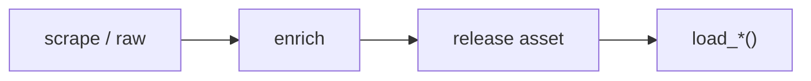

# MBB dataset loaders



## Automation status

| Dataset | Release tag | Pipeline |
|---|---|---|
| `load_mbb_pbp` | [espn_mens_college_basketball_pbp](https://github.com/sportsdataverse/sportsdataverse-data/releases/tag/espn_mens_college_basketball_pbp) | — |
| `load_mbb_player_boxscore` | [espn_mens_college_basketball_player_boxscores](https://github.com/sportsdataverse/sportsdataverse-data/releases/tag/espn_mens_college_basketball_player_boxscores) | — |
| `load_mbb_schedule` | [espn_mens_college_basketball_schedules](https://github.com/sportsdataverse/sportsdataverse-data/releases/tag/espn_mens_college_basketball_schedules) | — |
| `load_mbb_team_boxscore` | [espn_mens_college_basketball_team_boxscores](https://github.com/sportsdataverse/sportsdataverse-data/releases/tag/espn_mens_college_basketball_team_boxscores) | — |
| `load_mbb_ratings` | [mbb_ratings](https://github.com/sportsdataverse/sportsdataverse-data/releases/tag/mbb_ratings) | — |
| `load_mbb_player_value` | [mbb_player_value](https://github.com/sportsdataverse/sportsdataverse-data/releases/tag/mbb_player_value) | — |
| `load_mbb_shots` | [espn_mens_college_basketball_shots](https://github.com/sportsdataverse/sportsdataverse-data/releases/tag/espn_mens_college_basketball_shots) | — |
| `load_mbb_standings` | [espn_mens_college_basketball_standings](https://github.com/sportsdataverse/sportsdataverse-data/releases/tag/espn_mens_college_basketball_standings) | — |
| `load_mbb_player_season_stats` | [espn_mens_college_basketball_player_season_stats](https://github.com/sportsdataverse/sportsdataverse-data/releases/tag/espn_mens_college_basketball_player_season_stats) | — |
| `load_mbb_rosters` | [espn_mens_college_basketball_rosters](https://github.com/sportsdataverse/sportsdataverse-data/releases/tag/espn_mens_college_basketball_rosters) | — |
| `load_mbb_officials` | [espn_mens_college_basketball_officials](https://github.com/sportsdataverse/sportsdataverse-data/releases/tag/espn_mens_college_basketball_officials) | — |
| `load_mbb_game_rosters` | [espn_mens_college_basketball_game_rosters](https://github.com/sportsdataverse/sportsdataverse-data/releases/tag/espn_mens_college_basketball_game_rosters) | — |
| `load_mbb_team_season_stats` | [espn_mens_college_basketball_team_season_stats](https://github.com/sportsdataverse/sportsdataverse-data/releases/tag/espn_mens_college_basketball_team_season_stats) | — |

## `load_mbb_pbp`

Release: [espn_mens_college_basketball_pbp](https://github.com/sportsdataverse/sportsdataverse-data/releases/tag/espn_mens_college_basketball_pbp) · asset `https://github.com/sportsdataverse/sportsdataverse-data/releases/download/espn_mens_college_basketball_pbp/play_by_play_{season}.parquet`
### Returns

| col_name | type | description |
|---|---|---|
| `game_play_number` | Int32 | Sequential play number within the game. |
| `id` | Float64 | Id. |
| `sequence_number` | Int32 | Sequence number representing a shot-possession (V3 PBP). |
| `type_id` | Int32 | Type identifier (numeric). |
| `type_text` | String | Display text for the type field. |
| `text` | String | Text description of the play / record. |
| `away_score` | Int32 | Away team score at the time of the play. |
| `home_score` | Int32 | Home team score at the time of the play. |
| `period_number` | Int32 | Numeric period (1-4 for quarters; 5+ for OT). |
| `period_display_value` | String | Period display label (e.g. '1st Quarter', 'OT'). |
| `clock_display_value` | String | Game clock display string (e.g. '8:32'). |
| `scoring_play` | Boolean | TRUE if the play resulted in points scored. |
| `score_value` | Int32 | Point value of the play (2 / 3 / 1). |
| `team_id` | Int32 | Unique team identifier. |
| `athlete_id_1` | Int32 | Primary athlete identifier (e.g. shooter). |
| `wallclock` | String | Wallclock. |
| `shooting_play` | Boolean | TRUE if the play was a shooting attempt. |
| `game_id` | Int32 | Unique game identifier. |
| `season` | Int32 | Season year. |
| `season_type` | Int32 | Season type (1=pre-season, 2=regular season, 3=postseason, 4=off-season for ESPN; or string label for WNBA Stats). |
| `home_team_id` | Int32 | Unique identifier for the home team. |
| `home_team_name` | String | Home team name. |
| `home_team_mascot` | String | Home team mascot. |
| `home_team_abbrev` | String | Home team three-letter abbreviation. |
| `home_team_name_alt` | String | Alternate home team name. |
| `away_team_id` | Int32 | Unique identifier for the away team. |
| `away_team_name` | String | Away team name. |
| `away_team_mascot` | String | Away team mascot. |
| `away_team_abbrev` | String | Away team three-letter abbreviation. |
| `away_team_name_alt` | String | Alternate away team name. |
| `game_spread` | Float64 | Game spread (signed; positive = home favored). |
| `home_favorite` | Boolean | TRUE if the home team is the betting favorite. |
| `game_spread_available` | Boolean | TRUE if a point spread was available. |
| `home_team_spread` | Float64 | Home team's point spread. |
| `half` | Int32 | Half of the game (1 or 2). |
| `time` | String | Time / clock value. |
| `clock_minutes` | Int32 | Clock minutes split out for convenience. |
| `clock_seconds` | Int32 | Clock seconds split out for convenience. |
| `home_timeout_called` | Boolean | True when the home team called a timeout on the play. |
| `away_timeout_called` | Boolean | True when the away team called a timeout on the play. |
| `lead_period` | Int32 | Period number of the next play in the same game (period_number shifted back one row within game_id), and null on each game's final play. |
| `lead_half` | Int32 | A lead column on the half |
| `start_period_seconds_remaining` | Int32 | Seconds left in the current period when the play started, computed as 60 times the game clock minutes plus the seconds, so 1200 at the tip of each 20-minute half and 300 at the start of an overtime. |
| `start_game_seconds_remaining` | Int32 | Seconds remaining in the game at the start of the play. |
| `end_period_seconds_remaining` | Int32 | Seconds left in the period when the play ended. |
| `end_game_seconds_remaining` | Int32 | Seconds remaining in the game at the end of the play. |
| `lag_period` | Int32 | Period number of the previous play in the same game (period_number shifted forward one row within game_id), and null on each game's first play. |
| `lag_half` | Int32 | A lag column on the half |
| `athlete_id_2` | Int32 | Secondary athlete identifier (e.g. assister / fouler). |
| `game_date` | Date | Game date (YYYY-MM-DD). |
| `game_date_time` | Datetime(time_unit='us', time_zone='America/New_York') | Game start date/time (ISO 8601). |
| `coordinate_x_raw` | Float64 | X coordinate as returned by the API before any adjustment. |
| `coordinate_y_raw` | Float64 | Y coordinate as returned by the API before any adjustment. |
| `coordinate_x` | Float64 | X coordinate on the court (half-court layout). |
| `coordinate_y` | Float64 | Y coordinate on the court (half-court layout). |
| `media_id` | String | Media identifier (video / image). |

```python
load_mbb_pbp(seasons=2024)
```

## `load_mbb_player_boxscore`

Release: [espn_mens_college_basketball_player_boxscores](https://github.com/sportsdataverse/sportsdataverse-data/releases/tag/espn_mens_college_basketball_player_boxscores) · asset `https://github.com/sportsdataverse/sportsdataverse-data/releases/download/espn_mens_college_basketball_player_boxscores/player_box_{season}.parquet`
### Returns

| col_name | type | description |
|---|---|---|
| `game_id` | Int32 | Unique game identifier. |
| `season` | Int32 | Season year. |
| `season_type` | Int32 | Season type (1=pre-season, 2=regular season, 3=postseason, 4=off-season for ESPN; or string label for WNBA Stats). |
| `game_date` | Date | Game date (YYYY-MM-DD). |
| `game_date_time` | Datetime(time_unit='us', time_zone='America/New_York') | Game start date/time (ISO 8601). |
| `athlete_id` | Int32 | Unique athlete identifier (ESPN). |
| `athlete_display_name` | String | Athlete display name (full). |
| `team_id` | Int32 | Unique team identifier. |
| `team_name` | String | Full team display name (e.g. 'Las Vegas Aces'). |
| `team_location` | String | Team city or location string. |
| `team_short_display_name` | String | Short team display name (e.g. 'Aces'). |
| `minutes` | Float64 | Minutes played, formatted MM:SS (V3 PT-duration parsed) or decimal minutes (V2). |
| `field_goals_made` | Int32 | Field goals made (2-pt + 3-pt). |
| `field_goals_attempted` | Int32 | Field goal attempts (2-pt + 3-pt). |
| `three_point_field_goals_made` | Int32 | Three-point field goals made. |
| `three_point_field_goals_attempted` | Int32 | Three-point field goal attempts. |
| `free_throws_made` | Int32 | Free throws made. |
| `free_throws_attempted` | Int32 | Free throw attempts. |
| `offensive_rebounds` | Int32 | Offensive rebounds. |
| `defensive_rebounds` | Int32 | Defensive rebounds. |
| `rebounds` | Int32 | Total rebounds. |
| `assists` | Int32 | Total assists. |
| `steals` | Int32 | Total steals. |
| `blocks` | Int32 | Total blocks. |
| `turnovers` | Int32 | Total turnovers. |
| `fouls` | Int32 | Personal fouls. |
| `points` | Int32 | Points scored. |
| `starter` | Boolean | TRUE if the player was in the starting lineup; FALSE otherwise. |
| `ejected` | Boolean | TRUE if the player was ejected from the game. |
| `did_not_play` | Boolean | TRUE if the player did not appear in the game. |
| `active` | Boolean | TRUE if the row represents an active record (player / team / season). |
| `athlete_jersey` | String | Athlete jersey number. |
| `athlete_short_name` | String | Athlete short display name. |
| `athlete_headshot_href` | String | Athlete headshot image URL. |
| `athlete_position_name` | String | Athlete position ('Guard', 'Forward', 'Center'). |
| `athlete_position_abbreviation` | String | Athlete position abbreviation (G / F / C). |
| `team_display_name` | String | Full team display name. |
| `team_uid` | String | ESPN universal team identifier (UID format 's:40~l:...~t:...'). |
| `team_slug` | String | URL-safe team identifier (e.g. 'lasvegas-aces' / 'aces'). |
| `team_logo` | String | Team logo image URL. |
| `team_abbreviation` | String | Short team abbreviation (e.g. 'LAS'). |
| `team_color` | String | Team primary color (hex without leading '#'). |
| `team_alternate_color` | String | Team alternate color (hex without leading '#'). |
| `home_away` | String | Game venue label ('home' or 'away'). |
| `team_winner` | Boolean | TRUE if the team won this game. |
| `team_score` | Int32 | Team's score / final score. |
| `opponent_team_id` | Int32 | Unique identifier for the opponent team. |
| `opponent_team_name` | String | Opponent team display name. |
| `opponent_team_location` | String | Opponent team city / location. |
| `opponent_team_display_name` | String | Opponent team full display name. |
| `opponent_team_abbreviation` | String | Opponent team abbreviation. |
| `opponent_team_logo` | String | Opponent team logo URL. |
| `opponent_team_color` | String | Opponent team primary color (hex). |
| `opponent_team_alternate_color` | String | Opponent team alternate color (hex). |
| `opponent_team_score` | Int32 | Opponent team's score. |

```python
load_mbb_player_boxscore(seasons=2024)
```

## `load_mbb_schedule`

Release: [espn_mens_college_basketball_schedules](https://github.com/sportsdataverse/sportsdataverse-data/releases/tag/espn_mens_college_basketball_schedules) · asset `https://github.com/sportsdataverse/sportsdataverse-data/releases/download/espn_mens_college_basketball_schedules/mbb_schedule_{season}.parquet`
### Returns

| col_name | type | description |
|---|---|---|
| `id` | Int32 | Id. |
| `uid` | String | ESPN UID string. |
| `date` | String | Date in YYYY-MM-DD format. |
| `attendance` | Float64 | Reported attendance. |
| `time_valid` | Boolean | Time valid. |
| `neutral_site` | Boolean | Neutral site. |
| `conference_competition` | Boolean | Conference competition. |
| `recent` | Boolean | Recent. |
| `start_date` | String | Start date (YYYY-MM-DD). |
| `notes_type` | String | Notes type. |
| `notes_headline` | String | Notes headline. |
| `type_id` | Int32 | Type identifier (numeric). |
| `type_abbreviation` | String | Type abbreviation. |
| `venue_id` | Int32 | Unique venue identifier. |
| `venue_full_name` | String | Venue full name. |
| `venue_address_city` | String | Venue address city. |
| `venue_address_state` | String | Venue address state / region. |
| `venue_capacity` | Float64 | Venue seating capacity. |
| `venue_indoor` | Boolean | TRUE if the venue is indoors. |
| `status_clock` | Float64 | Status clock. |
| `status_display_clock` | String | Status display clock. |
| `status_period` | Float64 | Status period. |
| `status_type_id` | Int32 | Unique identifier for status type. |
| `status_type_name` | String | Status type name. |
| `status_type_state` | String | Status type state. |
| `status_type_completed` | Boolean | Status type completed. |
| `status_type_description` | String | Status type description. |
| `status_type_detail` | String | Status type detail. |
| `status_type_short_detail` | String | Status type short detail. |
| `format_regulation_periods` | Float64 | Format regulation periods. |
| `home_id` | Int32 | Unique identifier for home. |
| `home_uid` | String | Home team's uid. |
| `home_location` | String | Home team's location. |
| `home_name` | String | Home name. |
| `home_abbreviation` | String | Home team's abbreviation. |
| `home_display_name` | String | Home display name. |
| `home_short_display_name` | String | Home short display name. |
| `home_color` | String | Color code (hex) for home. |
| `home_alternate_color` | String | Color code (hex) for home alternate. |
| `home_is_active` | Boolean | Home team's is active. |
| `home_venue_id` | Int32 | Unique identifier for home venue. |
| `home_logo` | String | Home team logo URL. |
| `home_conference_id` | Int32 | Unique identifier for home conference. |
| `home_score` | Int32 | Home team score at the time of the play. |
| `home_winner` | Boolean | Home team's winner. |
| `away_id` | Int32 | Unique identifier for away. |
| `away_uid` | String | Away team's uid. |
| `away_location` | String | Away team's location. |
| `away_name` | String | Away name. |
| `away_abbreviation` | String | Away team's abbreviation. |
| `away_display_name` | String | Away display name. |
| `away_short_display_name` | String | Away short display name. |
| `away_color` | String | Color code (hex) for away. |
| `away_alternate_color` | String | Color code (hex) for away alternate. |
| `away_is_active` | Boolean | Away team's is active. |
| `away_venue_id` | Int32 | Unique identifier for away venue. |
| `away_logo` | String | Away team logo URL. |
| `away_conference_id` | Int32 | Unique identifier for away conference. |
| `away_score` | Int32 | Away team score at the time of the play. |
| `away_winner` | Boolean | Away team's winner. |
| `game_id` | Int32 | Unique game identifier. |
| `season` | Int32 | Season year. |
| `season_type` | Int32 | Season type (1=pre-season, 2=regular season, 3=postseason, 4=off-season for ESPN; or string label for WNBA Stats). |
| `status_type_alt_detail` | String | Status type alt detail. |
| `groups_id` | Int32 | Unique identifier for groups. |
| `groups_name` | String | Groups name. |
| `groups_short_name` | String | Groups short name. |
| `groups_is_conference` | Boolean | Groups is conference. |
| `tournament_id` | Int32 | ESPN tournament identifier. |
| `game_json` | Boolean | Whether processed game JSON is available. |
| `game_json_url` | Boolean | URL to the processed game JSON. |
| `game_date_time` | Datetime(time_unit='us', time_zone='America/New_York') | Game start date/time (ISO 8601). |
| `game_date` | Date | Game date (YYYY-MM-DD). |
| `PBP` | Boolean | Whether play-by-play data is available. |
| `team_box` | Boolean | Team box. |
| `player_box` | Boolean | Player box. |

```python
load_mbb_schedule(seasons=2024)
```

## `load_mbb_team_boxscore`

Release: [espn_mens_college_basketball_team_boxscores](https://github.com/sportsdataverse/sportsdataverse-data/releases/tag/espn_mens_college_basketball_team_boxscores) · asset `https://github.com/sportsdataverse/sportsdataverse-data/releases/download/espn_mens_college_basketball_team_boxscores/team_box_{season}.parquet`
### Returns

| col_name | type | description |
|---|---|---|
| `game_id` | Int32 | Unique game identifier. |
| `season` | Int32 | Season year. |
| `season_type` | Int32 | Season type (1=pre-season, 2=regular season, 3=postseason, 4=off-season for ESPN; or string label for WNBA Stats). |
| `game_date` | Date | Game date (YYYY-MM-DD). |
| `game_date_time` | Datetime(time_unit='us', time_zone='America/New_York') | Game start date/time (ISO 8601). |
| `team_id` | Int32 | Unique team identifier. |
| `team_uid` | String | ESPN universal team identifier (UID format 's:40~l:...~t:...'). |
| `team_slug` | String | URL-safe team identifier (e.g. 'lasvegas-aces' / 'aces'). |
| `team_location` | String | Team city or location string. |
| `team_name` | String | Full team display name (e.g. 'Las Vegas Aces'). |
| `team_abbreviation` | String | Short team abbreviation (e.g. 'LAS'). |
| `team_display_name` | String | Full team display name. |
| `team_short_display_name` | String | Short team display name (e.g. 'Aces'). |
| `team_color` | String | Team primary color (hex without leading '#'). |
| `team_alternate_color` | String | Team alternate color (hex without leading '#'). |
| `team_logo` | String | Team logo image URL. |
| `team_home_away` | String | Team home away. |
| `team_score` | Int32 | Team's score / final score. |
| `team_winner` | Boolean | TRUE if the team won this game. |
| `assists` | Int32 | Total assists. |
| `blocks` | Int32 | Total blocks. |
| `defensive_rebounds` | Int32 | Defensive rebounds. |
| `field_goal_pct` | Float64 | Field goal percentage (0-1). |
| `field_goals_made` | Int32 | Field goals made (2-pt + 3-pt). |
| `field_goals_attempted` | Int32 | Field goal attempts (2-pt + 3-pt). |
| `flagrant_fouls` | Int32 | Total flagrant fouls. |
| `fouls` | Int32 | Personal fouls. |
| `free_throw_pct` | Float64 | Free throw percentage (0-1). |
| `free_throws_made` | Int32 | Free throws made. |
| `free_throws_attempted` | Int32 | Free throw attempts. |
| `largest_lead` | String | Largest lead during the game. |
| `offensive_rebounds` | Int32 | Offensive rebounds. |
| `steals` | Int32 | Total steals. |
| `team_turnovers` | Int32 | Team turnovers (turnovers credited to the team rather than a player). |
| `technical_fouls` | Int32 | Total technical fouls. |
| `three_point_field_goal_pct` | Float64 | Three-point field goal percentage (0-1). |
| `three_point_field_goals_made` | Int32 | Three-point field goals made. |
| `three_point_field_goals_attempted` | Int32 | Three-point field goal attempts. |
| `total_rebounds` | Int32 | Total rebounds. |
| `total_technical_fouls` | Int32 | Total technical fouls (player + team). |
| `total_turnovers` | Int32 | Total turnovers (player + team). |
| `turnovers` | Int32 | Total turnovers. |
| `opponent_team_id` | Int32 | Unique identifier for the opponent team. |
| `opponent_team_uid` | String | Opponent team uid. |
| `opponent_team_slug` | String | Opponent team slug. |
| `opponent_team_location` | String | Opponent team city / location. |
| `opponent_team_name` | String | Opponent team display name. |
| `opponent_team_abbreviation` | String | Opponent team abbreviation. |
| `opponent_team_display_name` | String | Opponent team full display name. |
| `opponent_team_short_display_name` | String | Opponent team short display name. |
| `opponent_team_color` | String | Opponent team primary color (hex). |
| `opponent_team_alternate_color` | String | Opponent team alternate color (hex). |
| `opponent_team_logo` | String | Opponent team logo URL. |
| `opponent_team_score` | Int32 | Opponent team's score. |

```python
load_mbb_team_boxscore(seasons=2024)
```

## `load_mbb_ratings`

Release: [mbb_ratings](https://github.com/sportsdataverse/sportsdataverse-data/releases/tag/mbb_ratings) · asset `https://github.com/sportsdataverse/sportsdataverse-data/releases/download/mbb_ratings/mbb_ratings_{season}.parquet`
### Returns

| col_name | type | description |
|---|---|---|
| `season` | Int64 | Season year. |
| `team_id` | String | Unique team identifier. |
| `adj_o` | Float64 | Adj o. |
| `adj_d` | Float64 | Adj d. |
| `adj_em` | Float64 | Adj em. |
| `adj_tempo` | Float64 | Opponent-adjusted possessions per 40 minutes, solved by the same fixed point as the efficiency ratings under the additive model that a game's pace is the two teams' tempos less the league baseline; it averages about 71 in 2025. |
| `raw_o` | Float64 | Raw o. |
| `raw_d` | Float64 | Raw d. |
| `games` | Int64 | Games played. |
| `rank` | Int64 | Rank. |
| `adj_em_z` | Float64 | Within-season z-score of adj_em, computed as adj_em minus the season mean divided by the season standard deviation, so each season is centered at zero with unit spread. |

```python
load_mbb_ratings(seasons=2025)
```

## `load_mbb_player_value`

Release: [mbb_player_value](https://github.com/sportsdataverse/sportsdataverse-data/releases/tag/mbb_player_value) · asset `https://github.com/sportsdataverse/sportsdataverse-data/releases/download/mbb_player_value/mbb_player_value_{season}.parquet`
### Returns

| col_name | type | description |
|---|---|---|
| `player_id` | String | Unique player identifier. |
| `player` | String | Player name. |
| `season` | Int64 | Season year. |
| `team_id` | String | Unique team identifier. |
| `min` | Float64 | Minutes played. |
| `box_obpm` | Float64 | Box-score offensive plus/minus for the player, the offensive half of box BPM. |
| `box_dbpm` | Float64 | Box-score defensive plus/minus for the player, the defensive half of box BPM. |
| `box_bpm` | Float64 | Total box plus/minus in points per 100 possessions above an average player, exactly box_obpm plus box_dbpm (verified to zero residual across all 9,805 rows of 2025). |

```python
load_mbb_player_value(seasons=2025)
```

## `load_mbb_shots`

Release: [espn_mens_college_basketball_shots](https://github.com/sportsdataverse/sportsdataverse-data/releases/tag/espn_mens_college_basketball_shots) · asset `https://github.com/sportsdataverse/sportsdataverse-data/releases/download/espn_mens_college_basketball_shots/shots_{season}.parquet`
### Returns

| col_name | type | description |
|---|---|---|
| `game_id` | Int32 | Unique game identifier. |
| `season` | Int32 | Season year. |
| `period_number` | Int32 | Numeric period (1-4 for quarters; 5+ for OT). |
| `clock_display_value` | String | Game clock display string (e.g. '8:32'). |
| `team_id` | Int32 | Unique team identifier. |
| `athlete_id_1` | Int32 | Primary athlete identifier (e.g. shooter). |
| `athlete_id_2` | Int32 | Secondary athlete identifier (e.g. assister / fouler). |
| `type_id` | Int32 | Type identifier (numeric). |
| `type_text` | String | Display text for the type field. |
| `scoring_play` | Boolean | TRUE if the play resulted in points scored. |
| `score_value` | Int32 | Point value of the play (2 / 3 / 1). |
| `coordinate_x` | Float64 | X coordinate on the court (half-court layout). |
| `coordinate_y` | Float64 | Y coordinate on the court (half-court layout). |
| `coordinate_x_raw` | Float64 | X coordinate as returned by the API before any adjustment. |
| `coordinate_y_raw` | Float64 | Y coordinate as returned by the API before any adjustment. |

```python
load_mbb_shots(seasons=2025)
```

## `load_mbb_standings`

Release: [espn_mens_college_basketball_standings](https://github.com/sportsdataverse/sportsdataverse-data/releases/tag/espn_mens_college_basketball_standings) · asset `https://github.com/sportsdataverse/sportsdataverse-data/releases/download/espn_mens_college_basketball_standings/standings_{season}.parquet`
### Returns

| col_name | type | description |
|---|---|---|
| `season` | Int32 | Season year. |
| `group_id` | String | ESPN group id. |
| `group_name` | String | Group name (conference / division). |
| `group_abbreviation` | String | Group abbreviation. |
| `group_short_name` | String | Abbreviated conference label ESPN prints in standings tables, such as ACC, Big Ten or Am. East, one value per group_id. |
| `team_id` | Int32 | Unique team identifier. |
| `team_uid` | String | ESPN universal team identifier (UID format 's:40~l:...~t:...'). |
| `team_slug` | String | URL-safe team identifier (e.g. 'lasvegas-aces' / 'aces'). |
| `team_location` | String | Team city or location string. |
| `team_name` | String | Full team display name (e.g. 'Las Vegas Aces'). |
| `team_abbreviation` | String | Short team abbreviation (e.g. 'LAS'). |
| `team_display_name` | String | Full team display name. |
| `team_short_display_name` | String | Short team display name (e.g. 'Aces'). |
| `team_color` | String | Team primary color (hex without leading '#'). |
| `team_alternate_color` | String | Team alternate color (hex without leading '#'). |
| `team_logo` | String | Team logo image URL. |
| `stat_name` | String | Stat key. |
| `stat_display_name` | String | Stat display name (from `displayNames`). |
| `stat_short_display_name` | String | Short human-readable stat name. |
| `stat_description` | String | ESPN's longer-form label for the standings statistic, which can differ from stat_display_name (streak is described as Current Streak and playoffSeed as Playoff Seed). |
| `stat_abbreviation` | String | Short code ESPN prints for the standings statistic in a table header, such as W, L, PCT, GB or STRK; it diverges from stat_short_display_name for playoff seed and the home and conference record rows. |
| `stat_type` | String | Stat type code (e.g. "win", "loss"). |
| `display_value` | String | Display-formatted value. |
| `value` | Float64 | Numeric or string value field. |

```python
load_mbb_standings(seasons=2025)
```

## `load_mbb_player_season_stats`

Release: [espn_mens_college_basketball_player_season_stats](https://github.com/sportsdataverse/sportsdataverse-data/releases/tag/espn_mens_college_basketball_player_season_stats) · asset `https://github.com/sportsdataverse/sportsdataverse-data/releases/download/espn_mens_college_basketball_player_season_stats/player_season_stats_{season}.parquet`
### Returns

| col_name | type | description |
|---|---|---|
| `season` | Int32 | Season year. |
| `athlete_id` | Int32 | Unique athlete identifier (ESPN). |
| `athlete_display_name` | String | Athlete display name (full). |
| `athlete_position_abbreviation` | String | Athlete position abbreviation (G / F / C). |
| `athlete_jersey` | String | Athlete jersey number. |
| `team_id` | Int32 | Unique team identifier. |
| `team_slug` | String | URL-safe team identifier (e.g. 'lasvegas-aces' / 'aces'). |
| `team_display_name` | String | Full team display name. |
| `category` | String | Category label. |
| `stat_label` | String | Human-readable label of the statistic (e.g. 'At bats'). |
| `stat_name` | String | Stat key. |
| `stat_display_name` | String | Stat display name (from `displayNames`). |
| `stat_description` | String | ESPN's prose glossary definition of the statistic named in stat_name, for example defining assists as a pass to a teammate that leads directly to a field goal. |
| `display_value` | String | Display-formatted value. |
| `value` | Float64 | Numeric or string value field. |

```python
load_mbb_player_season_stats(seasons=2025)
```

## `load_mbb_rosters`

Release: [espn_mens_college_basketball_rosters](https://github.com/sportsdataverse/sportsdataverse-data/releases/tag/espn_mens_college_basketball_rosters) · asset `https://github.com/sportsdataverse/sportsdataverse-data/releases/download/espn_mens_college_basketball_rosters/rosters_{season}.parquet`
### Returns

| col_name | type | description |
|---|---|---|
| `season` | Int32 | Season year. |
| `team_id` | Int32 | Unique team identifier. |
| `team_slug` | String | URL-safe team identifier (e.g. 'lasvegas-aces' / 'aces'). |
| `team_abbreviation` | String | Short team abbreviation (e.g. 'LAS'). |
| `team_display_name` | String | Full team display name. |
| `team_short_display_name` | String | Short team display name (e.g. 'Aces'). |
| `team_color` | String | Team primary color (hex without leading '#'). |
| `team_alternate_color` | String | Team alternate color (hex without leading '#'). |
| `team_logo` | String | Team logo image URL. |
| `athlete_id` | String | Unique athlete identifier (ESPN). |
| `uid` | String | ESPN UID string. |
| `guid` | String | Stable cross-league team GUID. |
| `full_name` | String | Player's full name. |
| `display_name` | String | Display name. |
| `short_name` | String | Short display name. |
| `first_name` | String | Player's first name. |
| `last_name` | String | Player's last name. |
| `jersey` | String | Jersey number worn by the player. |
| `position_abbreviation` | String | Position abbreviation ('G' / 'F' / 'C'). |
| `position_name` | String | Listed roster position ('Guard', 'Forward', 'Center'). |
| `position_id` | String | Unique position identifier. |
| `height` | String | Player height (string e.g. '6-2' or inches). |
| `weight` | String | Player weight in pounds. |
| `age` | String | Player age (in years). |
| `date_of_birth` | String | Date of birth (YYYY-MM-DD). |
| `birth_place_city` | String | Birth place city. |
| `birth_place_state` | String | Birth place state. |
| `birth_place_country` | String | Birth place country. |
| `experience_years` | String | Experience years. |
| `experience_display_value` | String | Experience display value. |
| `headshot_href` | String | Headshot image URL. |
| `headshot_alt` | String | Alternative-text label for the headshot. |
| `link_web` | String | Web link / URL. |
| `status_id` | String | Status identifier. |
| `status_name` | String | Status label. |
| `status_type` | String | Status type. |

```python
load_mbb_rosters(seasons=2025)
```

## `load_mbb_officials`

Release: [espn_mens_college_basketball_officials](https://github.com/sportsdataverse/sportsdataverse-data/releases/tag/espn_mens_college_basketball_officials) · asset `https://github.com/sportsdataverse/sportsdataverse-data/releases/download/espn_mens_college_basketball_officials/officials_{season}.parquet`
### Returns

| col_name | type | description |
|---|---|---|
| `season` | Int32 | Season year. |
| `game_id` | Int32 | Unique game identifier. |
| `official_full_name` | String | Full name of the game official as published in ESPN's gameInfo officials list; in this release it is byte-identical to official_display_name on every row. |
| `official_display_name` | String | Display form of the official's name used by ESPN's game feed, which duplicates official_full_name for all 18,284 rows of the 2025 release. |
| `official_position` | String | ESPN's role label for the crew member, which is the constant Referee for every men's college basketball official in this release rather than a distinct crew chief or umpire designation. |
| `official_position_id` | Int32 | ESPN's numeric code for the official's role, constant at 40 (Referee) across the entire men's college basketball officials release. |
| `official_order` | Int32 | Position of the official within the game's listed officiating crew. |

```python
load_mbb_officials(seasons=2025)
```

## `load_mbb_game_rosters`

Release: [espn_mens_college_basketball_game_rosters](https://github.com/sportsdataverse/sportsdataverse-data/releases/tag/espn_mens_college_basketball_game_rosters) · asset `https://github.com/sportsdataverse/sportsdataverse-data/releases/download/espn_mens_college_basketball_game_rosters/game_rosters_{season}.parquet`
### Returns

| col_name | type | description |
|---|---|---|
| `season` | Int32 | Season year. |
| `game_id` | String | Unique game identifier. |
| `team_id` | Int32 | Unique team identifier. |
| `team_slug` | String | URL-safe team identifier (e.g. 'lasvegas-aces' / 'aces'). |
| `team_abbreviation` | String | Short team abbreviation (e.g. 'LAS'). |
| `team_display_name` | String | Full team display name. |
| `home_away` | String | Game venue label ('home' or 'away'). |
| `athlete_id` | Int32 | Unique athlete identifier (ESPN). |
| `athlete_uid` | String | ESPN athlete UID (universal identifier). |
| `athlete_guid` | String | ESPN athlete GUID. |
| `athlete_display_name` | String | Athlete display name (full). |
| `athlete_short_name` | String | Athlete short display name. |
| `athlete_first_name` | String | Player first name; `athlete_detail = TRUE` only. |
| `athlete_last_name` | String | Athlete last name. |
| `athlete_jersey` | String | Athlete jersey number. |
| `athlete_position` | String | Player position name; `athlete_detail = TRUE` only. |
| `athlete_headshot` | String | URL of the player's ESPN headshot image, whose filename is the athlete_id (verified equal for all 190,365 non-null rows in 2025); null when ESPN publishes no photo for that player. |
| `starter` | Boolean | TRUE if the player was in the starting lineup; FALSE otherwise. |
| `did_not_play` | Boolean | TRUE if the player did not appear in the game. |
| `active` | Boolean | TRUE if the row represents an active record (player / team / season). |
| `ejected` | Boolean | TRUE if the player was ejected from the game. |
| `reason` | String | Reason. |

```python
load_mbb_game_rosters(seasons=2025)
```

## `load_mbb_team_season_stats`

Release: [espn_mens_college_basketball_team_season_stats](https://github.com/sportsdataverse/sportsdataverse-data/releases/tag/espn_mens_college_basketball_team_season_stats) · asset `https://github.com/sportsdataverse/sportsdataverse-data/releases/download/espn_mens_college_basketball_team_season_stats/team_season_stats_{season}.parquet`
### Returns

| col_name | type | description |
|---|---|---|
| `season` | Int32 | Season year. |
| `team_id` | Int32 | Unique team identifier. |
| `team_slug` | String | URL-safe team identifier (e.g. 'lasvegas-aces' / 'aces'). |
| `team_abbreviation` | String | Short team abbreviation (e.g. 'LAS'). |
| `team_display_name` | String | Full team display name. |
| `team_short_display_name` | String | Short team display name (e.g. 'Aces'). |
| `team_color` | String | Team primary color (hex without leading '#'). |
| `team_alternate_color` | String | Team alternate color (hex without leading '#'). |
| `team_logo` | String | Team logo image URL. |
| `category` | String | Category label. |
| `stat_label` | String | Human-readable label of the statistic (e.g. 'At bats'). |
| `stat_name` | String | Stat key. |
| `stat_display_name` | String | Stat display name (from `displayNames`). |
| `stat_description` | String | ESPN's prose glossary definition of the statistic named in stat_name, for example defining field goal percentage as the ratio of field goals made to field goals attempted. |
| `display_value` | String | Display-formatted value. |
| `value` | Float64 | Numeric or string value field. |

```python
load_mbb_team_season_stats(seasons=2025)
```
