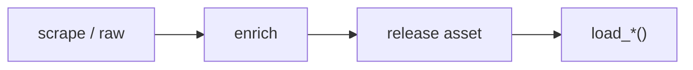

# MLB dataset loaders



## Automation status

| Dataset | Release tag | Pipeline |
|---|---|---|
| `load_mlb_re24_matrix` | [mlb_game_state](https://github.com/sportsdataverse/sportsdataverse-data/releases/tag/mlb_game_state) | — |
| `load_mlb_we_table` | [mlb_game_state](https://github.com/sportsdataverse/sportsdataverse-data/releases/tag/mlb_game_state) | — |
| `load_mlb_wpa` | [mlb_game_state](https://github.com/sportsdataverse/sportsdataverse-data/releases/tag/mlb_game_state) | — |
| `load_mlb_pbp` | [mlb_pbp](https://github.com/sportsdataverse/sportsdataverse-data/releases/tag/mlb_pbp) | — |
| `load_mlb_pitches` | [mlb_pitches](https://github.com/sportsdataverse/sportsdataverse-data/releases/tag/mlb_pitches) | — |
| `load_mlb_runners` | [mlb_runners](https://github.com/sportsdataverse/sportsdataverse-data/releases/tag/mlb_runners) | — |
| `load_mlb_expected_stats` | [mlb_hitting_models](https://github.com/sportsdataverse/sportsdataverse-data/releases/tag/mlb_hitting_models) | — |
| `load_mlb_expected_hr` | [mlb_hitting_models](https://github.com/sportsdataverse/sportsdataverse-data/releases/tag/mlb_hitting_models) | — |
| `load_mlb_batter_projection` | [mlb_hitting_models](https://github.com/sportsdataverse/sportsdataverse-data/releases/tag/mlb_hitting_models) | — |
| `load_mlb_oaa` | [mlb_fielding_models](https://github.com/sportsdataverse/sportsdataverse-data/releases/tag/mlb_fielding_models) | — |
| `load_mlb_catcher_framing` | [mlb_fielding_models](https://github.com/sportsdataverse/sportsdataverse-data/releases/tag/mlb_fielding_models) | — |
| `load_mlb_xera` | [mlb_pitching_models](https://github.com/sportsdataverse/sportsdataverse-data/releases/tag/mlb_pitching_models) | — |
| `load_mlb_stuff_plus` | [mlb_pitching_models](https://github.com/sportsdataverse/sportsdataverse-data/releases/tag/mlb_pitching_models) | — |
| `load_mlb_command_plus` | [mlb_pitching_models](https://github.com/sportsdataverse/sportsdataverse-data/releases/tag/mlb_pitching_models) | — |
| `load_ncaa_baseball_pbp` | [ncaa_baseball_pbp](https://github.com/sportsdataverse/sportsdataverse-data/releases/tag/ncaa_baseball_pbp) | — |
| `load_ncaa_baseball_schedule` | [ncaa_baseball_schedules](https://github.com/sportsdataverse/sportsdataverse-data/releases/tag/ncaa_baseball_schedules) | — |
| `load_ncaa_baseball_teams` | [ncaa_baseball_teams](https://github.com/sportsdataverse/sportsdataverse-data/releases/tag/ncaa_baseball_teams) | — |
| `load_ncaa_baseball_rosters` | [ncaa_baseball_rosters](https://github.com/sportsdataverse/sportsdataverse-data/releases/tag/ncaa_baseball_rosters) | — |
| `load_ncaa_baseball_linescore` | [ncaa_baseball_linescore](https://github.com/sportsdataverse/sportsdataverse-data/releases/tag/ncaa_baseball_linescore) | — |
| `load_ncaa_baseball_team_stats` | [ncaa_baseball_team_stats](https://github.com/sportsdataverse/sportsdataverse-data/releases/tag/ncaa_baseball_team_stats) | — |
| `load_ncaa_baseball_player_stats` | [ncaa_baseball_player_stats](https://github.com/sportsdataverse/sportsdataverse-data/releases/tag/ncaa_baseball_player_stats) | — |
| `load_ncaa_baseball_situational_stats` | [ncaa_baseball_situational_stats](https://github.com/sportsdataverse/sportsdataverse-data/releases/tag/ncaa_baseball_situational_stats) | — |
| `load_ncaa_baseball_games` | [ncaa_baseball_games](https://github.com/sportsdataverse/sportsdataverse-data/releases/tag/ncaa_baseball_games) | — |

## `load_mlb_re24_matrix`

Release: [mlb_game_state](https://github.com/sportsdataverse/sportsdataverse-data/releases/tag/mlb_game_state) · asset `https://github.com/sportsdataverse/sportsdataverse-data/releases/download/mlb_game_state/mlb_re24_matrix_{season}.parquet`
### Returns

| col_name | type | description |
|---|---|---|
| `base_state` | String | Three-character pre-play base occupancy where each slot carries its base number when occupied and an underscore when empty, so ___ is bases empty and 123 is bases loaded. |
| `outs` | Int64 | Outs in the inning after the play. |
| `re` | Float64 | Mean runs the batting team went on to score from this base-out state through the end of the half-inning, with bottom-of-the-9th-and-later halves excluded to avoid walk-off selection bias. |
| `n` | UInt32 | Plate appearances observed starting in this base-out state, the sample size behind re. |
| `season` | Int64 | Season year. |

```python
load_mlb_re24_matrix(seasons=2024)
```

## `load_mlb_we_table`

Release: [mlb_game_state](https://github.com/sportsdataverse/sportsdataverse-data/releases/tag/mlb_game_state) · asset `https://github.com/sportsdataverse/sportsdataverse-data/releases/download/mlb_game_state/mlb_we_table_{season}.parquet`
### Returns

| col_name | type | description |
|---|---|---|
| `inning_capped` | Int64 | Inning number with the ninth and every extra inning collapsed into 9, so extras share the ninth-inning win-expectancy cells. |
| `half` | String | Half of the game (1 or 2). |
| `base_state` | String | Three-character pre-play base occupancy where each slot carries its base number when occupied and an underscore when empty, so ___ is bases empty and 123 is bases loaded. |
| `outs_start` | Int64 | Outs already recorded when the plate appearance began, normally 0 through 2, though a handful of published rows carry a stale 3 that the RE24 matrix filters out but this table does not. |
| `score_diff_bucket` | Int64 | Home score minus away score before the play, clipped to the range -6 through +6 so blowouts collapse into the end buckets. |
| `home_win_exp` | Float64 | Home team win expectancy before the play. |
| `n` | UInt32 | Plate appearances observed in this state bucket, the sample size behind the Laplace-smoothed home_win_exp. |
| `thin` | Boolean | Whether the win-expectancy cell was estimated from a thin sample of historical games. |
| `season` | Int64 | Season year. |

```python
load_mlb_we_table(seasons=2024)
```

## `load_mlb_wpa`

Release: [mlb_game_state](https://github.com/sportsdataverse/sportsdataverse-data/releases/tag/mlb_game_state) · asset `https://github.com/sportsdataverse/sportsdataverse-data/releases/download/mlb_game_state/mlb_wpa_{season}.parquet`
### Returns

| col_name | type | description |
|---|---|---|
| `game_id` | String | Unique ESPN game/event identifier. |
| `at_bat_index` | Int64 | Zero-based index of the at-bat within the game. |
| `wpa` | Float64 | Win probability added (WPA) for the posteam. |
| `season` | Int64 | Season year. |

```python
load_mlb_wpa(seasons=2024)
```

## `load_mlb_pbp`

Release: [mlb_pbp](https://github.com/sportsdataverse/sportsdataverse-data/releases/tag/mlb_pbp) · asset `https://github.com/sportsdataverse/sportsdataverse-data/releases/download/mlb_pbp/mlb_pbp_{season}.parquet`
### Returns

| col_name | type | description |
|---|---|---|
| `game_pk` | Int64 | statsapi game identifier; the join key to every other MLB release. |
| `at_bat_index` | Int64 | Zero-based index of the plate appearance within the game; joins to mlb_pitches and mlb_runners. |
| `inning` | Int64 | Inning number, counting from 1; extra innings continue the sequence. |
| `half_inning` | String | `top` or `bottom`. |
| `batter_id` | Int64 | statsapi person id of the batter. |
| `pitcher_id` | Int64 | statsapi person id of the pitcher. |
| `event_type` | String | Machine-readable plate-appearance outcome (e.g. `single`, `strikeout`, `field_out`). |
| `event` | String | Human-readable outcome of the plate appearance. |
| `description` | String | Narrative text for the plate appearance. |
| `rbi` | Int64 | Runs batted in credited to this plate appearance. |
| `away_score` | Int64 | Away score AFTER the plate appearance. |
| `home_score` | Int64 | Home score AFTER the plate appearance. |
| `is_scoring_play` | Boolean | Whether the plate appearance scored a run. |
| `outs` | Int64 | Outs recorded after the plate appearance. |
| `start_time` | String | UTC timestamp when the plate appearance began; null in older seasons. |
| `end_time` | String | UTC timestamp when the plate appearance ended; null in older seasons. |
| `post_on_first_id` | Int64 | Person id on first base after the plate appearance; null when unoccupied. |
| `post_on_second_id` | Int64 | Person id on second base after the plate appearance; null when unoccupied. |
| `post_on_third_id` | Int64 | Person id on third base after the plate appearance; null when unoccupied. |

```python
load_mlb_pbp(seasons=2024)
```

## `load_mlb_pitches`

Release: [mlb_pitches](https://github.com/sportsdataverse/sportsdataverse-data/releases/tag/mlb_pitches) · asset `https://github.com/sportsdataverse/sportsdataverse-data/releases/download/mlb_pitches/mlb_pitches_{season}.parquet`
### Returns

| col_name | type | description |
|---|---|---|
| `game_pk` | Int64 | statsapi game identifier; the join key to every other MLB release. |
| `at_bat_index` | Int64 | Zero-based index of the plate appearance within the game; joins to mlb_pbp and mlb_runners. |
| `pitch_number` | Int64 | One-based pitch number within the plate appearance. |
| `batter_id` | Int64 | statsapi person id of the batter. |
| `pitcher_id` | Int64 | statsapi person id of the pitcher. |
| `pitch_type` | String | Classified pitch-type code (FF, SL, CH, ...). statsapi `pitchData`, measured fill: ~0% before 2007, 45.7% in 2007 (mid-season PITCHf/x rollout across ballparks), 96.6% in 2008, ~100% from 2015. Null for pitches the system never tracked. |
| `pitch_name` | String | Human-readable pitch type. statsapi `pitchData`, measured fill: ~0% before 2007, 45.7% in 2007 (mid-season PITCHf/x rollout across ballparks), 96.6% in 2008, ~100% from 2015. Null for pitches the system never tracked. |
| `call_code` | String | Umpire call code (B, C, S, X, ...). |
| `call_description` | String | Human-readable umpire call. |
| `balls` | Int64 | Ball count BEFORE the pitch. |
| `strikes` | Int64 | Strike count BEFORE the pitch. |
| `outs` | Int64 | Outs BEFORE the pitch. |
| `start_speed` | Float64 | Release speed in mph. statsapi `pitchData`, measured fill: ~0% before 2007, 45.7% in 2007 (mid-season PITCHf/x rollout across ballparks), 96.6% in 2008, ~100% from 2015. Null for pitches the system never tracked. |
| `end_speed` | Float64 | Speed crossing the plate in mph. statsapi `pitchData`, measured fill: ~0% before 2007, 45.7% in 2007 (mid-season PITCHf/x rollout across ballparks), 96.6% in 2008, ~100% from 2015. Null for pitches the system never tracked. |
| `spin_rate` | Float64 | Spin rate in rpm. statsapi `pitchData`, measured fill: ~0% before 2007, 45.7% in 2007 (mid-season PITCHf/x rollout across ballparks), 96.6% in 2008, ~100% from 2015. Null for pitches the system never tracked. |
| `extension` | Float64 | Release extension toward the plate in feet. Later than the rest of `pitchData`: measured 0% through 2016 and ~100% from 2017, so it is null for the 2007-2016 PITCHf/x seasons that do carry speed and spin. |
| `px` | Float64 | Horizontal location crossing the plate in feet from the plate's centre, catcher's view. statsapi `pitchData`, measured fill: ~0% before 2007, 45.7% in 2007 (mid-season PITCHf/x rollout across ballparks), 96.6% in 2008, ~100% from 2015. Null for pitches the system never tracked. |
| `pz` | Float64 | Height crossing the plate in feet above the ground. statsapi `pitchData`, measured fill: ~0% before 2007, 45.7% in 2007 (mid-season PITCHf/x rollout across ballparks), 96.6% in 2008, ~100% from 2015. Null for pitches the system never tracked. |
| `sz_top` | Float64 | Top of the batter's strike zone in feet. Derived from the batter, not `pitchData`, so it is populated back to 1988. |
| `sz_bot` | Float64 | Bottom of the batter's strike zone in feet. Derived from the batter, not `pitchData`, so it is populated back to 1988. |
| `launch_speed` | Float64 | Exit velocity off the bat in mph. statsapi `hitData`, Statcast-era and batted balls only: null before 2015 and ~17% populated after, which is the share of pitches put in play rather than a coverage gap. |
| `launch_angle` | Float64 | Vertical launch angle in degrees. statsapi `hitData`, Statcast-era and batted balls only: null before 2015 and ~17% populated after, which is the share of pitches put in play rather than a coverage gap. |
| `total_distance` | Float64 | Batted-ball distance travelled in feet. statsapi `hitData`, Statcast-era and batted balls only: null before 2015 and ~17% populated after, which is the share of pitches put in play rather than a coverage gap. |
| `trajectory` | String | Batted-ball trajectory (`ground_ball`, `line_drive`, `fly_ball`, `popup`). Legacy scorer field, batted balls only: ~20% populated in every season back to 1988, and present long before Statcast. |
| `hardness` | String | Scorer's contact-quality grade (`soft`, `medium`, `hard`). Legacy scorer field, batted balls only: ~20% populated in every season back to 1988, and present long before Statcast. |

```python
load_mlb_pitches(seasons=2024)
```

## `load_mlb_runners`

Release: [mlb_runners](https://github.com/sportsdataverse/sportsdataverse-data/releases/tag/mlb_runners) · asset `https://github.com/sportsdataverse/sportsdataverse-data/releases/download/mlb_runners/mlb_runners_{season}.parquet`
### Returns

| col_name | type | description |
|---|---|---|
| `game_pk` | Int64 | statsapi game identifier; the join key to every other MLB release. |
| `at_bat_index` | Int64 | Zero-based index of the plate appearance within the game; joins to mlb_pbp and mlb_pitches. |
| `runner_id` | Int64 | statsapi person id of the baserunner. |
| `origin_base` | String | Base the runner occupied when the plate appearance began; null for the batter. |
| `start_base` | String | Base the runner started this movement from; null when the movement begins at the plate. |
| `end_base` | String | Base the runner finished on; null when retired or when scoring is recorded by `is_scoring_event`. |
| `out_base` | String | Base at which the runner was retired; null when not retired. |
| `is_out` | Boolean | Whether the runner was retired on this movement. |
| `out_number` | Int64 | Which out of the half-inning this retirement was; null when not retired. |
| `event` | String | Human-readable event that caused the movement. |
| `event_type` | String | Machine-readable event that caused the movement. |
| `movement_reason` | String | statsapi reason code for a movement not caused by the plate appearance itself (e.g. `r_stolen_base_2b`). |
| `is_scoring_event` | Boolean | Whether this movement scored a run. |
| `rbi` | Boolean | Whether the run was credited as an RBI to the batter. |
| `earned` | Boolean | Whether the run was earned against the responsible pitcher. |
| `responsible_pitcher_id` | Int64 | statsapi person id of the pitcher charged with the runner. |

```python
load_mlb_runners(seasons=2024)
```

## `load_mlb_expected_stats`

Release: [mlb_hitting_models](https://github.com/sportsdataverse/sportsdataverse-data/releases/tag/mlb_hitting_models) · asset `https://github.com/sportsdataverse/sportsdataverse-data/releases/download/mlb_hitting_models/mlb_expected_stats_{season}.parquet`
### Returns

| col_name | type | description |
|---|---|---|
| `batter` | Int64 | MLBAM player id of the batter. |
| `season` | Int64 | Season year. |
| `pa` | Int64 | Plate appearances for the batter in the season, counted as the Statcast rows that END a plate appearance (a non-empty events value). Pitches within a plate appearance are not counted. |
| `ab` | Int64 | At-bats, derived from the same plate-appearance-ending rows by excluding walks, hit-by-pitches, sacrifice flies, sacrifice bunts and catcher's interference. |
| `xwoba` | Float64 | Expected wOBA blending the exit-velocity by launch-angle grid's predicted contact value on balls in play with realized wOBA value on walks, hit-by-pitches and strikeouts, over the wOBA denominator; low-sample batters can exceed 1. |
| `xba` | Float64 | Grid-predicted hit probability summed over the at-bat balls in play that carry launch data, plus the realized hit for balls in play Statcast did not track, divided by at-bats, on the conventional batting-average scale. An untracked ball in play takes its realized outcome exactly as xwoba does, rather than counting in ab with a zero numerator, which deflated league-mean xBA by the untracked share. |
| `xslg` | Float64 | The same construction on total bases -- grid-predicted total bases where launch data exists, realized total bases for untracked balls in play -- divided by at-bats, on the conventional slugging scale. |
| `woba` | Float64 | Actual weighted on-base average (wOBA) for the player over the sample. |
| `ba` | Float64 | Actual batting average for the player over the sample (0-1), alongside the expected-stat columns. |

```python
load_mlb_expected_stats(seasons=2024)
```

## `load_mlb_expected_hr`

Release: [mlb_hitting_models](https://github.com/sportsdataverse/sportsdataverse-data/releases/tag/mlb_hitting_models) · asset `https://github.com/sportsdataverse/sportsdataverse-data/releases/download/mlb_hitting_models/mlb_expected_hr_{season}.parquet`
### Returns

| col_name | type | description |
|---|---|---|
| `batter` | Int64 | MLBAM player id of the batter. |
| `season` | Int64 | Season year. |
| `hr` | Int64 | Home runs hit by the batter over the covered sample. |
| `xhr_neutral` | Float64 | Park-neutral expected home runs, summing over the batter's balls in play the home-run probability read off the exit-velocity by launch-angle by spray-angle grid. |
| `xhr_park_adj` | Float64 | The same expected-home-run sum after scaling each ball by its ballpark's Savant home-run park factor over 100; published values run between 0.77 and 1.26 times xhr_neutral. |
| `hr_above_expected` | Float64 | Home runs actually hit minus xhr_neutral, so it grades over- and under-performance against the park-neutral expectation rather than the park-adjusted one. |

```python
load_mlb_expected_hr(seasons=2024)
```

## `load_mlb_batter_projection`

Release: [mlb_hitting_models](https://github.com/sportsdataverse/sportsdataverse-data/releases/tag/mlb_hitting_models) · asset `https://github.com/sportsdataverse/sportsdataverse-data/releases/download/mlb_hitting_models/mlb_batter_projection_{season}.parquet`
### Returns

| col_name | type | description |
|---|---|---|
| `batter` | Int64 | MLBAM player id of the batter. |
| `age` | Int64 | Player age (in years). |
| `proj_xwoba` | Float64 | Projected expected weighted on-base average for the batter. |
| `proj_pa` | Float64 | Combined prior-three-season pa behind the projection, its effective sample size; it inherits the pitch-row counting of load_mlb_expected_stats pa rather than true plate appearances. |

```python
load_mlb_batter_projection(seasons=2024)
```

## `load_mlb_oaa`

Release: [mlb_fielding_models](https://github.com/sportsdataverse/sportsdataverse-data/releases/tag/mlb_fielding_models) · asset `https://github.com/sportsdataverse/sportsdataverse-data/releases/download/mlb_fielding_models/mlb_oaa_{season}.parquet`
### Returns

| col_name | type | description |
|---|---|---|
| `fielder_id` | String | MLBAM identifier of the fielder charged with the ball in play, resolved from whichever fielder_N column matches the responsible position and published as a string rather than an integer. |
| `position` | Int64 | Listed roster position (G, F, C, etc.). |
| `opportunities` | UInt32 | Balls in play charged to this fielder at this position, the sample the oaa sum runs over. |
| `oaa` | Float64 | Outs above average: outs the fielder actually recorded minus what a per-position catch-probability logistic expected from the same batted-ball trajectories, summed across their opportunities. |
| `season` | Int64 | Season year. |

```python
load_mlb_oaa(seasons=2024)
```

## `load_mlb_catcher_framing`

Release: [mlb_fielding_models](https://github.com/sportsdataverse/sportsdataverse-data/releases/tag/mlb_fielding_models) · asset `https://github.com/sportsdataverse/sportsdataverse-data/releases/download/mlb_fielding_models/mlb_catcher_framing_{season}.parquet`
### Returns

| col_name | type | description |
|---|---|---|
| `catcher_id` | String | MLBAM identifier of the receiving catcher, taken from Savant's fielder_2 and published as a string rather than an integer. |
| `takes` | UInt32 | Called strikes plus balls the catcher received across the season, a pure workload count; the framing figures themselves sum only over the shadow-zone subset of these. |
| `framing_runs` | Float64 | Runs saved by receiving, summing actual called strike minus modeled strike probability times that count's strike run value over shadow-zone takes only. |
| `strikes_gained` | Float64 | The same shadow-zone sum of actual called strike minus modeled strike probability left unweighted by run value, so it measures stolen strikes rather than runs. |
| `season` | Int64 | Season year. |

```python
load_mlb_catcher_framing(seasons=2024)
```

## `load_mlb_xera`

Release: [mlb_pitching_models](https://github.com/sportsdataverse/sportsdataverse-data/releases/tag/mlb_pitching_models) · asset `https://github.com/sportsdataverse/sportsdataverse-data/releases/download/mlb_pitching_models/mlb_xera_{season}.parquet`
### Returns

| col_name | type | description |
|---|---|---|
| `pitcher` | Int64 | Whether the position is a pitcher. |
| `season` | Int64 | Season year. |
| `x_woba` | Float64 | Expected weighted on-base average, derived from batted-ball quality rather than outcomes. |
| `x_era` | Float64 | ERA-scale conversion of x_woba as league_era plus (x_woba minus league_woba) over woba_scale times pa_per_9, an exact linear function of x_woba that can go negative for extreme pitchers. |

```python
load_mlb_xera(seasons=2024)
```

## `load_mlb_stuff_plus`

Release: [mlb_pitching_models](https://github.com/sportsdataverse/sportsdataverse-data/releases/tag/mlb_pitching_models) · asset `https://github.com/sportsdataverse/sportsdataverse-data/releases/download/mlb_pitching_models/mlb_stuff_plus_{season}.parquet`
### Returns

| col_name | type | description |
|---|---|---|
| `pitcher` | Int64 | Whether the position is a pitcher. |
| `pitch_type` | String | Abbreviation of the pitch type thrown (e.g. FF, SL, CH). |
| `stuff_rv_hat` | Float64 | Mean predicted per-pitch run value from the bundled xgboost stuff model over this pitcher's pitches of this type, on Savant's batter-perspective delta_run_exp scale so lower is better for the pitcher. |
| `stuff_plus` | Float64 | Stuff+ on the 100-is-average scale, exactly 100 minus 10 times (stuff_rv_hat minus the league mean) over the league SD, so higher is better and outlier run-value predictions can push it well below zero. |
| `season` | Int64 | Season year. |

```python
load_mlb_stuff_plus(seasons=2024)
```

## `load_mlb_command_plus`

Release: [mlb_pitching_models](https://github.com/sportsdataverse/sportsdataverse-data/releases/tag/mlb_pitching_models) · asset `https://github.com/sportsdataverse/sportsdataverse-data/releases/download/mlb_pitching_models/mlb_command_plus_{season}.parquet`
### Returns

| col_name | type | description |
|---|---|---|
| `pitcher` | Int64 | Whether the position is a pitcher. |
| `location_rv_hat` | Float64 | Mean predicted per-pitch run value from the bundled location model, which sees plate location, count, handedness and pitch type but no raw pitch physics; lower is better for the pitcher. |
| `command_plus` | Float64 | Command+/Location+ on the 100-is-average scale, exactly 100 minus 10 times (location_rv_hat minus the league mean) over the league SD; it grades where the pitch finished, not intent, since Statcast ships no catcher target. |
| `season` | Int64 | Season year. |

```python
load_mlb_command_plus(seasons=2024)
```

## `load_ncaa_baseball_pbp`

Release: [ncaa_baseball_pbp](https://github.com/sportsdataverse/sportsdataverse-data/releases/tag/ncaa_baseball_pbp) · asset `https://github.com/sportsdataverse/sportsdataverse-data/releases/download/ncaa_baseball_pbp/ncaa_baseball_pbp_{season}.parquet`
### Returns

| col_name | type | description |
|---|---|---|
| `contest_id` | String | stats.ncaa.org contest (game) identifier. |
| `inning` | Int64 | Inning number. |
| `inning_top_bot` | String | Half-inning ("top" or "bot"). |
| `batting` | String | Whether the situation applies to batting stats. |
| `fielding` | String | Whether the situation applies to fielding stats. |
| `play_number` | Int64 | Sequential play number within the game (1-indexed). |
| `score_away` | Int64 | Score away. |
| `score_home` | Int64 | Score home. |
| `batter` | String | MLBAM player id of the batter. |
| `play_type` | String | Play category the NCAA baseball parser classified from the play text: single, double, triple, home_run, strikeout, walk, hit_by_pitch, groundout, flyout, lineout, out, double_play, fielders_choice, reached_on_error, stolen_base, wild_pitch, passed_ball, runner_advance, substitution, other, or unknown when the clause could not be classified. |
| `hit_trajectory` | String | Batted-ball trajectory: one of ground, line, fly, pop, foul. |
| `fielded_position` | String | Free-text description of where/how the ball was fielded or the runner advanced, as written by the scorer. |
| `is_hit` | Boolean | Whether the plate appearance resulted in a hit. |
| `is_out` | Boolean | Whether the play recorded at least one out. |
| `strikeout_type` | String | How the strikeout ended: 'swinging' or 'looking'. |
| `is_sacrifice` | Boolean | Whether the play was scored as a sacrifice. |
| `sac_type` | String | Kind of sacrifice when one was scored: 'fly' or 'bunt'. |
| `is_double_play` | Boolean | Whether the play resulted in a double play. |
| `rbi` | Int64 | Runs batted in. |
| `count_balls` | Int64 | Ball count when the plate appearance resolved. |
| `count_strikes` | Int64 | Strike count when the plate appearance resolved. |
| `pitch_sequence` | String | Per-pitch result string for the plate appearance (e.g. 'BBKKS'), one character per pitch. |
| `error_position` | String | Fielding position credited with the error, as the feed labels it (e.g. 'ss', 'rf', 'c'). |
| `unearned` | Boolean | Whether the run(s) on the play were scored as unearned. |
| `runs_scored` | Int64 | Runs that scored on the play. |
| `scoring_runners` | List(String) | List of runner names who scored on the play. |
| `runners_advanced` | List(String) | List of 'runner->base' strings describing each runner's advance on the play. |
| `outs_on_play` | Int64 | Number of outs recorded on the play (0-3). |
| `is_scoring_play` | Boolean | Flag indicating that the play put points on the board (1 = scoring play, 0 = not). |
| `description` | String | Long-form description text. |
| `source` | String | Source. |
| `espn_game_id` | String | ESPN game id (NA for bart-only rows). |
| `game_key` | String | NCAA contest identifier for the game the row belongs to; the join key to the other ncaa_baseball_* tables. |
| `game_date` | String | Game date (YYYY-MM-DD). |
| `location` | String | Team city/region (e.g. "Los Angeles"). |
| `attendance` | Int64 | Reported attendance (NA on the redesigned page). |
| `season` | Int64 | Season year. |

```python
load_ncaa_baseball_pbp(seasons=2023)
```

## `load_ncaa_baseball_schedule`

Release: [ncaa_baseball_schedules](https://github.com/sportsdataverse/sportsdataverse-data/releases/tag/ncaa_baseball_schedules) · asset `https://github.com/sportsdataverse/sportsdataverse-data/releases/download/ncaa_baseball_schedules/ncaa_baseball_schedule_{season}.parquet`
### Returns

| col_name | type | description |
|---|---|---|
| `team_id` | String | Unique ESPN team identifier. |
| `team_name` | String | Team name. |
| `date` | String | Date in YYYY-MM-DD format. |
| `game_number` | Int64 | Game number within a doubleheader. |
| `opponent_id` | String | Unique identifier for opponent. |
| `opponent` | String | Opposing team of player |
| `result` | String | Win/loss/tie result for `team_id`. |
| `outcome` | String | Result for the team the row is keyed to: 'W', 'L' or 'T'. |
| `team_score` | Int64 | Team's score / final score. |
| `opponent_score` | Int64 | Opponent score. |
| `contest_id` | String | stats.ncaa.org contest (game) identifier. |
| `attendance` | Int64 | Reported attendance (NA on the redesigned page). |
| `division` | Int64 | NCAA division (1, 2, 3). |
| `season` | Int64 | Season year. |

```python
load_ncaa_baseball_schedule(seasons=2023)
```

## `load_ncaa_baseball_teams`

Release: [ncaa_baseball_teams](https://github.com/sportsdataverse/sportsdataverse-data/releases/tag/ncaa_baseball_teams) · asset `https://github.com/sportsdataverse/sportsdataverse-data/releases/download/ncaa_baseball_teams/ncaa_baseball_teams_{season}.parquet`
### Returns

| col_name | type | description |
|---|---|---|
| `team_id` | String | Unique ESPN team identifier. |
| `team_name` | String | Team name. |
| `division` | Int64 | NCAA division (1, 2, 3). |
| `season` | Int64 | Season year. |

```python
load_ncaa_baseball_teams(seasons=2025)
```

## `load_ncaa_baseball_rosters`

Release: [ncaa_baseball_rosters](https://github.com/sportsdataverse/sportsdataverse-data/releases/tag/ncaa_baseball_rosters) · asset `https://github.com/sportsdataverse/sportsdataverse-data/releases/download/ncaa_baseball_rosters/ncaa_baseball_rosters_{season}.parquet`
### Returns

| col_name | type | description |
|---|---|---|
| `team_id` | String | Unique ESPN team identifier. |
| `team_name` | String | Team name. |
| `player_id` | String | stats.ncaa.org player identifier. |
| `player_name` | String | Player name. |
| `jersey` | String | Jersey number worn by the player. |
| `statcrew_jersey` | String | StatCrew jersey number; present in the schema but entirely unpopulated in the published asset. |
| `player_class` | String | Class year as the feed reports it (Fr., So., Jr., Sr.); '---' when unreported. |
| `position` | String | Position the NCAA baseball feed reports for the player. |
| `height` | String | Height (feet and inches). |
| `weight` | Int64 | Weight in pounds. |
| `hometown` | String | Prospect hometown. |
| `high_school` | String | High school |
| `games_played` | Int64 | Games played. |
| `games_started` | Int64 | Games started. |
| `season` | Int64 | Season year. |

```python
load_ncaa_baseball_rosters(seasons=2025)
```

## `load_ncaa_baseball_linescore`

Release: [ncaa_baseball_linescore](https://github.com/sportsdataverse/sportsdataverse-data/releases/tag/ncaa_baseball_linescore) · asset `https://github.com/sportsdataverse/sportsdataverse-data/releases/download/ncaa_baseball_linescore/ncaa_baseball_linescore_{season}.parquet`
### Returns

| col_name | type | description |
|---|---|---|
| `contest_id` | String | stats.ncaa.org contest (game) identifier. |
| `team` | String | Team. |
| `home_away` | String | Venue label for the team ('home' or 'away'). |
| `inning` | String | Inning number. |
| `runs` | Int64 | Runs scored. |
| `runs_total` | Int64 | Total runs scored by the team across the whole game. |
| `hits` | Int64 | Hits. |
| `errors` | Int64 | Fielding errors. |
| `game_date` | String | Game date (YYYY-MM-DD). |
| `venue` | String | Venue name. |
| `attendance` | Int64 | Reported attendance (NA on the redesigned page). |
| `source` | String | Source. |
| `espn_game_id` | String | ESPN game id (NA for bart-only rows). |
| `game_key` | String | NCAA contest identifier for the game the row belongs to; the join key to the other ncaa_baseball_* tables. |
| `location` | String | Team city/region (e.g. "Los Angeles"). |
| `season` | Int64 | Season year. |

```python
load_ncaa_baseball_linescore(seasons=2025)
```

## `load_ncaa_baseball_team_stats`

Release: [ncaa_baseball_team_stats](https://github.com/sportsdataverse/sportsdataverse-data/releases/tag/ncaa_baseball_team_stats) · asset `https://github.com/sportsdataverse/sportsdataverse-data/releases/download/ncaa_baseball_team_stats/ncaa_baseball_team_stats_{season}.parquet`
### Returns

| col_name | type | description |
|---|---|---|
| `contest_id` | String | stats.ncaa.org contest (game) identifier. |
| `category` | String | Category label. |
| `stat` | String | Stat. |
| `period` | String | Inning number. |
| `away_team` | String | Away team name. |
| `away_value` | String | Away team's value for the stat named by the row, as a string (the table is long/tidy, one stat per row). |
| `home_team` | String | Home team name. |
| `home_value` | String | Home team's value for the stat named by the row, as a string (the table is long/tidy, one stat per row). |
| `source` | String | Source. |
| `espn_game_id` | String | ESPN game id (NA for bart-only rows). |
| `game_key` | String | NCAA contest identifier for the game the row belongs to; the join key to the other ncaa_baseball_* tables. |
| `game_date` | String | Game date (YYYY-MM-DD). |
| `location` | String | Team city/region (e.g. "Los Angeles"). |
| `attendance` | Int64 | Reported attendance (NA on the redesigned page). |
| `season` | Int64 | Season year. |

```python
load_ncaa_baseball_team_stats(seasons=2025)
```

## `load_ncaa_baseball_player_stats`

Release: [ncaa_baseball_player_stats](https://github.com/sportsdataverse/sportsdataverse-data/releases/tag/ncaa_baseball_player_stats) · asset `https://github.com/sportsdataverse/sportsdataverse-data/releases/download/ncaa_baseball_player_stats/ncaa_baseball_player_stats_{season}.parquet`
### Returns

| col_name | type | description |
|---|---|---|
| `contest_id` | String | stats.ncaa.org contest (game) identifier. |
| `team_id` | String | Unique ESPN team identifier. |
| `number` | String | Jersey number. |
| `name` | String | Display name. |
| `position` | String | Position the NCAA baseball feed reports for the player. |
| `r` | String | Runs scored. |
| `ab` | String | At-bats. |
| `h` | String | Hits. |
| `2b` | String | Doubles hit by the batter. |
| `3b` | String | Triples hit by the batter. |
| `tb` | String | Total bases accumulated by the batter. |
| `hr` | String | Home runs hit by the batter over the covered sample. |
| `rbi` | String | Runs batted in. |
| `bb` | String | Bases on balls (walks). |
| `hbp` | String | Times the batter was hit by a pitch. |
| `sf` | String | Sacrifice flies hit by the batter. |
| `sh` | String | Sacrifice hits (bunts) laid down by the batter. |
| `k` | String | Strikeouts. |
| `opp_dp` | String | Double plays turned by the opposing defense against this side. |
| `cs` | String | Times the baserunner was caught stealing. |
| `picked` | String | Times the baserunner was picked off. |
| `sb` | String | Stolen bases by the baserunner. |
| `ibb` | String | Intentional bases on balls drawn by the batter. |
| `kl` | String | Strikeouts looking -- called third strikes, as opposed to swinging strikeouts. |
| `category` | String | Category label. |
| `source` | String | Source. |
| `espn_game_id` | String | ESPN game id (NA for bart-only rows). |
| `game_key` | String | NCAA contest identifier for the game the row belongs to; the join key to the other ncaa_baseball_* tables. |
| `game_date` | String | Game date (YYYY-MM-DD). |
| `location` | String | Team city/region (e.g. "Los Angeles"). |
| `attendance` | Int64 | Reported attendance (NA on the redesigned page). |
| `ip` | String | Innings pitched. |
| `er` | String | Earned runs. |
| `so` | String | Strikeouts: the batter's strikeouts on the batting line, the pitcher's strikeouts recorded on the pitching line. |
| `bf` | String | Batters faced by the pitcher. |
| `2b_a` | String | Doubles allowed by the pitcher. |
| `3b_a` | String | Triples allowed by the pitcher. |
| `bk` | String | Balks charged to the pitcher. |
| `hr_a` | String | Home runs allowed by the pitcher. |
| `wp` | String | Wild pitches charged to the pitcher. |
| `hb` | String | Batters hit by a pitch from this pitcher. |
| `inh_run` | String | Inherited runners on base when this relief pitcher entered. |
| `inh_run_score` | String | Inherited runners who subsequently scored. |
| `sha` | String | Sacrifice hits allowed by the pitcher. |
| `sfa` | String | Sacrifice flies allowed by the pitcher. |
| `tuer` | String | Team unearned runs scored while this pitcher was in the game. |
| `pickoffs` | String | Pickoffs. |
| `po` | String | Putouts recorded by the fielder. |
| `a` | String | Fielding assists credited to the player. |
| `tc` | String | Total chances for the fielder (putouts + assists + errors). |
| `e` | String | Errors charged to the fielder. |
| `ci` | String | Times the batter reached base on catcher's interference. |
| `pb` | String | Passed balls charged to the catcher. |
| `sba` | String | Stolen bases allowed while this catcher was behind the plate. |
| `csb` | String | Runners caught stealing while this catcher was behind the plate. |
| `idp` | String | Times the batter grounded into a double play. |
| `tp` | String | Triple plays the player took part in. |
| `sbapct` | String | Stolen-base success rate allowed by the catcher, as a PROPORTION on 0-1 (e.g. 0.625), not a percentage. |
| `season` | Int64 | Season year. |

```python
load_ncaa_baseball_player_stats(seasons=2025)
```

## `load_ncaa_baseball_situational_stats`

Release: [ncaa_baseball_situational_stats](https://github.com/sportsdataverse/sportsdataverse-data/releases/tag/ncaa_baseball_situational_stats) · asset `https://github.com/sportsdataverse/sportsdataverse-data/releases/download/ncaa_baseball_situational_stats/ncaa_baseball_situational_stats_{season}.parquet`
### Returns

| col_name | type | description |
|---|---|---|
| `contest_id` | String | stats.ncaa.org contest (game) identifier. |
| `team_seq` | Int64 | Side indicator for the row: 0 and 1 distinguish the two teams in the contest. |
| `player` | String | Player name. |
| `position` | String | Position the NCAA baseball feed reports for the player. |
| `with_runrs` | String | Situational split as a 'successes-opportunities' pair string (e.g. '5-13'), not a numeric rate -- plate appearances with runners on base. |
| `hits_scorepos` | String | Situational split as a 'successes-opportunities' pair string (e.g. '5-13'), not a numeric rate -- at-bats with runners in scoring position. |
| `vs_lhp` | String | Situational split as a 'successes-opportunities' pair string (e.g. '5-13'), not a numeric rate -- batting against left-handed pitching. |
| `vs_rhp` | String | Situational split as a 'successes-opportunities' pair string (e.g. '5-13'), not a numeric rate -- batting against right-handed pitching. |
| `leadoff_pct` | String | Situational split as a 'successes-opportunities' pair string (e.g. '5-13'), not a numeric rate -- leadoff batters reaching base; despite the name it is a pair string, not a percentage. |
| `rbi3rd` | String | Situational split as a 'successes-opportunities' pair string (e.g. '5-13'), not a numeric rate -- chances to drive in a runner from third. |
| `h_pinchit` | String | Situational split as a 'successes-opportunities' pair string (e.g. '5-13'), not a numeric rate -- pinch-hitting appearances. |
| `adv_ops` | String | Situational split as a 'successes-opportunities' pair string (e.g. '5-13'), not a numeric rate -- advancing-opportunity situations. |
| `with_2_outs` | String | Situational split as a 'successes-opportunities' pair string (e.g. '5-13'), not a numeric rate -- plate appearances with two outs. |
| `with_runrs2` | String | Situational split as a 'successes-opportunities' pair string (e.g. '5-13'), not a numeric rate -- secondary runners-on split emitted by the feed. |
| `with_scorepos2` | String | Situational split as a 'successes-opportunities' pair string (e.g. '5-13'), not a numeric rate -- secondary runners-in-scoring-position split emitted by the feed. |
| `bases_empty` | String | Situational split as a 'successes-opportunities' pair string (e.g. '5-13'), not a numeric rate -- plate appearances with the bases empty. |
| `bases_loaded` | String | Situational split as a 'successes-opportunities' pair string (e.g. '5-13'), not a numeric rate -- plate appearances with the bases loaded. |
| `category` | String | Category label. |
| `source` | String | Source. |
| `espn_game_id` | String | ESPN game id (NA for bart-only rows). |
| `game_key` | String | NCAA contest identifier for the game the row belongs to; the join key to the other ncaa_baseball_* tables. |
| `game_date` | String | Game date (YYYY-MM-DD). |
| `location` | String | Team city/region (e.g. "Los Angeles"). |
| `attendance` | Int64 | Reported attendance (NA on the redesigned page). |
| `runners` | String | Situational split as a 'successes-opportunities' pair string (e.g. '5-13'), not a numeric rate -- plate appearances with runners on base. |
| `vs_lhb` | String | Situational split as a 'successes-opportunities' pair string (e.g. '5-13'), not a numeric rate -- pitching against left-handed batters. |
| `with_2outs` | String | Situational split as a 'successes-opportunities' pair string (e.g. '5-13'), not a numeric rate -- two-out split under the feed's second, unpunctuated key (distinct column from with_2_outs). |
| `emtpy` | String | Situational split as a 'successes-opportunities' pair string (e.g. '5-13'), not a numeric rate -- bases-empty split under the upstream feed's misspelled key ('emtpy', sic). |
| `with_scorepos` | String | Situational split as a 'successes-opportunities' pair string (e.g. '5-13'), not a numeric rate -- plate appearances with runners in scoring position. |
| `with_runners2` | String | Situational split as a 'successes-opportunities' pair string (e.g. '5-13'), not a numeric rate -- secondary runners-on split emitted by the feed alongside with_runrs2. |
| `vs_rhb` | String | Situational split as a 'successes-opportunities' pair string (e.g. '5-13'), not a numeric rate -- pitching against right-handed batters. |
| `field_pct` | String | Situational split as a 'successes-opportunities' pair string (e.g. '5-13'), not a numeric rate -- fielding chances handled cleanly; despite the name it is a pair string, not a fielding percentage. |
| `season` | Int64 | Season year. |

```python
load_ncaa_baseball_situational_stats(seasons=2025)
```

## `load_ncaa_baseball_games`

Release: [ncaa_baseball_games](https://github.com/sportsdataverse/sportsdataverse-data/releases/tag/ncaa_baseball_games) · asset `https://github.com/sportsdataverse/sportsdataverse-data/releases/download/ncaa_baseball_games/ncaa_baseball_games_{season}.parquet`
### Returns

| col_name | type | description |
|---|---|---|
| `game_key` | String | NCAA contest identifier for the game the row belongs to; the join key to the other ncaa_baseball_* tables. |
| `contest_id` | String | stats.ncaa.org contest (game) identifier. |
| `game_pbp_id` | Int64 | stats.ncaa.org play-by-play (contest) identifier. |
| `season` | Int64 | Season year. |
| `source` | String | Source. |
| `espn_game_id` | String | ESPN game id (NA for bart-only rows). |
| `away_team` | String | Away team name. |
| `away_final` | Int64 | Final runs scored by the away team. |
| `home_team` | String | Home team name. |
| `home_final` | Int64 | Final runs scored by the home team. |

```python
load_ncaa_baseball_games(seasons=2024)
```
