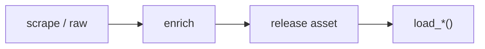

# MLB dataset loaders



## Automation status

| Dataset | Release tag | Pipeline |
|---|---|---|
| `load_mlb_re24_matrix` | [mlb_game_state](https://github.com/sportsdataverse/sportsdataverse-data/releases/tag/mlb_game_state) | — |
| `load_mlb_we_table` | [mlb_game_state](https://github.com/sportsdataverse/sportsdataverse-data/releases/tag/mlb_game_state) | — |
| `load_mlb_wpa` | [mlb_game_state](https://github.com/sportsdataverse/sportsdataverse-data/releases/tag/mlb_game_state) | — |
| `load_mlb_expected_stats` | [mlb_hitting_models](https://github.com/sportsdataverse/sportsdataverse-data/releases/tag/mlb_hitting_models) | — |
| `load_mlb_expected_hr` | [mlb_hitting_models](https://github.com/sportsdataverse/sportsdataverse-data/releases/tag/mlb_hitting_models) | — |
| `load_mlb_batter_projection` | [mlb_hitting_models](https://github.com/sportsdataverse/sportsdataverse-data/releases/tag/mlb_hitting_models) | — |
| `load_mlb_oaa` | [mlb_fielding_models](https://github.com/sportsdataverse/sportsdataverse-data/releases/tag/mlb_fielding_models) | — |
| `load_mlb_catcher_framing` | [mlb_fielding_models](https://github.com/sportsdataverse/sportsdataverse-data/releases/tag/mlb_fielding_models) | — |
| `load_mlb_xera` | [mlb_pitching_models](https://github.com/sportsdataverse/sportsdataverse-data/releases/tag/mlb_pitching_models) | — |
| `load_mlb_stuff_plus` | [mlb_pitching_models](https://github.com/sportsdataverse/sportsdataverse-data/releases/tag/mlb_pitching_models) | — |
| `load_mlb_command_plus` | [mlb_pitching_models](https://github.com/sportsdataverse/sportsdataverse-data/releases/tag/mlb_pitching_models) | — |

## `load_mlb_re24_matrix`

Release: [mlb_game_state](https://github.com/sportsdataverse/sportsdataverse-data/releases/tag/mlb_game_state) · asset `https://github.com/sportsdataverse/sportsdataverse-data/releases/download/mlb_game_state/mlb_re24_matrix_{season}.parquet`
### Returns

| col_name | type |
|---|---|
| `base_state` | String |
| `outs` | Int64 |
| `re` | Float64 |
| `n` | UInt32 |
| `season` | Int64 |

```python
load_mlb_re24_matrix(seasons=2024)
```

## `load_mlb_we_table`

Release: [mlb_game_state](https://github.com/sportsdataverse/sportsdataverse-data/releases/tag/mlb_game_state) · asset `https://github.com/sportsdataverse/sportsdataverse-data/releases/download/mlb_game_state/mlb_we_table_{season}.parquet`
### Returns

| col_name | type |
|---|---|
| `inning_capped` | Int64 |
| `half` | String |
| `base_state` | String |
| `outs_start` | Int64 |
| `score_diff_bucket` | Int64 |
| `home_win_exp` | Float64 |
| `n` | UInt32 |
| `season` | Int64 |

```python
load_mlb_we_table(seasons=2024)
```

## `load_mlb_wpa`

Release: [mlb_game_state](https://github.com/sportsdataverse/sportsdataverse-data/releases/tag/mlb_game_state) · asset `https://github.com/sportsdataverse/sportsdataverse-data/releases/download/mlb_game_state/mlb_wpa_{season}.parquet`
### Returns

| col_name | type |
|---|---|
| `game_id` | String |
| `at_bat_index` | Int64 |
| `wpa` | Float64 |
| `season` | Int64 |

```python
load_mlb_wpa(seasons=2024)
```

## `load_mlb_expected_stats`

Release: [mlb_hitting_models](https://github.com/sportsdataverse/sportsdataverse-data/releases/tag/mlb_hitting_models) · asset `https://github.com/sportsdataverse/sportsdataverse-data/releases/download/mlb_hitting_models/mlb_expected_stats_{season}.parquet`
### Returns

| col_name | type |
|---|---|
| `batter` | Int64 |
| `season` | Int64 |
| `pa` | Int64 |
| `ab` | Int64 |
| `xwoba` | Float64 |
| `xba` | Float64 |
| `xslg` | Float64 |

```python
load_mlb_expected_stats(seasons=2024)
```

## `load_mlb_expected_hr`

Release: [mlb_hitting_models](https://github.com/sportsdataverse/sportsdataverse-data/releases/tag/mlb_hitting_models) · asset `https://github.com/sportsdataverse/sportsdataverse-data/releases/download/mlb_hitting_models/mlb_expected_hr_{season}.parquet`
### Returns

| col_name | type |
|---|---|
| `batter` | Int64 |
| `season` | Int64 |
| `hr` | Int64 |
| `xhr_neutral` | Float64 |
| `xhr_park_adj` | Float64 |
| `hr_above_expected` | Float64 |

```python
load_mlb_expected_hr(seasons=2024)
```

## `load_mlb_batter_projection`

Release: [mlb_hitting_models](https://github.com/sportsdataverse/sportsdataverse-data/releases/tag/mlb_hitting_models) · asset `https://github.com/sportsdataverse/sportsdataverse-data/releases/download/mlb_hitting_models/mlb_batter_projection_{season}.parquet`
### Returns

| col_name | type |
|---|---|
| `batter` | Int64 |
| `age` | Int64 |
| `proj_xwoba` | Float64 |
| `proj_pa` | Float64 |

```python
load_mlb_batter_projection(seasons=2024)
```

## `load_mlb_oaa`

Release: [mlb_fielding_models](https://github.com/sportsdataverse/sportsdataverse-data/releases/tag/mlb_fielding_models) · asset `https://github.com/sportsdataverse/sportsdataverse-data/releases/download/mlb_fielding_models/mlb_oaa_{season}.parquet`
### Returns

| col_name | type |
|---|---|
| `fielder_id` | String |
| `position` | Int64 |
| `opportunities` | UInt32 |
| `oaa` | Float64 |
| `season` | Int64 |

```python
load_mlb_oaa(seasons=2024)
```

## `load_mlb_catcher_framing`

Release: [mlb_fielding_models](https://github.com/sportsdataverse/sportsdataverse-data/releases/tag/mlb_fielding_models) · asset `https://github.com/sportsdataverse/sportsdataverse-data/releases/download/mlb_fielding_models/mlb_catcher_framing_{season}.parquet`
### Returns

| col_name | type |
|---|---|
| `catcher_id` | String |
| `takes` | UInt32 |
| `framing_runs` | Float64 |
| `strikes_gained` | Float64 |
| `season` | Int64 |

```python
load_mlb_catcher_framing(seasons=2024)
```

## `load_mlb_xera`

Release: [mlb_pitching_models](https://github.com/sportsdataverse/sportsdataverse-data/releases/tag/mlb_pitching_models) · asset `https://github.com/sportsdataverse/sportsdataverse-data/releases/download/mlb_pitching_models/mlb_xera_{season}.parquet`
### Returns

| col_name | type |
|---|---|
| `pitcher` | Int64 |
| `season` | Int64 |
| `x_woba` | Float64 |
| `x_era` | Float64 |

```python
load_mlb_xera(seasons=2024)
```

## `load_mlb_stuff_plus`

Release: [mlb_pitching_models](https://github.com/sportsdataverse/sportsdataverse-data/releases/tag/mlb_pitching_models) · asset `https://github.com/sportsdataverse/sportsdataverse-data/releases/download/mlb_pitching_models/mlb_stuff_plus_{season}.parquet`
### Returns

| col_name | type |
|---|---|
| `pitcher` | Int64 |
| `pitch_type` | String |
| `stuff_rv_hat` | Float64 |
| `stuff_plus` | Float64 |
| `season` | Int64 |

```python
load_mlb_stuff_plus(seasons=2024)
```

## `load_mlb_command_plus`

Release: [mlb_pitching_models](https://github.com/sportsdataverse/sportsdataverse-data/releases/tag/mlb_pitching_models) · asset `https://github.com/sportsdataverse/sportsdataverse-data/releases/download/mlb_pitching_models/mlb_command_plus_{season}.parquet`
### Returns

| col_name | type |
|---|---|
| `pitcher` | Int64 |
| `location_rv_hat` | Float64 |
| `command_plus` | Float64 |
| `season` | Int64 |

```python
load_mlb_command_plus(seasons=2024)
```
