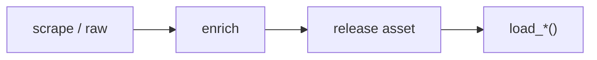

# NBA dataset loaders



## Automation status

| Dataset | Release tag | Pipeline |
|---|---|---|
| `load_nba_pbp` | [espn_nba_pbp](https://github.com/sportsdataverse/sportsdataverse-data/releases/tag/espn_nba_pbp) | — |
| `load_nba_player_boxscore` | [espn_nba_player_boxscores](https://github.com/sportsdataverse/sportsdataverse-data/releases/tag/espn_nba_player_boxscores) | — |
| `load_nba_schedule` | [espn_nba_schedules](https://github.com/sportsdataverse/sportsdataverse-data/releases/tag/espn_nba_schedules) | — |
| `load_nba_team_boxscore` | [espn_nba_team_boxscores](https://github.com/sportsdataverse/sportsdataverse-data/releases/tag/espn_nba_team_boxscores) | — |
| `load_nba_game_rosters` | [espn_nba_game_rosters](https://github.com/sportsdataverse/sportsdataverse-data/releases/tag/espn_nba_game_rosters) | — |
| `load_nba_officials` | [espn_nba_officials](https://github.com/sportsdataverse/sportsdataverse-data/releases/tag/espn_nba_officials) | — |
| `load_nba_shots` | [espn_nba_shots](https://github.com/sportsdataverse/sportsdataverse-data/releases/tag/espn_nba_shots) | — |
| `load_nba_standings` | [espn_nba_standings](https://github.com/sportsdataverse/sportsdataverse-data/releases/tag/espn_nba_standings) | — |
| `load_nba_player_season_stats` | [espn_nba_player_season_stats](https://github.com/sportsdataverse/sportsdataverse-data/releases/tag/espn_nba_player_season_stats) | — |
| `load_nba_team_season_stats` | [espn_nba_team_season_stats](https://github.com/sportsdataverse/sportsdataverse-data/releases/tag/espn_nba_team_season_stats) | — |
| `load_nba_draft` | [espn_nba_draft](https://github.com/sportsdataverse/sportsdataverse-data/releases/tag/espn_nba_draft) | — |
| `load_nba_rosters` | [espn_nba_rosters](https://github.com/sportsdataverse/sportsdataverse-data/releases/tag/espn_nba_rosters) | — |
| `load_nba_stats_schedules` | [nba_stats_schedules](https://github.com/sportsdataverse/sportsdataverse-data/releases/tag/nba_stats_schedules) | — |
| `load_nba_stats_coaches` | [nba_stats_coaches](https://github.com/sportsdataverse/sportsdataverse-data/releases/tag/nba_stats_coaches) | — |
| `load_nba_stats_game_rosters` | [nba_stats_game_rosters](https://github.com/sportsdataverse/sportsdataverse-data/releases/tag/nba_stats_game_rosters) | — |
| `load_nba_stats_lineups` | [nba_stats_lineups](https://github.com/sportsdataverse/sportsdataverse-data/releases/tag/nba_stats_lineups) | — |
| `load_nba_stats_lineups_v3` | [nba_stats_game_lineups](https://github.com/sportsdataverse/sportsdataverse-data/releases/tag/nba_stats_game_lineups) | — |
| `load_nba_stats_officials` | [nba_stats_officials](https://github.com/sportsdataverse/sportsdataverse-data/releases/tag/nba_stats_officials) | — |
| `load_nba_stats_pbp` | [nba_stats_pbp](https://github.com/sportsdataverse/sportsdataverse-data/releases/tag/nba_stats_pbp) | — |
| `load_nba_stats_possessions` | [nba_stats_possessions](https://github.com/sportsdataverse/sportsdataverse-data/releases/tag/nba_stats_possessions) | — |
| `load_nba_stats_game_lineups` | [nba_stats_game_lineups](https://github.com/sportsdataverse/sportsdataverse-data/releases/tag/nba_stats_game_lineups) | — |
| `load_nba_stats_pbp_v3` | [nba_stats_pbp](https://github.com/sportsdataverse/sportsdataverse-data/releases/tag/nba_stats_pbp) | — |
| `load_nba_stats_player_boxscores` | [nba_stats_player_boxscores](https://github.com/sportsdataverse/sportsdataverse-data/releases/tag/nba_stats_player_boxscores) | — |
| `load_nba_stats_player_game_logs` | [nba_stats_player_game_logs](https://github.com/sportsdataverse/sportsdataverse-data/releases/tag/nba_stats_player_game_logs) | — |
| `load_nba_stats_player_season_stats` | [nba_stats_player_season_stats](https://github.com/sportsdataverse/sportsdataverse-data/releases/tag/nba_stats_player_season_stats) | — |
| `load_nba_stats_possessions_v3` | [nba_stats_possessions](https://github.com/sportsdataverse/sportsdataverse-data/releases/tag/nba_stats_possessions) | — |
| `load_nba_stats_rosters` | [nba_stats_rosters](https://github.com/sportsdataverse/sportsdataverse-data/releases/tag/nba_stats_rosters) | — |
| `load_nba_stats_shots` | [nba_stats_shots](https://github.com/sportsdataverse/sportsdataverse-data/releases/tag/nba_stats_shots) | — |
| `load_nba_stats_standings` | [nba_stats_standings](https://github.com/sportsdataverse/sportsdataverse-data/releases/tag/nba_stats_standings) | — |
| `load_nba_stats_team_boxscores` | [nba_stats_team_boxscores](https://github.com/sportsdataverse/sportsdataverse-data/releases/tag/nba_stats_team_boxscores) | — |
| `load_nba_stats_team_season_stats` | [nba_stats_team_season_stats](https://github.com/sportsdataverse/sportsdataverse-data/releases/tag/nba_stats_team_season_stats) | — |
| `load_nba_player_crosswalk` | [nba_crosswalk](https://github.com/sportsdataverse/sportsdataverse-data/releases/tag/nba_crosswalk) | — |
| `load_nba_schedule_crosswalk` | [nba_crosswalk](https://github.com/sportsdataverse/sportsdataverse-data/releases/tag/nba_crosswalk) | — |
| `load_nba_team_crosswalk` | [nba_crosswalk](https://github.com/sportsdataverse/sportsdataverse-data/releases/tag/nba_crosswalk) | — |
| `load_nba_player_core` | [espn_nba_player_core](https://github.com/sportsdataverse/sportsdataverse-data/releases/tag/espn_nba_player_core) | — |
| `load_nba_player_impact` | [nba_player_impact](https://github.com/sportsdataverse/sportsdataverse-data/releases/tag/nba_player_impact) | — |

## `load_nba_pbp`

Release: [espn_nba_pbp](https://github.com/sportsdataverse/sportsdataverse-data/releases/tag/espn_nba_pbp) · asset `https://github.com/sportsdataverse/sportsdataverse-data/releases/download/espn_nba_pbp/play_by_play_{season}.parquet`
### Returns

| col_name | type | description |
|---|---|---|
| `game_play_number` | Int32 | Sequential play number within the game. |
| `id` | Float64 | Id. |
| `sequence_number` | Int32 | Sequence number representing a shot-possession (V3 PBP). |
| `type_id` | Int32 | Type identifier (numeric). |
| `type_text` | String | Display text for the type field. |
| `text` | String | Text description of the play / record. |
| `away_score` | Int32 | Away team score at the time of the play. |
| `home_score` | Int32 | Home team score at the time of the play. |
| `period_number` | Int32 | Numeric period (1-4 for quarters; 5+ for OT). |
| `period_display_value` | String | Period display label (e.g. '1st Quarter', 'OT'). |
| `clock_display_value` | String | Game clock display string (e.g. '8:32'). |
| `scoring_play` | Boolean | TRUE if the play resulted in points scored. |
| `score_value` | Int32 | Point value of the play (2 / 3 / 1). |
| `team_id` | Int32 | Unique team identifier. |
| `athlete_id_1` | Int32 | Primary athlete identifier (e.g. shooter). |
| `athlete_id_2` | Int32 | Secondary athlete identifier (e.g. assister / fouler). |
| `athlete_id_3` | Int32 | Athlete id 3. |
| `wallclock` | String | Wallclock. |
| `shooting_play` | Boolean | TRUE if the play was a shooting attempt. |
| `coordinate_x_raw` | Float64 | X coordinate as returned by the API before any adjustment. |
| `coordinate_y_raw` | Float64 | Y coordinate as returned by the API before any adjustment. |
| `points_attempted` | Int32 | Point value attempted on the shot (2 or 3; 1 for a free throw). |
| `short_description` | String | Short text description of the play from ESPN. |
| `game_id` | Int32 | Unique game identifier. |
| `season` | Int32 | Season year. |
| `season_type` | Int32 | Season type (1=pre-season, 2=regular season, 3=postseason, 4=off-season for ESPN; or string label for WNBA Stats). |
| `home_team_id` | Int32 | Unique identifier for the home team. |
| `home_team_name` | String | Home team name. |
| `home_team_mascot` | String | Home team mascot. |
| `home_team_abbrev` | String | Home team three-letter abbreviation. |
| `home_team_name_alt` | String | Alternate home team name. |
| `away_team_id` | Int32 | Unique identifier for the away team. |
| `away_team_name` | String | Away team name. |
| `away_team_mascot` | String | Away team mascot. |
| `away_team_abbrev` | String | Away team three-letter abbreviation. |
| `away_team_name_alt` | String | Alternate away team name. |
| `game_spread` | Float64 | Game spread (signed; positive = home favored). |
| `home_favorite` | Boolean | TRUE if the home team is the betting favorite. |
| `game_spread_available` | Boolean | TRUE if a point spread was available. |
| `home_team_spread` | Float64 | Home team's point spread. |
| `qtr` | Int32 | Quarter (1-4) or OT period (5+). |
| `time` | String | Time / clock value. |
| `clock_minutes` | Int32 | Clock minutes split out for convenience. |
| `clock_seconds` | Float64 | Clock seconds split out for convenience. |
| `home_timeout_called` | Boolean | Whether the play is a timeout called by the home team. |
| `away_timeout_called` | Boolean | Whether the play is a timeout called by the away team. |
| `half` | Int32 | Half of the game (1 or 2). |
| `game_half` | Int32 | Half of the game (1 or 2). |
| `lead_qtr` | Int32 | Quarter lead (the next-play's quarter). |
| `lead_half` | Int32 | A lead column on the half |
| `start_quarter_seconds_remaining` | Float64 | Seconds remaining in the period at the start of the play. |
| `start_half_seconds_remaining` | Float64 | Seconds remaining in the half at the start of the play. |
| `start_game_seconds_remaining` | Float64 | Seconds remaining in the game at the start of the play. |
| `end_quarter_seconds_remaining` | Float64 | Seconds remaining in the period at the end of the play. |
| `end_half_seconds_remaining` | Float64 | Seconds remaining in the half at the end of the play. |
| `end_game_seconds_remaining` | Float64 | Seconds remaining in the game at the end of the play. |
| `period` | Int32 | Period of the game (1-4 quarters; 5+ for OT). |
| `lag_qtr` | Int32 | Quarter lag (the previous-play's quarter). |
| `lag_half` | Int32 | A lag column on the half |
| `coordinate_x` | Float64 | X coordinate on the court (half-court layout). |
| `coordinate_y` | Float64 | Y coordinate on the court (half-court layout). |
| `game_date` | Date | Game date (YYYY-MM-DD). |
| `game_date_time` | Datetime(time_unit='us', time_zone='America/New_York') | Game start date/time (ISO 8601). |
| `athlete_name_1` | String | Name of the primary athlete involved in the play (pairs with athlete_id_1). |
| `athlete_name_2` | String | Name of the secondary athlete involved in the play (e.g. the assister or fouled player). |
| `athlete_name_3` | String | Name of the tertiary athlete involved in the play. |
| `type_abbreviation` | String | Type abbreviation. |

```python
load_nba_pbp(seasons=2024)
```

## `load_nba_player_boxscore`

Release: [espn_nba_player_boxscores](https://github.com/sportsdataverse/sportsdataverse-data/releases/tag/espn_nba_player_boxscores) · asset `https://github.com/sportsdataverse/sportsdataverse-data/releases/download/espn_nba_player_boxscores/player_box_{season}.parquet`
### Returns

| col_name | type | description |
|---|---|---|
| `game_id` | Int32 | Unique game identifier. |
| `season` | Int32 | Season year. |
| `season_type` | Int32 | Season type (1=pre-season, 2=regular season, 3=postseason, 4=off-season for ESPN; or string label for WNBA Stats). |
| `game_date` | Date | Game date (YYYY-MM-DD). |
| `game_date_time` | Datetime(time_unit='us', time_zone='America/New_York') | Game start date/time (ISO 8601). |
| `athlete_id` | Int32 | Unique athlete identifier (ESPN). |
| `athlete_display_name` | String | Athlete display name (full). |
| `team_id` | Int32 | Unique team identifier. |
| `team_name` | String | Full team display name (e.g. 'Las Vegas Aces'). |
| `team_location` | String | Team city or location string. |
| `team_short_display_name` | String | Short team display name (e.g. 'Aces'). |
| `minutes` | Float64 | Minutes played, formatted MM:SS (V3 PT-duration parsed) or decimal minutes (V2). |
| `field_goals_made` | Int32 | Field goals made (2-pt + 3-pt). |
| `field_goals_attempted` | Int32 | Field goal attempts (2-pt + 3-pt). |
| `three_point_field_goals_made` | Int32 | Three-point field goals made. |
| `three_point_field_goals_attempted` | Int32 | Three-point field goal attempts. |
| `free_throws_made` | Int32 | Free throws made. |
| `free_throws_attempted` | Int32 | Free throw attempts. |
| `offensive_rebounds` | Int32 | Offensive rebounds. |
| `defensive_rebounds` | Int32 | Defensive rebounds. |
| `rebounds` | Int32 | Total rebounds. |
| `assists` | Int32 | Total assists. |
| `steals` | Int32 | Total steals. |
| `blocks` | Int32 | Total blocks. |
| `turnovers` | Int32 | Total turnovers. |
| `fouls` | Int32 | Personal fouls. |
| `plus_minus` | String | Plus/minus point differential while on court. |
| `points` | Int32 | Points scored. |
| `starter` | Boolean | TRUE if the player was in the starting lineup; FALSE otherwise. |
| `ejected` | Boolean | TRUE if the player was ejected from the game. |
| `did_not_play` | Boolean | TRUE if the player did not appear in the game. |
| `reason` | String | Reason. |
| `active` | Boolean | TRUE if the row represents an active record (player / team / season). |
| `athlete_jersey` | String | Athlete jersey number. |
| `athlete_short_name` | String | Athlete short display name. |
| `athlete_headshot_href` | String | Athlete headshot image URL. |
| `athlete_position_name` | String | Athlete position ('Guard', 'Forward', 'Center'). |
| `athlete_position_abbreviation` | String | Athlete position abbreviation (G / F / C). |
| `team_display_name` | String | Full team display name. |
| `team_uid` | String | ESPN universal team identifier (UID format 's:40~l:...~t:...'). |
| `team_slug` | String | URL-safe team identifier (e.g. 'lasvegas-aces' / 'aces'). |
| `team_logo` | String | Team logo image URL. |
| `team_abbreviation` | String | Short team abbreviation (e.g. 'LAS'). |
| `team_color` | String | Team primary color (hex without leading '#'). |
| `team_alternate_color` | String | Team alternate color (hex without leading '#'). |
| `home_away` | String | Game venue label ('home' or 'away'). |
| `team_winner` | Boolean | TRUE if the team won this game. |
| `team_score` | Int32 | Team's score / final score. |
| `opponent_team_id` | Int32 | Unique identifier for the opponent team. |
| `opponent_team_name` | String | Opponent team display name. |
| `opponent_team_location` | String | Opponent team city / location. |
| `opponent_team_display_name` | String | Opponent team full display name. |
| `opponent_team_abbreviation` | String | Opponent team abbreviation. |
| `opponent_team_logo` | String | Opponent team logo URL. |
| `opponent_team_color` | String | Opponent team primary color (hex). |
| `opponent_team_alternate_color` | String | Opponent team alternate color (hex). |
| `opponent_team_score` | Int32 | Opponent team's score. |

```python
load_nba_player_boxscore(seasons=2024)
```

## `load_nba_schedule`

Release: [espn_nba_schedules](https://github.com/sportsdataverse/sportsdataverse-data/releases/tag/espn_nba_schedules) · asset `https://github.com/sportsdataverse/sportsdataverse-data/releases/download/espn_nba_schedules/nba_schedule_{season}.parquet`
### Returns

| col_name | type | description |
|---|---|---|
| `id` | Int32 | Id. |
| `uid` | String | ESPN UID string. |
| `date` | String | Date in YYYY-MM-DD format. |
| `attendance` | Float64 | Reported attendance. |
| `time_valid` | Boolean | Time valid. |
| `neutral_site` | Boolean | Neutral site. |
| `conference_competition` | Boolean | Conference competition. |
| `play_by_play_available` | Boolean | Whether play-by-play data is available. |
| `recent` | Boolean | Recent. |
| `start_date` | String | Start date (YYYY-MM-DD). |
| `broadcast` | String | Broadcast information string. |
| `highlights` | String | Game highlight urls. |
| `notes_type` | String | Notes type. |
| `notes_headline` | String | Notes headline. |
| `broadcast_market` | String | Broadcast market label (e.g. 'national', 'home'). |
| `broadcast_name` | String | Broadcast name. |
| `type_id` | Int32 | Type identifier (numeric). |
| `type_abbreviation` | String | Type abbreviation. |
| `venue_id` | Int32 | Unique venue identifier. |
| `venue_full_name` | String | Venue full name. |
| `venue_address_city` | String | Venue address city. |
| `venue_indoor` | Boolean | TRUE if the venue is indoors. |
| `status_clock` | Float64 | Status clock. |
| `status_display_clock` | String | Status display clock. |
| `status_period` | Float64 | Status period. |
| `status_type_id` | Int32 | Unique identifier for status type. |
| `status_type_name` | String | Status type name. |
| `status_type_state` | String | Status type state. |
| `status_type_completed` | Boolean | Status type completed. |
| `status_type_description` | String | Status type description. |
| `status_type_detail` | String | Status type detail. |
| `status_type_short_detail` | String | Status type short detail. |
| `format_regulation_periods` | Float64 | Format regulation periods. |
| `home_id` | Int32 | Unique identifier for home. |
| `home_uid` | String | Home team's uid. |
| `home_location` | String | Home team's location. |
| `home_name` | String | Home name. |
| `home_abbreviation` | String | Home team's abbreviation. |
| `home_display_name` | String | Home display name. |
| `home_short_display_name` | String | Home short display name. |
| `home_color` | String | Color code (hex) for home. |
| `home_alternate_color` | String | Color code (hex) for home alternate. |
| `home_is_active` | Boolean | Home team's is active. |
| `home_venue_id` | Int32 | Unique identifier for home venue. |
| `home_logo` | String | Home team logo URL. |
| `home_score` | Int32 | Home team score at the time of the play. |
| `home_winner` | Boolean | Home team's winner. |
| `home_linescores` | String | Period-by-period points for the home team, stringified from ESPN's linescores array. |
| `home_records` | String | Home team's records at game time (overall, home, away), stringified from ESPN. |
| `away_id` | Int32 | Unique identifier for away. |
| `away_uid` | String | Away team's uid. |
| `away_location` | String | Away team's location. |
| `away_name` | String | Away name. |
| `away_abbreviation` | String | Away team's abbreviation. |
| `away_display_name` | String | Away display name. |
| `away_short_display_name` | String | Away short display name. |
| `away_color` | String | Color code (hex) for away. |
| `away_alternate_color` | String | Color code (hex) for away alternate. |
| `away_is_active` | Boolean | Away team's is active. |
| `away_venue_id` | Int32 | Unique identifier for away venue. |
| `away_logo` | String | Away team logo URL. |
| `away_score` | Int32 | Away team score at the time of the play. |
| `away_winner` | Boolean | Away team's winner. |
| `away_linescores` | String | Period-by-period points for the away team, stringified from ESPN's linescores array. |
| `away_records` | String | Away team's records at game time (overall, home, away), stringified from ESPN. |
| `game_id` | Int32 | Unique game identifier. |
| `season` | Int32 | Season year. |
| `season_type` | Int32 | Season type (1=pre-season, 2=regular season, 3=postseason, 4=off-season for ESPN; or string label for WNBA Stats). |
| `venue_address_state` | String | Venue address state / region. |
| `status_type_alt_detail` | String | Status type alt detail. |
| `game_json` | Boolean | Whether processed game JSON is available. |
| `game_json_url` | String | URL to the processed game JSON. |
| `game_date_time` | Datetime(time_unit='us', time_zone='America/New_York') | Game start date/time (ISO 8601). |
| `game_date` | Date | Game date (YYYY-MM-DD). |
| `PBP` | Boolean | Whether play-by-play data is available. |
| `team_box` | Boolean | Team box. |
| `player_box` | Boolean | Player box. |

```python
load_nba_schedule(seasons=2024)
```

## `load_nba_team_boxscore`

Release: [espn_nba_team_boxscores](https://github.com/sportsdataverse/sportsdataverse-data/releases/tag/espn_nba_team_boxscores) · asset `https://github.com/sportsdataverse/sportsdataverse-data/releases/download/espn_nba_team_boxscores/team_box_{season}.parquet`
### Returns

| col_name | type | description |
|---|---|---|
| `game_id` | Int32 | Unique game identifier. |
| `season` | Int32 | Season year. |
| `season_type` | Int32 | Season type (1=pre-season, 2=regular season, 3=postseason, 4=off-season for ESPN; or string label for WNBA Stats). |
| `game_date` | Date | Game date (YYYY-MM-DD). |
| `game_date_time` | Datetime(time_unit='us', time_zone='America/New_York') | Game start date/time (ISO 8601). |
| `team_id` | Int32 | Unique team identifier. |
| `team_uid` | String | ESPN universal team identifier (UID format 's:40~l:...~t:...'). |
| `team_slug` | String | URL-safe team identifier (e.g. 'lasvegas-aces' / 'aces'). |
| `team_location` | String | Team city or location string. |
| `team_name` | String | Full team display name (e.g. 'Las Vegas Aces'). |
| `team_abbreviation` | String | Short team abbreviation (e.g. 'LAS'). |
| `team_display_name` | String | Full team display name. |
| `team_short_display_name` | String | Short team display name (e.g. 'Aces'). |
| `team_color` | String | Team primary color (hex without leading '#'). |
| `team_alternate_color` | String | Team alternate color (hex without leading '#'). |
| `team_logo` | String | Team logo image URL. |
| `team_home_away` | String | Team home away. |
| `team_score` | Int32 | Team's score / final score. |
| `team_winner` | Boolean | TRUE if the team won this game. |
| `assists` | Int32 | Total assists. |
| `blocks` | Int32 | Total blocks. |
| `defensive_rebounds` | Int32 | Defensive rebounds. |
| `fast_break_points` | String | Fast-break points scored. |
| `field_goal_pct` | Float64 | Field goal percentage (0-1). |
| `field_goals_made` | Int32 | Field goals made (2-pt + 3-pt). |
| `field_goals_attempted` | Int32 | Field goal attempts (2-pt + 3-pt). |
| `flagrant_fouls` | Int32 | Total flagrant fouls. |
| `fouls` | Int32 | Personal fouls. |
| `free_throw_pct` | Float64 | Free throw percentage (0-1). |
| `free_throws_made` | Int32 | Free throws made. |
| `free_throws_attempted` | Int32 | Free throw attempts. |
| `largest_lead` | String | Largest lead during the game. |
| `offensive_rebounds` | Int32 | Offensive rebounds. |
| `points_in_paint` | String | Points scored in the paint. |
| `steals` | Int32 | Total steals. |
| `team_turnovers` | Int32 | Team turnovers (turnovers credited to the team rather than a player). |
| `technical_fouls` | Int32 | Total technical fouls. |
| `three_point_field_goal_pct` | Float64 | Three-point field goal percentage (0-1). |
| `three_point_field_goals_made` | Int32 | Three-point field goals made. |
| `three_point_field_goals_attempted` | Int32 | Three-point field goal attempts. |
| `total_rebounds` | Int32 | Total rebounds. |
| `total_technical_fouls` | Int32 | Total technical fouls (player + team). |
| `total_turnovers` | Int32 | Total turnovers (player + team). |
| `turnover_points` | String | Turnover points. |
| `turnovers` | Int32 | Total turnovers. |
| `opponent_team_id` | Int32 | Unique identifier for the opponent team. |
| `opponent_team_uid` | String | Opponent team uid. |
| `opponent_team_slug` | String | Opponent team slug. |
| `opponent_team_location` | String | Opponent team city / location. |
| `opponent_team_name` | String | Opponent team display name. |
| `opponent_team_abbreviation` | String | Opponent team abbreviation. |
| `opponent_team_display_name` | String | Opponent team full display name. |
| `opponent_team_short_display_name` | String | Opponent team short display name. |
| `opponent_team_color` | String | Opponent team primary color (hex). |
| `opponent_team_alternate_color` | String | Opponent team alternate color (hex). |
| `opponent_team_logo` | String | Opponent team logo URL. |
| `opponent_team_score` | Int32 | Opponent team's score. |
| `lead_changes` | String | Lead changes. |
| `lead_percentage` | String | Percentage of the game the team held the lead, from ESPN's team box score stats. |

```python
load_nba_team_boxscore(seasons=2024)
```

## `load_nba_game_rosters`

Release: [espn_nba_game_rosters](https://github.com/sportsdataverse/sportsdataverse-data/releases/tag/espn_nba_game_rosters) · asset `https://github.com/sportsdataverse/sportsdataverse-data/releases/download/espn_nba_game_rosters/game_rosters_{season}.parquet`
### Returns

| col_name | type | description |
|---|---|---|
| `season` | Int32 | Season year. |
| `game_id` | String | Unique game identifier. |
| `team_id` | Int32 | Unique team identifier. |
| `team_slug` | String | URL-safe team identifier (e.g. 'lasvegas-aces' / 'aces'). |
| `team_abbreviation` | String | Short team abbreviation (e.g. 'LAS'). |
| `team_display_name` | String | Full team display name. |
| `home_away` | String | Game venue label ('home' or 'away'). |
| `athlete_id` | Int32 | Unique athlete identifier (ESPN). |
| `athlete_uid` | String | ESPN athlete UID (universal identifier). |
| `athlete_guid` | String | ESPN athlete GUID. |
| `athlete_display_name` | String | Athlete display name (full). |
| `athlete_short_name` | String | Athlete short display name. |
| `athlete_first_name` | String | Player first name; `athlete_detail = TRUE` only. |
| `athlete_last_name` | String | Athlete last name. |
| `athlete_jersey` | String | Athlete jersey number. |
| `athlete_position` | String | Athlete position. |
| `athlete_headshot` | String | URL of the player's headshot image. |
| `starter` | Boolean | TRUE if the player was in the starting lineup; FALSE otherwise. |
| `did_not_play` | Boolean | TRUE if the player did not appear in the game. |
| `active` | Boolean | TRUE if the row represents an active record (player / team / season). |
| `ejected` | Boolean | TRUE if the player was ejected from the game. |
| `reason` | String | Reason. |

```python
load_nba_game_rosters(seasons=2002)
```

## `load_nba_officials`

Release: [espn_nba_officials](https://github.com/sportsdataverse/sportsdataverse-data/releases/tag/espn_nba_officials) · asset `https://github.com/sportsdataverse/sportsdataverse-data/releases/download/espn_nba_officials/officials_{season}.parquet`
### Returns

| col_name | type | description |
|---|---|---|
| `season` | Int32 | Season year. |
| `game_id` | Int32 | Unique game identifier. |
| `official_full_name` | String | Full name of an on-court game official as ESPN publishes it in the summary gameInfo.officials array; it is identical to official_display_name in every released NBA row. |
| `official_display_name` | String | ESPN's display-form name for the official, falling back to the full name when ESPN omits it; it never diverges from official_full_name in the released NBA data. |
| `official_position` | String | ESPN's label for the official's assignment slot; the NBA summary feed only ever ships Referee, so this reads the same on every released row. |
| `official_position_id` | Int32 | ESPN's numeric identifier for the official's assignment slot, constant at 40 (Referee) across every released NBA season. |
| `official_order` | Int32 | The official's listing index within the game's crew as ESPN orders them, normally 1 through 3 for a three-person crew; a fourth entry appears in a small share of recent-season games and the sequence is not guaranteed to be gap-free. |

```python
load_nba_officials(seasons=2002)
```

## `load_nba_shots`

Release: [espn_nba_shots](https://github.com/sportsdataverse/sportsdataverse-data/releases/tag/espn_nba_shots) · asset `https://github.com/sportsdataverse/sportsdataverse-data/releases/download/espn_nba_shots/shots_{season}.parquet`
### Returns

| col_name | type | description |
|---|---|---|
| `game_id` | Int32 | Unique game identifier. |
| `season` | Int32 | Season year. |
| `period_number` | Int32 | Numeric period (1-4 for quarters; 5+ for OT). |
| `clock_display_value` | String | Game clock display string (e.g. '8:32'). |
| `team_id` | Int32 | Unique team identifier. |
| `athlete_id_1` | Int32 | Primary athlete identifier (e.g. shooter). |
| `athlete_id_2` | Int32 | Secondary athlete identifier (e.g. assister / fouler). |
| `type_id` | Int32 | Type identifier (numeric). |
| `type_text` | String | Display text for the type field. |
| `scoring_play` | Boolean | TRUE if the play resulted in points scored. |
| `score_value` | Int32 | Point value of the play (2 / 3 / 1). |
| `coordinate_x` | Float64 | X coordinate on the court (half-court layout). |
| `coordinate_y` | Float64 | Y coordinate on the court (half-court layout). |
| `coordinate_x_raw` | Float64 | X coordinate as returned by the API before any adjustment. |
| `coordinate_y_raw` | Float64 | Y coordinate as returned by the API before any adjustment. |
| `athlete_name_1` | String | Name of the shooter on the attempt. |
| `athlete_name_2` | String | Name of the secondary athlete on the attempt (e.g. the assister). |
| `team_name` | String | Full team display name (e.g. 'Las Vegas Aces'). |
| `team_mascot` | String | Mascot (nickname) portion of the shooting team's name. |
| `team_abbrev` | String | Abbreviation for team. |

```python
load_nba_shots(seasons=2002)
```

## `load_nba_standings`

Release: [espn_nba_standings](https://github.com/sportsdataverse/sportsdataverse-data/releases/tag/espn_nba_standings) · asset `https://github.com/sportsdataverse/sportsdataverse-data/releases/download/espn_nba_standings/standings_{season}.parquet`
### Returns

| col_name | type | description |
|---|---|---|
| `season` | Int32 | Season year. |
| `group_id` | String | ESPN group id. |
| `group_name` | String | Group name (conference / division). |
| `group_abbreviation` | String | Group abbreviation. |
| `group_short_name` | String | ESPN's short name for the standings grouping the team sits in, read from the group node's shortName; the NBA standings payload supplies only the group name and abbreviation, so this is null throughout. |
| `team_id` | Int32 | Unique team identifier. |
| `team_uid` | String | ESPN universal team identifier (UID format 's:40~l:...~t:...'). |
| `team_slug` | String | URL-safe team identifier (e.g. 'lasvegas-aces' / 'aces'). |
| `team_location` | String | Team city or location string. |
| `team_name` | String | Full team display name (e.g. 'Las Vegas Aces'). |
| `team_abbreviation` | String | Short team abbreviation (e.g. 'LAS'). |
| `team_display_name` | String | Full team display name. |
| `team_short_display_name` | String | Short team display name (e.g. 'Aces'). |
| `team_color` | String | Team primary color (hex without leading '#'). |
| `team_alternate_color` | String | Team alternate color (hex without leading '#'). |
| `team_logo` | String | Team logo image URL. |
| `stat_name` | String | Stat key. |
| `stat_display_name` | String | Stat display name. |
| `stat_short_display_name` | String | Short human-readable stat name. |
| `stat_description` | String | ESPN's prose gloss for the standings statistic on this row; for the clincher stat it is not a fixed label but the team's actual status text, such as Clinched Playoff Berth or Eliminated From Playoff. |
| `stat_abbreviation` | String | ESPN's short code for the standings statistic, such as PCT, GB or OPP PPG; it is null for the four record-style splits (Home, Road, vs. Conf., vs. Div.), which ship no abbreviation. |
| `stat_type` | String | Stat type code (e.g. "win", "loss"). |
| `display_value` | String | Display-formatted value. |
| `value` | Float64 | Numeric or string value field. |

```python
load_nba_standings(seasons=2002)
```

## `load_nba_player_season_stats`

Release: [espn_nba_player_season_stats](https://github.com/sportsdataverse/sportsdataverse-data/releases/tag/espn_nba_player_season_stats) · asset `https://github.com/sportsdataverse/sportsdataverse-data/releases/download/espn_nba_player_season_stats/player_season_stats_{season}.parquet`
### Returns

| col_name | type | description |
|---|---|---|
| `season` | Int32 | Season year. |
| `athlete_id` | Int32 | Unique athlete identifier (ESPN). |
| `athlete_display_name` | String | Athlete display name (full). |
| `athlete_position_abbreviation` | String | Athlete position abbreviation (G / F / C). |
| `athlete_jersey` | String | Athlete jersey number. |
| `team_id` | Int32 | Unique team identifier. |
| `team_slug` | String | URL-safe team identifier (e.g. 'lasvegas-aces' / 'aces'). |
| `team_display_name` | String | Full team display name. |
| `category` | String | Category label. |
| `stat_label` | String | Human-readable label of the statistic (e.g. 'At bats'). |
| `stat_name` | String | Stat key. |
| `stat_display_name` | String | Stat display name. |
| `stat_description` | String | ESPN's prose definition of the statistic on this row, for example the ratio of field goals made to field goals attempted; for the paired Made-Attempted stats it is the two definitions joined with a hyphen. |
| `display_value` | String | Display-formatted value. |
| `value` | Float64 | Numeric or string value field. |

```python
load_nba_player_season_stats(seasons=2025)
```

## `load_nba_team_season_stats`

Release: [espn_nba_team_season_stats](https://github.com/sportsdataverse/sportsdataverse-data/releases/tag/espn_nba_team_season_stats) · asset `https://github.com/sportsdataverse/sportsdataverse-data/releases/download/espn_nba_team_season_stats/team_season_stats_{season}.parquet`
### Returns

| col_name | type | description |
|---|---|---|
| `season` | Int32 | Season year. |
| `team_id` | Int32 | Unique team identifier. |
| `team_slug` | String | URL-safe team identifier (e.g. 'lasvegas-aces' / 'aces'). |
| `team_abbreviation` | String | Short team abbreviation (e.g. 'LAS'). |
| `team_display_name` | String | Full team display name. |
| `team_short_display_name` | String | Short team display name (e.g. 'Aces'). |
| `team_color` | String | Team primary color (hex without leading '#'). |
| `team_alternate_color` | String | Team alternate color (hex without leading '#'). |
| `team_logo` | String | Team logo image URL. |
| `category` | String | Category label. |
| `stat_label` | String | Human-readable label of the statistic (e.g. 'At bats'). |
| `stat_name` | String | Stat key. |
| `stat_display_name` | String | Stat display name. |
| `stat_description` | String | ESPN's prose definition of the team statistic on this row, for example the average number of assists a team records per turnover. |
| `display_value` | String | Display-formatted value. |
| `value` | Float64 | Numeric or string value field. |

```python
load_nba_team_season_stats(seasons=2025)
```

## `load_nba_draft`

Release: [espn_nba_draft](https://github.com/sportsdataverse/sportsdataverse-data/releases/tag/espn_nba_draft) · asset `https://github.com/sportsdataverse/sportsdataverse-data/releases/download/espn_nba_draft/draft_{season}.parquet`
### Returns

| col_name | type | description |
|---|---|---|
| `season` | Int32 | Season year. |
| `round` | Int32 | Tournament / playoff round. |
| `round_display_name` | String | ESPN's display label for the draft round a pick belongs to, read from the round object's displayName; the NBA payload supplies no round metadata, so this is null for every released season 2003 through 2025. |
| `pick` | Int32 | Pick number within the round. |
| `overall_pick` | Int32 | Overall pick. |
| `pick_traded` | String | ESPN's traded flag for the pick, carried through as a string rather than a boolean; every released NBA row reads FALSE, so it does not currently identify traded picks. |
| `pick_notes` | String | Free-text note ESPN can attach to a pick, read from the pick's notes or note field; the NBA draft payload never populates it, so it is null across all released seasons. |
| `athlete_id` | Int32 | Unique athlete identifier (ESPN). |
| `athlete_uid` | String | ESPN athlete UID (universal identifier). |
| `athlete_guid` | String | ESPN athlete GUID. |
| `athlete_first_name` | String | Player first name; `athlete_detail = TRUE` only. |
| `athlete_last_name` | String | Athlete last name. |
| `athlete_full_name` | String | Drafted player full name. |
| `athlete_display_name` | String | Athlete display name (full). |
| `athlete_short_name` | String | Athlete short display name. |
| `athlete_height` | String | Athlete height. |
| `athlete_weight` | String | Athlete weight. |
| `athlete_position_abbreviation` | String | Athlete position abbreviation (G / F / C). |
| `athlete_position_name` | String | Athlete position ('Guard', 'Forward', 'Center'). |
| `athlete_headshot_href` | String | Athlete headshot image URL. |
| `college_id` | Int32 | Unique identifier for college. |
| `college_name` | String | College / pre-draft team. |
| `college_short_name` | String | College short name. |
| `college_abbreviation` | String | Abbreviation of the drafted player's college taken from the pick's nested college block; the ESPN NBA draft feed omits that block entirely, so this and the other college columns are null throughout. |
| `team_id` | Int32 | Unique team identifier. |
| `team_uid` | String | ESPN universal team identifier (UID format 's:40~l:...~t:...'). |
| `team_slug` | String | URL-safe team identifier (e.g. 'lasvegas-aces' / 'aces'). |
| `team_location` | String | Team city or location string. |
| `team_name` | String | Full team display name (e.g. 'Las Vegas Aces'). |
| `team_abbreviation` | String | Short team abbreviation (e.g. 'LAS'). |
| `team_display_name` | String | Full team display name. |
| `team_short_display_name` | String | Short team display name (e.g. 'Aces'). |
| `team_color` | String | Team primary color (hex without leading '#'). |
| `team_alternate_color` | String | Team alternate color (hex without leading '#'). |
| `team_logo` | String | Team logo image URL. |

```python
load_nba_draft(seasons=2025)
```

## `load_nba_rosters`

Release: [espn_nba_rosters](https://github.com/sportsdataverse/sportsdataverse-data/releases/tag/espn_nba_rosters) · asset `https://github.com/sportsdataverse/sportsdataverse-data/releases/download/espn_nba_rosters/rosters_{season}.parquet`
### Returns

| col_name | type | description |
|---|---|---|
| `season` | Int32 | Season year. |
| `team_id` | Int32 | Unique team identifier. |
| `team_slug` | String | URL-safe team identifier (e.g. 'lasvegas-aces' / 'aces'). |
| `team_abbreviation` | String | Short team abbreviation (e.g. 'LAS'). |
| `team_display_name` | String | Full team display name. |
| `team_short_display_name` | String | Short team display name (e.g. 'Aces'). |
| `team_color` | String | Team primary color (hex without leading '#'). |
| `team_alternate_color` | String | Team alternate color (hex without leading '#'). |
| `team_logo` | String | Team logo image URL. |
| `athlete_id` | String | Unique athlete identifier (ESPN). |
| `uid` | String | ESPN UID string. |
| `guid` | String | Stable cross-league team GUID. |
| `full_name` | String | Player's full name. |
| `display_name` | String | Display name. |
| `short_name` | String | Short display name. |
| `first_name` | String | Player's first name. |
| `last_name` | String | Player's last name. |
| `jersey` | String | Jersey number worn by the player. |
| `position_abbreviation` | String | Position abbreviation ('G' / 'F' / 'C'). |
| `position_name` | String | Listed roster position ('Guard', 'Forward', 'Center'). |
| `position_id` | String | Unique position identifier. |
| `height` | String | Player height (string e.g. '6-2' or inches). |
| `weight` | String | Player weight in pounds. |
| `age` | String | Player age (in years). |
| `date_of_birth` | String | Date of birth (YYYY-MM-DD). |
| `birth_place_city` | String | Birth place city. |
| `birth_place_state` | String | Birth place state. |
| `birth_place_country` | String | Birth place country. |
| `experience_years` | String | Experience years. |
| `experience_display_value` | String | Experience display value. |
| `headshot_href` | String | Headshot image URL. |
| `headshot_alt` | String | Alternative-text label for the headshot. |
| `link_web` | String | Web link / URL. |
| `status_id` | String | Status identifier. |
| `status_name` | String | Status label. |
| `status_type` | String | Status type. |

```python
load_nba_rosters(seasons=2025)
```

## `load_nba_stats_schedules`

Release: [nba_stats_schedules](https://github.com/sportsdataverse/sportsdataverse-data/releases/tag/nba_stats_schedules) · asset `https://github.com/sportsdataverse/sportsdataverse-data/releases/download/nba_stats_schedules/nba_schedule_{season + 1}.parquet`
### Returns

| col_name | type | description |
|---|---|---|
| `game_id` | String | Unique game identifier. |
| `season` | Int64 | Season year. |
| `season_type` | String | Season type (1=pre-season, 2=regular season, 3=postseason, 4=off-season for ESPN; or string label for WNBA Stats). |
| `game_date` | String | Game date (YYYY-MM-DD). |
| `matchup` | String | Matchup. |
| `home_team_id` | Int64 | Unique identifier for the home team. |
| `home_team_abbreviation` | String | Home team abbreviation; `team_detail = TRUE` only. |
| `home_team_name` | String | Home team name. |
| `home_pts` | Int64 | Final points scored by the home team. |
| `home_wl` | String | Home team's result for the game (W or L). |
| `away_team_id` | Int64 | Unique identifier for the away team. |
| `away_team_abbreviation` | String | Away team abbreviation; `team_detail = TRUE` only. |
| `away_team_name` | String | Away team name. |
| `away_pts` | Int64 | Final points scored by the away team. |
| `away_wl` | String | Away team's result for the game (W or L). |

```python
load_nba_stats_schedules(seasons=2025)
```

## `load_nba_stats_coaches`

Release: [nba_stats_coaches](https://github.com/sportsdataverse/sportsdataverse-data/releases/tag/nba_stats_coaches) · asset `https://github.com/sportsdataverse/sportsdataverse-data/releases/download/nba_stats_coaches/coaches_{season + 1}.parquet`
### Returns

| col_name | type | description |
|---|---|---|
| `team_id` | Int64 | Unique team identifier. |
| `season` | Int32 | Season year. |
| `coach_id` | Int64 | ESPN coach id. |
| `first_name` | String | Player's first name. |
| `last_name` | String | Player's last name. |
| `coach_name` | String | Coach's full name. |
| `is_assistant` | Int64 | Numeric flag from the NBA Stats API distinguishing assistants from head coaches. |
| `coach_type` | String | Coach role description (e.g. "Head Coach", "Assistant Coach"). |
| `sort_sequence` | Int64 | Sort order of the coach within the team's staff listing. |
| `sub_sort_sequence` | Int64 | Secondary sort order within the coach type. |
| `season_type` | String | Season type (1=pre-season, 2=regular season, 3=postseason, 4=off-season for ESPN; or string label for WNBA Stats). |

```python
load_nba_stats_coaches(seasons=2025)
```

## `load_nba_stats_game_rosters`

Release: [nba_stats_game_rosters](https://github.com/sportsdataverse/sportsdataverse-data/releases/tag/nba_stats_game_rosters) · asset `https://github.com/sportsdataverse/sportsdataverse-data/releases/download/nba_stats_game_rosters/game_rosters_{season + 1}.parquet`
### Returns

| col_name | type | description |
|---|---|---|
| `player_id` | Int64 | Unique player identifier. |
| `first_name` | String | Player's first name. |
| `last_name` | String | Player's last name. |
| `jersey_num` | String | Jersey number worn by the player. |
| `team_id` | Int64 | Unique team identifier. |
| `team_city` | String | Team city or region (e.g. 'Las Vegas'). |
| `team_name` | String | Full team display name (e.g. 'Las Vegas Aces'). |
| `team_abbreviation` | String | Short team abbreviation (e.g. 'LAS'). |
| `season` | Int32 | Season year. |
| `game_id` | String | Unique game identifier. |

```python
load_nba_stats_game_rosters(seasons=2025)
```

## `load_nba_stats_lineups`

Release: [nba_stats_lineups](https://github.com/sportsdataverse/sportsdataverse-data/releases/tag/nba_stats_lineups) · asset `https://github.com/sportsdataverse/sportsdataverse-data/releases/download/nba_stats_lineups/lineups_{season + 1}.parquet`
### Returns

| col_name | type | description |
|---|---|---|
| `group_set` | String | Lineup grouping label from the NBA Stats API (e.g. "Lineups"). |
| `group_id` | String | ESPN group id. |
| `group_name` | String | Group name (conference / division). |
| `team_id` | Int64 | Unique team identifier. |
| `team_abbreviation` | String | Short team abbreviation (e.g. 'LAS'). |
| `gp` | Int64 | Games played. |
| `w` | Int64 | Wins. |
| `l` | Int64 | Losses. |
| `w_pct` | Float64 | Wins percentage (0-1 decimal). |
| `min` | Float64 | Minutes played. |
| `e_off_rating` | Float64 | Estimated offensive rating (NBA Stats estimated-metrics family) over the split. |
| `off_rating` | Float64 | Offensive rating (points scored per 100 possessions) over the split. |
| `e_def_rating` | Float64 | Estimated defensive rating (NBA Stats estimated-metrics family) over the split. |
| `def_rating` | Float64 | Defensive rating (points allowed per 100 possessions) over the split. |
| `e_net_rating` | Float64 | Estimated net rating (NBA Stats estimated-metrics family) over the split. |
| `net_rating` | Float64 | Net rating (off rating - def rating). |
| `ast_pct` | Float64 | Assist percentage. |
| `ast_to` | Float64 | Assist-to-turnover ratio over the split. |
| `ast_ratio` | Float64 | Assist ratio (assists per 100 possessions used) over the split. |
| `oreb_pct` | Float64 | Offensive rebound percentage over the split, as a decimal. |
| `dreb_pct` | Float64 | Defensive rebound percentage over the split, as a decimal. |
| `reb_pct` | Float64 | Total rebound percentage over the split, as a decimal. |
| `tm_tov_pct` | Float64 | Team turnover percentage (turnovers per 100 possessions) over the split, as a decimal. |
| `efg_pct` | Float64 | Effective field goal percentage over the split, as a decimal. |
| `ts_pct` | Float64 | True shooting percentage (0-1). |
| `e_pace` | Float64 | Estimated pace (NBA Stats estimated-metrics family) over the split. |
| `pace` | Float64 | Possessions per 48 minutes. |
| `pace_per40` | Float64 | Pace per40. |
| `poss` | Int64 | Poss. |
| `pie` | Float64 | Player Impact Estimate (0-1). |
| `gp_rank` | Int64 | League rank of the row's games played for the season and split. |
| `w_rank` | Int64 | League rank of the row's wins for the season and split. |
| `l_rank` | Int64 | League rank of the row's losses for the season and split. |
| `w_pct_rank` | Int64 | League rank of the row's win percentage for the season and split. |
| `min_rank` | Int64 | League rank of the row's minutes played for the season and split. |
| `off_rating_rank` | Int64 | League rank of the row's offensive rating (points scored per 100 possessions) for the season and split. |
| `def_rating_rank` | Int64 | League rank of the row's defensive rating (points allowed per 100 possessions) for the season and split. |
| `net_rating_rank` | Int64 | League rank of the row's net rating (offensive minus defensive rating) for the season and split. |
| `ast_pct_rank` | Int64 | League rank of the row's assist percentage (share of teammate field goals assisted while on the floor) for the season and split. |
| `ast_to_rank` | Int64 | League rank of the row's assist-to-turnover ratio for the season and split. |
| `ast_ratio_rank` | Int64 | League rank of the row's assist ratio (assists per 100 possessions used) for the season and split. |
| `oreb_pct_rank` | Int64 | League rank of the row's offensive rebound percentage for the season and split. |
| `dreb_pct_rank` | Int64 | League rank of the row's defensive rebound percentage for the season and split. |
| `reb_pct_rank` | Int64 | League rank of the row's total rebound percentage for the season and split. |
| `tm_tov_pct_rank` | Int64 | League rank of the row's team turnover percentage (turnovers per 100 possessions) for the season and split. |
| `efg_pct_rank` | Int64 | League rank of the row's effective field goal percentage for the season and split. |
| `ts_pct_rank` | Int64 | League rank of the row's true shooting percentage for the season and split. |
| `pace_rank` | Int64 | League rank of the row's pace (possessions per 48 minutes) for the season and split. |
| `pie_rank` | Int64 | League rank of the row's Player Impact Estimate (PIE, the NBA Stats catch-all impact metric) for the season and split. |
| `sum_time_played` | Int64 | Total time the five-man lineup was on the floor across the split. |
| `season` | Int32 | Season year. |
| `season_type` | String | Season type (1=pre-season, 2=regular season, 3=postseason, 4=off-season for ESPN; or string label for WNBA Stats). |
| `measure_type` | String | NBA Stats measure type the row was pulled from (e.g. Base, Advanced, Misc, Scoring, Opponent, Usage, Defense). |
| `per_mode` | String | NBA Stats per-mode of the row values (e.g. Totals, PerGame, Per100Possessions). |
| `fgm` | Float64 | Field goals made. |
| `fga` | Float64 | Field goal attempts. |
| `fg_pct` | Float64 | Field goal percentage (0-1). |
| `fg3m` | Float64 | Three-point field goals made. |
| `fg3a` | Float64 | Three-point field goal attempts. |
| `fg3_pct` | Float64 | Three-point field goal percentage (0-1). |
| `ftm` | Float64 | Free throws made. |
| `fta` | Float64 | Free throw attempts. |
| `ft_pct` | Float64 | Free throw percentage (0-1). |
| `oreb` | Float64 | Offensive rebounds. |
| `dreb` | Float64 | Defensive rebounds. |
| `reb` | Float64 | Rebounds per game. |
| `ast` | Float64 | Assists. |
| `tov` | Float64 | Turnovers. |
| `stl` | Float64 | Steals. |
| `blk` | Float64 | Blocks. |
| `blka` | Float64 | Shot attempts blocked by opponents (blocks against). |
| `pf` | Float64 | Personal fouls. |
| `pfd` | Float64 | Personal fouls drawn. |
| `pts` | Float64 | Points scored. |
| `plus_minus` | Float64 | Plus/minus point differential while on court. |
| `fgm_rank` | Int64 | League rank of the row's field goals made for the season and split. |
| `fga_rank` | Int64 | League rank of the row's field goals attempted for the season and split. |
| `fg_pct_rank` | Int64 | League rank of the row's field goal percentage for the season and split. |
| `fg3m_rank` | Int64 | League rank of the row's three-point field goals made for the season and split. |
| `fg3a_rank` | Int64 | League rank of the row's three-point field goals attempted for the season and split. |
| `fg3_pct_rank` | Int64 | League rank of the row's three-point field goal percentage for the season and split. |
| `ftm_rank` | Int64 | League rank of the row's free throws made for the season and split. |
| `fta_rank` | Int64 | League rank of the row's free throws attempted for the season and split. |
| `ft_pct_rank` | Int64 | League rank of the row's free throw percentage for the season and split. |
| `oreb_rank` | Int64 | League rank of the row's offensive rebounds for the season and split. |
| `dreb_rank` | Int64 | League rank of the row's defensive rebounds for the season and split. |
| `reb_rank` | Int64 | League rank of the row's total rebounds for the season and split. |
| `ast_rank` | Int64 | League rank of the row's assists for the season and split. |
| `tov_rank` | Int64 | League rank of the row's turnovers for the season and split. |
| `stl_rank` | Int64 | League rank of the row's steals for the season and split. |
| `blk_rank` | Int64 | League rank of the row's blocked shots for the season and split. |
| `blka_rank` | Int64 | League rank of the row's shot attempts blocked by opponents (blocks against) for the season and split. |
| `pf_rank` | Int64 | League rank of the row's personal fouls committed for the season and split. |
| `pfd_rank` | Int64 | League rank of the row's personal fouls drawn for the season and split. |
| `pts_rank` | Int64 | League rank of the row's points scored for the season and split. |
| `plus_minus_rank` | Int64 | League rank of the row's plus-minus point differential while on the floor for the season and split. |
| `pts_off_tov` | Float64 | Points scored off opponent turnovers over the split. |
| `pts_2nd_chance` | Float64 | Second-chance points over the split. |
| `pts_fb` | Float64 | Fast-break points over the split. |
| `pts_paint` | Float64 | Points in the paint over the split. |
| `opp_pts_off_tov` | Float64 | Opponent points scored off opponent turnovers allowed over the split. |
| `opp_pts_2nd_chance` | Float64 | Opponent second-chance points allowed over the split. |
| `opp_pts_fb` | Float64 | Opponent fast-break points allowed over the split. |
| `opp_pts_paint` | Float64 | Opponent points in the paint allowed over the split. |
| `pts_off_tov_rank` | Int64 | League rank of the row's points scored off opponent turnovers for the season and split. |
| `pts_2nd_chance_rank` | Int64 | League rank of the row's second-chance points for the season and split. |
| `pts_fb_rank` | Int64 | League rank of the row's fast-break points for the season and split. |
| `pts_paint_rank` | Int64 | League rank of the row's points in the paint for the season and split. |
| `opp_pts_off_tov_rank` | Int64 | League rank of the row's opponent points scored off opponent turnovers for the season and split. |
| `opp_pts_2nd_chance_rank` | Int64 | League rank of the row's opponent second-chance points for the season and split. |
| `opp_pts_fb_rank` | Int64 | League rank of the row's opponent fast-break points for the season and split. |
| `opp_pts_paint_rank` | Int64 | League rank of the row's opponent points in the paint for the season and split. |
| `opp_fgm` | Float64 | Opponent field goals made allowed over the split. |
| `opp_fga` | Float64 | Opponent field goals attempted allowed over the split. |
| `opp_fg_pct` | Float64 | Opponent field goal percentage allowed over the split. |
| `opp_fg3m` | Float64 | Opponent three-point field goals made allowed over the split. |
| `opp_fg3a` | Float64 | Opponent three-point field goals attempted allowed over the split. |
| `opp_fg3_pct` | Float64 | Opponent three-point field goal percentage allowed over the split. |
| `opp_ftm` | Float64 | Opponent free throws made allowed over the split. |
| `opp_fta` | Float64 | Opponent free throws attempted allowed over the split. |
| `opp_ft_pct` | Float64 | Opponent free throw percentage allowed over the split. |
| `opp_oreb` | Float64 | Opponent offensive rebounds allowed over the split. |
| `opp_dreb` | Float64 | Opponent defensive rebounds allowed over the split. |
| `opp_reb` | Float64 | Opponent total rebounds allowed over the split. |
| `opp_ast` | Float64 | Opponent assists allowed over the split. |
| `opp_tov` | Float64 | Opponent turnovers allowed over the split. |
| `opp_stl` | Float64 | Opponent steals allowed over the split. |
| `opp_blk` | Float64 | Opponent blocked shots allowed over the split. |
| `opp_blka` | Float64 | Opponent shot attempts blocked by opponents (blocks against) allowed over the split. |
| `opp_pf` | Float64 | Opponent personal fouls committed allowed over the split. |
| `opp_pfd` | Float64 | Opponent personal fouls drawn allowed over the split. |
| `opp_pts` | Float64 | Opponent points. |
| `opp_fgm_rank` | Int64 | League rank of the row's opponent field goals made for the season and split. |
| `opp_fga_rank` | Int64 | League rank of the row's opponent field goals attempted for the season and split. |
| `opp_fg_pct_rank` | Int64 | League rank of the row's opponent field goal percentage for the season and split. |
| `opp_fg3m_rank` | Int64 | League rank of the row's opponent three-point field goals made for the season and split. |
| `opp_fg3a_rank` | Int64 | League rank of the row's opponent three-point field goals attempted for the season and split. |
| `opp_fg3_pct_rank` | Int64 | League rank of the row's opponent three-point field goal percentage for the season and split. |
| `opp_ftm_rank` | Int64 | League rank of the row's opponent free throws made for the season and split. |
| `opp_fta_rank` | Int64 | League rank of the row's opponent free throws attempted for the season and split. |
| `opp_ft_pct_rank` | Int64 | League rank of the row's opponent free throw percentage for the season and split. |
| `opp_oreb_rank` | Int64 | League rank of the row's opponent offensive rebounds for the season and split. |
| `opp_dreb_rank` | Int64 | League rank of the row's opponent defensive rebounds for the season and split. |
| `opp_reb_rank` | Int64 | League rank of the row's opponent total rebounds for the season and split. |
| `opp_ast_rank` | Int64 | League rank of the row's opponent assists for the season and split. |
| `opp_tov_rank` | Int64 | League rank of the row's opponent turnovers for the season and split. |
| `opp_stl_rank` | Int64 | League rank of the row's opponent steals for the season and split. |
| `opp_blk_rank` | Int64 | League rank of the row's opponent blocked shots for the season and split. |
| `opp_blka_rank` | Int64 | League rank of the row's opponent shot attempts blocked by opponents (blocks against) for the season and split. |
| `opp_pf_rank` | Int64 | League rank of the row's opponent personal fouls committed for the season and split. |
| `opp_pfd_rank` | Int64 | League rank of the row's opponent personal fouls drawn for the season and split. |
| `opp_pts_rank` | Int64 | League rank of the row's opponent points scored for the season and split. |
| `pct_fga_2pt` | Float64 | Share of field goal attempts taken as two-pointers, as a decimal. |
| `pct_fga_3pt` | Float64 | Share of field goal attempts taken as three-pointers, as a decimal. |
| `pct_pts_2pt` | Float64 | Share of points scored on two-point field goals, as a decimal. |
| `pct_pts_2pt_mr` | Float64 | Share of points scored on mid-range two-pointers, as a decimal. |
| `pct_pts_3pt` | Float64 | Share of points scored on three-pointers, as a decimal. |
| `pct_pts_fb` | Float64 | Share of points scored on fast breaks, as a decimal. |
| `pct_pts_ft` | Float64 | Share of points scored at the free throw line, as a decimal. |
| `pct_pts_off_tov` | Float64 | Share of points scored off opponent turnovers, as a decimal. |
| `pct_pts_paint` | Float64 | Share of points scored in the paint, as a decimal. |
| `pct_ast_2pm` | Float64 | Percentage of made two-pointers that were assisted, as a decimal. |
| `pct_uast_2pm` | Float64 | Percentage of made two-pointers that were unassisted, as a decimal. |
| `pct_ast_3pm` | Float64 | Percentage of made three-pointers that were assisted, as a decimal. |
| `pct_uast_3pm` | Float64 | Percentage of made three-pointers that were unassisted, as a decimal. |
| `pct_ast_fgm` | Float64 | Percentage of made field goals that were assisted, as a decimal. |
| `pct_uast_fgm` | Float64 | Percentage of made field goals that were unassisted, as a decimal. |
| `pct_fga_2pt_rank` | Int64 | League rank of the row's share of field goal attempts taken as two-pointers for the season and split. |
| `pct_fga_3pt_rank` | Int64 | League rank of the row's share of field goal attempts taken as three-pointers for the season and split. |
| `pct_pts_2pt_rank` | Int64 | League rank of the row's share of points scored on two-point field goals for the season and split. |
| `pct_pts_2pt_mr_rank` | Int64 | League rank of the row's share of points scored on mid-range two-pointers for the season and split. |
| `pct_pts_3pt_rank` | Int64 | League rank of the row's share of points scored on three-pointers for the season and split. |
| `pct_pts_fb_rank` | Int64 | League rank of the row's share of points scored on fast breaks for the season and split. |
| `pct_pts_ft_rank` | Int64 | League rank of the row's share of points scored at the free throw line for the season and split. |
| `pct_pts_off_tov_rank` | Int64 | League rank of the row's share of points scored off opponent turnovers for the season and split. |
| `pct_pts_paint_rank` | Int64 | League rank of the row's share of points scored in the paint for the season and split. |
| `pct_ast_2pm_rank` | Int64 | League rank of the row's percentage of made two-pointers that were assisted for the season and split. |
| `pct_uast_2pm_rank` | Int64 | League rank of the row's percentage of made two-pointers that were unassisted for the season and split. |
| `pct_ast_3pm_rank` | Int64 | League rank of the row's percentage of made three-pointers that were assisted for the season and split. |
| `pct_uast_3pm_rank` | Int64 | League rank of the row's percentage of made three-pointers that were unassisted for the season and split. |
| `pct_ast_fgm_rank` | Int64 | League rank of the row's percentage of made field goals that were assisted for the season and split. |
| `pct_uast_fgm_rank` | Int64 | League rank of the row's percentage of made field goals that were unassisted for the season and split. |

```python
load_nba_stats_lineups(seasons=2025)
```

## `load_nba_stats_lineups_v3`

Release: [nba_stats_game_lineups](https://github.com/sportsdataverse/sportsdataverse-data/releases/tag/nba_stats_game_lineups) · asset `https://github.com/sportsdataverse/sportsdataverse-data/releases/download/nba_stats_game_lineups/nba_lineups_{season + 1}.parquet`
### Returns

| col_name | type | description |
|---|---|---|
| `game_id` | String | Unique game identifier. |
| `action_number` | Int64 | Sequential action number within a game (V3 PBP). |
| `period` | Int64 | Period of the game (1-4 quarters; 5+ for OT). |
| `home_player_1` | Int64 | NBA Stats player id of the home on-court player 1 of 5 for the row. |
| `home_player_2` | Int64 | NBA Stats player id of the home on-court player 2 of 5 for the row. |
| `home_player_3` | Int64 | NBA Stats player id of the home on-court player 3 of 5 for the row. |
| `home_player_4` | Int64 | NBA Stats player id of the home on-court player 4 of 5 for the row. |
| `home_player_5` | Int64 | NBA Stats player id of the home on-court player 5 of 5 for the row. |
| `away_player_1` | Int64 | NBA Stats player id of the away on-court player 1 of 5 for the row. |
| `away_player_2` | Int64 | NBA Stats player id of the away on-court player 2 of 5 for the row. |
| `away_player_3` | Int64 | NBA Stats player id of the away on-court player 3 of 5 for the row. |
| `away_player_4` | Int64 | NBA Stats player id of the away on-court player 4 of 5 for the row. |
| `away_player_5` | Int64 | NBA Stats player id of the away on-court player 5 of 5 for the row. |
| `season` | Int64 | Season year. |

```python
load_nba_stats_lineups_v3(seasons=2025)
```

## `load_nba_stats_officials`

Release: [nba_stats_officials](https://github.com/sportsdataverse/sportsdataverse-data/releases/tag/nba_stats_officials) · asset `https://github.com/sportsdataverse/sportsdataverse-data/releases/download/nba_stats_officials/officials_{season + 1}.parquet`
### Returns

| col_name | type | description |
|---|---|---|
| `official_id` | Int64 | Unique official / referee identifier. |
| `first_name` | String | Player's first name. |
| `last_name` | String | Player's last name. |
| `jersey_num` | String | Jersey number worn by the player. |
| `season` | Int32 | Season year. |
| `game_id` | String | Unique game identifier. |

```python
load_nba_stats_officials(seasons=2025)
```

## `load_nba_stats_pbp`

Release: [nba_stats_pbp](https://github.com/sportsdataverse/sportsdataverse-data/releases/tag/nba_stats_pbp) · asset `https://github.com/sportsdataverse/sportsdataverse-data/releases/download/nba_stats_pbp/nba_play_by_play_{season + 1}.parquet`
### Returns

| col_name | type | description |
|---|---|---|
| `order_index` | Int64 | Stable within-game ordering index for events after pbpstats-style reordering of the raw feed. |
| `action_number` | Int64 | Sequential action number within a game (V3 PBP). |
| `clock` | String | Game clock value. |
| `period` | Int64 | Period of the game (1-4 quarters; 5+ for OT). |
| `team_id` | Int64 | Unique team identifier. |
| `team_tricode` | String | Three-letter team code (e.g. 'LAS' / 'NYL'). |
| `person_id` | Int64 | Unique player identifier (V3 endpoints). |
| `player_name` | String | Player name. |
| `player_name_i` | String | Player name i. |
| `x_legacy` | Int64 | V2-format X coordinate (preserved for V3-to-V2 compatibility). |
| `y_legacy` | Int64 | V2-format Y coordinate (preserved for V3-to-V2 compatibility). |
| `shot_distance` | Int64 | Shot distance from the basket, in feet. |
| `shot_result` | String | Shot result ('Made' / 'Missed'). |
| `is_field_goal` | Int64 | 1 if the action was a field goal; 0 otherwise. |
| `score_home` | String | Score home. |
| `score_away` | String | Score away. |
| `points_total` | Int64 | Running total of points scored. |
| `location` | String | Location. |
| `description` | String | Long-form description text. |
| `action_type` | String | Action type label (e.g. 'Made Shot', 'Substitution'). |
| `sub_type` | String | Action sub-type label. |
| `video_available` | Int64 | Video available. |
| `shot_value` | Int64 | Point value of the shot (2 or 3). |
| `action_id` | Int64 | Unique action identifier within a game (V3 PBP). |
| `game_id` | String | Unique game identifier. |
| `seconds_remaining` | Float64 | Seconds remaining in the period. |
| `event_type` | String | Event / play type code (V2 PBP). |
| `is_made_shot` | Boolean | Whether the event is a made field goal. |
| `is_missed_shot` | Boolean | Whether the event is a missed field goal. |
| `is_free_throw` | Boolean | Whether the event is a free throw attempt. |
| `is_rebound` | Boolean | Whether the event is a rebound. |
| `is_turnover` | Boolean | `TRUE` if the play was a turnover. |
| `is_foul` | Boolean | Whether the event is a foul. |
| `is_substitution` | Boolean | Whether the event is a substitution. |
| `is_jump_ball` | Boolean | Whether the event is a jump ball. |
| `is_timeout` | Boolean | Whether the event is a timeout. |
| `is_period` | Boolean | Whether the event is a period start or end marker. |
| `possession_number` | Int64 | Possession number. |
| `off_player_1` | Int64 | NBA Stats player id of offensive on-court player 1 of 5 during the event. |
| `off_player_2` | Int64 | NBA Stats player id of offensive on-court player 2 of 5 during the event. |
| `off_player_3` | Int64 | NBA Stats player id of offensive on-court player 3 of 5 during the event. |
| `off_player_4` | Int64 | NBA Stats player id of offensive on-court player 4 of 5 during the event. |
| `off_player_5` | Int64 | NBA Stats player id of offensive on-court player 5 of 5 during the event. |
| `def_player_1` | Int64 | NBA Stats player id of defensive on-court player 1 of 5 during the event. |
| `def_player_2` | Int64 | NBA Stats player id of defensive on-court player 2 of 5 during the event. |
| `def_player_3` | Int64 | NBA Stats player id of defensive on-court player 3 of 5 during the event. |
| `def_player_4` | Int64 | NBA Stats player id of defensive on-court player 4 of 5 during the event. |
| `def_player_5` | Int64 | NBA Stats player id of defensive on-court player 5 of 5 during the event. |
| `season` | Int64 | Season year. |

```python
load_nba_stats_pbp(seasons=2025)
```

## `load_nba_stats_possessions`

Release: [nba_stats_possessions](https://github.com/sportsdataverse/sportsdataverse-data/releases/tag/nba_stats_possessions) · asset `https://github.com/sportsdataverse/sportsdataverse-data/releases/download/nba_stats_possessions/nba_possessions_{season + 1}.parquet`
### Returns

| col_name | type | description |
|---|---|---|
| `game_id` | String | Unique game identifier. |
| `period` | Int64 | Period of the game (1-4 quarters; 5+ for OT). |
| `possession_number` | Int64 | Possession number. |
| `offense_team_id` | Int64 | Unique identifier for offense team. |
| `defense_team_id` | Int64 | NBA Stats team id of the defending team for the possession. |
| `start_order_index` | Int64 | order_index of the play-by-play event that starts the possession. |
| `end_order_index` | Int64 | order_index of the play-by-play event that ends the possession. |
| `start_seconds_remaining` | Float64 | Seconds remaining in the period when the possession started. |
| `end_seconds_remaining` | Float64 | Seconds remaining in the period when the possession ended. |
| `points` | Int64 | Points scored. |
| `is_second_chance` | Boolean | Whether the row is a second-chance continuation following an offensive rebound. |
| `number_in_period` | Int64 | Sequential possession number for the offense within the period. |
| `possession_start_type` | String | How the possession began (e.g. off a made shot, defensive rebound, turnover, or period start). |
| `count_as_possession` | Boolean | Whether the row counts as a true possession for per-possession rate stats. |
| `fg2a` | Int64 | Two-point field goal attempts during the possession. |
| `fg2m` | Int64 | Two-point field goals made during the possession. |
| `fg3a` | Int64 | Three-point field goal attempts. |
| `fg3m` | Int64 | Three-point field goals made. |
| `fta` | Int64 | Free throw attempts. |
| `ftm` | Int64 | Free throws made. |
| `oreb` | Int64 | Offensive rebounds. |
| `dreb` | Int64 | Defensive rebounds. |
| `tov` | Int64 | Turnovers. |
| `off_player_1` | Int64 | NBA Stats player id of offensive on-court player 1 of 5 for the possession. |
| `off_player_2` | Int64 | NBA Stats player id of offensive on-court player 2 of 5 for the possession. |
| `off_player_3` | Int64 | NBA Stats player id of offensive on-court player 3 of 5 for the possession. |
| `off_player_4` | Int64 | NBA Stats player id of offensive on-court player 4 of 5 for the possession. |
| `off_player_5` | Int64 | NBA Stats player id of offensive on-court player 5 of 5 for the possession. |
| `def_player_1` | Int64 | NBA Stats player id of defensive on-court player 1 of 5 for the possession. |
| `def_player_2` | Int64 | NBA Stats player id of defensive on-court player 2 of 5 for the possession. |
| `def_player_3` | Int64 | NBA Stats player id of defensive on-court player 3 of 5 for the possession. |
| `def_player_4` | Int64 | NBA Stats player id of defensive on-court player 4 of 5 for the possession. |
| `def_player_5` | Int64 | NBA Stats player id of defensive on-court player 5 of 5 for the possession. |
| `lineup_source` | String | Provenance of the on-court lineup identification for the row (how the five-man units were resolved). |
| `season` | Int64 | Season year. |

```python
load_nba_stats_possessions(seasons=2025)
```

## `load_nba_stats_game_lineups`

Release: [nba_stats_game_lineups](https://github.com/sportsdataverse/sportsdataverse-data/releases/tag/nba_stats_game_lineups) · asset `https://github.com/sportsdataverse/sportsdataverse-data/releases/download/nba_stats_game_lineups/nba_lineups_{season + 1}.parquet`
### Returns

| col_name | type | description |
|---|---|---|
| `game_id` | String | Unique game identifier. |
| `action_number` | Int64 | Sequential action number within a game (V3 PBP). |
| `period` | Int64 | Period of the game (1-4 quarters; 5+ for OT). |
| `home_player_1` | Int64 | NBA Stats player id of the home on-court player 1 of 5 for the row. |
| `home_player_2` | Int64 | NBA Stats player id of the home on-court player 2 of 5 for the row. |
| `home_player_3` | Int64 | NBA Stats player id of the home on-court player 3 of 5 for the row. |
| `home_player_4` | Int64 | NBA Stats player id of the home on-court player 4 of 5 for the row. |
| `home_player_5` | Int64 | NBA Stats player id of the home on-court player 5 of 5 for the row. |
| `away_player_1` | Int64 | NBA Stats player id of the away on-court player 1 of 5 for the row. |
| `away_player_2` | Int64 | NBA Stats player id of the away on-court player 2 of 5 for the row. |
| `away_player_3` | Int64 | NBA Stats player id of the away on-court player 3 of 5 for the row. |
| `away_player_4` | Int64 | NBA Stats player id of the away on-court player 4 of 5 for the row. |
| `away_player_5` | Int64 | NBA Stats player id of the away on-court player 5 of 5 for the row. |
| `season` | Int64 | Season year. |

```python
load_nba_stats_game_lineups(seasons=2025)
```

## `load_nba_stats_pbp_v3`

Release: [nba_stats_pbp](https://github.com/sportsdataverse/sportsdataverse-data/releases/tag/nba_stats_pbp) · asset `https://github.com/sportsdataverse/sportsdataverse-data/releases/download/nba_stats_pbp/nba_play_by_play_{season + 1}.parquet`
### Returns

| col_name | type | description |
|---|---|---|
| `order_index` | Int64 | Stable within-game ordering index for events after pbpstats-style reordering of the raw feed. |
| `action_number` | Int64 | Sequential action number within a game (V3 PBP). |
| `clock` | String | Game clock value. |
| `period` | Int64 | Period of the game (1-4 quarters; 5+ for OT). |
| `team_id` | Int64 | Unique team identifier. |
| `team_tricode` | String | Three-letter team code (e.g. 'LAS' / 'NYL'). |
| `person_id` | Int64 | Unique player identifier (V3 endpoints). |
| `player_name` | String | Player name. |
| `player_name_i` | String | Player name i. |
| `x_legacy` | Int64 | V2-format X coordinate (preserved for V3-to-V2 compatibility). |
| `y_legacy` | Int64 | V2-format Y coordinate (preserved for V3-to-V2 compatibility). |
| `shot_distance` | Int64 | Shot distance from the basket, in feet. |
| `shot_result` | String | Shot result ('Made' / 'Missed'). |
| `is_field_goal` | Int64 | 1 if the action was a field goal; 0 otherwise. |
| `score_home` | String | Score home. |
| `score_away` | String | Score away. |
| `points_total` | Int64 | Running total of points scored. |
| `location` | String | Location. |
| `description` | String | Long-form description text. |
| `action_type` | String | Action type label (e.g. 'Made Shot', 'Substitution'). |
| `sub_type` | String | Action sub-type label. |
| `video_available` | Int64 | Video available. |
| `shot_value` | Int64 | Point value of the shot (2 or 3). |
| `action_id` | Int64 | Unique action identifier within a game (V3 PBP). |
| `game_id` | String | Unique game identifier. |
| `seconds_remaining` | Float64 | Seconds remaining in the period. |
| `event_type` | String | Event / play type code (V2 PBP). |
| `is_made_shot` | Boolean | Whether the event is a made field goal. |
| `is_missed_shot` | Boolean | Whether the event is a missed field goal. |
| `is_free_throw` | Boolean | Whether the event is a free throw attempt. |
| `is_rebound` | Boolean | Whether the event is a rebound. |
| `is_turnover` | Boolean | `TRUE` if the play was a turnover. |
| `is_foul` | Boolean | Whether the event is a foul. |
| `is_substitution` | Boolean | Whether the event is a substitution. |
| `is_jump_ball` | Boolean | Whether the event is a jump ball. |
| `is_timeout` | Boolean | Whether the event is a timeout. |
| `is_period` | Boolean | Whether the event is a period start or end marker. |
| `possession_number` | Int64 | Possession number. |
| `off_player_1` | Int64 | NBA Stats player id of offensive on-court player 1 of 5 during the event. |
| `off_player_2` | Int64 | NBA Stats player id of offensive on-court player 2 of 5 during the event. |
| `off_player_3` | Int64 | NBA Stats player id of offensive on-court player 3 of 5 during the event. |
| `off_player_4` | Int64 | NBA Stats player id of offensive on-court player 4 of 5 during the event. |
| `off_player_5` | Int64 | NBA Stats player id of offensive on-court player 5 of 5 during the event. |
| `def_player_1` | Int64 | NBA Stats player id of defensive on-court player 1 of 5 during the event. |
| `def_player_2` | Int64 | NBA Stats player id of defensive on-court player 2 of 5 during the event. |
| `def_player_3` | Int64 | NBA Stats player id of defensive on-court player 3 of 5 during the event. |
| `def_player_4` | Int64 | NBA Stats player id of defensive on-court player 4 of 5 during the event. |
| `def_player_5` | Int64 | NBA Stats player id of defensive on-court player 5 of 5 during the event. |
| `season` | Int64 | Season year. |

```python
load_nba_stats_pbp_v3(seasons=2025)
```

## `load_nba_stats_player_boxscores`

Release: [nba_stats_player_boxscores](https://github.com/sportsdataverse/sportsdataverse-data/releases/tag/nba_stats_player_boxscores) · asset `https://github.com/sportsdataverse/sportsdataverse-data/releases/download/nba_stats_player_boxscores/player_boxscores_{season + 1}.parquet`
### Returns

| col_name | type | description |
|---|---|---|
| `team_id` | Int64 | Unique team identifier. |
| `team_name` | String | Full team display name (e.g. 'Las Vegas Aces'). |
| `team_tricode` | String | Three-letter team code (e.g. 'LAS' / 'NYL'). |
| `side` | String | Side label (e.g. 'home', 'away', or 'overUnder'). |
| `person_id` | Int64 | Unique player identifier (V3 endpoints). |
| `first_name` | String | Player's first name. |
| `family_name` | String | Player's family / last name. |
| `name_i` | String | Initialed name (e.g. 'A. Wilson'). |
| `player_slug` | String | URL-safe player identifier. |
| `position` | String | Listed roster position (G, F, C, etc.). |
| `comment` | String | Player status / inactive reason (e.g. 'DNP - Coach's Decision', 'Inactive'). |
| `jersey_num` | String | Jersey number worn by the player. |
| `minutes` | String | Minutes played, formatted MM:SS (V3 PT-duration parsed) or decimal minutes (V2). |
| `field_goals_made` | Int64 | Field goals made (2-pt + 3-pt). |
| `field_goals_attempted` | Int64 | Field goal attempts (2-pt + 3-pt). |
| `field_goals_percentage` | Float64 | Field goal percentage (0-1 decimal). |
| `three_pointers_made` | Int64 | Three-point field goals made. |
| `three_pointers_attempted` | Int64 | Three-point field goal attempts. |
| `three_pointers_percentage` | Float64 | Three-point field goal percentage (0-1 decimal). |
| `free_throws_made` | Int64 | Free throws made. |
| `free_throws_attempted` | Int64 | Free throw attempts. |
| `free_throws_percentage` | Float64 | Free throw percentage (0-1 decimal). |
| `rebounds_offensive` | Int64 | Offensive rebounds. |
| `rebounds_defensive` | Int64 | Defensive rebounds. |
| `rebounds_total` | Int64 | Total rebounds. |
| `assists` | Int64 | Total assists. |
| `steals` | Int64 | Total steals. |
| `blocks` | Int64 | Total blocks. |
| `turnovers` | Int64 | Total turnovers. |
| `fouls_personal` | Int64 | Personal fouls. |
| `points` | Int64 | Points scored. |
| `plus_minus_points` | Float64 | Plus/minus point differential while on court. |
| `game_id` | String | Unique game identifier. |
| `season` | Int32 | Season year. |

```python
load_nba_stats_player_boxscores(seasons=2025)
```

## `load_nba_stats_player_game_logs`

Release: [nba_stats_player_game_logs](https://github.com/sportsdataverse/sportsdataverse-data/releases/tag/nba_stats_player_game_logs) · asset `https://github.com/sportsdataverse/sportsdataverse-data/releases/download/nba_stats_player_game_logs/player_game_logs_{season + 1}.parquet`
### Returns

| col_name | type | description |
|---|---|---|
| `season_id` | String | Unique season identifier. |
| `team_id` | Int64 | Unique team identifier. |
| `team_abbreviation` | String | Short team abbreviation (e.g. 'LAS'). |
| `team_name` | String | Full team display name (e.g. 'Las Vegas Aces'). |
| `game_id` | String | Unique game identifier. |
| `game_date` | String | Game date (YYYY-MM-DD). |
| `matchup` | String | Matchup. |
| `wl` | String | Wl. |
| `min` | Int64 | Minutes played. |
| `fgm` | Int64 | Field goals made. |
| `fga` | Int64 | Field goal attempts. |
| `fg_pct` | Float64 | Field goal percentage (0-1). |
| `fg3m` | Int64 | Three-point field goals made. |
| `fg3a` | Int64 | Three-point field goal attempts. |
| `fg3_pct` | Float64 | Three-point field goal percentage (0-1). |
| `ftm` | Int64 | Free throws made. |
| `fta` | Int64 | Free throw attempts. |
| `ft_pct` | Float64 | Free throw percentage (0-1). |
| `oreb` | Int64 | Offensive rebounds. |
| `dreb` | Int64 | Defensive rebounds. |
| `reb` | Int64 | Rebounds per game. |
| `ast` | Int64 | Assists. |
| `stl` | Int64 | Steals. |
| `blk` | Int64 | Blocks. |
| `tov` | Int64 | Turnovers. |
| `pf` | Int64 | Personal fouls. |
| `pts` | Int64 | Points scored. |
| `plus_minus` | Int64 | Plus/minus point differential while on court. |
| `video_available` | Int64 | Video available. |
| `season` | Int32 | Season year. |
| `season_type` | String | Season type (1=pre-season, 2=regular season, 3=postseason, 4=off-season for ESPN; or string label for WNBA Stats). |

```python
load_nba_stats_player_game_logs(seasons=2025)
```

## `load_nba_stats_player_season_stats`

Release: [nba_stats_player_season_stats](https://github.com/sportsdataverse/sportsdataverse-data/releases/tag/nba_stats_player_season_stats) · asset `https://github.com/sportsdataverse/sportsdataverse-data/releases/download/nba_stats_player_season_stats/player_season_stats_{season + 1}.parquet`
### Returns

| col_name | type | description |
|---|---|---|
| `player_id` | Int64 | Unique player identifier. |
| `player_name` | String | Player name. |
| `nickname` | String | Team or athlete nickname. |
| `team_id` | Int64 | Unique team identifier. |
| `team_abbreviation` | String | Short team abbreviation (e.g. 'LAS'). |
| `age` | Float64 | Player age (in years). |
| `gp` | Int64 | Games played. |
| `w` | Int64 | Wins. |
| `l` | Int64 | Losses. |
| `w_pct` | Float64 | Wins percentage (0-1 decimal). |
| `min` | Float64 | Minutes played. |
| `e_off_rating` | Float64 | Estimated offensive rating (NBA Stats estimated-metrics family) over the split. |
| `off_rating` | Float64 | Offensive rating (points scored per 100 possessions) over the split. |
| `sp_work_off_rating` | Float64 | Offensive rating carried in the stats API's SP_WORK column set (mirrors off_rating) over the split. |
| `e_def_rating` | Float64 | Estimated defensive rating (NBA Stats estimated-metrics family) over the split. |
| `def_rating` | Float64 | Defensive rating (points allowed per 100 possessions) over the split. |
| `sp_work_def_rating` | Float64 | Defensive rating carried in the stats API's SP_WORK column set (mirrors def_rating) over the split. |
| `e_net_rating` | Float64 | Estimated net rating (NBA Stats estimated-metrics family) over the split. |
| `net_rating` | Float64 | Net rating (off rating - def rating). |
| `sp_work_net_rating` | Float64 | Net rating carried in the stats API's SP_WORK column set (mirrors net_rating) over the split. |
| `ast_pct` | Float64 | Assist percentage. |
| `ast_to` | Float64 | Assist-to-turnover ratio over the split. |
| `ast_ratio` | Float64 | Assist ratio (assists per 100 possessions used) over the split. |
| `oreb_pct` | Float64 | Offensive rebound percentage over the split, as a decimal. |
| `dreb_pct` | Float64 | Defensive rebound percentage over the split, as a decimal. |
| `reb_pct` | Float64 | Total rebound percentage over the split, as a decimal. |
| `tm_tov_pct` | Float64 | Team turnover percentage (turnovers per 100 possessions) over the split, as a decimal. |
| `e_tov_pct` | Float64 | Estimated turnover percentage (NBA Stats estimated-metrics family) over the split, as a decimal. |
| `efg_pct` | Float64 | Effective field goal percentage over the split, as a decimal. |
| `ts_pct` | Float64 | True shooting percentage (0-1). |
| `usg_pct` | Float64 | Usage percentage (share of team plays used while on the floor) over the split, as a decimal. |
| `e_usg_pct` | Float64 | Estimated usage percentage (NBA Stats estimated-metrics family) over the split, as a decimal. |
| `e_pace` | Float64 | Estimated pace (NBA Stats estimated-metrics family) over the split. |
| `pace` | Float64 | Possessions per 48 minutes. |
| `pace_per40` | Float64 | Pace per40. |
| `sp_work_pace` | Float64 | Pace carried in the stats API's SP_WORK column set (mirrors pace) over the split. |
| `pie` | Float64 | Player Impact Estimate (0-1). |
| `poss` | Int64 | Poss. |
| `fgm` | Float64 | Field goals made. |
| `fga` | Float64 | Field goal attempts. |
| `fgm_pg` | Float64 | Field goals made per game over the split. |
| `fga_pg` | Float64 | Field goals attempted per game over the split. |
| `fg_pct` | Float64 | Field goal percentage (0-1). |
| `gp_rank` | Int64 | League rank of the row's games played for the season and split. |
| `w_rank` | Int64 | League rank of the row's wins for the season and split. |
| `l_rank` | Int64 | League rank of the row's losses for the season and split. |
| `w_pct_rank` | Int64 | League rank of the row's win percentage for the season and split. |
| `min_rank` | Int64 | League rank of the row's minutes played for the season and split. |
| `e_off_rating_rank` | Int64 | League rank of the row's estimated offensive rating (NBA Stats estimated-metrics family) for the season and split. |
| `off_rating_rank` | Int64 | League rank of the row's offensive rating (points scored per 100 possessions) for the season and split. |
| `sp_work_off_rating_rank` | Int64 | League rank of the row's offensive rating carried in the stats API's SP_WORK column set (mirrors off_rating) for the season and split. |
| `e_def_rating_rank` | Int64 | League rank of the row's estimated defensive rating (NBA Stats estimated-metrics family) for the season and split. |
| `def_rating_rank` | Int64 | League rank of the row's defensive rating (points allowed per 100 possessions) for the season and split. |
| `sp_work_def_rating_rank` | Int64 | League rank of the row's defensive rating carried in the stats API's SP_WORK column set (mirrors def_rating) for the season and split. |
| `e_net_rating_rank` | Int64 | League rank of the row's estimated net rating (NBA Stats estimated-metrics family) for the season and split. |
| `net_rating_rank` | Int64 | League rank of the row's net rating (offensive minus defensive rating) for the season and split. |
| `sp_work_net_rating_rank` | Int64 | League rank of the row's net rating carried in the stats API's SP_WORK column set (mirrors net_rating) for the season and split. |
| `ast_pct_rank` | Int64 | League rank of the row's assist percentage (share of teammate field goals assisted while on the floor) for the season and split. |
| `ast_to_rank` | Int64 | League rank of the row's assist-to-turnover ratio for the season and split. |
| `ast_ratio_rank` | Int64 | League rank of the row's assist ratio (assists per 100 possessions used) for the season and split. |
| `oreb_pct_rank` | Int64 | League rank of the row's offensive rebound percentage for the season and split. |
| `dreb_pct_rank` | Int64 | League rank of the row's defensive rebound percentage for the season and split. |
| `reb_pct_rank` | Int64 | League rank of the row's total rebound percentage for the season and split. |
| `tm_tov_pct_rank` | Int64 | League rank of the row's team turnover percentage (turnovers per 100 possessions) for the season and split. |
| `e_tov_pct_rank` | Int64 | League rank of the row's estimated turnover percentage (NBA Stats estimated-metrics family) for the season and split. |
| `efg_pct_rank` | Int64 | League rank of the row's effective field goal percentage for the season and split. |
| `ts_pct_rank` | Int64 | League rank of the row's true shooting percentage for the season and split. |
| `usg_pct_rank` | Int64 | League rank of the row's usage percentage (share of team plays used while on the floor) for the season and split. |
| `e_usg_pct_rank` | Int64 | League rank of the row's estimated usage percentage (NBA Stats estimated-metrics family) for the season and split. |
| `e_pace_rank` | Int64 | League rank of the row's estimated pace (NBA Stats estimated-metrics family) for the season and split. |
| `pace_rank` | Int64 | League rank of the row's pace (possessions per 48 minutes) for the season and split. |
| `sp_work_pace_rank` | Int64 | League rank of the row's pace carried in the stats API's SP_WORK column set (mirrors pace) for the season and split. |
| `pie_rank` | Int64 | League rank of the row's Player Impact Estimate (PIE, the NBA Stats catch-all impact metric) for the season and split. |
| `fgm_rank` | Int64 | League rank of the row's field goals made for the season and split. |
| `fga_rank` | Int64 | League rank of the row's field goals attempted for the season and split. |
| `fgm_pg_rank` | Int64 | League rank of the row's field goals made per game for the season and split. |
| `fga_pg_rank` | Int64 | League rank of the row's field goals attempted per game for the season and split. |
| `fg_pct_rank` | Int64 | League rank of the row's field goal percentage for the season and split. |
| `team_count` | Int64 | Number of distinct teams aggregated into the split row. |
| `season` | Int32 | Season year. |
| `season_type` | String | Season type (1=pre-season, 2=regular season, 3=postseason, 4=off-season for ESPN; or string label for WNBA Stats). |
| `measure_type` | String | NBA Stats measure type the row was pulled from (e.g. Base, Advanced, Misc, Scoring, Opponent, Usage, Defense). |
| `per_mode` | String | NBA Stats per-mode of the row values (e.g. Totals, PerGame, Per100Possessions). |
| `fg3m` | Float64 | Three-point field goals made. |
| `fg3a` | Float64 | Three-point field goal attempts. |
| `fg3_pct` | Float64 | Three-point field goal percentage (0-1). |
| `ftm` | Float64 | Free throws made. |
| `fta` | Float64 | Free throw attempts. |
| `ft_pct` | Float64 | Free throw percentage (0-1). |
| `oreb` | Float64 | Offensive rebounds. |
| `dreb` | Float64 | Defensive rebounds. |
| `reb` | Float64 | Rebounds per game. |
| `ast` | Float64 | Assists. |
| `tov` | Float64 | Turnovers. |
| `stl` | Float64 | Steals. |
| `blk` | Float64 | Blocks. |
| `blka` | Float64 | Shot attempts blocked by opponents (blocks against). |
| `pf` | Float64 | Personal fouls. |
| `pfd` | Float64 | Personal fouls drawn. |
| `pts` | Float64 | Points scored. |
| `plus_minus` | Float64 | Plus/minus point differential while on court. |
| `nba_fantasy_pts` | Float64 | Fantasy points under the NBA's fantasy scoring formula. |
| `dd2` | Int64 | Double-doubles recorded over the split. |
| `td3` | Int64 | Triple-doubles recorded over the split. |
| `wnba_fantasy_pts` | Float64 | Fantasy points under the WNBA's fantasy scoring formula. |
| `fg3m_rank` | Int64 | League rank of the row's three-point field goals made for the season and split. |
| `fg3a_rank` | Int64 | League rank of the row's three-point field goals attempted for the season and split. |
| `fg3_pct_rank` | Int64 | League rank of the row's three-point field goal percentage for the season and split. |
| `ftm_rank` | Int64 | League rank of the row's free throws made for the season and split. |
| `fta_rank` | Int64 | League rank of the row's free throws attempted for the season and split. |
| `ft_pct_rank` | Int64 | League rank of the row's free throw percentage for the season and split. |
| `oreb_rank` | Int64 | League rank of the row's offensive rebounds for the season and split. |
| `dreb_rank` | Int64 | League rank of the row's defensive rebounds for the season and split. |
| `reb_rank` | Int64 | League rank of the row's total rebounds for the season and split. |
| `ast_rank` | Int64 | League rank of the row's assists for the season and split. |
| `tov_rank` | Int64 | League rank of the row's turnovers for the season and split. |
| `stl_rank` | Int64 | League rank of the row's steals for the season and split. |
| `blk_rank` | Int64 | League rank of the row's blocked shots for the season and split. |
| `blka_rank` | Int64 | League rank of the row's shot attempts blocked by opponents (blocks against) for the season and split. |
| `pf_rank` | Int64 | League rank of the row's personal fouls committed for the season and split. |
| `pfd_rank` | Int64 | League rank of the row's personal fouls drawn for the season and split. |
| `pts_rank` | Int64 | League rank of the row's points scored for the season and split. |
| `plus_minus_rank` | Int64 | League rank of the row's plus-minus point differential while on the floor for the season and split. |
| `nba_fantasy_pts_rank` | Int64 | League rank of the row's NBA fantasy points (league scoring formula) for the season and split. |
| `dd2_rank` | Int64 | League rank of the row's double-doubles for the season and split. |
| `td3_rank` | Int64 | League rank of the row's triple-doubles for the season and split. |
| `wnba_fantasy_pts_rank` | Int64 | League rank of the row's WNBA fantasy points (league scoring formula) for the season and split. |
| `pct_dreb` | Float64 | Share of the team's defensive rebounds accounted for by the player while on the floor, as a decimal. |
| `pct_stl` | Float64 | Share of the team's steals accounted for by the player while on the floor, as a decimal. |
| `pct_blk` | Float64 | Share of the team's blocked shots accounted for by the player while on the floor, as a decimal. |
| `opp_pts_off_tov` | Float64 | Opponent points scored off opponent turnovers allowed over the split. |
| `opp_pts_2nd_chance` | Float64 | Opponent second-chance points allowed over the split. |
| `opp_pts_fb` | Float64 | Opponent fast-break points allowed over the split. |
| `opp_pts_paint` | Float64 | Opponent points in the paint allowed over the split. |
| `def_ws` | Float64 | Defensive win shares credited to the player (NBA Stats defense dashboard metric). |
| `def_ws_raw` | Float64 | Unscaled (raw) defensive win shares value carried alongside def_ws by the NBA Stats API. |
| `pct_dreb_rank` | Int64 | League rank of the row's share of the team's defensive rebounds accounted for by the player while on the floor for the season and split. |
| `pct_stl_rank` | Int64 | League rank of the row's share of the team's steals accounted for by the player while on the floor for the season and split. |
| `pct_blk_rank` | Int64 | League rank of the row's share of the team's blocked shots accounted for by the player while on the floor for the season and split. |
| `opp_pts_off_tov_rank` | Int64 | League rank of the row's opponent points scored off opponent turnovers for the season and split. |
| `opp_pts_2nd_chance_rank` | Int64 | League rank of the row's opponent second-chance points for the season and split. |
| `opp_pts_fb_rank` | Int64 | League rank of the row's opponent fast-break points for the season and split. |
| `opp_pts_paint_rank` | Int64 | League rank of the row's opponent points in the paint for the season and split. |
| `def_ws_rank` | Int64 | League rank of the row's defensive win shares (NBA Stats defense dashboard metric) for the season and split. |
| `pts_off_tov` | Float64 | Points scored off opponent turnovers over the split. |
| `pts_2nd_chance` | Float64 | Second-chance points over the split. |
| `pts_fb` | Float64 | Fast-break points over the split. |
| `pts_paint` | Float64 | Points in the paint over the split. |
| `pts_off_tov_rank` | Int64 | League rank of the row's points scored off opponent turnovers for the season and split. |
| `pts_2nd_chance_rank` | Int64 | League rank of the row's second-chance points for the season and split. |
| `pts_fb_rank` | Int64 | League rank of the row's fast-break points for the season and split. |
| `pts_paint_rank` | Int64 | League rank of the row's points in the paint for the season and split. |
| `pct_fga_2pt` | Float64 | Share of field goal attempts taken as two-pointers, as a decimal. |
| `pct_fga_3pt` | Float64 | Share of field goal attempts taken as three-pointers, as a decimal. |
| `pct_pts_2pt` | Float64 | Share of points scored on two-point field goals, as a decimal. |
| `pct_pts_2pt_mr` | Float64 | Share of points scored on mid-range two-pointers, as a decimal. |
| `pct_pts_3pt` | Float64 | Share of points scored on three-pointers, as a decimal. |
| `pct_pts_fb` | Float64 | Share of points scored on fast breaks, as a decimal. |
| `pct_pts_ft` | Float64 | Share of points scored at the free throw line, as a decimal. |
| `pct_pts_off_tov` | Float64 | Share of points scored off opponent turnovers, as a decimal. |
| `pct_pts_paint` | Float64 | Share of points scored in the paint, as a decimal. |
| `pct_ast_2pm` | Float64 | Percentage of made two-pointers that were assisted, as a decimal. |
| `pct_uast_2pm` | Float64 | Percentage of made two-pointers that were unassisted, as a decimal. |
| `pct_ast_3pm` | Float64 | Percentage of made three-pointers that were assisted, as a decimal. |
| `pct_uast_3pm` | Float64 | Percentage of made three-pointers that were unassisted, as a decimal. |
| `pct_ast_fgm` | Float64 | Percentage of made field goals that were assisted, as a decimal. |
| `pct_uast_fgm` | Float64 | Percentage of made field goals that were unassisted, as a decimal. |
| `pct_fga_2pt_rank` | Int64 | League rank of the row's share of field goal attempts taken as two-pointers for the season and split. |
| `pct_fga_3pt_rank` | Int64 | League rank of the row's share of field goal attempts taken as three-pointers for the season and split. |
| `pct_pts_2pt_rank` | Int64 | League rank of the row's share of points scored on two-point field goals for the season and split. |
| `pct_pts_2pt_mr_rank` | Int64 | League rank of the row's share of points scored on mid-range two-pointers for the season and split. |
| `pct_pts_3pt_rank` | Int64 | League rank of the row's share of points scored on three-pointers for the season and split. |
| `pct_pts_fb_rank` | Int64 | League rank of the row's share of points scored on fast breaks for the season and split. |
| `pct_pts_ft_rank` | Int64 | League rank of the row's share of points scored at the free throw line for the season and split. |
| `pct_pts_off_tov_rank` | Int64 | League rank of the row's share of points scored off opponent turnovers for the season and split. |
| `pct_pts_paint_rank` | Int64 | League rank of the row's share of points scored in the paint for the season and split. |
| `pct_ast_2pm_rank` | Int64 | League rank of the row's percentage of made two-pointers that were assisted for the season and split. |
| `pct_uast_2pm_rank` | Int64 | League rank of the row's percentage of made two-pointers that were unassisted for the season and split. |
| `pct_ast_3pm_rank` | Int64 | League rank of the row's percentage of made three-pointers that were assisted for the season and split. |
| `pct_uast_3pm_rank` | Int64 | League rank of the row's percentage of made three-pointers that were unassisted for the season and split. |
| `pct_ast_fgm_rank` | Int64 | League rank of the row's percentage of made field goals that were assisted for the season and split. |
| `pct_uast_fgm_rank` | Int64 | League rank of the row's percentage of made field goals that were unassisted for the season and split. |
| `pct_fgm` | Float64 | Share of the team's field goals made accounted for by the player while on the floor, as a decimal. |
| `pct_fga` | Float64 | Share of the team's field goals attempted accounted for by the player while on the floor, as a decimal. |
| `pct_fg3m` | Float64 | Share of the team's three-point field goals made accounted for by the player while on the floor, as a decimal. |
| `pct_fg3a` | Float64 | Share of the team's three-point field goals attempted accounted for by the player while on the floor, as a decimal. |
| `pct_ftm` | Float64 | Share of the team's free throws made accounted for by the player while on the floor, as a decimal. |
| `pct_fta` | Float64 | Share of the team's free throws attempted accounted for by the player while on the floor, as a decimal. |
| `pct_oreb` | Float64 | Share of the team's offensive rebounds accounted for by the player while on the floor, as a decimal. |
| `pct_reb` | Float64 | Share of the team's total rebounds accounted for by the player while on the floor, as a decimal. |
| `pct_ast` | Float64 | Share of the team's assists accounted for by the player while on the floor, as a decimal. |
| `pct_tov` | Float64 | Share of the team's turnovers accounted for by the player while on the floor, as a decimal. |
| `pct_blka` | Float64 | Share of the team's shot attempts blocked by opponents (blocks against) accounted for by the player while on the floor, as a decimal. |
| `pct_pf` | Float64 | Share of the team's personal fouls committed accounted for by the player while on the floor, as a decimal. |
| `pct_pfd` | Float64 | Share of the team's personal fouls drawn accounted for by the player while on the floor, as a decimal. |
| `pct_pts` | Float64 | Share of the team's points scored accounted for by the player while on the floor, as a decimal. |
| `pct_fgm_rank` | Int64 | League rank of the row's share of the team's field goals made accounted for by the player while on the floor for the season and split. |
| `pct_fga_rank` | Int64 | League rank of the row's share of the team's field goals attempted accounted for by the player while on the floor for the season and split. |
| `pct_fg3m_rank` | Int64 | League rank of the row's share of the team's three-point field goals made accounted for by the player while on the floor for the season and split. |
| `pct_fg3a_rank` | Int64 | League rank of the row's share of the team's three-point field goals attempted accounted for by the player while on the floor for the season and split. |
| `pct_ftm_rank` | Int64 | League rank of the row's share of the team's free throws made accounted for by the player while on the floor for the season and split. |
| `pct_fta_rank` | Int64 | League rank of the row's share of the team's free throws attempted accounted for by the player while on the floor for the season and split. |
| `pct_oreb_rank` | Int64 | League rank of the row's share of the team's offensive rebounds accounted for by the player while on the floor for the season and split. |
| `pct_reb_rank` | Int64 | League rank of the row's share of the team's total rebounds accounted for by the player while on the floor for the season and split. |
| `pct_ast_rank` | Int64 | League rank of the row's share of the team's assists accounted for by the player while on the floor for the season and split. |
| `pct_tov_rank` | Int64 | League rank of the row's share of the team's turnovers accounted for by the player while on the floor for the season and split. |
| `pct_blka_rank` | Int64 | League rank of the row's share of the team's shot attempts blocked by opponents (blocks against) accounted for by the player while on the floor for the season and split. |
| `pct_pf_rank` | Int64 | League rank of the row's share of the team's personal fouls committed accounted for by the player while on the floor for the season and split. |
| `pct_pfd_rank` | Int64 | League rank of the row's share of the team's personal fouls drawn accounted for by the player while on the floor for the season and split. |
| `pct_pts_rank` | Int64 | League rank of the row's share of the team's points scored accounted for by the player while on the floor for the season and split. |

```python
load_nba_stats_player_season_stats(seasons=2025)
```

## `load_nba_stats_possessions_v3`

Release: [nba_stats_possessions](https://github.com/sportsdataverse/sportsdataverse-data/releases/tag/nba_stats_possessions) · asset `https://github.com/sportsdataverse/sportsdataverse-data/releases/download/nba_stats_possessions/nba_possessions_{season + 1}.parquet`
### Returns

| col_name | type | description |
|---|---|---|
| `game_id` | String | Unique game identifier. |
| `period` | Int64 | Period of the game (1-4 quarters; 5+ for OT). |
| `possession_number` | Int64 | Possession number. |
| `offense_team_id` | Int64 | Unique identifier for offense team. |
| `defense_team_id` | Int64 | NBA Stats team id of the defending team for the possession. |
| `start_order_index` | Int64 | order_index of the play-by-play event that starts the possession. |
| `end_order_index` | Int64 | order_index of the play-by-play event that ends the possession. |
| `start_seconds_remaining` | Float64 | Seconds remaining in the period when the possession started. |
| `end_seconds_remaining` | Float64 | Seconds remaining in the period when the possession ended. |
| `points` | Int64 | Points scored. |
| `is_second_chance` | Boolean | Whether the row is a second-chance continuation following an offensive rebound. |
| `number_in_period` | Int64 | Sequential possession number for the offense within the period. |
| `possession_start_type` | String | How the possession began (e.g. off a made shot, defensive rebound, turnover, or period start). |
| `count_as_possession` | Boolean | Whether the row counts as a true possession for per-possession rate stats. |
| `fg2a` | Int64 | Two-point field goal attempts during the possession. |
| `fg2m` | Int64 | Two-point field goals made during the possession. |
| `fg3a` | Int64 | Three-point field goal attempts. |
| `fg3m` | Int64 | Three-point field goals made. |
| `fta` | Int64 | Free throw attempts. |
| `ftm` | Int64 | Free throws made. |
| `oreb` | Int64 | Offensive rebounds. |
| `dreb` | Int64 | Defensive rebounds. |
| `tov` | Int64 | Turnovers. |
| `off_player_1` | Int64 | NBA Stats player id of offensive on-court player 1 of 5 for the possession. |
| `off_player_2` | Int64 | NBA Stats player id of offensive on-court player 2 of 5 for the possession. |
| `off_player_3` | Int64 | NBA Stats player id of offensive on-court player 3 of 5 for the possession. |
| `off_player_4` | Int64 | NBA Stats player id of offensive on-court player 4 of 5 for the possession. |
| `off_player_5` | Int64 | NBA Stats player id of offensive on-court player 5 of 5 for the possession. |
| `def_player_1` | Int64 | NBA Stats player id of defensive on-court player 1 of 5 for the possession. |
| `def_player_2` | Int64 | NBA Stats player id of defensive on-court player 2 of 5 for the possession. |
| `def_player_3` | Int64 | NBA Stats player id of defensive on-court player 3 of 5 for the possession. |
| `def_player_4` | Int64 | NBA Stats player id of defensive on-court player 4 of 5 for the possession. |
| `def_player_5` | Int64 | NBA Stats player id of defensive on-court player 5 of 5 for the possession. |
| `lineup_source` | String | Provenance of the on-court lineup identification for the row (how the five-man units were resolved). |
| `season` | Int64 | Season year. |

```python
load_nba_stats_possessions_v3(seasons=2025)
```

## `load_nba_stats_rosters`

Release: [nba_stats_rosters](https://github.com/sportsdataverse/sportsdataverse-data/releases/tag/nba_stats_rosters) · asset `https://github.com/sportsdataverse/sportsdataverse-data/releases/download/nba_stats_rosters/rosters_{season + 1}.parquet`
### Returns

| col_name | type | description |
|---|---|---|
| `team_id` | Int64 | Unique team identifier. |
| `season` | Int32 | Season year. |
| `league_id` | String | League identifier ('10' = WNBA). |
| `player` | String | Player name. |
| `nickname` | String | Team or athlete nickname. |
| `player_slug` | String | URL-safe player identifier. |
| `num` | String | Jersey number worn by the player. |
| `position` | String | Listed roster position (G, F, C, etc.). |
| `height` | String | Player height (string e.g. '6-2' or inches). |
| `weight` | String | Player weight in pounds. |
| `birth_date` | String | Date of birth (YYYY-MM-DD). |
| `age` | Float64 | Player age (in years). |
| `exp` | String | Years of NBA playing experience entering the season ('R' = rookie). |
| `school` | String | Player school / pre-draft team. |
| `player_id` | Int64 | Unique player identifier. |
| `how_acquired` | String | How the team acquired the player (e.g. draft, trade, free agency). |
| `season_type` | String | Season type (1=pre-season, 2=regular season, 3=postseason, 4=off-season for ESPN; or string label for WNBA Stats). |

```python
load_nba_stats_rosters(seasons=2025)
```

## `load_nba_stats_shots`

Release: [nba_stats_shots](https://github.com/sportsdataverse/sportsdataverse-data/releases/tag/nba_stats_shots) · asset `https://github.com/sportsdataverse/sportsdataverse-data/releases/download/nba_stats_shots/shots_{season + 1}.parquet`
### Returns

| col_name | type | description |
|---|---|---|
| `game_id` | String | Unique game identifier. |
| `season` | Int32 | Season year. |
| `period` | Int64 | Period of the game (1-4 quarters; 5+ for OT). |
| `clock` | String | Game clock value. |
| `team_id` | Int64 | Unique team identifier. |
| `team_tricode` | String | Three-letter team code (e.g. 'LAS' / 'NYL'). |
| `person_id` | Int64 | Unique player identifier (V3 endpoints). |
| `player_name` | String | Player name. |
| `action_type` | String | Action type label (e.g. 'Made Shot', 'Substitution'). |
| `sub_type` | String | Action sub-type label. |
| `shot_result` | String | Shot result ('Made' / 'Missed'). |
| `shot_value` | Int64 | Point value of the shot (2 or 3). |
| `shot_distance` | Int64 | Shot distance from the basket, in feet. |
| `x_legacy` | Int64 | V2-format X coordinate (preserved for V3-to-V2 compatibility). |
| `y_legacy` | Int64 | V2-format Y coordinate (preserved for V3-to-V2 compatibility). |
| `description` | String | Long-form description text. |
| `score_home` | String | Score home. |
| `score_away` | String | Score away. |

```python
load_nba_stats_shots(seasons=2025)
```

## `load_nba_stats_standings`

Release: [nba_stats_standings](https://github.com/sportsdataverse/sportsdataverse-data/releases/tag/nba_stats_standings) · asset `https://github.com/sportsdataverse/sportsdataverse-data/releases/download/nba_stats_standings/standings_{season + 1}.parquet`
### Returns

| col_name | type | description |
|---|---|---|
| `league_id` | String | League identifier ('10' = WNBA). |
| `season_id` | String | Unique season identifier. |
| `team_id` | Int64 | Unique team identifier. |
| `team_city` | String | Team city or region (e.g. 'Las Vegas'). |
| `team_name` | String | Full team display name (e.g. 'Las Vegas Aces'). |
| `team_slug` | String | URL-safe team identifier (e.g. 'lasvegas-aces' / 'aces'). |
| `conference` | String | Conference name. |
| `conference_record` | String | Conference win-loss record. |
| `playoff_rank` | Int64 | League/season rank for playoff. |
| `clinch_indicator` | String | Playoff clinch indicator (e.g. 'x' clinched playoff, 'e' eliminated). |
| `division` | String | Team division. |
| `division_record` | String | Win-loss record against division opponents. |
| `division_rank` | Int64 | Team's rank within its division. |
| `wins` | Int64 | Total wins. |
| `losses` | Int64 | Total losses. |
| `win_pct` | Float64 | Win percentage (0-1 decimal). |
| `league_rank` | Int64 | Team's rank in the overall league standings. |
| `record` | String | Overall win-loss record. |
| `home` | String | Home. |
| `road` | String | Road. |
| `l10` | String | Last-ten record. |
| `last10_home` | String | Win-loss record over the team's last 10 home games. |
| `last10_road` | String | Win-loss record over the team's last 10 road games. |
| `ot` | String | Ot. |
| `three_pts_or_less` | String | Win-loss record in games decided by three points or fewer. |
| `ten_pts_or_more` | String | Win-loss record in games decided by ten points or more. |
| `long_home_streak` | Int64 | Longest home streak of the season (positive counts wins, negative losses). |
| `str_long_home_streak` | String | Longest home streak of the season as display text (e.g. "W 5"). |
| `long_road_streak` | Int64 | Longest road streak of the season (positive counts wins, negative losses). |
| `str_long_road_streak` | String | Longest road streak of the season as display text (e.g. "W 5"). |
| `long_win_streak` | Int64 | Longest winning streak of the season, in games. |
| `long_loss_streak` | Int64 | Longest losing streak of the season, in games. |
| `current_home_streak` | Int64 | Current home streak (positive counts wins, negative losses). |
| `str_current_home_streak` | String | Current home streak as display text (e.g. "L 2"). |
| `current_road_streak` | Int64 | Current road streak (positive counts wins, negative losses). |
| `str_current_road_streak` | String | Current road streak as display text (e.g. "W 3"). |
| `current_streak` | Int64 | Current overall streak (positive counts wins, negative losses). |
| `str_current_streak` | String | Current overall streak as display text (e.g. "W 4"). |
| `conference_games_back` | Float64 | Games behind the conference leader. |
| `division_games_back` | Float64 | Games behind the division leader. |
| `clinched_conference_title` | Int64 | Flag (1/0) for whether the team has clinched the conference title. |
| `clinched_division_title` | Int64 | Flag (1/0) for whether the team has clinched its division. |
| `clinched_playoff_birth` | Int64 | Flag (1/0) for whether the team has clinched a playoff berth. |
| `clinched_play_in` | Int64 | Flag (1/0) for whether the team has clinched a play-in tournament spot. |
| `eliminated_conference` | Int64 | Flag (1/0) for whether the team is eliminated from conference contention. |
| `eliminated_division` | Int64 | Flag (1/0) for whether the team is eliminated from division contention. |
| `ahead_at_half` | String | Win-loss record when leading at halftime. |
| `behind_at_half` | String | Win-loss record when trailing at halftime. |
| `tied_at_half` | String | Win-loss record when tied at halftime. |
| `ahead_at_third` | String | Win-loss record when leading after three quarters. |
| `behind_at_third` | String | Win-loss record when trailing after three quarters. |
| `tied_at_third` | String | Win-loss record when tied after three quarters. |
| `score100_pts` | String | Win-loss record when scoring 100 or more points. |
| `opp_score100_pts` | String | Win-loss record when the opponent scores 100 or more points. |
| `opp_over500` | String | Win-loss record against teams with winning (over .500) records. |
| `lead_in_fgpct` | String | Win-loss record when posting the higher field goal percentage. |
| `lead_in_reb` | String | Win-loss record when out-rebounding the opponent. |
| `fewer_turnovers` | String | Win-loss record when committing fewer turnovers than the opponent. |
| `points_pg` | Float64 | Points pg. |
| `opp_points_pg` | Float64 | Opponent points pg. |
| `diff_points_pg` | Float64 | Diff points pg. |
| `vs_east` | String | Win-loss record against Eastern Conference opponents. |
| `vs_atlantic` | String | Win-loss record against Atlantic Division opponents. |
| `vs_central` | String | Win-loss record against Central Division opponents. |
| `vs_southeast` | String | Win-loss record against Southeast Division opponents. |
| `vs_west` | String | Win-loss record against Western Conference opponents. |
| `vs_northwest` | String | Win-loss record against Northwest Division opponents. |
| `vs_pacific` | String | Win-loss record against Pacific Division opponents. |
| `vs_southwest` | String | Win-loss record against Southwest Division opponents. |
| `jan` | String | Win-loss record in games played in January. |
| `feb` | String | Win-loss record in games played in February. |
| `mar` | String | Win-loss record in games played in March. |
| `apr` | String | Win-loss record in games played in April. |
| `may` | Null | Win-loss record in games played in May. |
| `jun` | Null | Win-loss record in games played in June. |
| `jul` | Null | Win-loss record in games played in July. |
| `aug` | Null | Win-loss record in games played in August. |
| `sep` | Null | Win-loss record in games played in September. |
| `oct` | String | Win-loss record in games played in October. |
| `nov` | String | Win-loss record in games played in November. |
| `dec` | String | Win-loss record in games played in December. |
| `score_80_plus` | String | Win-loss record when scoring 80 or more points. |
| `opp_score_80_plus` | String | Win-loss record when the opponent scores 80 or more points. |
| `score_below_80` | String | Win-loss record when scoring fewer than 80 points. |
| `opp_score_below_80` | String | Win-loss record when holding the opponent below 80 points. |
| `total_points` | Int64 | Total points scored by the team over the season to date. |
| `opp_total_points` | Int64 | Total points allowed by the team over the season to date. |
| `diff_total_points` | Int64 | Season point differential (points scored minus points allowed). |
| `league_games_back` | Float64 | Games behind the overall league leader. |
| `playoff_seeding` | Int64 | Team's current playoff seed. |
| `clinched_post_season` | Int64 | Flag (1/0) for whether the team has clinched any postseason berth. |
| `neutral` | String | Neutral. |
| `season` | Int32 | Season year. |
| `season_type` | String | Season type (1=pre-season, 2=regular season, 3=postseason, 4=off-season for ESPN; or string label for WNBA Stats). |

```python
load_nba_stats_standings(seasons=2025)
```

## `load_nba_stats_team_boxscores`

Release: [nba_stats_team_boxscores](https://github.com/sportsdataverse/sportsdataverse-data/releases/tag/nba_stats_team_boxscores) · asset `https://github.com/sportsdataverse/sportsdataverse-data/releases/download/nba_stats_team_boxscores/team_boxscores_{season + 1}.parquet`
### Returns

| col_name | type | description |
|---|---|---|
| `team_id` | Int64 | Unique team identifier. |
| `team_name` | String | Full team display name (e.g. 'Las Vegas Aces'). |
| `team_tricode` | String | Three-letter team code (e.g. 'LAS' / 'NYL'). |
| `side` | String | Side label (e.g. 'home', 'away', or 'overUnder'). |
| `minutes` | String | Minutes played, formatted MM:SS (V3 PT-duration parsed) or decimal minutes (V2). |
| `field_goals_made` | Int64 | Field goals made (2-pt + 3-pt). |
| `field_goals_attempted` | Int64 | Field goal attempts (2-pt + 3-pt). |
| `field_goals_percentage` | Float64 | Field goal percentage (0-1 decimal). |
| `three_pointers_made` | Int64 | Three-point field goals made. |
| `three_pointers_attempted` | Int64 | Three-point field goal attempts. |
| `three_pointers_percentage` | Float64 | Three-point field goal percentage (0-1 decimal). |
| `free_throws_made` | Int64 | Free throws made. |
| `free_throws_attempted` | Int64 | Free throw attempts. |
| `free_throws_percentage` | Float64 | Free throw percentage (0-1 decimal). |
| `rebounds_offensive` | Int64 | Offensive rebounds. |
| `rebounds_defensive` | Int64 | Defensive rebounds. |
| `rebounds_total` | Int64 | Total rebounds. |
| `assists` | Int64 | Total assists. |
| `steals` | Int64 | Total steals. |
| `blocks` | Int64 | Total blocks. |
| `turnovers` | Int64 | Total turnovers. |
| `fouls_personal` | Int64 | Personal fouls. |
| `points` | Int64 | Points scored. |
| `plus_minus_points` | Float64 | Plus/minus point differential while on court. |
| `game_id` | String | Unique game identifier. |
| `season` | Int32 | Season year. |

```python
load_nba_stats_team_boxscores(seasons=2025)
```

## `load_nba_stats_team_season_stats`

Release: [nba_stats_team_season_stats](https://github.com/sportsdataverse/sportsdataverse-data/releases/tag/nba_stats_team_season_stats) · asset `https://github.com/sportsdataverse/sportsdataverse-data/releases/download/nba_stats_team_season_stats/team_season_stats_{season + 1}.parquet`
### Returns

| col_name | type | description |
|---|---|---|
| `team_id` | Int64 | Unique team identifier. |
| `team_name` | String | Full team display name (e.g. 'Las Vegas Aces'). |
| `gp` | Int64 | Games played. |
| `w` | Int64 | Wins. |
| `l` | Int64 | Losses. |
| `w_pct` | Float64 | Wins percentage (0-1 decimal). |
| `min` | Float64 | Minutes played. |
| `e_off_rating` | Float64 | Estimated offensive rating (NBA Stats estimated-metrics family) over the split. |
| `off_rating` | Float64 | Offensive rating (points scored per 100 possessions) over the split. |
| `e_def_rating` | Float64 | Estimated defensive rating (NBA Stats estimated-metrics family) over the split. |
| `def_rating` | Float64 | Defensive rating (points allowed per 100 possessions) over the split. |
| `e_net_rating` | Float64 | Estimated net rating (NBA Stats estimated-metrics family) over the split. |
| `net_rating` | Float64 | Net rating (off rating - def rating). |
| `ast_pct` | Float64 | Assist percentage. |
| `ast_to` | Float64 | Assist-to-turnover ratio over the split. |
| `ast_ratio` | Float64 | Assist ratio (assists per 100 possessions used) over the split. |
| `oreb_pct` | Float64 | Offensive rebound percentage over the split, as a decimal. |
| `dreb_pct` | Float64 | Defensive rebound percentage over the split, as a decimal. |
| `reb_pct` | Float64 | Total rebound percentage over the split, as a decimal. |
| `tm_tov_pct` | Float64 | Team turnover percentage (turnovers per 100 possessions) over the split, as a decimal. |
| `efg_pct` | Float64 | Effective field goal percentage over the split, as a decimal. |
| `ts_pct` | Float64 | True shooting percentage (0-1). |
| `e_pace` | Float64 | Estimated pace (NBA Stats estimated-metrics family) over the split. |
| `pace` | Float64 | Possessions per 48 minutes. |
| `pace_per40` | Float64 | Pace per40. |
| `poss` | Int64 | Poss. |
| `pie` | Float64 | Player Impact Estimate (0-1). |
| `gp_rank` | Int64 | League rank of the row's games played for the season and split. |
| `w_rank` | Int64 | League rank of the row's wins for the season and split. |
| `l_rank` | Int64 | League rank of the row's losses for the season and split. |
| `w_pct_rank` | Int64 | League rank of the row's win percentage for the season and split. |
| `min_rank` | Int64 | League rank of the row's minutes played for the season and split. |
| `off_rating_rank` | Int64 | League rank of the row's offensive rating (points scored per 100 possessions) for the season and split. |
| `def_rating_rank` | Int64 | League rank of the row's defensive rating (points allowed per 100 possessions) for the season and split. |
| `net_rating_rank` | Int64 | League rank of the row's net rating (offensive minus defensive rating) for the season and split. |
| `ast_pct_rank` | Int64 | League rank of the row's assist percentage (share of teammate field goals assisted while on the floor) for the season and split. |
| `ast_to_rank` | Int64 | League rank of the row's assist-to-turnover ratio for the season and split. |
| `ast_ratio_rank` | Int64 | League rank of the row's assist ratio (assists per 100 possessions used) for the season and split. |
| `oreb_pct_rank` | Int64 | League rank of the row's offensive rebound percentage for the season and split. |
| `dreb_pct_rank` | Int64 | League rank of the row's defensive rebound percentage for the season and split. |
| `reb_pct_rank` | Int64 | League rank of the row's total rebound percentage for the season and split. |
| `tm_tov_pct_rank` | Int64 | League rank of the row's team turnover percentage (turnovers per 100 possessions) for the season and split. |
| `efg_pct_rank` | Int64 | League rank of the row's effective field goal percentage for the season and split. |
| `ts_pct_rank` | Int64 | League rank of the row's true shooting percentage for the season and split. |
| `pace_rank` | Int64 | League rank of the row's pace (possessions per 48 minutes) for the season and split. |
| `pie_rank` | Int64 | League rank of the row's Player Impact Estimate (PIE, the NBA Stats catch-all impact metric) for the season and split. |
| `season` | Int32 | Season year. |
| `season_type` | String | Season type (1=pre-season, 2=regular season, 3=postseason, 4=off-season for ESPN; or string label for WNBA Stats). |
| `measure_type` | String | NBA Stats measure type the row was pulled from (e.g. Base, Advanced, Misc, Scoring, Opponent, Usage, Defense). |
| `per_mode` | String | NBA Stats per-mode of the row values (e.g. Totals, PerGame, Per100Possessions). |
| `fgm` | Float64 | Field goals made. |
| `fga` | Float64 | Field goal attempts. |
| `fg_pct` | Float64 | Field goal percentage (0-1). |
| `fg3m` | Float64 | Three-point field goals made. |
| `fg3a` | Float64 | Three-point field goal attempts. |
| `fg3_pct` | Float64 | Three-point field goal percentage (0-1). |
| `ftm` | Float64 | Free throws made. |
| `fta` | Float64 | Free throw attempts. |
| `ft_pct` | Float64 | Free throw percentage (0-1). |
| `oreb` | Float64 | Offensive rebounds. |
| `dreb` | Float64 | Defensive rebounds. |
| `reb` | Float64 | Rebounds per game. |
| `ast` | Float64 | Assists. |
| `tov` | Float64 | Turnovers. |
| `stl` | Float64 | Steals. |
| `blk` | Float64 | Blocks. |
| `blka` | Float64 | Shot attempts blocked by opponents (blocks against). |
| `pf` | Float64 | Personal fouls. |
| `pfd` | Float64 | Personal fouls drawn. |
| `pts` | Float64 | Points scored. |
| `plus_minus` | Float64 | Plus/minus point differential while on court. |
| `fgm_rank` | Int64 | League rank of the row's field goals made for the season and split. |
| `fga_rank` | Int64 | League rank of the row's field goals attempted for the season and split. |
| `fg_pct_rank` | Int64 | League rank of the row's field goal percentage for the season and split. |
| `fg3m_rank` | Int64 | League rank of the row's three-point field goals made for the season and split. |
| `fg3a_rank` | Int64 | League rank of the row's three-point field goals attempted for the season and split. |
| `fg3_pct_rank` | Int64 | League rank of the row's three-point field goal percentage for the season and split. |
| `ftm_rank` | Int64 | League rank of the row's free throws made for the season and split. |
| `fta_rank` | Int64 | League rank of the row's free throws attempted for the season and split. |
| `ft_pct_rank` | Int64 | League rank of the row's free throw percentage for the season and split. |
| `oreb_rank` | Int64 | League rank of the row's offensive rebounds for the season and split. |
| `dreb_rank` | Int64 | League rank of the row's defensive rebounds for the season and split. |
| `reb_rank` | Int64 | League rank of the row's total rebounds for the season and split. |
| `ast_rank` | Int64 | League rank of the row's assists for the season and split. |
| `tov_rank` | Int64 | League rank of the row's turnovers for the season and split. |
| `stl_rank` | Int64 | League rank of the row's steals for the season and split. |
| `blk_rank` | Int64 | League rank of the row's blocked shots for the season and split. |
| `blka_rank` | Int64 | League rank of the row's shot attempts blocked by opponents (blocks against) for the season and split. |
| `pf_rank` | Int64 | League rank of the row's personal fouls committed for the season and split. |
| `pfd_rank` | Int64 | League rank of the row's personal fouls drawn for the season and split. |
| `pts_rank` | Int64 | League rank of the row's points scored for the season and split. |
| `plus_minus_rank` | Int64 | League rank of the row's plus-minus point differential while on the floor for the season and split. |
| `opp_pts_off_tov` | Float64 | Opponent points scored off opponent turnovers allowed over the split. |
| `opp_pts_2nd_chance` | Float64 | Opponent second-chance points allowed over the split. |
| `opp_pts_fb` | Float64 | Opponent fast-break points allowed over the split. |
| `opp_pts_paint` | Float64 | Opponent points in the paint allowed over the split. |
| `opp_pts_off_tov_rank` | Int64 | League rank of the row's opponent points scored off opponent turnovers for the season and split. |
| `opp_pts_2nd_chance_rank` | Int64 | League rank of the row's opponent second-chance points for the season and split. |
| `opp_pts_fb_rank` | Int64 | League rank of the row's opponent fast-break points for the season and split. |
| `opp_pts_paint_rank` | Int64 | League rank of the row's opponent points in the paint for the season and split. |
| `pts_off_tov` | Float64 | Points scored off opponent turnovers over the split. |
| `pts_2nd_chance` | Float64 | Second-chance points over the split. |
| `pts_fb` | Float64 | Fast-break points over the split. |
| `pts_paint` | Float64 | Points in the paint over the split. |
| `pts_off_tov_rank` | Int64 | League rank of the row's points scored off opponent turnovers for the season and split. |
| `pts_2nd_chance_rank` | Int64 | League rank of the row's second-chance points for the season and split. |
| `pts_fb_rank` | Int64 | League rank of the row's fast-break points for the season and split. |
| `pts_paint_rank` | Int64 | League rank of the row's points in the paint for the season and split. |
| `opp_fgm` | Float64 | Opponent field goals made allowed over the split. |
| `opp_fga` | Float64 | Opponent field goals attempted allowed over the split. |
| `opp_fg_pct` | Float64 | Opponent field goal percentage allowed over the split. |
| `opp_fg3m` | Float64 | Opponent three-point field goals made allowed over the split. |
| `opp_fg3a` | Float64 | Opponent three-point field goals attempted allowed over the split. |
| `opp_fg3_pct` | Float64 | Opponent three-point field goal percentage allowed over the split. |
| `opp_ftm` | Float64 | Opponent free throws made allowed over the split. |
| `opp_fta` | Float64 | Opponent free throws attempted allowed over the split. |
| `opp_ft_pct` | Float64 | Opponent free throw percentage allowed over the split. |
| `opp_oreb` | Float64 | Opponent offensive rebounds allowed over the split. |
| `opp_dreb` | Float64 | Opponent defensive rebounds allowed over the split. |
| `opp_reb` | Float64 | Opponent total rebounds allowed over the split. |
| `opp_ast` | Float64 | Opponent assists allowed over the split. |
| `opp_tov` | Float64 | Opponent turnovers allowed over the split. |
| `opp_stl` | Float64 | Opponent steals allowed over the split. |
| `opp_blk` | Float64 | Opponent blocked shots allowed over the split. |
| `opp_blka` | Float64 | Opponent shot attempts blocked by opponents (blocks against) allowed over the split. |
| `opp_pf` | Float64 | Opponent personal fouls committed allowed over the split. |
| `opp_pfd` | Float64 | Opponent personal fouls drawn allowed over the split. |
| `opp_pts` | Float64 | Opponent points. |
| `opp_fgm_rank` | Int64 | League rank of the row's opponent field goals made for the season and split. |
| `opp_fga_rank` | Int64 | League rank of the row's opponent field goals attempted for the season and split. |
| `opp_fg_pct_rank` | Int64 | League rank of the row's opponent field goal percentage for the season and split. |
| `opp_fg3m_rank` | Int64 | League rank of the row's opponent three-point field goals made for the season and split. |
| `opp_fg3a_rank` | Int64 | League rank of the row's opponent three-point field goals attempted for the season and split. |
| `opp_fg3_pct_rank` | Int64 | League rank of the row's opponent three-point field goal percentage for the season and split. |
| `opp_ftm_rank` | Int64 | League rank of the row's opponent free throws made for the season and split. |
| `opp_fta_rank` | Int64 | League rank of the row's opponent free throws attempted for the season and split. |
| `opp_ft_pct_rank` | Int64 | League rank of the row's opponent free throw percentage for the season and split. |
| `opp_oreb_rank` | Int64 | League rank of the row's opponent offensive rebounds for the season and split. |
| `opp_dreb_rank` | Int64 | League rank of the row's opponent defensive rebounds for the season and split. |
| `opp_reb_rank` | Int64 | League rank of the row's opponent total rebounds for the season and split. |
| `opp_ast_rank` | Int64 | League rank of the row's opponent assists for the season and split. |
| `opp_tov_rank` | Int64 | League rank of the row's opponent turnovers for the season and split. |
| `opp_stl_rank` | Int64 | League rank of the row's opponent steals for the season and split. |
| `opp_blk_rank` | Int64 | League rank of the row's opponent blocked shots for the season and split. |
| `opp_blka_rank` | Int64 | League rank of the row's opponent shot attempts blocked by opponents (blocks against) for the season and split. |
| `opp_pf_rank` | Int64 | League rank of the row's opponent personal fouls committed for the season and split. |
| `opp_pfd_rank` | Int64 | League rank of the row's opponent personal fouls drawn for the season and split. |
| `opp_pts_rank` | Int64 | League rank of the row's opponent points scored for the season and split. |
| `pct_fga_2pt` | Float64 | Share of field goal attempts taken as two-pointers, as a decimal. |
| `pct_fga_3pt` | Float64 | Share of field goal attempts taken as three-pointers, as a decimal. |
| `pct_pts_2pt` | Float64 | Share of points scored on two-point field goals, as a decimal. |
| `pct_pts_2pt_mr` | Float64 | Share of points scored on mid-range two-pointers, as a decimal. |
| `pct_pts_3pt` | Float64 | Share of points scored on three-pointers, as a decimal. |
| `pct_pts_fb` | Float64 | Share of points scored on fast breaks, as a decimal. |
| `pct_pts_ft` | Float64 | Share of points scored at the free throw line, as a decimal. |
| `pct_pts_off_tov` | Float64 | Share of points scored off opponent turnovers, as a decimal. |
| `pct_pts_paint` | Float64 | Share of points scored in the paint, as a decimal. |
| `pct_ast_2pm` | Float64 | Percentage of made two-pointers that were assisted, as a decimal. |
| `pct_uast_2pm` | Float64 | Percentage of made two-pointers that were unassisted, as a decimal. |
| `pct_ast_3pm` | Float64 | Percentage of made three-pointers that were assisted, as a decimal. |
| `pct_uast_3pm` | Float64 | Percentage of made three-pointers that were unassisted, as a decimal. |
| `pct_ast_fgm` | Float64 | Percentage of made field goals that were assisted, as a decimal. |
| `pct_uast_fgm` | Float64 | Percentage of made field goals that were unassisted, as a decimal. |
| `pct_fga_2pt_rank` | Int64 | League rank of the row's share of field goal attempts taken as two-pointers for the season and split. |
| `pct_fga_3pt_rank` | Int64 | League rank of the row's share of field goal attempts taken as three-pointers for the season and split. |
| `pct_pts_2pt_rank` | Int64 | League rank of the row's share of points scored on two-point field goals for the season and split. |
| `pct_pts_2pt_mr_rank` | Int64 | League rank of the row's share of points scored on mid-range two-pointers for the season and split. |
| `pct_pts_3pt_rank` | Int64 | League rank of the row's share of points scored on three-pointers for the season and split. |
| `pct_pts_fb_rank` | Int64 | League rank of the row's share of points scored on fast breaks for the season and split. |
| `pct_pts_ft_rank` | Int64 | League rank of the row's share of points scored at the free throw line for the season and split. |
| `pct_pts_off_tov_rank` | Int64 | League rank of the row's share of points scored off opponent turnovers for the season and split. |
| `pct_pts_paint_rank` | Int64 | League rank of the row's share of points scored in the paint for the season and split. |
| `pct_ast_2pm_rank` | Int64 | League rank of the row's percentage of made two-pointers that were assisted for the season and split. |
| `pct_uast_2pm_rank` | Int64 | League rank of the row's percentage of made two-pointers that were unassisted for the season and split. |
| `pct_ast_3pm_rank` | Int64 | League rank of the row's percentage of made three-pointers that were assisted for the season and split. |
| `pct_uast_3pm_rank` | Int64 | League rank of the row's percentage of made three-pointers that were unassisted for the season and split. |
| `pct_ast_fgm_rank` | Int64 | League rank of the row's percentage of made field goals that were assisted for the season and split. |
| `pct_uast_fgm_rank` | Int64 | League rank of the row's percentage of made field goals that were unassisted for the season and split. |

```python
load_nba_stats_team_season_stats(seasons=2025)
```

## `load_nba_player_crosswalk`

Release: [nba_crosswalk](https://github.com/sportsdataverse/sportsdataverse-data/releases/tag/nba_crosswalk) · asset `https://github.com/sportsdataverse/sportsdataverse-data/releases/download/nba_crosswalk/nba_player_crosswalk_{season}.parquet`
### Returns

| col_name | type | description |
|---|---|---|
| `season` | Int32 | Season year. |
| `espn_team_id` | Int32 | ESPN team id (canonical key). |
| `team_abbreviation` | String | Short team abbreviation (e.g. 'LAS'). |
| `player_name` | String | Player name. |
| `espn_athlete_id` | String | ESPN athlete id. |
| `espn_full_name` | String | ESPN full name. |
| `espn_jersey` | String | ESPN jersey number. |
| `espn_position` | String | ESPN position abbreviation. |
| `nba_player_id` | String | NBA Stats player id side of the ESPN-to-NBA player crosswalk. |
| `nba_player_name` | String | Player name as listed by the NBA Stats API. |
| `nba_jersey_num` | String | Player's jersey number as listed by the NBA Stats API. |
| `nba_position` | String | Player's position as listed by the NBA Stats API. |
| `fox_athlete_id` | String | Fox athlete id (NA if unmatched). |
| `fox_player` | String | Fox player name (NA if unmatched). |
| `fox_jersey` | String | Fox jersey number (NA if unmatched). |
| `fox_position_group` | String | Fox position group label (NA if unmatched). |
| `yahoo_player_id` | String | Yahoo player id (NA placeholder). |
| `yahoo_player_name` | String | Yahoo player name (NA placeholder). |
| `match_method` | String | Combination of matched sources, e.g. "fox+bart" / "fox_only" / "bart_only" / "espn_only". |
| `match_confidence` | Float64 | Jaro-Winkler score or 1 for exact (NA if none). |
| `match_keys` | String | NA (reserved for future use). |

```python
load_nba_player_crosswalk(seasons=2026)
```

## `load_nba_schedule_crosswalk`

Release: [nba_crosswalk](https://github.com/sportsdataverse/sportsdataverse-data/releases/tag/nba_crosswalk) · asset `https://github.com/sportsdataverse/sportsdataverse-data/releases/download/nba_crosswalk/nba_schedule_crosswalk_{season}.parquet`
### Returns

| col_name | type | description |
|---|---|---|
| `season` | Int32 | Season year. |
| `season_type` | String | Season type (1=pre-season, 2=regular season, 3=postseason, 4=off-season for ESPN; or string label for WNBA Stats). |
| `game_date` | Date | Game date (YYYY-MM-DD). |
| `home_espn_team_id` | Int32 | ESPN home team id (NA for bart-only rows). |
| `away_espn_team_id` | Int32 | ESPN away team id (NA for bart-only rows). |
| `espn_game_id` | String | ESPN game id (NA for bart-only rows). |
| `nba_game_id` | String | NBA Stats 10-character game id matched to the ESPN game in the crosswalk. |
| `nba_game_code` | String | NBA game code (date and matchup string) from the NBA Stats API. |
| `nba_home_team_id` | String | NBA Stats team id of the home team. |
| `nba_away_team_id` | String | NBA Stats team id of the away team. |
| `fox_game_id` | String | Fox game id (NA placeholder). |
| `fox_home_team_id` | String | FOX Sports team id of the home team in the crosswalk. |
| `fox_away_team_id` | String | FOX Sports team id of the away team in the crosswalk. |
| `yahoo_game_id` | String | Yahoo game id (NA placeholder). |
| `match_method` | String | Combination of matched sources, e.g. "fox+bart" / "fox_only" / "bart_only" / "espn_only". |
| `match_confidence` | Float64 | Jaro-Winkler score or 1 for exact (NA if none). |

```python
load_nba_schedule_crosswalk(seasons=2026)
```

## `load_nba_team_crosswalk`

Release: [nba_crosswalk](https://github.com/sportsdataverse/sportsdataverse-data/releases/tag/nba_crosswalk) · asset `https://github.com/sportsdataverse/sportsdataverse-data/releases/download/nba_crosswalk/nba_team_crosswalk_{season}.parquet`
### Returns

| col_name | type | description |
|---|---|---|
| `season` | Int32 | Season year. |
| `espn_team_id` | Int32 | ESPN team id (canonical key). |
| `espn_abbreviation` | String | ESPN abbreviation. |
| `espn_display_name` | String | ESPN display name (school + mascot). |
| `espn_short_name` | String | ESPN short name. |
| `espn_location` | String | ESPN school/location only. |
| `espn_mascot` | String | ESPN mascot/nickname. |
| `nba_team_id` | String | NBA Stats team id side of the ESPN-to-NBA team crosswalk. |
| `nba_team_abbreviation` | String | Team abbreviation as listed by the NBA Stats API. |
| `nba_team_name` | String | Team nickname as listed by the NBA Stats API. |
| `nba_team_city` | String | Team city as listed by the NBA Stats API. |
| `nba_team_slug` | String | URL-friendly slug for the team's name on NBA Stats. |
| `nba_conference` | String | Team's conference as listed by the NBA Stats API. |
| `nba_division` | String | Team's division as listed by the NBA Stats API. |
| `fox_team_id` | String | Fox Bifrost team id (NA if unmatched). |
| `fox_team_name` | String | Fox team name (NA if unmatched). |
| `yahoo_team_id` | String | Yahoo team id (NA placeholder). |
| `yahoo_team_abbreviation` | String | Yahoo abbreviation (NA placeholder). |
| `yahoo_team_name` | String | Yahoo team name (NA placeholder). |
| `match_method` | String | Combination of matched sources, e.g. "fox+bart" / "fox_only" / "bart_only" / "espn_only". |
| `match_confidence` | Float64 | Jaro-Winkler score or 1 for exact (NA if none). |

```python
load_nba_team_crosswalk(seasons=2026)
```

## `load_nba_player_core`

Release: [espn_nba_player_core](https://github.com/sportsdataverse/sportsdataverse-data/releases/tag/espn_nba_player_core) · asset `https://github.com/sportsdataverse/sportsdataverse-data/releases/download/espn_nba_player_core/player_core_{season}.parquet`
### Returns

| col_name | type | description |
|---|---|---|
| `season` | Int32 | Season year. |
| `athlete_id` | Int64 | Unique athlete identifier (ESPN). |
| `guid` | String | Stable cross-league team GUID. |
| `uid` | String | ESPN UID string. |
| `slug` | String | URL-safe identifier. |
| `type` | String | Record type / category. |
| `first_name` | String | Player's first name. |
| `last_name` | String | Player's last name. |
| `full_name` | String | Player's full name. |
| `display_name` | String | Display name. |
| `short_name` | String | Short display name. |
| `height` | Float64 | Player height (string e.g. '6-2' or inches). |
| `display_height` | String | Player height in display format (e.g. '6-2'). |
| `weight` | Float64 | Player weight in pounds. |
| `display_weight` | String | Player weight in display format (e.g. '180 lbs'). |
| `age` | Int32 | Player age (in years). |
| `date_of_birth` | String | Date of birth (YYYY-MM-DD). |
| `birth_city` | String | Birth city. |
| `birth_state` | String | Birth state / region. |
| `birth_country` | String | Player birth country. |
| `jersey` | String | Jersey number worn by the player. |
| `position_id` | Int32 | Unique position identifier. |
| `position_name` | String | Listed roster position ('Guard', 'Forward', 'Center'). |
| `position_abbreviation` | String | Position abbreviation ('G' / 'F' / 'C'). |
| `position_display_name` | String | Position display name. |
| `college_id` | Int32 | Unique identifier for college. |
| `current_team_id` | Int32 | Player's current team identifier. |
| `headshot_href` | String | Headshot image URL. |
| `experience_years` | Int32 | Experience years. |
| `status_id` | Int32 | Status identifier. |
| `status_name` | String | Status label. |
| `status_type` | String | Status type. |
| `draft_year` | Int32 | Draft year (4-digit). |
| `draft_round` | Int32 | Round of the draft selection. |
| `draft_selection` | Int32 | Draft selection. |
| `active` | Boolean | TRUE if the row represents an active record (player / team / season). |

```python
load_nba_player_core(seasons=2025)
```

## `load_nba_player_impact`

Release: [nba_player_impact](https://github.com/sportsdataverse/sportsdataverse-data/releases/tag/nba_player_impact) · asset `https://github.com/sportsdataverse/sportsdataverse-data/releases/download/nba_player_impact/nba_player_impact_{season}.parquet`
### Returns

| col_name | type | description |
|---|---|---|
| `player_id` | Int64 | Unique player identifier. |
| `player_name` | String | Player name. |
| `team_id` | Int64 | Unique team identifier. |
| `team_abbreviation` | String | Short team abbreviation (e.g. 'LAS'). |
| `team_name` | String | Full team display name (e.g. 'Las Vegas Aces'). |
| `teams` | String | Nested list of member-team membership spans. |
| `season` | Int64 | Season year. |
| `season_type` | String | Season type (1=pre-season, 2=regular season, 3=postseason, 4=off-season for ESPN; or string label for WNBA Stats). |
| `o_rapm` | Float64 | Offensive regularized adjusted plus-minus per 100 possessions from the single-season ridge fit over possession-level lineup indicators; positive means the player raised his team's scoring rate while on offense. |
| `d_rapm` | Float64 | Defensive regularized adjusted plus-minus per 100 possessions, negated from the raw points-allowed coefficient so a positive value marks a defender who suppresses opponent scoring. |
| `rapm` | Float64 | Total regularized adjusted plus-minus per 100 possessions, exactly the sum of o_rapm and d_rapm. |
| `off_poss` | Int64 | Number of possessions the player was on the floor on offense, the count of design-matrix rows carrying his offensive indicator and therefore the offensive-side sample size behind o_rapm. |
| `def_poss` | Int64 | Number of possessions the player was on the floor on defense, the sample size behind d_rapm; it tracks off_poss almost exactly because substitutions rarely split an offense-defense pair. |
| `o_adj_rapm` | Float64 | Offensive regularized adjusted plus/minus after the ridge opponent adjustment. |
| `d_adj_rapm` | Float64 | Defensive regularized adjusted plus/minus after the ridge opponent adjustment. |
| `adj_rapm` | Float64 | Total prior-informed RAPM per 100 possessions, exactly the sum of o_adj_rapm and d_adj_rapm. |
| `ospm` | Float64 | Offensive statistical plus-minus per 100 possessions: the player's per-100 box-score feature vector scored through ridge coefficients trained on that season's o_rapm target. |
| `dspm` | Float64 | Defensive statistical plus-minus per 100 possessions from the same box-score feature vector scored through coefficients trained on the d_rapm target. |
| `spm` | Float64 | Total statistical plus-minus per 100 possessions, exactly the sum of ospm and dspm. |
| `min` | Float64 | Minutes played. |
| `gp` | Int64 | Games played. |
| `obpm` | Float64 | Offensive box plus/minus. |
| `dbpm` | Float64 | Defensive box plus/minus. |
| `bpm` | Float64 | Career box plus/minus. |
| `war` | Float64 | Wins above replacement, computed as (rapm minus a replacement level of -2.0 per 100) times total possessions divided by 100, divided by a points-per-win constant calibrated each season by regressing team wins on full-season point margin. |
| `darko_filtered_skill` | Float64 | DARKO-style Kalman-filtered skill estimate at the end of the player's observed multi-season RAPM panel, i.e. his current-form rating after aging drift and possession-weighted observation noise. |
| `darko_projected_rating` | Float64 | One-season-ahead DARKO forecast, the filtered skill plus the empirical aging-curve drift at the player's last observed age; both season_type rows of a player-season carry the same value because the projection is not playoff-specific. |
| `darko_projected_sd` | Float64 | Standard deviation of the one-season-ahead DARKO forecast, the square root of the filtered state variance plus the Kalman process variance; it sits at roughly 10.19 for a player with only one season in the panel, whose diffuse prior variance was never updated. |

```python
load_nba_player_impact(seasons=2024)
```
