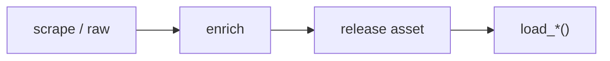

# NBA dataset loaders



## Automation status

| Dataset | Release tag | Pipeline |
|---|---|---|
| `load_nba_pbp` | [espn_nba_pbp](https://github.com/sportsdataverse/sportsdataverse-data/releases/tag/espn_nba_pbp) | — |
| `load_nba_player_boxscore` | [espn_nba_player_boxscores](https://github.com/sportsdataverse/sportsdataverse-data/releases/tag/espn_nba_player_boxscores) | — |
| `load_nba_schedule` | [espn_nba_schedules](https://github.com/sportsdataverse/sportsdataverse-data/releases/tag/espn_nba_schedules) | — |
| `load_nba_team_boxscore` | [espn_nba_team_boxscores](https://github.com/sportsdataverse/sportsdataverse-data/releases/tag/espn_nba_team_boxscores) | — |
| `load_nba_game_rosters` | [espn_nba_game_rosters](https://github.com/sportsdataverse/sportsdataverse-data/releases/tag/espn_nba_game_rosters) | — |
| `load_nba_officials` | [espn_nba_officials](https://github.com/sportsdataverse/sportsdataverse-data/releases/tag/espn_nba_officials) | — |
| `load_nba_shots` | [espn_nba_shots](https://github.com/sportsdataverse/sportsdataverse-data/releases/tag/espn_nba_shots) | — |
| `load_nba_standings` | [espn_nba_standings](https://github.com/sportsdataverse/sportsdataverse-data/releases/tag/espn_nba_standings) | — |
| `load_nba_player_season_stats` | [espn_nba_player_season_stats](https://github.com/sportsdataverse/sportsdataverse-data/releases/tag/espn_nba_player_season_stats) | — |
| `load_nba_team_season_stats` | [espn_nba_team_season_stats](https://github.com/sportsdataverse/sportsdataverse-data/releases/tag/espn_nba_team_season_stats) | — |
| `load_nba_draft` | [espn_nba_draft](https://github.com/sportsdataverse/sportsdataverse-data/releases/tag/espn_nba_draft) | — |
| `load_nba_rosters` | [espn_nba_rosters](https://github.com/sportsdataverse/sportsdataverse-data/releases/tag/espn_nba_rosters) | — |
| `load_nba_stats_schedules` | [nba_stats_schedules](https://github.com/sportsdataverse/sportsdataverse-data/releases/tag/nba_stats_schedules) | — |
| `load_nba_player_impact` | [nba_player_impact](https://github.com/sportsdataverse/sportsdataverse-data/releases/tag/nba_player_impact) | — |

## `load_nba_pbp`

Release: [espn_nba_pbp](https://github.com/sportsdataverse/sportsdataverse-data/releases/tag/espn_nba_pbp) · asset `https://github.com/sportsdataverse/sportsdataverse-data/releases/download/espn_nba_pbp/play_by_play_{season}.parquet`
### Returns

| col_name | type | description |
|---|---|---|
| `id` | Float64 | Id. |
| `sequence_number` | String | Sequence number representing a shot-possession (V3 PBP). |
| `type_id` | Int32 | Type identifier (numeric). |
| `type_text` | String | Display text for the type field. |
| `text` | String | Text description of the play / record. |
| `away_score` | Int32 | Away team score at the time of the play. |
| `home_score` | Int32 | Home team score at the time of the play. |
| `period_number` | Int32 | Numeric period (1-4 for quarters; 5+ for OT). |
| `period_display_value` | String | Period display label (e.g. '1st Quarter', 'OT'). |
| `clock_display_value` | String | Game clock display string (e.g. '8:32'). |
| `scoring_play` | Boolean | TRUE if the play resulted in points scored. |
| `score_value` | Int32 | Point value of the play (2 / 3 / 1). |
| `shooting_play` | Boolean | TRUE if the play was a shooting attempt. |
| `coordinate_x_raw` | Float64 | X coordinate as returned by the API before any adjustment. |
| `coordinate_y_raw` | Float64 | Y coordinate as returned by the API before any adjustment. |
| `season` | Int32 | Season year. |
| `season_type` | Int32 | Season type (1=pre-season, 2=regular season, 3=postseason, 4=off-season for ESPN; or string label for WNBA Stats). |
| `away_team_id` | Int32 | Unique identifier for the away team. |
| `away_team_name` | String | Away team name. |
| `away_team_mascot` | String | Away team mascot. |
| `away_team_abbrev` | String | Away team three-letter abbreviation. |
| `away_team_name_alt` | String | Alternate away team name. |
| `home_team_id` | Int32 | Unique identifier for the home team. |
| `home_team_name` | String | Home team name. |
| `home_team_mascot` | String | Home team mascot. |
| `home_team_abbrev` | String | Home team three-letter abbreviation. |
| `home_team_name_alt` | String | Alternate home team name. |
| `home_team_spread` | Float64 | Home team's point spread. |
| `game_spread` | Float64 | Game spread (signed; positive = home favored). |
| `home_favorite` | Boolean | TRUE if the home team is the betting favorite. |
| `game_spread_available` | Boolean | TRUE if a point spread was available. |
| `game_id` | Int32 | Unique game identifier. |
| `qtr` | Int32 | Quarter (1-4) or OT period (5+). |
| `time` | String | Time / clock value. |
| `clock_minutes` | Int32 | Clock minutes split out for convenience. |
| `clock_seconds` | Float64 | Clock seconds split out for convenience. |
| `half` | String | Half of the game (1 or 2). |
| `game_half` | String | Half of the game (1 or 2). |
| `lead_qtr` | Int32 | Quarter lead (the next-play's quarter). |
| `lead_game_half` | String | Half lead (the next-play's half). |
| `start_quarter_seconds_remaining` | Int32 | Seconds remaining in the period at the start of the play. |
| `start_half_seconds_remaining` | Int32 | Seconds remaining in the half at the start of the play. |
| `start_game_seconds_remaining` | Int32 | Seconds remaining in the game at the start of the play. |
| `game_play_number` | Int32 | Sequential play number within the game. |
| `end_quarter_seconds_remaining` | Int32 | Seconds remaining in the period at the end of the play. |
| `end_half_seconds_remaining` | Int32 | Seconds remaining in the half at the end of the play. |
| `end_game_seconds_remaining` | Int32 | Seconds remaining in the game at the end of the play. |
| `period` | Int32 | Period of the game (1-4 quarters; 5+ for OT). |
| `team_id` | Int32 | Unique team identifier. |
| `athlete_id_1` | Int32 | Primary athlete identifier (e.g. shooter). |
| `athlete_id_2` | Int32 | Secondary athlete identifier (e.g. assister / fouler). |
| `athlete_id_3` | Int32 | Athlete id 3. |
| `lag_qtr` | Int32 | Quarter lag (the previous-play's quarter). |
| `lag_game_half` | String | Half lag (the previous-play's half). |
| `coordinate_x` | Float64 | X coordinate on the court (half-court layout). |
| `coordinate_y` | Float64 | Y coordinate on the court (half-court layout). |
| `game_date` | Date | Game date (YYYY-MM-DD). |
| `game_date_time` | Datetime(time_unit='us', time_zone='America/New_York') | Game start date/time (ISO 8601). |
| `type_abbreviation` | String | Type abbreviation. |

```python
load_nba_pbp(seasons=2024)
```

## `load_nba_player_boxscore`

Release: [espn_nba_player_boxscores](https://github.com/sportsdataverse/sportsdataverse-data/releases/tag/espn_nba_player_boxscores) · asset `https://github.com/sportsdataverse/sportsdataverse-data/releases/download/espn_nba_player_boxscores/player_box_{season}.parquet`
### Returns

| col_name | type | description |
|---|---|---|
| `game_id` | Int32 | Unique game identifier. |
| `season` | Int32 | Season year. |
| `season_type` | Int32 | Season type (1=pre-season, 2=regular season, 3=postseason, 4=off-season for ESPN; or string label for WNBA Stats). |
| `game_date` | Date | Game date (YYYY-MM-DD). |
| `game_date_time` | Datetime(time_unit='us', time_zone='America/New_York') | Game start date/time (ISO 8601). |
| `athlete_id` | Int32 | Unique athlete identifier (ESPN). |
| `athlete_display_name` | String | Athlete display name (full). |
| `team_id` | Int32 | Unique team identifier. |
| `team_name` | String | Full team display name (e.g. 'Las Vegas Aces'). |
| `team_location` | String | Team city or location string. |
| `team_short_display_name` | String | Short team display name (e.g. 'Aces'). |
| `minutes` | Float64 | Minutes played, formatted MM:SS (V3 PT-duration parsed) or decimal minutes (V2). |
| `field_goals_made` | Int32 | Field goals made (2-pt + 3-pt). |
| `field_goals_attempted` | Int32 | Field goal attempts (2-pt + 3-pt). |
| `three_point_field_goals_made` | Int32 | Three-point field goals made. |
| `three_point_field_goals_attempted` | Int32 | Three-point field goal attempts. |
| `free_throws_made` | Int32 | Free throws made. |
| `free_throws_attempted` | Int32 | Free throw attempts. |
| `offensive_rebounds` | Int32 | Offensive rebounds. |
| `defensive_rebounds` | Int32 | Defensive rebounds. |
| `rebounds` | Int32 | Total rebounds. |
| `assists` | Int32 | Total assists. |
| `steals` | Int32 | Total steals. |
| `blocks` | Int32 | Total blocks. |
| `turnovers` | Int32 | Total turnovers. |
| `fouls` | Int32 | Personal fouls. |
| `plus_minus` | String | Plus/minus point differential while on court. |
| `points` | Int32 | Points scored. |
| `starter` | Boolean | TRUE if the player was in the starting lineup; FALSE otherwise. |
| `ejected` | Boolean | TRUE if the player was ejected from the game. |
| `did_not_play` | Boolean | TRUE if the player did not appear in the game. |
| `active` | Boolean | TRUE if the row represents an active record (player / team / season). |
| `athlete_jersey` | String | Athlete jersey number. |
| `athlete_short_name` | String | Athlete short display name. |
| `athlete_headshot_href` | String | Athlete headshot image URL. |
| `athlete_position_name` | String | Athlete position ('Guard', 'Forward', 'Center'). |
| `athlete_position_abbreviation` | String | Athlete position abbreviation (G / F / C). |
| `team_display_name` | String | Full team display name. |
| `team_uid` | String | ESPN universal team identifier (UID format 's:40~l:...~t:...'). |
| `team_slug` | String | URL-safe team identifier (e.g. 'lasvegas-aces' / 'aces'). |
| `team_logo` | String | Team logo image URL. |
| `team_abbreviation` | String | Short team abbreviation (e.g. 'LAS'). |
| `team_color` | String | Team primary color (hex without leading '#'). |
| `team_alternate_color` | String | Team alternate color (hex without leading '#'). |
| `home_away` | String | Game venue label ('home' or 'away'). |
| `team_winner` | Boolean | TRUE if the team won this game. |
| `team_score` | Int32 | Team's score / final score. |
| `opponent_team_id` | Int32 | Unique identifier for the opponent team. |
| `opponent_team_name` | String | Opponent team display name. |
| `opponent_team_location` | String | Opponent team city / location. |
| `opponent_team_display_name` | String | Opponent team full display name. |
| `opponent_team_abbreviation` | String | Opponent team abbreviation. |
| `opponent_team_logo` | String | Opponent team logo URL. |
| `opponent_team_color` | String | Opponent team primary color (hex). |
| `opponent_team_alternate_color` | String | Opponent team alternate color (hex). |
| `opponent_team_score` | Int32 | Opponent team's score. |

```python
load_nba_player_boxscore(seasons=2024)
```

## `load_nba_schedule`

Release: [espn_nba_schedules](https://github.com/sportsdataverse/sportsdataverse-data/releases/tag/espn_nba_schedules) · asset `https://github.com/sportsdataverse/sportsdataverse-data/releases/download/espn_nba_schedules/nba_schedule_{season}.parquet`
### Returns

| col_name | type | description |
|---|---|---|
| `id` | Int32 | Id. |
| `uid` | String | ESPN UID string. |
| `date` | String | Date in YYYY-MM-DD format. |
| `attendance` | Float64 | Reported attendance. |
| `time_valid` | Boolean | Time valid. |
| `neutral_site` | Boolean | Neutral site. |
| `conference_competition` | Boolean | Conference competition. |
| `recent` | Boolean | Recent. |
| `start_date` | String | Start date (YYYY-MM-DD). |
| `notes_type` | String | Notes type. |
| `notes_headline` | String | Notes headline. |
| `type_id` | Int32 | Type identifier (numeric). |
| `type_abbreviation` | String | Type abbreviation. |
| `status_clock` | Float64 | Status clock. |
| `status_display_clock` | String | Status display clock. |
| `status_period` | Float64 | Status period. |
| `status_type_id` | Int32 | Unique identifier for status type. |
| `status_type_name` | String | Status type name. |
| `status_type_state` | String | Status type state. |
| `status_type_completed` | Boolean | Status type completed. |
| `status_type_description` | String | Status type description. |
| `status_type_detail` | String | Status type detail. |
| `status_type_short_detail` | String | Status type short detail. |
| `format_regulation_periods` | Float64 | Format regulation periods. |
| `home_id` | Int32 | Unique identifier for home. |
| `home_uid` | String | Home team's uid. |
| `home_location` | String | Home team's location. |
| `home_name` | String | Home name. |
| `home_abbreviation` | String | Home team's abbreviation. |
| `home_display_name` | String | Home display name. |
| `home_short_display_name` | String | Home short display name. |
| `home_color` | String | Color code (hex) for home. |
| `home_alternate_color` | String | Color code (hex) for home alternate. |
| `home_is_active` | Boolean | Home team's is active. |
| `home_logo` | String | Home team logo URL. |
| `home_score` | Int32 | Home team score at the time of the play. |
| `home_winner` | Boolean | Home team's winner. |
| `away_id` | Int32 | Unique identifier for away. |
| `away_uid` | String | Away team's uid. |
| `away_location` | String | Away team's location. |
| `away_name` | String | Away name. |
| `away_abbreviation` | String | Away team's abbreviation. |
| `away_display_name` | String | Away display name. |
| `away_short_display_name` | String | Away short display name. |
| `away_color` | String | Color code (hex) for away. |
| `away_alternate_color` | String | Color code (hex) for away alternate. |
| `away_is_active` | Boolean | Away team's is active. |
| `away_logo` | String | Away team logo URL. |
| `away_score` | Int32 | Away team score at the time of the play. |
| `away_winner` | Boolean | Away team's winner. |
| `game_id` | Int32 | Unique game identifier. |
| `season` | Int32 | Season year. |
| `season_type` | Int32 | Season type (1=pre-season, 2=regular season, 3=postseason, 4=off-season for ESPN; or string label for WNBA Stats). |
| `venue_id` | Int32 | Unique venue identifier. |
| `venue_full_name` | String | Venue full name. |
| `venue_address_city` | String | Venue address city. |
| `venue_address_state` | String | Venue address state / region. |
| `venue_capacity` | Float64 | Venue seating capacity. |
| `venue_indoor` | Boolean | TRUE if the venue is indoors. |
| `status_type_alt_detail` | String | Status type alt detail. |
| `game_json` | Boolean | Whether processed game JSON is available. |
| `game_json_url` | String | URL to the processed game JSON. |
| `game_date_time` | Datetime(time_unit='us', time_zone='America/New_York') | Game start date/time (ISO 8601). |
| `game_date` | Date | Game date (YYYY-MM-DD). |
| `PBP` | Boolean | Whether play-by-play data is available. |
| `team_box` | Boolean | Team box. |
| `player_box` | Boolean | Player box. |

```python
load_nba_schedule(seasons=2024)
```

## `load_nba_team_boxscore`

Release: [espn_nba_team_boxscores](https://github.com/sportsdataverse/sportsdataverse-data/releases/tag/espn_nba_team_boxscores) · asset `https://github.com/sportsdataverse/sportsdataverse-data/releases/download/espn_nba_team_boxscores/team_box_{season}.parquet`
### Returns

| col_name | type | description |
|---|---|---|
| `game_id` | Int32 | Unique game identifier. |
| `season` | Int32 | Season year. |
| `season_type` | Int32 | Season type (1=pre-season, 2=regular season, 3=postseason, 4=off-season for ESPN; or string label for WNBA Stats). |
| `game_date` | Date | Game date (YYYY-MM-DD). |
| `game_date_time` | Datetime(time_unit='us', time_zone='America/New_York') | Game start date/time (ISO 8601). |
| `team_id` | Int32 | Unique team identifier. |
| `team_uid` | String | ESPN universal team identifier (UID format 's:40~l:...~t:...'). |
| `team_slug` | String | URL-safe team identifier (e.g. 'lasvegas-aces' / 'aces'). |
| `team_location` | String | Team city or location string. |
| `team_name` | String | Full team display name (e.g. 'Las Vegas Aces'). |
| `team_abbreviation` | String | Short team abbreviation (e.g. 'LAS'). |
| `team_display_name` | String | Full team display name. |
| `team_short_display_name` | String | Short team display name (e.g. 'Aces'). |
| `team_color` | String | Team primary color (hex without leading '#'). |
| `team_alternate_color` | String | Team alternate color (hex without leading '#'). |
| `team_logo` | String | Team logo image URL. |
| `team_home_away` | String | Team home away. |
| `team_score` | Int32 | Team's score / final score. |
| `team_winner` | Boolean | TRUE if the team won this game. |
| `assists` | Int32 | Total assists. |
| `blocks` | Int32 | Total blocks. |
| `defensive_rebounds` | Int32 | Defensive rebounds. |
| `fast_break_points` | String | Fast-break points scored. |
| `field_goal_pct` | Float64 | Field goal percentage (0-1). |
| `field_goals_made` | Int32 | Field goals made (2-pt + 3-pt). |
| `field_goals_attempted` | Int32 | Field goal attempts (2-pt + 3-pt). |
| `flagrant_fouls` | Int32 | Total flagrant fouls. |
| `fouls` | Int32 | Personal fouls. |
| `free_throw_pct` | Float64 | Free throw percentage (0-1). |
| `free_throws_made` | Int32 | Free throws made. |
| `free_throws_attempted` | Int32 | Free throw attempts. |
| `offensive_rebounds` | Int32 | Offensive rebounds. |
| `points_in_paint` | String | Points scored in the paint. |
| `steals` | Int32 | Total steals. |
| `team_turnovers` | Int32 | Team turnovers (turnovers credited to the team rather than a player). |
| `technical_fouls` | Int32 | Total technical fouls. |
| `three_point_field_goal_pct` | Float64 | Three-point field goal percentage (0-1). |
| `three_point_field_goals_made` | Int32 | Three-point field goals made. |
| `three_point_field_goals_attempted` | Int32 | Three-point field goal attempts. |
| `total_rebounds` | Int32 | Total rebounds. |
| `total_technical_fouls` | Int32 | Total technical fouls (player + team). |
| `total_turnovers` | Int32 | Total turnovers (player + team). |
| `turnover_points` | String | Turnover points. |
| `turnovers` | Int32 | Total turnovers. |
| `opponent_team_id` | Int32 | Unique identifier for the opponent team. |
| `opponent_team_uid` | String | Opponent team uid. |
| `opponent_team_slug` | String | Opponent team slug. |
| `opponent_team_location` | String | Opponent team city / location. |
| `opponent_team_name` | String | Opponent team display name. |
| `opponent_team_abbreviation` | String | Opponent team abbreviation. |
| `opponent_team_display_name` | String | Opponent team full display name. |
| `opponent_team_short_display_name` | String | Opponent team short display name. |
| `opponent_team_color` | String | Opponent team primary color (hex). |
| `opponent_team_alternate_color` | String | Opponent team alternate color (hex). |
| `opponent_team_logo` | String | Opponent team logo URL. |
| `opponent_team_score` | Int32 | Opponent team's score. |
| `largest_lead` | String | Largest lead during the game. |

```python
load_nba_team_boxscore(seasons=2024)
```

## `load_nba_game_rosters`

Release: [espn_nba_game_rosters](https://github.com/sportsdataverse/sportsdataverse-data/releases/tag/espn_nba_game_rosters) · asset `https://github.com/sportsdataverse/sportsdataverse-data/releases/download/espn_nba_game_rosters/game_rosters_{season}.parquet`
### Returns

| col_name | type | description |
|---|---|---|
| `season` | Int32 | Season year. |
| `game_id` | String | Unique game identifier. |
| `team_id` | Int32 | Unique team identifier. |
| `team_slug` | String | URL-safe team identifier (e.g. 'lasvegas-aces' / 'aces'). |
| `team_abbreviation` | String | Short team abbreviation (e.g. 'LAS'). |
| `team_display_name` | String | Full team display name. |
| `home_away` | String | Game venue label ('home' or 'away'). |
| `athlete_id` | Int32 | Unique athlete identifier (ESPN). |
| `athlete_uid` | String | ESPN athlete UID (universal identifier). |
| `athlete_guid` | String | ESPN athlete GUID. |
| `athlete_display_name` | String | Athlete display name (full). |
| `athlete_short_name` | String | Athlete short display name. |
| `athlete_first_name` | String | Player first name; `athlete_detail = TRUE` only. |
| `athlete_last_name` | String | Athlete last name. |
| `athlete_jersey` | String | Athlete jersey number. |
| `athlete_position` | String | Player position name; `athlete_detail = TRUE` only. |
| `athlete_headshot` | String |  |
| `starter` | Boolean | TRUE if the player was in the starting lineup; FALSE otherwise. |
| `did_not_play` | Boolean | TRUE if the player did not appear in the game. |
| `active` | Boolean | TRUE if the row represents an active record (player / team / season). |
| `ejected` | Boolean | TRUE if the player was ejected from the game. |
| `reason` | String | Reason. |

```python
load_nba_game_rosters(seasons=2002)
```

## `load_nba_officials`

Release: [espn_nba_officials](https://github.com/sportsdataverse/sportsdataverse-data/releases/tag/espn_nba_officials) · asset `https://github.com/sportsdataverse/sportsdataverse-data/releases/download/espn_nba_officials/officials_{season}.parquet`
### Returns

| col_name | type | description |
|---|---|---|
| `season` | Int32 | Season year. |
| `game_id` | Int32 | Unique game identifier. |
| `official_full_name` | String | Full name of an on-court game official as ESPN publishes it in the summary gameInfo.officials array; it is identical to official_display_name in every released NBA row. |
| `official_display_name` | String | ESPN's display-form name for the official, falling back to the full name when ESPN omits it; it never diverges from official_full_name in the released NBA data. |
| `official_position` | String | ESPN's label for the official's assignment slot; the NBA summary feed only ever ships Referee, so this reads the same on every released row. |
| `official_position_id` | Int32 | ESPN's numeric identifier for the official's assignment slot, constant at 40 (Referee) across every released NBA season. |
| `official_order` | Int32 | The official's listing index within the game's crew as ESPN orders them, normally 1 through 3 for a three-person crew; a fourth entry appears in a small share of recent-season games and the sequence is not guaranteed to be gap-free. |

```python
load_nba_officials(seasons=2002)
```

## `load_nba_shots`

Release: [espn_nba_shots](https://github.com/sportsdataverse/sportsdataverse-data/releases/tag/espn_nba_shots) · asset `https://github.com/sportsdataverse/sportsdataverse-data/releases/download/espn_nba_shots/shots_{season}.parquet`
### Returns

| col_name | type | description |
|---|---|---|
| `game_id` | Int32 | Unique game identifier. |
| `season` | Int32 | Season year. |
| `period_number` | Int32 | Numeric period (1-4 for quarters; 5+ for OT). |
| `clock_display_value` | String | Game clock display string (e.g. '8:32'). |
| `team_id` | Int32 | Unique team identifier. |
| `athlete_id_1` | Int32 | Primary athlete identifier (e.g. shooter). |
| `athlete_id_2` | Int32 | Secondary athlete identifier (e.g. assister / fouler). |
| `type_id` | Int32 | Type identifier (numeric). |
| `type_text` | String | Display text for the type field. |
| `scoring_play` | Boolean | TRUE if the play resulted in points scored. |
| `score_value` | Int32 | Point value of the play (2 / 3 / 1). |
| `coordinate_x` | Float64 | X coordinate on the court (half-court layout). |
| `coordinate_y` | Float64 | Y coordinate on the court (half-court layout). |
| `coordinate_x_raw` | Float64 | X coordinate as returned by the API before any adjustment. |
| `coordinate_y_raw` | Float64 | Y coordinate as returned by the API before any adjustment. |

```python
load_nba_shots(seasons=2002)
```

## `load_nba_standings`

Release: [espn_nba_standings](https://github.com/sportsdataverse/sportsdataverse-data/releases/tag/espn_nba_standings) · asset `https://github.com/sportsdataverse/sportsdataverse-data/releases/download/espn_nba_standings/standings_{season}.parquet`
### Returns

| col_name | type | description |
|---|---|---|
| `season` | Int32 | Season year. |
| `group_id` | String | ESPN group id. |
| `group_name` | String | Group name (conference / division). |
| `group_abbreviation` | String | Group abbreviation. |
| `group_short_name` | String | ESPN's short name for the standings grouping the team sits in, read from the group node's shortName; the NBA standings payload supplies only the group name and abbreviation, so this is null throughout. |
| `team_id` | Int32 | Unique team identifier. |
| `team_uid` | String | ESPN universal team identifier (UID format 's:40~l:...~t:...'). |
| `team_slug` | String | URL-safe team identifier (e.g. 'lasvegas-aces' / 'aces'). |
| `team_location` | String | Team city or location string. |
| `team_name` | String | Full team display name (e.g. 'Las Vegas Aces'). |
| `team_abbreviation` | String | Short team abbreviation (e.g. 'LAS'). |
| `team_display_name` | String | Full team display name. |
| `team_short_display_name` | String | Short team display name (e.g. 'Aces'). |
| `team_color` | String | Team primary color (hex without leading '#'). |
| `team_alternate_color` | String | Team alternate color (hex without leading '#'). |
| `team_logo` | String | Team logo image URL. |
| `stat_name` | String | Stat key. |
| `stat_display_name` | String | Stat display name (from `displayNames`). |
| `stat_short_display_name` | String | Short human-readable stat name. |
| `stat_description` | String | ESPN's prose gloss for the standings statistic on this row; for the clincher stat it is not a fixed label but the team's actual status text, such as Clinched Playoff Berth or Eliminated From Playoff. |
| `stat_abbreviation` | String | ESPN's short code for the standings statistic, such as PCT, GB or OPP PPG; it is null for the four record-style splits (Home, Road, vs. Conf., vs. Div.), which ship no abbreviation. |
| `stat_type` | String | Stat type code (e.g. "win", "loss"). |
| `display_value` | String | Display-formatted value. |
| `value` | Float64 | Numeric or string value field. |

```python
load_nba_standings(seasons=2002)
```

## `load_nba_player_season_stats`

Release: [espn_nba_player_season_stats](https://github.com/sportsdataverse/sportsdataverse-data/releases/tag/espn_nba_player_season_stats) · asset `https://github.com/sportsdataverse/sportsdataverse-data/releases/download/espn_nba_player_season_stats/player_season_stats_{season}.parquet`
### Returns

| col_name | type | description |
|---|---|---|
| `season` | Int32 | Season year. |
| `athlete_id` | Int32 | Unique athlete identifier (ESPN). |
| `athlete_display_name` | String | Athlete display name (full). |
| `athlete_position_abbreviation` | String | Athlete position abbreviation (G / F / C). |
| `athlete_jersey` | String | Athlete jersey number. |
| `team_id` | Int32 | Unique team identifier. |
| `team_slug` | String | URL-safe team identifier (e.g. 'lasvegas-aces' / 'aces'). |
| `team_display_name` | String | Full team display name. |
| `category` | String | Category label. |
| `stat_label` | String | Human-readable label of the statistic (e.g. 'At bats'). |
| `stat_name` | String | Stat key. |
| `stat_display_name` | String | Stat display name (from `displayNames`). |
| `stat_description` | String | ESPN's prose definition of the statistic on this row, for example the ratio of field goals made to field goals attempted; for the paired Made-Attempted stats it is the two definitions joined with a hyphen. |
| `display_value` | String | Display-formatted value. |
| `value` | Float64 | Numeric or string value field. |

```python
load_nba_player_season_stats(seasons=2025)
```

## `load_nba_team_season_stats`

Release: [espn_nba_team_season_stats](https://github.com/sportsdataverse/sportsdataverse-data/releases/tag/espn_nba_team_season_stats) · asset `https://github.com/sportsdataverse/sportsdataverse-data/releases/download/espn_nba_team_season_stats/team_season_stats_{season}.parquet`
### Returns

| col_name | type | description |
|---|---|---|
| `season` | Int32 | Season year. |
| `team_id` | Int32 | Unique team identifier. |
| `team_slug` | String | URL-safe team identifier (e.g. 'lasvegas-aces' / 'aces'). |
| `team_abbreviation` | String | Short team abbreviation (e.g. 'LAS'). |
| `team_display_name` | String | Full team display name. |
| `team_short_display_name` | String | Short team display name (e.g. 'Aces'). |
| `team_color` | String | Team primary color (hex without leading '#'). |
| `team_alternate_color` | String | Team alternate color (hex without leading '#'). |
| `team_logo` | String | Team logo image URL. |
| `category` | String | Category label. |
| `stat_label` | String | Human-readable label of the statistic (e.g. 'At bats'). |
| `stat_name` | String | Stat key. |
| `stat_display_name` | String | Stat display name (from `displayNames`). |
| `stat_description` | String | ESPN's prose definition of the team statistic on this row, for example the average number of assists a team records per turnover. |
| `display_value` | String | Display-formatted value. |
| `value` | Float64 | Numeric or string value field. |

```python
load_nba_team_season_stats(seasons=2025)
```

## `load_nba_draft`

Release: [espn_nba_draft](https://github.com/sportsdataverse/sportsdataverse-data/releases/tag/espn_nba_draft) · asset `https://github.com/sportsdataverse/sportsdataverse-data/releases/download/espn_nba_draft/draft_{season}.parquet`
### Returns

| col_name | type | description |
|---|---|---|
| `season` | Int32 | Season year. |
| `round` | Int32 | Tournament / playoff round. |
| `round_display_name` | String | ESPN's display label for the draft round a pick belongs to, read from the round object's displayName; the NBA payload supplies no round metadata, so this is null for every released season 2003 through 2025. |
| `pick` | Int32 | Pick number within the round. |
| `overall_pick` | Int32 | Overall pick number in the draft. |
| `pick_traded` | String | ESPN's traded flag for the pick, carried through as a string rather than a boolean; every released NBA row reads FALSE, so it does not currently identify traded picks. |
| `pick_notes` | String | Free-text note ESPN can attach to a pick, read from the pick's notes or note field; the NBA draft payload never populates it, so it is null across all released seasons. |
| `athlete_id` | Int32 | Unique athlete identifier (ESPN). |
| `athlete_uid` | String | ESPN athlete UID (universal identifier). |
| `athlete_guid` | String | ESPN athlete GUID. |
| `athlete_first_name` | String | Player first name; `athlete_detail = TRUE` only. |
| `athlete_last_name` | String | Athlete last name. |
| `athlete_full_name` | String | Drafted player full name. |
| `athlete_display_name` | String | Athlete display name (full). |
| `athlete_short_name` | String | Athlete short display name. |
| `athlete_height` | String | Athlete height. |
| `athlete_weight` | String | Athlete weight. |
| `athlete_position_abbreviation` | String | Athlete position abbreviation (G / F / C). |
| `athlete_position_name` | String | Athlete position ('Guard', 'Forward', 'Center'). |
| `athlete_headshot_href` | String | Athlete headshot image URL. |
| `college_id` | Int32 | Unique identifier for college. |
| `college_name` | String | College / pre-draft team. |
| `college_short_name` | String | College short name. |
| `college_abbreviation` | String | Abbreviation of the drafted player's college taken from the pick's nested college block; the ESPN NBA draft feed omits that block entirely, so this and the other college columns are null throughout. |
| `team_id` | Int32 | Unique team identifier. |
| `team_uid` | String | ESPN universal team identifier (UID format 's:40~l:...~t:...'). |
| `team_slug` | String | URL-safe team identifier (e.g. 'lasvegas-aces' / 'aces'). |
| `team_location` | String | Team city or location string. |
| `team_name` | String | Full team display name (e.g. 'Las Vegas Aces'). |
| `team_abbreviation` | String | Short team abbreviation (e.g. 'LAS'). |
| `team_display_name` | String | Full team display name. |
| `team_short_display_name` | String | Short team display name (e.g. 'Aces'). |
| `team_color` | String | Team primary color (hex without leading '#'). |
| `team_alternate_color` | String | Team alternate color (hex without leading '#'). |
| `team_logo` | String | Team logo image URL. |

```python
load_nba_draft(seasons=2025)
```

## `load_nba_rosters`

Release: [espn_nba_rosters](https://github.com/sportsdataverse/sportsdataverse-data/releases/tag/espn_nba_rosters) · asset `https://github.com/sportsdataverse/sportsdataverse-data/releases/download/espn_nba_rosters/rosters_{season}.parquet`
### Returns

| col_name | type | description |
|---|---|---|
| `season` | Int32 | Season year. |
| `team_id` | Int32 | Unique team identifier. |
| `team_slug` | String | URL-safe team identifier (e.g. 'lasvegas-aces' / 'aces'). |
| `team_abbreviation` | String | Short team abbreviation (e.g. 'LAS'). |
| `team_display_name` | String | Full team display name. |
| `team_short_display_name` | String | Short team display name (e.g. 'Aces'). |
| `team_color` | String | Team primary color (hex without leading '#'). |
| `team_alternate_color` | String | Team alternate color (hex without leading '#'). |
| `team_logo` | String | Team logo image URL. |
| `athlete_id` | String | Unique athlete identifier (ESPN). |
| `uid` | String | ESPN UID string. |
| `guid` | String | Stable cross-league team GUID. |
| `full_name` | String | Player's full name. |
| `display_name` | String | Display name. |
| `short_name` | String | Short display name. |
| `first_name` | String | Player's first name. |
| `last_name` | String | Player's last name. |
| `jersey` | String | Jersey number worn by the player. |
| `position_abbreviation` | String | Position abbreviation ('G' / 'F' / 'C'). |
| `position_name` | String | Listed roster position ('Guard', 'Forward', 'Center'). |
| `position_id` | String | Unique position identifier. |
| `height` | String | Player height (string e.g. '6-2' or inches). |
| `weight` | String | Player weight in pounds. |
| `age` | String | Player age (in years). |
| `date_of_birth` | String | Date of birth (YYYY-MM-DD). |
| `birth_place_city` | String | Birth place city. |
| `birth_place_state` | String | Birth place state. |
| `birth_place_country` | String | Birth place country. |
| `experience_years` | String | Experience years. |
| `experience_display_value` | String | Experience display value. |
| `headshot_href` | String | Headshot image URL. |
| `headshot_alt` | String | Alternative-text label for the headshot. |
| `link_web` | String | Web link / URL. |
| `status_id` | String | Status identifier. |
| `status_name` | String | Status label. |
| `status_type` | String | Status type. |

```python
load_nba_rosters(seasons=2025)
```

## `load_nba_stats_schedules`

Release: [nba_stats_schedules](https://github.com/sportsdataverse/sportsdataverse-data/releases/tag/nba_stats_schedules) · asset `https://github.com/sportsdataverse/sportsdataverse-data/releases/download/nba_stats_schedules/schedule_{season}-26.parquet`
### Returns

| col_name | type | description |
|---|---|---|
| `game_date` | Date | Game date (YYYY-MM-DD). |
| `game_id` | String | Unique game identifier. |
| `game_code` | String | ESPN game code (numeric identifier). |
| `game_status` | Int32 | Game status label. |
| `game_status_text` | String | Game status display text (e.g. 'Final', '4:32 - 4th'). |
| `game_sequence` | Int32 | Game sequence. |
| `game_date_est` | String | Game date est. |
| `game_time_est` | String | Game time est. |
| `game_date_time_est` | String | Game date time est. |
| `game_date_utc` | String | Game date utc. |
| `game_time_utc` | String | Game start time in UTC (ISO 8601 timestamp). |
| `game_date_time_utc` | String | Game date time utc. |
| `away_team_time` | String | Time / clock value. |
| `home_team_time` | String | Time / clock value. |
| `day` | String | Day number within the month. |
| `month_num` | Int32 | Month num. |
| `week_number` | Int32 | Week number. |
| `week_name` | String | Week name. |
| `if_necessary` | String | If necessary. |
| `series_game_number` | String | Series game number. |
| `game_label` | String | The stats.nba.com event label naming the round or special event a game belongs to, such as NBA Finals, East First Round, Emirates NBA Cup or NBA Mexico City Game; an empty string for an ordinary regular-season game. |
| `game_sub_label` | String |  |
| `series_text` | String | Series text. |
| `arena_name` | String | Arena name. |
| `arena_state` | String | Arena state. |
| `arena_city` | String | Arena city. |
| `postponed_status` | String | Postponed status. |
| `branch_link` | String | Branch link. |
| `game_subtype` | String | Game subtype. |
| `is_neutral` | Boolean |  |
| `home_team_id` | Int32 | Unique identifier for the home team. |
| `home_team_name` | String | Home team name. |
| `home_team_city` | String | Home team city / location. |
| `home_team_tricode` | String | Home team three-letter code. |
| `home_team_slug` | String | Home team's team slug. |
| `home_team_wins` | Int32 | Home team's team wins. |
| `home_team_losses` | Int32 | Home team's team losses. |
| `home_team_score` | Int32 | Home team's score. |
| `home_team_seed` | Int32 | Home team's team seed. |
| `away_team_id` | Int32 | Unique identifier for the away team. |
| `away_team_name` | String | Away team name. |
| `away_team_city` | String | Away team city / location. |
| `away_team_tricode` | String | Away team three-letter code. |
| `away_team_slug` | String | Away team's team slug. |
| `away_team_wins` | Int32 | Away team's team wins. |
| `away_team_losses` | Int32 | Away team's team losses. |
| `away_team_score` | Int32 | Away team's score. |
| `away_team_seed` | Int32 | Away team's team seed. |
| `season` | Int32 | Season year. |
| `league_id` | String | League identifier ('10' = WNBA). |
| `season_type_id` | String | Unique identifier for season type. |
| `season_type_description` | String | Season type description. |

```python
load_nba_stats_schedules(seasons=2025)
```

## `load_nba_player_impact`

Release: [nba_player_impact](https://github.com/sportsdataverse/sportsdataverse-data/releases/tag/nba_player_impact) · asset `https://github.com/sportsdataverse/sportsdataverse-data/releases/download/nba_player_impact/nba_player_impact_{season}.parquet`
### Returns

| col_name | type | description |
|---|---|---|
| `player_id` | Int64 | Unique player identifier. |
| `player_name` | Utf8 | Player name. |
| `team_id` | Int64 | Unique team identifier. |
| `team_abbreviation` | Utf8 | Short team abbreviation (e.g. 'LAS'). |
| `team_name` | Utf8 | Full team display name (e.g. 'Las Vegas Aces'). |
| `teams` | Utf8 | Nested list of member-team membership spans. |
| `o_rapm` | Float64 | Offensive regularized adjusted plus-minus per 100 possessions from the single-season ridge fit over possession-level lineup indicators; positive means the player raised his team's scoring rate while on offense. |
| `d_rapm` | Float64 | Defensive regularized adjusted plus-minus per 100 possessions, negated from the raw points-allowed coefficient so a positive value marks a defender who suppresses opponent scoring. |
| `rapm` | Float64 | Total regularized adjusted plus-minus per 100 possessions, exactly the sum of o_rapm and d_rapm. |
| `off_poss` | Int64 | Number of possessions the player was on the floor on offense, the count of design-matrix rows carrying his offensive indicator and therefore the offensive-side sample size behind o_rapm. |
| `def_poss` | Int64 | Number of possessions the player was on the floor on defense, the sample size behind d_rapm; it tracks off_poss almost exactly because substitutions rarely split an offense-defense pair. |
| `o_adj_rapm` | Float64 |  |
| `d_adj_rapm` | Float64 |  |
| `adj_rapm` | Float64 | Total prior-informed RAPM per 100 possessions, exactly the sum of o_adj_rapm and d_adj_rapm. |
| `ospm` | Float64 | Offensive statistical plus-minus per 100 possessions: the player's per-100 box-score feature vector scored through ridge coefficients trained on that season's o_rapm target. |
| `dspm` | Float64 | Defensive statistical plus-minus per 100 possessions from the same box-score feature vector scored through coefficients trained on the d_rapm target. |
| `spm` | Float64 | Total statistical plus-minus per 100 possessions, exactly the sum of ospm and dspm. |
| `min` | Float64 | Minutes played. |
| `gp` | Int64 | Games played. |
| `obpm` | Float64 | Offensive box plus/minus. |
| `dbpm` | Float64 | Defensive box plus/minus. |
| `bpm` | Float64 | Career box plus/minus. |
| `war` | Float64 | Wins above replacement, computed as (rapm minus a replacement level of -2.0 per 100) times total possessions divided by 100, divided by a points-per-win constant calibrated each season by regressing team wins on full-season point margin. |
| `darko_filtered_skill` | Float64 | DARKO-style Kalman-filtered skill estimate at the end of the player's observed multi-season RAPM panel, i.e. his current-form rating after aging drift and possession-weighted observation noise. |
| `darko_projected_rating` | Float64 | One-season-ahead DARKO forecast, the filtered skill plus the empirical aging-curve drift at the player's last observed age; both season_type rows of a player-season carry the same value because the projection is not playoff-specific. |
| `darko_projected_sd` | Float64 | Standard deviation of the one-season-ahead DARKO forecast, the square root of the filtered state variance plus the Kalman process variance; it sits at roughly 10.19 for a player with only one season in the panel, whose diffuse prior variance was never updated. |
| `season` | Int64 | Season year. |

```python
load_nba_player_impact(seasons=2024)
```
