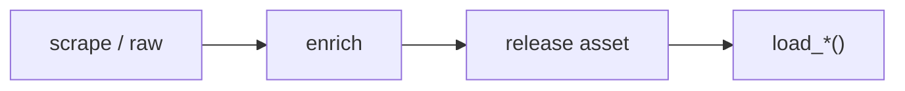

# NBA dataset loaders



## Automation status

| Dataset | Release tag | Pipeline |
|---|---|---|
| `load_nba_pbp` | [espn_nba_pbp](https://github.com/sportsdataverse/sportsdataverse-data/releases/tag/espn_nba_pbp) | — |
| `load_nba_player_boxscore` | [espn_nba_player_boxscores](https://github.com/sportsdataverse/sportsdataverse-data/releases/tag/espn_nba_player_boxscores) | — |
| `load_nba_schedule` | [espn_nba_schedules](https://github.com/sportsdataverse/sportsdataverse-data/releases/tag/espn_nba_schedules) | — |
| `load_nba_team_boxscore` | [espn_nba_team_boxscores](https://github.com/sportsdataverse/sportsdataverse-data/releases/tag/espn_nba_team_boxscores) | — |
| `load_nba_game_rosters` | [espn_nba_game_rosters](https://github.com/sportsdataverse/sportsdataverse-data/releases/tag/espn_nba_game_rosters) | — |
| `load_nba_officials` | [espn_nba_officials](https://github.com/sportsdataverse/sportsdataverse-data/releases/tag/espn_nba_officials) | — |
| `load_nba_shots` | [espn_nba_shots](https://github.com/sportsdataverse/sportsdataverse-data/releases/tag/espn_nba_shots) | — |
| `load_nba_standings` | [espn_nba_standings](https://github.com/sportsdataverse/sportsdataverse-data/releases/tag/espn_nba_standings) | — |
| `load_nba_player_season_stats` | [espn_nba_player_season_stats](https://github.com/sportsdataverse/sportsdataverse-data/releases/tag/espn_nba_player_season_stats) | — |
| `load_nba_team_season_stats` | [espn_nba_team_season_stats](https://github.com/sportsdataverse/sportsdataverse-data/releases/tag/espn_nba_team_season_stats) | — |
| `load_nba_draft` | [espn_nba_draft](https://github.com/sportsdataverse/sportsdataverse-data/releases/tag/espn_nba_draft) | — |
| `load_nba_rosters` | [espn_nba_rosters](https://github.com/sportsdataverse/sportsdataverse-data/releases/tag/espn_nba_rosters) | — |
| `load_nba_stats_schedules` | [nba_stats_schedules](https://github.com/sportsdataverse/sportsdataverse-data/releases/tag/nba_stats_schedules) | — |

## `load_nba_pbp`

Release: [espn_nba_pbp](https://github.com/sportsdataverse/sportsdataverse-data/releases/tag/espn_nba_pbp) · asset `https://github.com/sportsdataverse/sportsdataverse-data/releases/download/espn_nba_pbp/play_by_play_{season}.parquet`
### Returns

| col_name | type |
|---|---|
| `id` | Float64 |
| `sequence_number` | String |
| `type_id` | Int32 |
| `type_text` | String |
| `text` | String |
| `away_score` | Int32 |
| `home_score` | Int32 |
| `period_number` | Int32 |
| `period_display_value` | String |
| `clock_display_value` | String |
| `scoring_play` | Boolean |
| `score_value` | Int32 |
| `shooting_play` | Boolean |
| `coordinate_x_raw` | Float64 |
| `coordinate_y_raw` | Float64 |
| `season` | Int32 |
| `season_type` | Int32 |
| `away_team_id` | Int32 |
| `away_team_name` | String |
| `away_team_mascot` | String |
| `away_team_abbrev` | String |
| `away_team_name_alt` | String |
| `home_team_id` | Int32 |
| `home_team_name` | String |
| `home_team_mascot` | String |
| `home_team_abbrev` | String |
| `home_team_name_alt` | String |
| `home_team_spread` | Float64 |
| `game_spread` | Float64 |
| `home_favorite` | Boolean |
| `game_spread_available` | Boolean |
| `game_id` | Int32 |
| `qtr` | Int32 |
| `time` | String |
| `clock_minutes` | Int32 |
| `clock_seconds` | Float64 |
| `half` | String |
| `game_half` | String |
| `lead_qtr` | Int32 |
| `lead_game_half` | String |
| `start_quarter_seconds_remaining` | Int32 |
| `start_half_seconds_remaining` | Int32 |
| `start_game_seconds_remaining` | Int32 |
| `game_play_number` | Int32 |
| `end_quarter_seconds_remaining` | Int32 |
| `end_half_seconds_remaining` | Int32 |
| `end_game_seconds_remaining` | Int32 |
| `period` | Int32 |
| `team_id` | Int32 |
| `athlete_id_1` | Int32 |
| `athlete_id_2` | Int32 |
| `athlete_id_3` | Int32 |
| `lag_qtr` | Int32 |
| `lag_game_half` | String |
| `coordinate_x` | Float64 |
| `coordinate_y` | Float64 |
| `game_date` | Date |
| `game_date_time` | Datetime(time_unit='us', time_zone='America/New_York') |
| `type_abbreviation` | String |

```python
load_nba_pbp(seasons=2024)
```

## `load_nba_player_boxscore`

Release: [espn_nba_player_boxscores](https://github.com/sportsdataverse/sportsdataverse-data/releases/tag/espn_nba_player_boxscores) · asset `https://github.com/sportsdataverse/sportsdataverse-data/releases/download/espn_nba_player_boxscores/player_box_{season}.parquet`
### Returns

| col_name | type |
|---|---|
| `game_id` | Int32 |
| `season` | Int32 |
| `season_type` | Int32 |
| `game_date` | Date |
| `game_date_time` | Datetime(time_unit='us', time_zone='America/New_York') |
| `athlete_id` | Int32 |
| `athlete_display_name` | String |
| `team_id` | Int32 |
| `team_name` | String |
| `team_location` | String |
| `team_short_display_name` | String |
| `minutes` | Float64 |
| `field_goals_made` | Int32 |
| `field_goals_attempted` | Int32 |
| `three_point_field_goals_made` | Int32 |
| `three_point_field_goals_attempted` | Int32 |
| `free_throws_made` | Int32 |
| `free_throws_attempted` | Int32 |
| `offensive_rebounds` | Int32 |
| `defensive_rebounds` | Int32 |
| `rebounds` | Int32 |
| `assists` | Int32 |
| `steals` | Int32 |
| `blocks` | Int32 |
| `turnovers` | Int32 |
| `fouls` | Int32 |
| `plus_minus` | String |
| `points` | Int32 |
| `starter` | Boolean |
| `ejected` | Boolean |
| `did_not_play` | Boolean |
| `active` | Boolean |
| `athlete_jersey` | String |
| `athlete_short_name` | String |
| `athlete_headshot_href` | String |
| `athlete_position_name` | String |
| `athlete_position_abbreviation` | String |
| `team_display_name` | String |
| `team_uid` | String |
| `team_slug` | String |
| `team_logo` | String |
| `team_abbreviation` | String |
| `team_color` | String |
| `team_alternate_color` | String |
| `home_away` | String |
| `team_winner` | Boolean |
| `team_score` | Int32 |
| `opponent_team_id` | Int32 |
| `opponent_team_name` | String |
| `opponent_team_location` | String |
| `opponent_team_display_name` | String |
| `opponent_team_abbreviation` | String |
| `opponent_team_logo` | String |
| `opponent_team_color` | String |
| `opponent_team_alternate_color` | String |
| `opponent_team_score` | Int32 |

```python
load_nba_player_boxscore(seasons=2024)
```

## `load_nba_schedule`

Release: [espn_nba_schedules](https://github.com/sportsdataverse/sportsdataverse-data/releases/tag/espn_nba_schedules) · asset `https://github.com/sportsdataverse/sportsdataverse-data/releases/download/espn_nba_schedules/nba_schedule_{season}.parquet`
### Returns

| col_name | type |
|---|---|
| `id` | Int32 |
| `uid` | String |
| `date` | String |
| `attendance` | Float64 |
| `time_valid` | Boolean |
| `neutral_site` | Boolean |
| `conference_competition` | Boolean |
| `recent` | Boolean |
| `start_date` | String |
| `notes_type` | String |
| `notes_headline` | String |
| `type_id` | Int32 |
| `type_abbreviation` | String |
| `status_clock` | Float64 |
| `status_display_clock` | String |
| `status_period` | Float64 |
| `status_type_id` | Int32 |
| `status_type_name` | String |
| `status_type_state` | String |
| `status_type_completed` | Boolean |
| `status_type_description` | String |
| `status_type_detail` | String |
| `status_type_short_detail` | String |
| `format_regulation_periods` | Float64 |
| `home_id` | Int32 |
| `home_uid` | String |
| `home_location` | String |
| `home_name` | String |
| `home_abbreviation` | String |
| `home_display_name` | String |
| `home_short_display_name` | String |
| `home_color` | String |
| `home_alternate_color` | String |
| `home_is_active` | Boolean |
| `home_logo` | String |
| `home_score` | Int32 |
| `home_winner` | Boolean |
| `away_id` | Int32 |
| `away_uid` | String |
| `away_location` | String |
| `away_name` | String |
| `away_abbreviation` | String |
| `away_display_name` | String |
| `away_short_display_name` | String |
| `away_color` | String |
| `away_alternate_color` | String |
| `away_is_active` | Boolean |
| `away_logo` | String |
| `away_score` | Int32 |
| `away_winner` | Boolean |
| `game_id` | Int32 |
| `season` | Int32 |
| `season_type` | Int32 |
| `venue_id` | Int32 |
| `venue_full_name` | String |
| `venue_address_city` | String |
| `venue_address_state` | String |
| `venue_capacity` | Float64 |
| `venue_indoor` | Boolean |
| `status_type_alt_detail` | String |
| `game_json` | Boolean |
| `game_json_url` | String |
| `game_date_time` | Datetime(time_unit='us', time_zone='America/New_York') |
| `game_date` | Date |
| `PBP` | Boolean |
| `team_box` | Boolean |
| `player_box` | Boolean |

```python
load_nba_schedule(seasons=2024)
```

## `load_nba_team_boxscore`

Release: [espn_nba_team_boxscores](https://github.com/sportsdataverse/sportsdataverse-data/releases/tag/espn_nba_team_boxscores) · asset `https://github.com/sportsdataverse/sportsdataverse-data/releases/download/espn_nba_team_boxscores/team_box_{season}.parquet`
### Returns

| col_name | type |
|---|---|
| `game_id` | Int32 |
| `season` | Int32 |
| `season_type` | Int32 |
| `game_date` | Date |
| `game_date_time` | Datetime(time_unit='us', time_zone='America/New_York') |
| `team_id` | Int32 |
| `team_uid` | String |
| `team_slug` | String |
| `team_location` | String |
| `team_name` | String |
| `team_abbreviation` | String |
| `team_display_name` | String |
| `team_short_display_name` | String |
| `team_color` | String |
| `team_alternate_color` | String |
| `team_logo` | String |
| `team_home_away` | String |
| `team_score` | Int32 |
| `team_winner` | Boolean |
| `assists` | Int32 |
| `blocks` | Int32 |
| `defensive_rebounds` | Int32 |
| `fast_break_points` | String |
| `field_goal_pct` | Float64 |
| `field_goals_made` | Int32 |
| `field_goals_attempted` | Int32 |
| `flagrant_fouls` | Int32 |
| `fouls` | Int32 |
| `free_throw_pct` | Float64 |
| `free_throws_made` | Int32 |
| `free_throws_attempted` | Int32 |
| `offensive_rebounds` | Int32 |
| `points_in_paint` | String |
| `steals` | Int32 |
| `team_turnovers` | Int32 |
| `technical_fouls` | Int32 |
| `three_point_field_goal_pct` | Float64 |
| `three_point_field_goals_made` | Int32 |
| `three_point_field_goals_attempted` | Int32 |
| `total_rebounds` | Int32 |
| `total_technical_fouls` | Int32 |
| `total_turnovers` | Int32 |
| `turnover_points` | String |
| `turnovers` | Int32 |
| `opponent_team_id` | Int32 |
| `opponent_team_uid` | String |
| `opponent_team_slug` | String |
| `opponent_team_location` | String |
| `opponent_team_name` | String |
| `opponent_team_abbreviation` | String |
| `opponent_team_display_name` | String |
| `opponent_team_short_display_name` | String |
| `opponent_team_color` | String |
| `opponent_team_alternate_color` | String |
| `opponent_team_logo` | String |
| `opponent_team_score` | Int32 |
| `largest_lead` | String |

```python
load_nba_team_boxscore(seasons=2024)
```

## `load_nba_game_rosters`

Release: [espn_nba_game_rosters](https://github.com/sportsdataverse/sportsdataverse-data/releases/tag/espn_nba_game_rosters) · asset `https://github.com/sportsdataverse/sportsdataverse-data/releases/download/espn_nba_game_rosters/game_rosters_{season}.parquet`
### Returns

| col_name | type |
|---|---|
| `season` | Int32 |
| `game_id` | String |
| `team_id` | Int32 |
| `team_slug` | String |
| `team_abbreviation` | String |
| `team_display_name` | String |
| `home_away` | String |
| `athlete_id` | Int32 |
| `athlete_uid` | String |
| `athlete_guid` | String |
| `athlete_display_name` | String |
| `athlete_short_name` | String |
| `athlete_first_name` | String |
| `athlete_last_name` | String |
| `athlete_jersey` | String |
| `athlete_position` | String |
| `athlete_headshot` | String |
| `starter` | Boolean |
| `did_not_play` | Boolean |
| `active` | Boolean |
| `ejected` | Boolean |
| `reason` | String |

```python
load_nba_game_rosters(seasons=2002)
```

## `load_nba_officials`

Release: [espn_nba_officials](https://github.com/sportsdataverse/sportsdataverse-data/releases/tag/espn_nba_officials) · asset `https://github.com/sportsdataverse/sportsdataverse-data/releases/download/espn_nba_officials/officials_{season}.parquet`
### Returns

| col_name | type |
|---|---|
| `season` | Int32 |
| `game_id` | Int32 |
| `official_full_name` | String |
| `official_display_name` | String |
| `official_position` | String |
| `official_position_id` | Int32 |
| `official_order` | Int32 |

```python
load_nba_officials(seasons=2002)
```

## `load_nba_shots`

Release: [espn_nba_shots](https://github.com/sportsdataverse/sportsdataverse-data/releases/tag/espn_nba_shots) · asset `https://github.com/sportsdataverse/sportsdataverse-data/releases/download/espn_nba_shots/shots_{season}.parquet`
### Returns

| col_name | type |
|---|---|
| `game_id` | Int32 |
| `season` | Int32 |
| `period_number` | Int32 |
| `clock_display_value` | String |
| `team_id` | Int32 |
| `athlete_id_1` | Int32 |
| `athlete_id_2` | Int32 |
| `type_id` | Int32 |
| `type_text` | String |
| `scoring_play` | Boolean |
| `score_value` | Int32 |
| `coordinate_x` | Float64 |
| `coordinate_y` | Float64 |
| `coordinate_x_raw` | Float64 |
| `coordinate_y_raw` | Float64 |

```python
load_nba_shots(seasons=2002)
```

## `load_nba_standings`

Release: [espn_nba_standings](https://github.com/sportsdataverse/sportsdataverse-data/releases/tag/espn_nba_standings) · asset `https://github.com/sportsdataverse/sportsdataverse-data/releases/download/espn_nba_standings/standings_{season}.parquet`
### Returns

| col_name | type |
|---|---|
| `season` | Int32 |
| `group_id` | String |
| `group_name` | String |
| `group_abbreviation` | String |
| `group_short_name` | String |
| `team_id` | Int32 |
| `team_uid` | String |
| `team_slug` | String |
| `team_location` | String |
| `team_name` | String |
| `team_abbreviation` | String |
| `team_display_name` | String |
| `team_short_display_name` | String |
| `team_color` | String |
| `team_alternate_color` | String |
| `team_logo` | String |
| `stat_name` | String |
| `stat_display_name` | String |
| `stat_short_display_name` | String |
| `stat_description` | String |
| `stat_abbreviation` | String |
| `stat_type` | String |
| `display_value` | String |
| `value` | Float64 |

```python
load_nba_standings(seasons=2002)
```

## `load_nba_player_season_stats`

Release: [espn_nba_player_season_stats](https://github.com/sportsdataverse/sportsdataverse-data/releases/tag/espn_nba_player_season_stats) · asset `https://github.com/sportsdataverse/sportsdataverse-data/releases/download/espn_nba_player_season_stats/player_season_stats_{season}.parquet`
### Returns

| col_name | type |
|---|---|
| `season` | Int32 |
| `athlete_id` | Int32 |
| `athlete_display_name` | String |
| `athlete_position_abbreviation` | String |
| `athlete_jersey` | String |
| `team_id` | Int32 |
| `team_slug` | String |
| `team_display_name` | String |
| `category` | String |
| `stat_label` | String |
| `stat_name` | String |
| `stat_display_name` | String |
| `stat_description` | String |
| `display_value` | String |
| `value` | Float64 |

```python
load_nba_player_season_stats(seasons=2025)
```

## `load_nba_team_season_stats`

Release: [espn_nba_team_season_stats](https://github.com/sportsdataverse/sportsdataverse-data/releases/tag/espn_nba_team_season_stats) · asset `https://github.com/sportsdataverse/sportsdataverse-data/releases/download/espn_nba_team_season_stats/team_season_stats_{season}.parquet`
### Returns

| col_name | type |
|---|---|
| `season` | Int32 |
| `team_id` | Int32 |
| `team_slug` | String |
| `team_abbreviation` | String |
| `team_display_name` | String |
| `team_short_display_name` | String |
| `team_color` | String |
| `team_alternate_color` | String |
| `team_logo` | String |
| `category` | String |
| `stat_label` | String |
| `stat_name` | String |
| `stat_display_name` | String |
| `stat_description` | String |
| `display_value` | String |
| `value` | Float64 |

```python
load_nba_team_season_stats(seasons=2025)
```

## `load_nba_draft`

Release: [espn_nba_draft](https://github.com/sportsdataverse/sportsdataverse-data/releases/tag/espn_nba_draft) · asset `https://github.com/sportsdataverse/sportsdataverse-data/releases/download/espn_nba_draft/draft_{season}.parquet`
### Returns

| col_name | type |
|---|---|
| `season` | Int32 |
| `round` | Int32 |
| `round_display_name` | String |
| `pick` | Int32 |
| `overall_pick` | Int32 |
| `pick_traded` | String |
| `pick_notes` | String |
| `athlete_id` | Int32 |
| `athlete_uid` | String |
| `athlete_guid` | String |
| `athlete_first_name` | String |
| `athlete_last_name` | String |
| `athlete_full_name` | String |
| `athlete_display_name` | String |
| `athlete_short_name` | String |
| `athlete_height` | String |
| `athlete_weight` | String |
| `athlete_position_abbreviation` | String |
| `athlete_position_name` | String |
| `athlete_headshot_href` | String |
| `college_id` | Int32 |
| `college_name` | String |
| `college_short_name` | String |
| `college_abbreviation` | String |
| `team_id` | Int32 |
| `team_uid` | String |
| `team_slug` | String |
| `team_location` | String |
| `team_name` | String |
| `team_abbreviation` | String |
| `team_display_name` | String |
| `team_short_display_name` | String |
| `team_color` | String |
| `team_alternate_color` | String |
| `team_logo` | String |

```python
load_nba_draft(seasons=2025)
```

## `load_nba_rosters`

Release: [espn_nba_rosters](https://github.com/sportsdataverse/sportsdataverse-data/releases/tag/espn_nba_rosters) · asset `https://github.com/sportsdataverse/sportsdataverse-data/releases/download/espn_nba_rosters/rosters_{season}.parquet`
### Returns

| col_name | type |
|---|---|
| `season` | Int32 |
| `team_id` | Int32 |
| `team_slug` | String |
| `team_abbreviation` | String |
| `team_display_name` | String |
| `team_short_display_name` | String |
| `team_color` | String |
| `team_alternate_color` | String |
| `team_logo` | String |
| `athlete_id` | String |
| `uid` | String |
| `guid` | String |
| `full_name` | String |
| `display_name` | String |
| `short_name` | String |
| `first_name` | String |
| `last_name` | String |
| `jersey` | String |
| `position_abbreviation` | String |
| `position_name` | String |
| `position_id` | String |
| `height` | String |
| `weight` | String |
| `age` | String |
| `date_of_birth` | String |
| `birth_place_city` | String |
| `birth_place_state` | String |
| `birth_place_country` | String |
| `experience_years` | String |
| `experience_display_value` | String |
| `headshot_href` | String |
| `headshot_alt` | String |
| `link_web` | String |
| `status_id` | String |
| `status_name` | String |
| `status_type` | String |

```python
load_nba_rosters(seasons=2025)
```

## `load_nba_stats_schedules`

Release: [nba_stats_schedules](https://github.com/sportsdataverse/sportsdataverse-data/releases/tag/nba_stats_schedules) · asset `https://github.com/sportsdataverse/sportsdataverse-data/releases/download/nba_stats_schedules/schedule_{season}-26.parquet`
### Returns

| col_name | type |
|---|---|
| `game_date` | Date |
| `game_id` | String |
| `game_code` | String |
| `game_status` | Int32 |
| `game_status_text` | String |
| `game_sequence` | Int32 |
| `game_date_est` | String |
| `game_time_est` | String |
| `game_date_time_est` | String |
| `game_date_utc` | String |
| `game_time_utc` | String |
| `game_date_time_utc` | String |
| `away_team_time` | String |
| `home_team_time` | String |
| `day` | String |
| `month_num` | Int32 |
| `week_number` | Int32 |
| `week_name` | String |
| `if_necessary` | String |
| `series_game_number` | String |
| `game_label` | String |
| `game_sub_label` | String |
| `series_text` | String |
| `arena_name` | String |
| `arena_state` | String |
| `arena_city` | String |
| `postponed_status` | String |
| `branch_link` | String |
| `game_subtype` | String |
| `is_neutral` | Boolean |
| `home_team_id` | Int32 |
| `home_team_name` | String |
| `home_team_city` | String |
| `home_team_tricode` | String |
| `home_team_slug` | String |
| `home_team_wins` | Int32 |
| `home_team_losses` | Int32 |
| `home_team_score` | Int32 |
| `home_team_seed` | Int32 |
| `away_team_id` | Int32 |
| `away_team_name` | String |
| `away_team_city` | String |
| `away_team_tricode` | String |
| `away_team_slug` | String |
| `away_team_wins` | Int32 |
| `away_team_losses` | Int32 |
| `away_team_score` | Int32 |
| `away_team_seed` | Int32 |
| `season` | Int32 |
| `league_id` | String |
| `season_type_id` | String |
| `season_type_description` | String |

```python
load_nba_stats_schedules(seasons=2025)
```
