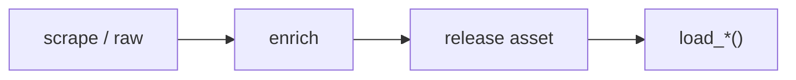

# NFL dataset loaders



## Automation status

| Dataset | Release tag | Pipeline |
|---|---|---|
| `load_nfl_pbp` | [pbp](https://github.com/nflverse/nflverse-data/releases/tag/pbp) | — |
| `load_nfl_model_pbp` | [nfl_model_pbp](https://github.com/sportsdataverse/sportsdataverse-data/releases/tag/nfl_model_pbp) | — |
| `load_nfl_ratings_weekly` | [nfl_ratings_weekly](https://github.com/sportsdataverse/sportsdataverse-data/releases/tag/nfl_ratings_weekly) | — |
| `load_nfl_rosters` | [rosters](https://github.com/nflverse/nflverse-data/releases/tag/rosters) | — |
| `load_nfl_weekly_rosters` | [weekly_rosters](https://github.com/nflverse/nflverse-data/releases/tag/weekly_rosters) | — |
| `load_nfl_depth_charts` | [depth_charts](https://github.com/nflverse/nflverse-data/releases/tag/depth_charts) | — |
| `load_nfl_injuries` | [injuries](https://github.com/nflverse/nflverse-data/releases/tag/injuries) | — |
| `load_nfl_snap_counts` | [snap_counts](https://github.com/nflverse/nflverse-data/releases/tag/snap_counts) | — |
| `load_nfl_pbp_participation` | [pbp_participation](https://github.com/nflverse/nflverse-data/releases/tag/pbp_participation) | — |
| `load_nfl_ftn_charting` | [ftn_charting](https://github.com/nflverse/nflverse-data/releases/tag/ftn_charting) | — |

## `load_nfl_pbp`

Release: [pbp](https://github.com/nflverse/nflverse-data/releases/tag/pbp) · asset `https://github.com/nflverse/nflverse-data/releases/download/pbp/play_by_play_{season}.parquet`
### Returns

| col_name | type | description |
|---|---|---|
| `play_id` | Float64 | Numeric play id that when used with game_id and drive provides the unique identifier for a single play. |
| `game_id` | String | Ten digit identifier for NFL game. |
| `old_game_id` | String | Legacy NFL game ID. |
| `home_team` | String | The home team. Note that this contains the designated home team for games which no team is playing at home such as Super Bowls or NFL International games. |
| `away_team` | String | String abbreviation for the away team. |
| `season_type` | String | REG or POST indicating if the timeframe belongs to regular or post season. |
| `week` | Int32 | Season week. |
| `posteam` | String | String abbreviation for the team with possession. |
| `posteam_type` | String | String indicating whether the posteam team is home or away. |
| `defteam` | String | String abbreviation for the team on defense. |
| `side_of_field` | String | String abbreviation for which team's side of the field the team with possession is currently on. |
| `yardline_100` | Float64 | Numeric distance in the number of yards from the opponent's endzone for the posteam. |
| `game_date` | String | Date of the game. |
| `quarter_seconds_remaining` | Float64 | Numeric seconds remaining in the quarter. |
| `half_seconds_remaining` | Float64 | Numeric seconds remaining in the half. |
| `game_seconds_remaining` | Float64 | Numeric seconds remaining in the game. |
| `game_half` | String | String indicating which half the play is in, either Half1, Half2, or Overtime. |
| `quarter_end` | Float64 | Binary indicator for whether or not the row of the data is marking the end of a quarter. |
| `drive` | Float64 | Numeric drive number in the game. |
| `sp` | Float64 | Binary indicator for whether or not a score occurred on the play. |
| `qtr` | Float64 | Quarter of the game (5 is overtime). |
| `down` | Float64 | The down for the given play. |
| `goal_to_go` | Int32 | Binary indicator for whether or not the posteam is in a goal down situation. |
| `time` | String | Time at start of play provided in string format as minutes:seconds remaining in the quarter. |
| `yrdln` | String | String indicating the current field position for a given play. |
| `ydstogo` | Float64 | Numeric yards in distance from either the first down marker or the endzone in goal down situations. |
| `ydsnet` | Float64 | Numeric value for total yards gained on the given drive. |
| `desc` | String | Detailed string description for the given play. |
| `play_type` | String | String indicating the type of play: pass (includes sacks), run (includes scrambles), punt, field_goal, kickoff, extra_point, qb_kneel, qb_spike, no_play (timeouts and penalties), and missing for rows indicating end of play. |
| `yards_gained` | Float64 | Numeric yards gained (or lost) by the possessing team, excluding yards gained via fumble recoveries and laterals. |
| `shotgun` | Float64 | Binary indicator for whether or not the play was in shotgun formation. |
| `no_huddle` | Float64 | Binary indicator for whether or not the play was in no_huddle formation. |
| `qb_dropback` | Float64 | Binary indicator for whether or not the QB dropped back on the play (pass attempt, sack, or scrambled). |
| `qb_kneel` | Float64 | Binary indicator for whether or not the QB took a knee. |
| `qb_spike` | Float64 | Binary indicator for whether or not the QB spiked the ball. |
| `qb_scramble` | Float64 | Binary indicator for whether or not the QB scrambled. |
| `pass_length` | String | String indicator for pass length: short or deep. |
| `pass_location` | String | String indicator for pass location: left, middle, or right. |
| `air_yards` | Float64 | Numeric value for distance in yards perpendicular to the line of scrimmage at where the targeted receiver either caught or didn't catch the ball. |
| `yards_after_catch` | Float64 | Numeric value for distance in yards perpendicular to the yard line where the receiver made the reception to where the play ended. |
| `run_location` | String | String indicator for location of run: left, middle, or right. |
| `run_gap` | String | String indicator for line gap of run: end, guard, or tackle |
| `field_goal_result` | String | String indicator for result of field goal attempt: made, missed, or blocked. |
| `kick_distance` | Float64 | Numeric distance in yards for kickoffs, field goals, and punts. |
| `extra_point_result` | String | String indicator for the result of the extra point attempt: good, failed, blocked, safety (touchback in defensive endzone is 1 point apparently), or aborted. |
| `two_point_conv_result` | String | String indicator for result of two point conversion attempt: success, failure, safety (touchback in defensive endzone is 1 point apparently), or return. |
| `home_timeouts_remaining` | Float64 | Numeric timeouts remaining in the half for the home team. |
| `away_timeouts_remaining` | Float64 | Numeric timeouts remaining in the half for the away team. |
| `timeout` | Float64 | Binary indicator for whether or not a timeout was called by either team. |
| `timeout_team` | String | String abbreviation for which team called the timeout. |
| `td_team` | String | String abbreviation for which team scored the touchdown. |
| `td_player_name` | String | String name of the player who scored a touchdown. |
| `td_player_id` | String | Unique identifier of the player who scored a touchdown. |
| `posteam_timeouts_remaining` | Float64 | Number of timeouts remaining for the possession team. |
| `defteam_timeouts_remaining` | Float64 | Number of timeouts remaining for the team on defense. |
| `total_home_score` | Float64 | Score for the home team at the start of the play. |
| `total_away_score` | Float64 | Score for the away team at the start of the play. |
| `posteam_score` | Float64 | Score the posteam at the start of the play. |
| `defteam_score` | Float64 | Score the defteam at the start of the play. |
| `score_differential` | Float64 | Score differential between the posteam and defteam at the start of the play. |
| `posteam_score_post` | Float64 | Score for the posteam at the end of the play. |
| `defteam_score_post` | Float64 | Score for the defteam at the end of the play. |
| `score_differential_post` | Float64 | Score differential between the posteam and defteam at the end of the play. |
| `no_score_prob` | Float64 | Predicted probability of no score occurring for the rest of the half based on the expected points model. |
| `opp_fg_prob` | Float64 | Predicted probability of the defteam scoring a FG next. 'Next' in this context means the next score in the same game half. |
| `opp_safety_prob` | Float64 | Predicted probability of the defteam scoring a safety next. 'Next' in this context means the next score in the same game half. |
| `opp_td_prob` | Float64 | Predicted probability of the defteam scoring a TD next. 'Next' in this context means the next score in the same game half. |
| `fg_prob` | Float64 | Predicted probability of the posteam scoring a FG next. 'Next' in this context means the next score in the same game half. |
| `safety_prob` | Float64 | Predicted probability of the posteam scoring a safety next. 'Next' in this context means the next score in the same game half. |
| `td_prob` | Float64 | Predicted probability of the posteam scoring a TD next. 'Next' in this context means the next score in the same game half. |
| `extra_point_prob` | Float64 | Predicted probability of the posteam scoring an extra point. |
| `two_point_conversion_prob` | Float64 | Predicted probability of the posteam scoring the two point conversion. |
| `ep` | Float64 | Using the scoring event probabilities, the estimated expected points with respect to the possession team for the given play. |
| `epa` | Float64 | Expected points added (EPA) by the posteam for the given play. |
| `total_home_epa` | Float64 | Cumulative total EPA for the home team in the game so far. |
| `total_away_epa` | Float64 | Cumulative total EPA for the away team in the game so far. |
| `total_home_rush_epa` | Float64 | Cumulative total rushing EPA for the home team in the game so far. |
| `total_away_rush_epa` | Float64 | Cumulative total rushing EPA for the away team in the game so far. |
| `total_home_pass_epa` | Float64 | Cumulative total passing EPA for the home team in the game so far. |
| `total_away_pass_epa` | Float64 | Cumulative total passing EPA for the away team in the game so far. |
| `air_epa` | Float64 | EPA from the air yards alone. For completions this represents the actual value provided through the air. For incompletions this represents the hypothetical value that could've been added through the air if the pass was completed. |
| `yac_epa` | Float64 | EPA from the yards after catch alone. For completions this represents the actual value provided after the catch. For incompletions this represents the difference between the hypothetical air_epa and the play's raw observed EPA (how much the incomplete pass cost the posteam). |
| `comp_air_epa` | Float64 | EPA from the air yards alone only for completions. |
| `comp_yac_epa` | Float64 | EPA from the yards after catch alone only for completions. |
| `total_home_comp_air_epa` | Float64 | Cumulative total completions air EPA for the home team in the game so far. |
| `total_away_comp_air_epa` | Float64 | Cumulative total completions air EPA for the away team in the game so far. |
| `total_home_comp_yac_epa` | Float64 | Cumulative total completions yac EPA for the home team in the game so far. |
| `total_away_comp_yac_epa` | Float64 | Cumulative total completions yac EPA for the away team in the game so far. |
| `total_home_raw_air_epa` | Float64 | Cumulative total raw air EPA for the home team in the game so far. |
| `total_away_raw_air_epa` | Float64 | Cumulative total raw air EPA for the away team in the game so far. |
| `total_home_raw_yac_epa` | Float64 | Cumulative total raw yac EPA for the home team in the game so far. |
| `total_away_raw_yac_epa` | Float64 | Cumulative total raw yac EPA for the away team in the game so far. |
| `wp` | Float64 | Estimated win probability for the posteam given the current situation at the start of the given play. |
| `def_wp` | Float64 | Estimated win probability for the defteam. |
| `home_wp` | Float64 | Estimated win probability for the home team. |
| `away_wp` | Float64 | Estimated win probability for the away team. |
| `wpa` | Float64 | Win probability added (WPA) for the posteam. |
| `vegas_wpa` | Float64 | Win probability added (WPA) for the posteam: spread_adjusted model. |
| `vegas_home_wpa` | Float64 | Win probability added (WPA) for the home team: spread_adjusted model. |
| `home_wp_post` | Float64 | Estimated win probability for the home team at the end of the play. |
| `away_wp_post` | Float64 | Estimated win probability for the away team at the end of the play. |
| `vegas_wp` | Float64 | Estimated win probability for the posteam given the current situation at the start of the given play, incorporating pre-game Vegas line. |
| `vegas_home_wp` | Float64 | Estimated win probability for the home team incorporating pre-game Vegas line. |
| `total_home_rush_wpa` | Float64 | Cumulative total rushing WPA for the home team in the game so far. |
| `total_away_rush_wpa` | Float64 | Cumulative total rushing WPA for the away team in the game so far. |
| `total_home_pass_wpa` | Float64 | Cumulative total passing WPA for the home team in the game so far. |
| `total_away_pass_wpa` | Float64 | Cumulative total passing WPA for the away team in the game so far. |
| `air_wpa` | Float64 | WPA through the air (same logic as air_epa). |
| `yac_wpa` | Float64 | WPA from yards after the catch (same logic as yac_epa). |
| `comp_air_wpa` | Float64 | The air_wpa for completions only. |
| `comp_yac_wpa` | Float64 | The yac_wpa for completions only. |
| `total_home_comp_air_wpa` | Float64 | Cumulative total completions air WPA for the home team in the game so far. |
| `total_away_comp_air_wpa` | Float64 | Cumulative total completions air WPA for the away team in the game so far. |
| `total_home_comp_yac_wpa` | Float64 | Cumulative total completions yac WPA for the home team in the game so far. |
| `total_away_comp_yac_wpa` | Float64 | Cumulative total completions yac WPA for the away team in the game so far. |
| `total_home_raw_air_wpa` | Float64 | Cumulative total raw air WPA for the home team in the game so far. |
| `total_away_raw_air_wpa` | Float64 | Cumulative total raw air WPA for the away team in the game so far. |
| `total_home_raw_yac_wpa` | Float64 | Cumulative total raw yac WPA for the home team in the game so far. |
| `total_away_raw_yac_wpa` | Float64 | Cumulative total raw yac WPA for the away team in the game so far. |
| `punt_blocked` | Float64 | Binary indicator for if the punt was blocked. |
| `first_down_rush` | Float64 | Binary indicator for if a running play converted the first down. |
| `first_down_pass` | Float64 | Binary indicator for if a passing play converted the first down. |
| `first_down_penalty` | Float64 | Binary indicator for if a penalty converted the first down. |
| `third_down_converted` | Float64 | Binary indicator for if the first down was converted on third down. |
| `third_down_failed` | Float64 | Binary indicator for if the posteam failed to convert first down on third down. |
| `fourth_down_converted` | Float64 | Binary indicator for if the first down was converted on fourth down. |
| `fourth_down_failed` | Float64 | Binary indicator for if the posteam failed to convert first down on fourth down. |
| `incomplete_pass` | Float64 | Binary indicator for if the pass was incomplete. |
| `touchback` | Float64 | Binary indicator for if a touchback occurred on the play. |
| `interception` | Float64 | Binary indicator for if the pass was intercepted. |
| `punt_inside_twenty` | Float64 | Binary indicator for if the punt ended inside the twenty yard line. |
| `punt_in_endzone` | Float64 | Binary indicator for if the punt was in the endzone. |
| `punt_out_of_bounds` | Float64 | Binary indicator for if the punt went out of bounds. |
| `punt_downed` | Float64 | Binary indicator for if the punt was downed. |
| `punt_fair_catch` | Float64 | Binary indicator for if the punt was caught with a fair catch. |
| `kickoff_inside_twenty` | Float64 | Binary indicator for if the kickoff ended inside the twenty yard line. |
| `kickoff_in_endzone` | Float64 | Binary indicator for if the kickoff was in the endzone. |
| `kickoff_out_of_bounds` | Float64 | Binary indicator for if the kickoff went out of bounds. |
| `kickoff_downed` | Float64 | Binary indicator for if the kickoff was downed. |
| `kickoff_fair_catch` | Float64 | Binary indicator for if the kickoff was caught with a fair catch. |
| `fumble_forced` | Float64 | Binary indicator for if the fumble was forced. |
| `fumble_not_forced` | Float64 | Binary indicator for if the fumble was not forced. |
| `fumble_out_of_bounds` | Float64 | Binary indicator for if the fumble went out of bounds. |
| `solo_tackle` | Float64 | Binary indicator if the play had a solo tackle (could be multiple due to fumbles). |
| `safety` | Float64 | Binary indicator for whether or not a safety occurred. |
| `penalty` | Float64 | Binary indicator for whether or not a penalty occurred. |
| `tackled_for_loss` | Float64 | Binary indicator for whether or not a tackle for loss on a run play occurred. |
| `fumble_lost` | Float64 | Binary indicator for if the fumble was lost. |
| `own_kickoff_recovery` | Float64 | Binary indicator for if the kicking team recovered the kickoff. |
| `own_kickoff_recovery_td` | Float64 | Binary indicator for if the kicking team recovered the kickoff and scored a TD. |
| `qb_hit` | Float64 | Binary indicator if the QB was hit on the play. |
| `rush_attempt` | Float64 | Binary indicator for if the play was a run. |
| `pass_attempt` | Float64 | Binary indicator for if the play was a pass attempt (includes sacks). |
| `sack` | Float64 | Binary indicator for if the play ended in a sack. |
| `touchdown` | Float64 | Binary indicator for if the play resulted in a TD. |
| `pass_touchdown` | Float64 | Binary indicator for if the play resulted in a passing TD. |
| `rush_touchdown` | Float64 | Binary indicator for if the play resulted in a rushing TD. |
| `return_touchdown` | Float64 | Binary indicator for if the play resulted in a return TD. Returns may occur on any of: interception, fumble, kickoff, punt, or blocked kicks. |
| `extra_point_attempt` | Float64 | Binary indicator for extra point attempt. |
| `two_point_attempt` | Float64 | Binary indicator for two point conversion attempt. |
| `field_goal_attempt` | Float64 | Binary indicator for field goal attempt. |
| `kickoff_attempt` | Float64 | Binary indicator for kickoff. |
| `punt_attempt` | Float64 | Binary indicator for punts. |
| `fumble` | Float64 | Binary indicator for if a fumble occurred. |
| `complete_pass` | Float64 | Binary indicator for if the pass was completed. |
| `assist_tackle` | Float64 | Binary indicator for if an assist tackle occurred. |
| `lateral_reception` | Float64 | Binary indicator for if a lateral occurred on the reception. |
| `lateral_rush` | Float64 | Binary indicator for if a lateral occurred on a run. |
| `lateral_return` | Float64 | Binary indicator for if a lateral occurred on a return. Returns may occur on any of: interception, fumble, kickoff, punt, or blocked kicks. |
| `lateral_recovery` | Float64 | Binary indicator for if a lateral occurred on a fumble recovery. |
| `passer_player_id` | String | Unique identifier for the player that attempted the pass. |
| `passer_player_name` | String | String name for the player that attempted the pass. |
| `passing_yards` | Float64 | Numeric yards by the passer_player_name, including yards gained in pass plays with laterals. This should equal official passing statistics. |
| `receiver_player_id` | String | Unique identifier for the receiver that was targeted on the pass. |
| `receiver_player_name` | String | String name for the targeted receiver. |
| `receiving_yards` | Float64 | Numeric yards by the receiver_player_name, excluding yards gained in pass plays with laterals. This should equal official receiving statistics but could miss yards gained in pass plays with laterals. Please see the description of `lateral_receiver_player_name` for further information. |
| `rusher_player_id` | String | Unique identifier for the player that attempted the run. |
| `rusher_player_name` | String | String name for the player that attempted the run. |
| `rushing_yards` | Float64 | Numeric yards by the rusher_player_name, excluding yards gained in rush plays with laterals. This should equal official rushing statistics but could miss yards gained in rush plays with laterals. Please see the description of `lateral_rusher_player_name` for further information. |
| `lateral_receiver_player_id` | String | Unique identifier for the player that received the last(!) lateral on a pass play. |
| `lateral_receiver_player_name` | String | String name for the player that received the last(!) lateral on a pass play. If there were multiple laterals in the same play, this will only be the last player who received a lateral. Please see <https://github.com/mrcaseb/nfl-data/tree/master/data/lateral_yards> for a list of plays where multiple players recorded lateral receiving yards. |
| `lateral_receiving_yards` | Float64 | Numeric yards by the `lateral_receiver_player_name` in pass plays with laterals. Please see the description of `lateral_receiver_player_name` for further information. |
| `lateral_rusher_player_id` | String | Unique identifier for the player that received the last(!) lateral on a run play. |
| `lateral_rusher_player_name` | String | String name for the player that received the last(!) lateral on a run play. If there were multiple laterals in the same play, this will only be the last player who received a lateral. Please see <https://github.com/mrcaseb/nfl-data/tree/master/data/lateral_yards> for a list of plays where multiple players recorded lateral rushing yards. |
| `lateral_rushing_yards` | Float64 | Numeric yards by the `lateral_rusher_player_name` in run plays with laterals. Please see the description of `lateral_rusher_player_name` for further information. |
| `lateral_sack_player_id` | String | Unique identifier for the player that received the lateral on a sack. |
| `lateral_sack_player_name` | String | String name for the player that received the lateral on a sack. |
| `interception_player_id` | String | Unique identifier for the player that intercepted the pass. |
| `interception_player_name` | String | String name for the player that intercepted the pass. |
| `lateral_interception_player_id` | String | Unique identifier for the player that received the lateral on an interception. |
| `lateral_interception_player_name` | String | String name for the player that received the lateral on an interception. |
| `punt_returner_player_id` | String | Unique identifier for the punt returner. |
| `punt_returner_player_name` | String | String name for the punt returner. |
| `lateral_punt_returner_player_id` | String | Unique identifier for the player that received the lateral on a punt return. |
| `lateral_punt_returner_player_name` | String | String name for the player that received the lateral on a punt return. |
| `kickoff_returner_player_name` | String | String name for the kickoff returner. |
| `kickoff_returner_player_id` | String | Unique identifier for the kickoff returner. |
| `lateral_kickoff_returner_player_id` | String | Unique identifier for the player that received the lateral on a kickoff return. |
| `lateral_kickoff_returner_player_name` | String | String name for the player that received the lateral on a kickoff return. |
| `punter_player_id` | String | Unique identifier for the punter. |
| `punter_player_name` | String | String name for the punter. |
| `kicker_player_name` | String | String name for the kicker on FG or kickoff. |
| `kicker_player_id` | String | Unique identifier for the kicker on FG or kickoff. |
| `own_kickoff_recovery_player_id` | String | Unique identifier for the player that recovered their own kickoff. |
| `own_kickoff_recovery_player_name` | String | String name for the player that recovered their own kickoff. |
| `blocked_player_id` | String | Unique identifier for the player that blocked the punt or FG. |
| `blocked_player_name` | String | String name for the player that blocked the punt or FG. |
| `tackle_for_loss_1_player_id` | String | Unique identifier for one of the potential players with the tackle for loss. |
| `tackle_for_loss_1_player_name` | String | String name for one of the potential players with the tackle for loss. |
| `tackle_for_loss_2_player_id` | String | Unique identifier for one of the potential players with the tackle for loss. |
| `tackle_for_loss_2_player_name` | String | String name for one of the potential players with the tackle for loss. |
| `qb_hit_1_player_id` | String | Unique identifier for one of the potential players that hit the QB. No sack as the QB was not the ball carrier. For sacks please see `sack_player` or `half_sack_*_player`. |
| `qb_hit_1_player_name` | String | String name for one of the potential players that hit the QB. No sack as the QB was not the ball carrier. For sacks please see `sack_player` or `half_sack_*_player`. |
| `qb_hit_2_player_id` | String | Unique identifier for one of the potential players that hit the QB. No sack as the QB was not the ball carrier. For sacks please see `sack_player` or `half_sack_*_player`. |
| `qb_hit_2_player_name` | String | String name for one of the potential players that hit the QB. No sack as the QB was not the ball carrier. For sacks please see `sack_player` or `half_sack_*_player`. |
| `forced_fumble_player_1_team` | String | Team of one of the players with a forced fumble. |
| `forced_fumble_player_1_player_id` | String | Unique identifier of one of the players with a forced fumble. |
| `forced_fumble_player_1_player_name` | String | String name of one of the players with a forced fumble. |
| `forced_fumble_player_2_team` | String | Team of one of the players with a forced fumble. |
| `forced_fumble_player_2_player_id` | String | Unique identifier of one of the players with a forced fumble. |
| `forced_fumble_player_2_player_name` | String | String name of one of the players with a forced fumble. |
| `solo_tackle_1_team` | String | Team of one of the players with a solo tackle. |
| `solo_tackle_2_team` | String | Team of one of the players with a solo tackle. |
| `solo_tackle_1_player_id` | String | Unique identifier of one of the players with a solo tackle. |
| `solo_tackle_2_player_id` | String | Unique identifier of one of the players with a solo tackle. |
| `solo_tackle_1_player_name` | String | String name of one of the players with a solo tackle. |
| `solo_tackle_2_player_name` | String | String name of one of the players with a solo tackle. |
| `assist_tackle_1_player_id` | String | Unique identifier of one of the players with a tackle assist. |
| `assist_tackle_1_player_name` | String | String name of one of the players with a tackle assist. |
| `assist_tackle_1_team` | String | Team of one of the players with a tackle assist. |
| `assist_tackle_2_player_id` | String | Unique identifier of one of the players with a tackle assist. |
| `assist_tackle_2_player_name` | String | String name of one of the players with a tackle assist. |
| `assist_tackle_2_team` | String | Team of one of the players with a tackle assist. |
| `assist_tackle_3_player_id` | String | Unique identifier of one of the players with a tackle assist. |
| `assist_tackle_3_player_name` | String | String name of one of the players with a tackle assist. |
| `assist_tackle_3_team` | String | Team of one of the players with a tackle assist. |
| `assist_tackle_4_player_id` | String | Unique identifier of one of the players with a tackle assist. |
| `assist_tackle_4_player_name` | String | String name of one of the players with a tackle assist. |
| `assist_tackle_4_team` | String | Team of one of the players with a tackle assist. |
| `tackle_with_assist` | Float64 | Binary indicator for if there has been a tackle with assist. |
| `tackle_with_assist_1_player_id` | String | Unique identifier of one of the players with a tackle with assist. |
| `tackle_with_assist_1_player_name` | String | String name of one of the players with a tackle with assist. |
| `tackle_with_assist_1_team` | String | Team of one of the players with a tackle with assist. |
| `tackle_with_assist_2_player_id` | String | Unique identifier of one of the players with a tackle with assist. |
| `tackle_with_assist_2_player_name` | String | String name of one of the players with a tackle with assist. |
| `tackle_with_assist_2_team` | String | Team of one of the players with a tackle with assist. |
| `pass_defense_1_player_id` | String | Unique identifier of one of the players with a pass defense. |
| `pass_defense_1_player_name` | String | String name of one of the players with a pass defense. |
| `pass_defense_2_player_id` | String | Unique identifier of one of the players with a pass defense. |
| `pass_defense_2_player_name` | String | String name of one of the players with a pass defense. |
| `fumbled_1_team` | String | Team of one of the first player with a fumble. |
| `fumbled_1_player_id` | String | Unique identifier of the first player who fumbled on the play. |
| `fumbled_1_player_name` | String | String name of one of the first player who fumbled on the play. |
| `fumbled_2_player_id` | String | Unique identifier of the second player who fumbled on the play. |
| `fumbled_2_player_name` | String | String name of one of the second player who fumbled on the play. |
| `fumbled_2_team` | String | Team of one of the second player with a fumble. |
| `fumble_recovery_1_team` | String | Team of one of the players with a fumble recovery. |
| `fumble_recovery_1_yards` | Float64 | Yards gained by one of the players with a fumble recovery. |
| `fumble_recovery_1_player_id` | String | Unique identifier of one of the players with a fumble recovery. |
| `fumble_recovery_1_player_name` | String | String name of one of the players with a fumble recovery. |
| `fumble_recovery_2_team` | String | Team of one of the players with a fumble recovery. |
| `fumble_recovery_2_yards` | Float64 | Yards gained by one of the players with a fumble recovery. |
| `fumble_recovery_2_player_id` | String | Unique identifier of one of the players with a fumble recovery. |
| `fumble_recovery_2_player_name` | String | String name of one of the players with a fumble recovery. |
| `sack_player_id` | String | Unique identifier of the player who recorded a solo sack. |
| `sack_player_name` | String | String name of the player who recorded a solo sack. |
| `half_sack_1_player_id` | String | Unique identifier of the first player who recorded half a sack. |
| `half_sack_1_player_name` | String | String name of the first player who recorded half a sack. |
| `half_sack_2_player_id` | String | Unique identifier of the second player who recorded half a sack. |
| `half_sack_2_player_name` | String | String name of the second player who recorded half a sack. |
| `return_team` | String | String abbreviation of the return team. Returns may occur on any of: interception, fumble, kickoff, punt, or blocked kicks. |
| `return_yards` | Float64 | Yards gained by the return team. Returns may occur on any of: interception, fumble, kickoff, punt, or blocked kicks. |
| `penalty_team` | String | String abbreviation of the team with the penalty. |
| `penalty_player_id` | String | Unique identifier for the player with the penalty. |
| `penalty_player_name` | String | String name for the player with the penalty. |
| `penalty_yards` | Float64 | Yards gained (or lost) by the posteam from the penalty. |
| `replay_or_challenge` | Float64 | Binary indicator for whether or not a replay or challenge. |
| `replay_or_challenge_result` | String | String indicating the result of the replay or challenge. |
| `penalty_type` | String | String indicating the penalty type of the first penalty in the given play. Will be `NA` if `desc` is missing the type. |
| `defensive_two_point_attempt` | Float64 | Binary indicator whether or not the defense was able to have an attempt on a two point conversion, this results following a turnover. |
| `defensive_two_point_conv` | Float64 | Binary indicator whether or not the defense successfully scored on the two point conversion. |
| `defensive_extra_point_attempt` | Float64 | Binary indicator whether or not the defense was able to have an attempt on an extra point attempt, this results following a blocked attempt that the defense recovers the ball. |
| `defensive_extra_point_conv` | Float64 | Binary indicator whether or not the defense successfully scored on an extra point attempt. |
| `safety_player_name` | String | String name for the player who scored a safety. |
| `safety_player_id` | String | Unique identifier for the player who scored a safety. |
| `season` | Int32 | 4 digit number indicating to which season(s) the specified timeframe belongs to. |
| `cp` | Float64 | Numeric value indicating the probability for a complete pass based on comparable game situations. |
| `cpoe` | Float64 | Completion percentage over expected in PERCENTAGE POINTS, not a 0-1 rate -- 100 * (complete_pass - cp) per pass play, so a completed pass with cp 0.368 scores +63.2 and the same pass falling incomplete scores -36.8. Averaged over a passer's attempts it is the familiar CPOE of a few points either way; divide by 100 before combining it with 0-1 probabilities such as cp. Null on non-pass rows. |
| `series` | Float64 | Starts at 1, each new first down increments, numbers shared across both teams NA: kickoffs, extra point/two point conversion attempts, non-plays, no posteam |
| `series_success` | Float64 | 1: scored touchdown, gained enough yards for first down. |
| `series_result` | String | Possible values: First down, Touchdown, Opp touchdown, Field goal, Missed field goal, Safety, Turnover, Punt, Turnover on downs, QB kneel, End of half |
| `order_sequence` | Float64 | Column provided by NFL to fix out-of-order plays. Available 2011 and beyond with source "nfl". |
| `start_time` | String | Kickoff time in eastern time zone. |
| `time_of_day` | String | Time of day of play in UTC "HH:MM:SS" format. Available 2011 and beyond with source "nfl". |
| `stadium` | String | Name of the stadium |
| `weather` | String | String describing the weather including temperature, humidity and wind (direction and speed). Doesn't change during the game! |
| `nfl_api_id` | String | UUID of the game in the new NFL API. |
| `play_clock` | String | Time on the playclock when the ball was snapped. |
| `play_deleted` | Float64 | Binary indicator for deleted plays. |
| `play_type_nfl` | String | Play type as listed in the NFL source. Slightly different to the regular play_type variable. |
| `special_teams_play` | Float64 | Binary indicator for whether play is special teams play from NFL source. Available 2011 and beyond with source "nfl". |
| `st_play_type` | String | Type of special teams play from NFL source. Available 2011 and beyond with source "nfl". |
| `end_clock_time` | String | Game time at the end of a given play. |
| `end_yard_line` | String | String indicating the yardline at the end of the given play consisting of team half and yard line number. |
| `fixed_drive` | Float64 | Manually created drive number in a game. |
| `fixed_drive_result` | String | Manually created drive result. |
| `drive_real_start_time` | String | Local day time when the drive started (currently not used by the NFL and therefore mostly 'NA'). |
| `drive_play_count` | Float64 | Numeric value of how many regular plays happened in a given drive. |
| `drive_time_of_possession` | String | Time of possession in a given drive. |
| `drive_first_downs` | Float64 | Number of first downs in a given drive. |
| `drive_inside20` | Float64 | Binary indicator if the offense was able to get inside the opponents 20 yard line. |
| `drive_ended_with_score` | Float64 | Binary indicator the drive ended with a score. |
| `drive_quarter_start` | Float64 | Numeric value indicating in which quarter the given drive has started. |
| `drive_quarter_end` | Float64 | Numeric value indicating in which quarter the given drive has ended. |
| `drive_yards_penalized` | Float64 | Numeric value of how many yards the offense gained or lost through penalties in the given drive. |
| `drive_start_transition` | String | String indicating how the offense got the ball. |
| `drive_end_transition` | String | String indicating how the offense lost the ball. |
| `drive_game_clock_start` | String | Game time at the beginning of a given drive. |
| `drive_game_clock_end` | String | Game time at the end of a given drive. |
| `drive_start_yard_line` | String | String indicating where a given drive started consisting of team half and yard line number. |
| `drive_end_yard_line` | String | String indicating where a given drive ended consisting of team half and yard line number. |
| `drive_play_id_started` | Float64 | Play_id of the first play in the given drive. |
| `drive_play_id_ended` | Float64 | Play_id of the last play in the given drive. |
| `away_score` | Int32 | The number of points the away team scored. Is NA for games which haven't yet been played. |
| `home_score` | Int32 | The number of points the home team scored. Is NA for games which haven't yet been played. |
| `location` | String | Either Home if the home team is playing in their home stadium, or Neutral if the game is being played at a neutral location. This still shows as Home for games between the Giants and Jets even though they share the same home stadium. |
| `result` | Int32 | The number of points the home team scored minus the number of points the visiting team scored. Equals h_score - v_score. Is NA for games which haven't yet been played. Convenient for evaluating against the spread bets. |
| `total` | Int32 | The sum of each team's score in the game. Equals h_score + v_score. Is NA for games which haven't yet been played. Convenient for evaluating over/under total bets. |
| `spread_line` | Float64 | The closing spread line for the game. A positive number means the home team was favored by that many points, a negative number means the away team was favored by that many points. (Source: Pro-Football-Reference) |
| `total_line` | Float64 | The closing total line for the game. (Source: Pro-Football-Reference) |
| `div_game` | Int32 | Binary indicator of whether or not game was played by 2 teams in the same division. |
| `roof` | String | One of 'dome', 'outdoors', 'closed', 'open' indicating indicating the roof status of the stadium the game was played in. (Source: Pro-Football-Reference) |
| `surface` | String | What type of ground the game was played on. (Source: Pro-Football-Reference) |
| `temp` | Int32 | The temperature at the stadium only for 'roof' = 'outdoors' or 'open'.(Source: Pro-Football-Reference) |
| `wind` | Int32 | The speed of the wind in miles/hour only for 'roof' = 'outdoors' or 'open'. (Source: Pro-Football-Reference) |
| `home_coach` | String | First and last name of the home team coach. (Source: Pro-Football-Reference) |
| `away_coach` | String | First and last name of the away team coach. (Source: Pro-Football-Reference) |
| `stadium_id` | String | ID of the stadium the game was played in. (Source: Pro-Football-Reference) |
| `game_stadium` | String | Name of the stadium the game was played in. (Source: Pro-Football-Reference) |
| `aborted_play` | Float64 | Binary indicator if the play description indicates "Aborted". |
| `success` | Float64 | Binary indicator whether epa > 0 in the given play. |
| `passer` | String | Name of the dropback player (scrambles included) including plays with penalties. |
| `passer_jersey_number` | Int32 | Jersey number of the passer. |
| `rusher` | String | Name of the rusher (no scrambles) including plays with penalties. |
| `rusher_jersey_number` | Int32 | Jersey number of the rusher. |
| `receiver` | String | Name of the receiver including plays with penalties. |
| `receiver_jersey_number` | Int32 | Jersey number of the receiver. |
| `pass` | Float64 | Binary indicator if the play was a pass play (sacks and scrambles included). |
| `rush` | Float64 | Binary indicator if the play was a rushing play. |
| `first_down` | Float64 | Binary indicator if the play ended in a first down. |
| `special` | Float64 | Binary indicator if "play_type" is one of "extra_point", "field_goal", "kickoff", or "punt". |
| `play` | Float64 | Binary indicator: 1 if the play was a 'normal' play (including penalties), 0 otherwise. |
| `passer_id` | String | ID of the player in the 'passer' column. |
| `rusher_id` | String | ID of the player in the 'rusher' column. |
| `receiver_id` | String | ID of the player in the 'receiver' column. |
| `name` | String | Name, as reported by MFL but reordered into FirstName LastName instead of Last, First |
| `jersey_number` | Int32 | Jersey number. Often useful for joins by name/team/jersey. |
| `id` | String | ID of the player in the 'name' column. |
| `fantasy_player_name` | String | Name of the rusher on rush plays or receiver on pass plays (from official stats). |
| `fantasy_player_id` | String | ID of the rusher on rush plays or receiver on pass plays (from official stats). |
| `fantasy` | String | Name of the rusher on rush plays or receiver on pass plays. |
| `fantasy_id` | String | ID of the rusher on rush plays or receiver on pass plays. |
| `out_of_bounds` | Float64 | 1 if play description contains ran ob, pushed ob, or sacked ob; 0 otherwise. |
| `home_opening_kickoff` | Float64 | 1 if the home team received the opening kickoff, 0 otherwise. |
| `qb_epa` | Float64 | Gives QB credit for EPA for up to the point where a receiver lost a fumble after a completed catch and makes EPA work more like passing yards on plays with fumbles. |
| `xyac_epa` | Float64 | Expected value of EPA gained after the catch, starting from where the catch was made. Zero yards after the catch would be listed as zero EPA. |
| `xyac_mean_yardage` | Float64 | Average expected yards after the catch based on where the ball was caught. |
| `xyac_median_yardage` | Int32 | Median expected yards after the catch based on where the ball was caught. |
| `xyac_success` | Float64 | Probability play earns positive EPA (relative to where play started) based on where ball was caught. |
| `xyac_fd` | Float64 | Probability play earns a first down based on where the ball was caught. |
| `xpass` | Float64 | Probability of dropback scaled from 0 to 1. |
| `pass_oe` | Float64 | Dropback percent over expected on a given play scaled from 0 to 100. |

```python
load_nfl_pbp(seasons=2024)
```

## `load_nfl_model_pbp`

Release: [nfl_model_pbp](https://github.com/sportsdataverse/sportsdataverse-data/releases/tag/nfl_model_pbp) · asset `https://github.com/sportsdataverse/sportsdataverse-data/releases/download/nfl_model_pbp/model_pbp_{season}.parquet`
### Returns

| col_name | type | description |
|---|---|---|
| `game_id` | String | Ten digit identifier for NFL game. |
| `season` | Int64 | 4 digit number indicating to which season(s) the specified timeframe belongs to. |
| `week` | Int64 | Season week. |
| `season_type` | String | REG or POST indicating if the timeframe belongs to regular or post season. |
| `play_id` | Int64 | Numeric play id that when used with game_id and drive provides the unique identifier for a single play. |
| `play_seq` | Float64 | Game-global sequential play order from the NFL.com Shield feed; ordering key within a game (game_id + play_seq is unique). |
| `posteam` | String | String abbreviation for the team with possession. |
| `defteam` | String | String abbreviation for the team on defense. |
| `home_team` | String | The home team. Note that this contains the designated home team for games which no team is playing at home such as Super Bowls or NFL International games. |
| `away_team` | String | String abbreviation for the away team. |
| `home` | Int64 | Home team name. |
| `qtr` | Int64 | Quarter of the game (5 is overtime). |
| `game_half` | String | String indicating which half the play is in, either Half1, Half2, or Overtime. |
| `down` | Int64 | The down for the given play. |
| `ydstogo` | Int64 | Numeric yards in distance from either the first down marker or the endzone in goal down situations. |
| `yardline_100` | Int64 | Numeric distance in the number of yards from the opponent's endzone for the posteam. |
| `goal_to_go` | Int64 | Binary indicator for whether or not the posteam is in a goal down situation. |
| `quarter_seconds_remaining` | Int64 | Numeric seconds remaining in the quarter. |
| `half_seconds_remaining` | Int64 | Numeric seconds remaining in the half. |
| `game_seconds_remaining` | Int64 | Numeric seconds remaining in the game. |
| `play_type` | String | String indicating the type of play: pass (includes sacks), run (includes scrambles), punt, field_goal, kickoff, extra_point, qb_kneel, qb_spike, no_play (timeouts and penalties), and missing for rows indicating end of play. |
| `yards_gained` | Int64 | Numeric yards gained (or lost) by the possessing team, excluding yards gained via fumble recoveries and laterals. |
| `desc` | String | Detailed string description for the given play. |
| `shield_play_type` | String | Raw NFL.com Shield play-type enum for the play (e.g. RUSH, PASS, FIELD_GOAL, KICK_OFF, PENALTY, END_QUARTER, GAME_START, COMMENT) -- the unmapped upstream value behind the nflfastR-style play_type. |
| `special_teams_play_type` | String | Shield special-teams sub-type qualifier; UNSPECIFIED on ordinary plays and PENALTY when the special-teams play resolved to a penalty. |
| `sp` | Int64 | Binary indicator for whether or not a score occurred on the play. |
| `pass_attempt` | Int64 | Binary indicator for if the play was a pass attempt (includes sacks). |
| `complete_pass` | Int64 | Binary indicator for if the pass was completed. |
| `incomplete_pass` | Int64 | Binary indicator for if the pass was incomplete. |
| `interception` | Int64 | Binary indicator for if the pass was intercepted. |
| `rush_attempt` | Int64 | Binary indicator for if the play was a run. |
| `sack` | Int64 | Binary indicator for if the play ended in a sack. |
| `touchdown` | Int64 | Binary indicator for if the play resulted in a TD. |
| `pass_touchdown` | Int64 | Binary indicator for if the play resulted in a passing TD. |
| `rush_touchdown` | Int64 | Binary indicator for if the play resulted in a rushing TD. |
| `return_touchdown` | Int64 | Binary indicator for if the play resulted in a return TD. Returns may occur on any of: interception, fumble, kickoff, punt, or blocked kicks. |
| `field_goal_attempt` | Int64 | Binary indicator for field goal attempt. |
| `field_goal_made` | Int64 | Binary indicator (1/0) that the field-goal attempt on this play was good. |
| `field_goal_missed` | Int64 | Binary indicator (1/0) that the field-goal attempt on this play was missed (not blocked). |
| `field_goal_blocked` | Int64 | Binary indicator (1/0) that the field-goal attempt on this play was blocked. |
| `extra_point_attempt` | Int64 | Binary indicator for extra point attempt. |
| `two_point_attempt` | Int64 | Binary indicator for two point conversion attempt. |
| `punt_attempt` | Int64 | Binary indicator for punts. |
| `kickoff_attempt` | Int64 | Binary indicator for kickoff. |
| `penalty` | Int64 | Binary indicator for whether or not a penalty occurred. |
| `fumble` | Int64 | Binary indicator for if a fumble occurred. |
| `fumble_lost` | Int64 | Binary indicator for if the fumble was lost. |
| `qb_hit` | Int64 | Binary indicator if the QB was hit on the play. |
| `safety` | Int64 | Binary indicator for whether or not a safety occurred. |
| `timeout` | Int64 | Binary indicator for whether or not a timeout was called by either team. |
| `first_down_rush` | Int64 | Binary indicator for if a running play converted the first down. |
| `first_down_pass` | Int64 | Binary indicator for if a passing play converted the first down. |
| `first_down_penalty` | Int64 | Binary indicator for if a penalty converted the first down. |
| `solo_tackle` | Int64 | Binary indicator if the play had a solo tackle (could be multiple due to fumbles). |
| `assist_tackle` | Int64 | Binary indicator for if an assist tackle occurred. |
| `tackle_with_assist` | Int64 | Binary indicator for if there has been a tackle with assist. |
| `tackled_for_loss` | Int64 | Binary indicator for whether or not a tackle for loss on a run play occurred. |
| `fumble_forced` | Int64 | Binary indicator for if the fumble was forced. |
| `fumble_not_forced` | Int64 | Binary indicator for if the fumble was not forced. |
| `fumble_out_of_bounds` | Int64 | Binary indicator for if the fumble went out of bounds. |
| `punt_fair_catch` | Int64 | Binary indicator for if the punt was caught with a fair catch. |
| `punt_downed` | Int64 | Binary indicator for if the punt was downed. |
| `punt_out_of_bounds` | Int64 | Binary indicator for if the punt went out of bounds. |
| `kickoff_fair_catch` | Int64 | Binary indicator for if the kickoff was caught with a fair catch. |
| `kickoff_out_of_bounds` | Int64 | Binary indicator for if the kickoff went out of bounds. |
| `extra_point_good` | Int64 | Binary indicator (1/0) that the extra-point kick on this play was good. |
| `extra_point_failed` | Int64 | Binary indicator (1/0) that the extra-point kick on this play was missed (not blocked or aborted). |
| `extra_point_blocked` | Int64 | Binary indicator (1/0) that the extra-point kick on this play was blocked. |
| `extra_point_safety` | Int64 | Binary indicator (1/0) that the extra-point attempt on this play resulted in a defensive safety (one point for the defense). |
| `extra_point_aborted` | Int64 | Binary indicator (1/0) that the extra-point attempt on this play was aborted (botched snap or hold, no kick attempted). |
| `two_point_rush_good` | Int64 | Binary indicator (1/0) that the two-point conversion attempt was a rush that converted. |
| `two_point_rush_failed` | Int64 | Binary indicator (1/0) that the two-point conversion attempt was a rush that failed. |
| `two_point_rush_safety` | Int64 | Binary indicator (1/0) that a rushing two-point conversion attempt ended in a safety for the defense. |
| `two_point_pass_good` | Int64 | Binary indicator (1/0) that the two-point conversion attempt was a pass that converted. |
| `two_point_pass_failed` | Int64 | Binary indicator (1/0) that the two-point conversion attempt was a pass that failed. |
| `two_point_pass_safety` | Int64 | Binary indicator (1/0) that a passing two-point conversion attempt ended in a safety for the defense. |
| `two_point_pass_reception_good` | Int64 | Binary indicator (1/0) that the two-point conversion was completed and credited as a reception. |
| `two_point_pass_reception_failed` | Int64 | Binary indicator (1/0) that the two-point conversion pass was thrown but not completed for the conversion. |
| `two_point_return` | Int64 | Binary indicator (1/0) that the defense returned a failed conversion attempt for two points. |
| `def_tackles_for_loss` | Int64 | Number of tackles for loss (TFL) for this player |
| `def_tackles_for_loss_yards` | Int64 | Yards lost from TFLs involving this player |
| `td_ids_touchdown` | Int64 | Count of touchdowns credited on the play from the Shield scoring-participant ids (2 on the rare multi-score bookkeeping rows). |
| `misc_yards` | Int64 | Yards gained or lost on the play that are not attributed to a rush, pass, or return (miscellaneous Shield yardage bucket). |
| `fumble_recovery_own_lateral_yards` | Int64 | Yards gained or lost after an own-team fumble recovery that came via a lateral. |
| `fumble_recovery_opp_lateral_yards` | Int64 | Yards gained or lost after an opponent fumble recovery that came via a lateral. |
| `air_yards` | Int64 | Numeric value for distance in yards perpendicular to the line of scrimmage at where the targeted receiver either caught or didn't catch the ball. |
| `yards_after_catch` | Int64 | Numeric value for distance in yards perpendicular to the yard line where the receiver made the reception to where the play ended. |
| `passing_yards` | Int64 | Numeric yards by the passer_player_name, including yards gained in pass plays with laterals. This should equal official passing statistics. |
| `rushing_yards` | Int64 | Numeric yards by the rusher_player_name, excluding yards gained in rush plays with laterals. This should equal official rushing statistics but could miss yards gained in rush plays with laterals. Please see the description of `lateral_rusher_player_name` for further information. |
| `receiving_yards` | Int64 | Numeric yards by the receiver_player_name, excluding yards gained in pass plays with laterals. This should equal official receiving statistics but could miss yards gained in pass plays with laterals. Please see the description of `lateral_receiver_player_name` for further information. |
| `penalty_yards` | Int64 | Yards gained (or lost) by the posteam from the penalty. |
| `kick_distance` | Int64 | Numeric distance in yards for kickoffs, field goals, and punts. |
| `return_yards` | Int64 | Yards gained by the return team. Returns may occur on any of: interception, fumble, kickoff, punt, or blocked kicks. |
| `lateral_rushing_yards` | Int64 | Numeric yards by the `lateral_rusher_player_name` in run plays with laterals. Please see the description of `lateral_rusher_player_name` for further information. |
| `lateral_receiving_yards` | Int64 | Numeric yards by the `lateral_receiver_player_name` in pass plays with laterals. Please see the description of `lateral_receiver_player_name` for further information. |
| `passer_player_id` | String | Unique identifier for the player that attempted the pass. |
| `passer_player_name` | String | String name for the player that attempted the pass. |
| `rusher_player_id` | String | Unique identifier for the player that attempted the run. |
| `rusher_player_name` | String | String name for the player that attempted the run. |
| `receiver_player_id` | String | Unique identifier for the receiver that was targeted on the pass. |
| `receiver_player_name` | String | String name for the targeted receiver. |
| `td_player_id` | String | Unique identifier of the player who scored a touchdown. |
| `td_player_name` | String | String name of the player who scored a touchdown. |
| `td_team` | String | String abbreviation for which team scored the touchdown. |
| `penalty_team` | String | String abbreviation of the team with the penalty. |
| `timeout_team` | String | String abbreviation for which team called the timeout. |
| `kicker_player_id` | String | Unique identifier for the kicker on FG or kickoff. |
| `kicker_player_name` | String | String name for the kicker on FG or kickoff. |
| `punter_player_id` | String | Unique identifier for the punter. |
| `punter_player_name` | String | String name for the punter. |
| `punt_returner_player_id` | String | Unique identifier for the punt returner. |
| `punt_returner_player_name` | String | String name for the punt returner. |
| `kickoff_returner_player_id` | String | Unique identifier for the kickoff returner. |
| `kickoff_returner_player_name` | String | String name for the kickoff returner. |
| `return_team` | String | String abbreviation of the return team. Returns may occur on any of: interception, fumble, kickoff, punt, or blocked kicks. |
| `interception_player_id` | String | Unique identifier for the player that intercepted the pass. |
| `interception_player_name` | String | String name for the player that intercepted the pass. |
| `sack_player_id` | String | Unique identifier of the player who recorded a solo sack. |
| `sack_player_name` | String | String name of the player who recorded a solo sack. |
| `safety_player_id` | String | Unique identifier for the player who scored a safety. |
| `safety_player_name` | String | String name for the player who scored a safety. |
| `blocked_player_id` | String | Unique identifier for the player that blocked the punt or FG. |
| `blocked_player_name` | String | String name for the player that blocked the punt or FG. |
| `penalty_player_id` | String | Unique identifier for the player with the penalty. |
| `penalty_player_name` | String | String name for the player with the penalty. |
| `solo_tackle_1_player_id` | String | Unique identifier of one of the players with a solo tackle. |
| `solo_tackle_1_player_name` | String | String name of one of the players with a solo tackle. |
| `solo_tackle_1_team` | String | Team of one of the players with a solo tackle. |
| `solo_tackle_2_player_id` | String | Unique identifier of one of the players with a solo tackle. |
| `solo_tackle_2_player_name` | String | String name of one of the players with a solo tackle. |
| `solo_tackle_2_team` | String | Team of one of the players with a solo tackle. |
| `assist_tackle_1_player_id` | String | Unique identifier of one of the players with a tackle assist. |
| `assist_tackle_1_player_name` | String | String name of one of the players with a tackle assist. |
| `assist_tackle_1_team` | String | Team of one of the players with a tackle assist. |
| `assist_tackle_2_player_id` | String | Unique identifier of one of the players with a tackle assist. |
| `assist_tackle_2_player_name` | String | String name of one of the players with a tackle assist. |
| `assist_tackle_2_team` | String | Team of one of the players with a tackle assist. |
| `assist_tackle_3_player_id` | String | Unique identifier of one of the players with a tackle assist. |
| `assist_tackle_3_player_name` | String | String name of one of the players with a tackle assist. |
| `assist_tackle_3_team` | String | Team of one of the players with a tackle assist. |
| `assist_tackle_4_player_id` | String | Unique identifier of one of the players with a tackle assist. |
| `assist_tackle_4_player_name` | String | String name of one of the players with a tackle assist. |
| `assist_tackle_4_team` | String | Team of one of the players with a tackle assist. |
| `tackle_with_assist_1_player_id` | String | Unique identifier of one of the players with a tackle with assist. |
| `tackle_with_assist_1_player_name` | String | String name of one of the players with a tackle with assist. |
| `tackle_with_assist_1_team` | String | Team of one of the players with a tackle with assist. |
| `tackle_with_assist_2_player_id` | String | Unique identifier of one of the players with a tackle with assist. |
| `tackle_with_assist_2_player_name` | String | String name of one of the players with a tackle with assist. |
| `tackle_with_assist_2_team` | String | Team of one of the players with a tackle with assist. |
| `tackle_for_loss_1_player_id` | String | Unique identifier for one of the potential players with the tackle for loss. |
| `tackle_for_loss_1_player_name` | String | String name for one of the potential players with the tackle for loss. |
| `tackle_for_loss_2_player_id` | String | Unique identifier for one of the potential players with the tackle for loss. |
| `tackle_for_loss_2_player_name` | String | String name for one of the potential players with the tackle for loss. |
| `half_sack_1_player_id` | String | Unique identifier of the first player who recorded half a sack. |
| `half_sack_1_player_name` | String | String name of the first player who recorded half a sack. |
| `half_sack_2_player_id` | String | Unique identifier of the second player who recorded half a sack. |
| `half_sack_2_player_name` | String | String name of the second player who recorded half a sack. |
| `qb_hit_1_player_id` | String | Unique identifier for one of the potential players that hit the QB. No sack as the QB was not the ball carrier. For sacks please see `sack_player` or `half_sack_*_player`. |
| `qb_hit_1_player_name` | String | String name for one of the potential players that hit the QB. No sack as the QB was not the ball carrier. For sacks please see `sack_player` or `half_sack_*_player`. |
| `qb_hit_2_player_id` | String | Unique identifier for one of the potential players that hit the QB. No sack as the QB was not the ball carrier. For sacks please see `sack_player` or `half_sack_*_player`. |
| `qb_hit_2_player_name` | String | String name for one of the potential players that hit the QB. No sack as the QB was not the ball carrier. For sacks please see `sack_player` or `half_sack_*_player`. |
| `pass_defense_1_player_id` | String | Unique identifier of one of the players with a pass defense. |
| `pass_defense_1_player_name` | String | String name of one of the players with a pass defense. |
| `pass_defense_2_player_id` | String | Unique identifier of one of the players with a pass defense. |
| `pass_defense_2_player_name` | String | String name of one of the players with a pass defense. |
| `forced_fumble_player_1_player_id` | String | Unique identifier of one of the players with a forced fumble. |
| `forced_fumble_player_1_player_name` | String | String name of one of the players with a forced fumble. |
| `forced_fumble_player_1_team` | String | Team of one of the players with a forced fumble. |
| `forced_fumble_player_2_player_id` | String | Unique identifier of one of the players with a forced fumble. |
| `forced_fumble_player_2_player_name` | String | String name of one of the players with a forced fumble. |
| `forced_fumble_player_2_team` | String | Team of one of the players with a forced fumble. |
| `fumbled_1_player_id` | String | Unique identifier of the first player who fumbled on the play. |
| `fumbled_1_player_name` | String | String name of one of the first player who fumbled on the play. |
| `fumbled_1_team` | String | Team of one of the first player with a fumble. |
| `fumbled_2_player_id` | String | Unique identifier of the second player who fumbled on the play. |
| `fumbled_2_player_name` | String | String name of one of the second player who fumbled on the play. |
| `fumbled_2_team` | String | Team of one of the second player with a fumble. |
| `fumble_recovery_1_player_id` | String | Unique identifier of one of the players with a fumble recovery. |
| `fumble_recovery_1_player_name` | String | String name of one of the players with a fumble recovery. |
| `fumble_recovery_1_team` | String | Team of one of the players with a fumble recovery. |
| `fumble_recovery_1_yards` | Int64 | Yards gained by one of the players with a fumble recovery. |
| `fumble_recovery_2_player_id` | String | Unique identifier of one of the players with a fumble recovery. |
| `fumble_recovery_2_player_name` | String | String name of one of the players with a fumble recovery. |
| `fumble_recovery_2_team` | String | Team of one of the players with a fumble recovery. |
| `fumble_recovery_2_yards` | Int64 | Yards gained by one of the players with a fumble recovery. |
| `two_point_conv_result` | String | String indicator for result of two point conversion attempt: success, failure, safety (touchback in defensive endzone is 1 point apparently), or return. |
| `extra_point_result` | String | String indicator for the result of the extra point attempt: good, failed, blocked, safety (touchback in defensive endzone is 1 point apparently), or aborted. |
| `special` | Int64 | Binary indicator if "play_type" is one of "extra_point", "field_goal", "kickoff", or "punt". |
| `fixed_drive` | Int64 | Manually created drive number in a game. |
| `pass_length` | String | String indicator for pass length: short or deep. |
| `pass_location` | String | String indicator for pass location: left, middle, or right. |
| `qb_kneel` | Int64 | Binary indicator for whether or not the QB took a knee. |
| `qb_spike` | Int64 | Binary indicator for whether or not the QB spiked the ball. |
| `qb_scramble` | Int64 | Binary indicator for whether or not the QB scrambled. |
| `shotgun` | Int64 | Binary indicator for whether or not the play was in shotgun formation. |
| `no_huddle` | Int64 | Binary indicator for whether or not the play was in no_huddle formation. |
| `run_location` | String | String indicator for location of run: left, middle, or right. |
| `run_gap` | String | String indicator for line gap of run: end, guard, or tackle |
| `posteam_score` | Int64 | Score the posteam at the start of the play. |
| `defteam_score` | Int64 | Score the defteam at the start of the play. |
| `score_differential` | Int64 | Score differential between the posteam and defteam at the start of the play. |
| `posteam_timeouts_remaining` | Int64 | Number of timeouts remaining for the possession team. |
| `defteam_timeouts_remaining` | Int64 | Number of timeouts remaining for the team on defense. |
| `roof` | String | One of 'dome', 'outdoors', 'closed', 'open' indicating indicating the roof status of the stadium the game was played in. (Source: Pro-Football-Reference) |
| `spread_line` | Float64 | The closing spread line for the game. A positive number means the home team was favored by that many points, a negative number means the away team was favored by that many points. (Source: Pro-Football-Reference) |
| `total_line` | Float64 | The closing total line for the game. (Source: Pro-Football-Reference) |
| `field_goal_result` | String | String indicator for result of field goal attempt: made, missed, or blocked. |
| `home_score` | Int64 | The number of points the home team scored. Is NA for games which haven't yet been played. |
| `away_score` | Int64 | The number of points the away team scored. Is NA for games which haven't yet been played. |
| `result` | Int64 | The number of points the home team scored minus the number of points the visiting team scored. Equals h_score - v_score. Is NA for games which haven't yet been played. Convenient for evaluating against the spread bets. |
| `ep` | Float64 | Using the scoring event probabilities, the estimated expected points with respect to the possession team for the given play. |
| `td_prob` | Float64 | Predicted probability of the posteam scoring a TD next. 'Next' in this context means the next score in the same game half. |
| `opp_td_prob` | Float64 | Predicted probability of the defteam scoring a TD next. 'Next' in this context means the next score in the same game half. |
| `fg_prob` | Float64 | Predicted probability of the posteam scoring a FG next. 'Next' in this context means the next score in the same game half. |
| `opp_fg_prob` | Float64 | Predicted probability of the defteam scoring a FG next. 'Next' in this context means the next score in the same game half. |
| `safety_prob` | Float64 | Predicted probability of the posteam scoring a safety next. 'Next' in this context means the next score in the same game half. |
| `opp_safety_prob` | Float64 | Predicted probability of the defteam scoring a safety next. 'Next' in this context means the next score in the same game half. |
| `no_score_prob` | Float64 | Predicted probability of no score occurring for the rest of the half based on the expected points model. |
| `epa` | Float64 | Expected points added (EPA) by the posteam for the given play. |
| `qb_epa` | Float64 | Gives QB credit for EPA for up to the point where a receiver lost a fumble after a completed catch and makes EPA work more like passing yards on plays with fumbles. |
| `receive_2h_ko` | Int32 | Binary indicator (1/0) that the play is in the first half and the possession team is the team receiving the second-half kickoff (the game's opening defense); mirrors nflfastR helper_add_ep_wp.R. |
| `posteam_spread` | Float64 | Vegas point spread from the possession team's perspective (spread_line when the posteam is home, negated when it is away). |
| `elapsed_share` | Float64 | Share of regulation elapsed at the start of the play, (3600 - game_seconds_remaining) / 3600, clipped to [0, 1]. |
| `spread_time` | Float64 | WP-model feature: posteam_spread decayed by elapsed time, posteam_spread * exp(SPREAD_TIME_DECAY_EXPONENT * elapsed_share); set to 0 when no spread is available (use the naive WP model instead). |
| `Diff_Time_Ratio` | Float64 | WP-model feature: score_differential inflated by elapsed time, score_differential / exp(SPREAD_TIME_DECAY_EXPONENT * elapsed_share). |
| `wp` | Float64 | Estimated win probability for the posteam given the current situation at the start of the given play. |
| `vegas_wp` | Float64 | Estimated win probability for the posteam given the current situation at the start of the given play, incorporating pre-game Vegas line. |
| `home_wp` | Float64 | Estimated win probability for the home team. |
| `away_wp` | Float64 | Estimated win probability for the away team. |
| `def_wp` | Float64 | Estimated win probability for the defteam. |
| `vegas_wpa` | Float64 | Win probability added (WPA) for the posteam: spread_adjusted model. |
| `wpa` | Float64 | Win probability added (WPA) for the posteam. |
| `cp` | Float64 | Numeric value indicating the probability for a complete pass based on comparable game situations. |
| `cpoe` | Float64 | For a single pass play this is 1 - cp when the pass was completed or 0 - cp when the pass was incomplete. Analyzed for a whole game or season an indicator for the passer how much over or under expectation his completion percentage was. |
| `xpass` | Float64 | Probability of dropback scaled from 0 to 1. |
| `pass_oe` | Float64 | Dropback percent over expected on a given play scaled from 0 to 100. |
| `xyac_epa` | Float64 | Expected value of EPA gained after the catch, starting from where the catch was made. Zero yards after the catch would be listed as zero EPA. |
| `xyac_mean_yardage` | Float64 | Average expected yards after the catch based on where the ball was caught. |
| `xyac_median_yardage` | Float64 | Median expected yards after the catch based on where the ball was caught. |
| `xyac_success` | Float64 | Probability play earns positive EPA (relative to where play started) based on where ball was caught. |
| `xyac_fd` | Float64 | Probability play earns a first down based on where the ball was caught. |
| `air_epa` | Float64 | EPA from the air yards alone. For completions this represents the actual value provided through the air. For incompletions this represents the hypothetical value that could've been added through the air if the pass was completed. |
| `home_opening_kickoff` | Float64 | 1 if the home team received the opening kickoff, 0 otherwise. |
| `go_wp` | Float64 | Probability-weighted win probability of going for it on fourth down, first_down_prob * wp_succeed + (1 - first_down_prob) * wp_fail. |
| `first_down_prob` | Float32 | Modeled probability of converting the fourth down if the offense goes for it. |
| `wp_succeed` | Float64 | Mean win probability across the conversion outcomes, i.e. the WP conditional on converting the fourth down. |
| `wp_fail` | Float64 | Mean win probability across the failure outcomes, i.e. the WP conditional on failing to convert. |
| `fg_make_prob` | Float64 | Predicted probability of making the field goal (cfbfastR FG model, 0-1). |
| `make_fg_wp` | Float64 | Win probability conditional on the field-goal attempt being good. |
| `miss_fg_wp` | Float64 | Win probability conditional on the field-goal attempt being missed (opponent takes over at the spot). |
| `fg_wp` | Float64 | Probability-weighted win probability of attempting the field goal, from the kicking team's perspective. |
| `punt_wp` | Float64 | Probability-weighted win probability of punting, integrated over the modeled punt-landing distribution. |
| `go_boost` | Float64 | nfl4th's headline number: 100 * (go_wp - max(fg_wp, punt_wp)), in win-probability percentage points. Positive means going for it is the higher-WP choice. |
| `go_wp_diff` | Float64 | go_wp minus the best available option's WP, in win-probability units. 0 when going for it is the recommendation and <= 0 otherwise. |
| `punt_wp_diff` | Float64 | punt_wp minus the best available option's WP, in win-probability units. 0 when punting is the recommendation and <= 0 otherwise. |
| `fg_wp_diff` | Float64 | fg_wp minus the best available option's WP, in win-probability units. 0 when kicking is the recommendation and <= 0 otherwise. |
| `fourth_down_recommendation` | String | The max-WP choice among go / punt / field_goal for the fourth-down state; null when the fourth-down or WP models are unavailable. |

```python
load_nfl_model_pbp(seasons=2024)
```

## `load_nfl_ratings_weekly`

Release: [nfl_ratings_weekly](https://github.com/sportsdataverse/sportsdataverse-data/releases/tag/nfl_ratings_weekly) · asset `https://github.com/sportsdataverse/sportsdataverse-data/releases/download/nfl_ratings_weekly/nfl_ratings_weekly_{season}.parquet`
```python
load_nfl_ratings_weekly(seasons=2024)
```

## `load_nfl_rosters`

Release: [rosters](https://github.com/nflverse/nflverse-data/releases/tag/rosters) · asset `https://github.com/nflverse/nflverse-data/releases/download/rosters/roster_{season}.parquet`
### Returns

| col_name | type | description |
|---|---|---|
| `season` | Int32 | NFL season (year) the roster entry applies to. |
| `team` | String | Team abbreviation in the nflverse standard (relocations folded, e.g. 'OAK' -> 'LV', 'SD' -> 'LAC', 'STL' -> 'LA'). |
| `position` | String | Position the player is listed at on the roster (e.g. 'QB', 'WR', 'CB'). |
| `depth_chart_position` | String | Fine-grained depth-chart position label, which may differ from the broader position group. |
| `jersey_number` | Int32 | Uniform (jersey) number the player wears. |
| `status` | String | Roster status code for the player (e.g. 'ACT' active, 'INA' inactive, 'RES' reserve/injured). |
| `full_name` | String | Player's full display name. |
| `first_name` | String | Player's first (given) name. |
| `last_name` | String | Player's last (family) name. |
| `birth_date` | Date | Player's date of birth (YYYY-MM-DD). |
| `height` | Int32 | Player's height in inches. |
| `weight` | Int32 | Player's listed weight in pounds. |
| `college` | String | College or university the player attended. |
| `gsis_id` | String | NFL GSIS player identifier — the canonical nflverse player key used to join across datasets. |
| `espn_id` | String | ESPN player identifier for cross-system joins. |
| `sportradar_id` | String | Sportradar player identifier for cross-system joins. |
| `yahoo_id` | String | Yahoo Sports player identifier for cross-system joins. |
| `rotowire_id` | String | RotoWire player identifier for cross-system joins. |
| `pff_id` | String | Pro Football Focus (PFF) player identifier for cross-system joins. |
| `pfr_id` | String | Pro Football Reference (PFR) player identifier for cross-system joins. |
| `fantasy_data_id` | String | FantasyData player identifier for cross-system joins. |
| `sleeper_id` | String | Sleeper player identifier for cross-system joins. |
| `years_exp` | Int32 | Number of accrued NFL seasons of experience for the player. |
| `headshot_url` | String | URL of the player's headshot image. |
| `ngs_position` | String | Player's position as classified by NFL Next Gen Stats. |
| `week` | Int32 | Week of the season the roster snapshot applies to (weekly rosters only). |
| `game_type` | String | Type of game the roster snapshot applies to (e.g. 'REG', 'POST'). |
| `status_description_abbr` | String | Abbreviated roster status description code from the source feed. |
| `football_name` | String | Player's preferred football (commonly used) first name. |
| `esb_id` | String | Elias Sports Bureau (ESB) player identifier used for official NFL record-keeping. |
| `gsis_it_id` | String | NFL GSIS internal tracking identifier for the player. |
| `smart_id` | String | NFL SMART player identifier (GUID) used across modern NFL data feeds. |
| `entry_year` | Int32 | Calendar year the player first entered the NFL. |
| `rookie_year` | Int32 | Calendar year of the player's rookie season. |
| `draft_club` | String | Team abbreviation of the club that drafted the player. |
| `draft_number` | Int32 | Overall pick number at which the player was selected in the NFL draft. |

```python
load_nfl_rosters(seasons=2024)
```

## `load_nfl_weekly_rosters`

Release: [weekly_rosters](https://github.com/nflverse/nflverse-data/releases/tag/weekly_rosters) · asset `https://github.com/nflverse/nflverse-data/releases/download/weekly_rosters/roster_weekly_{season}.parquet`
### Returns

| col_name | type | description |
|---|---|---|
| `season` | Int32 | NFL season (year) the weekly roster snapshot applies to. |
| `team` | String | Team abbreviation in the nflverse standard (relocations folded, e.g. 'OAK' -> 'LV', 'SD' -> 'LAC', 'STL' -> 'LA'). |
| `position` | String | Position the player is listed at on the roster (e.g. 'QB', 'WR', 'CB'). |
| `depth_chart_position` | String | Fine-grained depth-chart position label, which may differ from the broader position group. |
| `jersey_number` | Int32 | Uniform (jersey) number the player wears. |
| `status` | String | Roster status code for the player (e.g. 'ACT' active, 'INA' inactive, 'RES' reserve/injured). |
| `full_name` | String | Player's full display name. |
| `first_name` | String | Player's first (given) name. |
| `last_name` | String | Player's last (family) name. |
| `birth_date` | Date | Player's date of birth (YYYY-MM-DD). |
| `height` | Int32 | Player's height in inches. |
| `weight` | Int32 | Player's listed weight in pounds. |
| `college` | String | College or university the player attended. |
| `gsis_id` | String | NFL GSIS player identifier — the canonical nflverse player key used to join across datasets. |
| `espn_id` | String | ESPN player identifier for cross-system joins. |
| `sportradar_id` | String | Sportradar player identifier for cross-system joins. |
| `yahoo_id` | String | Yahoo Sports player identifier for cross-system joins. |
| `rotowire_id` | String | RotoWire player identifier for cross-system joins. |
| `pff_id` | String | Pro Football Focus (PFF) player identifier for cross-system joins. |
| `pfr_id` | String | Pro Football Reference (PFR) player identifier for cross-system joins. |
| `fantasy_data_id` | String | FantasyData player identifier for cross-system joins. |
| `sleeper_id` | String | Sleeper player identifier for cross-system joins. |
| `years_exp` | Int32 | Number of accrued NFL seasons of experience for the player. |
| `headshot_url` | String | URL of the player's headshot image. |
| `ngs_position` | String | Player's position as classified by NFL Next Gen Stats. |
| `week` | Int32 | Week of the season the weekly roster snapshot applies to. |
| `game_type` | String | Type of game the weekly roster snapshot applies to (e.g. 'REG', 'POST'). |
| `status_description_abbr` | String | Abbreviated roster status description code from the source feed. |
| `football_name` | String | Player's preferred football (commonly used) first name. |
| `esb_id` | String | Elias Sports Bureau (ESB) player identifier used for official NFL record-keeping. |
| `gsis_it_id` | String | NFL GSIS internal tracking identifier for the player. |
| `smart_id` | String | NFL SMART player identifier (GUID) used across modern NFL data feeds. |
| `entry_year` | Int32 | Calendar year the player first entered the NFL. |
| `rookie_year` | Int32 | Calendar year of the player's rookie season. |
| `draft_club` | String | Team abbreviation of the club that drafted the player. |
| `draft_number` | Int32 | Overall pick number at which the player was selected in the NFL draft. |

```python
load_nfl_weekly_rosters(seasons=2024)
```

## `load_nfl_depth_charts`

Release: [depth_charts](https://github.com/nflverse/nflverse-data/releases/tag/depth_charts) · asset `https://github.com/nflverse/nflverse-data/releases/download/depth_charts/depth_charts_{season}.parquet`
### Returns

| col_name | type | description |
|---|---|---|
| `dt` | String | The timestamp (ISO8601-formatted text) indicating when the data record was loaded. Can be used to assign the data set to a specific point in time during the season. |
| `team` | String | NFL team. Uses official abbreviations as per NFL.com |
| `player_name` | String | Full name of player |
| `espn_id` | String | ESPN ID - usual format is an integer with ~5 digits |
| `gsis_id` | String | Game Stats and Info Service ID: the primary ID for play-by-play data. |
| `pos_grp_id` | String | Player position group identifier |
| `pos_grp` | String | Player position group: formation of offense, defense, or special teams |
| `pos_id` | String | Player position identifier |
| `pos_name` | String | Player position name |
| `pos_abb` | String | Player position abbreviation |
| `pos_slot` | Int32 | A number assigned to each position in a formation |
| `pos_rank` | Int32 | Player's rank on depth chart grouped by pos_slot |

```python
load_nfl_depth_charts(seasons=2024)
```

## `load_nfl_injuries`

Release: [injuries](https://github.com/nflverse/nflverse-data/releases/tag/injuries) · asset `https://github.com/nflverse/nflverse-data/releases/download/injuries/injuries_{season}.parquet`
### Returns

| col_name | type | description |
|---|---|---|
| `season` | Int32 | 4 digit number indicating to which season(s) the specified timeframe belongs to. |
| `season_type` | String | REG or POST indicating if the timeframe belongs to regular or post season. |
| `game_type` | String | The most recent game type of that season that a player appeared on the roster. |
| `team` | String | NFL team. Uses official abbreviations as per NFL.com |
| `week` | Int32 | Season week. |
| `gsis_id` | String | Game Stats and Info Service ID: the primary ID for play-by-play data. |
| `position` | String | Primary position as reported by NFL.com |
| `full_name` | String | Full name as per NFL.com |
| `first_name` | String | First name of player |
| `last_name` | String | Last name of player |
| `report_primary_injury` | String | Primary injury listed on official injury report |
| `report_secondary_injury` | String | Secondary injury listed on official injury report |
| `report_status` | String | Player's status for game on official injury report |
| `practice_primary_injury` | String | Primary injury listed on practice injury report |
| `practice_secondary_injury` | String | Secondary injury listed on practice injury report |
| `practice_status` | String | Player's participation in practice |

```python
load_nfl_injuries(seasons=2024)
```

## `load_nfl_snap_counts`

Release: [snap_counts](https://github.com/nflverse/nflverse-data/releases/tag/snap_counts) · asset `https://github.com/nflverse/nflverse-data/releases/download/snap_counts/snap_counts_{season}.parquet`
### Returns

| col_name | type | description |
|---|---|---|
| `game_id` | String | Ten digit identifier for NFL game. |
| `pfr_game_id` | String | PFR game ID |
| `season` | Int32 | 4 digit number indicating to which season(s) the specified timeframe belongs to. |
| `game_type` | String | The most recent game type of that season that a player appeared on the roster. |
| `week` | Int32 | Season week. |
| `player` | String | Player name |
| `pfr_player_id` | String | ID from Pro Football Reference |
| `position` | String | Primary position as reported by NFL.com |
| `team` | String | NFL team. Uses official abbreviations as per NFL.com |
| `opponent` | String | Opposing team of player |
| `offense_snaps` | Float64 | Number of snaps on offense |
| `offense_pct` | Float64 | Percent of offensive snaps taken |
| `defense_snaps` | Float64 | Number of snaps on defense |
| `defense_pct` | Float64 | Percent of defensive snaps taken |
| `st_snaps` | Float64 | Number of snaps on special teams |
| `st_pct` | Float64 | Percent of special teams snaps taken |

```python
load_nfl_snap_counts(seasons=2024)
```

## `load_nfl_pbp_participation`

Release: [pbp_participation](https://github.com/nflverse/nflverse-data/releases/tag/pbp_participation) · asset `https://github.com/nflverse/nflverse-data/releases/download/pbp_participation/pbp_participation_{season}.parquet`
### Returns

| col_name | type | description |
|---|---|---|
| `nflverse_game_id` | String | nflverse identifier for games. Format is season, week, away_team, home_team |
| `old_game_id` | String | Legacy NFL game ID. |
| `play_id` | Float64 | Numeric play id that when used with game_id and drive provides the unique identifier for a single play. |
| `possession_team` | String | String abbreviation for the team with possession. |
| `offense_formation` | String | Formation the offense lines up in to snap the ball. |
| `offense_personnel` | String | The positions of the offensive personnel lined up on the field for a play. |
| `defenders_in_box` | Int32 | Number of defensive players lined up in the box at the snap. |
| `defense_personnel` | String | The positions of the defensive personnel lined up on the field for a play. |
| `number_of_pass_rushers` | Int32 | Number of defensive player who rushed the passer. |
| `players_on_play` | String | A list of every player on the field for the play, by gsis_id |
| `offense_players` | String | A list of every offensive player on the field for the play, by gsis_id |
| `defense_players` | String | A list of every defensive player on the field for the play, by gsis_id |
| `n_offense` | Int32 | Number of offensive players on the field for the play |
| `n_defense` | Int32 | Number of defensive players on the field for the play |
| `ngs_air_yards` | Float64 | Legacy column. For 2023 and prior years, reflects the distance (in yards) that the ball traveled in the air on a given passing play as tracked by NGS. Is NA for 2024 on--we advise instead using the air_yards column from nflreadr::load_pbp() moving forward. |
| `time_to_throw` | Float64 | Duration (in seconds) between the time of the ball being snapped and the time of release of a pass attempt |
| `was_pressure` | Boolean | A boolean indicating whether or not the QB was pressured on a play |
| `route` | String | A string indicating the route the primary receiver on a play took. Has the following possible values: "CORNER", "DEEP OUT", "GO", "HITCH/CURL", "IN/DIG", "POST", "QUICK OUT", "SCREEN", "SHALLOW CROSS/DRAG", "SLANT", "SWING", "TEXAS/ANGLE", "WHEEL". |
| `defense_man_zone_type` | String | A string indicating whether the defense was in man or zone coverage on a play |
| `defense_coverage_type` | String | A string indicating what type of cover the defense was in on a play. Has one of the following values: "COVER_0", "COVER_1", "COVER_2", "2_MAN", "COVER_3", "COVER_4", "COVER_6", "COVER_9", "COMBO", "BLOWN". |
| `offense_names` | String | A string listing all of the names of offensive players in the order of their gsis_ids in offense_players. |
| `defense_names` | String | A string listing all of the names of defensive players in the order of their gsis_ids in defense_players. |
| `offense_positions` | String | A string listing all of the positions of offensive players in the order of their gsis_ids in offense_players. |
| `defense_positions` | String | A string listing all of the positions of defensive players in the order of their gsis_ids in defense_players. |
| `offense_numbers` | String | A string listing all of the numbers of offensive players in the order of their gsis_ids in offense_players. |
| `defense_numbers` | String | A string listing all of the numbers of defensive players in the order of their gsis_ids in defense_players. |

```python
load_nfl_pbp_participation(seasons=2024)
```

## `load_nfl_ftn_charting`

Release: [ftn_charting](https://github.com/nflverse/nflverse-data/releases/tag/ftn_charting) · asset `https://github.com/nflverse/nflverse-data/releases/download/ftn_charting/ftn_charting_{season}.parquet`
### Returns

| col_name | type | description |
|---|---|---|
| `ftn_game_id` | Int32 | FTN game ID |
| `nflverse_game_id` | String | nflverse identifier for games. Format is season, week, away_team, home_team |
| `season` | Int32 | 4 digit number indicating to which season(s) the specified timeframe belongs to. |
| `week` | Int32 | Season week. |
| `ftn_play_id` | Int32 | FTN play ID |
| `nflverse_play_id` | Int32 | Play ID used by nflverse, corresponds to GSIS play ID |
| `starting_hash` | String | hash the ball was place(L = left, M = middle, R = right) |
| `qb_location` | String | pre-snap position of quarterback(U = under center, S = shotgun, P = pistol) |
| `n_offense_backfield` | Int32 | number of players in the backfield at the snap |
| `n_defense_box` | Int32 | Number of defenders aligned in the box at the time of the snap, as charted by FTN Data. |
| `is_no_huddle` | Boolean | no huddle |
| `is_motion` | Boolean | motion occurred on the play before or at the time of the snap |
| `is_play_action` | Boolean | play-action pass |
| `is_screen_pass` | Boolean | screen pass |
| `is_rpo` | Boolean | play is considered run-pass option |
| `is_trick_play` | Boolean | trick play |
| `is_qb_out_of_pocket` | Boolean | quarterback moved out of pocket |
| `is_interception_worthy` | Boolean | interception worthy pass |
| `is_throw_away` | Boolean | quarterback thrown away |
| `read_thrown` | String | read the ball was thrown |
| `is_catchable_ball` | Boolean | catchable ball(defined by throws that are generally on target that are not defended away) |
| `is_contested_ball` | Boolean | contested ball(defined by whether or not the receiver is facing physical contact at the time of the catch) |
| `is_created_reception` | Boolean | created reception(defined by a reception that only occurs due to an exceptional play by the receiver) |
| `is_drop` | Boolean | receiver drop |
| `is_qb_sneak` | Boolean | quarterback sneak |
| `n_blitzers` | Int32 | number of blitzers |
| `n_pass_rushers` | Int32 | number of pass rushers |
| `is_qb_fault_sack` | Boolean | sack that is the fault of the quarterback |
| `date_pulled` | Datetime(time_unit='us', time_zone='UTC') | Date the data was retrieved from the FTN Data API by nflverse jobs |

```python
load_nfl_ftn_charting(seasons=2024)
```
