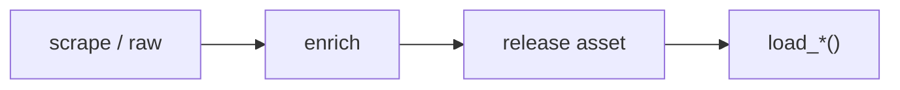

# NFL dataset loaders



## Automation status

| Dataset | Release tag | Pipeline |
|---|---|---|
| `load_nfl_pbp` | [pbp](https://github.com/nflverse/nflverse-data/releases/tag/pbp) | — |
| `load_nfl_model_pbp` | [nfl_model_pbp](https://github.com/sportsdataverse/sportsdataverse-data/releases/tag/nfl_model_pbp) | — |
| `load_nfl_ratings_weekly` | [nfl_ratings_weekly](https://github.com/sportsdataverse/sportsdataverse-data/releases/tag/nfl_ratings_weekly) | — |
| `load_nfl_ngs` | [nfl_ngs_passing](https://github.com/sportsdataverse/sportsdataverse-data/releases/tag/nfl_ngs_passing) | — |
| `load_nfl_rosters` | [rosters](https://github.com/nflverse/nflverse-data/releases/tag/rosters) | — |
| `load_nfl_weekly_rosters` | [weekly_rosters](https://github.com/nflverse/nflverse-data/releases/tag/weekly_rosters) | — |
| `load_nfl_depth_charts` | [depth_charts](https://github.com/nflverse/nflverse-data/releases/tag/depth_charts) | — |
| `load_nfl_injuries` | [injuries](https://github.com/nflverse/nflverse-data/releases/tag/injuries) | — |
| `load_nfl_snap_counts` | [snap_counts](https://github.com/nflverse/nflverse-data/releases/tag/snap_counts) | — |
| `load_nfl_pbp_participation` | [pbp_participation](https://github.com/nflverse/nflverse-data/releases/tag/pbp_participation) | — |
| `load_nfl_ftn_charting` | [ftn_charting](https://github.com/nflverse/nflverse-data/releases/tag/ftn_charting) | — |
| `load_nfl_usage_players` | [espn_nfl_usage_players](https://github.com/sportsdataverse/sportsdataverse-data/releases/tag/espn_nfl_usage_players) | — |
| `load_nfl_usage_position_groups` | [espn_nfl_usage_position_groups](https://github.com/sportsdataverse/sportsdataverse-data/releases/tag/espn_nfl_usage_position_groups) | — |
| `load_nfl_usage_tackles` | [espn_nfl_usage_tackles](https://github.com/sportsdataverse/sportsdataverse-data/releases/tag/espn_nfl_usage_tackles) | — |
| `load_nfl_usage_position_group_tackles` | [espn_nfl_usage_position_group_tackles](https://github.com/sportsdataverse/sportsdataverse-data/releases/tag/espn_nfl_usage_position_group_tackles) | — |
| `load_nfl_usage_teams` | [espn_nfl_usage_teams](https://github.com/sportsdataverse/sportsdataverse-data/releases/tag/espn_nfl_usage_teams) | — |
| `load_nfl_usage_drive_scripting` | [espn_nfl_usage_drive_scripting](https://github.com/sportsdataverse/sportsdataverse-data/releases/tag/espn_nfl_usage_drive_scripting) | — |
| `load_nfl_usage_st_kickers` | [espn_nfl_usage_st_kickers](https://github.com/sportsdataverse/sportsdataverse-data/releases/tag/espn_nfl_usage_st_kickers) | — |
| `load_nfl_usage_st_punters` | [espn_nfl_usage_st_punters](https://github.com/sportsdataverse/sportsdataverse-data/releases/tag/espn_nfl_usage_st_punters) | — |
| `load_nfl_usage_st_returners` | [espn_nfl_usage_st_returners](https://github.com/sportsdataverse/sportsdataverse-data/releases/tag/espn_nfl_usage_st_returners) | — |
| `load_nfl_usage_st_blocks` | [espn_nfl_usage_st_blocks](https://github.com/sportsdataverse/sportsdataverse-data/releases/tag/espn_nfl_usage_st_blocks) | — |
| `load_nfl_usage_st_team` | [espn_nfl_usage_st_team](https://github.com/sportsdataverse/sportsdataverse-data/releases/tag/espn_nfl_usage_st_team) | — |
| `load_nfl_team_tendencies` | [espn_nfl_team_tendencies](https://github.com/sportsdataverse/sportsdataverse-data/releases/tag/espn_nfl_team_tendencies) | — |
| `load_nfl_coach_tendencies` | [espn_nfl_coach_tendencies](https://github.com/sportsdataverse/sportsdataverse-data/releases/tag/espn_nfl_coach_tendencies) | — |
| `load_nfl_coach_careers` | [espn_nfl_coach_careers](https://github.com/sportsdataverse/sportsdataverse-data/releases/tag/espn_nfl_coach_careers) | — |

## `load_nfl_pbp`

Release: [pbp](https://github.com/nflverse/nflverse-data/releases/tag/pbp) · asset `https://github.com/nflverse/nflverse-data/releases/download/pbp/play_by_play_{season}.parquet`
### Returns

| col_name | type | description |
|---|---|---|
| `play_id` | Float64 | Numeric play id that when used with game_id and drive provides the unique identifier for a single play. |
| `game_id` | String | Ten digit identifier for NFL game. |
| `old_game_id` | String | Legacy NFL game ID. |
| `home_team` | String | The home team. Note that this contains the designated home team for games which no team is playing at home such as Super Bowls or NFL International games. |
| `away_team` | String | String abbreviation for the away team. |
| `season_type` | String | REG or POST indicating if the timeframe belongs to regular or post season. |
| `week` | Int32 | Season week. |
| `posteam` | String | String abbreviation for the team with possession. |
| `posteam_type` | String | String indicating whether the posteam team is home or away. |
| `defteam` | String | String abbreviation for the team on defense. |
| `side_of_field` | String | String abbreviation for which team's side of the field the team with possession is currently on. |
| `yardline_100` | Float64 | Numeric distance in the number of yards from the opponent's endzone for the posteam. |
| `game_date` | String | Date of the game. |
| `quarter_seconds_remaining` | Float64 | Numeric seconds remaining in the quarter. |
| `half_seconds_remaining` | Float64 | Numeric seconds remaining in the half. |
| `game_seconds_remaining` | Float64 | Numeric seconds remaining in the game. |
| `game_half` | String | String indicating which half the play is in, either Half1, Half2, or Overtime. |
| `quarter_end` | Float64 | Binary indicator for whether or not the row of the data is marking the end of a quarter. |
| `drive` | Float64 | Numeric drive number in the game. |
| `sp` | Float64 | Binary indicator for whether or not a score occurred on the play. |
| `qtr` | Float64 | Quarter of the game (5 is overtime). |
| `down` | Float64 | The down for the given play. |
| `goal_to_go` | Float64 | Binary indicator for whether or not the posteam is in a goal down situation. |
| `time` | String | Time at start of play provided in string format as minutes:seconds remaining in the quarter. |
| `yrdln` | String | String indicating the current field position for a given play. |
| `ydstogo` | Float64 | Numeric yards in distance from either the first down marker or the endzone in goal down situations. |
| `ydsnet` | Float64 | Numeric value for total yards gained on the given drive. |
| `desc` | String | Detailed string description for the given play. |
| `play_type` | String | String indicating the type of play: pass (includes sacks), run (includes scrambles), punt, field_goal, kickoff, extra_point, qb_kneel, qb_spike, no_play (timeouts and penalties), and missing for rows indicating end of play. |
| `yards_gained` | Float64 | Numeric yards gained (or lost) by the possessing team, excluding yards gained via fumble recoveries and laterals. |
| `shotgun` | Float64 | Binary indicator for whether or not the play was in shotgun formation. |
| `no_huddle` | Float64 | Binary indicator for whether or not the play was in no_huddle formation. |
| `qb_dropback` | Float64 | Binary indicator for whether or not the QB dropped back on the play (pass attempt, sack, or scrambled). |
| `qb_kneel` | Float64 | Binary indicator for whether or not the QB took a knee. |
| `qb_spike` | Float64 | Binary indicator for whether or not the QB spiked the ball. |
| `qb_scramble` | Float64 | Binary indicator for whether or not the QB scrambled. |
| `pass_length` | String | String indicator for pass length: short or deep. |
| `pass_location` | String | String indicator for pass location: left, middle, or right. |
| `air_yards` | Float64 | Numeric value for distance in yards perpendicular to the line of scrimmage at where the targeted receiver either caught or didn't catch the ball. |
| `yards_after_catch` | Float64 | Numeric value for distance in yards perpendicular to the yard line where the receiver made the reception to where the play ended. |
| `run_location` | String | String indicator for location of run: left, middle, or right. |
| `run_gap` | String | String indicator for line gap of run: end, guard, or tackle |
| `field_goal_result` | String | String indicator for result of field goal attempt: made, missed, or blocked. |
| `kick_distance` | Float64 | Numeric distance in yards for kickoffs, field goals, and punts. |
| `extra_point_result` | String | String indicator for the result of the extra point attempt: good, failed, blocked, safety (touchback in defensive endzone is 1 point apparently), or aborted. |
| `two_point_conv_result` | String | String indicator for result of two point conversion attempt: success, failure, safety (touchback in defensive endzone is 1 point apparently), or return. |
| `home_timeouts_remaining` | Float64 | Numeric timeouts remaining in the half for the home team. |
| `away_timeouts_remaining` | Float64 | Numeric timeouts remaining in the half for the away team. |
| `timeout` | Float64 | Binary indicator for whether or not a timeout was called by either team. |
| `timeout_team` | String | String abbreviation for which team called the timeout. |
| `td_team` | String | String abbreviation for which team scored the touchdown. |
| `td_player_name` | String | String name of the player who scored a touchdown. |
| `td_player_id` | String | Unique identifier of the player who scored a touchdown. |
| `posteam_timeouts_remaining` | Float64 | Number of timeouts remaining for the possession team. |
| `defteam_timeouts_remaining` | Float64 | Number of timeouts remaining for the team on defense. |
| `total_home_score` | Float64 | Score for the home team at the start of the play. |
| `total_away_score` | Float64 | Score for the away team at the start of the play. |
| `posteam_score` | Float64 | Score the posteam at the start of the play. |
| `defteam_score` | Float64 | Score the defteam at the start of the play. |
| `score_differential` | Float64 | Score differential between the posteam and defteam at the start of the play. |
| `posteam_score_post` | Float64 | Score for the posteam at the end of the play. |
| `defteam_score_post` | Float64 | Score for the defteam at the end of the play. |
| `score_differential_post` | Float64 | Score differential between the posteam and defteam at the end of the play. |
| `no_score_prob` | Float64 | Predicted probability of no score occurring for the rest of the half based on the expected points model. |
| `opp_fg_prob` | Float64 | Predicted probability of the defteam scoring a FG next. 'Next' in this context means the next score in the same game half. |
| `opp_safety_prob` | Float64 | Predicted probability of the defteam scoring a safety next. 'Next' in this context means the next score in the same game half. |
| `opp_td_prob` | Float64 | Predicted probability of the defteam scoring a TD next. 'Next' in this context means the next score in the same game half. |
| `fg_prob` | Float64 | Predicted probability of the posteam scoring a FG next. 'Next' in this context means the next score in the same game half. |
| `safety_prob` | Float64 | Predicted probability of the posteam scoring a safety next. 'Next' in this context means the next score in the same game half. |
| `td_prob` | Float64 | Predicted probability of the posteam scoring a TD next. 'Next' in this context means the next score in the same game half. |
| `extra_point_prob` | Float64 | Predicted probability of the posteam scoring an extra point. |
| `two_point_conversion_prob` | Float64 | Predicted probability of the posteam scoring the two point conversion. |
| `ep` | Float64 | Using the scoring event probabilities, the estimated expected points with respect to the possession team for the given play. |
| `epa` | Float64 | Expected points added (EPA) by the posteam for the given play. |
| `total_home_epa` | Float64 | Cumulative total EPA for the home team in the game so far. |
| `total_away_epa` | Float64 | Cumulative total EPA for the away team in the game so far. |
| `total_home_rush_epa` | Float64 | Cumulative total rushing EPA for the home team in the game so far. |
| `total_away_rush_epa` | Float64 | Cumulative total rushing EPA for the away team in the game so far. |
| `total_home_pass_epa` | Float64 | Cumulative total passing EPA for the home team in the game so far. |
| `total_away_pass_epa` | Float64 | Cumulative total passing EPA for the away team in the game so far. |
| `air_epa` | Float64 | EPA from the air yards alone. For completions this represents the actual value provided through the air. For incompletions this represents the hypothetical value that could've been added through the air if the pass was completed. |
| `yac_epa` | Float64 | EPA from the yards after catch alone. For completions this represents the actual value provided after the catch. For incompletions this represents the difference between the hypothetical air_epa and the play's raw observed EPA (how much the incomplete pass cost the posteam). |
| `comp_air_epa` | Float64 | EPA from the air yards alone only for completions. |
| `comp_yac_epa` | Float64 | EPA from the yards after catch alone only for completions. |
| `total_home_comp_air_epa` | Float64 | Cumulative total completions air EPA for the home team in the game so far. |
| `total_away_comp_air_epa` | Float64 | Cumulative total completions air EPA for the away team in the game so far. |
| `total_home_comp_yac_epa` | Float64 | Cumulative total completions yac EPA for the home team in the game so far. |
| `total_away_comp_yac_epa` | Float64 | Cumulative total completions yac EPA for the away team in the game so far. |
| `total_home_raw_air_epa` | Float64 | Cumulative total raw air EPA for the home team in the game so far. |
| `total_away_raw_air_epa` | Float64 | Cumulative total raw air EPA for the away team in the game so far. |
| `total_home_raw_yac_epa` | Float64 | Cumulative total raw yac EPA for the home team in the game so far. |
| `total_away_raw_yac_epa` | Float64 | Cumulative total raw yac EPA for the away team in the game so far. |
| `wp` | Float64 | Estimated win probability for the posteam given the current situation at the start of the given play. |
| `def_wp` | Float64 | Estimated win probability for the defteam. |
| `home_wp` | Float64 | Estimated win probability for the home team. |
| `away_wp` | Float64 | Estimated win probability for the away team. |
| `wpa` | Float64 | Win probability added (WPA) for the posteam. |
| `vegas_wpa` | Float64 | Win probability added (WPA) for the posteam: spread_adjusted model. |
| `vegas_home_wpa` | Float64 | Win probability added (WPA) for the home team: spread_adjusted model. |
| `home_wp_post` | Float64 | Estimated win probability for the home team at the end of the play. |
| `away_wp_post` | Float64 | Estimated win probability for the away team at the end of the play. |
| `vegas_wp` | Float64 | Estimated win probability for the posteam given the current situation at the start of the given play, incorporating pre-game Vegas line. |
| `vegas_home_wp` | Float64 | Estimated win probability for the home team incorporating pre-game Vegas line. |
| `total_home_rush_wpa` | Float64 | Cumulative total rushing WPA for the home team in the game so far. |
| `total_away_rush_wpa` | Float64 | Cumulative total rushing WPA for the away team in the game so far. |
| `total_home_pass_wpa` | Float64 | Cumulative total passing WPA for the home team in the game so far. |
| `total_away_pass_wpa` | Float64 | Cumulative total passing WPA for the away team in the game so far. |
| `air_wpa` | Float64 | WPA through the air (same logic as air_epa). |
| `yac_wpa` | Float64 | WPA from yards after the catch (same logic as yac_epa). |
| `comp_air_wpa` | Float64 | The air_wpa for completions only. |
| `comp_yac_wpa` | Float64 | The yac_wpa for completions only. |
| `total_home_comp_air_wpa` | Float64 | Cumulative total completions air WPA for the home team in the game so far. |
| `total_away_comp_air_wpa` | Float64 | Cumulative total completions air WPA for the away team in the game so far. |
| `total_home_comp_yac_wpa` | Float64 | Cumulative total completions yac WPA for the home team in the game so far. |
| `total_away_comp_yac_wpa` | Float64 | Cumulative total completions yac WPA for the away team in the game so far. |
| `total_home_raw_air_wpa` | Float64 | Cumulative total raw air WPA for the home team in the game so far. |
| `total_away_raw_air_wpa` | Float64 | Cumulative total raw air WPA for the away team in the game so far. |
| `total_home_raw_yac_wpa` | Float64 | Cumulative total raw yac WPA for the home team in the game so far. |
| `total_away_raw_yac_wpa` | Float64 | Cumulative total raw yac WPA for the away team in the game so far. |
| `punt_blocked` | Float64 | Binary indicator for if the punt was blocked. |
| `first_down_rush` | Float64 | Binary indicator for if a running play converted the first down. |
| `first_down_pass` | Float64 | Binary indicator for if a passing play converted the first down. |
| `first_down_penalty` | Float64 | Binary indicator for if a penalty converted the first down. |
| `third_down_converted` | Float64 | Binary indicator for if the first down was converted on third down. |
| `third_down_failed` | Float64 | Binary indicator for if the posteam failed to convert first down on third down. |
| `fourth_down_converted` | Float64 | Binary indicator for if the first down was converted on fourth down. |
| `fourth_down_failed` | Float64 | Binary indicator for if the posteam failed to convert first down on fourth down. |
| `incomplete_pass` | Float64 | Binary indicator for if the pass was incomplete. |
| `touchback` | Float64 | Binary indicator for if a touchback occurred on the play. |
| `interception` | Float64 | Binary indicator for if the pass was intercepted. |
| `punt_inside_twenty` | Float64 | Binary indicator for if the punt ended inside the twenty yard line. |
| `punt_in_endzone` | Float64 | Binary indicator for if the punt was in the endzone. |
| `punt_out_of_bounds` | Float64 | Binary indicator for if the punt went out of bounds. |
| `punt_downed` | Float64 | Binary indicator for if the punt was downed. |
| `punt_fair_catch` | Float64 | Binary indicator for if the punt was caught with a fair catch. |
| `kickoff_inside_twenty` | Float64 | Binary indicator for if the kickoff ended inside the twenty yard line. |
| `kickoff_in_endzone` | Float64 | Binary indicator for if the kickoff was in the endzone. |
| `kickoff_out_of_bounds` | Float64 | Binary indicator for if the kickoff went out of bounds. |
| `kickoff_downed` | Float64 | Binary indicator for if the kickoff was downed. |
| `kickoff_fair_catch` | Float64 | Binary indicator for if the kickoff was caught with a fair catch. |
| `fumble_forced` | Float64 | Binary indicator for if the fumble was forced. |
| `fumble_not_forced` | Float64 | Binary indicator for if the fumble was not forced. |
| `fumble_out_of_bounds` | Float64 | Binary indicator for if the fumble went out of bounds. |
| `solo_tackle` | Float64 | Binary indicator if the play had a solo tackle (could be multiple due to fumbles). |
| `safety` | Float64 | Binary indicator for whether or not a safety occurred. |
| `penalty` | Float64 | Binary indicator for whether or not a penalty occurred. |
| `tackled_for_loss` | Float64 | Binary indicator for whether or not a tackle for loss on a run play occurred. |
| `fumble_lost` | Float64 | Binary indicator for if the fumble was lost. |
| `own_kickoff_recovery` | Float64 | Binary indicator for if the kicking team recovered the kickoff. |
| `own_kickoff_recovery_td` | Float64 | Binary indicator for if the kicking team recovered the kickoff and scored a TD. |
| `qb_hit` | Float64 | Binary indicator if the QB was hit on the play. |
| `rush_attempt` | Float64 | Binary indicator for if the play was a run. |
| `pass_attempt` | Float64 | Binary indicator for if the play was a pass attempt (includes sacks). |
| `sack` | Float64 | Binary indicator for if the play ended in a sack. |
| `touchdown` | Float64 | Binary indicator for if the play resulted in a TD. |
| `pass_touchdown` | Float64 | Binary indicator for if the play resulted in a passing TD. |
| `rush_touchdown` | Float64 | Binary indicator for if the play resulted in a rushing TD. |
| `return_touchdown` | Float64 | Binary indicator for if the play resulted in a return TD. Returns may occur on any of: interception, fumble, kickoff, punt, or blocked kicks. |
| `extra_point_attempt` | Float64 | Binary indicator for extra point attempt. |
| `two_point_attempt` | Float64 | Binary indicator for two point conversion attempt. |
| `field_goal_attempt` | Float64 | Binary indicator for field goal attempt. |
| `kickoff_attempt` | Float64 | Binary indicator for kickoff. |
| `punt_attempt` | Float64 | Binary indicator for punts. |
| `fumble` | Float64 | Binary indicator for if a fumble occurred. |
| `complete_pass` | Float64 | Binary indicator for if the pass was completed. |
| `assist_tackle` | Float64 | Binary indicator for if an assist tackle occurred. |
| `lateral_reception` | Float64 | Binary indicator for if a lateral occurred on the reception. |
| `lateral_rush` | Float64 | Binary indicator for if a lateral occurred on a run. |
| `lateral_return` | Float64 | Binary indicator for if a lateral occurred on a return. Returns may occur on any of: interception, fumble, kickoff, punt, or blocked kicks. |
| `lateral_recovery` | Float64 | Binary indicator for if a lateral occurred on a fumble recovery. |
| `passer_player_id` | String | Unique identifier for the player that attempted the pass. |
| `passer_player_name` | String | String name for the player that attempted the pass. |
| `passing_yards` | Float64 | Numeric yards by the passer_player_name, including yards gained in pass plays with laterals. This should equal official passing statistics. |
| `receiver_player_id` | String | Unique identifier for the receiver that was targeted on the pass. |
| `receiver_player_name` | String | String name for the targeted receiver. |
| `receiving_yards` | Float64 | Numeric yards by the receiver_player_name, excluding yards gained in pass plays with laterals. This should equal official receiving statistics but could miss yards gained in pass plays with laterals. Please see the description of `lateral_receiver_player_name` for further information. |
| `rusher_player_id` | String | Unique identifier for the player that attempted the run. |
| `rusher_player_name` | String | String name for the player that attempted the run. |
| `rushing_yards` | Float64 | Numeric yards by the rusher_player_name, excluding yards gained in rush plays with laterals. This should equal official rushing statistics but could miss yards gained in rush plays with laterals. Please see the description of `lateral_rusher_player_name` for further information. |
| `lateral_receiver_player_id` | String | Unique identifier for the player that received the last(!) lateral on a pass play. |
| `lateral_receiver_player_name` | String | String name for the player that received the last(!) lateral on a pass play. If there were multiple laterals in the same play, this will only be the last player who received a lateral. Please see <https://github.com/mrcaseb/nfl-data/tree/master/data/lateral_yards> for a list of plays where multiple players recorded lateral receiving yards. |
| `lateral_receiving_yards` | Float64 | Numeric yards by the `lateral_receiver_player_name` in pass plays with laterals. Please see the description of `lateral_receiver_player_name` for further information. |
| `lateral_rusher_player_id` | String | Unique identifier for the player that received the last(!) lateral on a run play. |
| `lateral_rusher_player_name` | String | String name for the player that received the last(!) lateral on a run play. If there were multiple laterals in the same play, this will only be the last player who received a lateral. Please see <https://github.com/mrcaseb/nfl-data/tree/master/data/lateral_yards> for a list of plays where multiple players recorded lateral rushing yards. |
| `lateral_rushing_yards` | Float64 | Numeric yards by the `lateral_rusher_player_name` in run plays with laterals. Please see the description of `lateral_rusher_player_name` for further information. |
| `lateral_sack_player_id` | String | Unique identifier for the player that received the lateral on a sack. |
| `lateral_sack_player_name` | String | String name for the player that received the lateral on a sack. |
| `interception_player_id` | String | Unique identifier for the player that intercepted the pass. |
| `interception_player_name` | String | String name for the player that intercepted the pass. |
| `lateral_interception_player_id` | String | Unique identifier for the player that received the lateral on an interception. |
| `lateral_interception_player_name` | String | String name for the player that received the lateral on an interception. |
| `punt_returner_player_id` | String | Unique identifier for the punt returner. |
| `punt_returner_player_name` | String | String name for the punt returner. |
| `lateral_punt_returner_player_id` | String | Unique identifier for the player that received the lateral on a punt return. |
| `lateral_punt_returner_player_name` | String | String name for the player that received the lateral on a punt return. |
| `kickoff_returner_player_name` | String | String name for the kickoff returner. |
| `kickoff_returner_player_id` | String | Unique identifier for the kickoff returner. |
| `lateral_kickoff_returner_player_id` | String | Unique identifier for the player that received the lateral on a kickoff return. |
| `lateral_kickoff_returner_player_name` | String | String name for the player that received the lateral on a kickoff return. |
| `punter_player_id` | String | Unique identifier for the punter. |
| `punter_player_name` | String | String name for the punter. |
| `kicker_player_name` | String | String name for the kicker on FG or kickoff. |
| `kicker_player_id` | String | Unique identifier for the kicker on FG or kickoff. |
| `own_kickoff_recovery_player_id` | String | Unique identifier for the player that recovered their own kickoff. |
| `own_kickoff_recovery_player_name` | String | String name for the player that recovered their own kickoff. |
| `blocked_player_id` | String | Unique identifier for the player that blocked the punt or FG. |
| `blocked_player_name` | String | String name for the player that blocked the punt or FG. |
| `tackle_for_loss_1_player_id` | String | Unique identifier for one of the potential players with the tackle for loss. |
| `tackle_for_loss_1_player_name` | String | String name for one of the potential players with the tackle for loss. |
| `tackle_for_loss_2_player_id` | String | Unique identifier for one of the potential players with the tackle for loss. |
| `tackle_for_loss_2_player_name` | String | String name for one of the potential players with the tackle for loss. |
| `qb_hit_1_player_id` | String | Unique identifier for one of the potential players that hit the QB. No sack as the QB was not the ball carrier. For sacks please see `sack_player` or `half_sack_*_player`. |
| `qb_hit_1_player_name` | String | String name for one of the potential players that hit the QB. No sack as the QB was not the ball carrier. For sacks please see `sack_player` or `half_sack_*_player`. |
| `qb_hit_2_player_id` | String | Unique identifier for one of the potential players that hit the QB. No sack as the QB was not the ball carrier. For sacks please see `sack_player` or `half_sack_*_player`. |
| `qb_hit_2_player_name` | String | String name for one of the potential players that hit the QB. No sack as the QB was not the ball carrier. For sacks please see `sack_player` or `half_sack_*_player`. |
| `forced_fumble_player_1_team` | String | Team of one of the players with a forced fumble. |
| `forced_fumble_player_1_player_id` | String | Unique identifier of one of the players with a forced fumble. |
| `forced_fumble_player_1_player_name` | String | String name of one of the players with a forced fumble. |
| `forced_fumble_player_2_team` | String | Team of one of the players with a forced fumble. |
| `forced_fumble_player_2_player_id` | String | Unique identifier of one of the players with a forced fumble. |
| `forced_fumble_player_2_player_name` | String | String name of one of the players with a forced fumble. |
| `solo_tackle_1_team` | String | Team of one of the players with a solo tackle. |
| `solo_tackle_2_team` | String | Team of one of the players with a solo tackle. |
| `solo_tackle_1_player_id` | String | Unique identifier of one of the players with a solo tackle. |
| `solo_tackle_2_player_id` | String | Unique identifier of one of the players with a solo tackle. |
| `solo_tackle_1_player_name` | String | String name of one of the players with a solo tackle. |
| `solo_tackle_2_player_name` | String | String name of one of the players with a solo tackle. |
| `assist_tackle_1_player_id` | String | Unique identifier of one of the players with a tackle assist. |
| `assist_tackle_1_player_name` | String | String name of one of the players with a tackle assist. |
| `assist_tackle_1_team` | String | Team of one of the players with a tackle assist. |
| `assist_tackle_2_player_id` | String | Unique identifier of one of the players with a tackle assist. |
| `assist_tackle_2_player_name` | String | String name of one of the players with a tackle assist. |
| `assist_tackle_2_team` | String | Team of one of the players with a tackle assist. |
| `assist_tackle_3_player_id` | String | Unique identifier of one of the players with a tackle assist. |
| `assist_tackle_3_player_name` | String | String name of one of the players with a tackle assist. |
| `assist_tackle_3_team` | String | Team of one of the players with a tackle assist. |
| `assist_tackle_4_player_id` | String | Unique identifier of one of the players with a tackle assist. |
| `assist_tackle_4_player_name` | String | String name of one of the players with a tackle assist. |
| `assist_tackle_4_team` | String | Team of one of the players with a tackle assist. |
| `tackle_with_assist` | Float64 | Binary indicator for if there has been a tackle with assist. |
| `tackle_with_assist_1_player_id` | String | Unique identifier of one of the players with a tackle with assist. |
| `tackle_with_assist_1_player_name` | String | String name of one of the players with a tackle with assist. |
| `tackle_with_assist_1_team` | String | Team of one of the players with a tackle with assist. |
| `tackle_with_assist_2_player_id` | String | Unique identifier of one of the players with a tackle with assist. |
| `tackle_with_assist_2_player_name` | String | String name of one of the players with a tackle with assist. |
| `tackle_with_assist_2_team` | String | Team of one of the players with a tackle with assist. |
| `pass_defense_1_player_id` | String | Unique identifier of one of the players with a pass defense. |
| `pass_defense_1_player_name` | String | String name of one of the players with a pass defense. |
| `pass_defense_2_player_id` | String | Unique identifier of one of the players with a pass defense. |
| `pass_defense_2_player_name` | String | String name of one of the players with a pass defense. |
| `fumbled_1_team` | String | Team of one of the first player with a fumble. |
| `fumbled_1_player_id` | String | Unique identifier of the first player who fumbled on the play. |
| `fumbled_1_player_name` | String | String name of one of the first player who fumbled on the play. |
| `fumbled_2_player_id` | String | Unique identifier of the second player who fumbled on the play. |
| `fumbled_2_player_name` | String | String name of one of the second player who fumbled on the play. |
| `fumbled_2_team` | String | Team of one of the second player with a fumble. |
| `fumble_recovery_1_team` | String | Team of one of the players with a fumble recovery. |
| `fumble_recovery_1_yards` | Float64 | Yards gained by one of the players with a fumble recovery. |
| `fumble_recovery_1_player_id` | String | Unique identifier of one of the players with a fumble recovery. |
| `fumble_recovery_1_player_name` | String | String name of one of the players with a fumble recovery. |
| `fumble_recovery_2_team` | String | Team of one of the players with a fumble recovery. |
| `fumble_recovery_2_yards` | Float64 | Yards gained by one of the players with a fumble recovery. |
| `fumble_recovery_2_player_id` | String | Unique identifier of one of the players with a fumble recovery. |
| `fumble_recovery_2_player_name` | String | String name of one of the players with a fumble recovery. |
| `sack_player_id` | String | Unique identifier of the player who recorded a solo sack. |
| `sack_player_name` | String | String name of the player who recorded a solo sack. |
| `half_sack_1_player_id` | String | Unique identifier of the first player who recorded half a sack. |
| `half_sack_1_player_name` | String | String name of the first player who recorded half a sack. |
| `half_sack_2_player_id` | String | Unique identifier of the second player who recorded half a sack. |
| `half_sack_2_player_name` | String | String name of the second player who recorded half a sack. |
| `return_team` | String | String abbreviation of the return team. Returns may occur on any of: interception, fumble, kickoff, punt, or blocked kicks. |
| `return_yards` | Float64 | Yards gained by the return team. Returns may occur on any of: interception, fumble, kickoff, punt, or blocked kicks. |
| `penalty_team` | String | String abbreviation of the team with the penalty. |
| `penalty_player_id` | String | Unique identifier for the player with the penalty. |
| `penalty_player_name` | String | String name for the player with the penalty. |
| `penalty_yards` | Float64 | Yards gained (or lost) by the posteam from the penalty. |
| `replay_or_challenge` | Float64 | Binary indicator for whether or not a replay or challenge. |
| `replay_or_challenge_result` | String | String indicating the result of the replay or challenge. |
| `penalty_type` | String | String indicating the penalty type of the first penalty in the given play. Will be `NA` if `desc` is missing the type. |
| `defensive_two_point_attempt` | Float64 | Binary indicator whether or not the defense was able to have an attempt on a two point conversion, this results following a turnover. |
| `defensive_two_point_conv` | Float64 | Binary indicator whether or not the defense successfully scored on the two point conversion. |
| `defensive_extra_point_attempt` | Float64 | Binary indicator whether or not the defense was able to have an attempt on an extra point attempt, this results following a blocked attempt that the defense recovers the ball. |
| `defensive_extra_point_conv` | Float64 | Binary indicator whether or not the defense successfully scored on an extra point attempt. |
| `safety_player_name` | String | String name for the player who scored a safety. |
| `safety_player_id` | String | Unique identifier for the player who scored a safety. |
| `season` | Int32 | 4 digit number indicating to which season(s) the specified timeframe belongs to. |
| `cp` | Float64 | Numeric value indicating the probability for a complete pass based on comparable game situations. |
| `cpoe` | Float64 | Completion percentage over expected in PERCENTAGE POINTS, not a 0-1 rate -- 100 * (complete_pass - cp) per pass play, so a completed pass with cp 0.368 scores +63.2 and the same pass falling incomplete scores -36.8. Averaged over a passer's attempts it is the familiar CPOE of a few points either way; divide by 100 before combining it with 0-1 probabilities such as cp. Null on non-pass rows. |
| `series` | Float64 | Starts at 1, each new first down increments, numbers shared across both teams NA: kickoffs, extra point/two point conversion attempts, non-plays, no posteam |
| `series_success` | Float64 | 1: scored touchdown, gained enough yards for first down. |
| `series_result` | String | Possible values: First down, Touchdown, Opp touchdown, Field goal, Missed field goal, Safety, Turnover, Punt, Turnover on downs, QB kneel, End of half |
| `order_sequence` | Float64 | Column provided by NFL to fix out-of-order plays. Available 2011 and beyond with source "nfl". |
| `start_time` | String | Kickoff time in eastern time zone. |
| `time_of_day` | String | Time of day of play in UTC "HH:MM:SS" format. Available 2011 and beyond with source "nfl". |
| `stadium` | String | Name of the stadium |
| `weather` | String | String describing the weather including temperature, humidity and wind (direction and speed). Doesn't change during the game! |
| `nfl_api_id` | String | UUID of the game in the new NFL API. |
| `play_clock` | String | Time on the playclock when the ball was snapped. |
| `play_deleted` | Float64 | Binary indicator for deleted plays. |
| `play_type_nfl` | String | Play type as listed in the NFL source. Slightly different to the regular play_type variable. |
| `special_teams_play` | Float64 | Binary indicator for whether play is special teams play from NFL source. Available 2011 and beyond with source "nfl". |
| `st_play_type` | String | Type of special teams play from NFL source. Available 2011 and beyond with source "nfl". |
| `end_clock_time` | String | Game time at the end of a given play. |
| `end_yard_line` | String | String indicating the yardline at the end of the given play consisting of team half and yard line number. |
| `fixed_drive` | Float64 | Manually created drive number in a game. |
| `fixed_drive_result` | String | Manually created drive result. |
| `drive_real_start_time` | String | Local day time when the drive started (currently not used by the NFL and therefore mostly 'NA'). |
| `drive_play_count` | Float64 | Numeric value of how many regular plays happened in a given drive. |
| `drive_time_of_possession` | String | Time of possession in a given drive. |
| `drive_first_downs` | Float64 | Number of first downs in a given drive. |
| `drive_inside20` | Float64 | Binary indicator if the offense was able to get inside the opponents 20 yard line. |
| `drive_ended_with_score` | Float64 | Binary indicator the drive ended with a score. |
| `drive_quarter_start` | Float64 | Numeric value indicating in which quarter the given drive has started. |
| `drive_quarter_end` | Float64 | Numeric value indicating in which quarter the given drive has ended. |
| `drive_yards_penalized` | Float64 | Numeric value of how many yards the offense gained or lost through penalties in the given drive. |
| `drive_start_transition` | String | String indicating how the offense got the ball. |
| `drive_end_transition` | String | String indicating how the offense lost the ball. |
| `drive_game_clock_start` | String | Game time at the beginning of a given drive. |
| `drive_game_clock_end` | String | Game time at the end of a given drive. |
| `drive_start_yard_line` | String | String indicating where a given drive started consisting of team half and yard line number. |
| `drive_end_yard_line` | String | String indicating where a given drive ended consisting of team half and yard line number. |
| `drive_play_id_started` | Float64 | Play_id of the first play in the given drive. |
| `drive_play_id_ended` | Float64 | Play_id of the last play in the given drive. |
| `away_score` | Int32 | The number of points the away team scored. Is NA for games which haven't yet been played. |
| `home_score` | Int32 | The number of points the home team scored. Is NA for games which haven't yet been played. |
| `location` | String | Either Home if the home team is playing in their home stadium, or Neutral if the game is being played at a neutral location. This still shows as Home for games between the Giants and Jets even though they share the same home stadium. |
| `result` | Int32 | The number of points the home team scored minus the number of points the visiting team scored. Equals h_score - v_score. Is NA for games which haven't yet been played. Convenient for evaluating against the spread bets. |
| `total` | Int32 | The sum of each team's score in the game. Equals h_score + v_score. Is NA for games which haven't yet been played. Convenient for evaluating over/under total bets. |
| `spread_line` | Float64 | The closing spread line for the game. A positive number means the home team was favored by that many points, a negative number means the away team was favored by that many points. (Source: Pro-Football-Reference) |
| `total_line` | Float64 | The closing total line for the game. (Source: Pro-Football-Reference) |
| `div_game` | Int32 | Binary indicator of whether or not game was played by 2 teams in the same division. |
| `roof` | String | One of 'dome', 'outdoors', 'closed', 'open' indicating indicating the roof status of the stadium the game was played in. (Source: Pro-Football-Reference) |
| `surface` | String | What type of ground the game was played on. (Source: Pro-Football-Reference) |
| `temp` | Int32 | The temperature at the stadium only for 'roof' = 'outdoors' or 'open'.(Source: Pro-Football-Reference) |
| `wind` | Int32 | The speed of the wind in miles/hour only for 'roof' = 'outdoors' or 'open'. (Source: Pro-Football-Reference) |
| `home_coach` | String | First and last name of the home team coach. (Source: Pro-Football-Reference) |
| `away_coach` | String | First and last name of the away team coach. (Source: Pro-Football-Reference) |
| `stadium_id` | String | ID of the stadium the game was played in. (Source: Pro-Football-Reference) |
| `game_stadium` | String | Name of the stadium the game was played in. (Source: Pro-Football-Reference) |
| `aborted_play` | Float64 | Binary indicator if the play description indicates "Aborted". |
| `success` | Float64 | Binary indicator whether epa > 0 in the given play. |
| `passer` | String | Name of the dropback player (scrambles included) including plays with penalties. |
| `passer_jersey_number` | Int32 | Jersey number of the passer. |
| `rusher` | String | Name of the rusher (no scrambles) including plays with penalties. |
| `rusher_jersey_number` | Int32 | Jersey number of the rusher. |
| `receiver` | String | Name of the receiver including plays with penalties. |
| `receiver_jersey_number` | Int32 | Jersey number of the receiver. |
| `pass` | Float64 | Binary indicator if the play was a pass play (sacks and scrambles included). |
| `rush` | Float64 | Binary indicator if the play was a rushing play. |
| `first_down` | Float64 | Binary indicator if the play ended in a first down. |
| `special` | Float64 | Binary indicator if "play_type" is one of "extra_point", "field_goal", "kickoff", or "punt". |
| `play` | Float64 | Binary indicator: 1 if the play was a 'normal' play (including penalties), 0 otherwise. |
| `passer_id` | String | ID of the player in the 'passer' column. |
| `rusher_id` | String | ID of the player in the 'rusher' column. |
| `receiver_id` | String | ID of the player in the 'receiver' column. |
| `name` | String | Name, as reported by MFL but reordered into FirstName LastName instead of Last, First |
| `jersey_number` | Int32 | Jersey number. Often useful for joins by name/team/jersey. |
| `id` | String | ID of the player in the 'name' column. |
| `fantasy_player_name` | String | Name of the rusher on rush plays or receiver on pass plays (from official stats). |
| `fantasy_player_id` | String | ID of the rusher on rush plays or receiver on pass plays (from official stats). |
| `fantasy` | String | Name of the rusher on rush plays or receiver on pass plays. |
| `fantasy_id` | String | ID of the rusher on rush plays or receiver on pass plays. |
| `out_of_bounds` | Float64 | 1 if play description contains ran ob, pushed ob, or sacked ob; 0 otherwise. |
| `home_opening_kickoff` | Float64 | 1 if the home team received the opening kickoff, 0 otherwise. |
| `qb_epa` | Float64 | Gives QB credit for EPA for up to the point where a receiver lost a fumble after a completed catch and makes EPA work more like passing yards on plays with fumbles. |
| `xyac_epa` | Float64 | Expected value of EPA gained after the catch, starting from where the catch was made. Zero yards after the catch would be listed as zero EPA. |
| `xyac_mean_yardage` | Float64 | Average expected yards after the catch based on where the ball was caught. |
| `xyac_median_yardage` | Int32 | Median expected yards after the catch based on where the ball was caught. |
| `xyac_success` | Float64 | Probability play earns positive EPA (relative to where play started) based on where ball was caught. |
| `xyac_fd` | Float64 | Probability play earns a first down based on where the ball was caught. |
| `xpass` | Float64 | Probability of dropback scaled from 0 to 1. |
| `pass_oe` | Float64 | Dropback percent over expected on a given play scaled from 0 to 100. |

```python
load_nfl_pbp(seasons=2024)
```

## `load_nfl_model_pbp`

Release: [nfl_model_pbp](https://github.com/sportsdataverse/sportsdataverse-data/releases/tag/nfl_model_pbp) · asset `https://github.com/sportsdataverse/sportsdataverse-data/releases/download/nfl_model_pbp/model_pbp_{season}.parquet`
### Returns

| col_name | type | description |
|---|---|---|
| `game_id` | String | Ten digit identifier for NFL game. |
| `season` | Int64 | 4 digit number indicating to which season(s) the specified timeframe belongs to. |
| `week` | Int64 | Season week. |
| `season_type` | String | REG or POST indicating if the timeframe belongs to regular or post season. |
| `play_id` | Int64 | Numeric play id that when used with game_id and drive provides the unique identifier for a single play. |
| `play_seq` | Float64 | Game-global sequential play order from the NFL.com Shield feed; ordering key within a game (game_id + play_seq is unique). |
| `posteam` | String | String abbreviation for the team with possession. |
| `defteam` | String | String abbreviation for the team on defense. |
| `home_team` | String | The home team. Note that this contains the designated home team for games which no team is playing at home such as Super Bowls or NFL International games. |
| `away_team` | String | String abbreviation for the away team. |
| `home` | Int64 | Home team name. |
| `qtr` | Int64 | Quarter of the game (5 is overtime). |
| `game_half` | String | String indicating which half the play is in, either Half1, Half2, or Overtime. |
| `down` | Int64 | The down for the given play. |
| `ydstogo` | Int64 | Numeric yards in distance from either the first down marker or the endzone in goal down situations. |
| `yardline_100` | Int64 | Numeric distance in the number of yards from the opponent's endzone for the posteam. |
| `goal_to_go` | Int64 | Binary indicator for whether or not the posteam is in a goal down situation. |
| `quarter_seconds_remaining` | Int64 | Numeric seconds remaining in the quarter. |
| `half_seconds_remaining` | Int64 | Numeric seconds remaining in the half. |
| `game_seconds_remaining` | Int64 | Numeric seconds remaining in the game. |
| `play_type` | String | String indicating the type of play: pass (includes sacks), run (includes scrambles), punt, field_goal, kickoff, extra_point, qb_kneel, qb_spike, no_play (timeouts and penalties), and missing for rows indicating end of play. |
| `yards_gained` | Int64 | Numeric yards gained (or lost) by the possessing team, excluding yards gained via fumble recoveries and laterals. |
| `desc` | String | Detailed string description for the given play. |
| `shield_play_type` | String | Raw NFL.com Shield play-type enum for the play (e.g. RUSH, PASS, FIELD_GOAL, KICK_OFF, PENALTY, END_QUARTER, GAME_START, COMMENT) -- the unmapped upstream value behind the nflfastR-style play_type. |
| `special_teams_play_type` | String | Shield special-teams sub-type qualifier; UNSPECIFIED on ordinary plays and PENALTY when the special-teams play resolved to a penalty. |
| `sp` | Int64 | Binary indicator for whether or not a score occurred on the play. |
| `pass_attempt` | Int64 | Binary indicator for if the play was a pass attempt (includes sacks). |
| `complete_pass` | Int64 | Binary indicator for if the pass was completed. |
| `incomplete_pass` | Int64 | Binary indicator for if the pass was incomplete. |
| `interception` | Int64 | Binary indicator for if the pass was intercepted. |
| `rush_attempt` | Int64 | Binary indicator for if the play was a run. |
| `sack` | Int64 | Binary indicator for if the play ended in a sack. |
| `touchdown` | Int64 | Binary indicator for if the play resulted in a TD. |
| `pass_touchdown` | Int64 | Binary indicator for if the play resulted in a passing TD. |
| `rush_touchdown` | Int64 | Binary indicator for if the play resulted in a rushing TD. |
| `return_touchdown` | Int64 | Binary indicator for if the play resulted in a return TD. Returns may occur on any of: interception, fumble, kickoff, punt, or blocked kicks. |
| `field_goal_attempt` | Int64 | Binary indicator for field goal attempt. |
| `field_goal_made` | Int64 | Binary indicator (1/0) that the field-goal attempt on this play was good. |
| `field_goal_missed` | Int64 | Binary indicator (1/0) that the field-goal attempt on this play was missed (not blocked). |
| `field_goal_blocked` | Int64 | Binary indicator (1/0) that the field-goal attempt on this play was blocked. |
| `extra_point_attempt` | Int64 | Binary indicator for extra point attempt. |
| `two_point_attempt` | Int64 | Binary indicator for two point conversion attempt. |
| `punt_attempt` | Int64 | Binary indicator for punts. |
| `kickoff_attempt` | Int64 | Binary indicator for kickoff. |
| `penalty` | Int64 | Binary indicator for whether or not a penalty occurred. |
| `fumble` | Int64 | Binary indicator for if a fumble occurred. |
| `fumble_lost` | Int64 | Binary indicator for if the fumble was lost. |
| `qb_hit` | Int64 | Binary indicator if the QB was hit on the play. |
| `safety` | Int64 | Binary indicator for whether or not a safety occurred. |
| `timeout` | Int64 | Binary indicator for whether or not a timeout was called by either team. |
| `first_down_rush` | Int64 | Binary indicator for if a running play converted the first down. |
| `first_down_pass` | Int64 | Binary indicator for if a passing play converted the first down. |
| `first_down_penalty` | Int64 | Binary indicator for if a penalty converted the first down. |
| `solo_tackle` | Int64 | Binary indicator if the play had a solo tackle (could be multiple due to fumbles). |
| `assist_tackle` | Int64 | Binary indicator for if an assist tackle occurred. |
| `tackle_with_assist` | Int64 | Binary indicator for if there has been a tackle with assist. |
| `tackled_for_loss` | Int64 | Binary indicator for whether or not a tackle for loss on a run play occurred. |
| `fumble_forced` | Int64 | Binary indicator for if the fumble was forced. |
| `fumble_not_forced` | Int64 | Binary indicator for if the fumble was not forced. |
| `fumble_out_of_bounds` | Int64 | Binary indicator for if the fumble went out of bounds. |
| `punt_fair_catch` | Int64 | Binary indicator for if the punt was caught with a fair catch. |
| `punt_downed` | Int64 | Binary indicator for if the punt was downed. |
| `punt_out_of_bounds` | Int64 | Binary indicator for if the punt went out of bounds. |
| `kickoff_fair_catch` | Int64 | Binary indicator for if the kickoff was caught with a fair catch. |
| `kickoff_out_of_bounds` | Int64 | Binary indicator for if the kickoff went out of bounds. |
| `extra_point_good` | Int64 | Binary indicator (1/0) that the extra-point kick on this play was good. |
| `extra_point_failed` | Int64 | Binary indicator (1/0) that the extra-point kick on this play was missed (not blocked or aborted). |
| `extra_point_blocked` | Int64 | Binary indicator (1/0) that the extra-point kick on this play was blocked. |
| `extra_point_safety` | Int64 | Binary indicator (1/0) that the extra-point attempt on this play resulted in a defensive safety (one point for the defense). |
| `extra_point_aborted` | Int64 | Binary indicator (1/0) that the extra-point attempt on this play was aborted (botched snap or hold, no kick attempted). |
| `two_point_rush_good` | Int64 | Binary indicator (1/0) that the two-point conversion attempt was a rush that converted. |
| `two_point_rush_failed` | Int64 | Binary indicator (1/0) that the two-point conversion attempt was a rush that failed. |
| `two_point_rush_safety` | Int64 | Binary indicator (1/0) that a rushing two-point conversion attempt ended in a safety for the defense. |
| `two_point_pass_good` | Int64 | Binary indicator (1/0) that the two-point conversion attempt was a pass that converted. |
| `two_point_pass_failed` | Int64 | Binary indicator (1/0) that the two-point conversion attempt was a pass that failed. |
| `two_point_pass_safety` | Int64 | Binary indicator (1/0) that a passing two-point conversion attempt ended in a safety for the defense. |
| `two_point_pass_reception_good` | Int64 | Binary indicator (1/0) that the two-point conversion was completed and credited as a reception. |
| `two_point_pass_reception_failed` | Int64 | Binary indicator (1/0) that the two-point conversion pass was thrown but not completed for the conversion. |
| `two_point_return` | Int64 | Binary indicator (1/0) that the defense returned a failed conversion attempt for two points. |
| `def_tackles_for_loss` | Int64 | Number of tackles for loss (TFL) for this player |
| `def_tackles_for_loss_yards` | Int64 | Yards lost from TFLs involving this player |
| `td_ids_touchdown` | Int64 | Count of touchdowns credited on the play from the Shield scoring-participant ids (2 on the rare multi-score bookkeeping rows). |
| `misc_yards` | Int64 | Yards gained or lost on the play that are not attributed to a rush, pass, or return (miscellaneous Shield yardage bucket). |
| `fumble_recovery_own_lateral_yards` | Int64 | Yards gained or lost after an own-team fumble recovery that came via a lateral. |
| `fumble_recovery_opp_lateral_yards` | Int64 | Yards gained or lost after an opponent fumble recovery that came via a lateral. |
| `air_yards` | Int64 | Numeric value for distance in yards perpendicular to the line of scrimmage at where the targeted receiver either caught or didn't catch the ball. |
| `yards_after_catch` | Int64 | Numeric value for distance in yards perpendicular to the yard line where the receiver made the reception to where the play ended. |
| `passing_yards` | Int64 | Numeric yards by the passer_player_name, including yards gained in pass plays with laterals. This should equal official passing statistics. |
| `rushing_yards` | Int64 | Numeric yards by the rusher_player_name, excluding yards gained in rush plays with laterals. This should equal official rushing statistics but could miss yards gained in rush plays with laterals. Please see the description of `lateral_rusher_player_name` for further information. |
| `receiving_yards` | Int64 | Numeric yards by the receiver_player_name, excluding yards gained in pass plays with laterals. This should equal official receiving statistics but could miss yards gained in pass plays with laterals. Please see the description of `lateral_receiver_player_name` for further information. |
| `penalty_yards` | Int64 | Yards gained (or lost) by the posteam from the penalty. |
| `kick_distance` | Int64 | Numeric distance in yards for kickoffs, field goals, and punts. |
| `return_yards` | Int64 | Yards gained by the return team. Returns may occur on any of: interception, fumble, kickoff, punt, or blocked kicks. |
| `lateral_rushing_yards` | Null | Numeric yards by the `lateral_rusher_player_name` in run plays with laterals. Please see the description of `lateral_rusher_player_name` for further information. |
| `lateral_receiving_yards` | Null | Numeric yards by the `lateral_receiver_player_name` in pass plays with laterals. Please see the description of `lateral_receiver_player_name` for further information. |
| `passer_player_id` | String | Unique identifier for the player that attempted the pass. |
| `passer_player_name` | String | String name for the player that attempted the pass. |
| `rusher_player_id` | String | Unique identifier for the player that attempted the run. |
| `rusher_player_name` | String | String name for the player that attempted the run. |
| `receiver_player_id` | String | Unique identifier for the receiver that was targeted on the pass. |
| `receiver_player_name` | String | String name for the targeted receiver. |
| `td_player_id` | String | Unique identifier of the player who scored a touchdown. |
| `td_player_name` | String | String name of the player who scored a touchdown. |
| `td_team` | String | String abbreviation for which team scored the touchdown. |
| `penalty_team` | String | String abbreviation of the team with the penalty. |
| `timeout_team` | String | String abbreviation for which team called the timeout. |
| `kicker_player_id` | String | Unique identifier for the kicker on FG or kickoff. |
| `kicker_player_name` | String | String name for the kicker on FG or kickoff. |
| `punter_player_id` | String | Unique identifier for the punter. |
| `punter_player_name` | String | String name for the punter. |
| `punt_returner_player_id` | String | Unique identifier for the punt returner. |
| `punt_returner_player_name` | String | String name for the punt returner. |
| `kickoff_returner_player_id` | String | Unique identifier for the kickoff returner. |
| `kickoff_returner_player_name` | String | String name for the kickoff returner. |
| `return_team` | String | String abbreviation of the return team. Returns may occur on any of: interception, fumble, kickoff, punt, or blocked kicks. |
| `interception_player_id` | String | Unique identifier for the player that intercepted the pass. |
| `interception_player_name` | String | String name for the player that intercepted the pass. |
| `sack_player_id` | String | Unique identifier of the player who recorded a solo sack. |
| `sack_player_name` | String | String name of the player who recorded a solo sack. |
| `safety_player_id` | Null | Unique identifier for the player who scored a safety. |
| `safety_player_name` | Null | String name for the player who scored a safety. |
| `blocked_player_id` | String | Unique identifier for the player that blocked the punt or FG. |
| `blocked_player_name` | String | String name for the player that blocked the punt or FG. |
| `penalty_player_id` | String | Unique identifier for the player with the penalty. |
| `penalty_player_name` | String | String name for the player with the penalty. |
| `solo_tackle_1_player_id` | String | Unique identifier of one of the players with a solo tackle. |
| `solo_tackle_1_player_name` | String | String name of one of the players with a solo tackle. |
| `solo_tackle_1_team` | String | Team of one of the players with a solo tackle. |
| `solo_tackle_2_player_id` | String | Unique identifier of one of the players with a solo tackle. |
| `solo_tackle_2_player_name` | String | String name of one of the players with a solo tackle. |
| `solo_tackle_2_team` | String | Team of one of the players with a solo tackle. |
| `assist_tackle_1_player_id` | String | Unique identifier of one of the players with a tackle assist. |
| `assist_tackle_1_player_name` | String | String name of one of the players with a tackle assist. |
| `assist_tackle_1_team` | String | Team of one of the players with a tackle assist. |
| `assist_tackle_2_player_id` | String | Unique identifier of one of the players with a tackle assist. |
| `assist_tackle_2_player_name` | String | String name of one of the players with a tackle assist. |
| `assist_tackle_2_team` | String | Team of one of the players with a tackle assist. |
| `assist_tackle_3_player_id` | Null | Unique identifier of one of the players with a tackle assist. |
| `assist_tackle_3_player_name` | Null | String name of one of the players with a tackle assist. |
| `assist_tackle_3_team` | Null | Team of one of the players with a tackle assist. |
| `assist_tackle_4_player_id` | Null | Unique identifier of one of the players with a tackle assist. |
| `assist_tackle_4_player_name` | Null | String name of one of the players with a tackle assist. |
| `assist_tackle_4_team` | Null | Team of one of the players with a tackle assist. |
| `tackle_with_assist_1_player_id` | String | Unique identifier of one of the players with a tackle with assist. |
| `tackle_with_assist_1_player_name` | String | String name of one of the players with a tackle with assist. |
| `tackle_with_assist_1_team` | String | Team of one of the players with a tackle with assist. |
| `tackle_with_assist_2_player_id` | Null | Unique identifier of one of the players with a tackle with assist. |
| `tackle_with_assist_2_player_name` | Null | String name of one of the players with a tackle with assist. |
| `tackle_with_assist_2_team` | Null | Team of one of the players with a tackle with assist. |
| `tackle_for_loss_1_player_id` | String | Unique identifier for one of the potential players with the tackle for loss. |
| `tackle_for_loss_1_player_name` | String | String name for one of the potential players with the tackle for loss. |
| `tackle_for_loss_2_player_id` | Null | Unique identifier for one of the potential players with the tackle for loss. |
| `tackle_for_loss_2_player_name` | Null | String name for one of the potential players with the tackle for loss. |
| `half_sack_1_player_id` | String | Unique identifier of the first player who recorded half a sack. |
| `half_sack_1_player_name` | String | String name of the first player who recorded half a sack. |
| `half_sack_2_player_id` | String | Unique identifier of the second player who recorded half a sack. |
| `half_sack_2_player_name` | String | String name of the second player who recorded half a sack. |
| `qb_hit_1_player_id` | String | Unique identifier for one of the potential players that hit the QB. No sack as the QB was not the ball carrier. For sacks please see `sack_player` or `half_sack_*_player`. |
| `qb_hit_1_player_name` | String | String name for one of the potential players that hit the QB. No sack as the QB was not the ball carrier. For sacks please see `sack_player` or `half_sack_*_player`. |
| `qb_hit_2_player_id` | String | Unique identifier for one of the potential players that hit the QB. No sack as the QB was not the ball carrier. For sacks please see `sack_player` or `half_sack_*_player`. |
| `qb_hit_2_player_name` | String | String name for one of the potential players that hit the QB. No sack as the QB was not the ball carrier. For sacks please see `sack_player` or `half_sack_*_player`. |
| `pass_defense_1_player_id` | String | Unique identifier of one of the players with a pass defense. |
| `pass_defense_1_player_name` | String | String name of one of the players with a pass defense. |
| `pass_defense_2_player_id` | String | Unique identifier of one of the players with a pass defense. |
| `pass_defense_2_player_name` | String | String name of one of the players with a pass defense. |
| `forced_fumble_player_1_player_id` | String | Unique identifier of one of the players with a forced fumble. |
| `forced_fumble_player_1_player_name` | String | String name of one of the players with a forced fumble. |
| `forced_fumble_player_1_team` | String | Team of one of the players with a forced fumble. |
| `forced_fumble_player_2_player_id` | Null | Unique identifier of one of the players with a forced fumble. |
| `forced_fumble_player_2_player_name` | Null | String name of one of the players with a forced fumble. |
| `forced_fumble_player_2_team` | Null | Team of one of the players with a forced fumble. |
| `fumbled_1_player_id` | String | Unique identifier of the first player who fumbled on the play. |
| `fumbled_1_player_name` | String | String name of one of the first player who fumbled on the play. |
| `fumbled_1_team` | String | Team of one of the first player with a fumble. |
| `fumbled_2_player_id` | String | Unique identifier of the second player who fumbled on the play. |
| `fumbled_2_player_name` | String | String name of one of the second player who fumbled on the play. |
| `fumbled_2_team` | String | Team of one of the second player with a fumble. |
| `fumble_recovery_1_player_id` | String | Unique identifier of one of the players with a fumble recovery. |
| `fumble_recovery_1_player_name` | String | String name of one of the players with a fumble recovery. |
| `fumble_recovery_1_team` | String | Team of one of the players with a fumble recovery. |
| `fumble_recovery_1_yards` | Int64 | Yards gained by one of the players with a fumble recovery. |
| `fumble_recovery_2_player_id` | String | Unique identifier of one of the players with a fumble recovery. |
| `fumble_recovery_2_player_name` | String | String name of one of the players with a fumble recovery. |
| `fumble_recovery_2_team` | String | Team of one of the players with a fumble recovery. |
| `fumble_recovery_2_yards` | Int64 | Yards gained by one of the players with a fumble recovery. |
| `two_point_conv_result` | String | String indicator for result of two point conversion attempt: success, failure, safety (touchback in defensive endzone is 1 point apparently), or return. |
| `extra_point_result` | String | String indicator for the result of the extra point attempt: good, failed, blocked, safety (touchback in defensive endzone is 1 point apparently), or aborted. |
| `special` | Int64 | Binary indicator if "play_type" is one of "extra_point", "field_goal", "kickoff", or "punt". |
| `pass_length` | String | String indicator for pass length: short or deep. |
| `pass_location` | String | String indicator for pass location: left, middle, or right. |
| `qb_kneel` | Int64 | Binary indicator for whether or not the QB took a knee. |
| `qb_spike` | Int64 | Binary indicator for whether or not the QB spiked the ball. |
| `qb_scramble` | Int64 | Binary indicator for whether or not the QB scrambled. |
| `shotgun` | Int64 | Binary indicator for whether or not the play was in shotgun formation. |
| `no_huddle` | Int64 | Binary indicator for whether or not the play was in no_huddle formation. |
| `run_location` | String | String indicator for location of run: left, middle, or right. |
| `run_gap` | String | String indicator for line gap of run: end, guard, or tackle |
| `pass` | Int64 | Binary indicator if the play was a pass play (sacks and scrambles included). |
| `rush` | Int64 | Binary indicator if the play was a rushing play. |
| `qb_dropback` | Int32 | Binary indicator for whether or not the QB dropped back on the play (pass attempt, sack, or scrambled). |
| `posteam_score` | Int64 | Score the posteam at the start of the play. |
| `defteam_score` | Int64 | Score the defteam at the start of the play. |
| `score_differential` | Int64 | Score differential between the posteam and defteam at the start of the play. |
| `posteam_timeouts_remaining` | Int64 | Number of timeouts remaining for the possession team. |
| `defteam_timeouts_remaining` | Int64 | Number of timeouts remaining for the team on defense. |
| `roof` | Null | One of 'dome', 'outdoors', 'closed', 'open' indicating indicating the roof status of the stadium the game was played in. (Source: Pro-Football-Reference) |
| `spread_line` | Float64 | The closing spread line for the game. A positive number means the home team was favored by that many points, a negative number means the away team was favored by that many points. (Source: Pro-Football-Reference) |
| `total_line` | Float64 | The closing total line for the game. (Source: Pro-Football-Reference) |
| `field_goal_result` | String | String indicator for result of field goal attempt: made, missed, or blocked. |
| `home_score` | Int64 | The number of points the home team scored. Is NA for games which haven't yet been played. |
| `away_score` | Int64 | The number of points the away team scored. Is NA for games which haven't yet been played. |
| `result` | Int64 | The number of points the home team scored minus the number of points the visiting team scored. Equals h_score - v_score. Is NA for games which haven't yet been played. Convenient for evaluating against the spread bets. |
| `fixed_drive` | Int64 | Manually created drive number in a game. |
| `fixed_drive_result` | String | Manually created drive result. |
| `drive_play_count` | Int64 | Numeric value of how many regular plays happened in a given drive. |
| `drive_first_downs` | Int64 | Number of first downs in a given drive. |
| `drive_inside20` | Int64 | Binary indicator if the offense was able to get inside the opponents 20 yard line. |
| `drive_ended_with_score` | Int64 | Binary indicator the drive ended with a score. |
| `drive_quarter_start` | Int64 | Numeric value indicating in which quarter the given drive has started. |
| `drive_quarter_end` | Int64 | Numeric value indicating in which quarter the given drive has ended. |
| `drive_yards_penalized` | Int64 | Numeric value of how many yards the offense gained or lost through penalties in the given drive. |
| `drive_start_transition` | String | String indicating how the offense got the ball. |
| `drive_end_transition` | String | String indicating how the offense lost the ball. |
| `drive_game_clock_start` | String | Game time at the beginning of a given drive. |
| `drive_game_clock_end` | String | Game time at the end of a given drive. |
| `drive_start_yard_line` | Int64 | Yards from the offense's line of scrimmage to the opponent's end zone (yardline_100) on the drive's first play, 1-99; the model-pbp parquet stores the numeric spot, not the 'OWN 20' text load_nfl_pbp carries. |
| `drive_end_yard_line` | Int64 | Yards from the offense's line of scrimmage to the opponent's end zone (yardline_100) on the drive's last play; the model-pbp parquet stores the numeric spot, not the 'OPP 45' text load_nfl_pbp carries. |
| `drive_play_id_started` | Int64 | Play_id of the first play in the given drive. |
| `drive_play_id_ended` | Int64 | Play_id of the last play in the given drive. |
| `drive_time_of_possession` | String | Time of possession in a given drive. |
| `series` | Int32 | Starts at 1, each new first down increments, numbers shared across both teams NA: kickoffs, extra point/two point conversion attempts, non-plays, no posteam |
| `series_result` | String | Possible values: First down, Touchdown, Opp touchdown, Field goal, Missed field goal, Safety, Turnover, Punt, Turnover on downs, QB kneel, End of half |
| `series_success` | Int32 | 1: scored touchdown, gained enough yards for first down. |
| `ep` | Float64 | Using the scoring event probabilities, the estimated expected points with respect to the possession team for the given play. |
| `td_prob` | Float64 | Predicted probability of the posteam scoring a TD next. 'Next' in this context means the next score in the same game half. |
| `opp_td_prob` | Float64 | Predicted probability of the defteam scoring a TD next. 'Next' in this context means the next score in the same game half. |
| `fg_prob` | Float64 | Predicted probability of the posteam scoring a FG next. 'Next' in this context means the next score in the same game half. |
| `opp_fg_prob` | Float64 | Predicted probability of the defteam scoring a FG next. 'Next' in this context means the next score in the same game half. |
| `safety_prob` | Float64 | Predicted probability of the posteam scoring a safety next. 'Next' in this context means the next score in the same game half. |
| `opp_safety_prob` | Float64 | Predicted probability of the defteam scoring a safety next. 'Next' in this context means the next score in the same game half. |
| `no_score_prob` | Float64 | Predicted probability of no score occurring for the rest of the half based on the expected points model. |
| `epa` | Float64 | Expected points added (EPA) by the posteam for the given play. |
| `total_home_epa` | Float64 | Cumulative total EPA for the home team in the game so far. |
| `total_away_epa` | Float64 | Cumulative total EPA for the away team in the game so far. |
| `total_home_rush_epa` | Float64 | Cumulative total rushing EPA for the home team in the game so far. |
| `total_away_rush_epa` | Float64 | Cumulative total rushing EPA for the away team in the game so far. |
| `total_home_pass_epa` | Float64 | Cumulative total passing EPA for the home team in the game so far. |
| `total_away_pass_epa` | Float64 | Cumulative total passing EPA for the away team in the game so far. |
| `qb_epa` | Float64 | Gives QB credit for EPA for up to the point where a receiver lost a fumble after a completed catch and makes EPA work more like passing yards on plays with fumbles. |
| `air_epa` | Float64 | EPA from the air yards alone. For completions this represents the actual value provided through the air. For incompletions this represents the hypothetical value that could've been added through the air if the pass was completed. |
| `yac_epa` | Float64 | EPA from the yards after catch alone. For completions this represents the actual value provided after the catch. For incompletions this represents the difference between the hypothetical air_epa and the play's raw observed EPA (how much the incomplete pass cost the posteam). |
| `comp_air_epa` | Float64 | EPA from the air yards alone only for completions. |
| `comp_yac_epa` | Float64 | EPA from the yards after catch alone only for completions. |
| `total_home_comp_air_epa` | Float64 | Cumulative total completions air EPA for the home team in the game so far. |
| `total_away_comp_air_epa` | Float64 | Cumulative total completions air EPA for the away team in the game so far. |
| `total_home_comp_yac_epa` | Float64 | Cumulative total completions yac EPA for the home team in the game so far. |
| `total_away_comp_yac_epa` | Float64 | Cumulative total completions yac EPA for the away team in the game so far. |
| `total_home_raw_air_epa` | Float64 | Cumulative total raw air EPA for the home team in the game so far. |
| `total_away_raw_air_epa` | Float64 | Cumulative total raw air EPA for the away team in the game so far. |
| `total_home_raw_yac_epa` | Float64 | Cumulative total raw yac EPA for the home team in the game so far. |
| `total_away_raw_yac_epa` | Float64 | Cumulative total raw yac EPA for the away team in the game so far. |
| `receive_2h_ko` | Int32 | Binary indicator (1/0) that the play is in the first half and the possession team is the team receiving the second-half kickoff (the game's opening defense); mirrors nflfastR helper_add_ep_wp.R. |
| `posteam_spread` | Float64 | Vegas point spread from the possession team's perspective (spread_line when the posteam is home, negated when it is away). |
| `elapsed_share` | Float64 | Share of regulation elapsed at the start of the play, (3600 - game_seconds_remaining) / 3600, clipped to [0, 1]. |
| `spread_time` | Float64 | WP-model feature: posteam_spread decayed by elapsed time, posteam_spread * exp(SPREAD_TIME_DECAY_EXPONENT * elapsed_share); set to 0 when no spread is available (use the naive WP model instead). |
| `Diff_Time_Ratio` | Float64 | WP-model feature: score_differential inflated by elapsed time, score_differential / exp(SPREAD_TIME_DECAY_EXPONENT * elapsed_share). |
| `wp` | Float64 | Estimated win probability for the posteam given the current situation at the start of the given play. |
| `vegas_wp` | Float64 | Estimated win probability for the posteam given the current situation at the start of the given play, incorporating pre-game Vegas line. |
| `home_wp` | Float64 | Estimated win probability for the home team. |
| `away_wp` | Float64 | Estimated win probability for the away team. |
| `def_wp` | Float64 | Estimated win probability for the defteam. |
| `vegas_home_wpa` | Float64 | Win probability added (WPA) for the home team: spread_adjusted model. |
| `vegas_wpa` | Float64 | Win probability added (WPA) for the posteam: spread_adjusted model. |
| `wpa` | Float64 | Win probability added (WPA) for the posteam. |
| `total_home_rush_wpa` | Float64 | Cumulative total rushing WPA for the home team in the game so far. |
| `total_away_rush_wpa` | Float64 | Cumulative total rushing WPA for the away team in the game so far. |
| `total_home_pass_wpa` | Float64 | Cumulative total passing WPA for the home team in the game so far. |
| `total_away_pass_wpa` | Float64 | Cumulative total passing WPA for the away team in the game so far. |
| `air_wpa` | Float64 | WPA through the air (same logic as air_epa). |
| `yac_wpa` | Float64 | WPA from yards after the catch (same logic as yac_epa). |
| `comp_air_wpa` | Float64 | The air_wpa for completions only. |
| `comp_yac_wpa` | Float64 | The yac_wpa for completions only. |
| `total_home_comp_air_wpa` | Float64 | Cumulative total completions air WPA for the home team in the game so far. |
| `total_away_comp_air_wpa` | Float64 | Cumulative total completions air WPA for the away team in the game so far. |
| `total_home_comp_yac_wpa` | Float64 | Cumulative total completions yac WPA for the home team in the game so far. |
| `total_away_comp_yac_wpa` | Float64 | Cumulative total completions yac WPA for the away team in the game so far. |
| `total_home_raw_air_wpa` | Float64 | Cumulative total raw air WPA for the home team in the game so far. |
| `total_away_raw_air_wpa` | Float64 | Cumulative total raw air WPA for the away team in the game so far. |
| `total_home_raw_yac_wpa` | Float64 | Cumulative total raw yac WPA for the home team in the game so far. |
| `total_away_raw_yac_wpa` | Float64 | Cumulative total raw yac WPA for the away team in the game so far. |
| `cp` | Float64 | Numeric value indicating the probability for a complete pass based on comparable game situations. |
| `cpoe` | Float64 | For a single pass play this is 1 - cp when the pass was completed or 0 - cp when the pass was incomplete. Analyzed for a whole game or season an indicator for the passer how much over or under expectation his completion percentage was. |
| `xpass` | Float64 | Probability of dropback scaled from 0 to 1. |
| `pass_oe` | Float64 | Dropback percent over expected on a given play scaled from 0 to 100. |
| `xyac_epa` | Float64 | Expected value of EPA gained after the catch, starting from where the catch was made. Zero yards after the catch would be listed as zero EPA. |
| `xyac_mean_yardage` | Float64 | Average expected yards after the catch based on where the ball was caught. |
| `xyac_median_yardage` | Float64 | Median expected yards after the catch based on where the ball was caught. |
| `xyac_success` | Float64 | Probability play earns positive EPA (relative to where play started) based on where ball was caught. |
| `xyac_fd` | Float64 | Probability play earns a first down based on where the ball was caught. |
| `qbr_epa` | Float64 | EPA input used by the QBR calculation for the play (clipped at -5). |
| `weight` | Float64 | Official weight, in pounds |
| `non_fumble_sack` | Boolean | Whether the play was a sack that did not involve a fumble. |
| `sack_epa` | Float64 | EPA credited to the play's sack component (clipped at -5). |
| `pass_epa` | Float64 | EPA credited to the play's passing component (clipped at -5). |
| `rush_epa` | Float64 | EPA credited to the play's rushing component (clipped at -5). |
| `pen_epa` | Float64 | EPA credited to the play's penalty component (clipped at -5). |
| `sack_weight` | Float64 | Weight applied to the paired EPA term when aggregating (observed 0.6, 0.9, 1.0). |
| `pass_weight` | Float64 | Weight applied to the paired EPA term when aggregating (observed 0.6, 0.9, 1.0). |
| `rush_weight` | Float64 | Weight applied to the paired EPA term when aggregating (observed 0.6, 0.9, 1.0). |
| `pen_weight` | Float64 | Weight applied to the paired EPA term when aggregating (observed 0.6, 0.9, 1.0). |
| `action_play` | Boolean | Whether the row is an action play -- a live-ball play rather than a timeout, penalty-only or administrative row. |
| `home_opening_kickoff` | Float64 | 1 if the home team received the opening kickoff, 0 otherwise. |
| `go_wp` | Float64 | Probability-weighted win probability of going for it on fourth down, first_down_prob * wp_succeed + (1 - first_down_prob) * wp_fail. |
| `first_down_prob` | Float32 | Modeled probability of converting the fourth down if the offense goes for it. |
| `wp_succeed` | Float64 | Mean win probability across the conversion outcomes, i.e. the WP conditional on converting the fourth down. |
| `wp_fail` | Float64 | Mean win probability across the failure outcomes, i.e. the WP conditional on failing to convert. |
| `fg_make_prob` | Float64 | Predicted probability of making the field goal (cfbfastR FG model, 0-1). |
| `make_fg_wp` | Float64 | Win probability conditional on the field-goal attempt being good. |
| `miss_fg_wp` | Float64 | Win probability conditional on the field-goal attempt being missed (opponent takes over at the spot). |
| `fg_wp` | Float64 | Probability-weighted win probability of attempting the field goal, from the kicking team's perspective. |
| `punt_wp` | Float64 | Probability-weighted win probability of punting, integrated over the modeled punt-landing distribution. |
| `go_boost` | Float64 | nfl4th's headline number: 100 * (go_wp - max(fg_wp, punt_wp)), in win-probability percentage points. Positive means going for it is the higher-WP choice. |
| `go_wp_diff` | Float64 | go_wp minus the best available option's WP, in win-probability units. 0 when going for it is the recommendation and <= 0 otherwise. |
| `punt_wp_diff` | Float64 | punt_wp minus the best available option's WP, in win-probability units. 0 when punting is the recommendation and <= 0 otherwise. |
| `fg_wp_diff` | Float64 | fg_wp minus the best available option's WP, in win-probability units. 0 when kicking is the recommendation and <= 0 otherwise. |
| `fourth_down_recommendation` | String | The max-WP choice among go / punt / field_goal for the fourth-down state; null when the fourth-down or WP models are unavailable. |

```python
load_nfl_model_pbp(seasons=2024)
```

## `load_nfl_ratings_weekly`

Release: [nfl_ratings_weekly](https://github.com/sportsdataverse/sportsdataverse-data/releases/tag/nfl_ratings_weekly) · asset `https://github.com/sportsdataverse/sportsdataverse-data/releases/download/nfl_ratings_weekly/nfl_ratings_weekly_{season}.parquet`
### Returns

| col_name | type | description |
|---|---|---|
| `season` | Int64 | 4 digit number indicating to which season(s) the specified timeframe belongs to. |
| `team_id` | String | ESPN team id. |
| `adj_off_epa` | Float64 | Opponent-adjusted offensive EPA per play for the team as of this week. |
| `adj_def_epa` | Float64 | Opponent-adjusted defensive EPA per play for the team as of this week (negative is better for the defense). |
| `adj_st_epa` | Float64 | Opponent-adjusted special-teams EPA per play for the team as of this week. |
| `adj_net` | Float64 | Opponent-adjusted net EPA per play -- the team's offensive rating less its defensive rating. |
| `games` | Int64 | Games the team played in the fitted window: those with a gameday strictly before as_of_week's first kickoff, the only games the rating for that week saw. |
| `off_rank` | Int64 | Team's rank (1-32) on adjusted offensive EPA as of this week. |
| `def_rank` | Int64 | Team's rank (1-32) on adjusted defensive EPA as of this week. |
| `net_rank` | Int64 | Team's rank (1-32) on adjusted net EPA as of this week. |
| `net_z` | Float64 | Adjusted net rating expressed as a z-score across the league that week. |
| `as_of_week` | Int32 | Week through which the rating was computed; the row is the team's standing at that point in the season. |

```python
load_nfl_ratings_weekly(seasons=2024)
```

## `load_nfl_ngs`

Release: [nfl_ngs_passing](https://github.com/sportsdataverse/sportsdataverse-data/releases/tag/nfl_ngs_passing) · asset `https://github.com/sportsdataverse/sportsdataverse-data/releases/download/nfl_ngs_passing/ngs_passing_{season}.parquet`
### Returns

| col_name | type | description |
|---|---|---|
| `season` | Int64 | 4 digit number indicating to which season(s) the specified timeframe belongs to. |
| `season_type` | String | REG or POST indicating if the timeframe belongs to regular or post season. |
| `week` | Int64 | Season week. |
| `scope` | String | Aggregation scope of the row -- "season" for the season-to-date aggregate (always week 0) or "week" for a single week's statboard (week 0 is preseason week 0). |
| `threshold` | Int64 | Minimum-attempts qualifying threshold NGS applied to the statboard the row came from (differs between weekly and season scopes). |
| `games_played` | Int64 | Games played. |
| `player_name` | String | Full name of player |
| `position` | String | Primary position as reported by NFL.com |
| `team_id` | String | ESPN team id. |
| `player_gsis_id` | String | Unique identifier of the player |
| `player_display_name` | String | Full name of the player |
| `player_short_name` | String | Short version of player's name |
| `player_esb_id` | String | NFL Elias Sports Bureau (ESB) player id, a letter-digit key such as "MAH047439" shared across NFL data products. |
| `player_position_group` | String | Roster position group the player is listed under (e.g. "QB", "WR", "RB"). |
| `player_position` | String | Position of the player accordinng to NGS |
| `player_jersey_number` | Int64 | Player's jersey number |
| `player_current_team_id` | String | Player's current team identifier. |
| `player_season` | Int64 | Season the embedded player record was resolved against; mirrors season. |
| `player_gsis_it_id` | Int64 | Integer NFL GSIS "IT" player id used by the league's internal tracking systems; a second id alongside the string player_gsis_id. |
| `player_smart_id` | String | NFL "smart id", a UUID-style player identifier shared across NFL data products. |
| `player_first_name` | String | Player's first name |
| `player_last_name` | String | Player's last name |
| `player_football_name` | String | Name the player goes by on the field and in broadcasts (e.g. "Patrick"), which can differ from the legal first name. |
| `player_ngs_position` | String | Position as classified by the Next Gen Stats tracking model, which can differ from the roster position. |
| `player_ngs_position_group` | String | Position group the Next Gen Stats tracking model assigns the player to (e.g. "QB", "WR"). |
| `player_uniform_number` | String | Jersey number as the zero-padded string NGS lists it (e.g. "07"). |
| `player_status` | String | Roster status code of the player at capture time (e.g. "ACT" active, "RES" reserve, "CUT", "DEV" practice squad). |
| `player_headshot` | String | URL to the player headshot image. |
| `attempts` | Int64 | The number of pass attempts as defined by the NFL. |
| `completions` | Int64 | The number of completed passes. |
| `interceptions` | Int64 | The number of interceptions thrown. |
| `completion_percentage` | Float64 | Percentage of completed passes |
| `expected_completion_percentage` | Float64 | Using a passer's Completion Probability on every play, determine what a passer's completion percentage is expected to be. |
| `completion_percentage_above_expectation` | Float64 | A passer's actual completion percentage compared to their Expected Completion Percentage. |
| `pass_yards` | Int64 | Number of yards gained on pass plays |
| `pass_touchdowns` | Int64 | Number of touchdowns scored on pass plays |
| `passer_rating` | Float64 | Overall NFL passer rating |
| `avg_time_to_throw` | Float64 | Average time elapsed from the time of snap to throw on every pass attempt for a passer (sacks excluded). |
| `avg_intended_air_yards` | Float64 | Average air yards on all attempted passes |
| `avg_completed_air_yards` | Float64 | Average air yards on completed passes |
| `avg_air_yards_differential` | Float64 | Air Yards Differential is calculated by subtracting the passer's average Intended Air Yards from his average Completed Air Yards. This stat indicates if he is on average attempting deep passes than he on average completes. |
| `avg_air_distance` | Float64 | A receiver's average depth of target |
| `max_air_distance` | Float64 | A receiver's maximum depth of target |
| `max_completed_air_distance` | Float64 | Air Distance is the amount of yards the ball has traveled on a pass, from the point of release to the point of reception (as the crow flies). Unlike Air Yards, Air Distance measures the actual distance the passer throws the ball. |
| `avg_air_yards_to_sticks` | Float64 | Air Yards to the Sticks shows the amount of Air Yards ahead or behind the first down marker on all attempts for a passer. The metric indicates if the passer is attempting his passes past the 1st down marker, or if he is relying on his skill position players to make yards after catch. |
| `aggressiveness` | Float64 | Aggressiveness tracks the amount of passing attempts a quarterback makes that are into tight coverage, where there is a defender within 1 yard or less of the receiver at the time of completion or incompletion. AGG is shown as a % of attempts into tight windows over all passing attempts. |
| `player_season_type` | String | Season type (PRE, REG, POST) of the embedded player record; mirrors season_type. |
| `player_week` | Int64 | Week of the embedded player record; mirrors week. |

```python
load_nfl_ngs(seasons=2024)
```

## `load_nfl_rosters`

Release: [rosters](https://github.com/nflverse/nflverse-data/releases/tag/rosters) · asset `https://github.com/nflverse/nflverse-data/releases/download/rosters/roster_{season}.parquet`
### Returns

| col_name | type | description |
|---|---|---|
| `season` | Int32 | NFL season (year) the roster entry applies to. |
| `team` | String | Team abbreviation in the nflverse standard (relocations folded, e.g. 'OAK' -> 'LV', 'SD' -> 'LAC', 'STL' -> 'LA'). |
| `position` | String | Position the player is listed at on the roster (e.g. 'QB', 'WR', 'CB'). |
| `depth_chart_position` | String | Fine-grained depth-chart position label, which may differ from the broader position group. |
| `jersey_number` | Int32 | Uniform (jersey) number the player wears. |
| `status` | String | Roster status code for the player (e.g. 'ACT' active, 'INA' inactive, 'RES' reserve/injured). |
| `full_name` | String | Player's full display name. |
| `first_name` | String | Player's first (given) name. |
| `last_name` | String | Player's last (family) name. |
| `birth_date` | Date | Player's date of birth (YYYY-MM-DD). |
| `height` | Int32 | Player's height in inches. |
| `weight` | Int32 | Player's listed weight in pounds. |
| `college` | String | College or university the player attended. |
| `gsis_id` | String | NFL GSIS player identifier — the canonical nflverse player key used to join across datasets. |
| `espn_id` | String | ESPN player identifier for cross-system joins. |
| `sportradar_id` | String | Sportradar player identifier for cross-system joins. |
| `yahoo_id` | String | Yahoo Sports player identifier for cross-system joins. |
| `rotowire_id` | String | RotoWire player identifier for cross-system joins. |
| `pff_id` | String | Pro Football Focus (PFF) player identifier for cross-system joins. |
| `pfr_id` | String | Pro Football Reference (PFR) player identifier for cross-system joins. |
| `fantasy_data_id` | String | FantasyData player identifier for cross-system joins. |
| `sleeper_id` | String | Sleeper player identifier for cross-system joins. |
| `years_exp` | Int32 | Number of accrued NFL seasons of experience for the player. |
| `headshot_url` | String | URL of the player's headshot image. |
| `ngs_position` | String | Player's position as classified by NFL Next Gen Stats. |
| `week` | Int32 | Week of the season the roster snapshot applies to (weekly rosters only). |
| `game_type` | String | Type of game the roster snapshot applies to (e.g. 'REG', 'POST'). |
| `status_description_abbr` | String | Abbreviated roster status description code from the source feed. |
| `football_name` | String | Player's preferred football (commonly used) first name. |
| `esb_id` | String | Elias Sports Bureau (ESB) player identifier used for official NFL record-keeping. |
| `gsis_it_id` | String | NFL GSIS internal tracking identifier for the player. |
| `smart_id` | String | NFL SMART player identifier (GUID) used across modern NFL data feeds. |
| `entry_year` | Int32 | Calendar year the player first entered the NFL. |
| `rookie_year` | Int32 | Calendar year of the player's rookie season. |
| `draft_club` | String | Team abbreviation of the club that drafted the player. |
| `draft_number` | Int32 | Overall pick number at which the player was selected in the NFL draft. |

```python
load_nfl_rosters(seasons=2024)
```

## `load_nfl_weekly_rosters`

Release: [weekly_rosters](https://github.com/nflverse/nflverse-data/releases/tag/weekly_rosters) · asset `https://github.com/nflverse/nflverse-data/releases/download/weekly_rosters/roster_weekly_{season}.parquet`
### Returns

| col_name | type | description |
|---|---|---|
| `season` | Int32 | NFL season (year) the weekly roster snapshot applies to. |
| `team` | String | Team abbreviation in the nflverse standard (relocations folded, e.g. 'OAK' -> 'LV', 'SD' -> 'LAC', 'STL' -> 'LA'). |
| `position` | String | Position the player is listed at on the roster (e.g. 'QB', 'WR', 'CB'). |
| `depth_chart_position` | String | Fine-grained depth-chart position label, which may differ from the broader position group. |
| `jersey_number` | Int32 | Uniform (jersey) number the player wears. |
| `status` | String | Roster status code for the player (e.g. 'ACT' active, 'INA' inactive, 'RES' reserve/injured). |
| `full_name` | String | Player's full display name. |
| `first_name` | String | Player's first (given) name. |
| `last_name` | String | Player's last (family) name. |
| `birth_date` | Date | Player's date of birth (YYYY-MM-DD). |
| `height` | Int32 | Player's height in inches. |
| `weight` | Int32 | Player's listed weight in pounds. |
| `college` | String | College or university the player attended. |
| `gsis_id` | String | NFL GSIS player identifier — the canonical nflverse player key used to join across datasets. |
| `espn_id` | String | ESPN player identifier for cross-system joins. |
| `sportradar_id` | String | Sportradar player identifier for cross-system joins. |
| `yahoo_id` | String | Yahoo Sports player identifier for cross-system joins. |
| `rotowire_id` | String | RotoWire player identifier for cross-system joins. |
| `pff_id` | String | Pro Football Focus (PFF) player identifier for cross-system joins. |
| `pfr_id` | String | Pro Football Reference (PFR) player identifier for cross-system joins. |
| `fantasy_data_id` | String | FantasyData player identifier for cross-system joins. |
| `sleeper_id` | String | Sleeper player identifier for cross-system joins. |
| `years_exp` | Int32 | Number of accrued NFL seasons of experience for the player. |
| `headshot_url` | String | URL of the player's headshot image. |
| `ngs_position` | String | Player's position as classified by NFL Next Gen Stats. |
| `week` | Int32 | Week of the season the weekly roster snapshot applies to. |
| `game_type` | String | Type of game the weekly roster snapshot applies to (e.g. 'REG', 'POST'). |
| `status_description_abbr` | String | Abbreviated roster status description code from the source feed. |
| `football_name` | String | Player's preferred football (commonly used) first name. |
| `esb_id` | String | Elias Sports Bureau (ESB) player identifier used for official NFL record-keeping. |
| `gsis_it_id` | String | NFL GSIS internal tracking identifier for the player. |
| `smart_id` | String | NFL SMART player identifier (GUID) used across modern NFL data feeds. |
| `entry_year` | Int32 | Calendar year the player first entered the NFL. |
| `rookie_year` | Int32 | Calendar year of the player's rookie season. |
| `draft_club` | String | Team abbreviation of the club that drafted the player. |
| `draft_number` | Int32 | Overall pick number at which the player was selected in the NFL draft. |

```python
load_nfl_weekly_rosters(seasons=2024)
```

## `load_nfl_depth_charts`

Release: [depth_charts](https://github.com/nflverse/nflverse-data/releases/tag/depth_charts) · asset `https://github.com/nflverse/nflverse-data/releases/download/depth_charts/depth_charts_{season}.parquet`
### Returns

| col_name | type | description |
|---|---|---|
| `dt` | String | The timestamp (ISO8601-formatted text) indicating when the data record was loaded. Can be used to assign the data set to a specific point in time during the season. |
| `team` | String | NFL team. Uses official abbreviations as per NFL.com |
| `player_name` | String | Full name of player |
| `espn_id` | String | ESPN ID - usual format is an integer with ~5 digits |
| `gsis_id` | String | Game Stats and Info Service ID: the primary ID for play-by-play data. |
| `pos_grp_id` | String | Player position group identifier |
| `pos_grp` | String | Player position group: formation of offense, defense, or special teams |
| `pos_id` | String | Player position identifier |
| `pos_name` | String | Player position name |
| `pos_abb` | String | Player position abbreviation |
| `pos_slot` | Int32 | A number assigned to each position in a formation |
| `pos_rank` | Int32 | Player's rank on depth chart grouped by pos_slot |

```python
load_nfl_depth_charts(seasons=2024)
```

## `load_nfl_injuries`

Release: [injuries](https://github.com/nflverse/nflverse-data/releases/tag/injuries) · asset `https://github.com/nflverse/nflverse-data/releases/download/injuries/injuries_{season}.parquet`
### Returns

| col_name | type | description |
|---|---|---|
| `season` | Int32 | 4 digit number indicating to which season(s) the specified timeframe belongs to. |
| `season_type` | String | REG or POST indicating if the timeframe belongs to regular or post season. |
| `game_type` | String | The most recent game type of that season that a player appeared on the roster. |
| `team` | String | NFL team. Uses official abbreviations as per NFL.com |
| `week` | Int32 | Season week. |
| `gsis_id` | String | Game Stats and Info Service ID: the primary ID for play-by-play data. |
| `position` | String | Primary position as reported by NFL.com |
| `full_name` | String | Full name as per NFL.com |
| `first_name` | String | First name of player |
| `last_name` | String | Last name of player |
| `report_primary_injury` | String | Primary injury listed on official injury report |
| `report_status` | String | Player's status for game on official injury report |
| `practice_primary_injury` | String | Primary injury listed on practice injury report |
| `practice_secondary_injury` | String | Secondary injury listed on practice injury report |
| `practice_status` | String | Player's participation in practice |

```python
load_nfl_injuries(seasons=2024)
```

## `load_nfl_snap_counts`

Release: [snap_counts](https://github.com/nflverse/nflverse-data/releases/tag/snap_counts) · asset `https://github.com/nflverse/nflverse-data/releases/download/snap_counts/snap_counts_{season}.parquet`
### Returns

| col_name | type | description |
|---|---|---|
| `game_id` | String | Ten digit identifier for NFL game. |
| `pfr_game_id` | String | PFR game ID |
| `season` | Int32 | 4 digit number indicating to which season(s) the specified timeframe belongs to. |
| `game_type` | String | The most recent game type of that season that a player appeared on the roster. |
| `week` | Int32 | Season week. |
| `player` | String | Player name |
| `pfr_player_id` | String | ID from Pro Football Reference |
| `position` | String | Primary position as reported by NFL.com |
| `team` | String | NFL team. Uses official abbreviations as per NFL.com |
| `opponent` | String | Opposing team of player |
| `offense_snaps` | Float64 | Number of snaps on offense |
| `offense_pct` | Float64 | Percent of offensive snaps taken |
| `defense_snaps` | Float64 | Number of snaps on defense |
| `defense_pct` | Float64 | Percent of defensive snaps taken |
| `st_snaps` | Float64 | Number of snaps on special teams |
| `st_pct` | Float64 | Percent of special teams snaps taken |

```python
load_nfl_snap_counts(seasons=2024)
```

## `load_nfl_pbp_participation`

Release: [pbp_participation](https://github.com/nflverse/nflverse-data/releases/tag/pbp_participation) · asset `https://github.com/nflverse/nflverse-data/releases/download/pbp_participation/pbp_participation_{season}.parquet`
### Returns

| col_name | type | description |
|---|---|---|
| `nflverse_game_id` | String | nflverse identifier for games. Format is season, week, away_team, home_team |
| `old_game_id` | String | Legacy NFL game ID. |
| `play_id` | Float64 | Numeric play id that when used with game_id and drive provides the unique identifier for a single play. |
| `possession_team` | String | String abbreviation for the team with possession. |
| `offense_formation` | String | Formation the offense lines up in to snap the ball. |
| `offense_personnel` | String | The positions of the offensive personnel lined up on the field for a play. |
| `defenders_in_box` | Int32 | Number of defensive players lined up in the box at the snap. |
| `defense_personnel` | String | The positions of the defensive personnel lined up on the field for a play. |
| `number_of_pass_rushers` | Int32 | Number of defensive player who rushed the passer. |
| `players_on_play` | String | A list of every player on the field for the play, by gsis_id |
| `offense_players` | String | A list of every offensive player on the field for the play, by gsis_id |
| `defense_players` | String | A list of every defensive player on the field for the play, by gsis_id |
| `n_offense` | Int32 | Number of offensive players on the field for the play |
| `n_defense` | Int32 | Number of defensive players on the field for the play |
| `ngs_air_yards` | Float64 | Legacy column. For 2023 and prior years, reflects the distance (in yards) that the ball traveled in the air on a given passing play as tracked by NGS. Is NA for 2024 on--we advise instead using the air_yards column from nflreadr::load_pbp() moving forward. |
| `time_to_throw` | Float64 | Duration (in seconds) between the time of the ball being snapped and the time of release of a pass attempt |
| `was_pressure` | Boolean | A boolean indicating whether or not the QB was pressured on a play |
| `route` | String | A string indicating the route the primary receiver on a play took. Has the following possible values: "CORNER", "DEEP OUT", "GO", "HITCH/CURL", "IN/DIG", "POST", "QUICK OUT", "SCREEN", "SHALLOW CROSS/DRAG", "SLANT", "SWING", "TEXAS/ANGLE", "WHEEL". |
| `defense_man_zone_type` | String | A string indicating whether the defense was in man or zone coverage on a play |
| `defense_coverage_type` | String | A string indicating what type of cover the defense was in on a play. Has one of the following values: "COVER_0", "COVER_1", "COVER_2", "2_MAN", "COVER_3", "COVER_4", "COVER_6", "COVER_9", "COMBO", "BLOWN". |
| `offense_names` | String | A string listing all of the names of offensive players in the order of their gsis_ids in offense_players. |
| `defense_names` | String | A string listing all of the names of defensive players in the order of their gsis_ids in defense_players. |
| `offense_positions` | String | A string listing all of the positions of offensive players in the order of their gsis_ids in offense_players. |
| `defense_positions` | String | A string listing all of the positions of defensive players in the order of their gsis_ids in defense_players. |
| `offense_numbers` | String | A string listing all of the numbers of offensive players in the order of their gsis_ids in offense_players. |
| `defense_numbers` | String | A string listing all of the numbers of defensive players in the order of their gsis_ids in defense_players. |

```python
load_nfl_pbp_participation(seasons=2024)
```

## `load_nfl_ftn_charting`

Release: [ftn_charting](https://github.com/nflverse/nflverse-data/releases/tag/ftn_charting) · asset `https://github.com/nflverse/nflverse-data/releases/download/ftn_charting/ftn_charting_{season}.parquet`
### Returns

| col_name | type | description |
|---|---|---|
| `ftn_game_id` | Int32 | FTN game ID |
| `nflverse_game_id` | String | nflverse identifier for games. Format is season, week, away_team, home_team |
| `season` | Int32 | 4 digit number indicating to which season(s) the specified timeframe belongs to. |
| `week` | Int32 | Season week. |
| `ftn_play_id` | Int32 | FTN play ID |
| `nflverse_play_id` | Int32 | Play ID used by nflverse, corresponds to GSIS play ID |
| `starting_hash` | String | hash the ball was place(L = left, M = middle, R = right) |
| `qb_location` | String | pre-snap position of quarterback(U = under center, S = shotgun, P = pistol) |
| `n_offense_backfield` | Int32 | number of players in the backfield at the snap |
| `n_defense_box` | Int32 | Number of defenders aligned in the box at the time of the snap, as charted by FTN Data. |
| `is_no_huddle` | Boolean | no huddle |
| `is_motion` | Boolean | motion occurred on the play before or at the time of the snap |
| `is_play_action` | Boolean | play-action pass |
| `is_screen_pass` | Boolean | screen pass |
| `is_rpo` | Boolean | play is considered run-pass option |
| `is_trick_play` | Boolean | trick play |
| `is_qb_out_of_pocket` | Boolean | quarterback moved out of pocket |
| `is_interception_worthy` | Boolean | interception worthy pass |
| `is_throw_away` | Boolean | quarterback thrown away |
| `read_thrown` | String | read the ball was thrown |
| `is_catchable_ball` | Boolean | catchable ball(defined by throws that are generally on target that are not defended away) |
| `is_contested_ball` | Boolean | contested ball(defined by whether or not the receiver is facing physical contact at the time of the catch) |
| `is_created_reception` | Boolean | created reception(defined by a reception that only occurs due to an exceptional play by the receiver) |
| `is_drop` | Boolean | receiver drop |
| `is_qb_sneak` | Boolean | quarterback sneak |
| `n_blitzers` | Int32 | number of blitzers |
| `n_pass_rushers` | Int32 | number of pass rushers |
| `is_qb_fault_sack` | Boolean | sack that is the fault of the quarterback |
| `date_pulled` | Datetime(time_unit='us', time_zone='UTC') | Date the data was retrieved from the FTN Data API by nflverse jobs |

```python
load_nfl_ftn_charting(seasons=2024)
```

## `load_nfl_usage_players`

Release: [espn_nfl_usage_players](https://github.com/sportsdataverse/sportsdataverse-data/releases/tag/espn_nfl_usage_players) · asset `https://github.com/sportsdataverse/sportsdataverse-data/releases/download/espn_nfl_usage_players/usage_players_{season}.parquet`:::caution Coverage
2005 has no asset: ESPN's 2005 NFL feed carries no play text, so no usage rows exist for it. position_group is null before 2014, when the feed starts carrying participant positions. A season with no asset raises NoDataError.
:::

### Returns

| col_name | type | description |
|---|---|---|
| `season` | Int64 | Season the rows were summed over, keyed by the season's starting calendar year -- the same season stamp the released play-by-play carries. |
| `pos_team_id` | Int64 | ESPN team id of the possession team (offense); joins to the ESPN teams and schedule datasets on team_id. |
| `pos_team` | String | Display name of the possession team (offense), as carried on the released play-by-play (e.g. "Kansas City Chiefs", "Georgia Bulldogs"). |
| `player_id` | String | ESPN athlete id of the player, as a string; null when the play-by-play named the player without an id (the row is then keyed on the name). |
| `player_name` | String | Player display name, as carried on the play-by-play participants. |
| `position_group` | String | Position group of the player (QB, RB, WR, TE, OL, DL, LB, DB, K, P, ...) resolved from the play participants' ESPN position ids; null when no participant row carried a position for the player. |
| `rushes` | Int64 | Rushing attempts on which the player was the rusher, on standing scrimmage plays (plays nullified by penalty are excluded). |
| `targets` | Int64 | Pass targets on which the player was the receiver, complete or not, on standing scrimmage plays. |
| `receptions` | Int64 | Targets the player caught (completed passes). |
| `touches` | Int64 | Rushes plus receptions. |
| `opportunities` | Int64 | Rushes plus targets -- the denominator of the per-opportunity rates. |
| `rush_yards` | Float64 | Yards gained on the player's rushes (yds_rushed, falling back to the play's statYardage). |
| `receiving_yards` | Float64 | Yards gained on the player's receptions (yds_receiving, falling back to statYardage); an incomplete target adds 0. |
| `first_downs` | Int64 | Rushes and targets of the player that created a first down (first_down_created). |
| `touchdowns` | Int64 | Rushes and targets of the player that scored a touchdown. |
| `fd_or_td` | Int64 | Rushes and targets of the player that produced a first down or a touchdown (a play counts once even when both flags are set). |
| `explosive_plays` | Int64 | Rushes and targets of the player flagged EPA_explosive on the play-by-play. |
| `successful_plays` | Int64 | Rushes and targets of the player flagged EPA_success (positive EPA) on the play-by-play. |
| `epa` | Float64 | Play EPA summed over the player's rushes and targets. |
| `rz_rushes` | Int64 | Rushes by the player snapped in the red zone (rz_play: 20 or fewer yards to the end zone at the snap). |
| `rz_targets` | Int64 | Targets of the player snapped in the red zone. |
| `rz_touches` | Int64 | Touches (rushes plus receptions) by the player snapped in the red zone. |
| `rz_touchdowns` | Int64 | Red-zone rushes and targets of the player that scored a touchdown. |
| `so_rushes` | Int64 | Rushes by the player snapped in scoring-opportunity territory (scoring_opp: 40 or fewer yards to the end zone at the snap). |
| `so_targets` | Int64 | Targets of the player snapped in scoring-opportunity territory. |
| `so_touches` | Int64 | Touches (rushes plus receptions) by the player snapped in scoring-opportunity territory. |
| `so_touchdowns` | Int64 | Scoring-opportunity rushes and targets of the player that scored a touchdown. |
| `third_down_opportunities` | Int64 | Rushes and targets of the player that came on third down. |
| `third_down_conversions` | Int64 | Third-down rushes and targets of the player that converted (a first down or a touchdown). |
| `third_down_expected` | Float64 | Expected third-down conversions for the player: the league's bundled third-down yards-to-go conversion curve summed over the third-down opportunities; null when no curve was available. |
| `team_targets` | Int64 | The team's targets over the same games, counting every standing scrimmage target whether or not a receiver was attributed -- the denominator of target_share. |
| `team_first_downs` | Int64 | The team's first downs created on standing scrimmage plays over the same games -- the denominator of first_down_share. |
| `team_touches` | Int64 | The team's rushes plus completions over the same games -- the denominator of touch_share. |
| `games` | UInt32 | Per-game rows summed into this season row -- the games in which this key appeared in the section -- so it counts games with activity, not games played. |
| `fd_td_rate` | Float64 | fd_or_td / opportunities: the share of opportunities that produced a first down or a touchdown; null with no opportunities. |
| `explosive_rate` | Float64 | explosive_plays / opportunities; null with no opportunities. |
| `success_rate` | Float64 | successful_plays / opportunities; null with no opportunities. |
| `epa_per_opportunity` | Float64 | epa / opportunities; null with no opportunities. |
| `rz_touchdown_rate` | Float64 | rz_touchdowns / rz_touches; null with no red-zone touches. |
| `so_touchdown_rate` | Float64 | so_touchdowns / so_touches; null with no scoring-opportunity touches. |
| `third_down_rate` | Float64 | third_down_conversions / third_down_opportunities; null with no third downs. |
| `third_down_over_expected` | Float64 | third_down_conversions minus third_down_expected: conversions above the distance-adjusted expectation; null when no curve was available. |
| `target_share` | Float64 | targets / team_targets: the player's share of the team's targets over the same games. |
| `first_down_share` | Float64 | first_downs / team_first_downs: the player's share of the team's first downs. |
| `touch_share` | Float64 | touches / team_touches: the player's share of the team's touches. |

```python
load_nfl_usage_players(seasons=2024)
```

## `load_nfl_usage_position_groups`

Release: [espn_nfl_usage_position_groups](https://github.com/sportsdataverse/sportsdataverse-data/releases/tag/espn_nfl_usage_position_groups) · asset `https://github.com/sportsdataverse/sportsdataverse-data/releases/download/espn_nfl_usage_position_groups/usage_position_groups_{season}.parquet`:::caution Coverage
Built from ESPN play participants, which the NFL feed carries from 2014; earlier seasons have no asset (NoDataError).
:::

### Returns

| col_name | type | description |
|---|---|---|
| `season` | Int64 | Season the rows were summed over, keyed by the season's starting calendar year -- the same season stamp the released play-by-play carries. |
| `pos_team_id` | Int64 | ESPN team id of the possession team (offense); joins to the ESPN teams and schedule datasets on team_id. |
| `pos_team` | String | Display name of the possession team (offense), as carried on the released play-by-play (e.g. "Kansas City Chiefs", "Georgia Bulldogs"). |
| `position_group` | String | Position group of the player (QB, RB, WR, TE, OL, DL, LB, DB, K, P, ...) resolved from the play participants' ESPN position ids; null when no participant row carried a position for the player. |
| `rushes` | Int64 | Rushing attempts on which the position group was the rusher, on standing scrimmage plays (plays nullified by penalty are excluded). |
| `targets` | Int64 | Pass targets on which the position group was the receiver, complete or not, on standing scrimmage plays. |
| `receptions` | Int64 | Targets the position group caught (completed passes). |
| `touches` | Int64 | Rushes plus receptions. |
| `opportunities` | Int64 | Rushes plus targets -- the denominator of the per-opportunity rates. |
| `rush_yards` | Float64 | Yards gained on the position group's rushes (yds_rushed, falling back to the play's statYardage). |
| `receiving_yards` | Float64 | Yards gained on the position group's receptions (yds_receiving, falling back to statYardage); an incomplete target adds 0. |
| `first_downs` | Int64 | Rushes and targets of the position group that created a first down (first_down_created). |
| `touchdowns` | Int64 | Rushes and targets of the position group that scored a touchdown. |
| `fd_or_td` | Int64 | Rushes and targets of the position group that produced a first down or a touchdown (a play counts once even when both flags are set). |
| `explosive_plays` | Int64 | Rushes and targets of the position group flagged EPA_explosive on the play-by-play. |
| `successful_plays` | Int64 | Rushes and targets of the position group flagged EPA_success (positive EPA) on the play-by-play. |
| `epa` | Float64 | Play EPA summed over the position group's rushes and targets. |
| `rz_rushes` | Int64 | Rushes by the position group snapped in the red zone (rz_play: 20 or fewer yards to the end zone at the snap). |
| `rz_targets` | Int64 | Targets of the position group snapped in the red zone. |
| `rz_touches` | Int64 | Touches (rushes plus receptions) by the position group snapped in the red zone. |
| `rz_touchdowns` | Int64 | Red-zone rushes and targets of the position group that scored a touchdown. |
| `so_rushes` | Int64 | Rushes by the position group snapped in scoring-opportunity territory (scoring_opp: 40 or fewer yards to the end zone at the snap). |
| `so_targets` | Int64 | Targets of the position group snapped in scoring-opportunity territory. |
| `so_touches` | Int64 | Touches (rushes plus receptions) by the position group snapped in scoring-opportunity territory. |
| `so_touchdowns` | Int64 | Scoring-opportunity rushes and targets of the position group that scored a touchdown. |
| `third_down_opportunities` | Int64 | Rushes and targets of the position group that came on third down. |
| `third_down_conversions` | Int64 | Third-down rushes and targets of the position group that converted (a first down or a touchdown). |
| `third_down_expected` | Float64 | Expected third-down conversions for the position group: the league's bundled third-down yards-to-go conversion curve summed over the third-down opportunities; null when no curve was available. |
| `team_targets` | Int64 | The team's targets over the same games, counting every standing scrimmage target whether or not a receiver was attributed -- the denominator of target_share. |
| `team_first_downs` | Int64 | The team's first downs created on standing scrimmage plays over the same games -- the denominator of first_down_share. |
| `team_touches` | Int64 | The team's rushes plus completions over the same games -- the denominator of touch_share. |
| `games` | UInt32 | Per-game rows summed into this season row -- the games in which this key appeared in the section -- so it counts games with activity, not games played. |
| `fd_td_rate` | Float64 | fd_or_td / opportunities: the share of opportunities that produced a first down or a touchdown; null with no opportunities. |
| `explosive_rate` | Float64 | explosive_plays / opportunities; null with no opportunities. |
| `success_rate` | Float64 | successful_plays / opportunities; null with no opportunities. |
| `epa_per_opportunity` | Float64 | epa / opportunities; null with no opportunities. |
| `rz_touchdown_rate` | Float64 | rz_touchdowns / rz_touches; null with no red-zone touches. |
| `so_touchdown_rate` | Float64 | so_touchdowns / so_touches; null with no scoring-opportunity touches. |
| `third_down_rate` | Float64 | third_down_conversions / third_down_opportunities; null with no third downs. |
| `third_down_over_expected` | Float64 | third_down_conversions minus third_down_expected: conversions above the distance-adjusted expectation; null when no curve was available. |
| `target_share` | Float64 | targets / team_targets: the position group's share of the team's targets over the same games. |
| `first_down_share` | Float64 | first_downs / team_first_downs: the position group's share of the team's first downs. |
| `touch_share` | Float64 | touches / team_touches: the position group's share of the team's touches. |

```python
load_nfl_usage_position_groups(seasons=2024)
```

## `load_nfl_usage_tackles`

Release: [espn_nfl_usage_tackles](https://github.com/sportsdataverse/sportsdataverse-data/releases/tag/espn_nfl_usage_tackles) · asset `https://github.com/sportsdataverse/sportsdataverse-data/releases/download/espn_nfl_usage_tackles/usage_tackles_{season}.parquet`:::caution Coverage
Built from ESPN play participants (tackler / assist ids), which the NFL feed carries from 2014; earlier seasons have no asset (NoDataError).
:::

### Returns

| col_name | type | description |
|---|---|---|
| `season` | Int64 | Season the rows were summed over, keyed by the season's starting calendar year -- the same season stamp the released play-by-play carries. |
| `def_pos_team_id` | Int64 | ESPN team id of the defense the row belongs to; joins to the ESPN teams dataset on team_id. |
| `def_pos_team` | String | Display name of the defending team, as carried on the released play-by-play. |
| `player_id` | String | ESPN athlete id of the player, as a string; null when the play-by-play named the player without an id (the row is then keyed on the name). |
| `player_name` | String | Player display name, as carried on the play-by-play participants. |
| `position_group` | String | Position group of the player (QB, RB, WR, TE, OL, DL, LB, DB, K, P, ...) resolved from the play participants' ESPN position ids; null when no participant row carried a position for the player. |
| `tackles` | Int64 | Solo tackles credited to the player in the play participants (tackler_player_ids). |
| `assists` | Int64 | Assisted tackles credited to the player in the play participants (assisted_by_player_ids). |
| `tackle_points` | Float64 | tackles plus 0.5 times assists. |
| `games` | UInt32 | Per-game rows summed into this season row -- the games in which this key appeared in the section -- so it counts games with activity, not games played. |
| `team_tackle_points` | Float64 | tackle_points summed over every player on the defense for the season -- the denominator of tackle_share. |
| `tackle_share` | Float64 | tackle_points / team_tackle_points: the player's share of the defense's tackle points; null when the defense has none. |

```python
load_nfl_usage_tackles(seasons=2024)
```

## `load_nfl_usage_position_group_tackles`

Release: [espn_nfl_usage_position_group_tackles](https://github.com/sportsdataverse/sportsdataverse-data/releases/tag/espn_nfl_usage_position_group_tackles) · asset `https://github.com/sportsdataverse/sportsdataverse-data/releases/download/espn_nfl_usage_position_group_tackles/usage_position_group_tackles_{season}.parquet`:::caution Coverage
Built from ESPN play participants, which the NFL feed carries from 2014; earlier seasons have no asset (NoDataError).
:::

### Returns

| col_name | type | description |
|---|---|---|
| `season` | Int64 | Season the rows were summed over, keyed by the season's starting calendar year -- the same season stamp the released play-by-play carries. |
| `def_pos_team_id` | Int64 | ESPN team id of the defense the row belongs to; joins to the ESPN teams dataset on team_id. |
| `def_pos_team` | String | Display name of the defending team, as carried on the released play-by-play. |
| `position_group` | String | Position group of the player (QB, RB, WR, TE, OL, DL, LB, DB, K, P, ...) resolved from the play participants' ESPN position ids; null when no participant row carried a position for the player. |
| `tackles` | Int64 | Solo tackles credited to the position group in the play participants (tackler_player_ids). |
| `assists` | Int64 | Assisted tackles credited to the position group in the play participants (assisted_by_player_ids). |
| `tackle_points` | Float64 | tackles plus 0.5 times assists. |
| `games` | UInt32 | Per-game rows summed into this season row -- the games in which this key appeared in the section -- so it counts games with activity, not games played. |
| `team_tackle_points` | Float64 | tackle_points summed over every player on the defense for the season -- the denominator of tackle_share. |
| `tackle_share` | Float64 | tackle_points / team_tackle_points: the position group's share of the defense's tackle points; null when the defense has none. |

```python
load_nfl_usage_position_group_tackles(seasons=2024)
```

## `load_nfl_usage_teams`

Release: [espn_nfl_usage_teams](https://github.com/sportsdataverse/sportsdataverse-data/releases/tag/espn_nfl_usage_teams) · asset `https://github.com/sportsdataverse/sportsdataverse-data/releases/download/espn_nfl_usage_teams/usage_teams_{season}.parquet`:::caution Coverage
Published 2002-2026 (2005 is built from ESPN's play-text-less 2005 feed, so it is thin). A season with no asset raises NoDataError.
:::

### Returns

| col_name | type | description |
|---|---|---|
| `season` | Int64 | Season the rows were summed over, keyed by the season's starting calendar year -- the same season stamp the released play-by-play carries. |
| `pos_team_id` | Int64 | ESPN team id of the possession team (offense); joins to the ESPN teams and schedule datasets on team_id. |
| `pos_team` | String | Display name of the possession team (offense), as carried on the released play-by-play (e.g. "Kansas City Chiefs", "Georgia Bulldogs"). |
| `plays` | Int64 | Standing scrimmage plays the offense ran (plays nullified by penalty are excluded). |
| `rushes` | Int64 | Rushing plays among the standing scrimmage plays. |
| `targets` | Int64 | Pass plays with a targeted receiver (the target flag). |
| `completions` | Int64 | Completed passes among the standing scrimmage plays. |
| `first_downs` | Int64 | Scrimmage plays that created a first down (first_down_created). |
| `touchdowns` | Int64 | Scrimmage plays that scored a touchdown. |
| `explosive_plays` | Int64 | Scrimmage plays flagged EPA_explosive on the play-by-play. |
| `successful_plays` | Int64 | Scrimmage plays flagged EPA_success (positive EPA) on the play-by-play. |
| `epa` | Float64 | Play EPA summed over the standing scrimmage plays. |
| `third_down_opportunities` | Int64 | Third-down scrimmage plays with a known distance. |
| `third_down_conversions` | Int64 | Third-down plays that produced a first down or a touchdown. |
| `third_down_expected` | Float64 | Expected third-down conversions: the league's bundled third-down yards-to-go conversion curve summed over the third-down plays; null when no curve was available. |
| `rz_plays` | Int64 | Scrimmage plays snapped in the red zone (rz_play: 20 or fewer yards to the end zone at the snap). |
| `rz_successes` | Int64 | Red-zone plays flagged EPA_success. |
| `rz_epa` | Float64 | Play EPA summed over the red-zone plays. |
| `rz_touchdowns` | Int64 | Red-zone plays that scored a touchdown. |
| `rz_targets` | Int64 | Red-zone pass plays with a targeted receiver. |
| `rz_rushes` | Int64 | Red-zone rushing plays. |
| `rz_trips` | Int64 | Drives with at least one red-zone play. |
| `rz_points` | Float64 | Drive points (touchdown 7, field goal 3, from drive.result) summed over the drives that reached the red zone. |
| `so_plays` | Int64 | Scrimmage plays snapped in scoring-opportunity territory (scoring_opp: 40 or fewer yards to the end zone at the snap). |
| `so_successes` | Int64 | Scoring-opportunity plays flagged EPA_success. |
| `so_epa` | Float64 | Play EPA summed over the scoring-opportunity plays. |
| `so_touchdowns` | Int64 | Scoring-opportunity plays that scored a touchdown. |
| `so_targets` | Int64 | Scoring-opportunity pass plays with a targeted receiver. |
| `so_rushes` | Int64 | Scoring-opportunity rushing plays. |
| `so_trips` | Int64 | Drives with at least one play snapped in scoring-opportunity territory (the opponent's 40). |
| `so_points` | Float64 | Drive points (touchdown 7, field goal 3, from drive.result) summed over the drives that reached the opponent's 40. |
| `games` | UInt32 | Per-game rows summed into this season row -- the games in which this key appeared in the section -- so it counts games with activity, not games played. |
| `success_rate` | Float64 | successful_plays / plays; null with no plays. |
| `explosive_rate` | Float64 | explosive_plays / plays; null with no plays. |
| `epa_per_play` | Float64 | epa / plays; null with no plays. |
| `third_down_rate` | Float64 | third_down_conversions / third_down_opportunities; null with no third downs. |
| `third_down_over_expected` | Float64 | third_down_conversions minus third_down_expected: conversions above the distance-adjusted expectation; null when no curve was available. |
| `rz_touchdown_rate` | Float64 | rz_touchdowns / rz_trips: touchdowns per red-zone trip; null with no trips. |
| `rz_points_per_trip` | Float64 | rz_points / rz_trips; null with no trips. |
| `rz_success_rate` | Float64 | rz_successes / rz_plays; null with no red-zone plays. |
| `rz_epa_per_play` | Float64 | rz_epa / rz_plays; null with no red-zone plays. |
| `so_touchdown_rate` | Float64 | so_touchdowns / so_trips: touchdowns per scoring-opportunity trip; null with no trips. |
| `so_points_per_trip` | Float64 | so_points / so_trips; null with no trips. |
| `so_success_rate` | Float64 | so_successes / so_plays; null with no scoring-opportunity plays. |
| `so_epa_per_play` | Float64 | so_epa / so_plays; null with no scoring-opportunity plays. |

```python
load_nfl_usage_teams(seasons=2024)
```

## `load_nfl_usage_drive_scripting`

Release: [espn_nfl_usage_drive_scripting](https://github.com/sportsdataverse/sportsdataverse-data/releases/tag/espn_nfl_usage_drive_scripting) · asset `https://github.com/sportsdataverse/sportsdataverse-data/releases/download/espn_nfl_usage_drive_scripting/usage_drive_scripting_{season}.parquet`:::caution Coverage
Published 2002-2026 (2005 is thin: ESPN's 2005 feed carries no play text). A season with no asset raises NoDataError.
:::

### Returns

| col_name | type | description |
|---|---|---|
| `season` | Int64 | Season the rows were summed over, keyed by the season's starting calendar year -- the same season stamp the released play-by-play carries. |
| `pos_team_id` | Int64 | ESPN team id of the possession team (offense); joins to the ESPN teams and schedule datasets on team_id. |
| `pos_team` | String | Display name of the possession team (offense), as carried on the released play-by-play (e.g. "Kansas City Chiefs", "Georgia Bulldogs"). |
| `script` | String | "scripted" for the offense's first two drives of each half, "non_scripted" for every other drive. |
| `drives` | Int64 | Drives of this script type (distinct drive.id values with at least one standing scrimmage play). |
| `plays` | Int64 | Standing scrimmage plays on those drives. |
| `epa` | Float64 | Play EPA summed over those drives. |
| `successes` | Int64 | Plays flagged EPA_success on those drives. |
| `yards` | Float64 | statYardage summed over the plays on those drives. |
| `points` | Float64 | Drive points (touchdown 7, field goal 3, from drive.result) summed over those drives. |
| `touchdowns` | Int64 | Drives that included a touchdown play. |
| `scoring_opps` | Int64 | Drives that reached scoring-opportunity territory (a play snapped 40 or fewer yards from the end zone). |
| `games` | UInt32 | Per-game rows summed into this season row -- the games in which this key appeared in the section -- so it counts games with activity, not games played. |
| `epa_per_play` | Float64 | epa / plays; null with no plays. |
| `success_rate` | Float64 | successes / plays; null with no plays. |
| `yards_per_play` | Float64 | yards / plays; null with no plays. |
| `points_per_drive` | Float64 | points / drives; null with no drives. |
| `touchdown_rate` | Float64 | touchdowns / drives: the share of drives that scored a touchdown; null with no drives. |
| `scoring_opp_rate` | Float64 | scoring_opps / drives: the share of drives that reached the opponent's 40; null with no drives. |

```python
load_nfl_usage_drive_scripting(seasons=2024)
```

## `load_nfl_usage_st_kickers`

Release: [espn_nfl_usage_st_kickers](https://github.com/sportsdataverse/sportsdataverse-data/releases/tag/espn_nfl_usage_st_kickers) · asset `https://github.com/sportsdataverse/sportsdataverse-data/releases/download/espn_nfl_usage_st_kickers/usage_st_kickers_{season}.parquet`:::caution Coverage
No asset for 2005-2007 (2005 has no play text upstream); a season with no asset raises NoDataError.
:::

### Returns

| col_name | type | description |
|---|---|---|
| `season` | Int64 | Season the rows were summed over, keyed by the season's starting calendar year -- the same season stamp the released play-by-play carries. |
| `pos_team_id` | Int64 | ESPN team id of the kicking team (the kicker's own team); joins to the ESPN teams and schedule datasets on team_id. |
| `pos_team` | String | Display name of the kicking team (the kicker's own team), as carried on the released play-by-play (e.g. "Kansas City Chiefs", "Georgia Bulldogs"). |
| `player_id` | String | ESPN athlete id of the player, as a string; null when the play-by-play named the player without an id (the row is then keyed on the name). |
| `player_name` | String | Player display name, as carried on the play-by-play participants. |
| `kickoffs` | Int64 | Kickoffs by the kicker that stood (kicks nullified by penalty are excluded). |
| `kickoff_yards` | Float64 | Kickoff distance summed over the kickoffs (yds_kickoff). |
| `kickoff_touchbacks` | Int64 | Kickoffs that resulted in a touchback. |
| `kickoff_onside` | Int64 | Onside kicks attempted by the kicker. |
| `kickoff_out_of_bounds` | Int64 | Kickoffs that went out of bounds. |
| `kickoff_returns_allowed` | Int64 | Kickoffs that were returned: not a touchback, onside, out of bounds or fair catch, and with a named returner. |
| `kickoff_return_yards_allowed` | Float64 | Return yards allowed on the returned kickoffs. |
| `kickoff_return_tds_allowed` | Int64 | Returned kickoffs that were taken back for a touchdown. |
| `kickoff_epa` | Float64 | Play EPA summed over the kickoffs from the kicking side (the play EPA negated, because the receiving team is the possession team on a kickoff). |
| `fg_attempts` | Int64 | Field-goal attempts by the kicker that stood (attempts nullified by penalty are excluded). |
| `fg_made` | Int64 | Field goals made by the kicker. |
| `fg_blocked` | Int64 | Field-goal attempts on which a blocker was credited. |
| `fg_0_39_attempts` | Int64 | Field-goal attempts from under 40 yards. |
| `fg_0_39_made` | Int64 | Field goals made from under 40 yards. |
| `fg_40_49_attempts` | Int64 | Field-goal attempts from 40 to 49 yards. |
| `fg_40_49_made` | Int64 | Field goals made from 40 to 49 yards. |
| `fg_50_plus_attempts` | Int64 | Field-goal attempts from 50 yards or more. |
| `fg_50_plus_made` | Int64 | Field goals made from 50 yards or more. |
| `fg_epa` | Float64 | Play EPA summed over the field-goal attempts. |
| `xp_attempts` | Int64 | Extra-point kick attempts by the kicker that stood. |
| `xp_made` | Int64 | Extra-point kicks made by the kicker. |
| `fg_long` | Float64 | Longest field goal made, in yards (a season maximum, not a sum). |
| `games` | UInt32 | Per-game rows summed into this season row -- the games in which this key appeared in the section -- so it counts games with activity, not games played. |
| `kickoff_avg` | Float64 | kickoff_yards / kickoffs; null with no kickoffs. |
| `kickoff_touchback_rate` | Float64 | kickoff_touchbacks / kickoffs; null with no kickoffs. |
| `kickoff_return_avg_allowed` | Float64 | kickoff_return_yards_allowed / kickoff_returns_allowed; null with no returns allowed. |
| `fg_pct` | Float64 | fg_made / fg_attempts; null with no attempts. |
| `xp_pct` | Float64 | xp_made / xp_attempts; null with no attempts. |

```python
load_nfl_usage_st_kickers(seasons=2024)
```

## `load_nfl_usage_st_punters`

Release: [espn_nfl_usage_st_punters](https://github.com/sportsdataverse/sportsdataverse-data/releases/tag/espn_nfl_usage_st_punters) · asset `https://github.com/sportsdataverse/sportsdataverse-data/releases/download/espn_nfl_usage_st_punters/usage_st_punters_{season}.parquet`:::caution Coverage
No asset for 2005-2007 (2005 has no play text upstream); a season with no asset raises NoDataError.
:::

### Returns

| col_name | type | description |
|---|---|---|
| `season` | Int64 | Season the rows were summed over, keyed by the season's starting calendar year -- the same season stamp the released play-by-play carries. |
| `pos_team_id` | Int64 | ESPN team id of the punting team (the punter's own team); joins to the ESPN teams and schedule datasets on team_id. |
| `pos_team` | String | Display name of the punting team (the punter's own team), as carried on the released play-by-play (e.g. "Kansas City Chiefs", "Georgia Bulldogs"). |
| `player_id` | String | ESPN athlete id of the player, as a string; null when the play-by-play named the player without an id (the row is then keyed on the name). |
| `player_name` | String | Player display name, as carried on the play-by-play participants. |
| `punts` | Int64 | Punts by the punter that stood (punts nullified by penalty are excluded). |
| `punt_yards` | Float64 | Gross punt distance summed over the punts (yds_punted). |
| `punt_touchbacks` | Int64 | Punts that resulted in a touchback. |
| `punt_inside_20` | Int64 | Punts that landed inside the receiving team's 20: yards to the end zone at the snap minus punt distance between 0 and 20, touchbacks excluded. |
| `punt_fair_catches` | Int64 | Punts that were fair caught. |
| `punt_downed` | Int64 | Punts downed by the coverage team. |
| `punt_out_of_bounds` | Int64 | Punts that went out of bounds. |
| `punt_blocked` | Int64 | Punts by the punter that were blocked. |
| `punt_returns_allowed` | Int64 | Punts that were returned: not a touchback, fair catch, downed, out of bounds or blocked, and with a named returner. |
| `punt_return_yards_allowed` | Float64 | Return yards allowed on the returned punts. |
| `punt_return_tds_allowed` | Int64 | Returned punts that were taken back for a touchdown. |
| `punt_epa` | Float64 | Play EPA summed over the punts (the punting team is the possession team on a punt, so this already reads from the punter's side). |
| `punt_long` | Float64 | Longest punt, in yards (a season maximum, not a sum). |
| `games` | UInt32 | Per-game rows summed into this season row -- the games in which this key appeared in the section -- so it counts games with activity, not games played. |
| `punt_net_yards` | Float64 | punt_yards minus punt_return_yards_allowed minus 20 yards per touchback. |
| `punt_avg` | Float64 | punt_yards / punts: gross punting average; null with no punts. |
| `punt_net_avg` | Float64 | punt_net_yards / punts: net punting average; null with no punts. |
| `punt_inside_20_rate` | Float64 | punt_inside_20 / punts; null with no punts. |
| `punt_return_avg_allowed` | Float64 | punt_return_yards_allowed / punt_returns_allowed; null with no returns allowed. |

```python
load_nfl_usage_st_punters(seasons=2024)
```

## `load_nfl_usage_st_returners`

Release: [espn_nfl_usage_st_returners](https://github.com/sportsdataverse/sportsdataverse-data/releases/tag/espn_nfl_usage_st_returners) · asset `https://github.com/sportsdataverse/sportsdataverse-data/releases/download/espn_nfl_usage_st_returners/usage_st_returners_{season}.parquet`:::caution Coverage
No asset for 2005-2007 (2005 has no play text upstream); a season with no asset raises NoDataError.
:::

### Returns

| col_name | type | description |
|---|---|---|
| `season` | Int64 | Season the rows were summed over, keyed by the season's starting calendar year -- the same season stamp the released play-by-play carries. |
| `pos_team_id` | Int64 | ESPN team id of the returning team (the returner's own team); joins to the ESPN teams and schedule datasets on team_id. |
| `pos_team` | String | Display name of the returning team (the returner's own team), as carried on the released play-by-play (e.g. "Kansas City Chiefs", "Georgia Bulldogs"). |
| `player_id` | String | ESPN athlete id of the player, as a string; null when the play-by-play named the player without an id (the row is then keyed on the name). |
| `player_name` | String | Player display name, as carried on the play-by-play participants. |
| `kick_returns` | Int64 | Kickoff returns by the returner (kickoffs that were neither a touchback, onside, out of bounds nor fair caught). |
| `kick_return_yards` | Float64 | Kickoff return yards summed over the returns (yds_kickoff_return). |
| `kick_return_tds` | Int64 | Kickoff returns that scored a touchdown. |
| `kick_return_epa` | Float64 | Play EPA summed over the kickoff returns (the returning team is the possession team on a kickoff, so this reads from the returner's side). |
| `punt_returns` | Int64 | Punt returns by the returner (punts that were neither a touchback, fair catch, downed, out of bounds nor blocked). |
| `punt_return_yards` | Float64 | Punt return yards summed over the returns (yds_punt_return). |
| `punt_return_tds` | Int64 | Punt returns that scored a touchdown. |
| `punt_return_epa` | Float64 | Play EPA summed over the punt returns, negated so it reads from the return team's side (the punting team is the possession team on a punt). |
| `kick_return_long` | Float64 | Longest kickoff return, in yards (a season maximum, not a sum). |
| `punt_return_long` | Float64 | Longest punt return, in yards (a season maximum, not a sum). |
| `games` | UInt32 | Per-game rows summed into this season row -- the games in which this key appeared in the section -- so it counts games with activity, not games played. |
| `kick_return_avg` | Float64 | kick_return_yards / kick_returns; null with no kickoff returns. |
| `punt_return_avg` | Float64 | punt_return_yards / punt_returns; null with no punt returns. |

```python
load_nfl_usage_st_returners(seasons=2024)
```

## `load_nfl_usage_st_blocks`

Release: [espn_nfl_usage_st_blocks](https://github.com/sportsdataverse/sportsdataverse-data/releases/tag/espn_nfl_usage_st_blocks) · asset `https://github.com/sportsdataverse/sportsdataverse-data/releases/download/espn_nfl_usage_st_blocks/usage_st_blocks_{season}.parquet`:::caution Coverage
Published from 2007 (no block participants earlier); a season with no asset raises NoDataError.
:::

### Returns

| col_name | type | description |
|---|---|---|
| `season` | Int64 | Season the rows were summed over, keyed by the season's starting calendar year -- the same season stamp the released play-by-play carries. |
| `def_pos_team_id` | Int64 | ESPN team id of the team that made the block (the defense on the kick). |
| `def_pos_team` | String | Display name of the team that made the block (the defense on the kick). |
| `player_id` | String | ESPN athlete id of the player, as a string; null when the play-by-play named the player without an id (the row is then keyed on the name). |
| `player_name` | String | Player display name, as carried on the play-by-play participants. |
| `punt_blocks` | Int64 | Punts the player blocked (credited as the punt_block_player on the play). |
| `fg_blocks` | Int64 | Field-goal attempts the player blocked (credited as the fg_block_player on the play). |
| `blocks` | Int64 | punt_blocks plus fg_blocks. |
| `games` | UInt32 | Per-game rows summed into this season row -- the games in which this key appeared in the section -- so it counts games with activity, not games played. |

```python
load_nfl_usage_st_blocks(seasons=2024)
```

## `load_nfl_usage_st_team`

Release: [espn_nfl_usage_st_team](https://github.com/sportsdataverse/sportsdataverse-data/releases/tag/espn_nfl_usage_st_team) · asset `https://github.com/sportsdataverse/sportsdataverse-data/releases/download/espn_nfl_usage_st_team/usage_st_team_{season}.parquet`:::caution Coverage
Published 2002-2026 (2005 is thin: ESPN's 2005 feed carries no play text). A season with no asset raises NoDataError.
:::

### Returns

| col_name | type | description |
|---|---|---|
| `season` | Int64 | Season the rows were summed over, keyed by the season's starting calendar year -- the same season stamp the released play-by-play carries. |
| `pos_team_id` | Int64 | ESPN team id of the team (its own kicking, punting and returns, plus what it allowed); joins to the ESPN teams and schedule datasets on team_id. |
| `pos_team` | String | Display name of the team (its own kicking, punting and returns, plus what it allowed), as carried on the released play-by-play (e.g. "Kansas City Chiefs", "Georgia Bulldogs"). |
| `kickoffs` | Int64 | Kickoffs by the team that stood (kicks nullified by penalty are excluded). |
| `kickoff_touchbacks` | Int64 | The team's kickoffs that resulted in a touchback. |
| `kickoff_returns_allowed` | Int64 | Kickoffs that were returned: not a touchback, onside, out of bounds or fair catch, and with a named returner. |
| `kickoff_return_yards_allowed` | Float64 | Return yards allowed on the team's returned kickoffs. |
| `kickoff_return_tds_allowed` | Int64 | The team's kickoffs that were returned for a touchdown. |
| `kickoff_epa` | Float64 | Play EPA summed over the kickoffs from the kicking side (the play EPA negated, because the receiving team is the possession team on a kickoff). |
| `kick_returns` | Int64 | Kickoff returns by the team (kickoffs received that were neither a touchback, onside, out of bounds nor fair caught). |
| `kick_return_yards` | Float64 | Kickoff return yards summed over the team's returns (yds_kickoff_return). |
| `kick_return_tds` | Int64 | The team's kickoff returns that scored a touchdown. |
| `kick_return_epa` | Float64 | Play EPA summed over the team's kickoff returns (the returning team is the possession team on a kickoff). |
| `punts` | Int64 | Punts by the team that stood (punts nullified by penalty are excluded). |
| `punt_yards` | Float64 | Gross punt distance summed over the team's punts (yds_punted). |
| `punt_touchbacks` | Int64 | The team's punts that resulted in a touchback. |
| `punts_blocked` | Int64 | The team's punts that were blocked. |
| `punt_returns_allowed` | Int64 | Punts that were returned: not a touchback, fair catch, downed, out of bounds or blocked, and with a named returner. |
| `punt_return_yards_allowed` | Float64 | Return yards allowed on the team's returned punts. |
| `punt_return_tds_allowed` | Int64 | The team's punts that were returned for a touchdown. |
| `punt_epa` | Float64 | Play EPA summed over the team's punts (the punting team is the possession team on a punt). |
| `punt_returns` | Int64 | Punt returns by the team (punts received that were neither a touchback, fair catch, downed, out of bounds nor blocked). |
| `punt_return_yards` | Float64 | Punt return yards summed over the team's returns (yds_punt_return). |
| `punt_return_tds` | Int64 | The team's punt returns that scored a touchdown. |
| `punt_return_epa` | Float64 | Play EPA summed over the team's punt returns, negated so it reads from the return team's side. |
| `fg_attempts` | Int64 | The team's field-goal attempts that stood. |
| `fg_made` | Int64 | The team's field goals made. |
| `fgs_blocked` | Int64 | The team's field-goal attempts that were blocked. |
| `fg_epa` | Float64 | Play EPA summed over the team's field-goal attempts. |
| `punt_blocks_by` | Int64 | Opponent punts the team blocked. |
| `fg_blocks_by` | Int64 | Opponent field-goal attempts the team blocked. |
| `games` | UInt32 | Per-game rows summed into this season row -- the games in which this key appeared in the section -- so it counts games with activity, not games played. |
| `punt_net_yards` | Float64 | punt_yards minus punt_return_yards_allowed minus 20 yards per touchback. |
| `kickoff_touchback_rate` | Float64 | kickoff_touchbacks / kickoffs; null with no kickoffs. |
| `kickoff_return_avg_allowed` | Float64 | kickoff_return_yards_allowed / kickoff_returns_allowed; null with no returns allowed. |
| `fg_pct` | Float64 | fg_made / fg_attempts; null with no attempts. |
| `punt_avg` | Float64 | punt_yards / punts: gross punting average; null with no punts. |
| `punt_net_avg` | Float64 | punt_net_yards / punts: net punting average; null with no punts. |
| `punt_return_avg_allowed` | Float64 | punt_return_yards_allowed / punt_returns_allowed; null with no returns allowed. |
| `kick_return_avg` | Float64 | kick_return_yards / kick_returns; null with no kickoff returns. |
| `punt_return_avg` | Float64 | punt_return_yards / punt_returns; null with no punt returns. |

```python
load_nfl_usage_st_team(seasons=2024)
```

## `load_nfl_team_tendencies`

Release: [espn_nfl_team_tendencies](https://github.com/sportsdataverse/sportsdataverse-data/releases/tag/espn_nfl_team_tendencies) · asset `https://github.com/sportsdataverse/sportsdataverse-data/releases/download/espn_nfl_team_tendencies/team_tendencies_{season}.parquet`:::caution Coverage
Published 2002-2026 (2005 is thin: ESPN's 2005 feed carries no play text). A season with no asset raises NoDataError.
:::

### Returns

| col_name | type | description |
|---|---|---|
| `season` | Int64 | Season the rows were summed over, keyed by the season's starting calendar year -- the same season stamp the released play-by-play carries. |
| `pos_team_id` | Int64 | ESPN team id of the team whose offense the row describes (the def_ columns are its defense); joins to the ESPN teams and schedule datasets on team_id. |
| `pos_team` | String | Display name of the team whose offense the row describes (the def_ columns are its defense), as carried on the released play-by-play (e.g. "Kansas City Chiefs", "Georgia Bulldogs"). |
| `games` | UInt32 | Distinct games in which the offense ran at least one standing scrimmage play. |
| `plays` | UInt32 | Standing scrimmage plays run by the offense (scrimmage_play rows not nullified by penalty). |
| `rushes` | UInt32 | Rushing plays among the standing scrimmage plays. |
| `passes` | UInt32 | Pass plays among the standing scrimmage plays. |
| `epa` | Float64 | Play EPA summed over the standing scrimmage plays. |
| `epa_rush` | Float64 | Play EPA summed over the rushing plays. |
| `epa_pass` | Float64 | Play EPA summed over the pass plays. |
| `epa_early_down` | Float64 | Play EPA summed over the first- and second-down plays. |
| `epa_neutral` | Float64 | Play EPA summed over situation-neutral plays: win probability between 20% and 80%, in the first four quarters, outside the final two minutes of a half. |
| `successes` | UInt32 | Plays flagged EPA_success (positive EPA) on the play-by-play. |
| `successes_rush` | UInt32 | Rushing plays flagged EPA_success. |
| `successes_pass` | UInt32 | Pass plays flagged EPA_success. |
| `yards` | Float64 | statYardage summed over the standing scrimmage plays. |
| `yards_rush` | Float64 | statYardage summed over the rushing plays. |
| `yards_pass` | Float64 | statYardage summed over the pass plays. |
| `explosives` | UInt32 | Plays flagged EPA_explosive on the play-by-play. |
| `explosives_rush` | UInt32 | Rushing plays flagged EPA_explosive. |
| `explosives_pass` | UInt32 | Pass plays flagged EPA_explosive. |
| `third_down_opportunities` | UInt32 | Third-down scrimmage plays. |
| `third_down_conversions` | UInt32 | Third-down plays that produced a first down or a touchdown. |
| `third_down_expected` | Float64 | Expected third-down conversions: the league's bundled third-down yards-to-go conversion curve summed over the third-down plays; null when no curve was available. |
| `plays_neutral` | UInt32 | Plays in situation-neutral plays: win probability between 20% and 80%, in the first four quarters, outside the final two minutes of a half. |
| `passes_neutral` | UInt32 | Pass plays in situation-neutral situations (see plays_neutral). |
| `plays_d1` | UInt32 | Plays on first down. |
| `passes_d1` | UInt32 | Pass plays on first down. |
| `plays_d2` | UInt32 | Plays on second down. |
| `passes_d2` | UInt32 | Pass plays on second down. |
| `plays_d3` | UInt32 | Plays on third down. |
| `passes_d3` | UInt32 | Pass plays on third down. |
| `plays_d4` | UInt32 | Plays on fourth down. |
| `passes_d4` | UInt32 | Pass plays on fourth down. |
| `plays_early_down` | UInt32 | Plays on first or second down. |
| `passes_early_down` | UInt32 | Pass plays on first or second down. |
| `plays_standard_down` | UInt32 | Plays flagged standard_down on the play-by-play: first down, second down with fewer than 8 to go, or third / fourth down with fewer than 5 to go. |
| `passes_standard_down` | UInt32 | Pass plays on standard downs (see plays_standard_down). |
| `plays_passing_down` | UInt32 | Plays flagged passing_down on the play-by-play: second down with 8 or more to go, or third / fourth down with 5 or more to go. |
| `passes_passing_down` | UInt32 | Pass plays on passing downs (see plays_passing_down). |
| `plays_leading` | UInt32 | Plays snapped with the offense ahead on the scoreboard (pos_score_diff > 0). |
| `passes_leading` | UInt32 | Pass plays snapped with the offense ahead. |
| `plays_tied` | UInt32 | Plays snapped with the score tied. |
| `passes_tied` | UInt32 | Pass plays snapped with the score tied. |
| `plays_trailing` | UInt32 | Plays snapped with the offense behind on the scoreboard. |
| `passes_trailing` | UInt32 | Pass plays snapped with the offense behind. |
| `plays_first_half` | UInt32 | Plays in the first two quarters. |
| `passes_first_half` | UInt32 | Pass plays in the first two quarters. |
| `plays_second_half` | UInt32 | Plays in the third and fourth quarters (overtime belongs to neither half). |
| `passes_second_half` | UInt32 | Pass plays in the third and fourth quarters. |
| `fourth_decisions` | UInt32 | Fourth-down plays on which the offense ran, passed, punted or attempted a field goal and the play stood (timeouts and nullified plays are not decisions). |
| `fourth_went` | UInt32 | Fourth-down decisions that were a rush or a pass (the offense went for it). |
| `fourth_converted` | UInt32 | Fourth-down go attempts that produced a first down or a touchdown. |
| `fourth_model_go` | UInt32 | Decisions on which the fourth-down model recommended going for it (fourth_down_recommendation == "go"). |
| `fourth_model_kick` | UInt32 | Decisions on which the fourth-down model recommended a punt or a field goal. |
| `fourth_went_when_go` | UInt32 | Decisions on which the offense went for it when the model also said go. |
| `fourth_went_when_kick` | UInt32 | Decisions on which the offense went for it when the model said kick. |
| `fourth_agreed` | UInt32 | Decisions that matched the model's recommendation (went when it said go, kicked when it said kick). |
| `fourth_wp_left` | Float64 | Win probability left on the table, summed over the decisions that went against the model: go_boost when the offense kicked against a go recommendation, minus go_boost when it went against a kick recommendation, floored at zero. |
| `drives` | UInt32 | Offensive drives: distinct drive.id values with at least one standing scrimmage play. |
| `drives_with_clock` | UInt32 | Drives with a usable ESPN drive clock (a parseable drive.timeElapsed and a positive drive.offensivePlays). |
| `drive_seconds` | Float64 | ESPN elapsed drive time in seconds, summed over the drives with a usable clock. |
| `drive_plays` | Float64 | ESPN drive.offensivePlays summed over the drives with a usable clock -- the pace denominator. |
| `drive_seconds_neutral` | Float64 | ESPN elapsed drive seconds summed over the clocked drives whose first play was situation-neutral. |
| `drive_plays_neutral` | Float64 | ESPN drive.offensivePlays summed over the clocked drives whose first play was situation-neutral. |
| `drive_points` | Float64 | Drive points (touchdown 7, field goal 3, from drive.result) summed over the drives. |
| `rz_trips` | UInt32 | Drives with at least one play snapped in the red zone (20 or fewer yards to the end zone). |
| `rz_tds` | UInt32 | Red-zone drives that included a touchdown play. |
| `rz_scores` | UInt32 | Red-zone drives that scored (a touchdown or a field goal). |
| `rz_points` | Float64 | Drive points (touchdown 7, field goal 3) summed over the red-zone drives. |
| `so_trips` | UInt32 | Drives with at least one play snapped in scoring-opportunity territory (40 or fewer yards to the end zone). |
| `so_tds` | UInt32 | Scoring-opportunity drives that included a touchdown play. |
| `so_scores` | UInt32 | Scoring-opportunity drives that scored (a touchdown or a field goal). |
| `so_points` | Float64 | Drive points (touchdown 7, field goal 3) summed over the scoring-opportunity drives. |
| `scripted_drives` | UInt32 | The offense's first two drives of each half. |
| `scripted_plays` | UInt32 | Standing scrimmage plays on the scripted drives. |
| `scripted_epa` | Float64 | Play EPA summed over the scripted drives. |
| `scripted_successes` | UInt32 | Plays flagged EPA_success on the scripted drives. |
| `scripted_points` | Float64 | Drive points (touchdown 7, field goal 3) summed over the scripted drives. |
| `non_scripted_drives` | UInt32 | Every drive after the offense's first two of each half. |
| `non_scripted_plays` | UInt32 | Standing scrimmage plays on the non-scripted drives. |
| `non_scripted_epa` | Float64 | Play EPA summed over the non-scripted drives. |
| `non_scripted_successes` | UInt32 | Plays flagged EPA_success on the non-scripted drives. |
| `non_scripted_points` | Float64 | Drive points (touchdown 7, field goal 3) summed over the non-scripted drives. |
| `plays_per_game` | Float64 | plays / games. Null when the denominator is 0. |
| `plays_per_drive` | Float64 | plays / drives. Null when the denominator is 0. |
| `drives_per_game` | Float64 | drives / games. Null when the denominator is 0. |
| `sec_per_play` | Float64 | drive_seconds / drive_plays: seconds of game clock per offensive play from ESPN's own drive clock (pace; lower is faster). Null when the denominator is 0. |
| `sec_per_play_neutral` | Float64 | drive_seconds_neutral / drive_plays_neutral: the same pace measure on drives that started situation-neutral. Null when the denominator is 0. |
| `pace_coverage` | Float64 | drives_with_clock / drives: the share of drives with a usable clock; treat sec_per_play with caution when this is low. Null when the denominator is 0. |
| `pass_rate` | Float64 | passes / plays. Null when the denominator is 0. |
| `pass_rate_neutral` | Float64 | passes_neutral / plays_neutral: pass rate in situation-neutral situations. Null when the denominator is 0. |
| `pass_rate_d1` | Float64 | passes_d1 / plays_d1: pass rate on first down. Null when the denominator is 0. |
| `pass_rate_d2` | Float64 | passes_d2 / plays_d2: pass rate on second down. Null when the denominator is 0. |
| `pass_rate_d3` | Float64 | passes_d3 / plays_d3: pass rate on third down. Null when the denominator is 0. |
| `pass_rate_d4` | Float64 | passes_d4 / plays_d4: pass rate on fourth down. Null when the denominator is 0. |
| `pass_rate_early_down` | Float64 | passes_early_down / plays_early_down. Null when the denominator is 0. |
| `pass_rate_standard_down` | Float64 | passes_standard_down / plays_standard_down. Null when the denominator is 0. |
| `pass_rate_passing_down` | Float64 | passes_passing_down / plays_passing_down. Null when the denominator is 0. |
| `pass_rate_leading` | Float64 | passes_leading / plays_leading: pass rate when ahead. Null when the denominator is 0. |
| `pass_rate_tied` | Float64 | passes_tied / plays_tied: pass rate when tied. Null when the denominator is 0. |
| `pass_rate_trailing` | Float64 | passes_trailing / plays_trailing: pass rate when behind. Null when the denominator is 0. |
| `pass_rate_first_half` | Float64 | passes_first_half / plays_first_half. Null when the denominator is 0. |
| `pass_rate_second_half` | Float64 | passes_second_half / plays_second_half. Null when the denominator is 0. |
| `epa_per_play` | Float64 | epa / plays. Null when the denominator is 0. |
| `epa_per_rush` | Float64 | epa_rush / rushes. Null when the denominator is 0. |
| `epa_per_pass` | Float64 | epa_pass / passes. Null when the denominator is 0. |
| `epa_per_play_early_down` | Float64 | epa_early_down / plays_early_down. Null when the denominator is 0. |
| `epa_per_play_neutral` | Float64 | epa_neutral / plays_neutral. Null when the denominator is 0. |
| `success_rate` | Float64 | successes / plays. Null when the denominator is 0. |
| `success_rate_rush` | Float64 | successes_rush / rushes. Null when the denominator is 0. |
| `success_rate_pass` | Float64 | successes_pass / passes. Null when the denominator is 0. |
| `ypp` | Float64 | yards / plays: yards per play. Null when the denominator is 0. |
| `ypp_rush` | Float64 | yards_rush / rushes: yards per rush. Null when the denominator is 0. |
| `ypp_pass` | Float64 | yards_pass / passes: yards per pass play. Null when the denominator is 0. |
| `explosive_rate` | Float64 | explosives / plays. Null when the denominator is 0. |
| `explosive_rate_rush` | Float64 | explosives_rush / rushes. Null when the denominator is 0. |
| `explosive_rate_pass` | Float64 | explosives_pass / passes. Null when the denominator is 0. |
| `third_down_rate` | Float64 | third_down_conversions / third_down_opportunities. Null when the denominator is 0. |
| `rz_trip_rate` | Float64 | rz_trips / drives: the share of drives that reached the red zone. Null when the denominator is 0. |
| `rz_td_rate` | Float64 | rz_tds / rz_trips: touchdowns per red-zone trip. Null when the denominator is 0. |
| `rz_conversion_rate` | Float64 | rz_scores / rz_trips: the share of red-zone trips that scored (touchdown or field goal). Null when the denominator is 0. |
| `rz_pts_per_trip` | Float64 | rz_points / rz_trips: points per red-zone trip. Null when the denominator is 0. |
| `so_trip_rate` | Float64 | so_trips / drives: the share of drives that reached the opponent's 40. Null when the denominator is 0. |
| `so_td_rate` | Float64 | so_tds / so_trips: touchdowns per scoring-opportunity trip. Null when the denominator is 0. |
| `so_conversion_rate` | Float64 | so_scores / so_trips: the share of scoring-opportunity trips that scored. Null when the denominator is 0. |
| `so_pts_per_trip` | Float64 | so_points / so_trips: points per scoring-opportunity trip. Null when the denominator is 0. |
| `pts_per_drive` | Float64 | drive_points / drives: points per drive. Null when the denominator is 0. |
| `scripted_epa_per_play` | Float64 | scripted_epa / scripted_plays. Null when the denominator is 0. |
| `scripted_success_rate` | Float64 | scripted_successes / scripted_plays. Null when the denominator is 0. |
| `scripted_pts_per_drive` | Float64 | scripted_points / scripted_drives. Null when the denominator is 0. |
| `non_scripted_epa_per_play` | Float64 | non_scripted_epa / non_scripted_plays. Null when the denominator is 0. |
| `non_scripted_success_rate` | Float64 | non_scripted_successes / non_scripted_plays. Null when the denominator is 0. |
| `non_scripted_pts_per_drive` | Float64 | non_scripted_points / non_scripted_drives. Null when the denominator is 0. |
| `go_rate` | Float64 | fourth_went / fourth_decisions: the share of fourth-down decisions on which the offense went for it. Null when the denominator is 0. |
| `go_rate_when_model_says_go` | Float64 | fourth_went_when_go / fourth_model_go: go rate on the decisions where the fourth-down model said go. Null when the denominator is 0. |
| `go_rate_when_model_says_kick` | Float64 | fourth_went_when_kick / fourth_model_kick: go rate on the decisions where the model said punt or kick. Null when the denominator is 0. |
| `fourth_agreement_rate` | Float64 | fourth_agreed / fourth_decisions: the share of decisions that matched the model. Null when the denominator is 0. |
| `fourth_wp_left_per_decision` | Float64 | fourth_wp_left / fourth_decisions: win probability left on the table per fourth-down decision. Null when the denominator is 0. |
| `fourth_conversion_rate` | Float64 | fourth_converted / fourth_went: conversion rate when going for it. Null when the denominator is 0. |
| `third_down_over_expected` | Float64 | third_down_conversions minus third_down_expected: conversions above the distance-adjusted expectation; null when no curve was available. |
| `def_games` | UInt32 | Defense-allowed twin of games -- the same measure over the opposing offenses' plays while this team's defense was on the field: distinct games in which the offense ran at least one standing scrimmage play. |
| `def_plays` | UInt32 | Defense-allowed twin of plays -- the same measure over the opposing offenses' plays while this team's defense was on the field: standing scrimmage plays run by the offense (scrimmage_play rows not nullified by penalty). |
| `def_rushes` | UInt32 | Defense-allowed twin of rushes -- the same measure over the opposing offenses' plays while this team's defense was on the field: rushing plays among the standing scrimmage plays. |
| `def_passes` | UInt32 | Defense-allowed twin of passes -- the same measure over the opposing offenses' plays while this team's defense was on the field: pass plays among the standing scrimmage plays. |
| `def_epa` | Float64 | Defense-allowed twin of epa -- the same measure over the opposing offenses' plays while this team's defense was on the field: play EPA summed over the standing scrimmage plays. |
| `def_epa_rush` | Float64 | Defense-allowed twin of epa_rush -- the same measure over the opposing offenses' plays while this team's defense was on the field: play EPA summed over the rushing plays. |
| `def_epa_pass` | Float64 | Defense-allowed twin of epa_pass -- the same measure over the opposing offenses' plays while this team's defense was on the field: play EPA summed over the pass plays. |
| `def_epa_early_down` | Float64 | Defense-allowed twin of epa_early_down -- the same measure over the opposing offenses' plays while this team's defense was on the field: play EPA summed over the first- and second-down plays. |
| `def_epa_neutral` | Float64 | Defense-allowed twin of epa_neutral -- the same measure over the opposing offenses' plays while this team's defense was on the field: play EPA summed over situation-neutral plays: win probability between 20% and 80%, in the first four quarters, outside the final two minutes of a half. |
| `def_successes` | UInt32 | Defense-allowed twin of successes -- the same measure over the opposing offenses' plays while this team's defense was on the field: plays flagged EPA_success (positive EPA) on the play-by-play. |
| `def_successes_rush` | UInt32 | Defense-allowed twin of successes_rush -- the same measure over the opposing offenses' plays while this team's defense was on the field: rushing plays flagged EPA_success. |
| `def_successes_pass` | UInt32 | Defense-allowed twin of successes_pass -- the same measure over the opposing offenses' plays while this team's defense was on the field: pass plays flagged EPA_success. |
| `def_yards` | Float64 | Defense-allowed twin of yards -- the same measure over the opposing offenses' plays while this team's defense was on the field: statYardage summed over the standing scrimmage plays. |
| `def_yards_rush` | Float64 | Defense-allowed twin of yards_rush -- the same measure over the opposing offenses' plays while this team's defense was on the field: statYardage summed over the rushing plays. |
| `def_yards_pass` | Float64 | Defense-allowed twin of yards_pass -- the same measure over the opposing offenses' plays while this team's defense was on the field: statYardage summed over the pass plays. |
| `def_explosives` | UInt32 | Defense-allowed twin of explosives -- the same measure over the opposing offenses' plays while this team's defense was on the field: plays flagged EPA_explosive on the play-by-play. |
| `def_explosives_rush` | UInt32 | Defense-allowed twin of explosives_rush -- the same measure over the opposing offenses' plays while this team's defense was on the field: rushing plays flagged EPA_explosive. |
| `def_explosives_pass` | UInt32 | Defense-allowed twin of explosives_pass -- the same measure over the opposing offenses' plays while this team's defense was on the field: pass plays flagged EPA_explosive. |
| `def_third_down_opportunities` | UInt32 | Defense-allowed twin of third_down_opportunities -- the same measure over the opposing offenses' plays while this team's defense was on the field: third-down scrimmage plays. |
| `def_third_down_conversions` | UInt32 | Defense-allowed twin of third_down_conversions -- the same measure over the opposing offenses' plays while this team's defense was on the field: third-down plays that produced a first down or a touchdown. |
| `def_third_down_expected` | Float64 | Defense-allowed twin of third_down_expected -- the same measure over the opposing offenses' plays while this team's defense was on the field: expected third-down conversions: the league's bundled third-down yards-to-go conversion curve summed over the third-down plays; null when no curve was available. |
| `def_plays_neutral` | UInt32 | Defense-allowed twin of plays_neutral -- the same measure over the opposing offenses' plays while this team's defense was on the field: plays in situation-neutral plays: win probability between 20% and 80%, in the first four quarters, outside the final two minutes of a half. |
| `def_passes_neutral` | UInt32 | Defense-allowed twin of passes_neutral -- the same measure over the opposing offenses' plays while this team's defense was on the field: pass plays in situation-neutral situations (see plays_neutral). |
| `def_plays_d1` | UInt32 | Defense-allowed twin of plays_d1 -- the same measure over the opposing offenses' plays while this team's defense was on the field: plays on first down. |
| `def_passes_d1` | UInt32 | Defense-allowed twin of passes_d1 -- the same measure over the opposing offenses' plays while this team's defense was on the field: pass plays on first down. |
| `def_plays_d2` | UInt32 | Defense-allowed twin of plays_d2 -- the same measure over the opposing offenses' plays while this team's defense was on the field: plays on second down. |
| `def_passes_d2` | UInt32 | Defense-allowed twin of passes_d2 -- the same measure over the opposing offenses' plays while this team's defense was on the field: pass plays on second down. |
| `def_plays_d3` | UInt32 | Defense-allowed twin of plays_d3 -- the same measure over the opposing offenses' plays while this team's defense was on the field: plays on third down. |
| `def_passes_d3` | UInt32 | Defense-allowed twin of passes_d3 -- the same measure over the opposing offenses' plays while this team's defense was on the field: pass plays on third down. |
| `def_plays_d4` | UInt32 | Defense-allowed twin of plays_d4 -- the same measure over the opposing offenses' plays while this team's defense was on the field: plays on fourth down. |
| `def_passes_d4` | UInt32 | Defense-allowed twin of passes_d4 -- the same measure over the opposing offenses' plays while this team's defense was on the field: pass plays on fourth down. |
| `def_plays_early_down` | UInt32 | Defense-allowed twin of plays_early_down -- the same measure over the opposing offenses' plays while this team's defense was on the field: plays on first or second down. |
| `def_passes_early_down` | UInt32 | Defense-allowed twin of passes_early_down -- the same measure over the opposing offenses' plays while this team's defense was on the field: pass plays on first or second down. |
| `def_plays_standard_down` | UInt32 | Defense-allowed twin of plays_standard_down -- the same measure over the opposing offenses' plays while this team's defense was on the field: plays flagged standard_down on the play-by-play: first down, second down with fewer than 8 to go, or third / fourth down with fewer than 5 to go. |
| `def_passes_standard_down` | UInt32 | Defense-allowed twin of passes_standard_down -- the same measure over the opposing offenses' plays while this team's defense was on the field: pass plays on standard downs (see plays_standard_down). |
| `def_plays_passing_down` | UInt32 | Defense-allowed twin of plays_passing_down -- the same measure over the opposing offenses' plays while this team's defense was on the field: plays flagged passing_down on the play-by-play: second down with 8 or more to go, or third / fourth down with 5 or more to go. |
| `def_passes_passing_down` | UInt32 | Defense-allowed twin of passes_passing_down -- the same measure over the opposing offenses' plays while this team's defense was on the field: pass plays on passing downs (see plays_passing_down). |
| `def_plays_leading` | UInt32 | Defense-allowed twin of plays_leading -- the same measure over the opposing offenses' plays while this team's defense was on the field: plays snapped with the offense ahead on the scoreboard (pos_score_diff > 0). |
| `def_passes_leading` | UInt32 | Defense-allowed twin of passes_leading -- the same measure over the opposing offenses' plays while this team's defense was on the field: pass plays snapped with the offense ahead. |
| `def_plays_tied` | UInt32 | Defense-allowed twin of plays_tied -- the same measure over the opposing offenses' plays while this team's defense was on the field: plays snapped with the score tied. |
| `def_passes_tied` | UInt32 | Defense-allowed twin of passes_tied -- the same measure over the opposing offenses' plays while this team's defense was on the field: pass plays snapped with the score tied. |
| `def_plays_trailing` | UInt32 | Defense-allowed twin of plays_trailing -- the same measure over the opposing offenses' plays while this team's defense was on the field: plays snapped with the offense behind on the scoreboard. |
| `def_passes_trailing` | UInt32 | Defense-allowed twin of passes_trailing -- the same measure over the opposing offenses' plays while this team's defense was on the field: pass plays snapped with the offense behind. |
| `def_plays_first_half` | UInt32 | Defense-allowed twin of plays_first_half -- the same measure over the opposing offenses' plays while this team's defense was on the field: plays in the first two quarters. |
| `def_passes_first_half` | UInt32 | Defense-allowed twin of passes_first_half -- the same measure over the opposing offenses' plays while this team's defense was on the field: pass plays in the first two quarters. |
| `def_plays_second_half` | UInt32 | Defense-allowed twin of plays_second_half -- the same measure over the opposing offenses' plays while this team's defense was on the field: plays in the third and fourth quarters (overtime belongs to neither half). |
| `def_passes_second_half` | UInt32 | Defense-allowed twin of passes_second_half -- the same measure over the opposing offenses' plays while this team's defense was on the field: pass plays in the third and fourth quarters. |
| `def_drives` | UInt32 | Defense-allowed twin of drives -- the same measure over the opposing offenses' plays while this team's defense was on the field: offensive drives: distinct drive.id values with at least one standing scrimmage play. |
| `def_drives_with_clock` | UInt32 | Defense-allowed twin of drives_with_clock -- the same measure over the opposing offenses' plays while this team's defense was on the field: drives with a usable ESPN drive clock (a parseable drive.timeElapsed and a positive drive.offensivePlays). |
| `def_drive_seconds` | Float64 | Defense-allowed twin of drive_seconds -- the same measure over the opposing offenses' plays while this team's defense was on the field: eSPN elapsed drive time in seconds, summed over the drives with a usable clock. |
| `def_drive_plays` | Float64 | Defense-allowed twin of drive_plays -- the same measure over the opposing offenses' plays while this team's defense was on the field: eSPN drive.offensivePlays summed over the drives with a usable clock -- the pace denominator. |
| `def_drive_seconds_neutral` | Float64 | Defense-allowed twin of drive_seconds_neutral -- the same measure over the opposing offenses' plays while this team's defense was on the field: eSPN elapsed drive seconds summed over the clocked drives whose first play was situation-neutral. |
| `def_drive_plays_neutral` | Float64 | Defense-allowed twin of drive_plays_neutral -- the same measure over the opposing offenses' plays while this team's defense was on the field: eSPN drive.offensivePlays summed over the clocked drives whose first play was situation-neutral. |
| `def_drive_points` | Float64 | Defense-allowed twin of drive_points -- the same measure over the opposing offenses' plays while this team's defense was on the field: drive points (touchdown 7, field goal 3, from drive.result) summed over the drives. |
| `def_rz_trips` | UInt32 | Defense-allowed twin of rz_trips -- the same measure over the opposing offenses' plays while this team's defense was on the field: drives with at least one play snapped in the red zone (20 or fewer yards to the end zone). |
| `def_rz_tds` | UInt32 | Defense-allowed twin of rz_tds -- the same measure over the opposing offenses' plays while this team's defense was on the field: red-zone drives that included a touchdown play. |
| `def_rz_scores` | UInt32 | Defense-allowed twin of rz_scores -- the same measure over the opposing offenses' plays while this team's defense was on the field: red-zone drives that scored (a touchdown or a field goal). |
| `def_rz_points` | Float64 | Defense-allowed twin of rz_points -- the same measure over the opposing offenses' plays while this team's defense was on the field: drive points (touchdown 7, field goal 3) summed over the red-zone drives. |
| `def_so_trips` | UInt32 | Defense-allowed twin of so_trips -- the same measure over the opposing offenses' plays while this team's defense was on the field: drives with at least one play snapped in scoring-opportunity territory (40 or fewer yards to the end zone). |
| `def_so_tds` | UInt32 | Defense-allowed twin of so_tds -- the same measure over the opposing offenses' plays while this team's defense was on the field: scoring-opportunity drives that included a touchdown play. |
| `def_so_scores` | UInt32 | Defense-allowed twin of so_scores -- the same measure over the opposing offenses' plays while this team's defense was on the field: scoring-opportunity drives that scored (a touchdown or a field goal). |
| `def_so_points` | Float64 | Defense-allowed twin of so_points -- the same measure over the opposing offenses' plays while this team's defense was on the field: drive points (touchdown 7, field goal 3) summed over the scoring-opportunity drives. |
| `def_scripted_drives` | UInt32 | Defense-allowed twin of scripted_drives -- the same measure over the opposing offenses' plays while this team's defense was on the field: the offense's first two drives of each half. |
| `def_scripted_plays` | UInt32 | Defense-allowed twin of scripted_plays -- the same measure over the opposing offenses' plays while this team's defense was on the field: standing scrimmage plays on the scripted drives. |
| `def_scripted_epa` | Float64 | Defense-allowed twin of scripted_epa -- the same measure over the opposing offenses' plays while this team's defense was on the field: play EPA summed over the scripted drives. |
| `def_scripted_successes` | UInt32 | Defense-allowed twin of scripted_successes -- the same measure over the opposing offenses' plays while this team's defense was on the field: plays flagged EPA_success on the scripted drives. |
| `def_scripted_points` | Float64 | Defense-allowed twin of scripted_points -- the same measure over the opposing offenses' plays while this team's defense was on the field: drive points (touchdown 7, field goal 3) summed over the scripted drives. |
| `def_non_scripted_drives` | UInt32 | Defense-allowed twin of non_scripted_drives -- the same measure over the opposing offenses' plays while this team's defense was on the field: every drive after the offense's first two of each half. |
| `def_non_scripted_plays` | UInt32 | Defense-allowed twin of non_scripted_plays -- the same measure over the opposing offenses' plays while this team's defense was on the field: standing scrimmage plays on the non-scripted drives. |
| `def_non_scripted_epa` | Float64 | Defense-allowed twin of non_scripted_epa -- the same measure over the opposing offenses' plays while this team's defense was on the field: play EPA summed over the non-scripted drives. |
| `def_non_scripted_successes` | UInt32 | Defense-allowed twin of non_scripted_successes -- the same measure over the opposing offenses' plays while this team's defense was on the field: plays flagged EPA_success on the non-scripted drives. |
| `def_non_scripted_points` | Float64 | Defense-allowed twin of non_scripted_points -- the same measure over the opposing offenses' plays while this team's defense was on the field: drive points (touchdown 7, field goal 3) summed over the non-scripted drives. |
| `def_plays_per_game` | Float64 | Defense-allowed twin of plays_per_game: plays / games. Computed from the def_ counts; null when the denominator is 0. |
| `def_plays_per_drive` | Float64 | Defense-allowed twin of plays_per_drive: plays / drives. Computed from the def_ counts; null when the denominator is 0. |
| `def_drives_per_game` | Float64 | Defense-allowed twin of drives_per_game: drives / games. Computed from the def_ counts; null when the denominator is 0. |
| `def_sec_per_play` | Float64 | Defense-allowed twin of sec_per_play: drive_seconds / drive_plays: seconds of game clock per offensive play from ESPN's own drive clock (pace; lower is faster). Computed from the def_ counts; null when the denominator is 0. |
| `def_sec_per_play_neutral` | Float64 | Defense-allowed twin of sec_per_play_neutral: drive_seconds_neutral / drive_plays_neutral: the same pace measure on drives that started situation-neutral. Computed from the def_ counts; null when the denominator is 0. |
| `def_pace_coverage` | Float64 | Defense-allowed twin of pace_coverage: drives_with_clock / drives: the share of drives with a usable clock; treat sec_per_play with caution when this is low. Computed from the def_ counts; null when the denominator is 0. |
| `def_pass_rate` | Float64 | Defense-allowed twin of pass_rate: passes / plays. Computed from the def_ counts; null when the denominator is 0. |
| `def_pass_rate_neutral` | Float64 | Defense-allowed twin of pass_rate_neutral: passes_neutral / plays_neutral: pass rate in situation-neutral situations. Computed from the def_ counts; null when the denominator is 0. |
| `def_pass_rate_d1` | Float64 | Defense-allowed twin of pass_rate_d1: passes_d1 / plays_d1: pass rate on first down. Computed from the def_ counts; null when the denominator is 0. |
| `def_pass_rate_d2` | Float64 | Defense-allowed twin of pass_rate_d2: passes_d2 / plays_d2: pass rate on second down. Computed from the def_ counts; null when the denominator is 0. |
| `def_pass_rate_d3` | Float64 | Defense-allowed twin of pass_rate_d3: passes_d3 / plays_d3: pass rate on third down. Computed from the def_ counts; null when the denominator is 0. |
| `def_pass_rate_d4` | Float64 | Defense-allowed twin of pass_rate_d4: passes_d4 / plays_d4: pass rate on fourth down. Computed from the def_ counts; null when the denominator is 0. |
| `def_pass_rate_early_down` | Float64 | Defense-allowed twin of pass_rate_early_down: passes_early_down / plays_early_down. Computed from the def_ counts; null when the denominator is 0. |
| `def_pass_rate_standard_down` | Float64 | Defense-allowed twin of pass_rate_standard_down: passes_standard_down / plays_standard_down. Computed from the def_ counts; null when the denominator is 0. |
| `def_pass_rate_passing_down` | Float64 | Defense-allowed twin of pass_rate_passing_down: passes_passing_down / plays_passing_down. Computed from the def_ counts; null when the denominator is 0. |
| `def_pass_rate_leading` | Float64 | Defense-allowed twin of pass_rate_leading: passes_leading / plays_leading: pass rate when ahead. Computed from the def_ counts; null when the denominator is 0. |
| `def_pass_rate_tied` | Float64 | Defense-allowed twin of pass_rate_tied: passes_tied / plays_tied: pass rate when tied. Computed from the def_ counts; null when the denominator is 0. |
| `def_pass_rate_trailing` | Float64 | Defense-allowed twin of pass_rate_trailing: passes_trailing / plays_trailing: pass rate when behind. Computed from the def_ counts; null when the denominator is 0. |
| `def_pass_rate_first_half` | Float64 | Defense-allowed twin of pass_rate_first_half: passes_first_half / plays_first_half. Computed from the def_ counts; null when the denominator is 0. |
| `def_pass_rate_second_half` | Float64 | Defense-allowed twin of pass_rate_second_half: passes_second_half / plays_second_half. Computed from the def_ counts; null when the denominator is 0. |
| `def_epa_per_play` | Float64 | Defense-allowed twin of epa_per_play: epa / plays. Computed from the def_ counts; null when the denominator is 0. |
| `def_epa_per_rush` | Float64 | Defense-allowed twin of epa_per_rush: epa_rush / rushes. Computed from the def_ counts; null when the denominator is 0. |
| `def_epa_per_pass` | Float64 | Defense-allowed twin of epa_per_pass: epa_pass / passes. Computed from the def_ counts; null when the denominator is 0. |
| `def_epa_per_play_early_down` | Float64 | Defense-allowed twin of epa_per_play_early_down: epa_early_down / plays_early_down. Computed from the def_ counts; null when the denominator is 0. |
| `def_epa_per_play_neutral` | Float64 | Defense-allowed twin of epa_per_play_neutral: epa_neutral / plays_neutral. Computed from the def_ counts; null when the denominator is 0. |
| `def_success_rate` | Float64 | Defense-allowed twin of success_rate: successes / plays. Computed from the def_ counts; null when the denominator is 0. |
| `def_success_rate_rush` | Float64 | Defense-allowed twin of success_rate_rush: successes_rush / rushes. Computed from the def_ counts; null when the denominator is 0. |
| `def_success_rate_pass` | Float64 | Defense-allowed twin of success_rate_pass: successes_pass / passes. Computed from the def_ counts; null when the denominator is 0. |
| `def_ypp` | Float64 | Defense-allowed twin of ypp: yards / plays: yards per play. Computed from the def_ counts; null when the denominator is 0. |
| `def_ypp_rush` | Float64 | Defense-allowed twin of ypp_rush: yards_rush / rushes: yards per rush. Computed from the def_ counts; null when the denominator is 0. |
| `def_ypp_pass` | Float64 | Defense-allowed twin of ypp_pass: yards_pass / passes: yards per pass play. Computed from the def_ counts; null when the denominator is 0. |
| `def_explosive_rate` | Float64 | Defense-allowed twin of explosive_rate: explosives / plays. Computed from the def_ counts; null when the denominator is 0. |
| `def_explosive_rate_rush` | Float64 | Defense-allowed twin of explosive_rate_rush: explosives_rush / rushes. Computed from the def_ counts; null when the denominator is 0. |
| `def_explosive_rate_pass` | Float64 | Defense-allowed twin of explosive_rate_pass: explosives_pass / passes. Computed from the def_ counts; null when the denominator is 0. |
| `def_third_down_rate` | Float64 | Defense-allowed twin of third_down_rate: third_down_conversions / third_down_opportunities. Computed from the def_ counts; null when the denominator is 0. |
| `def_rz_trip_rate` | Float64 | Defense-allowed twin of rz_trip_rate: rz_trips / drives: the share of drives that reached the red zone. Computed from the def_ counts; null when the denominator is 0. |
| `def_rz_td_rate` | Float64 | Defense-allowed twin of rz_td_rate: rz_tds / rz_trips: touchdowns per red-zone trip. Computed from the def_ counts; null when the denominator is 0. |
| `def_rz_conversion_rate` | Float64 | Defense-allowed twin of rz_conversion_rate: rz_scores / rz_trips: the share of red-zone trips that scored (touchdown or field goal). Computed from the def_ counts; null when the denominator is 0. |
| `def_rz_pts_per_trip` | Float64 | Defense-allowed twin of rz_pts_per_trip: rz_points / rz_trips: points per red-zone trip. Computed from the def_ counts; null when the denominator is 0. |
| `def_so_trip_rate` | Float64 | Defense-allowed twin of so_trip_rate: so_trips / drives: the share of drives that reached the opponent's 40. Computed from the def_ counts; null when the denominator is 0. |
| `def_so_td_rate` | Float64 | Defense-allowed twin of so_td_rate: so_tds / so_trips: touchdowns per scoring-opportunity trip. Computed from the def_ counts; null when the denominator is 0. |
| `def_so_conversion_rate` | Float64 | Defense-allowed twin of so_conversion_rate: so_scores / so_trips: the share of scoring-opportunity trips that scored. Computed from the def_ counts; null when the denominator is 0. |
| `def_so_pts_per_trip` | Float64 | Defense-allowed twin of so_pts_per_trip: so_points / so_trips: points per scoring-opportunity trip. Computed from the def_ counts; null when the denominator is 0. |
| `def_pts_per_drive` | Float64 | Defense-allowed twin of pts_per_drive: drive_points / drives: points per drive. Computed from the def_ counts; null when the denominator is 0. |
| `def_scripted_epa_per_play` | Float64 | Defense-allowed twin of scripted_epa_per_play: scripted_epa / scripted_plays. Computed from the def_ counts; null when the denominator is 0. |
| `def_scripted_success_rate` | Float64 | Defense-allowed twin of scripted_success_rate: scripted_successes / scripted_plays. Computed from the def_ counts; null when the denominator is 0. |
| `def_scripted_pts_per_drive` | Float64 | Defense-allowed twin of scripted_pts_per_drive: scripted_points / scripted_drives. Computed from the def_ counts; null when the denominator is 0. |
| `def_non_scripted_epa_per_play` | Float64 | Defense-allowed twin of non_scripted_epa_per_play: non_scripted_epa / non_scripted_plays. Computed from the def_ counts; null when the denominator is 0. |
| `def_non_scripted_success_rate` | Float64 | Defense-allowed twin of non_scripted_success_rate: non_scripted_successes / non_scripted_plays. Computed from the def_ counts; null when the denominator is 0. |
| `def_non_scripted_pts_per_drive` | Float64 | Defense-allowed twin of non_scripted_pts_per_drive: non_scripted_points / non_scripted_drives. Computed from the def_ counts; null when the denominator is 0. |
| `def_third_down_over_expected` | Float64 | Defense-allowed twin of third_down_over_expected: def_third_down_conversions minus def_third_down_expected; null when no curve was available. |

```python
load_nfl_team_tendencies(seasons=2024)
```

## `load_nfl_coach_tendencies`

Release: [espn_nfl_coach_tendencies](https://github.com/sportsdataverse/sportsdataverse-data/releases/tag/espn_nfl_coach_tendencies) · asset `https://github.com/sportsdataverse/sportsdataverse-data/releases/download/espn_nfl_coach_tendencies/coach_tendencies_{season}.parquet`:::caution Coverage
One row per (season, team, head coach). The coach comes from the nflverse schedule (home_coach / away_coach) per game, so a midseason change splits the season between both coaches; role is always "HC". Published 2002-2026 (2005 is thin). A season with no asset raises NoDataError.
:::

### Returns

| col_name | type | description |
|---|---|---|
| `season` | Int64 | Season the rows were summed over, keyed by the season's starting calendar year -- the same season stamp the released play-by-play carries. |
| `pos_team_id` | Int64 | ESPN team id of the team the coach's plays were attributed to; joins to the ESPN teams and schedule datasets on team_id. |
| `pos_team` | String | Display name of the team the coach's plays were attributed to, as carried on the released play-by-play (e.g. "Kansas City Chiefs", "Georgia Bulldogs"). |
| `coach` | String | Head coach the plays were attributed to -- per game from the nflverse schedule (home_coach / away_coach) for the NFL, per team-season from the producer's CFBD coach roster for CFB. |
| `role` | String | Coaching role the row is keyed on; always "HC" (head coach) in the published assets, reserved for later coordinator rows. |
| `games` | UInt32 | Distinct games in which the offense ran at least one standing scrimmage play. |
| `plays` | UInt32 | Standing scrimmage plays run by the offense (scrimmage_play rows not nullified by penalty). |
| `rushes` | UInt32 | Rushing plays among the standing scrimmage plays. |
| `passes` | UInt32 | Pass plays among the standing scrimmage plays. |
| `epa` | Float64 | Play EPA summed over the standing scrimmage plays. |
| `epa_rush` | Float64 | Play EPA summed over the rushing plays. |
| `epa_pass` | Float64 | Play EPA summed over the pass plays. |
| `epa_early_down` | Float64 | Play EPA summed over the first- and second-down plays. |
| `epa_neutral` | Float64 | Play EPA summed over situation-neutral plays: win probability between 20% and 80%, in the first four quarters, outside the final two minutes of a half. |
| `successes` | UInt32 | Plays flagged EPA_success (positive EPA) on the play-by-play. |
| `successes_rush` | UInt32 | Rushing plays flagged EPA_success. |
| `successes_pass` | UInt32 | Pass plays flagged EPA_success. |
| `yards` | Float64 | statYardage summed over the standing scrimmage plays. |
| `yards_rush` | Float64 | statYardage summed over the rushing plays. |
| `yards_pass` | Float64 | statYardage summed over the pass plays. |
| `explosives` | UInt32 | Plays flagged EPA_explosive on the play-by-play. |
| `explosives_rush` | UInt32 | Rushing plays flagged EPA_explosive. |
| `explosives_pass` | UInt32 | Pass plays flagged EPA_explosive. |
| `third_down_opportunities` | UInt32 | Third-down scrimmage plays. |
| `third_down_conversions` | UInt32 | Third-down plays that produced a first down or a touchdown. |
| `third_down_expected` | Float64 | Expected third-down conversions: the league's bundled third-down yards-to-go conversion curve summed over the third-down plays; null when no curve was available. |
| `plays_neutral` | UInt32 | Plays in situation-neutral plays: win probability between 20% and 80%, in the first four quarters, outside the final two minutes of a half. |
| `passes_neutral` | UInt32 | Pass plays in situation-neutral situations (see plays_neutral). |
| `plays_d1` | UInt32 | Plays on first down. |
| `passes_d1` | UInt32 | Pass plays on first down. |
| `plays_d2` | UInt32 | Plays on second down. |
| `passes_d2` | UInt32 | Pass plays on second down. |
| `plays_d3` | UInt32 | Plays on third down. |
| `passes_d3` | UInt32 | Pass plays on third down. |
| `plays_d4` | UInt32 | Plays on fourth down. |
| `passes_d4` | UInt32 | Pass plays on fourth down. |
| `plays_early_down` | UInt32 | Plays on first or second down. |
| `passes_early_down` | UInt32 | Pass plays on first or second down. |
| `plays_standard_down` | UInt32 | Plays flagged standard_down on the play-by-play: first down, second down with fewer than 8 to go, or third / fourth down with fewer than 5 to go. |
| `passes_standard_down` | UInt32 | Pass plays on standard downs (see plays_standard_down). |
| `plays_passing_down` | UInt32 | Plays flagged passing_down on the play-by-play: second down with 8 or more to go, or third / fourth down with 5 or more to go. |
| `passes_passing_down` | UInt32 | Pass plays on passing downs (see plays_passing_down). |
| `plays_leading` | UInt32 | Plays snapped with the offense ahead on the scoreboard (pos_score_diff > 0). |
| `passes_leading` | UInt32 | Pass plays snapped with the offense ahead. |
| `plays_tied` | UInt32 | Plays snapped with the score tied. |
| `passes_tied` | UInt32 | Pass plays snapped with the score tied. |
| `plays_trailing` | UInt32 | Plays snapped with the offense behind on the scoreboard. |
| `passes_trailing` | UInt32 | Pass plays snapped with the offense behind. |
| `plays_first_half` | UInt32 | Plays in the first two quarters. |
| `passes_first_half` | UInt32 | Pass plays in the first two quarters. |
| `plays_second_half` | UInt32 | Plays in the third and fourth quarters (overtime belongs to neither half). |
| `passes_second_half` | UInt32 | Pass plays in the third and fourth quarters. |
| `fourth_decisions` | UInt32 | Fourth-down plays on which the offense ran, passed, punted or attempted a field goal and the play stood (timeouts and nullified plays are not decisions). |
| `fourth_went` | UInt32 | Fourth-down decisions that were a rush or a pass (the offense went for it). |
| `fourth_converted` | UInt32 | Fourth-down go attempts that produced a first down or a touchdown. |
| `fourth_model_go` | UInt32 | Decisions on which the fourth-down model recommended going for it (fourth_down_recommendation == "go"). |
| `fourth_model_kick` | UInt32 | Decisions on which the fourth-down model recommended a punt or a field goal. |
| `fourth_went_when_go` | UInt32 | Decisions on which the offense went for it when the model also said go. |
| `fourth_went_when_kick` | UInt32 | Decisions on which the offense went for it when the model said kick. |
| `fourth_agreed` | UInt32 | Decisions that matched the model's recommendation (went when it said go, kicked when it said kick). |
| `fourth_wp_left` | Float64 | Win probability left on the table, summed over the decisions that went against the model: go_boost when the offense kicked against a go recommendation, minus go_boost when it went against a kick recommendation, floored at zero. |
| `drives` | UInt32 | Offensive drives: distinct drive.id values with at least one standing scrimmage play. |
| `drives_with_clock` | UInt32 | Drives with a usable ESPN drive clock (a parseable drive.timeElapsed and a positive drive.offensivePlays). |
| `drive_seconds` | Float64 | ESPN elapsed drive time in seconds, summed over the drives with a usable clock. |
| `drive_plays` | Float64 | ESPN drive.offensivePlays summed over the drives with a usable clock -- the pace denominator. |
| `drive_seconds_neutral` | Float64 | ESPN elapsed drive seconds summed over the clocked drives whose first play was situation-neutral. |
| `drive_plays_neutral` | Float64 | ESPN drive.offensivePlays summed over the clocked drives whose first play was situation-neutral. |
| `drive_points` | Float64 | Drive points (touchdown 7, field goal 3, from drive.result) summed over the drives. |
| `rz_trips` | UInt32 | Drives with at least one play snapped in the red zone (20 or fewer yards to the end zone). |
| `rz_tds` | UInt32 | Red-zone drives that included a touchdown play. |
| `rz_scores` | UInt32 | Red-zone drives that scored (a touchdown or a field goal). |
| `rz_points` | Float64 | Drive points (touchdown 7, field goal 3) summed over the red-zone drives. |
| `so_trips` | UInt32 | Drives with at least one play snapped in scoring-opportunity territory (40 or fewer yards to the end zone). |
| `so_tds` | UInt32 | Scoring-opportunity drives that included a touchdown play. |
| `so_scores` | UInt32 | Scoring-opportunity drives that scored (a touchdown or a field goal). |
| `so_points` | Float64 | Drive points (touchdown 7, field goal 3) summed over the scoring-opportunity drives. |
| `scripted_drives` | UInt32 | The offense's first two drives of each half. |
| `scripted_plays` | UInt32 | Standing scrimmage plays on the scripted drives. |
| `scripted_epa` | Float64 | Play EPA summed over the scripted drives. |
| `scripted_successes` | UInt32 | Plays flagged EPA_success on the scripted drives. |
| `scripted_points` | Float64 | Drive points (touchdown 7, field goal 3) summed over the scripted drives. |
| `non_scripted_drives` | UInt32 | Every drive after the offense's first two of each half. |
| `non_scripted_plays` | UInt32 | Standing scrimmage plays on the non-scripted drives. |
| `non_scripted_epa` | Float64 | Play EPA summed over the non-scripted drives. |
| `non_scripted_successes` | UInt32 | Plays flagged EPA_success on the non-scripted drives. |
| `non_scripted_points` | Float64 | Drive points (touchdown 7, field goal 3) summed over the non-scripted drives. |
| `plays_per_game` | Float64 | plays / games. Null when the denominator is 0. |
| `plays_per_drive` | Float64 | plays / drives. Null when the denominator is 0. |
| `drives_per_game` | Float64 | drives / games. Null when the denominator is 0. |
| `sec_per_play` | Float64 | drive_seconds / drive_plays: seconds of game clock per offensive play from ESPN's own drive clock (pace; lower is faster). Null when the denominator is 0. |
| `sec_per_play_neutral` | Float64 | drive_seconds_neutral / drive_plays_neutral: the same pace measure on drives that started situation-neutral. Null when the denominator is 0. |
| `pace_coverage` | Float64 | drives_with_clock / drives: the share of drives with a usable clock; treat sec_per_play with caution when this is low. Null when the denominator is 0. |
| `pass_rate` | Float64 | passes / plays. Null when the denominator is 0. |
| `pass_rate_neutral` | Float64 | passes_neutral / plays_neutral: pass rate in situation-neutral situations. Null when the denominator is 0. |
| `pass_rate_d1` | Float64 | passes_d1 / plays_d1: pass rate on first down. Null when the denominator is 0. |
| `pass_rate_d2` | Float64 | passes_d2 / plays_d2: pass rate on second down. Null when the denominator is 0. |
| `pass_rate_d3` | Float64 | passes_d3 / plays_d3: pass rate on third down. Null when the denominator is 0. |
| `pass_rate_d4` | Float64 | passes_d4 / plays_d4: pass rate on fourth down. Null when the denominator is 0. |
| `pass_rate_early_down` | Float64 | passes_early_down / plays_early_down. Null when the denominator is 0. |
| `pass_rate_standard_down` | Float64 | passes_standard_down / plays_standard_down. Null when the denominator is 0. |
| `pass_rate_passing_down` | Float64 | passes_passing_down / plays_passing_down. Null when the denominator is 0. |
| `pass_rate_leading` | Float64 | passes_leading / plays_leading: pass rate when ahead. Null when the denominator is 0. |
| `pass_rate_tied` | Float64 | passes_tied / plays_tied: pass rate when tied. Null when the denominator is 0. |
| `pass_rate_trailing` | Float64 | passes_trailing / plays_trailing: pass rate when behind. Null when the denominator is 0. |
| `pass_rate_first_half` | Float64 | passes_first_half / plays_first_half. Null when the denominator is 0. |
| `pass_rate_second_half` | Float64 | passes_second_half / plays_second_half. Null when the denominator is 0. |
| `epa_per_play` | Float64 | epa / plays. Null when the denominator is 0. |
| `epa_per_rush` | Float64 | epa_rush / rushes. Null when the denominator is 0. |
| `epa_per_pass` | Float64 | epa_pass / passes. Null when the denominator is 0. |
| `epa_per_play_early_down` | Float64 | epa_early_down / plays_early_down. Null when the denominator is 0. |
| `epa_per_play_neutral` | Float64 | epa_neutral / plays_neutral. Null when the denominator is 0. |
| `success_rate` | Float64 | successes / plays. Null when the denominator is 0. |
| `success_rate_rush` | Float64 | successes_rush / rushes. Null when the denominator is 0. |
| `success_rate_pass` | Float64 | successes_pass / passes. Null when the denominator is 0. |
| `ypp` | Float64 | yards / plays: yards per play. Null when the denominator is 0. |
| `ypp_rush` | Float64 | yards_rush / rushes: yards per rush. Null when the denominator is 0. |
| `ypp_pass` | Float64 | yards_pass / passes: yards per pass play. Null when the denominator is 0. |
| `explosive_rate` | Float64 | explosives / plays. Null when the denominator is 0. |
| `explosive_rate_rush` | Float64 | explosives_rush / rushes. Null when the denominator is 0. |
| `explosive_rate_pass` | Float64 | explosives_pass / passes. Null when the denominator is 0. |
| `third_down_rate` | Float64 | third_down_conversions / third_down_opportunities. Null when the denominator is 0. |
| `rz_trip_rate` | Float64 | rz_trips / drives: the share of drives that reached the red zone. Null when the denominator is 0. |
| `rz_td_rate` | Float64 | rz_tds / rz_trips: touchdowns per red-zone trip. Null when the denominator is 0. |
| `rz_conversion_rate` | Float64 | rz_scores / rz_trips: the share of red-zone trips that scored (touchdown or field goal). Null when the denominator is 0. |
| `rz_pts_per_trip` | Float64 | rz_points / rz_trips: points per red-zone trip. Null when the denominator is 0. |
| `so_trip_rate` | Float64 | so_trips / drives: the share of drives that reached the opponent's 40. Null when the denominator is 0. |
| `so_td_rate` | Float64 | so_tds / so_trips: touchdowns per scoring-opportunity trip. Null when the denominator is 0. |
| `so_conversion_rate` | Float64 | so_scores / so_trips: the share of scoring-opportunity trips that scored. Null when the denominator is 0. |
| `so_pts_per_trip` | Float64 | so_points / so_trips: points per scoring-opportunity trip. Null when the denominator is 0. |
| `pts_per_drive` | Float64 | drive_points / drives: points per drive. Null when the denominator is 0. |
| `scripted_epa_per_play` | Float64 | scripted_epa / scripted_plays. Null when the denominator is 0. |
| `scripted_success_rate` | Float64 | scripted_successes / scripted_plays. Null when the denominator is 0. |
| `scripted_pts_per_drive` | Float64 | scripted_points / scripted_drives. Null when the denominator is 0. |
| `non_scripted_epa_per_play` | Float64 | non_scripted_epa / non_scripted_plays. Null when the denominator is 0. |
| `non_scripted_success_rate` | Float64 | non_scripted_successes / non_scripted_plays. Null when the denominator is 0. |
| `non_scripted_pts_per_drive` | Float64 | non_scripted_points / non_scripted_drives. Null when the denominator is 0. |
| `go_rate` | Float64 | fourth_went / fourth_decisions: the share of fourth-down decisions on which the offense went for it. Null when the denominator is 0. |
| `go_rate_when_model_says_go` | Float64 | fourth_went_when_go / fourth_model_go: go rate on the decisions where the fourth-down model said go. Null when the denominator is 0. |
| `go_rate_when_model_says_kick` | Float64 | fourth_went_when_kick / fourth_model_kick: go rate on the decisions where the model said punt or kick. Null when the denominator is 0. |
| `fourth_agreement_rate` | Float64 | fourth_agreed / fourth_decisions: the share of decisions that matched the model. Null when the denominator is 0. |
| `fourth_wp_left_per_decision` | Float64 | fourth_wp_left / fourth_decisions: win probability left on the table per fourth-down decision. Null when the denominator is 0. |
| `fourth_conversion_rate` | Float64 | fourth_converted / fourth_went: conversion rate when going for it. Null when the denominator is 0. |
| `third_down_over_expected` | Float64 | third_down_conversions minus third_down_expected: conversions above the distance-adjusted expectation; null when no curve was available. |
| `def_games` | UInt32 | Defense-allowed twin of games -- the same measure over the opposing offenses' plays while this coach's defense was on the field: distinct games in which the offense ran at least one standing scrimmage play. |
| `def_plays` | UInt32 | Defense-allowed twin of plays -- the same measure over the opposing offenses' plays while this coach's defense was on the field: standing scrimmage plays run by the offense (scrimmage_play rows not nullified by penalty). |
| `def_rushes` | UInt32 | Defense-allowed twin of rushes -- the same measure over the opposing offenses' plays while this coach's defense was on the field: rushing plays among the standing scrimmage plays. |
| `def_passes` | UInt32 | Defense-allowed twin of passes -- the same measure over the opposing offenses' plays while this coach's defense was on the field: pass plays among the standing scrimmage plays. |
| `def_epa` | Float64 | Defense-allowed twin of epa -- the same measure over the opposing offenses' plays while this coach's defense was on the field: play EPA summed over the standing scrimmage plays. |
| `def_epa_rush` | Float64 | Defense-allowed twin of epa_rush -- the same measure over the opposing offenses' plays while this coach's defense was on the field: play EPA summed over the rushing plays. |
| `def_epa_pass` | Float64 | Defense-allowed twin of epa_pass -- the same measure over the opposing offenses' plays while this coach's defense was on the field: play EPA summed over the pass plays. |
| `def_epa_early_down` | Float64 | Defense-allowed twin of epa_early_down -- the same measure over the opposing offenses' plays while this coach's defense was on the field: play EPA summed over the first- and second-down plays. |
| `def_epa_neutral` | Float64 | Defense-allowed twin of epa_neutral -- the same measure over the opposing offenses' plays while this coach's defense was on the field: play EPA summed over situation-neutral plays: win probability between 20% and 80%, in the first four quarters, outside the final two minutes of a half. |
| `def_successes` | UInt32 | Defense-allowed twin of successes -- the same measure over the opposing offenses' plays while this coach's defense was on the field: plays flagged EPA_success (positive EPA) on the play-by-play. |
| `def_successes_rush` | UInt32 | Defense-allowed twin of successes_rush -- the same measure over the opposing offenses' plays while this coach's defense was on the field: rushing plays flagged EPA_success. |
| `def_successes_pass` | UInt32 | Defense-allowed twin of successes_pass -- the same measure over the opposing offenses' plays while this coach's defense was on the field: pass plays flagged EPA_success. |
| `def_yards` | Float64 | Defense-allowed twin of yards -- the same measure over the opposing offenses' plays while this coach's defense was on the field: statYardage summed over the standing scrimmage plays. |
| `def_yards_rush` | Float64 | Defense-allowed twin of yards_rush -- the same measure over the opposing offenses' plays while this coach's defense was on the field: statYardage summed over the rushing plays. |
| `def_yards_pass` | Float64 | Defense-allowed twin of yards_pass -- the same measure over the opposing offenses' plays while this coach's defense was on the field: statYardage summed over the pass plays. |
| `def_explosives` | UInt32 | Defense-allowed twin of explosives -- the same measure over the opposing offenses' plays while this coach's defense was on the field: plays flagged EPA_explosive on the play-by-play. |
| `def_explosives_rush` | UInt32 | Defense-allowed twin of explosives_rush -- the same measure over the opposing offenses' plays while this coach's defense was on the field: rushing plays flagged EPA_explosive. |
| `def_explosives_pass` | UInt32 | Defense-allowed twin of explosives_pass -- the same measure over the opposing offenses' plays while this coach's defense was on the field: pass plays flagged EPA_explosive. |
| `def_third_down_opportunities` | UInt32 | Defense-allowed twin of third_down_opportunities -- the same measure over the opposing offenses' plays while this coach's defense was on the field: third-down scrimmage plays. |
| `def_third_down_conversions` | UInt32 | Defense-allowed twin of third_down_conversions -- the same measure over the opposing offenses' plays while this coach's defense was on the field: third-down plays that produced a first down or a touchdown. |
| `def_third_down_expected` | Float64 | Defense-allowed twin of third_down_expected -- the same measure over the opposing offenses' plays while this coach's defense was on the field: expected third-down conversions: the league's bundled third-down yards-to-go conversion curve summed over the third-down plays; null when no curve was available. |
| `def_plays_neutral` | UInt32 | Defense-allowed twin of plays_neutral -- the same measure over the opposing offenses' plays while this coach's defense was on the field: plays in situation-neutral plays: win probability between 20% and 80%, in the first four quarters, outside the final two minutes of a half. |
| `def_passes_neutral` | UInt32 | Defense-allowed twin of passes_neutral -- the same measure over the opposing offenses' plays while this coach's defense was on the field: pass plays in situation-neutral situations (see plays_neutral). |
| `def_plays_d1` | UInt32 | Defense-allowed twin of plays_d1 -- the same measure over the opposing offenses' plays while this coach's defense was on the field: plays on first down. |
| `def_passes_d1` | UInt32 | Defense-allowed twin of passes_d1 -- the same measure over the opposing offenses' plays while this coach's defense was on the field: pass plays on first down. |
| `def_plays_d2` | UInt32 | Defense-allowed twin of plays_d2 -- the same measure over the opposing offenses' plays while this coach's defense was on the field: plays on second down. |
| `def_passes_d2` | UInt32 | Defense-allowed twin of passes_d2 -- the same measure over the opposing offenses' plays while this coach's defense was on the field: pass plays on second down. |
| `def_plays_d3` | UInt32 | Defense-allowed twin of plays_d3 -- the same measure over the opposing offenses' plays while this coach's defense was on the field: plays on third down. |
| `def_passes_d3` | UInt32 | Defense-allowed twin of passes_d3 -- the same measure over the opposing offenses' plays while this coach's defense was on the field: pass plays on third down. |
| `def_plays_d4` | UInt32 | Defense-allowed twin of plays_d4 -- the same measure over the opposing offenses' plays while this coach's defense was on the field: plays on fourth down. |
| `def_passes_d4` | UInt32 | Defense-allowed twin of passes_d4 -- the same measure over the opposing offenses' plays while this coach's defense was on the field: pass plays on fourth down. |
| `def_plays_early_down` | UInt32 | Defense-allowed twin of plays_early_down -- the same measure over the opposing offenses' plays while this coach's defense was on the field: plays on first or second down. |
| `def_passes_early_down` | UInt32 | Defense-allowed twin of passes_early_down -- the same measure over the opposing offenses' plays while this coach's defense was on the field: pass plays on first or second down. |
| `def_plays_standard_down` | UInt32 | Defense-allowed twin of plays_standard_down -- the same measure over the opposing offenses' plays while this coach's defense was on the field: plays flagged standard_down on the play-by-play: first down, second down with fewer than 8 to go, or third / fourth down with fewer than 5 to go. |
| `def_passes_standard_down` | UInt32 | Defense-allowed twin of passes_standard_down -- the same measure over the opposing offenses' plays while this coach's defense was on the field: pass plays on standard downs (see plays_standard_down). |
| `def_plays_passing_down` | UInt32 | Defense-allowed twin of plays_passing_down -- the same measure over the opposing offenses' plays while this coach's defense was on the field: plays flagged passing_down on the play-by-play: second down with 8 or more to go, or third / fourth down with 5 or more to go. |
| `def_passes_passing_down` | UInt32 | Defense-allowed twin of passes_passing_down -- the same measure over the opposing offenses' plays while this coach's defense was on the field: pass plays on passing downs (see plays_passing_down). |
| `def_plays_leading` | UInt32 | Defense-allowed twin of plays_leading -- the same measure over the opposing offenses' plays while this coach's defense was on the field: plays snapped with the offense ahead on the scoreboard (pos_score_diff > 0). |
| `def_passes_leading` | UInt32 | Defense-allowed twin of passes_leading -- the same measure over the opposing offenses' plays while this coach's defense was on the field: pass plays snapped with the offense ahead. |
| `def_plays_tied` | UInt32 | Defense-allowed twin of plays_tied -- the same measure over the opposing offenses' plays while this coach's defense was on the field: plays snapped with the score tied. |
| `def_passes_tied` | UInt32 | Defense-allowed twin of passes_tied -- the same measure over the opposing offenses' plays while this coach's defense was on the field: pass plays snapped with the score tied. |
| `def_plays_trailing` | UInt32 | Defense-allowed twin of plays_trailing -- the same measure over the opposing offenses' plays while this coach's defense was on the field: plays snapped with the offense behind on the scoreboard. |
| `def_passes_trailing` | UInt32 | Defense-allowed twin of passes_trailing -- the same measure over the opposing offenses' plays while this coach's defense was on the field: pass plays snapped with the offense behind. |
| `def_plays_first_half` | UInt32 | Defense-allowed twin of plays_first_half -- the same measure over the opposing offenses' plays while this coach's defense was on the field: plays in the first two quarters. |
| `def_passes_first_half` | UInt32 | Defense-allowed twin of passes_first_half -- the same measure over the opposing offenses' plays while this coach's defense was on the field: pass plays in the first two quarters. |
| `def_plays_second_half` | UInt32 | Defense-allowed twin of plays_second_half -- the same measure over the opposing offenses' plays while this coach's defense was on the field: plays in the third and fourth quarters (overtime belongs to neither half). |
| `def_passes_second_half` | UInt32 | Defense-allowed twin of passes_second_half -- the same measure over the opposing offenses' plays while this coach's defense was on the field: pass plays in the third and fourth quarters. |
| `def_drives` | UInt32 | Defense-allowed twin of drives -- the same measure over the opposing offenses' plays while this coach's defense was on the field: offensive drives: distinct drive.id values with at least one standing scrimmage play. |
| `def_drives_with_clock` | UInt32 | Defense-allowed twin of drives_with_clock -- the same measure over the opposing offenses' plays while this coach's defense was on the field: drives with a usable ESPN drive clock (a parseable drive.timeElapsed and a positive drive.offensivePlays). |
| `def_drive_seconds` | Float64 | Defense-allowed twin of drive_seconds -- the same measure over the opposing offenses' plays while this coach's defense was on the field: eSPN elapsed drive time in seconds, summed over the drives with a usable clock. |
| `def_drive_plays` | Float64 | Defense-allowed twin of drive_plays -- the same measure over the opposing offenses' plays while this coach's defense was on the field: eSPN drive.offensivePlays summed over the drives with a usable clock -- the pace denominator. |
| `def_drive_seconds_neutral` | Float64 | Defense-allowed twin of drive_seconds_neutral -- the same measure over the opposing offenses' plays while this coach's defense was on the field: eSPN elapsed drive seconds summed over the clocked drives whose first play was situation-neutral. |
| `def_drive_plays_neutral` | Float64 | Defense-allowed twin of drive_plays_neutral -- the same measure over the opposing offenses' plays while this coach's defense was on the field: eSPN drive.offensivePlays summed over the clocked drives whose first play was situation-neutral. |
| `def_drive_points` | Float64 | Defense-allowed twin of drive_points -- the same measure over the opposing offenses' plays while this coach's defense was on the field: drive points (touchdown 7, field goal 3, from drive.result) summed over the drives. |
| `def_rz_trips` | UInt32 | Defense-allowed twin of rz_trips -- the same measure over the opposing offenses' plays while this coach's defense was on the field: drives with at least one play snapped in the red zone (20 or fewer yards to the end zone). |
| `def_rz_tds` | UInt32 | Defense-allowed twin of rz_tds -- the same measure over the opposing offenses' plays while this coach's defense was on the field: red-zone drives that included a touchdown play. |
| `def_rz_scores` | UInt32 | Defense-allowed twin of rz_scores -- the same measure over the opposing offenses' plays while this coach's defense was on the field: red-zone drives that scored (a touchdown or a field goal). |
| `def_rz_points` | Float64 | Defense-allowed twin of rz_points -- the same measure over the opposing offenses' plays while this coach's defense was on the field: drive points (touchdown 7, field goal 3) summed over the red-zone drives. |
| `def_so_trips` | UInt32 | Defense-allowed twin of so_trips -- the same measure over the opposing offenses' plays while this coach's defense was on the field: drives with at least one play snapped in scoring-opportunity territory (40 or fewer yards to the end zone). |
| `def_so_tds` | UInt32 | Defense-allowed twin of so_tds -- the same measure over the opposing offenses' plays while this coach's defense was on the field: scoring-opportunity drives that included a touchdown play. |
| `def_so_scores` | UInt32 | Defense-allowed twin of so_scores -- the same measure over the opposing offenses' plays while this coach's defense was on the field: scoring-opportunity drives that scored (a touchdown or a field goal). |
| `def_so_points` | Float64 | Defense-allowed twin of so_points -- the same measure over the opposing offenses' plays while this coach's defense was on the field: drive points (touchdown 7, field goal 3) summed over the scoring-opportunity drives. |
| `def_scripted_drives` | UInt32 | Defense-allowed twin of scripted_drives -- the same measure over the opposing offenses' plays while this coach's defense was on the field: the offense's first two drives of each half. |
| `def_scripted_plays` | UInt32 | Defense-allowed twin of scripted_plays -- the same measure over the opposing offenses' plays while this coach's defense was on the field: standing scrimmage plays on the scripted drives. |
| `def_scripted_epa` | Float64 | Defense-allowed twin of scripted_epa -- the same measure over the opposing offenses' plays while this coach's defense was on the field: play EPA summed over the scripted drives. |
| `def_scripted_successes` | UInt32 | Defense-allowed twin of scripted_successes -- the same measure over the opposing offenses' plays while this coach's defense was on the field: plays flagged EPA_success on the scripted drives. |
| `def_scripted_points` | Float64 | Defense-allowed twin of scripted_points -- the same measure over the opposing offenses' plays while this coach's defense was on the field: drive points (touchdown 7, field goal 3) summed over the scripted drives. |
| `def_non_scripted_drives` | UInt32 | Defense-allowed twin of non_scripted_drives -- the same measure over the opposing offenses' plays while this coach's defense was on the field: every drive after the offense's first two of each half. |
| `def_non_scripted_plays` | UInt32 | Defense-allowed twin of non_scripted_plays -- the same measure over the opposing offenses' plays while this coach's defense was on the field: standing scrimmage plays on the non-scripted drives. |
| `def_non_scripted_epa` | Float64 | Defense-allowed twin of non_scripted_epa -- the same measure over the opposing offenses' plays while this coach's defense was on the field: play EPA summed over the non-scripted drives. |
| `def_non_scripted_successes` | UInt32 | Defense-allowed twin of non_scripted_successes -- the same measure over the opposing offenses' plays while this coach's defense was on the field: plays flagged EPA_success on the non-scripted drives. |
| `def_non_scripted_points` | Float64 | Defense-allowed twin of non_scripted_points -- the same measure over the opposing offenses' plays while this coach's defense was on the field: drive points (touchdown 7, field goal 3) summed over the non-scripted drives. |
| `def_plays_per_game` | Float64 | Defense-allowed twin of plays_per_game: plays / games. Computed from the def_ counts; null when the denominator is 0. |
| `def_plays_per_drive` | Float64 | Defense-allowed twin of plays_per_drive: plays / drives. Computed from the def_ counts; null when the denominator is 0. |
| `def_drives_per_game` | Float64 | Defense-allowed twin of drives_per_game: drives / games. Computed from the def_ counts; null when the denominator is 0. |
| `def_sec_per_play` | Float64 | Defense-allowed twin of sec_per_play: drive_seconds / drive_plays: seconds of game clock per offensive play from ESPN's own drive clock (pace; lower is faster). Computed from the def_ counts; null when the denominator is 0. |
| `def_sec_per_play_neutral` | Float64 | Defense-allowed twin of sec_per_play_neutral: drive_seconds_neutral / drive_plays_neutral: the same pace measure on drives that started situation-neutral. Computed from the def_ counts; null when the denominator is 0. |
| `def_pace_coverage` | Float64 | Defense-allowed twin of pace_coverage: drives_with_clock / drives: the share of drives with a usable clock; treat sec_per_play with caution when this is low. Computed from the def_ counts; null when the denominator is 0. |
| `def_pass_rate` | Float64 | Defense-allowed twin of pass_rate: passes / plays. Computed from the def_ counts; null when the denominator is 0. |
| `def_pass_rate_neutral` | Float64 | Defense-allowed twin of pass_rate_neutral: passes_neutral / plays_neutral: pass rate in situation-neutral situations. Computed from the def_ counts; null when the denominator is 0. |
| `def_pass_rate_d1` | Float64 | Defense-allowed twin of pass_rate_d1: passes_d1 / plays_d1: pass rate on first down. Computed from the def_ counts; null when the denominator is 0. |
| `def_pass_rate_d2` | Float64 | Defense-allowed twin of pass_rate_d2: passes_d2 / plays_d2: pass rate on second down. Computed from the def_ counts; null when the denominator is 0. |
| `def_pass_rate_d3` | Float64 | Defense-allowed twin of pass_rate_d3: passes_d3 / plays_d3: pass rate on third down. Computed from the def_ counts; null when the denominator is 0. |
| `def_pass_rate_d4` | Float64 | Defense-allowed twin of pass_rate_d4: passes_d4 / plays_d4: pass rate on fourth down. Computed from the def_ counts; null when the denominator is 0. |
| `def_pass_rate_early_down` | Float64 | Defense-allowed twin of pass_rate_early_down: passes_early_down / plays_early_down. Computed from the def_ counts; null when the denominator is 0. |
| `def_pass_rate_standard_down` | Float64 | Defense-allowed twin of pass_rate_standard_down: passes_standard_down / plays_standard_down. Computed from the def_ counts; null when the denominator is 0. |
| `def_pass_rate_passing_down` | Float64 | Defense-allowed twin of pass_rate_passing_down: passes_passing_down / plays_passing_down. Computed from the def_ counts; null when the denominator is 0. |
| `def_pass_rate_leading` | Float64 | Defense-allowed twin of pass_rate_leading: passes_leading / plays_leading: pass rate when ahead. Computed from the def_ counts; null when the denominator is 0. |
| `def_pass_rate_tied` | Float64 | Defense-allowed twin of pass_rate_tied: passes_tied / plays_tied: pass rate when tied. Computed from the def_ counts; null when the denominator is 0. |
| `def_pass_rate_trailing` | Float64 | Defense-allowed twin of pass_rate_trailing: passes_trailing / plays_trailing: pass rate when behind. Computed from the def_ counts; null when the denominator is 0. |
| `def_pass_rate_first_half` | Float64 | Defense-allowed twin of pass_rate_first_half: passes_first_half / plays_first_half. Computed from the def_ counts; null when the denominator is 0. |
| `def_pass_rate_second_half` | Float64 | Defense-allowed twin of pass_rate_second_half: passes_second_half / plays_second_half. Computed from the def_ counts; null when the denominator is 0. |
| `def_epa_per_play` | Float64 | Defense-allowed twin of epa_per_play: epa / plays. Computed from the def_ counts; null when the denominator is 0. |
| `def_epa_per_rush` | Float64 | Defense-allowed twin of epa_per_rush: epa_rush / rushes. Computed from the def_ counts; null when the denominator is 0. |
| `def_epa_per_pass` | Float64 | Defense-allowed twin of epa_per_pass: epa_pass / passes. Computed from the def_ counts; null when the denominator is 0. |
| `def_epa_per_play_early_down` | Float64 | Defense-allowed twin of epa_per_play_early_down: epa_early_down / plays_early_down. Computed from the def_ counts; null when the denominator is 0. |
| `def_epa_per_play_neutral` | Float64 | Defense-allowed twin of epa_per_play_neutral: epa_neutral / plays_neutral. Computed from the def_ counts; null when the denominator is 0. |
| `def_success_rate` | Float64 | Defense-allowed twin of success_rate: successes / plays. Computed from the def_ counts; null when the denominator is 0. |
| `def_success_rate_rush` | Float64 | Defense-allowed twin of success_rate_rush: successes_rush / rushes. Computed from the def_ counts; null when the denominator is 0. |
| `def_success_rate_pass` | Float64 | Defense-allowed twin of success_rate_pass: successes_pass / passes. Computed from the def_ counts; null when the denominator is 0. |
| `def_ypp` | Float64 | Defense-allowed twin of ypp: yards / plays: yards per play. Computed from the def_ counts; null when the denominator is 0. |
| `def_ypp_rush` | Float64 | Defense-allowed twin of ypp_rush: yards_rush / rushes: yards per rush. Computed from the def_ counts; null when the denominator is 0. |
| `def_ypp_pass` | Float64 | Defense-allowed twin of ypp_pass: yards_pass / passes: yards per pass play. Computed from the def_ counts; null when the denominator is 0. |
| `def_explosive_rate` | Float64 | Defense-allowed twin of explosive_rate: explosives / plays. Computed from the def_ counts; null when the denominator is 0. |
| `def_explosive_rate_rush` | Float64 | Defense-allowed twin of explosive_rate_rush: explosives_rush / rushes. Computed from the def_ counts; null when the denominator is 0. |
| `def_explosive_rate_pass` | Float64 | Defense-allowed twin of explosive_rate_pass: explosives_pass / passes. Computed from the def_ counts; null when the denominator is 0. |
| `def_third_down_rate` | Float64 | Defense-allowed twin of third_down_rate: third_down_conversions / third_down_opportunities. Computed from the def_ counts; null when the denominator is 0. |
| `def_rz_trip_rate` | Float64 | Defense-allowed twin of rz_trip_rate: rz_trips / drives: the share of drives that reached the red zone. Computed from the def_ counts; null when the denominator is 0. |
| `def_rz_td_rate` | Float64 | Defense-allowed twin of rz_td_rate: rz_tds / rz_trips: touchdowns per red-zone trip. Computed from the def_ counts; null when the denominator is 0. |
| `def_rz_conversion_rate` | Float64 | Defense-allowed twin of rz_conversion_rate: rz_scores / rz_trips: the share of red-zone trips that scored (touchdown or field goal). Computed from the def_ counts; null when the denominator is 0. |
| `def_rz_pts_per_trip` | Float64 | Defense-allowed twin of rz_pts_per_trip: rz_points / rz_trips: points per red-zone trip. Computed from the def_ counts; null when the denominator is 0. |
| `def_so_trip_rate` | Float64 | Defense-allowed twin of so_trip_rate: so_trips / drives: the share of drives that reached the opponent's 40. Computed from the def_ counts; null when the denominator is 0. |
| `def_so_td_rate` | Float64 | Defense-allowed twin of so_td_rate: so_tds / so_trips: touchdowns per scoring-opportunity trip. Computed from the def_ counts; null when the denominator is 0. |
| `def_so_conversion_rate` | Float64 | Defense-allowed twin of so_conversion_rate: so_scores / so_trips: the share of scoring-opportunity trips that scored. Computed from the def_ counts; null when the denominator is 0. |
| `def_so_pts_per_trip` | Float64 | Defense-allowed twin of so_pts_per_trip: so_points / so_trips: points per scoring-opportunity trip. Computed from the def_ counts; null when the denominator is 0. |
| `def_pts_per_drive` | Float64 | Defense-allowed twin of pts_per_drive: drive_points / drives: points per drive. Computed from the def_ counts; null when the denominator is 0. |
| `def_scripted_epa_per_play` | Float64 | Defense-allowed twin of scripted_epa_per_play: scripted_epa / scripted_plays. Computed from the def_ counts; null when the denominator is 0. |
| `def_scripted_success_rate` | Float64 | Defense-allowed twin of scripted_success_rate: scripted_successes / scripted_plays. Computed from the def_ counts; null when the denominator is 0. |
| `def_scripted_pts_per_drive` | Float64 | Defense-allowed twin of scripted_pts_per_drive: scripted_points / scripted_drives. Computed from the def_ counts; null when the denominator is 0. |
| `def_non_scripted_epa_per_play` | Float64 | Defense-allowed twin of non_scripted_epa_per_play: non_scripted_epa / non_scripted_plays. Computed from the def_ counts; null when the denominator is 0. |
| `def_non_scripted_success_rate` | Float64 | Defense-allowed twin of non_scripted_success_rate: non_scripted_successes / non_scripted_plays. Computed from the def_ counts; null when the denominator is 0. |
| `def_non_scripted_pts_per_drive` | Float64 | Defense-allowed twin of non_scripted_pts_per_drive: non_scripted_points / non_scripted_drives. Computed from the def_ counts; null when the denominator is 0. |
| `def_third_down_over_expected` | Float64 | Defense-allowed twin of third_down_over_expected: def_third_down_conversions minus def_third_down_expected; null when no curve was available. |

```python
load_nfl_coach_tendencies(seasons=2024)
```

## `load_nfl_coach_careers`

Release: [espn_nfl_coach_careers](https://github.com/sportsdataverse/sportsdataverse-data/releases/tag/espn_nfl_coach_careers) · asset `https://github.com/sportsdataverse/sportsdataverse-data/releases/download/espn_nfl_coach_careers/coach_careers.parquet`:::caution Coverage
One season-less file: every published coach_tendencies season summed per head coach with the rates recomputed (play-weighted, never averaged averages). Careers therefore cover exactly the seasons published under the coach_tendencies tag.
:::

### Returns

| col_name | type | description |
|---|---|---|
| `coach` | String | Head coach the plays were attributed to -- per game from the nflverse schedule (home_coach / away_coach) for the NFL, per team-season from the producer's CFBD coach roster for CFB. |
| `role` | String | Coaching role the row is keyed on; always "HC" (head coach) in the published assets, reserved for later coordinator rows. |
| `teams` | String | Comma-separated teams the coach's attributed seasons were with, in first-to-last season order. |
| `seasons` | UInt32 | Number of distinct seasons summed into the career row. |
| `first_season` | Int64 | Earliest season summed into the career row. |
| `last_season` | Int64 | Latest season summed into the career row. |
| `games` | UInt32 | Distinct games in which the offense ran at least one standing scrimmage play. Summed over the coach's published seasons, like every count here. |
| `plays` | UInt32 | Standing scrimmage plays run by the offense (scrimmage_play rows not nullified by penalty). |
| `rushes` | UInt32 | Rushing plays among the standing scrimmage plays. |
| `passes` | UInt32 | Pass plays among the standing scrimmage plays. |
| `epa` | Float64 | Play EPA summed over the standing scrimmage plays. |
| `epa_rush` | Float64 | Play EPA summed over the rushing plays. |
| `epa_pass` | Float64 | Play EPA summed over the pass plays. |
| `epa_early_down` | Float64 | Play EPA summed over the first- and second-down plays. |
| `epa_neutral` | Float64 | Play EPA summed over situation-neutral plays: win probability between 20% and 80%, in the first four quarters, outside the final two minutes of a half. |
| `successes` | UInt32 | Plays flagged EPA_success (positive EPA) on the play-by-play. |
| `successes_rush` | UInt32 | Rushing plays flagged EPA_success. |
| `successes_pass` | UInt32 | Pass plays flagged EPA_success. |
| `yards` | Float64 | statYardage summed over the standing scrimmage plays. |
| `yards_rush` | Float64 | statYardage summed over the rushing plays. |
| `yards_pass` | Float64 | statYardage summed over the pass plays. |
| `explosives` | UInt32 | Plays flagged EPA_explosive on the play-by-play. |
| `explosives_rush` | UInt32 | Rushing plays flagged EPA_explosive. |
| `explosives_pass` | UInt32 | Pass plays flagged EPA_explosive. |
| `third_down_opportunities` | UInt32 | Third-down scrimmage plays. |
| `third_down_conversions` | UInt32 | Third-down plays that produced a first down or a touchdown. |
| `third_down_expected` | Float64 | Expected third-down conversions: the league's bundled third-down yards-to-go conversion curve summed over the third-down plays; null when no curve was available. |
| `plays_neutral` | UInt32 | Plays in situation-neutral plays: win probability between 20% and 80%, in the first four quarters, outside the final two minutes of a half. |
| `passes_neutral` | UInt32 | Pass plays in situation-neutral situations (see plays_neutral). |
| `plays_d1` | UInt32 | Plays on first down. |
| `passes_d1` | UInt32 | Pass plays on first down. |
| `plays_d2` | UInt32 | Plays on second down. |
| `passes_d2` | UInt32 | Pass plays on second down. |
| `plays_d3` | UInt32 | Plays on third down. |
| `passes_d3` | UInt32 | Pass plays on third down. |
| `plays_d4` | UInt32 | Plays on fourth down. |
| `passes_d4` | UInt32 | Pass plays on fourth down. |
| `plays_early_down` | UInt32 | Plays on first or second down. |
| `passes_early_down` | UInt32 | Pass plays on first or second down. |
| `plays_standard_down` | UInt32 | Plays flagged standard_down on the play-by-play: first down, second down with fewer than 8 to go, or third / fourth down with fewer than 5 to go. |
| `passes_standard_down` | UInt32 | Pass plays on standard downs (see plays_standard_down). |
| `plays_passing_down` | UInt32 | Plays flagged passing_down on the play-by-play: second down with 8 or more to go, or third / fourth down with 5 or more to go. |
| `passes_passing_down` | UInt32 | Pass plays on passing downs (see plays_passing_down). |
| `plays_leading` | UInt32 | Plays snapped with the offense ahead on the scoreboard (pos_score_diff > 0). |
| `passes_leading` | UInt32 | Pass plays snapped with the offense ahead. |
| `plays_tied` | UInt32 | Plays snapped with the score tied. |
| `passes_tied` | UInt32 | Pass plays snapped with the score tied. |
| `plays_trailing` | UInt32 | Plays snapped with the offense behind on the scoreboard. |
| `passes_trailing` | UInt32 | Pass plays snapped with the offense behind. |
| `plays_first_half` | UInt32 | Plays in the first two quarters. |
| `passes_first_half` | UInt32 | Pass plays in the first two quarters. |
| `plays_second_half` | UInt32 | Plays in the third and fourth quarters (overtime belongs to neither half). |
| `passes_second_half` | UInt32 | Pass plays in the third and fourth quarters. |
| `fourth_decisions` | UInt32 | Fourth-down plays on which the offense ran, passed, punted or attempted a field goal and the play stood (timeouts and nullified plays are not decisions). |
| `fourth_went` | UInt32 | Fourth-down decisions that were a rush or a pass (the offense went for it). |
| `fourth_converted` | UInt32 | Fourth-down go attempts that produced a first down or a touchdown. |
| `fourth_model_go` | UInt32 | Decisions on which the fourth-down model recommended going for it (fourth_down_recommendation == "go"). |
| `fourth_model_kick` | UInt32 | Decisions on which the fourth-down model recommended a punt or a field goal. |
| `fourth_went_when_go` | UInt32 | Decisions on which the offense went for it when the model also said go. |
| `fourth_went_when_kick` | UInt32 | Decisions on which the offense went for it when the model said kick. |
| `fourth_agreed` | UInt32 | Decisions that matched the model's recommendation (went when it said go, kicked when it said kick). |
| `fourth_wp_left` | Float64 | Win probability left on the table, summed over the decisions that went against the model: go_boost when the offense kicked against a go recommendation, minus go_boost when it went against a kick recommendation, floored at zero. |
| `drives` | UInt32 | Offensive drives: distinct drive.id values with at least one standing scrimmage play. |
| `drives_with_clock` | UInt32 | Drives with a usable ESPN drive clock (a parseable drive.timeElapsed and a positive drive.offensivePlays). |
| `drive_seconds` | Float64 | ESPN elapsed drive time in seconds, summed over the drives with a usable clock. |
| `drive_plays` | Float64 | ESPN drive.offensivePlays summed over the drives with a usable clock -- the pace denominator. |
| `drive_seconds_neutral` | Float64 | ESPN elapsed drive seconds summed over the clocked drives whose first play was situation-neutral. |
| `drive_plays_neutral` | Float64 | ESPN drive.offensivePlays summed over the clocked drives whose first play was situation-neutral. |
| `drive_points` | Float64 | Drive points (touchdown 7, field goal 3, from drive.result) summed over the drives. |
| `rz_trips` | UInt32 | Drives with at least one play snapped in the red zone (20 or fewer yards to the end zone). |
| `rz_tds` | UInt32 | Red-zone drives that included a touchdown play. |
| `rz_scores` | UInt32 | Red-zone drives that scored (a touchdown or a field goal). |
| `rz_points` | Float64 | Drive points (touchdown 7, field goal 3) summed over the red-zone drives. |
| `so_trips` | UInt32 | Drives with at least one play snapped in scoring-opportunity territory (40 or fewer yards to the end zone). |
| `so_tds` | UInt32 | Scoring-opportunity drives that included a touchdown play. |
| `so_scores` | UInt32 | Scoring-opportunity drives that scored (a touchdown or a field goal). |
| `so_points` | Float64 | Drive points (touchdown 7, field goal 3) summed over the scoring-opportunity drives. |
| `scripted_drives` | UInt32 | The offense's first two drives of each half. |
| `scripted_plays` | UInt32 | Standing scrimmage plays on the scripted drives. |
| `scripted_epa` | Float64 | Play EPA summed over the scripted drives. |
| `scripted_successes` | UInt32 | Plays flagged EPA_success on the scripted drives. |
| `scripted_points` | Float64 | Drive points (touchdown 7, field goal 3) summed over the scripted drives. |
| `non_scripted_drives` | UInt32 | Every drive after the offense's first two of each half. |
| `non_scripted_plays` | UInt32 | Standing scrimmage plays on the non-scripted drives. |
| `non_scripted_epa` | Float64 | Play EPA summed over the non-scripted drives. |
| `non_scripted_successes` | UInt32 | Plays flagged EPA_success on the non-scripted drives. |
| `non_scripted_points` | Float64 | Drive points (touchdown 7, field goal 3) summed over the non-scripted drives. |
| `def_games` | UInt32 | Defense-allowed twin of games -- the same measure over the opposing offenses' plays while this coach's defense was on the field: distinct games in which the offense ran at least one standing scrimmage play. |
| `def_plays` | UInt32 | Defense-allowed twin of plays -- the same measure over the opposing offenses' plays while this coach's defense was on the field: standing scrimmage plays run by the offense (scrimmage_play rows not nullified by penalty). |
| `def_rushes` | UInt32 | Defense-allowed twin of rushes -- the same measure over the opposing offenses' plays while this coach's defense was on the field: rushing plays among the standing scrimmage plays. |
| `def_passes` | UInt32 | Defense-allowed twin of passes -- the same measure over the opposing offenses' plays while this coach's defense was on the field: pass plays among the standing scrimmage plays. |
| `def_epa` | Float64 | Defense-allowed twin of epa -- the same measure over the opposing offenses' plays while this coach's defense was on the field: play EPA summed over the standing scrimmage plays. |
| `def_epa_rush` | Float64 | Defense-allowed twin of epa_rush -- the same measure over the opposing offenses' plays while this coach's defense was on the field: play EPA summed over the rushing plays. |
| `def_epa_pass` | Float64 | Defense-allowed twin of epa_pass -- the same measure over the opposing offenses' plays while this coach's defense was on the field: play EPA summed over the pass plays. |
| `def_epa_early_down` | Float64 | Defense-allowed twin of epa_early_down -- the same measure over the opposing offenses' plays while this coach's defense was on the field: play EPA summed over the first- and second-down plays. |
| `def_epa_neutral` | Float64 | Defense-allowed twin of epa_neutral -- the same measure over the opposing offenses' plays while this coach's defense was on the field: play EPA summed over situation-neutral plays: win probability between 20% and 80%, in the first four quarters, outside the final two minutes of a half. |
| `def_successes` | UInt32 | Defense-allowed twin of successes -- the same measure over the opposing offenses' plays while this coach's defense was on the field: plays flagged EPA_success (positive EPA) on the play-by-play. |
| `def_successes_rush` | UInt32 | Defense-allowed twin of successes_rush -- the same measure over the opposing offenses' plays while this coach's defense was on the field: rushing plays flagged EPA_success. |
| `def_successes_pass` | UInt32 | Defense-allowed twin of successes_pass -- the same measure over the opposing offenses' plays while this coach's defense was on the field: pass plays flagged EPA_success. |
| `def_yards` | Float64 | Defense-allowed twin of yards -- the same measure over the opposing offenses' plays while this coach's defense was on the field: statYardage summed over the standing scrimmage plays. |
| `def_yards_rush` | Float64 | Defense-allowed twin of yards_rush -- the same measure over the opposing offenses' plays while this coach's defense was on the field: statYardage summed over the rushing plays. |
| `def_yards_pass` | Float64 | Defense-allowed twin of yards_pass -- the same measure over the opposing offenses' plays while this coach's defense was on the field: statYardage summed over the pass plays. |
| `def_explosives` | UInt32 | Defense-allowed twin of explosives -- the same measure over the opposing offenses' plays while this coach's defense was on the field: plays flagged EPA_explosive on the play-by-play. |
| `def_explosives_rush` | UInt32 | Defense-allowed twin of explosives_rush -- the same measure over the opposing offenses' plays while this coach's defense was on the field: rushing plays flagged EPA_explosive. |
| `def_explosives_pass` | UInt32 | Defense-allowed twin of explosives_pass -- the same measure over the opposing offenses' plays while this coach's defense was on the field: pass plays flagged EPA_explosive. |
| `def_third_down_opportunities` | UInt32 | Defense-allowed twin of third_down_opportunities -- the same measure over the opposing offenses' plays while this coach's defense was on the field: third-down scrimmage plays. |
| `def_third_down_conversions` | UInt32 | Defense-allowed twin of third_down_conversions -- the same measure over the opposing offenses' plays while this coach's defense was on the field: third-down plays that produced a first down or a touchdown. |
| `def_third_down_expected` | Float64 | Defense-allowed twin of third_down_expected -- the same measure over the opposing offenses' plays while this coach's defense was on the field: expected third-down conversions: the league's bundled third-down yards-to-go conversion curve summed over the third-down plays; null when no curve was available. |
| `def_plays_neutral` | UInt32 | Defense-allowed twin of plays_neutral -- the same measure over the opposing offenses' plays while this coach's defense was on the field: plays in situation-neutral plays: win probability between 20% and 80%, in the first four quarters, outside the final two minutes of a half. |
| `def_passes_neutral` | UInt32 | Defense-allowed twin of passes_neutral -- the same measure over the opposing offenses' plays while this coach's defense was on the field: pass plays in situation-neutral situations (see plays_neutral). |
| `def_plays_d1` | UInt32 | Defense-allowed twin of plays_d1 -- the same measure over the opposing offenses' plays while this coach's defense was on the field: plays on first down. |
| `def_passes_d1` | UInt32 | Defense-allowed twin of passes_d1 -- the same measure over the opposing offenses' plays while this coach's defense was on the field: pass plays on first down. |
| `def_plays_d2` | UInt32 | Defense-allowed twin of plays_d2 -- the same measure over the opposing offenses' plays while this coach's defense was on the field: plays on second down. |
| `def_passes_d2` | UInt32 | Defense-allowed twin of passes_d2 -- the same measure over the opposing offenses' plays while this coach's defense was on the field: pass plays on second down. |
| `def_plays_d3` | UInt32 | Defense-allowed twin of plays_d3 -- the same measure over the opposing offenses' plays while this coach's defense was on the field: plays on third down. |
| `def_passes_d3` | UInt32 | Defense-allowed twin of passes_d3 -- the same measure over the opposing offenses' plays while this coach's defense was on the field: pass plays on third down. |
| `def_plays_d4` | UInt32 | Defense-allowed twin of plays_d4 -- the same measure over the opposing offenses' plays while this coach's defense was on the field: plays on fourth down. |
| `def_passes_d4` | UInt32 | Defense-allowed twin of passes_d4 -- the same measure over the opposing offenses' plays while this coach's defense was on the field: pass plays on fourth down. |
| `def_plays_early_down` | UInt32 | Defense-allowed twin of plays_early_down -- the same measure over the opposing offenses' plays while this coach's defense was on the field: plays on first or second down. |
| `def_passes_early_down` | UInt32 | Defense-allowed twin of passes_early_down -- the same measure over the opposing offenses' plays while this coach's defense was on the field: pass plays on first or second down. |
| `def_plays_standard_down` | UInt32 | Defense-allowed twin of plays_standard_down -- the same measure over the opposing offenses' plays while this coach's defense was on the field: plays flagged standard_down on the play-by-play: first down, second down with fewer than 8 to go, or third / fourth down with fewer than 5 to go. |
| `def_passes_standard_down` | UInt32 | Defense-allowed twin of passes_standard_down -- the same measure over the opposing offenses' plays while this coach's defense was on the field: pass plays on standard downs (see plays_standard_down). |
| `def_plays_passing_down` | UInt32 | Defense-allowed twin of plays_passing_down -- the same measure over the opposing offenses' plays while this coach's defense was on the field: plays flagged passing_down on the play-by-play: second down with 8 or more to go, or third / fourth down with 5 or more to go. |
| `def_passes_passing_down` | UInt32 | Defense-allowed twin of passes_passing_down -- the same measure over the opposing offenses' plays while this coach's defense was on the field: pass plays on passing downs (see plays_passing_down). |
| `def_plays_leading` | UInt32 | Defense-allowed twin of plays_leading -- the same measure over the opposing offenses' plays while this coach's defense was on the field: plays snapped with the offense ahead on the scoreboard (pos_score_diff > 0). |
| `def_passes_leading` | UInt32 | Defense-allowed twin of passes_leading -- the same measure over the opposing offenses' plays while this coach's defense was on the field: pass plays snapped with the offense ahead. |
| `def_plays_tied` | UInt32 | Defense-allowed twin of plays_tied -- the same measure over the opposing offenses' plays while this coach's defense was on the field: plays snapped with the score tied. |
| `def_passes_tied` | UInt32 | Defense-allowed twin of passes_tied -- the same measure over the opposing offenses' plays while this coach's defense was on the field: pass plays snapped with the score tied. |
| `def_plays_trailing` | UInt32 | Defense-allowed twin of plays_trailing -- the same measure over the opposing offenses' plays while this coach's defense was on the field: plays snapped with the offense behind on the scoreboard. |
| `def_passes_trailing` | UInt32 | Defense-allowed twin of passes_trailing -- the same measure over the opposing offenses' plays while this coach's defense was on the field: pass plays snapped with the offense behind. |
| `def_plays_first_half` | UInt32 | Defense-allowed twin of plays_first_half -- the same measure over the opposing offenses' plays while this coach's defense was on the field: plays in the first two quarters. |
| `def_passes_first_half` | UInt32 | Defense-allowed twin of passes_first_half -- the same measure over the opposing offenses' plays while this coach's defense was on the field: pass plays in the first two quarters. |
| `def_plays_second_half` | UInt32 | Defense-allowed twin of plays_second_half -- the same measure over the opposing offenses' plays while this coach's defense was on the field: plays in the third and fourth quarters (overtime belongs to neither half). |
| `def_passes_second_half` | UInt32 | Defense-allowed twin of passes_second_half -- the same measure over the opposing offenses' plays while this coach's defense was on the field: pass plays in the third and fourth quarters. |
| `def_drives` | UInt32 | Defense-allowed twin of drives -- the same measure over the opposing offenses' plays while this coach's defense was on the field: offensive drives: distinct drive.id values with at least one standing scrimmage play. |
| `def_drives_with_clock` | UInt32 | Defense-allowed twin of drives_with_clock -- the same measure over the opposing offenses' plays while this coach's defense was on the field: drives with a usable ESPN drive clock (a parseable drive.timeElapsed and a positive drive.offensivePlays). |
| `def_drive_seconds` | Float64 | Defense-allowed twin of drive_seconds -- the same measure over the opposing offenses' plays while this coach's defense was on the field: eSPN elapsed drive time in seconds, summed over the drives with a usable clock. |
| `def_drive_plays` | Float64 | Defense-allowed twin of drive_plays -- the same measure over the opposing offenses' plays while this coach's defense was on the field: eSPN drive.offensivePlays summed over the drives with a usable clock -- the pace denominator. |
| `def_drive_seconds_neutral` | Float64 | Defense-allowed twin of drive_seconds_neutral -- the same measure over the opposing offenses' plays while this coach's defense was on the field: eSPN elapsed drive seconds summed over the clocked drives whose first play was situation-neutral. |
| `def_drive_plays_neutral` | Float64 | Defense-allowed twin of drive_plays_neutral -- the same measure over the opposing offenses' plays while this coach's defense was on the field: eSPN drive.offensivePlays summed over the clocked drives whose first play was situation-neutral. |
| `def_drive_points` | Float64 | Defense-allowed twin of drive_points -- the same measure over the opposing offenses' plays while this coach's defense was on the field: drive points (touchdown 7, field goal 3, from drive.result) summed over the drives. |
| `def_rz_trips` | UInt32 | Defense-allowed twin of rz_trips -- the same measure over the opposing offenses' plays while this coach's defense was on the field: drives with at least one play snapped in the red zone (20 or fewer yards to the end zone). |
| `def_rz_tds` | UInt32 | Defense-allowed twin of rz_tds -- the same measure over the opposing offenses' plays while this coach's defense was on the field: red-zone drives that included a touchdown play. |
| `def_rz_scores` | UInt32 | Defense-allowed twin of rz_scores -- the same measure over the opposing offenses' plays while this coach's defense was on the field: red-zone drives that scored (a touchdown or a field goal). |
| `def_rz_points` | Float64 | Defense-allowed twin of rz_points -- the same measure over the opposing offenses' plays while this coach's defense was on the field: drive points (touchdown 7, field goal 3) summed over the red-zone drives. |
| `def_so_trips` | UInt32 | Defense-allowed twin of so_trips -- the same measure over the opposing offenses' plays while this coach's defense was on the field: drives with at least one play snapped in scoring-opportunity territory (40 or fewer yards to the end zone). |
| `def_so_tds` | UInt32 | Defense-allowed twin of so_tds -- the same measure over the opposing offenses' plays while this coach's defense was on the field: scoring-opportunity drives that included a touchdown play. |
| `def_so_scores` | UInt32 | Defense-allowed twin of so_scores -- the same measure over the opposing offenses' plays while this coach's defense was on the field: scoring-opportunity drives that scored (a touchdown or a field goal). |
| `def_so_points` | Float64 | Defense-allowed twin of so_points -- the same measure over the opposing offenses' plays while this coach's defense was on the field: drive points (touchdown 7, field goal 3) summed over the scoring-opportunity drives. |
| `def_scripted_drives` | UInt32 | Defense-allowed twin of scripted_drives -- the same measure over the opposing offenses' plays while this coach's defense was on the field: the offense's first two drives of each half. |
| `def_scripted_plays` | UInt32 | Defense-allowed twin of scripted_plays -- the same measure over the opposing offenses' plays while this coach's defense was on the field: standing scrimmage plays on the scripted drives. |
| `def_scripted_epa` | Float64 | Defense-allowed twin of scripted_epa -- the same measure over the opposing offenses' plays while this coach's defense was on the field: play EPA summed over the scripted drives. |
| `def_scripted_successes` | UInt32 | Defense-allowed twin of scripted_successes -- the same measure over the opposing offenses' plays while this coach's defense was on the field: plays flagged EPA_success on the scripted drives. |
| `def_scripted_points` | Float64 | Defense-allowed twin of scripted_points -- the same measure over the opposing offenses' plays while this coach's defense was on the field: drive points (touchdown 7, field goal 3) summed over the scripted drives. |
| `def_non_scripted_drives` | UInt32 | Defense-allowed twin of non_scripted_drives -- the same measure over the opposing offenses' plays while this coach's defense was on the field: every drive after the offense's first two of each half. |
| `def_non_scripted_plays` | UInt32 | Defense-allowed twin of non_scripted_plays -- the same measure over the opposing offenses' plays while this coach's defense was on the field: standing scrimmage plays on the non-scripted drives. |
| `def_non_scripted_epa` | Float64 | Defense-allowed twin of non_scripted_epa -- the same measure over the opposing offenses' plays while this coach's defense was on the field: play EPA summed over the non-scripted drives. |
| `def_non_scripted_successes` | UInt32 | Defense-allowed twin of non_scripted_successes -- the same measure over the opposing offenses' plays while this coach's defense was on the field: plays flagged EPA_success on the non-scripted drives. |
| `def_non_scripted_points` | Float64 | Defense-allowed twin of non_scripted_points -- the same measure over the opposing offenses' plays while this coach's defense was on the field: drive points (touchdown 7, field goal 3) summed over the non-scripted drives. |
| `plays_per_game` | Float64 | plays / games. Null when the denominator is 0. |
| `plays_per_drive` | Float64 | plays / drives. Null when the denominator is 0. |
| `drives_per_game` | Float64 | drives / games. Null when the denominator is 0. |
| `sec_per_play` | Float64 | drive_seconds / drive_plays: seconds of game clock per offensive play from ESPN's own drive clock (pace; lower is faster). Null when the denominator is 0. |
| `sec_per_play_neutral` | Float64 | drive_seconds_neutral / drive_plays_neutral: the same pace measure on drives that started situation-neutral. Null when the denominator is 0. |
| `pace_coverage` | Float64 | drives_with_clock / drives: the share of drives with a usable clock; treat sec_per_play with caution when this is low. Null when the denominator is 0. |
| `pass_rate` | Float64 | passes / plays. Null when the denominator is 0. |
| `pass_rate_neutral` | Float64 | passes_neutral / plays_neutral: pass rate in situation-neutral situations. Null when the denominator is 0. |
| `pass_rate_d1` | Float64 | passes_d1 / plays_d1: pass rate on first down. Null when the denominator is 0. |
| `pass_rate_d2` | Float64 | passes_d2 / plays_d2: pass rate on second down. Null when the denominator is 0. |
| `pass_rate_d3` | Float64 | passes_d3 / plays_d3: pass rate on third down. Null when the denominator is 0. |
| `pass_rate_d4` | Float64 | passes_d4 / plays_d4: pass rate on fourth down. Null when the denominator is 0. |
| `pass_rate_early_down` | Float64 | passes_early_down / plays_early_down. Null when the denominator is 0. |
| `pass_rate_standard_down` | Float64 | passes_standard_down / plays_standard_down. Null when the denominator is 0. |
| `pass_rate_passing_down` | Float64 | passes_passing_down / plays_passing_down. Null when the denominator is 0. |
| `pass_rate_leading` | Float64 | passes_leading / plays_leading: pass rate when ahead. Null when the denominator is 0. |
| `pass_rate_tied` | Float64 | passes_tied / plays_tied: pass rate when tied. Null when the denominator is 0. |
| `pass_rate_trailing` | Float64 | passes_trailing / plays_trailing: pass rate when behind. Null when the denominator is 0. |
| `pass_rate_first_half` | Float64 | passes_first_half / plays_first_half. Null when the denominator is 0. |
| `pass_rate_second_half` | Float64 | passes_second_half / plays_second_half. Null when the denominator is 0. |
| `epa_per_play` | Float64 | epa / plays. Null when the denominator is 0. |
| `epa_per_rush` | Float64 | epa_rush / rushes. Null when the denominator is 0. |
| `epa_per_pass` | Float64 | epa_pass / passes. Null when the denominator is 0. |
| `epa_per_play_early_down` | Float64 | epa_early_down / plays_early_down. Null when the denominator is 0. |
| `epa_per_play_neutral` | Float64 | epa_neutral / plays_neutral. Null when the denominator is 0. |
| `success_rate` | Float64 | successes / plays. Null when the denominator is 0. |
| `success_rate_rush` | Float64 | successes_rush / rushes. Null when the denominator is 0. |
| `success_rate_pass` | Float64 | successes_pass / passes. Null when the denominator is 0. |
| `ypp` | Float64 | yards / plays: yards per play. Null when the denominator is 0. |
| `ypp_rush` | Float64 | yards_rush / rushes: yards per rush. Null when the denominator is 0. |
| `ypp_pass` | Float64 | yards_pass / passes: yards per pass play. Null when the denominator is 0. |
| `explosive_rate` | Float64 | explosives / plays. Null when the denominator is 0. |
| `explosive_rate_rush` | Float64 | explosives_rush / rushes. Null when the denominator is 0. |
| `explosive_rate_pass` | Float64 | explosives_pass / passes. Null when the denominator is 0. |
| `third_down_rate` | Float64 | third_down_conversions / third_down_opportunities. Null when the denominator is 0. |
| `rz_trip_rate` | Float64 | rz_trips / drives: the share of drives that reached the red zone. Null when the denominator is 0. |
| `rz_td_rate` | Float64 | rz_tds / rz_trips: touchdowns per red-zone trip. Null when the denominator is 0. |
| `rz_conversion_rate` | Float64 | rz_scores / rz_trips: the share of red-zone trips that scored (touchdown or field goal). Null when the denominator is 0. |
| `rz_pts_per_trip` | Float64 | rz_points / rz_trips: points per red-zone trip. Null when the denominator is 0. |
| `so_trip_rate` | Float64 | so_trips / drives: the share of drives that reached the opponent's 40. Null when the denominator is 0. |
| `so_td_rate` | Float64 | so_tds / so_trips: touchdowns per scoring-opportunity trip. Null when the denominator is 0. |
| `so_conversion_rate` | Float64 | so_scores / so_trips: the share of scoring-opportunity trips that scored. Null when the denominator is 0. |
| `so_pts_per_trip` | Float64 | so_points / so_trips: points per scoring-opportunity trip. Null when the denominator is 0. |
| `pts_per_drive` | Float64 | drive_points / drives: points per drive. Null when the denominator is 0. |
| `scripted_epa_per_play` | Float64 | scripted_epa / scripted_plays. Null when the denominator is 0. |
| `scripted_success_rate` | Float64 | scripted_successes / scripted_plays. Null when the denominator is 0. |
| `scripted_pts_per_drive` | Float64 | scripted_points / scripted_drives. Null when the denominator is 0. |
| `non_scripted_epa_per_play` | Float64 | non_scripted_epa / non_scripted_plays. Null when the denominator is 0. |
| `non_scripted_success_rate` | Float64 | non_scripted_successes / non_scripted_plays. Null when the denominator is 0. |
| `non_scripted_pts_per_drive` | Float64 | non_scripted_points / non_scripted_drives. Null when the denominator is 0. |
| `go_rate` | Float64 | fourth_went / fourth_decisions: the share of fourth-down decisions on which the offense went for it. Null when the denominator is 0. |
| `go_rate_when_model_says_go` | Float64 | fourth_went_when_go / fourth_model_go: go rate on the decisions where the fourth-down model said go. Null when the denominator is 0. |
| `go_rate_when_model_says_kick` | Float64 | fourth_went_when_kick / fourth_model_kick: go rate on the decisions where the model said punt or kick. Null when the denominator is 0. |
| `fourth_agreement_rate` | Float64 | fourth_agreed / fourth_decisions: the share of decisions that matched the model. Null when the denominator is 0. |
| `fourth_wp_left_per_decision` | Float64 | fourth_wp_left / fourth_decisions: win probability left on the table per fourth-down decision. Null when the denominator is 0. |
| `fourth_conversion_rate` | Float64 | fourth_converted / fourth_went: conversion rate when going for it. Null when the denominator is 0. |
| `third_down_over_expected` | Float64 | third_down_conversions minus third_down_expected: conversions above the distance-adjusted expectation; null when no curve was available. |
| `def_plays_per_game` | Float64 | Defense-allowed twin of plays_per_game: plays / games. Computed from the def_ counts; null when the denominator is 0. |
| `def_plays_per_drive` | Float64 | Defense-allowed twin of plays_per_drive: plays / drives. Computed from the def_ counts; null when the denominator is 0. |
| `def_drives_per_game` | Float64 | Defense-allowed twin of drives_per_game: drives / games. Computed from the def_ counts; null when the denominator is 0. |
| `def_sec_per_play` | Float64 | Defense-allowed twin of sec_per_play: drive_seconds / drive_plays: seconds of game clock per offensive play from ESPN's own drive clock (pace; lower is faster). Computed from the def_ counts; null when the denominator is 0. |
| `def_sec_per_play_neutral` | Float64 | Defense-allowed twin of sec_per_play_neutral: drive_seconds_neutral / drive_plays_neutral: the same pace measure on drives that started situation-neutral. Computed from the def_ counts; null when the denominator is 0. |
| `def_pace_coverage` | Float64 | Defense-allowed twin of pace_coverage: drives_with_clock / drives: the share of drives with a usable clock; treat sec_per_play with caution when this is low. Computed from the def_ counts; null when the denominator is 0. |
| `def_pass_rate` | Float64 | Defense-allowed twin of pass_rate: passes / plays. Computed from the def_ counts; null when the denominator is 0. |
| `def_pass_rate_neutral` | Float64 | Defense-allowed twin of pass_rate_neutral: passes_neutral / plays_neutral: pass rate in situation-neutral situations. Computed from the def_ counts; null when the denominator is 0. |
| `def_pass_rate_d1` | Float64 | Defense-allowed twin of pass_rate_d1: passes_d1 / plays_d1: pass rate on first down. Computed from the def_ counts; null when the denominator is 0. |
| `def_pass_rate_d2` | Float64 | Defense-allowed twin of pass_rate_d2: passes_d2 / plays_d2: pass rate on second down. Computed from the def_ counts; null when the denominator is 0. |
| `def_pass_rate_d3` | Float64 | Defense-allowed twin of pass_rate_d3: passes_d3 / plays_d3: pass rate on third down. Computed from the def_ counts; null when the denominator is 0. |
| `def_pass_rate_d4` | Float64 | Defense-allowed twin of pass_rate_d4: passes_d4 / plays_d4: pass rate on fourth down. Computed from the def_ counts; null when the denominator is 0. |
| `def_pass_rate_early_down` | Float64 | Defense-allowed twin of pass_rate_early_down: passes_early_down / plays_early_down. Computed from the def_ counts; null when the denominator is 0. |
| `def_pass_rate_standard_down` | Float64 | Defense-allowed twin of pass_rate_standard_down: passes_standard_down / plays_standard_down. Computed from the def_ counts; null when the denominator is 0. |
| `def_pass_rate_passing_down` | Float64 | Defense-allowed twin of pass_rate_passing_down: passes_passing_down / plays_passing_down. Computed from the def_ counts; null when the denominator is 0. |
| `def_pass_rate_leading` | Float64 | Defense-allowed twin of pass_rate_leading: passes_leading / plays_leading: pass rate when ahead. Computed from the def_ counts; null when the denominator is 0. |
| `def_pass_rate_tied` | Float64 | Defense-allowed twin of pass_rate_tied: passes_tied / plays_tied: pass rate when tied. Computed from the def_ counts; null when the denominator is 0. |
| `def_pass_rate_trailing` | Float64 | Defense-allowed twin of pass_rate_trailing: passes_trailing / plays_trailing: pass rate when behind. Computed from the def_ counts; null when the denominator is 0. |
| `def_pass_rate_first_half` | Float64 | Defense-allowed twin of pass_rate_first_half: passes_first_half / plays_first_half. Computed from the def_ counts; null when the denominator is 0. |
| `def_pass_rate_second_half` | Float64 | Defense-allowed twin of pass_rate_second_half: passes_second_half / plays_second_half. Computed from the def_ counts; null when the denominator is 0. |
| `def_epa_per_play` | Float64 | Defense-allowed twin of epa_per_play: epa / plays. Computed from the def_ counts; null when the denominator is 0. |
| `def_epa_per_rush` | Float64 | Defense-allowed twin of epa_per_rush: epa_rush / rushes. Computed from the def_ counts; null when the denominator is 0. |
| `def_epa_per_pass` | Float64 | Defense-allowed twin of epa_per_pass: epa_pass / passes. Computed from the def_ counts; null when the denominator is 0. |
| `def_epa_per_play_early_down` | Float64 | Defense-allowed twin of epa_per_play_early_down: epa_early_down / plays_early_down. Computed from the def_ counts; null when the denominator is 0. |
| `def_epa_per_play_neutral` | Float64 | Defense-allowed twin of epa_per_play_neutral: epa_neutral / plays_neutral. Computed from the def_ counts; null when the denominator is 0. |
| `def_success_rate` | Float64 | Defense-allowed twin of success_rate: successes / plays. Computed from the def_ counts; null when the denominator is 0. |
| `def_success_rate_rush` | Float64 | Defense-allowed twin of success_rate_rush: successes_rush / rushes. Computed from the def_ counts; null when the denominator is 0. |
| `def_success_rate_pass` | Float64 | Defense-allowed twin of success_rate_pass: successes_pass / passes. Computed from the def_ counts; null when the denominator is 0. |
| `def_ypp` | Float64 | Defense-allowed twin of ypp: yards / plays: yards per play. Computed from the def_ counts; null when the denominator is 0. |
| `def_ypp_rush` | Float64 | Defense-allowed twin of ypp_rush: yards_rush / rushes: yards per rush. Computed from the def_ counts; null when the denominator is 0. |
| `def_ypp_pass` | Float64 | Defense-allowed twin of ypp_pass: yards_pass / passes: yards per pass play. Computed from the def_ counts; null when the denominator is 0. |
| `def_explosive_rate` | Float64 | Defense-allowed twin of explosive_rate: explosives / plays. Computed from the def_ counts; null when the denominator is 0. |
| `def_explosive_rate_rush` | Float64 | Defense-allowed twin of explosive_rate_rush: explosives_rush / rushes. Computed from the def_ counts; null when the denominator is 0. |
| `def_explosive_rate_pass` | Float64 | Defense-allowed twin of explosive_rate_pass: explosives_pass / passes. Computed from the def_ counts; null when the denominator is 0. |
| `def_third_down_rate` | Float64 | Defense-allowed twin of third_down_rate: third_down_conversions / third_down_opportunities. Computed from the def_ counts; null when the denominator is 0. |
| `def_rz_trip_rate` | Float64 | Defense-allowed twin of rz_trip_rate: rz_trips / drives: the share of drives that reached the red zone. Computed from the def_ counts; null when the denominator is 0. |
| `def_rz_td_rate` | Float64 | Defense-allowed twin of rz_td_rate: rz_tds / rz_trips: touchdowns per red-zone trip. Computed from the def_ counts; null when the denominator is 0. |
| `def_rz_conversion_rate` | Float64 | Defense-allowed twin of rz_conversion_rate: rz_scores / rz_trips: the share of red-zone trips that scored (touchdown or field goal). Computed from the def_ counts; null when the denominator is 0. |
| `def_rz_pts_per_trip` | Float64 | Defense-allowed twin of rz_pts_per_trip: rz_points / rz_trips: points per red-zone trip. Computed from the def_ counts; null when the denominator is 0. |
| `def_so_trip_rate` | Float64 | Defense-allowed twin of so_trip_rate: so_trips / drives: the share of drives that reached the opponent's 40. Computed from the def_ counts; null when the denominator is 0. |
| `def_so_td_rate` | Float64 | Defense-allowed twin of so_td_rate: so_tds / so_trips: touchdowns per scoring-opportunity trip. Computed from the def_ counts; null when the denominator is 0. |
| `def_so_conversion_rate` | Float64 | Defense-allowed twin of so_conversion_rate: so_scores / so_trips: the share of scoring-opportunity trips that scored. Computed from the def_ counts; null when the denominator is 0. |
| `def_so_pts_per_trip` | Float64 | Defense-allowed twin of so_pts_per_trip: so_points / so_trips: points per scoring-opportunity trip. Computed from the def_ counts; null when the denominator is 0. |
| `def_pts_per_drive` | Float64 | Defense-allowed twin of pts_per_drive: drive_points / drives: points per drive. Computed from the def_ counts; null when the denominator is 0. |
| `def_scripted_epa_per_play` | Float64 | Defense-allowed twin of scripted_epa_per_play: scripted_epa / scripted_plays. Computed from the def_ counts; null when the denominator is 0. |
| `def_scripted_success_rate` | Float64 | Defense-allowed twin of scripted_success_rate: scripted_successes / scripted_plays. Computed from the def_ counts; null when the denominator is 0. |
| `def_scripted_pts_per_drive` | Float64 | Defense-allowed twin of scripted_pts_per_drive: scripted_points / scripted_drives. Computed from the def_ counts; null when the denominator is 0. |
| `def_non_scripted_epa_per_play` | Float64 | Defense-allowed twin of non_scripted_epa_per_play: non_scripted_epa / non_scripted_plays. Computed from the def_ counts; null when the denominator is 0. |
| `def_non_scripted_success_rate` | Float64 | Defense-allowed twin of non_scripted_success_rate: non_scripted_successes / non_scripted_plays. Computed from the def_ counts; null when the denominator is 0. |
| `def_non_scripted_pts_per_drive` | Float64 | Defense-allowed twin of non_scripted_pts_per_drive: non_scripted_points / non_scripted_drives. Computed from the def_ counts; null when the denominator is 0. |
| `def_third_down_over_expected` | Float64 | Defense-allowed twin of third_down_over_expected: def_third_down_conversions minus def_third_down_expected; null when no curve was available. |

```python
load_nfl_coach_careers()
```
