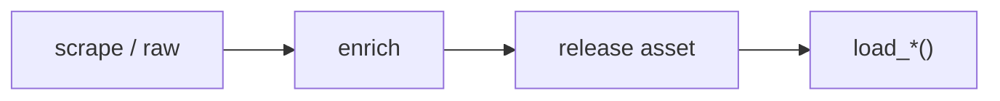

# NHL dataset loaders



## Automation status

| Dataset | Release tag | Pipeline |
|---|---|---|
| `load_nhl_pbp` | [nhl_pbp_full](https://github.com/sportsdataverse/sportsdataverse-data/releases/tag/nhl_pbp_full) | — |
| `load_nhl_player_boxscore` | [nhl_player_boxscores](https://github.com/sportsdataverse/sportsdataverse-data/releases/tag/nhl_player_boxscores) | — |
| `load_nhl_schedule` | [nhl_schedules](https://github.com/sportsdataverse/sportsdataverse-data/releases/tag/nhl_schedules) | — |
| `load_nhl_team_boxscore` | [nhl_team_boxscores](https://github.com/sportsdataverse/sportsdataverse-data/releases/tag/nhl_team_boxscores) | — |
| `load_nhl_game_info` | [nhl_game_info](https://github.com/sportsdataverse/sportsdataverse-data/releases/tag/nhl_game_info) | — |
| `load_nhl_game_rosters` | [nhl_game_rosters](https://github.com/sportsdataverse/sportsdataverse-data/releases/tag/nhl_game_rosters) | — |
| `load_nhl_goalie_boxscores` | [nhl_goalie_boxscores](https://github.com/sportsdataverse/sportsdataverse-data/releases/tag/nhl_goalie_boxscores) | — |
| `load_nhl_linescore` | [nhl_linescore](https://github.com/sportsdataverse/sportsdataverse-data/releases/tag/nhl_linescore) | — |
| `load_nhl_officials` | [nhl_officials](https://github.com/sportsdataverse/sportsdataverse-data/releases/tag/nhl_officials) | — |
| `load_nhl_pbp_full` | [nhl_pbp_full](https://github.com/sportsdataverse/sportsdataverse-data/releases/tag/nhl_pbp_full) | — |
| `load_nhl_pbp_lite` | [nhl_pbp_lite](https://github.com/sportsdataverse/sportsdataverse-data/releases/tag/nhl_pbp_lite) | — |
| `load_nhl_penalties` | [nhl_penalties](https://github.com/sportsdataverse/sportsdataverse-data/releases/tag/nhl_penalties) | — |
| `load_nhl_player_boxscores` | [nhl_player_boxscores](https://github.com/sportsdataverse/sportsdataverse-data/releases/tag/nhl_player_boxscores) | — |
| `load_nhl_rosters` | [nhl_rosters](https://github.com/sportsdataverse/sportsdataverse-data/releases/tag/nhl_rosters) | — |
| `load_nhl_schedules` | [nhl_schedules](https://github.com/sportsdataverse/sportsdataverse-data/releases/tag/nhl_schedules) | — |
| `load_nhl_scoring` | [nhl_scoring](https://github.com/sportsdataverse/sportsdataverse-data/releases/tag/nhl_scoring) | — |
| `load_nhl_scratches` | [nhl_scratches](https://github.com/sportsdataverse/sportsdataverse-data/releases/tag/nhl_scratches) | — |
| `load_nhl_shifts` | [nhl_shifts](https://github.com/sportsdataverse/sportsdataverse-data/releases/tag/nhl_shifts) | — |
| `load_nhl_shootout` | [nhl_shootout](https://github.com/sportsdataverse/sportsdataverse-data/releases/tag/nhl_shootout) | — |
| `load_nhl_shots_by_period` | [nhl_shots_by_period](https://github.com/sportsdataverse/sportsdataverse-data/releases/tag/nhl_shots_by_period) | — |
| `load_nhl_skater_boxscores` | [nhl_skater_boxscores](https://github.com/sportsdataverse/sportsdataverse-data/releases/tag/nhl_skater_boxscores) | — |
| `load_nhl_team_boxscores` | [nhl_team_boxscores](https://github.com/sportsdataverse/sportsdataverse-data/releases/tag/nhl_team_boxscores) | — |
| `load_nhl_three_stars` | [nhl_three_stars](https://github.com/sportsdataverse/sportsdataverse-data/releases/tag/nhl_three_stars) | — |

## `load_nhl_pbp`

Release: [nhl_pbp_full](https://github.com/sportsdataverse/sportsdataverse-data/releases/tag/nhl_pbp_full) · asset `https://github.com/sportsdataverse/sportsdataverse-data/releases/download/nhl_pbp_full/play_by_play_{season}.parquet`
### Returns

| col_name | type | description |
|---|---|---|
| `event_type` | String | Standardized event type code. |
| `event` | String | Event description label. |
| `description` | String | Full text description of the event. |
| `period` | Int32 | Period number. |
| `period_seconds` | Int32 | Elapsed seconds in the period. |
| `period_seconds_remaining` | Int32 | Seconds remaining in the period. |
| `game_seconds` | Int32 | Elapsed seconds in the game. |
| `game_seconds_remaining` | Int32 | Seconds remaining in regulation. |
| `home_score` | Int32 | Home team final score. |
| `away_score` | Int32 | Away team final score. |
| `strength_state` | String | Strength state (e.g. 5v5, 5v4). |
| `event_idx` | String | Sequential event index within the game. |
| `extra_attacker` | Boolean | Whether an extra attacker was on the ice. |
| `home_skaters` | Int32 | Number of home skaters on the ice. |
| `away_skaters` | Int32 | Number of away skaters on the ice. |
| `game_id` | Int32 | Unique game identifier. |
| `period_type` | String | Period type (REG/OT/SO). |
| `ordinal_num` | String | Inning ordinal label (e.g. 1st). |
| `period_time` | String | Elapsed time in the period (MM:SS). |
| `period_time_remaining` | String | Time remaining in the period (MM:SS). |
| `date_time` | String |  |
| `home_final` | Int32 |  |
| `away_final` | Int32 |  |
| `season` | Int32 | Season year (echoed from arg). |
| `season_type` | String | Season type code (echoed from arg). |
| `game_date` | String | Game date. |
| `game_start` | String |  |
| `game_end` | String |  |
| `game_length` | Int32 |  |
| `game_state` | String | Game state (e.g., FINAL, LIVE). |
| `detailed_state` | String | Detailed status description (e.g. 'Scheduled', 'Pre-Game', 'In Progress'). |
| `venue_name` | String | Name of the venue. |
| `venue_link` | String | API link to the venue. |
| `home_name` | String | Home team display name. |
| `home_abbreviation` | String | Home team abbreviation. |
| `home_division_name` | String |  |
| `home_conference_name` | String |  |
| `home_id` | String | Home team ESPN identifier. |
| `away_name` | String | Away team display name. |
| `away_abbreviation` | String | Away team abbreviation. |
| `away_division_name` | String |  |
| `away_conference_name` | String |  |
| `away_id` | String | Away team ESPN identifier. |
| `event_id` | Float64 | ESPN event id (echoed from arg). |
| `event_team` | String | Team associated with the shift change. |
| `event_team_type` | String | Whether the event team is home or away. |
| `num_on` | Int32 | Number of players coming on (line change). |
| `players_on` | String | Names of players coming on. |
| `players_off` | String | Names of players going off. |
| `away_on_1` | String | Name of away skater 1 on the ice. |
| `away_on_2` | String | Name of away skater 2 on the ice. |
| `away_on_3` | String | Name of away skater 3 on the ice. |
| `away_on_4` | String | Name of away skater 4 on the ice. |
| `away_on_5` | String | Name of away skater 5 on the ice. |
| `away_goalie` | String | Name of the away goalie on the ice. |
| `ids_on` | String | Player ids coming on. |
| `ids_off` | String | Player ids going off. |
| `secondary_type` | String | Secondary event type (e.g. shot type). |
| `home_on_1` | String | Name of home skater 1 on the ice. |
| `home_on_2` | String | Name of home skater 2 on the ice. |
| `home_on_3` | String | Name of home skater 3 on the ice. |
| `home_on_4` | String | Name of home skater 4 on the ice. |
| `home_on_5` | String | Name of home skater 5 on the ice. |
| `home_goalie` | String | Name of the home goalie on the ice. |
| `event_player_1_name` | String | Name of the primary event player. |
| `event_player_1_type` | String | Role of the primary event player. |
| `event_player_2_name` | String | Name of the secondary event player. |
| `event_player_2_type` | String | Role of the secondary event player. |
| `strength_code` | String | Strength state code (e.g., all, even, pp, pk). |
| `strength` | String | Strength label (Even, Power Play, Shorthanded). |
| `x` | Int32 | Raw x-coordinate of the event. |
| `y` | Int32 | Raw y-coordinate of the event. |
| `x_fixed` | Int32 | Normalized x coordinate (home shoots right). |
| `y_fixed` | Int32 | Normalized y coordinate (home shoots right). |
| `event_player_1_id` | Int32 | Player id of the primary event player. |
| `event_player_1_link` | String |  |
| `event_player_2_id` | Int32 | Player id of the secondary event player. |
| `event_player_2_link` | String |  |
| `event_team_id` | Int32 |  |
| `event_team_link` | String |  |
| `event_team_abbr` | String | Abbreviation of the team credited with the event. |
| `num_off` | Int32 | Number of players going off (line change). |
| `event_goalie_name` | String | Name of the goalie on the event. |
| `shot_distance` | Float64 | Distance of the shot from the net. |
| `shot_angle` | Float64 | Angle of the shot relative to the net. |
| `event_goalie_id` | Int32 | Player id of the goalie on the event. |
| `event_goalie_link` | String |  |
| `event_goalie_type` | String |  |
| `event_player_3_name` | String | Name of the tertiary event player. |
| `event_player_3_type` | String | Role of the tertiary event player. |
| `game_winning_goal` | Boolean |  |
| `empty_net` | Boolean | Whether the net was empty. |
| `event_player_3_id` | Int32 | Player ID of the tertiary event player. |
| `event_player_3_link` | String |  |
| `event_player_4_type` | String |  |
| `event_player_4_id` | Int32 |  |
| `event_player_4_name` | String |  |
| `event_player_4_link` | String |  |
| `penalty_severity` | String | Severity of the penalty. |
| `penalty_minutes` | Int32 | Penalty minutes. |
| `home_on_6` | String | Name of home skater 6 on the ice. |
| `venue_id` | Int32 | Venue identifier. |
| `away_on_6` | String | Name of away skater 6 on the ice. |

```python
load_nhl_pbp(seasons=2024)
```

## `load_nhl_player_boxscore`

Release: [nhl_player_boxscores](https://github.com/sportsdataverse/sportsdataverse-data/releases/tag/nhl_player_boxscores) · asset `https://github.com/sportsdataverse/sportsdataverse-data/releases/download/nhl_player_boxscores/player_box_{season}.parquet`
### Returns

| col_name | type | description |
|---|---|---|
| `player_id` | Int32 | Unique player identifier. |
| `player_full_name` | String | Player full name. |
| `link` | String | API link to the game feed. |
| `shoots_catches` | String | Handedness (shoots/catches). |
| `roster_status` | String | Payroll table the row came from: Active, IL, or Retained Salary. |
| `jersey_number` | String | Jersey number. |
| `position_code` | String | Player position code. |
| `position_name` | String | Official position name (e.g. "Referee", "Linesman"). |
| `position_type` | String | Position category (e.g. 'Pitcher', 'Infielder'). |
| `position_abbreviation` | String | Position abbreviation. |
| `skater_stats_time_on_ice` | String |  |
| `skater_stats_assists` | Int32 |  |
| `skater_stats_goals` | Int32 |  |
| `skater_stats_shots` | Int32 |  |
| `skater_stats_hits` | Int32 |  |
| `skater_stats_power_play_goals` | Int32 |  |
| `skater_stats_power_play_assists` | Int32 |  |
| `skater_stats_penalty_minutes` | Int32 |  |
| `skater_stats_face_off_wins` | Int32 |  |
| `skater_stats_faceoff_taken` | Int32 |  |
| `skater_stats_takeaways` | Int32 |  |
| `skater_stats_giveaways` | Int32 |  |
| `skater_stats_short_handed_goals` | Int32 |  |
| `skater_stats_short_handed_assists` | Int32 |  |
| `skater_stats_blocked` | Int32 |  |
| `skater_stats_plus_minus` | Int32 |  |
| `skater_stats_even_time_on_ice` | String |  |
| `skater_stats_power_play_time_on_ice` | String |  |
| `skater_stats_short_handed_time_on_ice` | String |  |
| `home_away` | String | Home or away indicator. |
| `skater_stats_face_off_pct` | Float64 |  |
| `goalie_stats_time_on_ice` | String |  |
| `goalie_stats_assists` | Int32 |  |
| `goalie_stats_goals` | Int32 |  |
| `goalie_stats_pim` | Int32 |  |
| `goalie_stats_shots` | Int32 |  |
| `goalie_stats_saves` | Int32 |  |
| `goalie_stats_power_play_saves` | Int32 |  |
| `goalie_stats_short_handed_saves` | Int32 |  |
| `goalie_stats_even_saves` | Int32 |  |
| `goalie_stats_short_handed_shots_against` | Int32 |  |
| `goalie_stats_even_shots_against` | Int32 |  |
| `goalie_stats_power_play_shots_against` | Int32 |  |
| `goalie_stats_decision` | String |  |
| `goalie_stats_save_percentage` | Float64 |  |
| `goalie_stats_power_play_save_percentage` | Float64 |  |
| `goalie_stats_even_strength_save_percentage` | Float64 |  |
| `goalie_stats_short_handed_save_percentage` | Float64 |  |
| `game_id` | Int32 | Unique game identifier. |
| `season` | Int32 | Season year (echoed from arg). |

```python
load_nhl_player_boxscore(seasons=2024)
```

## `load_nhl_schedule`

Release: [nhl_schedules](https://github.com/sportsdataverse/sportsdataverse-data/releases/tag/nhl_schedules) · asset `https://github.com/sportsdataverse/sportsdataverse-data/releases/download/nhl_schedules/nhl_schedule_{season}.parquet`
### Returns

| col_name | type | description |
|---|---|---|
| `game_id` | Int32 | Unique game identifier. |
| `link` | String | API link to the game feed. |
| `game_type_abbreviation` | String |  |
| `season_full` | Int32 | Full season label (e.g. 20212022). |
| `game_date_time` | Datetime(time_unit='us', time_zone='UTC') | Game start date/time (ISO 8601). |
| `status_abstract_game_state` | String | Abstract game state (e.g. 'Final'). |
| `status_coded_game_state` | Int32 | Coded game state. |
| `status_detailed_state` | String | Detailed game state. |
| `status_status_code` | Int32 | Status code for the game. |
| `status_start_time_tbd` | Boolean | Whether the start time is TBD. |
| `away_score` | Int32 | Away team final score. |
| `away_team_id` | Int32 | Away team identifier. |
| `away_team_name` | String | Away team name. |
| `away_team_link` | String | MLB Stats API relative away team link. |
| `home_score` | Int32 | Home team final score. |
| `home_team_id` | Int32 | Home team identifier. |
| `home_team_name` | String | Home team name. |
| `home_team_link` | String | MLB Stats API relative home team link. |
| `venue_name` | String | Name of the venue. |
| `venue_link` | String | API link to the venue. |
| `venue_id` | Int32 | Venue identifier. |
| `content_link` | String | API link to the game content. |
| `game_type` | String | Game type the row belongs to. |
| `game_date` | Date | Game date. |
| `season` | Int32 | Season year (echoed from arg). |
| `PBP` | Boolean | Whether play-by-play data is available. |
| `team_box` | Boolean | Whether team box score data is available. |
| `player_box` | Boolean | Whether player box score data is available. |

```python
load_nhl_schedule(seasons=2024)
```

## `load_nhl_team_boxscore`

Release: [nhl_team_boxscores](https://github.com/sportsdataverse/sportsdataverse-data/releases/tag/nhl_team_boxscores) · asset `https://github.com/sportsdataverse/sportsdataverse-data/releases/download/nhl_team_boxscores/team_box_{season}.parquet`
### Returns

| col_name | type | description |
|---|---|---|
| `team_id` | Int32 | Unique team identifier. |
| `team_name` | String | Team name. |
| `link` | String | API link to the game feed. |
| `abbreviation` | String | Team abbreviation. |
| `tri_code` | String | Team three-letter code. |
| `goals` | Int32 | Goals scored. |
| `pim` | Int32 | Penalty minutes. |
| `shots` | Int32 | Shots on goal. |
| `power_play_percentage` | String |  |
| `power_play_goals` | Int32 | Power-play goals. |
| `power_play_opportunities` | Int32 | Power play opportunities. |
| `face_off_win_percentage` | String |  |
| `blocked` | Int32 |  |
| `takeaways` | Int32 | Takeaways. |
| `giveaways` | Int32 | Giveaways. |
| `hits` | Int32 | Hits. |
| `game_id` | Int32 | Unique game identifier. |
| `season` | Int32 | Season year (echoed from arg). |

```python
load_nhl_team_boxscore(seasons=2024)
```

## `load_nhl_game_info`

Release: [nhl_game_info](https://github.com/sportsdataverse/sportsdataverse-data/releases/tag/nhl_game_info) · asset `https://github.com/sportsdataverse/sportsdataverse-data/releases/download/nhl_game_info/game_info_{season}.parquet`
### Returns

| col_name | type | description |
|---|---|---|
| `game_id` | Int32 | Unique game identifier. |
| `season` | Int32 | Season year (echoed from arg). |
| `game_type` | String | Game type the row belongs to. |
| `game_date` | String | Game date. |
| `venue` | String | Venue where the game was played. |
| `home_team_abbr` | String | Home team abbreviation. |
| `away_team_abbr` | String | Away team abbreviation. |
| `home_score` | Int32 | Home team final score. |
| `away_score` | Int32 | Away team final score. |
| `game_state` | String | Game state (e.g., FINAL, LIVE). |

```python
load_nhl_game_info(seasons=2024)
```

## `load_nhl_game_rosters`

Release: [nhl_game_rosters](https://github.com/sportsdataverse/sportsdataverse-data/releases/tag/nhl_game_rosters) · asset `https://github.com/sportsdataverse/sportsdataverse-data/releases/download/nhl_game_rosters/game_rosters_{season}.parquet`
### Returns

| col_name | type | description |
|---|---|---|
| `player_id` | Int32 | Unique player identifier. |
| `full_name` | String | Player full name. |
| `first_name` | String | Player first name. |
| `last_name` | String | Player last name. |
| `team_abbr` | String | Team abbreviation. |
| `team_id` | Int32 | Unique team identifier. |
| `position_code` | String | Player position code. |
| `sweater_number` | Int32 | Jersey number. |
| `game_id` | Int32 | Unique game identifier. |
| `season` | Int32 | Season year (echoed from arg). |
| `game_date` | String | Game date. |

```python
load_nhl_game_rosters(seasons=2024)
```

## `load_nhl_goalie_boxscores`

Release: [nhl_goalie_boxscores](https://github.com/sportsdataverse/sportsdataverse-data/releases/tag/nhl_goalie_boxscores) · asset `https://github.com/sportsdataverse/sportsdataverse-data/releases/download/nhl_goalie_boxscores/goalie_box_{season}.parquet`
### Returns

| col_name | type | description |
|---|---|---|
| `home_away` | String | Home or away indicator. |
| `team_id` | Int32 | Unique team identifier. |
| `team_abbrev` | String | Team abbreviation. |
| `player_id` | Int32 | Unique player identifier. |
| `player_name` | String | Player name. |
| `sweater_number` | Int32 | Jersey number. |
| `even_strength_shots_against` | String | Even-strength shots against (saves/total). |
| `power_play_shots_against` | String | Power-play shots against (saves/total). |
| `shorthanded_shots_against` | String | Shorthanded shots against (saves/total). |
| `save_shots_against` | String | Total shots against (saves/total). |
| `save_pctg` | Float64 | Save percentage. |
| `even_strength_goals_against` | Int32 | Even-strength goals against. |
| `power_play_goals_against` | Int32 | Power-play goals against. |
| `shorthanded_goals_against` | Int32 | Shorthanded goals against. |
| `pim` | Int32 | Penalty minutes. |
| `goals_against` | Int32 | Goals against. |
| `toi` | String | Time on ice. |
| `starter` | Boolean | Whether the goalie started the game. |
| `decision` | String | Goalie decision (W/L/O). |
| `shots_against` | Int32 | Shots faced. |
| `saves` | Int32 | Saves made. |
| `game_id` | Int32 | Unique game identifier. |
| `season` | Int32 | Season year (echoed from arg). |
| `game_date` | String | Game date. |

```python
load_nhl_goalie_boxscores(seasons=2024)
```

## `load_nhl_linescore`

Release: [nhl_linescore](https://github.com/sportsdataverse/sportsdataverse-data/releases/tag/nhl_linescore) · asset `https://github.com/sportsdataverse/sportsdataverse-data/releases/download/nhl_linescore/linescore_{season}.parquet`
### Returns

| col_name | type | description |
|---|---|---|
| `game_id` | Int32 | Unique game identifier. |
| `home_team_id` | Int32 | Home team identifier. |
| `home_team_abbr` | String | Home team abbreviation. |
| `home_goals` | Int32 | Home goals in the period. |
| `home_shots` | Int32 | Home team shots in the period. |
| `away_team_id` | Int32 | Away team identifier. |
| `away_team_abbr` | String | Away team abbreviation. |
| `away_goals` | Int32 | Away goals in the period. |
| `away_shots` | Int32 | Away team shots in the period. |
| `has_shootout` | Boolean | Flag for whether the game went to shootout. |

```python
load_nhl_linescore(seasons=2024)
```

## `load_nhl_officials`

Release: [nhl_officials](https://github.com/sportsdataverse/sportsdataverse-data/releases/tag/nhl_officials) · asset `https://github.com/sportsdataverse/sportsdataverse-data/releases/download/nhl_officials/officials_{season}.parquet`
### Returns

| col_name | type | description |
|---|---|---|
| `role` | String | Grouped official role (Referee/Linesperson). |
| `name` | String | Team mascot name. |
| `game_id` | Int32 | Unique game identifier. |
| `season` | Int32 | Season year (echoed from arg). |
| `game_date` | String | Game date. |

```python
load_nhl_officials(seasons=2025)
```

## `load_nhl_pbp_full`

Release: [nhl_pbp_full](https://github.com/sportsdataverse/sportsdataverse-data/releases/tag/nhl_pbp_full) · asset `https://github.com/sportsdataverse/sportsdataverse-data/releases/download/nhl_pbp_full/play_by_play_{season}.parquet`
### Returns

| col_name | type | description |
|---|---|---|
| `event_type` | String | Standardized event type code. |
| `event` | String | Event description label. |
| `secondary_type` | String | Secondary event type (e.g. shot type). |
| `event_team_abbr` | String | Abbreviation of the team credited with the event. |
| `event_team_type` | String | Whether the event team is home or away. |
| `description` | String | Full text description of the event. |
| `period` | Int32 | Period number. |
| `period_type` | String | Period type (REG/OT/SO). |
| `period_time` | String | Elapsed time in the period (MM:SS). |
| `period_seconds` | Int32 | Elapsed seconds in the period. |
| `period_seconds_remaining` | Int32 | Seconds remaining in the period. |
| `period_time_remaining` | String | Time remaining in the period (MM:SS). |
| `game_seconds` | Int32 | Elapsed seconds in the game. |
| `game_seconds_remaining` | Int32 | Seconds remaining in regulation. |
| `home_score` | Int32 | Home team final score. |
| `away_score` | Int32 | Away team final score. |
| `event_player_1_name` | String | Name of the primary event player. |
| `event_player_1_type` | String | Role of the primary event player. |
| `event_player_1_id` | Int32 | Player id of the primary event player. |
| `event_player_2_name` | String | Name of the secondary event player. |
| `event_player_2_type` | String | Role of the secondary event player. |
| `event_player_2_id` | Int32 | Player id of the secondary event player. |
| `event_player_3_name` | String | Name of the tertiary event player. |
| `event_player_3_type` | String | Role of the tertiary event player. |
| `event_player_3_id` | Int32 | Player ID of the tertiary event player. |
| `event_goalie_name` | String | Name of the goalie on the event. |
| `event_goalie_id` | Int32 | Player id of the goalie on the event. |
| `penalty_severity` | String | Severity of the penalty. |
| `penalty_minutes` | Int32 | Penalty minutes. |
| `empty_net` | Boolean | Whether the net was empty. |
| `extra_attacker` | Boolean | Whether an extra attacker was on the ice. |
| `x` | Int32 | Raw x-coordinate of the event. |
| `y` | Int32 | Raw y-coordinate of the event. |
| `x_fixed` | Int32 | Normalized x coordinate (home shoots right). |
| `y_fixed` | Int32 | Normalized y coordinate (home shoots right). |
| `shot_distance` | Float64 | Distance of the shot from the net. |
| `shot_angle` | Float64 | Angle of the shot relative to the net. |
| `home_skaters` | Int32 | Number of home skaters on the ice. |
| `away_skaters` | Int32 | Number of away skaters on the ice. |
| `players_on` | Boolean | Names of players coming on. |
| `players_off` | Boolean | Names of players going off. |
| `game_id` | Int32 | Unique game identifier. |
| `season` | Int32 | Season year (echoed from arg). |
| `season_type` | String | Season type code (echoed from arg). |
| `home_abbr` | String | Home team abbreviation. |
| `away_abbr` | String | Away team abbreviation. |
| `event_idx` | Int32 | Sequential event index within the game. |
| `event_id` | Int32 | ESPN event id (echoed from arg). |
| `away_goalie_in` | Int32 | Whether the away goalie is on the ice (1/0). |
| `home_goalie_in` | Int32 | Whether the home goalie is on the ice (1/0). |
| `reason` | String | Reason for the event (e.g. stoppage reason). |
| `secondaryReason` | String | Secondary reason for a stoppage. |
| `xg` | Float64 | Expected goals value for the shot event. |

```python
load_nhl_pbp_full(seasons=2010)
```

## `load_nhl_pbp_lite`

Release: [nhl_pbp_lite](https://github.com/sportsdataverse/sportsdataverse-data/releases/tag/nhl_pbp_lite) · asset `https://github.com/sportsdataverse/sportsdataverse-data/releases/download/nhl_pbp_lite/play_by_play_{season}_lite.parquet`
### Returns

| col_name | type | description |
|---|---|---|
| `event_type` | String | Standardized event type code. |
| `event` | String | Event description label. |
| `secondary_type` | String | Secondary event type (e.g. shot type). |
| `event_team_abbr` | String | Abbreviation of the team credited with the event. |
| `event_team_type` | String | Whether the event team is home or away. |
| `description` | String | Full text description of the event. |
| `period` | Int32 | Period number. |
| `period_type` | String | Period type (REG/OT/SO). |
| `period_time` | String | Elapsed time in the period (MM:SS). |
| `period_seconds` | Int32 | Elapsed seconds in the period. |
| `period_seconds_remaining` | Int32 | Seconds remaining in the period. |
| `period_time_remaining` | String | Time remaining in the period (MM:SS). |
| `game_seconds` | Int32 | Elapsed seconds in the game. |
| `game_seconds_remaining` | Int32 | Seconds remaining in regulation. |
| `home_score` | Int32 | Home team final score. |
| `away_score` | Int32 | Away team final score. |
| `event_player_1_name` | String | Name of the primary event player. |
| `event_player_1_type` | String | Role of the primary event player. |
| `event_player_1_id` | Int32 | Player id of the primary event player. |
| `event_player_2_name` | String | Name of the secondary event player. |
| `event_player_2_type` | String | Role of the secondary event player. |
| `event_player_2_id` | Int32 | Player id of the secondary event player. |
| `event_player_3_name` | String | Name of the tertiary event player. |
| `event_player_3_type` | String | Role of the tertiary event player. |
| `event_player_3_id` | Int32 | Player ID of the tertiary event player. |
| `event_goalie_name` | String | Name of the goalie on the event. |
| `event_goalie_id` | Int32 | Player id of the goalie on the event. |
| `penalty_severity` | String | Severity of the penalty. |
| `penalty_minutes` | Int32 | Penalty minutes. |
| `empty_net` | Boolean | Whether the net was empty. |
| `extra_attacker` | Boolean | Whether an extra attacker was on the ice. |
| `x` | Int32 | Raw x-coordinate of the event. |
| `y` | Int32 | Raw y-coordinate of the event. |
| `x_fixed` | Int32 | Normalized x coordinate (home shoots right). |
| `y_fixed` | Int32 | Normalized y coordinate (home shoots right). |
| `shot_distance` | Float64 | Distance of the shot from the net. |
| `shot_angle` | Float64 | Angle of the shot relative to the net. |
| `home_skaters` | Int32 | Number of home skaters on the ice. |
| `away_skaters` | Int32 | Number of away skaters on the ice. |
| `players_on` | Boolean | Names of players coming on. |
| `players_off` | Boolean | Names of players going off. |
| `game_id` | Int32 | Unique game identifier. |
| `season` | Int32 | Season year (echoed from arg). |
| `season_type` | String | Season type code (echoed from arg). |
| `home_abbr` | String | Home team abbreviation. |
| `away_abbr` | String | Away team abbreviation. |
| `event_idx` | Int32 | Sequential event index within the game. |
| `event_id` | Int32 | ESPN event id (echoed from arg). |
| `away_goalie_in` | Int32 | Whether the away goalie is on the ice (1/0). |
| `home_goalie_in` | Int32 | Whether the home goalie is on the ice (1/0). |
| `reason` | String | Reason for the event (e.g. stoppage reason). |
| `secondaryReason` | String | Secondary reason for a stoppage. |
| `xg` | Float64 | Expected goals value for the shot event. |

```python
load_nhl_pbp_lite(seasons=2010)
```

## `load_nhl_penalties`

Release: [nhl_penalties](https://github.com/sportsdataverse/sportsdataverse-data/releases/tag/nhl_penalties) · asset `https://github.com/sportsdataverse/sportsdataverse-data/releases/download/nhl_penalties/penalties_{season}.parquet`
### Returns

| col_name | type | description |
|---|---|---|
| `timeInPeriod` | String | Time within the period the penalty occurred. |
| `type` | String | Competitor type (e.g. "team"). |
| `duration` | Int32 | Penalty duration in minutes. |
| `descKey` | String | Penalty description key. |
| `game_id` | Int32 | Unique game identifier. |
| `period_number` | Int32 | Period number (1-3 regulation, 4+ OT). |
| `period_type` | String | Period type (REG/OT/SO). |
| `committedByPlayer.sweaterNumber` | Int32 |  |
| `committedByPlayer.firstName.default` | String |  |
| `committedByPlayer.firstName.cs` | String |  |
| `committedByPlayer.firstName.de` | String |  |
| `committedByPlayer.firstName.es` | String |  |
| `committedByPlayer.firstName.fi` | String |  |
| `committedByPlayer.firstName.sk` | String |  |
| `committedByPlayer.firstName.sv` | String |  |
| `committedByPlayer.firstName.fr` | String |  |
| `committedByPlayer.lastName.default` | String |  |
| `committedByPlayer.lastName.cs` | String |  |
| `committedByPlayer.lastName.fi` | String |  |
| `committedByPlayer.lastName.sk` | String |  |
| `committedByPlayer.lastName.sv` | String |  |
| `committedByPlayer.lastName.de` | String |  |
| `committedByPlayer.lastName.es` | String |  |
| `committedByPlayer.lastName.fr` | String |  |
| `teamAbbrev.default` | String |  |
| `drawnBy.sweaterNumber` | Int32 |  |
| `drawnBy.firstName.default` | String |  |
| `drawnBy.firstName.cs` | String |  |
| `drawnBy.firstName.fi` | String |  |
| `drawnBy.firstName.sk` | String |  |
| `drawnBy.firstName.de` | String |  |
| `drawnBy.firstName.es` | String |  |
| `drawnBy.firstName.sv` | String |  |
| `drawnBy.firstName.fr` | String |  |
| `drawnBy.lastName.default` | String |  |
| `drawnBy.lastName.cs` | String |  |
| `drawnBy.lastName.fi` | String |  |
| `drawnBy.lastName.sk` | String |  |
| `drawnBy.lastName.sv` | String |  |
| `drawnBy.lastName.de` | String |  |
| `drawnBy.lastName.es` | String |  |
| `drawnBy.lastName.fr` | String |  |
| `servedBy.default` | String |  |
| `servedBy.cs` | String |  |
| `servedBy.fi` | String |  |
| `servedBy.sk` | String |  |
| `servedBy.de` | String |  |
| `servedBy.es` | String |  |
| `servedBy.sv` | String |  |

```python
load_nhl_penalties(seasons=2024)
```

## `load_nhl_player_boxscores`

Release: [nhl_player_boxscores](https://github.com/sportsdataverse/sportsdataverse-data/releases/tag/nhl_player_boxscores) · asset `https://github.com/sportsdataverse/sportsdataverse-data/releases/download/nhl_player_boxscores/player_box_{season}.parquet`
### Returns

| col_name | type | description |
|---|---|---|
| `home_away` | String | Home or away indicator. |
| `team_id` | Int32 | Unique team identifier. |
| `team_abbrev` | String | Team abbreviation. |
| `player_id` | Int32 | Unique player identifier. |
| `player_name` | String | Player name. |
| `sweater_number` | Int32 | Jersey number. |
| `position` | String | Player position. |
| `goals` | Int32 | Goals scored. |
| `assists` | Int32 | Assists. |
| `points` | Int32 | Total points (goals + assists). |
| `plus_minus` | Int32 | Plus/minus rating. |
| `pim` | Int32 | Penalty minutes. |
| `hits` | Int32 | Hits. |
| `power_play_goals` | Int32 | Power-play goals. |
| `shots_on_goal` | Int32 | Shots on goal. |
| `faceoff_winning_pctg` | Float64 | Faceoff win percentage. |
| `toi` | String | Time on ice. |
| `blocked_shots` | Int32 | Blocked shots. |
| `shifts` | Int32 | Number of shifts. |
| `giveaways` | Int32 | Giveaways. |
| `takeaways` | Int32 | Takeaways. |
| `even_strength_shots_against` | String | Even-strength shots against (saves/total). |
| `power_play_shots_against` | String | Power-play shots against (saves/total). |
| `shorthanded_shots_against` | String | Shorthanded shots against (saves/total). |
| `save_shots_against` | String | Total shots against (saves/total). |
| `save_pctg` | Float64 | Save percentage. |
| `even_strength_goals_against` | Int32 | Even-strength goals against. |
| `power_play_goals_against` | Int32 | Power-play goals against. |
| `shorthanded_goals_against` | Int32 | Shorthanded goals against. |
| `goals_against` | Int32 | Goals against. |
| `starter` | Boolean | Whether the goalie started the game. |
| `decision` | String | Goalie decision (W/L/O). |
| `shots_against` | Int32 | Shots faced. |
| `saves` | Int32 | Saves made. |

```python
load_nhl_player_boxscores(seasons=2010)
```

## `load_nhl_rosters`

Release: [nhl_rosters](https://github.com/sportsdataverse/sportsdataverse-data/releases/tag/nhl_rosters) · asset `https://github.com/sportsdataverse/sportsdataverse-data/releases/download/nhl_rosters/rosters_{season}.parquet`
### Returns

| col_name | type | description |
|---|---|---|
| `player_id` | Int32 | Unique player identifier. |
| `full_name` | String | Player full name. |
| `first_name` | String | Player first name. |
| `last_name` | String | Player last name. |
| `team_abbr` | String | Team abbreviation. |
| `team_id` | Int32 | Unique team identifier. |
| `position_code` | String | Player position code. |
| `sweater_number` | Int32 | Jersey number. |
| `season` | Int32 | Season year (echoed from arg). |

```python
load_nhl_rosters(seasons=2010)
```

## `load_nhl_schedules`

Release: [nhl_schedules](https://github.com/sportsdataverse/sportsdataverse-data/releases/tag/nhl_schedules) · asset `https://github.com/sportsdataverse/sportsdataverse-data/releases/download/nhl_schedules/nhl_schedule_{season}.parquet`
### Returns

| col_name | type | description |
|---|---|---|
| `game_id` | Int32 | Unique game identifier. |
| `season_full` | String | Full season label (e.g. 20212022). |
| `game_type` | String | Game type the row belongs to. |
| `game_date` | String | Game date. |
| `game_time` | String | Scheduled start time of the game. |
| `home_team_abbr` | String | Home team abbreviation. |
| `away_team_abbr` | String | Away team abbreviation. |
| `home_team_name` | String | Home team name. |
| `away_team_name` | String | Away team name. |
| `home_score` | Int32 | Home team final score. |
| `away_score` | Int32 | Away team final score. |
| `game_state` | String | Game state (e.g., FINAL, LIVE). |
| `venue` | String | Venue where the game was played. |
| `season` | Int32 | Season year (echoed from arg). |
| `game_json` | Boolean | Whether processed game JSON is available. |
| `game_json_url` | String | URL to the processed game JSON. |
| `PBP` | Boolean | Whether play-by-play data is available. |
| `team_box` | Boolean | Whether team box score data is available. |
| `player_box` | Boolean | Whether player box score data is available. |

```python
load_nhl_schedules(seasons=2010)
```

## `load_nhl_scoring`

Release: [nhl_scoring](https://github.com/sportsdataverse/sportsdataverse-data/releases/tag/nhl_scoring) · asset `https://github.com/sportsdataverse/sportsdataverse-data/releases/download/nhl_scoring/scoring_{season}.parquet`
### Returns

| col_name | type | description |
|---|---|---|
| `situationCode` | String | Strength/situation code for the goal. |
| `eventId` | Int32 | Event identifier within the game. |
| `strength` | String | Strength label (Even, Power Play, Shorthanded). |
| `playerId` | Int32 | Player identifier involved in the event. |
| `headshot` | String | URL to the player headshot image. |
| `highlightClipSharingUrl` | String | Shareable URL for the goal highlight clip. |
| `highlightClip` | Float64 | Highlight clip identifier. |
| `goalsToDate` | Int32 | Scorer goal total to date in the season. |
| `awayScore` | Int32 | Away team score after the goal. |
| `homeScore` | Int32 | Home team score after the goal. |
| `timeInPeriod` | String | Time within the period the penalty occurred. |
| `shotType` | String | Type of shot on the goal. |
| `goalModifier` | String | Goal modifier (e.g. empty-net, power-play). |
| `assists` | String | Assists. |
| `pptReplayUrl` | String | URL to the play replay, if available. |
| `homeTeamDefendingSide` | String | Side of the ice the home team is defending. |
| `isHome` | Boolean | Whether the scoring team is the home team. |
| `game_id` | Int32 | Unique game identifier. |
| `period_number` | Int32 | Period number (1-3 regulation, 4+ OT). |
| `period_type` | String | Period type (REG/OT/SO). |
| `highlightClipSharingUrlFr` | String |  |
| `highlightClipFr` | Float64 |  |
| `discreteClip` | Float64 | Discrete clip identifier. |
| `discreteClipFr` | Float64 |  |
| `firstName.default` | String |  |
| `firstName.cs` | String |  |
| `firstName.de` | String |  |
| `firstName.es` | String |  |
| `firstName.fi` | String |  |
| `firstName.sk` | String |  |
| `firstName.sv` | String |  |
| `firstName.fr` | String |  |
| `lastName.default` | String |  |
| `lastName.cs` | String |  |
| `lastName.fi` | String |  |
| `lastName.sk` | String |  |
| `lastName.sv` | String |  |
| `lastName.de` | String |  |
| `lastName.es` | String |  |
| `lastName.fr` | String |  |
| `name.default` | String | Team name (default language). |
| `name.cs` | String |  |
| `name.fi` | String |  |
| `name.sk` | String |  |
| `name.sv` | String |  |
| `name.de` | String |  |
| `name.es` | String |  |
| `name.fr` | String | Team name (French). |
| `teamAbbrev.default` | String |  |
| `leadingTeamAbbrev.default` | String |  |

```python
load_nhl_scoring(seasons=2024)
```

## `load_nhl_scratches`

Release: [nhl_scratches](https://github.com/sportsdataverse/sportsdataverse-data/releases/tag/nhl_scratches) · asset `https://github.com/sportsdataverse/sportsdataverse-data/releases/download/nhl_scratches/scratches_{season}.parquet`
### Returns

| col_name | type | description |
|---|---|---|
| `id` | Int32 | Unique player identifier. |
| `firstName` | String | Scorer first name (localized list). |
| `lastName` | String | Scorer last name (localized list). |
| `game_id` | Int32 | Unique game identifier. |

```python
load_nhl_scratches(seasons=2024)
```

## `load_nhl_shifts`

Release: [nhl_shifts](https://github.com/sportsdataverse/sportsdataverse-data/releases/tag/nhl_shifts) · asset `https://github.com/sportsdataverse/sportsdataverse-data/releases/download/nhl_shifts/shifts_{season}.parquet`
### Returns

| col_name | type | description |
|---|---|---|
| `event_team` | String | Team associated with the shift change. |
| `period` | Int32 | Period number. |
| `period_time` | String | Elapsed time in the period (MM:SS). |
| `period_seconds` | Int32 | Elapsed seconds in the period. |
| `game_seconds` | Int32 | Elapsed seconds in the game. |
| `num_on` | Int32 | Number of players coming on (line change). |
| `players_on` | String | Names of players coming on. |
| `ids_on` | String | Player ids coming on. |
| `num_off` | Int32 | Number of players going off (line change). |
| `players_off` | String | Names of players going off. |
| `ids_off` | String | Player ids going off. |
| `event` | String | Event description label. |
| `event_type` | String | Standardized event type code. |
| `game_seconds_remaining` | Int32 | Seconds remaining in regulation. |
| `game_id` | Int32 | Unique game identifier. |
| `season` | Int32 | Season year (echoed from arg). |
| `game_date` | String | Game date. |

```python
load_nhl_shifts(seasons=2025)
```

## `load_nhl_shootout`

Release: [nhl_shootout](https://github.com/sportsdataverse/sportsdataverse-data/releases/tag/nhl_shootout) · asset `https://github.com/sportsdataverse/sportsdataverse-data/releases/download/nhl_shootout/shootout_summary_{season}.parquet`
### Returns

| col_name | type | description |
|---|---|---|
| `home` | Int32 | Whether the player's team was home. |
| `away` | Int32 | Away team shots in the period. |
| `sequence` | Int32 | Sequence order of the season row. |
| `playerId` | Int32 | Player identifier involved in the event. |
| `shotType` | String | Type of shot on the goal. |
| `result` | String | Attempt result (goal/save/miss). |
| `headshot` | String | URL to the player headshot image. |
| `gameWinner` | Boolean |  |
| `homeScore` | Int32 | Home team score after the goal. |
| `awayScore` | Int32 | Away team score after the goal. |
| `game_id` | Int32 | Unique game identifier. |
| `season` | Int32 | Season year (echoed from arg). |
| `game_date` | String | Game date. |
| `discreteClip` | Float64 | Discrete clip identifier. |
| `discreteClipFr` | Float64 |  |
| `teamAbbrev.default` | String |  |
| `firstName.default` | String |  |
| `firstName.cs` | String |  |
| `firstName.sk` | String |  |
| `firstName.fi` | String |  |
| `firstName.de` | String |  |
| `firstName.es` | String |  |
| `firstName.sv` | String |  |
| `lastName.default` | String |  |
| `lastName.cs` | String |  |
| `lastName.fi` | String |  |
| `lastName.sk` | String |  |
| `lastName.sv` | String |  |

```python
load_nhl_shootout(seasons=2025)
```

## `load_nhl_shots_by_period`

Release: [nhl_shots_by_period](https://github.com/sportsdataverse/sportsdataverse-data/releases/tag/nhl_shots_by_period) · asset `https://github.com/sportsdataverse/sportsdataverse-data/releases/download/nhl_shots_by_period/shots_by_period_{season}.parquet`
### Returns

| col_name | type | description |
|---|---|---|
| `away` | Int32 | Away team shots in the period. |
| `home` | Int32 | Whether the player's team was home. |
| `game_id` | Int32 | Unique game identifier. |
| `season` | Int32 | Season year (echoed from arg). |
| `game_date` | String | Game date. |
| `period` | Int32 | Period number. |
| `period_type` | String | Period type (REG/OT/SO). |
| `max_regulation_periods` | Int32 |  |
| `ot_periods` | Int32 |  |

```python
load_nhl_shots_by_period(seasons=2025)
```

## `load_nhl_skater_boxscores`

Release: [nhl_skater_boxscores](https://github.com/sportsdataverse/sportsdataverse-data/releases/tag/nhl_skater_boxscores) · asset `https://github.com/sportsdataverse/sportsdataverse-data/releases/download/nhl_skater_boxscores/skater_box_{season}.parquet`
### Returns

| col_name | type | description |
|---|---|---|
| `home_away` | String | Home or away indicator. |
| `team_id` | Int32 | Unique team identifier. |
| `team_abbrev` | String | Team abbreviation. |
| `player_id` | Int32 | Unique player identifier. |
| `player_name` | String | Player name. |
| `sweater_number` | Int32 | Jersey number. |
| `position` | String | Player position. |
| `goals` | Int32 | Goals scored. |
| `assists` | Int32 | Assists. |
| `points` | Int32 | Total points (goals + assists). |
| `plus_minus` | Int32 | Plus/minus rating. |
| `pim` | Int32 | Penalty minutes. |
| `hits` | Int32 | Hits. |
| `power_play_goals` | Int32 | Power-play goals. |
| `shots_on_goal` | Int32 | Shots on goal. |
| `faceoff_winning_pctg` | Float64 | Faceoff win percentage. |
| `toi` | String | Time on ice. |
| `blocked_shots` | Int32 | Blocked shots. |
| `shifts` | Int32 | Number of shifts. |
| `giveaways` | Int32 | Giveaways. |
| `takeaways` | Int32 | Takeaways. |
| `game_id` | Int32 | Unique game identifier. |
| `season` | Int32 | Season year (echoed from arg). |
| `game_date` | String | Game date. |

```python
load_nhl_skater_boxscores(seasons=2024)
```

## `load_nhl_team_boxscores`

Release: [nhl_team_boxscores](https://github.com/sportsdataverse/sportsdataverse-data/releases/tag/nhl_team_boxscores) · asset `https://github.com/sportsdataverse/sportsdataverse-data/releases/download/nhl_team_boxscores/team_box_{season}.parquet`
### Returns

| col_name | type | description |
|---|---|---|
| `home_away` | String | Home or away indicator. |
| `team_id` | Int32 | Unique team identifier. |
| `team_abbrev` | String | Team abbreviation. |
| `team_name` | String | Team name. |
| `goals` | Int32 | Goals scored. |
| `shots_on_goal` | Int32 | Shots on goal. |
| `pim` | Int32 | Penalty minutes. |
| `hits` | Int32 | Hits. |
| `blocked_shots` | Int32 | Blocked shots. |
| `giveaways` | Int32 | Giveaways. |
| `takeaways` | Int32 | Takeaways. |
| `power_play_goals` | Int32 | Power-play goals. |
| `faceoff_win_pctg` | Float64 | Faceoff win percentage. |
| `saves` | Int32 | Saves made. |
| `save_pctg` | Float64 | Save percentage. |
| `goals_against` | Int32 | Goals against. |

```python
load_nhl_team_boxscores(seasons=2010)
```

## `load_nhl_three_stars`

Release: [nhl_three_stars](https://github.com/sportsdataverse/sportsdataverse-data/releases/tag/nhl_three_stars) · asset `https://github.com/sportsdataverse/sportsdataverse-data/releases/download/nhl_three_stars/three_stars_{season}.parquet`
### Returns

| col_name | type | description |
|---|---|---|
| `star` | Int32 | Star ranking (1, 2, or 3). |
| `playerId` | Int32 | Player identifier involved in the event. |
| `teamAbbrev` | String | Penalized team abbreviation (localized list). |
| `headshot` | String | URL to the player headshot image. |
| `sweaterNo` | Int32 | Jersey number. |
| `position` | String | Player position. |
| `goals` | Int32 | Goals scored. |
| `assists` | Int32 | Assists. |
| `points` | Int32 | Total points (goals + assists). |
| `game_id` | Int32 | Unique game identifier. |
| `winner_id` | Int32 | Player id of the winning goalie. |
| `winner_name` | String | Name of the winning goalie. |
| `loser_id` | Int32 | Player id of the losing goalie. |
| `loser_name` | String | Name of the losing goalie. |
| `goalsAgainstAverage` | Float64 | Goals-against average (goalies). |
| `savePctg` | Float64 | Save percentage (goalies). |
| `name.default` | String | Team name (default language). |
| `name.cs` | String |  |
| `name.sk` | String |  |
| `name.fi` | String |  |
| `name.sv` | String |  |
| `name.de` | String |  |
| `name.es` | String |  |
| `name.fr` | String | Team name (French). |

```python
load_nhl_three_stars(seasons=2024)
```
