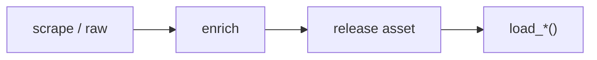

# NHL dataset loaders



## Automation status

| Dataset | Release tag | Pipeline |
|---|---|---|
| `load_nhl_pbp` | [nhl_pbp_full](https://github.com/sportsdataverse/sportsdataverse-data/releases/tag/nhl_pbp_full) | — |
| `load_nhl_player_boxscore` | [nhl_player_boxscores](https://github.com/sportsdataverse/sportsdataverse-data/releases/tag/nhl_player_boxscores) | — |
| `load_nhl_schedule` | [nhl_schedules](https://github.com/sportsdataverse/sportsdataverse-data/releases/tag/nhl_schedules) | — |
| `load_nhl_team_boxscore` | [nhl_team_boxscores](https://github.com/sportsdataverse/sportsdataverse-data/releases/tag/nhl_team_boxscores) | — |
| `load_nhl_game_info` | [nhl_game_info](https://github.com/sportsdataverse/sportsdataverse-data/releases/tag/nhl_game_info) | — |
| `load_nhl_game_rosters` | [nhl_game_rosters](https://github.com/sportsdataverse/sportsdataverse-data/releases/tag/nhl_game_rosters) | — |
| `load_nhl_goalie_boxscores` | [nhl_goalie_boxscores](https://github.com/sportsdataverse/sportsdataverse-data/releases/tag/nhl_goalie_boxscores) | — |
| `load_nhl_linescore` | [nhl_linescore](https://github.com/sportsdataverse/sportsdataverse-data/releases/tag/nhl_linescore) | — |
| `load_nhl_officials` | [nhl_officials](https://github.com/sportsdataverse/sportsdataverse-data/releases/tag/nhl_officials) | — |
| `load_nhl_pbp_full` | [nhl_pbp_full](https://github.com/sportsdataverse/sportsdataverse-data/releases/tag/nhl_pbp_full) | — |
| `load_nhl_pbp_lite` | [nhl_pbp_lite](https://github.com/sportsdataverse/sportsdataverse-data/releases/tag/nhl_pbp_lite) | — |
| `load_nhl_penalties` | [nhl_penalties](https://github.com/sportsdataverse/sportsdataverse-data/releases/tag/nhl_penalties) | — |
| `load_nhl_player_boxscores` | [nhl_player_boxscores](https://github.com/sportsdataverse/sportsdataverse-data/releases/tag/nhl_player_boxscores) | — |
| `load_nhl_rosters` | [nhl_rosters](https://github.com/sportsdataverse/sportsdataverse-data/releases/tag/nhl_rosters) | — |
| `load_nhl_schedules` | [nhl_schedules](https://github.com/sportsdataverse/sportsdataverse-data/releases/tag/nhl_schedules) | — |
| `load_nhl_scoring` | [nhl_scoring](https://github.com/sportsdataverse/sportsdataverse-data/releases/tag/nhl_scoring) | — |
| `load_nhl_scratches` | [nhl_scratches](https://github.com/sportsdataverse/sportsdataverse-data/releases/tag/nhl_scratches) | — |
| `load_nhl_shifts` | [nhl_shifts](https://github.com/sportsdataverse/sportsdataverse-data/releases/tag/nhl_shifts) | — |
| `load_nhl_shootout` | [nhl_shootout](https://github.com/sportsdataverse/sportsdataverse-data/releases/tag/nhl_shootout) | — |
| `load_nhl_shots_by_period` | [nhl_shots_by_period](https://github.com/sportsdataverse/sportsdataverse-data/releases/tag/nhl_shots_by_period) | — |
| `load_nhl_skater_boxscores` | [nhl_skater_boxscores](https://github.com/sportsdataverse/sportsdataverse-data/releases/tag/nhl_skater_boxscores) | — |
| `load_nhl_team_boxscores` | [nhl_team_boxscores](https://github.com/sportsdataverse/sportsdataverse-data/releases/tag/nhl_team_boxscores) | — |
| `load_nhl_three_stars` | [nhl_three_stars](https://github.com/sportsdataverse/sportsdataverse-data/releases/tag/nhl_three_stars) | — |

## `load_nhl_pbp`

Release: [nhl_pbp_full](https://github.com/sportsdataverse/sportsdataverse-data/releases/tag/nhl_pbp_full) · asset `https://github.com/sportsdataverse/sportsdataverse-data/releases/download/nhl_pbp_full/play_by_play_{season}.parquet`
### Returns

| col_name | type | description |
|---|---|---|
| `event_type` | String | Standardized event type code. |
| `event` | String | Event description label. |
| `secondary_type` | String | Secondary event type (e.g. shot type). |
| `event_team_abbr` | String | Abbreviation of the team credited with the event. |
| `event_team_type` | String | Whether the event team is home or away. |
| `description` | String | Full text description of the event. |
| `period` | Int64 | Period number. |
| `period_type` | String | Period type (REG/OT/SO). |
| `period_time` | String | Elapsed time in the period (MM:SS). |
| `period_seconds` | Int64 | Elapsed seconds in the period. |
| `period_seconds_remaining` | Int64 | Seconds remaining in the period. |
| `period_time_remaining` | String | Time remaining in the period (MM:SS). |
| `game_seconds` | Int64 | Elapsed seconds in the game. |
| `game_seconds_remaining` | Int64 | Seconds remaining in regulation. |
| `home_score` | Int64 | Home team final score. |
| `away_score` | Int64 | Away team final score. |
| `event_player_1_name` | String | Name of the primary event player. |
| `event_player_1_type` | String | Role of the primary event player. |
| `event_player_1_id` | Int64 | Player id of the primary event player. |
| `event_player_2_name` | String | Name of the secondary event player. |
| `event_player_2_type` | String | Role of the secondary event player. |
| `event_player_2_id` | Int64 | Player id of the secondary event player. |
| `event_player_3_name` | String | Name of the tertiary event player. |
| `event_player_3_type` | String | Role of the tertiary event player. |
| `event_player_3_id` | Int64 | Player ID of the tertiary event player. |
| `event_goalie_name` | String | Name of the goalie on the event. |
| `event_goalie_id` | Int64 | Player id of the goalie on the event. |
| `penalty_severity` | String | Severity of the penalty. |
| `penalty_minutes` | Int64 | Penalty minutes. |
| `empty_net` | Boolean | Whether the net was empty. |
| `extra_attacker` | Boolean | Whether an extra attacker was on the ice. |
| `x` | Int64 | Raw x-coordinate of the event. |
| `y` | Int64 | Raw y-coordinate of the event. |
| `x_fixed` | Int64 | Normalized x coordinate (home shoots right). |
| `y_fixed` | Int64 | Normalized y coordinate (home shoots right). |
| `shot_distance` | Float64 | Distance of the shot from the net. |
| `shot_angle` | Float64 | Angle of the shot relative to the net. |
| `home_skaters` | Int64 | Number of home skaters on the ice. |
| `away_skaters` | Int64 | Number of away skaters on the ice. |
| `players_on` | String | Names of players coming on. |
| `players_off` | String | Names of players going off. |
| `game_id` | Int64 | Unique game identifier. |
| `season` | String | Season year (echoed from arg). |
| `season_type` | String | Season type code (echoed from arg). |
| `home_abbr` | String | Home team abbreviation. |
| `away_abbr` | String | Away team abbreviation. |
| `event_idx` | Int64 | Sequential event index within the game. |
| `event_id` | Int64 | ESPN event id (echoed from arg). |
| `away_goalie_in` | Int64 | Whether the away goalie is on the ice (1/0). |
| `home_goalie_in` | Int64 | Whether the home goalie is on the ice (1/0). |
| `reason` | String | Reason for the event (e.g. stoppage reason). |
| `secondaryReason` | String | Secondary reason for a stoppage. |
| `xg` | Float64 | Expected goals value for the shot event. |
| `strength_state` | String | Strength state (e.g. 5v5, 5v4). |
| `strength_code` | String | Strength state code (e.g., all, even, pp, pk). |
| `strength` | String | Strength label (Even, Power Play, Shorthanded). |
| `home_on_1` | String | Name of home skater 1 on the ice. |
| `home_on_2` | String | Name of home skater 2 on the ice. |
| `home_on_3` | String | Name of home skater 3 on the ice. |
| `home_on_4` | String | Name of home skater 4 on the ice. |
| `home_on_5` | String | Name of home skater 5 on the ice. |
| `home_on_6` | String | Name of home skater 6 on the ice. |
| `home_on_7` | String | Name of home skater 7 on the ice. |
| `away_on_1` | String | Name of away skater 1 on the ice. |
| `away_on_2` | String | Name of away skater 2 on the ice. |
| `away_on_3` | String | Name of away skater 3 on the ice. |
| `away_on_4` | String | Name of away skater 4 on the ice. |
| `away_on_5` | String | Name of away skater 5 on the ice. |
| `away_on_6` | String | Name of away skater 6 on the ice. |
| `away_on_7` | String | Name of away skater 7 on the ice. |
| `home_goalie` | String | Name of the home goalie on the ice. |
| `away_goalie` | String | Name of the away goalie on the ice. |
| `num_on` | Int64 | Number of players coming on (line change). |
| `num_off` | Int64 | Number of players going off (line change). |
| `ids_on` | String | Player ids coming on. |
| `ids_off` | String | Player ids going off. |
| `home_on_1_id` | Int64 | Player id of home skater 1 on the ice. |
| `away_on_1_id` | Int64 | Player id of away skater 1 on the ice. |
| `home_on_2_id` | Int64 | Player id of home skater 2 on the ice. |
| `away_on_2_id` | Int64 | Player id of away skater 2 on the ice. |
| `home_on_3_id` | Int64 | Player id of home skater 3 on the ice. |
| `away_on_3_id` | Int64 | Player id of away skater 3 on the ice. |
| `home_on_4_id` | Int64 | Player id of home skater 4 on the ice. |
| `away_on_4_id` | Int64 | Player id of away skater 4 on the ice. |
| `home_on_5_id` | Int64 | Player id of home skater 5 on the ice. |
| `away_on_5_id` | Int64 | Player id of away skater 5 on the ice. |
| `home_on_6_id` | Int64 | Player id of home skater 6 on the ice. |
| `away_on_6_id` | Int64 | Player id of away skater 6 on the ice. |
| `home_on_7_id` | Int64 | Player id of home skater 7 on the ice. |
| `away_on_7_id` | Int64 | Player id of away skater 7 on the ice. |
| `home_goalie_id` | Int64 | Player ID of the home goalie on the ice. |
| `away_goalie_id` | Int64 | Player ID of the away goalie on the ice. |
| `pptReplayUrl` | String | URL to the play replay, if available. |
| `game_date` | String | Game date. |

```python
load_nhl_pbp(seasons=2024)
```

## `load_nhl_player_boxscore`

Release: [nhl_player_boxscores](https://github.com/sportsdataverse/sportsdataverse-data/releases/tag/nhl_player_boxscores) · asset `https://github.com/sportsdataverse/sportsdataverse-data/releases/download/nhl_player_boxscores/player_box_{season}.parquet`
### Returns

| col_name | type | description |
|---|---|---|
| `home_away` | String | Home or away indicator. |
| `team_id` | Int64 | Unique team identifier. |
| `team_abbrev` | String | Team abbreviation. |
| `player_id` | Int64 | Unique player identifier. |
| `player_name` | String | Player name. |
| `sweater_number` | Int64 | Jersey number. |
| `position` | String | Player position. |
| `goals` | Int64 | Goals scored. |
| `assists` | Int64 | Assists. |
| `points` | Int64 | Total points (goals + assists). |
| `plus_minus` | Int64 | Plus/minus rating. |
| `pim` | Int64 | Penalty minutes. |
| `hits` | Int64 | Hits. |
| `power_play_goals` | Int64 | Power-play goals. |
| `shots_on_goal` | Int64 | Shots on goal. |
| `faceoff_winning_pctg` | Float64 | Faceoff win percentage. |
| `toi` | String | Time on ice. |
| `blocked_shots` | Int64 | Blocked shots. |
| `shifts` | Int64 | Number of shifts. |
| `giveaways` | Int64 | Giveaways. |
| `takeaways` | Int64 | Takeaways. |
| `even_strength_shots_against` | String | Even-strength shots against (saves/total). |
| `power_play_shots_against` | String | Power-play shots against (saves/total). |
| `shorthanded_shots_against` | String | Shorthanded shots against (saves/total). |
| `save_shots_against` | String | Total shots against (saves/total). |
| `save_pctg` | Float64 | Save percentage. |
| `even_strength_goals_against` | Int64 | Even-strength goals against. |
| `power_play_goals_against` | Int64 | Power-play goals against. |
| `shorthanded_goals_against` | Int64 | Shorthanded goals against. |
| `goals_against` | Int64 | Goals against. |
| `starter` | Boolean | Whether the goalie started the game. |
| `decision` | String | Goalie decision (W/L/O). |
| `shots_against` | Int64 | Shots faced. |
| `saves` | Int64 | Saves made. |
| `game_id` | Int64 | Unique game identifier. |
| `season` | Int64 | Season year (echoed from arg). |
| `game_date` | String | Game date. |

```python
load_nhl_player_boxscore(seasons=2024)
```

## `load_nhl_schedule`

Release: [nhl_schedules](https://github.com/sportsdataverse/sportsdataverse-data/releases/tag/nhl_schedules) · asset `https://github.com/sportsdataverse/sportsdataverse-data/releases/download/nhl_schedules/nhl_schedule_{season}.parquet`
### Returns

| col_name | type | description |
|---|---|---|
| `game_id` | Int32 | Unique game identifier. |
| `season_full` | String | Full season label (e.g. 20212022). |
| `game_type` | String | Game type the row belongs to. |
| `game_date` | String | Game date. |
| `game_time` | String | Scheduled start time of the game. |
| `home_team_abbr` | String | Home team abbreviation. |
| `away_team_abbr` | String | Away team abbreviation. |
| `home_team_name` | String | Home team name. |
| `away_team_name` | String | Away team name. |
| `home_score` | Int32 | Home team final score. |
| `away_score` | Int32 | Away team final score. |
| `game_state` | String | Game state (e.g., FINAL, LIVE). |
| `venue` | String | Venue where the game was played. |
| `season` | Int32 | Season year (echoed from arg). |
| `game_json` | Boolean | Whether processed game JSON is available. |
| `game_json_url` | String | URL to the processed game JSON. |
| `PBP` | Boolean | Whether play-by-play data is available. |
| `team_box` | Boolean | Whether team box score data is available. |
| `player_box` | Boolean | Whether player box score data is available. |
| `series_letter` | String | Playoff series identifier letter, populated only for postseason games (88 of 1,400 rows in 2024) and null for the regular season. |
| `playoff_round` | Int32 | Playoff round identifier. |
| `series_game_number` | Int32 | Series game number. |
| `skater_box` | Boolean | Whether skater box data is available. |
| `goalie_box` | Boolean | Whether goalie box data is available. |
| `game_info` | Boolean | Whether game info data is available. |
| `game_rosters` | Boolean | Whether game rosters data is available. |
| `scoring` | Boolean | TRUE when the play results in a score (TD, FG, safety, two-point conversion). |
| `penalties` | Boolean | Penalty count. |
| `scratches` | Boolean | True when the source game record carried a scratches block for the game. |
| `linescore` | Boolean | CONSTANT: true on every published row, so it carries no information as shipped. It marks that a linescore block existed on the source game record. |
| `three_stars` | Boolean | Whether three stars data is available. |
| `shifts` | Boolean | Number of shifts. |
| `officials` | Boolean | Whether officials data is available. |
| `shots_by_period` | Boolean | Whether shots-by-period data is available. |
| `shootout` | Boolean | Whether shootout data is available. |

```python
load_nhl_schedule(seasons=2024)
```

## `load_nhl_team_boxscore`

Release: [nhl_team_boxscores](https://github.com/sportsdataverse/sportsdataverse-data/releases/tag/nhl_team_boxscores) · asset `https://github.com/sportsdataverse/sportsdataverse-data/releases/download/nhl_team_boxscores/team_box_{season}.parquet`
### Returns

| col_name | type | description |
|---|---|---|
| `home_away` | String | Home or away indicator. |
| `team_id` | Int64 | Unique team identifier. |
| `team_abbrev` | String | Team abbreviation. |
| `team_name` | String | Team name. |
| `goals` | Int64 | Goals scored. |
| `shots_on_goal` | Int64 | Shots on goal. |
| `pim` | Int64 | Penalty minutes. |
| `hits` | Int64 | Hits. |
| `blocked_shots` | Int64 | Blocked shots. |
| `giveaways` | Int64 | Giveaways. |
| `takeaways` | Int64 | Takeaways. |
| `power_play_goals` | Int64 | Power-play goals. |
| `faceoff_win_pctg` | Float64 | Faceoff win percentage. |
| `saves` | Int64 | Saves made. |
| `save_pctg` | Float64 | Save percentage. |
| `goals_against` | Int64 | Goals against. |
| `game_id` | Int64 | Unique game identifier. |
| `season` | Int64 | Season year (echoed from arg). |
| `game_date` | String | Game date. |

```python
load_nhl_team_boxscore(seasons=2024)
```

## `load_nhl_game_info`

Release: [nhl_game_info](https://github.com/sportsdataverse/sportsdataverse-data/releases/tag/nhl_game_info) · asset `https://github.com/sportsdataverse/sportsdataverse-data/releases/download/nhl_game_info/game_info_{season}.parquet`
### Returns

| col_name | type | description |
|---|---|---|
| `game_id` | Int32 | Unique game identifier. |
| `season` | Int32 | Season year (echoed from arg). |
| `game_type` | String | Game type the row belongs to. |
| `game_date` | String | Game date. |
| `venue` | String | Venue where the game was played. |
| `home_team_abbr` | String | Home team abbreviation. |
| `away_team_abbr` | String | Away team abbreviation. |
| `home_score` | Int32 | Home team final score. |
| `away_score` | Int32 | Away team final score. |
| `game_state` | String | Game state (e.g., FINAL, LIVE). |

```python
load_nhl_game_info(seasons=2024)
```

## `load_nhl_game_rosters`

Release: [nhl_game_rosters](https://github.com/sportsdataverse/sportsdataverse-data/releases/tag/nhl_game_rosters) · asset `https://github.com/sportsdataverse/sportsdataverse-data/releases/download/nhl_game_rosters/game_rosters_{season}.parquet`
### Returns

| col_name | type | description |
|---|---|---|
| `player_id` | Int32 | Unique player identifier. |
| `full_name` | String | Player full name. |
| `first_name` | String | Player first name. |
| `last_name` | String | Player last name. |
| `team_abbr` | String | Team abbreviation. |
| `team_id` | Int32 | Unique team identifier. |
| `position_code` | String | Player position code. |
| `sweater_number` | Int32 | Jersey number. |
| `game_id` | Int32 | Unique game identifier. |
| `season` | Int32 | Season year (echoed from arg). |
| `game_date` | String | Game date. |

```python
load_nhl_game_rosters(seasons=2024)
```

## `load_nhl_goalie_boxscores`

Release: [nhl_goalie_boxscores](https://github.com/sportsdataverse/sportsdataverse-data/releases/tag/nhl_goalie_boxscores) · asset `https://github.com/sportsdataverse/sportsdataverse-data/releases/download/nhl_goalie_boxscores/goalie_box_{season}.parquet`
### Returns

| col_name | type | description |
|---|---|---|
| `home_away` | String | Home or away indicator. |
| `team_id` | Int32 | Unique team identifier. |
| `team_abbrev` | String | Team abbreviation. |
| `player_id` | Int32 | Unique player identifier. |
| `player_name` | String | Player name. |
| `sweater_number` | Int32 | Jersey number. |
| `even_strength_shots_against` | String | Even-strength shots against (saves/total). |
| `power_play_shots_against` | String | Power-play shots against (saves/total). |
| `shorthanded_shots_against` | String | Shorthanded shots against (saves/total). |
| `save_shots_against` | String | Total shots against (saves/total). |
| `save_pctg` | Float64 | Save percentage. |
| `even_strength_goals_against` | Int32 | Even-strength goals against. |
| `power_play_goals_against` | Int32 | Power-play goals against. |
| `shorthanded_goals_against` | Int32 | Shorthanded goals against. |
| `pim` | Int32 | Penalty minutes. |
| `goals_against` | Int32 | Goals against. |
| `toi` | String | Time on ice. |
| `starter` | Boolean | Whether the goalie started the game. |
| `decision` | String | Goalie decision (W/L/O). |
| `shots_against` | Int32 | Shots faced. |
| `saves` | Int32 | Saves made. |
| `game_id` | Int32 | Unique game identifier. |
| `season` | Int32 | Season year (echoed from arg). |
| `game_date` | String | Game date. |

```python
load_nhl_goalie_boxscores(seasons=2024)
```

## `load_nhl_linescore`

Release: [nhl_linescore](https://github.com/sportsdataverse/sportsdataverse-data/releases/tag/nhl_linescore) · asset `https://github.com/sportsdataverse/sportsdataverse-data/releases/download/nhl_linescore/linescore_{season}.parquet`
### Returns

| col_name | type | description |
|---|---|---|
| `game_id` | Int32 | Unique game identifier. |
| `home_team_id` | Int32 | Home team identifier. |
| `home_team_abbr` | String | Home team abbreviation. |
| `home_goals` | Int32 | Home goals in the period. |
| `home_shots` | Int32 | Home team shots in the period. |
| `away_team_id` | Int32 | Away team identifier. |
| `away_team_abbr` | String | Away team abbreviation. |
| `away_goals` | Int32 | Away goals in the period. |
| `away_shots` | Int32 | Away team shots in the period. |
| `has_shootout` | Boolean | Flag for whether the game went to shootout. |

```python
load_nhl_linescore(seasons=2024)
```

## `load_nhl_officials`

Release: [nhl_officials](https://github.com/sportsdataverse/sportsdataverse-data/releases/tag/nhl_officials) · asset `https://github.com/sportsdataverse/sportsdataverse-data/releases/download/nhl_officials/officials_{season}.parquet`
### Returns

| col_name | type | description |
|---|---|---|
| `role` | String | Grouped official role (Referee/Linesperson). |
| `name` | String | Team mascot name. |
| `game_id` | Int32 | Unique game identifier. |
| `season` | Int32 | Season year (echoed from arg). |
| `game_date` | String | Game date. |

```python
load_nhl_officials(seasons=2025)
```

## `load_nhl_pbp_full`

Release: [nhl_pbp_full](https://github.com/sportsdataverse/sportsdataverse-data/releases/tag/nhl_pbp_full) · asset `https://github.com/sportsdataverse/sportsdataverse-data/releases/download/nhl_pbp_full/play_by_play_{season}.parquet`
### Returns

| col_name | type | description |
|---|---|---|
| `event_type` | String | Standardized event type code. |
| `event` | String | Event description label. |
| `secondary_type` | String | Secondary event type (e.g. shot type). |
| `event_team_abbr` | String | Abbreviation of the team credited with the event. |
| `event_team_type` | String | Whether the event team is home or away. |
| `description` | String | Full text description of the event. |
| `period` | Int32 | Period number. |
| `period_type` | String | Period type (REG/OT/SO). |
| `period_time` | String | Elapsed time in the period (MM:SS). |
| `period_seconds` | Int32 | Elapsed seconds in the period. |
| `period_seconds_remaining` | Int32 | Seconds remaining in the period. |
| `period_time_remaining` | String | Time remaining in the period (MM:SS). |
| `game_seconds` | Int32 | Elapsed seconds in the game. |
| `game_seconds_remaining` | Int32 | Seconds remaining in regulation. |
| `home_score` | Int32 | Home team final score. |
| `away_score` | Int32 | Away team final score. |
| `event_player_1_name` | String | Name of the primary event player. |
| `event_player_1_type` | String | Role of the primary event player. |
| `event_player_1_id` | Int32 | Player id of the primary event player. |
| `event_player_2_name` | String | Name of the secondary event player. |
| `event_player_2_type` | String | Role of the secondary event player. |
| `event_player_2_id` | Int32 | Player id of the secondary event player. |
| `event_player_3_name` | String | Name of the tertiary event player. |
| `event_player_3_type` | String | Role of the tertiary event player. |
| `event_player_3_id` | Int32 | Player ID of the tertiary event player. |
| `event_goalie_name` | String | Name of the goalie on the event. |
| `event_goalie_id` | Int32 | Player id of the goalie on the event. |
| `penalty_severity` | String | Severity of the penalty. |
| `penalty_minutes` | Int32 | Penalty minutes. |
| `empty_net` | Boolean | Whether the net was empty. |
| `extra_attacker` | Boolean | Whether an extra attacker was on the ice. |
| `x` | Int32 | Raw x-coordinate of the event. |
| `y` | Int32 | Raw y-coordinate of the event. |
| `x_fixed` | Int32 | Normalized x coordinate (home shoots right). |
| `y_fixed` | Int32 | Normalized y coordinate (home shoots right). |
| `shot_distance` | Float64 | Distance of the shot from the net. |
| `shot_angle` | Float64 | Angle of the shot relative to the net. |
| `home_skaters` | Int32 | Number of home skaters on the ice. |
| `away_skaters` | Int32 | Number of away skaters on the ice. |
| `players_on` | Boolean | Names of players coming on. |
| `players_off` | Boolean | Names of players going off. |
| `game_id` | Int32 | Unique game identifier. |
| `season` | Int32 | Season year (echoed from arg). |
| `season_type` | String | Season type code (echoed from arg). |
| `home_abbr` | String | Home team abbreviation. |
| `away_abbr` | String | Away team abbreviation. |
| `event_idx` | Int32 | Sequential event index within the game. |
| `event_id` | Int32 | ESPN event id (echoed from arg). |
| `away_goalie_in` | Int32 | Whether the away goalie is on the ice (1/0). |
| `home_goalie_in` | Int32 | Whether the home goalie is on the ice (1/0). |
| `reason` | String | Reason for the event (e.g. stoppage reason). |
| `secondaryReason` | String | Secondary reason for a stoppage. |
| `xg` | Float64 | Expected goals value for the shot event. |

```python
load_nhl_pbp_full(seasons=2010)
```

## `load_nhl_pbp_lite`

Release: [nhl_pbp_lite](https://github.com/sportsdataverse/sportsdataverse-data/releases/tag/nhl_pbp_lite) · asset `https://github.com/sportsdataverse/sportsdataverse-data/releases/download/nhl_pbp_lite/play_by_play_{season}_lite.parquet`
### Returns

| col_name | type | description |
|---|---|---|
| `event_type` | String | Standardized event type code. |
| `event` | String | Event description label. |
| `secondary_type` | String | Secondary event type (e.g. shot type). |
| `event_team_abbr` | String | Abbreviation of the team credited with the event. |
| `event_team_type` | String | Whether the event team is home or away. |
| `description` | String | Full text description of the event. |
| `period` | Int32 | Period number. |
| `period_type` | String | Period type (REG/OT/SO). |
| `period_time` | String | Elapsed time in the period (MM:SS). |
| `period_seconds` | Int32 | Elapsed seconds in the period. |
| `period_seconds_remaining` | Int32 | Seconds remaining in the period. |
| `period_time_remaining` | String | Time remaining in the period (MM:SS). |
| `game_seconds` | Int32 | Elapsed seconds in the game. |
| `game_seconds_remaining` | Int32 | Seconds remaining in regulation. |
| `home_score` | Int32 | Home team final score. |
| `away_score` | Int32 | Away team final score. |
| `event_player_1_name` | String | Name of the primary event player. |
| `event_player_1_type` | String | Role of the primary event player. |
| `event_player_1_id` | Int32 | Player id of the primary event player. |
| `event_player_2_name` | String | Name of the secondary event player. |
| `event_player_2_type` | String | Role of the secondary event player. |
| `event_player_2_id` | Int32 | Player id of the secondary event player. |
| `event_player_3_name` | String | Name of the tertiary event player. |
| `event_player_3_type` | String | Role of the tertiary event player. |
| `event_player_3_id` | Int32 | Player ID of the tertiary event player. |
| `event_goalie_name` | String | Name of the goalie on the event. |
| `event_goalie_id` | Int32 | Player id of the goalie on the event. |
| `penalty_severity` | String | Severity of the penalty. |
| `penalty_minutes` | Int32 | Penalty minutes. |
| `empty_net` | Boolean | Whether the net was empty. |
| `extra_attacker` | Boolean | Whether an extra attacker was on the ice. |
| `x` | Int32 | Raw x-coordinate of the event. |
| `y` | Int32 | Raw y-coordinate of the event. |
| `x_fixed` | Int32 | Normalized x coordinate (home shoots right). |
| `y_fixed` | Int32 | Normalized y coordinate (home shoots right). |
| `shot_distance` | Float64 | Distance of the shot from the net. |
| `shot_angle` | Float64 | Angle of the shot relative to the net. |
| `home_skaters` | Int32 | Number of home skaters on the ice. |
| `away_skaters` | Int32 | Number of away skaters on the ice. |
| `players_on` | Boolean | Names of players coming on. |
| `players_off` | Boolean | Names of players going off. |
| `game_id` | Int32 | Unique game identifier. |
| `season` | Int32 | Season year (echoed from arg). |
| `season_type` | String | Season type code (echoed from arg). |
| `home_abbr` | String | Home team abbreviation. |
| `away_abbr` | String | Away team abbreviation. |
| `event_idx` | Int32 | Sequential event index within the game. |
| `event_id` | Int32 | ESPN event id (echoed from arg). |
| `away_goalie_in` | Int32 | Whether the away goalie is on the ice (1/0). |
| `home_goalie_in` | Int32 | Whether the home goalie is on the ice (1/0). |
| `reason` | String | Reason for the event (e.g. stoppage reason). |
| `secondaryReason` | String | Secondary reason for a stoppage. |
| `xg` | Float64 | Expected goals value for the shot event. |

```python
load_nhl_pbp_lite(seasons=2010)
```

## `load_nhl_penalties`

Release: [nhl_penalties](https://github.com/sportsdataverse/sportsdataverse-data/releases/tag/nhl_penalties) · asset `https://github.com/sportsdataverse/sportsdataverse-data/releases/download/nhl_penalties/penalties_{season}.parquet`
### Returns

| col_name | type | description |
|---|---|---|
| `timeInPeriod` | String | Time within the period the penalty occurred. |
| `type` | String | Competitor type (e.g. "team"). |
| `duration` | Int32 | Penalty duration in minutes. |
| `descKey` | String | Penalty description key. |
| `game_id` | Int32 | Unique game identifier. |
| `period_number` | Int32 | Period number (1-3 regulation, 4+ OT). |
| `period_type` | String | Period type (REG/OT/SO). |
| `committedByPlayer.sweaterNumber` | Int32 | Jersey number of the penalized player on the play. |
| `committedByPlayer.firstName.default` | String | Given name of the penalized player as published in the NHL feed's default English locale. |
| `committedByPlayer.firstName.cs` | String | Alternate given name for the penalized player under the NHL feed's Czech key. Verified against the data it is frequently a different name form rather than a re-spelling (Joshua published as Josh, Aliaksei as Alexei), so it is not a reliable transliteration of the default. |
| `committedByPlayer.firstName.de` | String | Alternate given name for the penalized player under the NHL feed's German key. Verified against the data it is frequently a different name form rather than a re-spelling (Joshua published as Josh, Aliaksei as Alexei), so it is not a reliable transliteration of the default. |
| `committedByPlayer.firstName.es` | String | Alternate given name for the penalized player under the NHL feed's Spanish key. Verified against the data it is frequently a different name form rather than a re-spelling (Joshua published as Josh, Aliaksei as Alexei), so it is not a reliable transliteration of the default. |
| `committedByPlayer.firstName.fi` | String | Alternate given name for the penalized player under the NHL feed's Finnish key. Verified against the data it is frequently a different name form rather than a re-spelling (Joshua published as Josh, Aliaksei as Alexei), so it is not a reliable transliteration of the default. |
| `committedByPlayer.firstName.sk` | String | Alternate given name for the penalized player under the NHL feed's Slovak key. Verified against the data it is frequently a different name form rather than a re-spelling (Joshua published as Josh, Aliaksei as Alexei), so it is not a reliable transliteration of the default. |
| `committedByPlayer.firstName.sv` | String | Alternate given name for the penalized player under the NHL feed's Swedish key. Verified against the data it is frequently a different name form rather than a re-spelling (Joshua published as Josh, Aliaksei as Alexei), so it is not a reliable transliteration of the default. |
| `committedByPlayer.firstName.fr` | String | Alternate given name for the penalized player under the NHL feed's French key. Verified against the data it is frequently a different name form rather than a re-spelling (Joshua published as Josh, Aliaksei as Alexei), so it is not a reliable transliteration of the default. |
| `committedByPlayer.lastName.default` | String | Family name of the penalized player as published in the NHL feed's default English locale. |
| `committedByPlayer.lastName.cs` | String | Alternate rendering of the family name published under the NHL feed's Czech key. It differs from the default in orthography -- usually restoring diacritics the default folds to ASCII, though for some names it strips them instead -- so treat it as an alternate spelling, not a canonical one. |
| `committedByPlayer.lastName.fi` | String | Alternate rendering of the family name published under the NHL feed's Finnish key. It differs from the default in orthography -- usually restoring diacritics the default folds to ASCII, though for some names it strips them instead -- so treat it as an alternate spelling, not a canonical one. |
| `committedByPlayer.lastName.sk` | String | Alternate rendering of the family name published under the NHL feed's Slovak key. It differs from the default in orthography -- usually restoring diacritics the default folds to ASCII, though for some names it strips them instead -- so treat it as an alternate spelling, not a canonical one. |
| `committedByPlayer.lastName.sv` | String | Alternate rendering of the family name published under the NHL feed's Swedish key. It differs from the default in orthography -- usually restoring diacritics the default folds to ASCII, though for some names it strips them instead -- so treat it as an alternate spelling, not a canonical one. |
| `committedByPlayer.lastName.de` | String | Alternate rendering of the penalized player's family name under the NHL feed's German key. It differs from the default in orthography -- usually restoring diacritics the default folds to ASCII, though for some names it strips them instead -- so treat it as an alternate spelling, not a canonical one. |
| `committedByPlayer.lastName.es` | String | Alternate rendering of the penalized player's family name under the NHL feed's Spanish key. It differs from the default in orthography -- usually restoring diacritics the default folds to ASCII, though for some names it strips them instead -- so treat it as an alternate spelling, not a canonical one. |
| `committedByPlayer.lastName.fr` | String | Alternate rendering of the penalized player's family name under the NHL feed's French key. It differs from the default in orthography -- usually restoring diacritics the default folds to ASCII, though for some names it strips them instead -- so treat it as an alternate spelling, not a canonical one. |
| `teamAbbrev.default` | String | Three-letter code of the team charged with the penalty, matching the committing player's boxscore team rather than the team that drew it. |
| `drawnBy.sweaterNumber` | Int32 | Jersey number of the opposing player credited with drawing the infraction; null whenever no victim is credited, as on all bench and game-misconduct penalties. |
| `drawnBy.firstName.default` | String | Given name, in the feed's default English locale, of the opposing player credited with drawing the penalty. |
| `drawnBy.firstName.cs` | String | Alternate given name for the opposing player credited with drawing the penalty under the NHL feed's Czech key. Verified against the data it is frequently a different name form rather than a re-spelling (Joshua published as Josh, Aliaksei as Alexei), so it is not a reliable transliteration of the default. |
| `drawnBy.firstName.fi` | String | Alternate given name for the opposing player credited with drawing the penalty under the NHL feed's Finnish key. Verified against the data it is frequently a different name form rather than a re-spelling (Joshua published as Josh, Aliaksei as Alexei), so it is not a reliable transliteration of the default. |
| `drawnBy.firstName.sk` | String | Alternate given name for the opposing player credited with drawing the penalty under the NHL feed's Slovak key. Verified against the data it is frequently a different name form rather than a re-spelling (Joshua published as Josh, Aliaksei as Alexei), so it is not a reliable transliteration of the default. |
| `drawnBy.firstName.de` | String | Alternate given name for the opposing player credited with drawing the penalty under the NHL feed's German key. Verified against the data it is frequently a different name form rather than a re-spelling (Joshua published as Josh, Aliaksei as Alexei), so it is not a reliable transliteration of the default. |
| `drawnBy.firstName.es` | String | Alternate given name for the opposing player credited with drawing the penalty under the NHL feed's Spanish key. Verified against the data it is frequently a different name form rather than a re-spelling (Joshua published as Josh, Aliaksei as Alexei), so it is not a reliable transliteration of the default. |
| `drawnBy.firstName.sv` | String | Alternate given name for the opposing player credited with drawing the penalty under the NHL feed's Swedish key. Verified against the data it is frequently a different name form rather than a re-spelling (Joshua published as Josh, Aliaksei as Alexei), so it is not a reliable transliteration of the default. |
| `drawnBy.firstName.fr` | String | Alternate given name for the opposing player credited with drawing the penalty under the NHL feed's French key. Verified against the data it is frequently a different name form rather than a re-spelling (Joshua published as Josh, Aliaksei as Alexei), so it is not a reliable transliteration of the default. |
| `drawnBy.lastName.default` | String | Family name, in the feed's default English locale, of the opposing player credited with drawing the penalty. |
| `drawnBy.lastName.cs` | String | Alternate rendering of the family name published under the NHL feed's Czech key. It differs from the default in orthography -- usually restoring diacritics the default folds to ASCII, though for some names it strips them instead -- so treat it as an alternate spelling, not a canonical one. |
| `drawnBy.lastName.fi` | String | Alternate rendering of the family name published under the NHL feed's Finnish key. It differs from the default in orthography -- usually restoring diacritics the default folds to ASCII, though for some names it strips them instead -- so treat it as an alternate spelling, not a canonical one. |
| `drawnBy.lastName.sk` | String | Alternate rendering of the family name published under the NHL feed's Slovak key. It differs from the default in orthography -- usually restoring diacritics the default folds to ASCII, though for some names it strips them instead -- so treat it as an alternate spelling, not a canonical one. |
| `drawnBy.lastName.sv` | String | Alternate rendering of the family name published under the NHL feed's Swedish key. It differs from the default in orthography -- usually restoring diacritics the default folds to ASCII, though for some names it strips them instead -- so treat it as an alternate spelling, not a canonical one. |
| `drawnBy.lastName.de` | String | Alternate rendering of the opposing player credited with drawing the penalty's family name under the NHL feed's German key. It differs from the default in orthography -- usually restoring diacritics the default folds to ASCII, though for some names it strips them instead -- so treat it as an alternate spelling, not a canonical one. |
| `drawnBy.lastName.es` | String | Alternate rendering of the opposing player credited with drawing the penalty's family name under the NHL feed's Spanish key. It differs from the default in orthography -- usually restoring diacritics the default folds to ASCII, though for some names it strips them instead -- so treat it as an alternate spelling, not a canonical one. |
| `drawnBy.lastName.fr` | String | Alternate rendering of the opposing player credited with drawing the penalty's family name under the NHL feed's French key. It differs from the default in orthography -- usually restoring diacritics the default folds to ASCII, though for some names it strips them instead -- so treat it as an alternate spelling, not a canonical one. |
| `servedBy.default` | String | Abbreviated name, in the feed's default English locale, of the player serving the penalty. |
| `servedBy.cs` | String | Alternate abbreviated name (first initial plus family name) published under the NHL feed's Czech key, differing from the default by diacritics or by an alternate given-name form. |
| `servedBy.fi` | String | Alternate abbreviated name (first initial plus family name) published under the NHL feed's Finnish key, differing from the default by diacritics or by an alternate given-name form. |
| `servedBy.sk` | String | Alternate abbreviated name (first initial plus family name) published under the NHL feed's Slovak key, differing from the default by diacritics or by an alternate given-name form. |
| `servedBy.de` | String | Alternate abbreviated name (first initial plus family name) published under the NHL feed's German key, differing from the default by diacritics or by an alternate given-name form. |
| `servedBy.es` | String | Alternate abbreviated name (first initial plus family name) published under the NHL feed's Spanish key, differing from the default by diacritics or by an alternate given-name form. |
| `servedBy.sv` | String | Alternate abbreviated name (first initial plus family name) published under the NHL feed's Swedish key, differing from the default by diacritics or by an alternate given-name form. |

```python
load_nhl_penalties(seasons=2024)
```

## `load_nhl_player_boxscores`

Release: [nhl_player_boxscores](https://github.com/sportsdataverse/sportsdataverse-data/releases/tag/nhl_player_boxscores) · asset `https://github.com/sportsdataverse/sportsdataverse-data/releases/download/nhl_player_boxscores/player_box_{season}.parquet`
### Returns

| col_name | type | description |
|---|---|---|
| `home_away` | String | Home or away indicator. |
| `team_id` | Int32 | Unique team identifier. |
| `team_abbrev` | String | Team abbreviation. |
| `player_id` | Int32 | Unique player identifier. |
| `player_name` | String | Player name. |
| `sweater_number` | Int32 | Jersey number. |
| `position` | String | Player position. |
| `goals` | Int32 | Goals scored. |
| `assists` | Int32 | Assists. |
| `points` | Int32 | Total points (goals + assists). |
| `plus_minus` | Int32 | Plus/minus rating. |
| `pim` | Int32 | Penalty minutes. |
| `hits` | Int32 | Hits. |
| `power_play_goals` | Int32 | Power-play goals. |
| `shots_on_goal` | Int32 | Shots on goal. |
| `faceoff_winning_pctg` | Float64 | Faceoff win percentage. |
| `toi` | String | Time on ice. |
| `blocked_shots` | Int32 | Blocked shots. |
| `shifts` | Int32 | Number of shifts. |
| `giveaways` | Int32 | Giveaways. |
| `takeaways` | Int32 | Takeaways. |
| `even_strength_shots_against` | String | Even-strength shots against (saves/total). |
| `power_play_shots_against` | String | Power-play shots against (saves/total). |
| `shorthanded_shots_against` | String | Shorthanded shots against (saves/total). |
| `save_shots_against` | String | Total shots against (saves/total). |
| `save_pctg` | Float64 | Save percentage. |
| `even_strength_goals_against` | Int32 | Even-strength goals against. |
| `power_play_goals_against` | Int32 | Power-play goals against. |
| `shorthanded_goals_against` | Int32 | Shorthanded goals against. |
| `goals_against` | Int32 | Goals against. |
| `starter` | Boolean | Whether the goalie started the game. |
| `decision` | String | Goalie decision (W/L/O). |
| `shots_against` | Int32 | Shots faced. |
| `saves` | Int32 | Saves made. |

```python
load_nhl_player_boxscores(seasons=2010)
```

## `load_nhl_rosters`

Release: [nhl_rosters](https://github.com/sportsdataverse/sportsdataverse-data/releases/tag/nhl_rosters) · asset `https://github.com/sportsdataverse/sportsdataverse-data/releases/download/nhl_rosters/rosters_{season}.parquet`
### Returns

| col_name | type | description |
|---|---|---|
| `player_id` | Int32 | Unique player identifier. |
| `full_name` | String | Player full name. |
| `first_name` | String | Player first name. |
| `last_name` | String | Player last name. |
| `team_abbr` | String | Team abbreviation. |
| `team_id` | Int32 | Unique team identifier. |
| `position_code` | String | Player position code. |
| `sweater_number` | Int32 | Jersey number. |
| `season` | Int32 | Season year (echoed from arg). |

```python
load_nhl_rosters(seasons=2010)
```

## `load_nhl_schedules`

Release: [nhl_schedules](https://github.com/sportsdataverse/sportsdataverse-data/releases/tag/nhl_schedules) · asset `https://github.com/sportsdataverse/sportsdataverse-data/releases/download/nhl_schedules/nhl_schedule_{season}.parquet`
### Returns

| col_name | type | description |
|---|---|---|
| `game_id` | Int32 | Unique game identifier. |
| `season_full` | String | Full season label (e.g. 20212022). |
| `game_type` | String | Game type the row belongs to. |
| `game_date` | String | Game date. |
| `game_time` | String | Scheduled start time of the game. |
| `home_team_abbr` | String | Home team abbreviation. |
| `away_team_abbr` | String | Away team abbreviation. |
| `home_team_name` | String | Home team name. |
| `away_team_name` | String | Away team name. |
| `home_score` | Int32 | Home team final score. |
| `away_score` | Int32 | Away team final score. |
| `game_state` | String | Game state (e.g., FINAL, LIVE). |
| `venue` | String | Venue where the game was played. |
| `season` | Int32 | Season year (echoed from arg). |
| `game_json` | Boolean | Whether processed game JSON is available. |
| `game_json_url` | String | URL to the processed game JSON. |
| `PBP` | Boolean | Whether play-by-play data is available. |
| `team_box` | Boolean | Whether team box score data is available. |
| `player_box` | Boolean | Whether player box score data is available. |

```python
load_nhl_schedules(seasons=2010)
```

## `load_nhl_scoring`

Release: [nhl_scoring](https://github.com/sportsdataverse/sportsdataverse-data/releases/tag/nhl_scoring) · asset `https://github.com/sportsdataverse/sportsdataverse-data/releases/download/nhl_scoring/scoring_{season}.parquet`
### Returns

| col_name | type | description |
|---|---|---|
| `situationCode` | String | Strength/situation code for the goal. |
| `eventId` | Int32 | Event identifier within the game. |
| `strength` | String | Strength label (Even, Power Play, Shorthanded). |
| `playerId` | Int32 | Player identifier involved in the event. |
| `headshot` | String | URL to the player headshot image. |
| `highlightClipSharingUrl` | String | Shareable URL for the goal highlight clip. |
| `highlightClip` | Float64 | Highlight clip identifier. |
| `goalsToDate` | Int32 | Scorer goal total to date in the season. |
| `awayScore` | Int32 | Away team score after the goal. |
| `homeScore` | Int32 | Home team score after the goal. |
| `timeInPeriod` | String | Time within the period the penalty occurred. |
| `shotType` | String | Type of shot on the goal. |
| `goalModifier` | String | Goal modifier (e.g. empty-net, power-play). |
| `assists` | String | Assists. |
| `pptReplayUrl` | String | URL to the play replay, if available. |
| `homeTeamDefendingSide` | String | Side of the ice the home team is defending. |
| `isHome` | Boolean | Whether the scoring team is the home team. |
| `game_id` | Int32 | Unique game identifier. |
| `period_number` | Int32 | Period number (1-3 regulation, 4+ OT). |
| `period_type` | String | Period type (REG/OT/SO). |
| `highlightClipSharingUrlFr` | String | Shareable nhl.com URL for the French-language highlight clip; its trailing numeric segment is the same id carried in highlightClipFr. |
| `highlightClipFr` | Float64 | NHL video id of the French-language highlight clip for the goal. Stored as Float64 even though it is a whole 13-digit identifier, so cast before using it as a key. |
| `discreteClip` | Float64 | Discrete clip identifier. |
| `discreteClipFr` | Float64 | Numeric NHL video identifier of the French-language standalone clip of the goal, always a different asset id from discreteClip. |
| `firstName.default` | String | Given name of the goal scorer as rendered in the NHL feed's default English locale. |
| `firstName.cs` | String | Alternate given name for the player under the NHL feed's Czech key. Verified against the data it is frequently a different name form rather than a re-spelling (Joshua published as Josh, Aliaksei as Alexei), so it is not a reliable transliteration of the default. |
| `firstName.de` | String | Alternate given name for the player under the NHL feed's German key. Verified against the data it is frequently a different name form rather than a re-spelling (Joshua published as Josh, Aliaksei as Alexei), so it is not a reliable transliteration of the default. |
| `firstName.es` | String | Alternate given name for the player under the NHL feed's Spanish key. Verified against the data it is frequently a different name form rather than a re-spelling (Joshua published as Josh, Aliaksei as Alexei), so it is not a reliable transliteration of the default. |
| `firstName.fi` | String | Alternate given name for the player under the NHL feed's Finnish key. Verified against the data it is frequently a different name form rather than a re-spelling (Joshua published as Josh, Aliaksei as Alexei), so it is not a reliable transliteration of the default. |
| `firstName.sk` | String | Alternate given name for the player under the NHL feed's Slovak key. Verified against the data it is frequently a different name form rather than a re-spelling (Joshua published as Josh, Aliaksei as Alexei), so it is not a reliable transliteration of the default. |
| `firstName.sv` | String | Alternate given name for the player under the NHL feed's Swedish key. Verified against the data it is frequently a different name form rather than a re-spelling (Joshua published as Josh, Aliaksei as Alexei), so it is not a reliable transliteration of the default. |
| `firstName.fr` | String | Alternate given name for the player under the NHL feed's French key. Verified against the data it is frequently a different name form rather than a re-spelling (Joshua published as Josh, Aliaksei as Alexei), so it is not a reliable transliteration of the default. |
| `lastName.default` | String | Family name of the goal scorer as rendered in the NHL feed's default English locale. |
| `lastName.cs` | String | Alternate rendering of the family name published under the NHL feed's Czech key. It differs from the default in orthography -- usually restoring diacritics the default folds to ASCII, though for some names it strips them instead -- so treat it as an alternate spelling, not a canonical one. |
| `lastName.fi` | String | Alternate rendering of the family name published under the NHL feed's Finnish key. It differs from the default in orthography -- usually restoring diacritics the default folds to ASCII, though for some names it strips them instead -- so treat it as an alternate spelling, not a canonical one. |
| `lastName.sk` | String | Alternate rendering of the family name published under the NHL feed's Slovak key. It differs from the default in orthography -- usually restoring diacritics the default folds to ASCII, though for some names it strips them instead -- so treat it as an alternate spelling, not a canonical one. |
| `lastName.sv` | String | Alternate rendering of the family name published under the NHL feed's Swedish key. It differs from the default in orthography -- usually restoring diacritics the default folds to ASCII, though for some names it strips them instead -- so treat it as an alternate spelling, not a canonical one. |
| `lastName.de` | String | Alternate rendering of the player's family name under the NHL feed's German key. It differs from the default in orthography -- usually restoring diacritics the default folds to ASCII, though for some names it strips them instead -- so treat it as an alternate spelling, not a canonical one. |
| `lastName.es` | String | Alternate rendering of the player's family name under the NHL feed's Spanish key. It differs from the default in orthography -- usually restoring diacritics the default folds to ASCII, though for some names it strips them instead -- so treat it as an alternate spelling, not a canonical one. |
| `lastName.fr` | String | Alternate rendering of the family name published under the NHL feed's French key. It differs from the default in orthography -- usually restoring diacritics the default folds to ASCII, though for some names it strips them instead -- so treat it as an alternate spelling, not a canonical one. |
| `name.default` | String | Abbreviated name of the player as published in the NHL feed's default English locale. |
| `name.cs` | String | Alternate abbreviated name (first initial plus family name) published under the NHL feed's Czech key, differing from the default by diacritics or by an alternate given-name form. |
| `name.fi` | String | Alternate abbreviated name (first initial plus family name) published under the NHL feed's Finnish key, differing from the default by diacritics or by an alternate given-name form. |
| `name.sk` | String | Alternate abbreviated name (first initial plus family name) published under the NHL feed's Slovak key, differing from the default by diacritics or by an alternate given-name form. |
| `name.sv` | String | Alternate abbreviated name (first initial plus family name) published under the NHL feed's Swedish key, differing from the default by diacritics or by an alternate given-name form. |
| `name.de` | String | Alternate abbreviated name (first initial plus family name) published under the NHL feed's German key, differing from the default by diacritics or by an alternate given-name form. |
| `name.es` | String | Alternate abbreviated name (first initial plus family name) published under the NHL feed's Spanish key, differing from the default by diacritics or by an alternate given-name form. |
| `name.fr` | String | Alternate abbreviated name for the player under the NHL feed's French key, differing from the default by diacritics or by an alternate given-name form. |
| `teamAbbrev.default` | String | Three-letter code of the team that scored the goal, resolving to the home club exactly when isHome is true and to the visitor otherwise. |
| `leadingTeamAbbrev.default` | String | Three-letter code of the team ahead on the scoreboard immediately after this goal, null exactly when the goal tied the game and not always the scoring team. |

```python
load_nhl_scoring(seasons=2024)
```

## `load_nhl_scratches`

Release: [nhl_scratches](https://github.com/sportsdataverse/sportsdataverse-data/releases/tag/nhl_scratches) · asset `https://github.com/sportsdataverse/sportsdataverse-data/releases/download/nhl_scratches/scratches_{season}.parquet`
### Returns

| col_name | type | description |
|---|---|---|
| `id` | Int32 | Unique player identifier. |
| `firstName` | String | Scorer first name (localized list). |
| `lastName` | String | Scorer last name (localized list). |
| `game_id` | Int32 | Unique game identifier. |

```python
load_nhl_scratches(seasons=2024)
```

## `load_nhl_shifts`

Release: [nhl_shifts](https://github.com/sportsdataverse/sportsdataverse-data/releases/tag/nhl_shifts) · asset `https://github.com/sportsdataverse/sportsdataverse-data/releases/download/nhl_shifts/shifts_{season}.parquet`
### Returns

| col_name | type | description |
|---|---|---|
| `event_team` | String | Team associated with the shift change. |
| `period` | Int32 | Period number. |
| `period_time` | String | Elapsed time in the period (MM:SS). |
| `period_seconds` | Int32 | Elapsed seconds in the period. |
| `game_seconds` | Int32 | Elapsed seconds in the game. |
| `num_on` | Int32 | Number of players coming on (line change). |
| `players_on` | String | Names of players coming on. |
| `ids_on` | String | Player ids coming on. |
| `num_off` | Int32 | Number of players going off (line change). |
| `players_off` | String | Names of players going off. |
| `ids_off` | String | Player ids going off. |
| `event` | String | Event description label. |
| `event_type` | String | Standardized event type code. |
| `game_seconds_remaining` | Int32 | Seconds remaining in regulation. |
| `game_id` | Int32 | Unique game identifier. |
| `season` | Int32 | Season year (echoed from arg). |
| `game_date` | String | Game date. |

```python
load_nhl_shifts(seasons=2025)
```

## `load_nhl_shootout`

Release: [nhl_shootout](https://github.com/sportsdataverse/sportsdataverse-data/releases/tag/nhl_shootout) · asset `https://github.com/sportsdataverse/sportsdataverse-data/releases/download/nhl_shootout/shootout_summary_{season}.parquet`
### Returns

| col_name | type | description |
|---|---|---|
| `home` | Int32 | Whether the player's team was home. |
| `away` | Int32 | Away team shots in the period. |
| `sequence` | Int32 | Sequence order of the season row. |
| `playerId` | Int32 | Player identifier involved in the event. |
| `shotType` | String | Type of shot on the goal. |
| `result` | String | Attempt result (goal/save/miss). |
| `headshot` | String | URL to the player headshot image. |
| `gameWinner` | Boolean | True on the single attempt per shootout credited as the game-deciding goal, false on every other attempt and null on the per-game summary row. |
| `homeScore` | Int32 | Home team score after the goal. |
| `awayScore` | Int32 | Away team score after the goal. |
| `game_id` | Int32 | Unique game identifier. |
| `season` | Int32 | Season year (echoed from arg). |
| `game_date` | String | Game date. |
| `discreteClip` | Float64 | Discrete clip identifier. |
| `discreteClipFr` | Float64 | Numeric NHL video identifier of the French-language clip of the shootout attempt, distinct from the id in discreteClip. |
| `teamAbbrev.default` | String | Three-letter code of the shooting player's team; null on the per-game summary row that instead carries the home and away shootout goal totals. |
| `firstName.default` | String | Given name of the shooter in the feed's default English locale; null on the per-game summary row. |
| `firstName.cs` | String | Alternate given name published under the NHL feed's Czech key. Verified against the data it is frequently a different name form rather than a re-spelling (Joshua published as Josh, Aliaksei as Alexei), so it is not a reliable transliteration of the default. |
| `firstName.sk` | String | Alternate given name published under the NHL feed's Slovak key. Verified against the data it is frequently a different name form rather than a re-spelling (Joshua published as Josh, Aliaksei as Alexei), so it is not a reliable transliteration of the default. |
| `firstName.fi` | String | Alternate given name published under the NHL feed's Finnish key. Verified against the data it is frequently a different name form rather than a re-spelling (Joshua published as Josh, Aliaksei as Alexei), so it is not a reliable transliteration of the default. |
| `firstName.de` | String | Alternate given name published under the NHL feed's German key. Verified against the data it is frequently a different name form rather than a re-spelling (Joshua published as Josh, Aliaksei as Alexei), so it is not a reliable transliteration of the default. |
| `firstName.es` | String | Alternate given name published under the NHL feed's Spanish key. Verified against the data it is frequently a different name form rather than a re-spelling (Joshua published as Josh, Aliaksei as Alexei), so it is not a reliable transliteration of the default. |
| `firstName.sv` | String | Alternate given name published under the NHL feed's Swedish key. Verified against the data it is frequently a different name form rather than a re-spelling (Joshua published as Josh, Aliaksei as Alexei), so it is not a reliable transliteration of the default. |
| `lastName.default` | String | Family name of the shooter in the feed's default English locale; null on the per-game summary row. |
| `lastName.cs` | String | Alternate rendering of the family name published under the NHL feed's Czech key. It differs from the default in orthography -- usually restoring diacritics the default folds to ASCII, though for some names it strips them instead -- so treat it as an alternate spelling, not a canonical one. |
| `lastName.fi` | String | Alternate rendering of the family name published under the NHL feed's Finnish key. It differs from the default in orthography -- usually restoring diacritics the default folds to ASCII, though for some names it strips them instead -- so treat it as an alternate spelling, not a canonical one. |
| `lastName.sk` | String | Alternate rendering of the family name published under the NHL feed's Slovak key. It differs from the default in orthography -- usually restoring diacritics the default folds to ASCII, though for some names it strips them instead -- so treat it as an alternate spelling, not a canonical one. |
| `lastName.sv` | String | Alternate rendering of the family name published under the NHL feed's Swedish key. It differs from the default in orthography -- usually restoring diacritics the default folds to ASCII, though for some names it strips them instead -- so treat it as an alternate spelling, not a canonical one. |

```python
load_nhl_shootout(seasons=2025)
```

## `load_nhl_shots_by_period`

Release: [nhl_shots_by_period](https://github.com/sportsdataverse/sportsdataverse-data/releases/tag/nhl_shots_by_period) · asset `https://github.com/sportsdataverse/sportsdataverse-data/releases/download/nhl_shots_by_period/shots_by_period_{season}.parquet`
### Returns

| col_name | type | description |
|---|---|---|
| `away` | Int32 | Away team shots in the period. |
| `home` | Int32 | Whether the player's team was home. |
| `game_id` | Int32 | Unique game identifier. |
| `season` | Int32 | Season year (echoed from arg). |
| `game_date` | String | Game date. |
| `period` | Int32 | Period number. |
| `period_type` | String | Period type (REG/OT/SO). |
| `max_regulation_periods` | Int32 | Number of regulation periods the game format defines before overtime, constant at 3 for every row in the published seasons. |
| `ot_periods` | Int32 | Overtime period ordinal taken from the NHL period descriptor, populated only from the second overtime onward so period 5 rows carry 2 and all other rows are null. |

```python
load_nhl_shots_by_period(seasons=2025)
```

## `load_nhl_skater_boxscores`

Release: [nhl_skater_boxscores](https://github.com/sportsdataverse/sportsdataverse-data/releases/tag/nhl_skater_boxscores) · asset `https://github.com/sportsdataverse/sportsdataverse-data/releases/download/nhl_skater_boxscores/skater_box_{season}.parquet`
### Returns

| col_name | type | description |
|---|---|---|
| `home_away` | String | Home or away indicator. |
| `team_id` | Int32 | Unique team identifier. |
| `team_abbrev` | String | Team abbreviation. |
| `player_id` | Int32 | Unique player identifier. |
| `player_name` | String | Player name. |
| `sweater_number` | Int32 | Jersey number. |
| `position` | String | Player position. |
| `goals` | Int32 | Goals scored. |
| `assists` | Int32 | Assists. |
| `points` | Int32 | Total points (goals + assists). |
| `plus_minus` | Int32 | Plus/minus rating. |
| `pim` | Int32 | Penalty minutes. |
| `hits` | Int32 | Hits. |
| `power_play_goals` | Int32 | Power-play goals. |
| `shots_on_goal` | Int32 | Shots on goal. |
| `faceoff_winning_pctg` | Float64 | Faceoff win percentage. |
| `toi` | String | Time on ice. |
| `blocked_shots` | Int32 | Blocked shots. |
| `shifts` | Int32 | Number of shifts. |
| `giveaways` | Int32 | Giveaways. |
| `takeaways` | Int32 | Takeaways. |
| `game_id` | Int32 | Unique game identifier. |
| `season` | Int32 | Season year (echoed from arg). |
| `game_date` | String | Game date. |

```python
load_nhl_skater_boxscores(seasons=2024)
```

## `load_nhl_team_boxscores`

Release: [nhl_team_boxscores](https://github.com/sportsdataverse/sportsdataverse-data/releases/tag/nhl_team_boxscores) · asset `https://github.com/sportsdataverse/sportsdataverse-data/releases/download/nhl_team_boxscores/team_box_{season}.parquet`
### Returns

| col_name | type | description |
|---|---|---|
| `home_away` | String | Home or away indicator. |
| `team_id` | Int32 | Unique team identifier. |
| `team_abbrev` | String | Team abbreviation. |
| `team_name` | String | Team name. |
| `goals` | Int32 | Goals scored. |
| `shots_on_goal` | Int32 | Shots on goal. |
| `pim` | Int32 | Penalty minutes. |
| `hits` | Int32 | Hits. |
| `blocked_shots` | Int32 | Blocked shots. |
| `giveaways` | Int32 | Giveaways. |
| `takeaways` | Int32 | Takeaways. |
| `power_play_goals` | Int32 | Power-play goals. |
| `faceoff_win_pctg` | Float64 | Faceoff win percentage. |
| `saves` | Int32 | Saves made. |
| `save_pctg` | Float64 | Save percentage. |
| `goals_against` | Int32 | Goals against. |

```python
load_nhl_team_boxscores(seasons=2010)
```

## `load_nhl_three_stars`

Release: [nhl_three_stars](https://github.com/sportsdataverse/sportsdataverse-data/releases/tag/nhl_three_stars) · asset `https://github.com/sportsdataverse/sportsdataverse-data/releases/download/nhl_three_stars/three_stars_{season}.parquet`
### Returns

| col_name | type | description |
|---|---|---|
| `star` | Int32 | Star ranking (1, 2, or 3). |
| `playerId` | Int32 | Player identifier involved in the event. |
| `teamAbbrev` | String | Penalized team abbreviation (localized list). |
| `headshot` | String | URL to the player headshot image. |
| `sweaterNo` | Int32 | Jersey number. |
| `position` | String | Player position. |
| `goals` | Int32 | Goals scored. |
| `assists` | Int32 | Assists. |
| `points` | Int32 | Total points (goals + assists). |
| `game_id` | Int32 | Unique game identifier. |
| `winner_id` | Int32 | Player id of the winning goalie. |
| `winner_name` | String | Name of the winning goalie. |
| `loser_id` | Int32 | Player id of the losing goalie. |
| `loser_name` | String | Name of the losing goalie. |
| `goalsAgainstAverage` | Float64 | Goals-against average (goalies). |
| `savePctg` | Float64 | Save percentage (goalies). |
| `name.default` | String | Team name (default language). |
| `name.cs` | String | Alternate abbreviated name (first initial plus family name) published under the NHL feed's Czech key, differing from the default by diacritics or by an alternate given-name form. |
| `name.sk` | String | Alternate abbreviated name (first initial plus family name) published under the NHL feed's Slovak key, differing from the default by diacritics or by an alternate given-name form. |
| `name.fi` | String | Alternate abbreviated name (first initial plus family name) published under the NHL feed's Finnish key, differing from the default by diacritics or by an alternate given-name form. |
| `name.sv` | String | Alternate abbreviated name (first initial plus family name) published under the NHL feed's Swedish key, differing from the default by diacritics or by an alternate given-name form. |
| `name.de` | String | Alternate abbreviated name (first initial plus family name) published under the NHL feed's German key, differing from the default by diacritics or by an alternate given-name form. |
| `name.es` | String | Alternate abbreviated name (first initial plus family name) published under the NHL feed's Spanish key, differing from the default by diacritics or by an alternate given-name form. |
| `name.fr` | String | Team name (French). |

```python
load_nhl_three_stars(seasons=2024)
```
