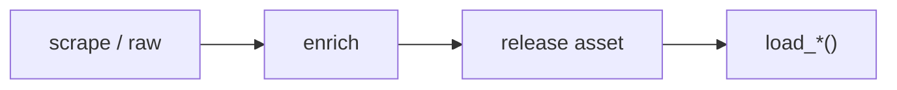

# PWHL dataset loaders



## Automation status

| Dataset | Release tag | Pipeline |
|---|---|---|
| `load_phf_pbp` | [phf_pbp](https://github.com/sportsdataverse/sportsdataverse-data/releases/tag/phf_pbp) | — |
| `load_phf_player_boxscores` | [phf_player_boxscores](https://github.com/sportsdataverse/sportsdataverse-data/releases/tag/phf_player_boxscores) | — |
| `load_phf_schedules` | [phf_schedules](https://github.com/sportsdataverse/sportsdataverse-data/releases/tag/phf_schedules) | — |
| `load_phf_team_boxscores` | [phf_team_boxscores](https://github.com/sportsdataverse/sportsdataverse-data/releases/tag/phf_team_boxscores) | — |
| `load_pwhl_game_info` | [pwhl_game_info](https://github.com/sportsdataverse/sportsdataverse-data/releases/tag/pwhl_game_info) | — |
| `load_pwhl_game_rosters` | [pwhl_game_rosters](https://github.com/sportsdataverse/sportsdataverse-data/releases/tag/pwhl_game_rosters) | — |
| `load_pwhl_shifts` | [pwhl_shifts](https://github.com/sportsdataverse/sportsdataverse-data/releases/tag/pwhl_shifts) | — |
| `load_pwhl_goalie_boxscores` | [pwhl_goalie_boxscores](https://github.com/sportsdataverse/sportsdataverse-data/releases/tag/pwhl_goalie_boxscores) | — |
| `load_pwhl_officials` | [pwhl_officials](https://github.com/sportsdataverse/sportsdataverse-data/releases/tag/pwhl_officials) | — |
| `load_pwhl_pbp` | [pwhl_pbp](https://github.com/sportsdataverse/sportsdataverse-data/releases/tag/pwhl_pbp) | — |
| `load_pwhl_xg_pbp` | [pwhl_xg_pbp](https://github.com/sportsdataverse/sportsdataverse-data/releases/tag/pwhl_xg_pbp) | — |
| `load_pwhl_penalty_summary` | [pwhl_penalty_summary](https://github.com/sportsdataverse/sportsdataverse-data/releases/tag/pwhl_penalty_summary) | — |
| `load_pwhl_player_boxscores` | [pwhl_player_boxscores](https://github.com/sportsdataverse/sportsdataverse-data/releases/tag/pwhl_player_boxscores) | — |
| `load_pwhl_rosters` | [pwhl_rosters](https://github.com/sportsdataverse/sportsdataverse-data/releases/tag/pwhl_rosters) | — |
| `load_pwhl_schedules` | [pwhl_schedules](https://github.com/sportsdataverse/sportsdataverse-data/releases/tag/pwhl_schedules) | — |
| `load_pwhl_scoring_summary` | [pwhl_scoring_summary](https://github.com/sportsdataverse/sportsdataverse-data/releases/tag/pwhl_scoring_summary) | — |
| `load_pwhl_shootout` | [pwhl_shootout](https://github.com/sportsdataverse/sportsdataverse-data/releases/tag/pwhl_shootout) | — |
| `load_pwhl_shots_by_period` | [pwhl_shots_by_period](https://github.com/sportsdataverse/sportsdataverse-data/releases/tag/pwhl_shots_by_period) | — |
| `load_pwhl_skater_boxscores` | [pwhl_skater_boxscores](https://github.com/sportsdataverse/sportsdataverse-data/releases/tag/pwhl_skater_boxscores) | — |
| `load_pwhl_team_boxscores` | [pwhl_team_boxscores](https://github.com/sportsdataverse/sportsdataverse-data/releases/tag/pwhl_team_boxscores) | — |
| `load_pwhl_three_stars` | [pwhl_three_stars](https://github.com/sportsdataverse/sportsdataverse-data/releases/tag/pwhl_three_stars) | — |

## `load_phf_pbp`

Release: [phf_pbp](https://github.com/sportsdataverse/sportsdataverse-data/releases/tag/phf_pbp) · asset `https://github.com/sportsdataverse/sportsdataverse-data/releases/download/phf_pbp/play_by_play_{season}.parquet`
### Returns

| col_name | type | description |
|---|---|---|
| `play_type` | String | String indicating the type of play: pass (includes sacks), run (includes scrambles), punt, field_goal, kickoff, extra_point, qb_kneel, qb_spike, no_play (timeouts and penalties), and missing for rows indicating end of play. |
| `team` | String | Team name. |
| `time` | String | Game clock at infraction (MM:SS). |
| `play_description` | String | Free-text description of the play as published by the league. |
| `period_id` | Int32 | Period identifier. |
| `game_id` | Int32 | Unique game identifier. |
| `game_date` | String | Game date. |
| `home_team` | String | Home team name. |
| `home_location` | String | Home team city. |
| `home_nickname` | String | Nickname of the home team. |
| `home_abbreviation` | String | Home team abbreviation. |
| `home_score_total` | Int32 | Home team's cumulative score after the play. |
| `away_team` | String | Away team name. |
| `away_location` | String | Away team city. |
| `away_nickname` | String | Nickname of the away team. |
| `away_abbreviation` | String | Away team abbreviation. |
| `away_score_total` | Int32 | Away team's cumulative score after the play. |
| `away_goalie` | String | Name of the away goalie on the ice. |
| `away_goalie_jersey` | String | Jersey number of the away goaltender on the ice. |
| `goalie_change` | String | True when the play records a goaltender change. |
| `penalty` | Int32 | Binary indicator for whether or not a penalty occurred. |
| `on_ice_situation` | String | Strength situation on the ice for the play (e.g. even strength, power play). |
| `score` | String | Final score string. |
| `minute_start` | Int32 | Minute mark of the period when the event started. |
| `second_start` | Int32 | Second mark of the period when the event started. |
| `clock` | String | Game clock time remaining (MM:SS). |
| `leader` | String | Team leading the game at this point in the play sequence. |
| `away_goals` | String | Away goals in the period. |
| `home_goals` | String | Home goals in the period. |
| `sec_from_start` | Int32 | Seconds elapsed since the start of the game. |
| `power_play_seconds` | Int32 | Elapsed seconds of the power play at this play. |
| `time_elapsed` | String | Elapsed game time for the drive (`MM:SS`). |
| `time_remaining` | String | Time remaining. |
| `player_name_1` | String | Name of the player in slot 1 of the play's participant list. |
| `player_jersey_1` | String | Jersey number of the player in slot 1 of the play's participant list. |
| `home_skaters` | Int32 | Number of home skaters on the ice. |
| `away_skaters` | Int32 | Number of away skaters on the ice. |
| `home_goalie` | String | Name of the home goalie on the ice. |
| `home_goalie_jersey` | String | Jersey number of the home goaltender on the ice. |
| `player_name_2` | String | Name of the player in slot 2 of the play's participant list. |
| `player_jersey_2` | String | Jersey number of the player in slot 2 of the play's participant list. |
| `shot_result` | String | Shot result ('Made' / 'Missed'). |
| `goalie_involved` | String | Name of the goaltender involved in the play. |
| `penalty_type` | String | String indicating the penalty type of the first penalty in the given play. Will be `NA` if `desc` is missing the type. |
| `penalty_level` | String | Severity classification of the penalty (e.g. minor, major). |
| `penalty_length` | String | Penalty length in minutes. |
| `start_power_play` | Int32 | True on the play where a power play begins. |
| `end_power_play` | Int32 | True on the play where a power play ends. |
| `player_name_3` | String | Name of the player in slot 3 of the play's participant list. |
| `player_jersey_3` | String | Jersey number of the player in slot 3 of the play's participant list. |
| `scoring_team_abbrev` | String | Abbreviation of the team credited with the goal. |
| `scoring_team_on_ice` | String | Skaters the scoring team had on the ice for the goal. |
| `offensive_player_name_1` | String | Name of the attacking team's skater in on-ice slot 1 for the play. |
| `offensive_player_name_2` | String | Name of the attacking team's skater in on-ice slot 2 for the play. |
| `offensive_player_name_3` | String | Name of the attacking team's skater in on-ice slot 3 for the play. |
| `offensive_player_name_4` | String | Name of the attacking team's skater in on-ice slot 4 for the play. |
| `offensive_player_name_5` | String | Name of the attacking team's skater in on-ice slot 5 for the play. |
| `defending_team_abbrev` | String | Abbreviation of the team defending on the play. |
| `offensive_player_jersey_1` | String | Jersey number of the attacking team's skater in on-ice slot 1 for the play. |
| `offensive_player_jersey_2` | String | Jersey number of the attacking team's skater in on-ice slot 2 for the play. |
| `offensive_player_jersey_3` | String | Jersey number of the attacking team's skater in on-ice slot 3 for the play. |
| `offensive_player_jersey_4` | String | Jersey number of the attacking team's skater in on-ice slot 4 for the play. |
| `offensive_player_jersey_5` | String | Jersey number of the attacking team's skater in on-ice slot 5 for the play. |
| `defending_team_on_ice` | String | Skaters the defending team had on the ice for the play. |
| `defensive_player_name_1` | String | Name of the defending team's skater in on-ice slot 1 for the play. |
| `defensive_player_name_2` | String | Name of the defending team's skater in on-ice slot 2 for the play. |
| `defensive_player_name_3` | String | Name of the defending team's skater in on-ice slot 3 for the play. |
| `defensive_player_name_4` | String | Name of the defending team's skater in on-ice slot 4 for the play. |
| `defensive_player_name_5` | String | Name of the defending team's skater in on-ice slot 5 for the play. |
| `defensive_player_jersey_1` | String | Jersey number of the defending team's skater in on-ice slot 1 for the play. |
| `defensive_player_jersey_2` | String | Jersey number of the defending team's skater in on-ice slot 2 for the play. |
| `defensive_player_jersey_3` | String | Jersey number of the defending team's skater in on-ice slot 3 for the play. |
| `defensive_player_jersey_4` | String | Jersey number of the defending team's skater in on-ice slot 4 for the play. |
| `defensive_player_jersey_5` | String | Jersey number of the defending team's skater in on-ice slot 5 for the play. |
| `defensive_player_name_6` | String | Name of the defending team's skater in on-ice slot 6 for the play. |
| `defensive_player_jersey_6` | String | Jersey number of the defending team's skater in on-ice slot 6 for the play. |
| `offensive_player_name_6` | String | Name of the attacking team's skater in on-ice slot 6 for the play. |
| `offensive_player_jersey_6` | String | Jersey number of the attacking team's skater in on-ice slot 6 for the play. |
| `season` | Int32 | Season year (echoed from arg). |

```python
load_phf_pbp(seasons=2023)
```

## `load_phf_player_boxscores`

Release: [phf_player_boxscores](https://github.com/sportsdataverse/sportsdataverse-data/releases/tag/phf_player_boxscores) · asset `https://github.com/sportsdataverse/sportsdataverse-data/releases/download/phf_player_boxscores/player_box_{season}.parquet`
### Returns

| col_name | type | description |
|---|---|---|
| `player_jersey` | Int32 | Player's jersey number. |
| `player_name` | String | Player name. |
| `position` | String | Player position. |
| `goals` | Int32 | Goals scored. |
| `assists` | Int32 | Assists. |
| `points` | Int32 | Total points (goals + assists). |
| `penalty_minutes` | Int32 | Penalty minutes. |
| `shots_on_goal` | Int32 | Shots on goal. |
| `blocks` | Int32 | Total blocks. |
| `giveaways` | Int32 | Giveaways. |
| `takeaways` | Int32 | Takeaways. |
| `faceoffs_won_lost` | String | Faceoffs won and lost, as the league's combined won-lost string. |
| `faceoffs_win_pct` | Float64 | Share of the player's faceoffs won. |
| `powerplay_goals` | Int32 | Goals the player scored on the power play. |
| `shorthanded_goals` | Int32 | Shorthanded goals. |
| `shots` | Int32 | Shots on goal. |
| `shots_blocked` | Int32 | Shots the player blocked. |
| `faceoffs_won` | Int32 | Faceoffs won in the season. |
| `faceoffs_lost` | Int32 | Faceoffs lost in the season. |
| `team` | String | Team name. |
| `skaters_href` | String | Relative link to the league's skater table for this game. |
| `player_id` | String | Unique player identifier. |
| `game_id` | Int32 | Unique game identifier. |
| `minutes_played` | String | Minutes played. |
| `shots_against` | Int32 | Shots faced. |
| `goals_against` | Int32 | Goals against. |
| `saves` | Int32 | Saves made. |
| `save_percent` | Float64 | Share of shots faced that the goaltender saved. |
| `goalies_href` | String | Relative link to the league's goaltender table for this game. |
| `season` | Int32 | Season year (echoed from arg). |

```python
load_phf_player_boxscores(seasons=2023)
```

## `load_phf_schedules`

Release: [phf_schedules](https://github.com/sportsdataverse/sportsdataverse-data/releases/tag/phf_schedules) · asset `https://github.com/sportsdataverse/sportsdataverse-data/releases/download/phf_schedules/phf_schedule_{season}.parquet`
### Returns

| col_name | type | description |
|---|---|---|
| `type` | String | Competitor type (e.g. "team"). |
| `id` | String | Unique player identifier. |
| `league_id` | Int32 | League identifier of the team. |
| `season_id` | Int32 | Season identifier. |
| `tournament_id` | Boolean | ESPN tournament id parsed from the `$ref` URL. |
| `game_id` | Int32 | Unique game identifier. |
| `number` | Int32 | Week number as returned by the API. |
| `datetime` | Datetime(time_unit='us', time_zone='UTC') | Scheduled start of the game as a timestamp. |
| `datetime_tz` | Datetime(time_unit='us', time_zone='UTC') | Scheduled start of the game including its time-zone offset. |
| `time_zone` | String | Time zone in which the game is played. |
| `time_zone_abbr` | String | Abbreviated form of the game's time zone. |
| `updated_at` | Datetime(time_unit='us', time_zone='UTC') | Timestamp at which the league last updated the game record. |
| `created_at` | Datetime(time_unit='us', time_zone='UTC') | Timestamp at which the league created the game record. |
| `home_team_id` | Int32 | Home team identifier. |
| `home_team` | String | Home team name. |
| `home_team_short` | String | Short display name of the home team. |
| `home_team_logo_url_full` | String | URL of the home team's logo at the full rendition. |
| `home_team_logo_url_small` | String | URL of the home team's logo at the small rendition. |
| `home_team_logo_url_medium` | String | URL of the home team's logo at the medium rendition. |
| `home_team_logo_url_large` | String | URL of the home team's logo at the large rendition. |
| `home_team_logo_url_50` | String | URL of the home team's logo at the 50px rendition. |
| `home_team_logo_url_100` | String | URL of the home team's logo at the 100px rendition. |
| `home_team_logo_url_200` | String | URL of the home team's logo at the 200px rendition. |
| `away_team_id` | Int32 | Away team identifier. |
| `away_team` | String | Away team name. |
| `away_team_short` | String | Short display name of the away team. |
| `away_team_logo_url_full` | String | URL of the away team's logo at the full rendition. |
| `away_team_logo_url_small` | String | URL of the away team's logo at the small rendition. |
| `away_team_logo_url_medium` | String | URL of the away team's logo at the medium rendition. |
| `away_team_logo_url_large` | String | URL of the away team's logo at the large rendition. |
| `away_team_logo_url_50` | String | URL of the away team's logo at the 50px rendition. |
| `away_team_logo_url_100` | String | URL of the away team's logo at the 100px rendition. |
| `away_team_logo_url_200` | String | URL of the away team's logo at the 200px rendition. |
| `home_division_id` | Int32 | League identifier for the home team's division. |
| `home_division` | String | Home team division. |
| `away_division_id` | Int32 | League identifier for the away team's division. |
| `away_division` | String | Away team division. |
| `home_score` | Int32 | Home team final score. |
| `away_score` | Int32 | Away team final score. |
| `home_shots` | Int32 | Home team shots in the period. |
| `away_shots` | Int32 | Away team shots in the period. |
| `home_penalty_minutes` | Int32 | Penalty minutes assessed to the home team. |
| `away_penalty_minutes` | Int32 | Penalty minutes assessed to the away team. |
| `home_roster_count` | Int32 | Number of players dressed for the home team. |
| `away_roster_count` | Int32 | Number of players dressed for the away team. |
| `facility_id` | Int32 | League identifier for the hosting facility. |
| `facility` | String | Name of the facility hosting the game. |
| `facility_address` | String | Street address of the hosting facility. |
| `rink_id` | Boolean | League identifier for the rink. |
| `rink` | Boolean | Name of the rink within the facility. |
| `game_type` | String | Game type the row belongs to. |
| `notes` | String | Notes flag for the pick. |
| `status` | String | Status string (e.g. captain markers). |
| `overtime` | Boolean | Binary indicator of whether or not game went to overtime. |
| `shootout` | Boolean | Whether shootout data is available. |
| `allow_players` | Boolean | League flag for whether player-level detail is published for the game. |
| `tickets_url` | String | Link to purchase tickets for the game. |
| `watch_live_url` | String | Link to the live broadcast of the game. |
| `external_url` | Boolean | League-published external link for the game. |
| `has_play_by_play` | Boolean | True when a play-by-play feed exists for the game. |
| `highlight_color` | Boolean | Display colour the league uses for the game in its schedule UI. |
| `attendance` | Int32 | Game attendance. |
| `date_group` | Date | League grouping key for the game's date, used to bucket a slate. |
| `winner` | String | Whether this competitor won the game. |
| `season` | Int32 | Season year (echoed from arg). |
| `PBP` | Boolean | Whether play-by-play data is available. |
| `team_box` | Boolean | Whether team box score data is available. |
| `player_box` | Boolean | Whether player box score data is available. |

```python
load_phf_schedules(seasons=2023)
```

## `load_phf_team_boxscores`

Release: [phf_team_boxscores](https://github.com/sportsdataverse/sportsdataverse-data/releases/tag/phf_team_boxscores) · asset `https://github.com/sportsdataverse/sportsdataverse-data/releases/download/phf_team_boxscores/team_box_{season}.parquet`
### Returns

| col_name | type | description |
|---|---|---|
| `team` | String | Team name. |
| `game_id` | Int32 | Unique game identifier. |
| `winner` | Boolean | Whether this competitor won the game. |
| `total_scoring` | Int32 | Goals the team scored in the game. |
| `successful_power_play` | Float64 | Number of power plays on which the team scored. |
| `power_play_opportunities` | Float64 | Power play opportunities. |
| `power_play_percent` | Float64 | Share of the team's power plays that produced a goal. |
| `penalty_minutes` | Float64 | Penalty minutes. |
| `faceoff_percent` | Float64 | Faceoff win percentage. |
| `blocked_opponent_shots` | Float64 | Opponent shots the team blocked. |
| `takeaways` | Float64 | Takeaways. |
| `giveaways` | Float64 | Giveaways. |
| `period_1_shots` | Int32 | Shots the team took in period 1. |
| `period_2_shots` | Int32 | Shots the team took in period 2. |
| `period_3_shots` | Int32 | Shots the team took in period 3. |
| `overtime_shots` | Int32 | Shots the team took in overtime. |
| `shootout_made_shots` | Int32 | Shootout shots the team took that scored. |
| `shootout_missed_shots` | Int32 | Shootout shots the team took that did not score. |
| `total_shots` | Int32 | Shots the team took in the game. |
| `period_1_scoring` | Int32 | Goals the team scored in period 1. |
| `period_2_scoring` | Int32 | Goals the team scored in period 2. |
| `period_3_scoring` | Int32 | Goals the team scored in period 3. |
| `overtime_scoring` | Int32 | Goals the team scored in overtime. |
| `shootout_made_scoring` | Float64 | Shootout attempts the team converted. |
| `shootout_missed_scoring` | Float64 | Shootout attempts the team failed to convert. |
| `season` | Int32 | Season year (echoed from arg). |

```python
load_phf_team_boxscores(seasons=2023)
```

## `load_pwhl_game_info`

Release: [pwhl_game_info](https://github.com/sportsdataverse/sportsdataverse-data/releases/tag/pwhl_game_info) · asset `https://github.com/sportsdataverse/sportsdataverse-data/releases/download/pwhl_game_info/game_info_{season}.parquet`
### Returns

| col_name | type | description |
|---|---|---|
| `game_id` | Int64 | Unique game identifier. |
| `game_number` | String | Game number within the schedule. |
| `game_date` | String | Game date. |
| `game_date_iso` | String | ISO-8601 game start datetime. |
| `start_time` | String | Shift start time (MM:SS countdown clock). |
| `end_time` | String | Shift end time (MM:SS countdown clock). |
| `game_duration` | String | Game length (H:MM). |
| `game_venue` | String | Venue where the game was played. |
| `attendance` | Int64 | Game attendance. |
| `game_status` | String | Game status text. |
| `game_season_id` | Int64 | HockeyTech season identifier. |
| `started` | Int64 | Flag for whether the game has started. |
| `final` | Int64 | Flag for whether the game is final. |
| `home_team_id` | Int64 | Home team identifier. |
| `home_team` | String | Home team name. |
| `home_team_abbr` | String | Home team abbreviation. |
| `home_score` | Int64 | Home team final score. |
| `away_team_id` | Int64 | Away team identifier. |
| `away_team` | String | Away team name. |
| `away_team_abbr` | String | Away team abbreviation. |
| `away_score` | Int64 | Away team final score. |
| `has_shootout` | Int64 | Flag for whether the game went to shootout. |
| `game_report_url` | String | URL to the game report. |
| `boxscore_url` | String | URL to the boxscore. |

```python
load_pwhl_game_info(seasons=2024)
```

## `load_pwhl_game_rosters`

Release: [pwhl_game_rosters](https://github.com/sportsdataverse/sportsdataverse-data/releases/tag/pwhl_game_rosters) · asset `https://github.com/sportsdataverse/sportsdataverse-data/releases/download/pwhl_game_rosters/game_rosters_{season}.parquet`
### Returns

| col_name | type | description |
|---|---|---|
| `game_id` | Int64 | Unique game identifier. |
| `team_id` | Int64 | Unique team identifier. |
| `team` | String | Team name. |
| `team_abbr` | String | Team abbreviation. |
| `team_side` | String | Home or away indicator. |
| `player_type` | String | Player type (skater or goalie). |
| `player_id` | Int64 | Unique player identifier. |
| `first_name` | String | Player first name. |
| `last_name` | String | Player last name. |
| `jersey_number` | Int64 | Jersey number. |
| `position` | String | Player position. |
| `birth_date` | String | Player birth date. |
| `starting` | Int64 | Whether the player started the game. |
| `status` | String | Status string (e.g. captain markers). |

```python
load_pwhl_game_rosters(seasons=2024)
```

## `load_pwhl_shifts`

Release: [pwhl_shifts](https://github.com/sportsdataverse/sportsdataverse-data/releases/tag/pwhl_shifts) · asset `https://github.com/sportsdataverse/sportsdataverse-data/releases/download/pwhl_shifts/shifts_{season}.parquet`
### Returns

| col_name | type | description |
|---|---|---|
| `game_id` | Int64 | Unique game identifier. |
| `player_id` | Int64 | Unique player identifier. |
| `first_name` | String | Player first name. |
| `last_name` | String | Player last name. |
| `jersey_number` | String | Jersey number. |
| `home` | Int64 | Whether the player's team was home. |
| `period` | Int64 | Period number. |
| `start_time` | String | Shift start time (MM:SS countdown clock). |
| `end_time` | String | Shift end time (MM:SS countdown clock). |
| `length` | String | Length of the streak in games. |
| `start_s` | Int64 | Shift start in countdown seconds. |
| `end_s` | Int64 | Shift end in countdown seconds. |
| `goal_on_shift` | Int64 | 1 if a goal occurred during this shift, else 0. |
| `penalty_on_shift` | Int64 | 1 if a penalty occurred during this shift, else 0. |

```python
load_pwhl_shifts(seasons=2025)
```

## `load_pwhl_goalie_boxscores`

Release: [pwhl_goalie_boxscores](https://github.com/sportsdataverse/sportsdataverse-data/releases/tag/pwhl_goalie_boxscores) · asset `https://github.com/sportsdataverse/sportsdataverse-data/releases/download/pwhl_goalie_boxscores/goalie_box_{season}.parquet`
### Returns

| col_name | type | description |
|---|---|---|
| `player_id` | String | Unique player identifier. |
| `first_name` | String | Player first name. |
| `last_name` | String | Player last name. |
| `position` | String | Player position. |
| `team_id` | Int64 | Unique team identifier. |
| `game_id` | Int64 | Unique game identifier. |
| `league` | String | League code. |
| `toi` | String | Time on ice. |
| `time_on_ice` | Float64 | Time on ice in seconds. |
| `saves` | Int64 | Saves made. |
| `goals_against` | Int64 | Goals against. |
| `shots_against` | Int64 | Shots faced. |
| `goals` | Int64 | Goals scored. |
| `assists` | Int64 | Assists. |
| `points` | Int64 | Total points (goals + assists). |
| `penalty_minutes` | Int64 | Penalty minutes. |
| `faceoff_attempts` | Int64 | Faceoff attempts. |
| `faceoff_wins` | Int64 | Faceoff wins. |
| `faceoff_losses` | Int64 | Faceoff losses. |
| `faceoff_pct` | Null | Faceoff win percentage. |
| `starting` | Int64 | Whether the player started the game. |

```python
load_pwhl_goalie_boxscores(seasons=2024)
```

## `load_pwhl_officials`

Release: [pwhl_officials](https://github.com/sportsdataverse/sportsdataverse-data/releases/tag/pwhl_officials) · asset `https://github.com/sportsdataverse/sportsdataverse-data/releases/download/pwhl_officials/officials_{season}.parquet`
### Returns

| col_name | type | description |
|---|---|---|
| `game_id` | Int64 | Unique game identifier. |
| `role` | String | Grouped official role (Referee/Linesperson). |
| `first_name` | String | Player first name. |
| `last_name` | String | Player last name. |
| `jersey_number` | Int64 | Jersey number. |
| `official_role` | String | Official's specific role. |

```python
load_pwhl_officials(seasons=2024)
```

## `load_pwhl_pbp`

Release: [pwhl_pbp](https://github.com/sportsdataverse/sportsdataverse-data/releases/tag/pwhl_pbp) · asset `https://github.com/sportsdataverse/sportsdataverse-data/releases/download/pwhl_pbp/play_by_play_{season}.parquet`
### Returns

| col_name | type | description |
|---|---|---|
| `game_id` | Int64 | Unique game identifier. |
| `event` | String | Event description label. |
| `team_id` | String | Unique team identifier. |
| `period_of_game` | String | Period in which the event occurred. |
| `time_of_period` | String | Elapsed time within the period (MM:SS). |
| `x_coord` | Float64 | Transformed x-coordinate of the event (feet scale). |
| `y_coord` | Float64 | Transformed y-coordinate of the event (feet scale). |
| `player_id` | Int64 | Unique player identifier. |
| `player_name_first` | String | Primary player first name. |
| `player_name_last` | String | Primary player last name. |
| `player_position` | String | Primary player position. |
| `goal` | Boolean | Flag for whether the event was a goal. |
| `goalie_id` | Int64 | Goalie identifier on the play. |
| `goalie_first` | String | Goalie first name. |
| `goalie_last` | String | Goalie last name. |
| `home_win` | String | Whether the home player won the faceoff. |
| `player_team_id` | String | Unique team identifier of the primary player. |
| `event_type` | String | Standardized event type code. |
| `shot_quality` | String | Shot quality descriptor. |
| `empty_net` | String | Whether the net was empty. |
| `game_winner` | String | Whether the goal was the game-winning goal. |
| `penalty_shot` | String | Whether the goal came on a penalty shot. |
| `insurance` | String | Whether the goal was an insurance goal. |
| `short_handed` | String | Whether the event occurred while short-handed. |
| `power_play` | String | Whether the event occurred on a power play. |
| `player_two_id` | Int64 | Second player's unique identifier. |
| `player_two_name_first` | String | Second player first name. |
| `player_two_name_last` | String | Second player last name. |
| `player_two_position` | String | Second player position. |
| `player_three_id` | Int64 | Third player's unique identifier. |
| `player_three_name_first` | String | Third player first name. |
| `player_three_name_last` | String | Third player last name. |
| `player_three_position` | String | Third player position. |
| `plus_player_one_id` | Int64 | On-ice plus player one unique identifier. |
| `plus_player_one_first` | String | On-ice plus player one first name. |
| `plus_player_one_last` | String | On-ice plus player one last name. |
| `plus_player_one_position` | String | On-ice plus player one position. |
| `plus_player_two_id` | Int64 | On-ice plus player two unique identifier. |
| `plus_player_two_first` | String | On-ice plus player two first name. |
| `plus_player_two_last` | String | On-ice plus player two last name. |
| `plus_player_two_position` | String | On-ice plus player two position. |
| `plus_player_three_id` | Int64 | On-ice plus player three unique identifier. |
| `plus_player_three_first` | String | On-ice plus player three first name. |
| `plus_player_three_last` | String | On-ice plus player three last name. |
| `plus_player_three_position` | String | On-ice plus player three position. |
| `plus_player_four_id` | Int64 | On-ice plus player four unique identifier. |
| `plus_player_four_first` | String | On-ice plus player four first name. |
| `plus_player_four_last` | String | On-ice plus player four last name. |
| `plus_player_four_position` | String | On-ice plus player four position. |
| `plus_player_five_id` | Int64 | On-ice plus player five unique identifier. |
| `plus_player_five_first` | String | On-ice plus player five first name. |
| `plus_player_five_last` | String | On-ice plus player five last name. |
| `plus_player_five_position` | String | On-ice plus player five position. |
| `minus_player_one_id` | Int64 | On-ice minus player one unique identifier. |
| `minus_player_one_first` | String | On-ice minus player one first name. |
| `minus_player_one_last` | String | On-ice minus player one last name. |
| `minus_player_one_position` | String | On-ice minus player one position. |
| `minus_player_two_id` | Int64 | On-ice minus player two unique identifier. |
| `minus_player_two_first` | String | On-ice minus player two first name. |
| `minus_player_two_last` | String | On-ice minus player two last name. |
| `minus_player_two_position` | String | On-ice minus player two position. |
| `minus_player_three_id` | Int64 | On-ice minus player three unique identifier. |
| `minus_player_three_first` | String | On-ice minus player three first name. |
| `minus_player_three_last` | String | On-ice minus player three last name. |
| `minus_player_three_position` | String | On-ice minus player three position. |
| `minus_player_four_id` | Int64 | On-ice minus player four unique identifier. |
| `minus_player_four_first` | String | On-ice minus player four first name. |
| `minus_player_four_last` | String | On-ice minus player four last name. |
| `minus_player_four_position` | String | On-ice minus player four position. |
| `minus_player_five_id` | Int64 | On-ice minus player five unique identifier. |
| `minus_player_five_first` | String | On-ice minus player five first name. |
| `minus_player_five_last` | String | On-ice minus player five last name. |
| `minus_player_five_position` | String | On-ice minus player five position. |
| `penalty_length` | String | Penalty length in minutes. |
| `game_date` | String | Game date. |
| `game_season` | Int64 | Season (concluding year, YYYY). |
| `game_season_id` | String | HockeyTech season identifier. |
| `home_team` | String | Home team name. |
| `home_team_id` | String | Home team identifier. |
| `away_team` | String | Away team name. |
| `away_team_id` | String | Away team identifier. |
| `x_coord_original` | Int64 | Original raw x-coordinate from the feed. |
| `y_coord_original` | Int64 | Original raw y-coordinate from the feed. |
| `x_coord_neutral` | Int64 | Neutral-zone-centered x-coordinate. |
| `y_coord_neutral` | Int64 | Neutral-zone-centered y-coordinate. |
| `x_coord_fixed` | Float64 | Fixed-orientation x-coordinate. |
| `y_coord_fixed` | Float64 | Fixed-orientation y-coordinate. |
| `x_coord_right` | Float64 | Right-orientation x-coordinate. |
| `y_coord_right` | Float64 | Right-orientation y-coordinate. |
| `x_coord_vertical` | Float64 | Vertical-orientation x-coordinate. |
| `y_coord_vertical` | Float64 | Vertical-orientation y-coordinate. |
| `minute_start` | Int64 | Minute mark of the period when the event started. |
| `second_start` | Int64 | Second mark of the period when the event started. |
| `clock` | String | Game clock time remaining (MM:SS). |
| `sec_from_start` | Int64 | Seconds elapsed since the start of the game. |
| `shot_distance` | Float64 | Distance of the shot from the net. |
| `shot_angle` | Float64 | Angle of the shot relative to the net. |
| `scoring_chance` | Boolean | TRUE when event is a shot-type within 25 ft of the net. |
| `on_ice_home` | String | Comma-joined sorted player_ids on ice for the home team. |
| `on_ice_away` | String | Comma-joined sorted player_ids on ice for the away team. |
| `skaters_home` | Int64 | Number of home skaters on the ice for the event, derived from HockeyTech shift data. |
| `skaters_away` | Int64 | Number of away skaters on the ice for the event, derived from HockeyTech shift data. |
| `strength_state` | String | Skater-strength state formatted home-first as skaters_home v skaters_away (5v4 = home has the extra skater), derived from shift data. |
| `strength_state_valid` | Boolean | True when both shift-derived skater counts are between 3 and 6 inclusive; false when a count falls outside that range; null when a count is unavailable. |

```python
load_pwhl_pbp(seasons=2024)
```

## `load_pwhl_xg_pbp`

Release: [pwhl_xg_pbp](https://github.com/sportsdataverse/sportsdataverse-data/releases/tag/pwhl_xg_pbp) · asset `https://github.com/sportsdataverse/sportsdataverse-data/releases/download/pwhl_xg_pbp/pwhl_xg_pbp_{season}.parquet`
### Returns

| col_name | type | description |
|---|---|---|
| `game_id` | Int32 | Unique game identifier. |
| `game_season` | Int32 | Season (concluding year, YYYY). |
| `game_date` | String | Game date. |
| `team_id` | Int32 | Unique team identifier. |
| `player_id` | Int32 | Unique player identifier. |
| `goalie_id` | Int32 | Goalie identifier on the play. |
| `period_of_game` | String | Period in which the event occurred. |
| `sec_from_start` | Int32 | Seconds elapsed since the start of the game. |
| `clock` | String | Game clock time remaining (MM:SS). |
| `x_coord` | Float64 | Transformed x-coordinate of the event (feet scale). |
| `y_coord` | Float64 | Transformed y-coordinate of the event (feet scale). |
| `shot_distance` | Float64 | Distance of the shot from the net. |
| `shot_angle` | Float64 | Angle of the shot relative to the net. |
| `event_type` | String | Standardized event type code. |
| `shot_quality` | String | Shot quality descriptor. |
| `power_play` | Int32 | Whether the event occurred on a power play. |
| `short_handed` | String | Whether the event occurred while short-handed. |
| `empty_net` | String | Whether the net was empty. |
| `penalty_shot` | String | Whether the goal came on a penalty shot. |
| `goal` | Boolean | Flag for whether the event was a goal. |
| `xg` | Float64 | Expected goals value for the shot event. |

```python
load_pwhl_xg_pbp(seasons=2025)
```

## `load_pwhl_penalty_summary`

Release: [pwhl_penalty_summary](https://github.com/sportsdataverse/sportsdataverse-data/releases/tag/pwhl_penalty_summary) · asset `https://github.com/sportsdataverse/sportsdataverse-data/releases/download/pwhl_penalty_summary/penalty_summary_{season}.parquet`
### Returns

| col_name | type | description |
|---|---|---|
| `game_id` | Int64 | Unique game identifier. |
| `period_id` | Int64 | Period identifier. |
| `period` | String | Period number. |
| `time` | String | Game clock at infraction (MM:SS). |
| `team_id` | Int64 | Unique team identifier. |
| `team` | String | Team name. |
| `team_abbr` | String | Team abbreviation. |
| `game_penalty_id` | Int64 | Penalty identifier within the game. |
| `minutes` | Int64 | Penalty length in minutes. |
| `description` | String | Full text description of the event. |
| `rule_number` | String | Rulebook rule number. |
| `is_power_play` | Int64 | Power-play flag. |
| `is_bench` | Int64 | Bench-minor flag. |
| `taken_by_id` | Int64 | Identifier of the player who took the penalty. |
| `taken_by_first` | String | Offender first name. |
| `taken_by_last` | String | Offender last name. |
| `taken_by_position` | String | Offender position. |
| `served_by_id` | Int64 | Identifier of the player serving the penalty. |
| `served_by_first` | String | First name of the player serving. |
| `served_by_last` | String | Last name of the player serving. |

```python
load_pwhl_penalty_summary(seasons=2024)
```

## `load_pwhl_player_boxscores`

Release: [pwhl_player_boxscores](https://github.com/sportsdataverse/sportsdataverse-data/releases/tag/pwhl_player_boxscores) · asset `https://github.com/sportsdataverse/sportsdataverse-data/releases/download/pwhl_player_boxscores/player_box_{season}.parquet`
### Returns

| col_name | type | description |
|---|---|---|
| `player_id` | String | Unique player identifier. |
| `first_name` | String | Player first name. |
| `last_name` | String | Player last name. |
| `position` | String | Player position. |
| `team_id` | Int64 | Unique team identifier. |
| `game_id` | Int64 | Unique game identifier. |
| `league` | String | League code. |
| `toi` | String | Time on ice. |
| `time_on_ice` | Float64 | Time on ice in seconds. |
| `goals` | Int64 | Goals scored. |
| `assists` | Int64 | Assists. |
| `points` | Int64 | Total points (goals + assists). |
| `shots` | Int64 | Shots on goal. |
| `hits` | Int64 | Hits. |
| `blocked_shots` | Int64 | Blocked shots. |
| `penalty_minutes` | Int64 | Penalty minutes. |
| `plus_minus` | Int64 | Plus/minus rating. |
| `faceoff_attempts` | Int64 | Faceoff attempts. |
| `faceoff_wins` | Int64 | Faceoff wins. |
| `faceoff_losses` | Int64 | Faceoff losses. |
| `faceoff_pct` | Float64 | Faceoff win percentage. |
| `starting` | Int64 | Whether the player started the game. |
| `player_type` | String | Player type (skater or goalie). |
| `saves` | Int64 | Saves made. |
| `goals_against` | Int64 | Goals against. |
| `shots_against` | Int64 | Shots faced. |

```python
load_pwhl_player_boxscores(seasons=2024)
```

## `load_pwhl_rosters`

Release: [pwhl_rosters](https://github.com/sportsdataverse/sportsdataverse-data/releases/tag/pwhl_rosters) · asset `https://github.com/sportsdataverse/sportsdataverse-data/releases/download/pwhl_rosters/rosters_{season}.parquet`
### Returns

| col_name | type | description |
|---|---|---|
| `team_id` | Int32 | Unique team identifier. |
| `team` | String | Team name. |
| `team_abbr` | String | Team abbreviation. |
| `team_side` | String | Home or away indicator. |
| `player_type` | String | Player type (skater or goalie). |
| `player_id` | Int32 | Unique player identifier. |
| `first_name` | String | Player first name. |
| `last_name` | String | Player last name. |
| `jersey_number` | Int32 | Jersey number. |
| `position` | String | Player position. |
| `birth_date` | String | Player birth date. |
| `season` | Int32 | Season year (echoed from arg). |

```python
load_pwhl_rosters(seasons=2024)
```

## `load_pwhl_schedules`

Release: [pwhl_schedules](https://github.com/sportsdataverse/sportsdataverse-data/releases/tag/pwhl_schedules) · asset `https://github.com/sportsdataverse/sportsdataverse-data/releases/download/pwhl_schedules/pwhl_schedule_{season}.parquet`
### Returns

| col_name | type | description |
|---|---|---|
| `game_id` | String | Unique game identifier. |
| `season` | Int32 | Season year (echoed from arg). |
| `game_date` | String | Game date. |
| `game_status` | String | Game status text. |
| `home_team` | String | Home team name. |
| `home_team_id` | String | Home team identifier. |
| `away_team` | String | Away team name. |
| `away_team_id` | String | Away team identifier. |
| `home_score` | String | Home team final score. |
| `away_score` | String | Away team final score. |
| `winner` | String | Whether this competitor won the game. |
| `venue` | String | Venue where the game was played. |
| `venue_url` | String | URL for the venue. |
| `game_type` | String | Game type the row belongs to. |
| `game_json` | Boolean | Whether processed game JSON is available. |
| `game_json_url` | String | URL to the processed game JSON. |
| `PBP` | Boolean | Whether play-by-play data is available. |
| `player_box` | Boolean | Whether player box score data is available. |
| `skater_box` | Boolean | Whether skater box data is available. |
| `goalie_box` | Boolean | Whether goalie box data is available. |
| `team_box` | Boolean | Whether team box score data is available. |
| `game_info` | Boolean | CONSTANT true: marks that the source game record carried a game-info block. |
| `game_rosters` | Boolean | Whether game rosters data is available. |
| `scoring_summary` | Boolean | Whether scoring summary data is available. |
| `penalty_summary` | Boolean | Whether penalty summary data is available. |
| `three_stars` | Boolean | CONSTANT true: marks that the source game record carried a three-stars block. |
| `officials` | Boolean | Whether officials data is available. |
| `shots_by_period` | Boolean | Whether shots-by-period data is available. |
| `shootout` | Boolean | Whether shootout data is available. |

```python
load_pwhl_schedules(seasons=2024)
```

## `load_pwhl_scoring_summary`

Release: [pwhl_scoring_summary](https://github.com/sportsdataverse/sportsdataverse-data/releases/tag/pwhl_scoring_summary) · asset `https://github.com/sportsdataverse/sportsdataverse-data/releases/download/pwhl_scoring_summary/scoring_summary_{season}.parquet`
### Returns

| col_name | type | description |
|---|---|---|
| `game_id` | Int64 | Unique game identifier. |
| `period_id` | Int64 | Period identifier. |
| `period` | String | Period number. |
| `time` | String | Game clock at infraction (MM:SS). |
| `team_id` | Int64 | Unique team identifier. |
| `team` | String | Team name. |
| `team_abbr` | String | Team abbreviation. |
| `game_goal_id` | Int64 | Goal identifier within the game. |
| `scorer_goal_number` | Int64 | Scorer's season goal number. |
| `scorer_id` | Int64 | Identifier of the goal scorer. |
| `scorer_first` | String | Scorer first name. |
| `scorer_last` | String | Scorer last name. |
| `scorer_position` | String | Scorer position. |
| `assist_1_id` | Int64 | Primary assist player identifier. |
| `assist_1_first` | String | Primary assist first name. |
| `assist_1_last` | String | Primary assist last name. |
| `assist_2_id` | Int64 | Secondary assist player identifier. |
| `assist_2_first` | String | Secondary assist first name. |
| `assist_2_last` | String | Secondary assist last name. |
| `is_power_play` | Int64 | Power-play flag. |
| `is_short_handed` | Int64 | Short-handed flag. |
| `is_empty_net` | Int64 | Empty-net flag. |
| `is_penalty_shot` | Int64 | Penalty-shot flag. |
| `is_insurance` | Int64 | Insurance-goal flag. |
| `is_game_winning` | Int64 | Game-winning-goal flag. |
| `x_location` | Null | Goal x-coordinate on the ice. |
| `y_location` | Null | Goal y-coordinate on the ice. |

```python
load_pwhl_scoring_summary(seasons=2024)
```

## `load_pwhl_shootout`

Release: [pwhl_shootout](https://github.com/sportsdataverse/sportsdataverse-data/releases/tag/pwhl_shootout) · asset `https://github.com/sportsdataverse/sportsdataverse-data/releases/download/pwhl_shootout/shootout_summary_{season}.parquet`
### Returns

| col_name | type | description |
|---|---|---|
| `game_id` | Int64 | Unique game identifier. |
| `round` | Int64 | Shootout round number. |
| `team_side` | String | Home or away indicator. |
| `shooter_id` | Int64 | Shooter player identifier. |
| `shooter_first` | String | Shooter first name. |
| `shooter_last` | String | Shooter last name. |
| `goalie_id` | Int64 | Goalie identifier on the play. |
| `goalie_first` | String | Goalie first name. |
| `goalie_last` | String | Goalie last name. |
| `is_goal` | Int64 | Whether the attempt scored (1/0). |

```python
load_pwhl_shootout(seasons=2026)
```

## `load_pwhl_shots_by_period`

Release: [pwhl_shots_by_period](https://github.com/sportsdataverse/sportsdataverse-data/releases/tag/pwhl_shots_by_period) · asset `https://github.com/sportsdataverse/sportsdataverse-data/releases/download/pwhl_shots_by_period/shots_by_period_{season}.parquet`
### Returns

| col_name | type | description |
|---|---|---|
| `game_id` | Int64 | Unique game identifier. |
| `period_id` | Int64 | Period identifier. |
| `period` | String | Period number. |
| `home_goals` | Int64 | Home goals in the period. |
| `home_shots` | Int64 | Home team shots in the period. |
| `away_goals` | Int64 | Away goals in the period. |
| `away_shots` | Int64 | Away team shots in the period. |

```python
load_pwhl_shots_by_period(seasons=2024)
```

## `load_pwhl_skater_boxscores`

Release: [pwhl_skater_boxscores](https://github.com/sportsdataverse/sportsdataverse-data/releases/tag/pwhl_skater_boxscores) · asset `https://github.com/sportsdataverse/sportsdataverse-data/releases/download/pwhl_skater_boxscores/skater_box_{season}.parquet`
### Returns

| col_name | type | description |
|---|---|---|
| `player_id` | String | Unique player identifier. |
| `first_name` | String | Player first name. |
| `last_name` | String | Player last name. |
| `position` | String | Player position. |
| `team_id` | Int64 | Unique team identifier. |
| `game_id` | Int64 | Unique game identifier. |
| `league` | String | League code. |
| `toi` | String | Time on ice. |
| `time_on_ice` | Float64 | Time on ice in seconds. |
| `goals` | Int64 | Goals scored. |
| `assists` | Int64 | Assists. |
| `points` | Int64 | Total points (goals + assists). |
| `shots` | Int64 | Shots on goal. |
| `hits` | Int64 | Hits. |
| `blocked_shots` | Int64 | Blocked shots. |
| `penalty_minutes` | Int64 | Penalty minutes. |
| `plus_minus` | Int64 | Plus/minus rating. |
| `faceoff_attempts` | Int64 | Faceoff attempts. |
| `faceoff_wins` | Int64 | Faceoff wins. |
| `faceoff_losses` | Int64 | Faceoff losses. |
| `faceoff_pct` | Float64 | Faceoff win percentage. |
| `starting` | Int64 | Whether the player started the game. |

```python
load_pwhl_skater_boxscores(seasons=2024)
```

## `load_pwhl_team_boxscores`

Release: [pwhl_team_boxscores](https://github.com/sportsdataverse/sportsdataverse-data/releases/tag/pwhl_team_boxscores) · asset `https://github.com/sportsdataverse/sportsdataverse-data/releases/download/pwhl_team_boxscores/team_box_{season}.parquet`
### Returns

| col_name | type | description |
|---|---|---|
| `game_id` | Int64 | Unique game identifier. |
| `team_id` | Int64 | Unique team identifier. |
| `team` | String | Team name. |
| `team_abbr` | String | Team abbreviation. |
| `team_side` | String | Home or away indicator. |
| `shots` | Int64 | Shots on goal. |
| `goals` | Int64 | Goals scored. |
| `hits` | Int64 | Hits. |
| `pp_goals` | Int64 | Power-play goals. |
| `pp_opportunities` | Int64 | Power-play opportunities. |
| `goal_count` | Int64 | Total goals recorded. |
| `assist_count` | Int64 | Total assists recorded. |
| `penalty_minutes` | Int64 | Penalty minutes. |
| `infraction_count` | Int64 | Number of infractions. |
| `faceoff_attempts` | Int64 | Faceoff attempts. |
| `faceoff_wins` | Int64 | Faceoff wins. |
| `faceoff_win_pct` | Float64 | Faceoff win percentage. |
| `season_wins` | Int64 | Season wins entering/after the game. |
| `season_losses` | Int64 | Season losses entering/after the game. |
| `season_ot_wins` | Int64 | Season overtime wins. |
| `season_ot_losses` | Int64 | Season overtime losses. |
| `season_so_losses` | Int64 | Season shootout losses. |
| `season_record` | String | Season record after this game. |

```python
load_pwhl_team_boxscores(seasons=2024)
```

## `load_pwhl_three_stars`

Release: [pwhl_three_stars](https://github.com/sportsdataverse/sportsdataverse-data/releases/tag/pwhl_three_stars) · asset `https://github.com/sportsdataverse/sportsdataverse-data/releases/download/pwhl_three_stars/three_stars_{season}.parquet`
### Returns

| col_name | type | description |
|---|---|---|
| `game_id` | Int64 | Unique game identifier. |
| `star` | Int64 | Star ranking (1, 2, or 3). |
| `team_id` | Int64 | Unique team identifier. |
| `team` | String | Team name. |
| `team_abbr` | String | Team abbreviation. |
| `player_id` | Int64 | Unique player identifier. |
| `first_name` | String | Player first name. |
| `last_name` | String | Player last name. |
| `jersey_number` | Int64 | Jersey number. |
| `position` | String | Player position. |
| `is_goalie` | Int64 | Goalie flag. |
| `is_home` | Int64 | Home-team flag. |
| `goals` | Int64 | Goals scored. |
| `assists` | Int64 | Assists. |
| `points` | Int64 | Total points (goals + assists). |
| `shots` | Int64 | Shots on goal. |
| `saves` | Int64 | Saves made. |
| `shots_against` | Int64 | Shots faced. |
| `goals_against` | Int64 | Goals against. |
| `time_on_ice` | String | Time on ice in seconds. |

```python
load_pwhl_three_stars(seasons=2024)
```
