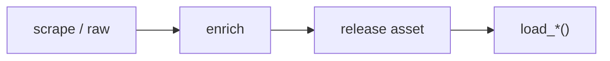

# PWHL dataset loaders



## Automation status

| Dataset | Release tag | Pipeline |
|---|---|---|
| `load_pwhl_game_info` | [pwhl_game_info](https://github.com/sportsdataverse/sportsdataverse-data/releases/tag/pwhl_game_info) | — |
| `load_pwhl_game_rosters` | [pwhl_game_rosters](https://github.com/sportsdataverse/sportsdataverse-data/releases/tag/pwhl_game_rosters) | — |
| `load_pwhl_goalie_boxscores` | [pwhl_goalie_boxscores](https://github.com/sportsdataverse/sportsdataverse-data/releases/tag/pwhl_goalie_boxscores) | — |
| `load_pwhl_officials` | [pwhl_officials](https://github.com/sportsdataverse/sportsdataverse-data/releases/tag/pwhl_officials) | — |
| `load_pwhl_pbp` | [pwhl_pbp](https://github.com/sportsdataverse/sportsdataverse-data/releases/tag/pwhl_pbp) | — |
| `load_pwhl_penalty_summary` | [pwhl_penalty_summary](https://github.com/sportsdataverse/sportsdataverse-data/releases/tag/pwhl_penalty_summary) | — |
| `load_pwhl_player_boxscores` | [pwhl_player_boxscores](https://github.com/sportsdataverse/sportsdataverse-data/releases/tag/pwhl_player_boxscores) | — |
| `load_pwhl_rosters` | [pwhl_rosters](https://github.com/sportsdataverse/sportsdataverse-data/releases/tag/pwhl_rosters) | — |
| `load_pwhl_schedules` | [pwhl_schedules](https://github.com/sportsdataverse/sportsdataverse-data/releases/tag/pwhl_schedules) | — |
| `load_pwhl_scoring_summary` | [pwhl_scoring_summary](https://github.com/sportsdataverse/sportsdataverse-data/releases/tag/pwhl_scoring_summary) | — |
| `load_pwhl_shootout` | [pwhl_shootout](https://github.com/sportsdataverse/sportsdataverse-data/releases/tag/pwhl_shootout) | — |
| `load_pwhl_shots_by_period` | [pwhl_shots_by_period](https://github.com/sportsdataverse/sportsdataverse-data/releases/tag/pwhl_shots_by_period) | — |
| `load_pwhl_skater_boxscores` | [pwhl_skater_boxscores](https://github.com/sportsdataverse/sportsdataverse-data/releases/tag/pwhl_skater_boxscores) | — |
| `load_pwhl_team_boxscores` | [pwhl_team_boxscores](https://github.com/sportsdataverse/sportsdataverse-data/releases/tag/pwhl_team_boxscores) | — |
| `load_pwhl_three_stars` | [pwhl_three_stars](https://github.com/sportsdataverse/sportsdataverse-data/releases/tag/pwhl_three_stars) | — |

## `load_pwhl_game_info`

Release: [pwhl_game_info](https://github.com/sportsdataverse/sportsdataverse-data/releases/tag/pwhl_game_info) · asset `https://github.com/sportsdataverse/sportsdataverse-data/releases/download/pwhl_game_info/game_info_{season}.parquet`
### Returns

| col_name | type |
|---|---|
| `game_id` | Int32 |
| `game_number` | String |
| `game_date` | String |
| `game_date_iso` | String |
| `start_time` | String |
| `end_time` | String |
| `game_duration` | String |
| `game_venue` | String |
| `attendance` | Int32 |
| `game_status` | String |
| `game_season_id` | Int32 |
| `started` | Int32 |
| `final` | Int32 |
| `home_team_id` | Int32 |
| `home_team` | String |
| `home_team_abbr` | String |
| `home_score` | Int32 |
| `away_team_id` | Int32 |
| `away_team` | String |
| `away_team_abbr` | String |
| `away_score` | Int32 |
| `has_shootout` | Int32 |
| `game_report_url` | String |
| `boxscore_url` | String |

```python
load_pwhl_game_info(seasons=2024)
```

## `load_pwhl_game_rosters`

Release: [pwhl_game_rosters](https://github.com/sportsdataverse/sportsdataverse-data/releases/tag/pwhl_game_rosters) · asset `https://github.com/sportsdataverse/sportsdataverse-data/releases/download/pwhl_game_rosters/game_rosters_{season}.parquet`
### Returns

| col_name | type |
|---|---|
| `game_id` | Int32 |
| `team_id` | Int32 |
| `team` | String |
| `team_abbr` | String |
| `team_side` | String |
| `player_type` | String |
| `player_id` | Int32 |
| `first_name` | String |
| `last_name` | String |
| `jersey_number` | Int32 |
| `position` | String |
| `birth_date` | String |
| `starting` | Int32 |
| `status` | String |

```python
load_pwhl_game_rosters(seasons=2024)
```

## `load_pwhl_goalie_boxscores`

Release: [pwhl_goalie_boxscores](https://github.com/sportsdataverse/sportsdataverse-data/releases/tag/pwhl_goalie_boxscores) · asset `https://github.com/sportsdataverse/sportsdataverse-data/releases/download/pwhl_goalie_boxscores/goalie_box_{season}.parquet`
### Returns

| col_name | type |
|---|---|
| `player_id` | String |
| `first_name` | String |
| `last_name` | String |
| `position` | String |
| `team_id` | Int32 |
| `game_id` | Int32 |
| `league` | String |
| `toi` | String |
| `time_on_ice` | Float64 |
| `saves` | Int32 |
| `goals_against` | Int32 |
| `shots_against` | Int32 |
| `goals` | Int32 |
| `assists` | Int32 |
| `points` | Int32 |
| `penalty_minutes` | Int32 |
| `faceoff_attempts` | Int32 |
| `faceoff_wins` | Int32 |
| `faceoff_losses` | Int32 |
| `faceoff_pct` | Boolean |
| `starting` | Int32 |

```python
load_pwhl_goalie_boxscores(seasons=2024)
```

## `load_pwhl_officials`

Release: [pwhl_officials](https://github.com/sportsdataverse/sportsdataverse-data/releases/tag/pwhl_officials) · asset `https://github.com/sportsdataverse/sportsdataverse-data/releases/download/pwhl_officials/officials_{season}.parquet`
### Returns

| col_name | type |
|---|---|
| `game_id` | Int32 |
| `role` | String |
| `first_name` | String |
| `last_name` | String |
| `jersey_number` | Int32 |
| `official_role` | String |

```python
load_pwhl_officials(seasons=2024)
```

## `load_pwhl_pbp`

Release: [pwhl_pbp](https://github.com/sportsdataverse/sportsdataverse-data/releases/tag/pwhl_pbp) · asset `https://github.com/sportsdataverse/sportsdataverse-data/releases/download/pwhl_pbp/play_by_play_{season}.parquet`
### Returns

| col_name | type |
|---|---|
| `game_id` | Int32 |
| `event` | String |
| `team_id` | Int32 |
| `period_of_game` | String |
| `time_of_period` | String |
| `player_id` | Int32 |
| `player_name_first` | String |
| `player_name_last` | String |
| `player_position` | String |
| `player_two_id` | Int32 |
| `player_two_name_first` | String |
| `player_two_name_last` | String |
| `player_two_position` | String |
| `x_coord` | Float64 |
| `y_coord` | Float64 |
| `home_win` | Int32 |
| `player_team_id` | Int32 |
| `event_type` | String |
| `shot_quality` | String |
| `goal` | Boolean |
| `goalie_id` | Int32 |
| `goalie_first` | String |
| `goalie_last` | String |
| `player_three_id` | Int32 |
| `player_three_name_first` | String |
| `player_three_name_last` | String |
| `player_three_position` | String |
| `empty_net` | String |
| `game_winner` | String |
| `penalty_shot` | String |
| `insurance` | String |
| `power_play` | Int32 |
| `short_handed` | String |
| `plus_player_one_id` | Int32 |
| `plus_player_one_first` | String |
| `plus_player_one_last` | String |
| `plus_player_one_position` | String |
| `plus_player_two_id` | Int32 |
| `plus_player_two_first` | String |
| `plus_player_two_last` | String |
| `plus_player_two_position` | String |
| `plus_player_three_id` | Int32 |
| `plus_player_three_first` | String |
| `plus_player_three_last` | String |
| `plus_player_three_position` | String |
| `plus_player_four_id` | Int32 |
| `plus_player_four_first` | String |
| `plus_player_four_last` | String |
| `plus_player_four_position` | String |
| `plus_player_five_id` | Int32 |
| `plus_player_five_first` | String |
| `plus_player_five_last` | String |
| `plus_player_five_position` | String |
| `minus_player_one_id` | Int32 |
| `minus_player_one_first` | String |
| `minus_player_one_last` | String |
| `minus_player_one_position` | String |
| `minus_player_two_id` | Int32 |
| `minus_player_two_first` | String |
| `minus_player_two_last` | String |
| `minus_player_two_position` | String |
| `minus_player_three_id` | Int32 |
| `minus_player_three_first` | String |
| `minus_player_three_last` | String |
| `minus_player_three_position` | String |
| `minus_player_four_id` | Int32 |
| `minus_player_four_first` | String |
| `minus_player_four_last` | String |
| `minus_player_four_position` | String |
| `minus_player_five_id` | Int32 |
| `minus_player_five_first` | String |
| `minus_player_five_last` | String |
| `minus_player_five_position` | String |
| `penalty_length` | String |
| `game_date` | String |
| `game_season` | Int32 |
| `game_season_id` | String |
| `home_team_id` | Int32 |
| `home_team` | String |
| `away_team_id` | Int32 |
| `away_team` | String |
| `x_coord_original` | Int32 |
| `y_coord_original` | Int32 |
| `x_coord_neutral` | Int32 |
| `y_coord_neutral` | Int32 |
| `x_coord_fixed` | Float64 |
| `y_coord_fixed` | Float64 |
| `x_coord_right` | Float64 |
| `y_coord_right` | Float64 |
| `x_coord_vertical` | Float64 |
| `y_coord_vertical` | Float64 |
| `minute_start` | Int32 |
| `second_start` | Int32 |
| `clock` | String |
| `sec_from_start` | Int32 |

```python
load_pwhl_pbp(seasons=2024)
```

## `load_pwhl_penalty_summary`

Release: [pwhl_penalty_summary](https://github.com/sportsdataverse/sportsdataverse-data/releases/tag/pwhl_penalty_summary) · asset `https://github.com/sportsdataverse/sportsdataverse-data/releases/download/pwhl_penalty_summary/penalty_summary_{season}.parquet`
### Returns

| col_name | type |
|---|---|
| `game_id` | Int32 |
| `period_id` | Int32 |
| `period` | String |
| `time` | String |
| `team_id` | Int32 |
| `team` | String |
| `team_abbr` | String |
| `game_penalty_id` | Int32 |
| `minutes` | Int32 |
| `description` | String |
| `rule_number` | String |
| `is_power_play` | Int32 |
| `is_bench` | Int32 |
| `taken_by_id` | Int32 |
| `taken_by_first` | String |
| `taken_by_last` | String |
| `taken_by_position` | String |
| `served_by_id` | Int32 |
| `served_by_first` | String |
| `served_by_last` | String |

```python
load_pwhl_penalty_summary(seasons=2024)
```

## `load_pwhl_player_boxscores`

Release: [pwhl_player_boxscores](https://github.com/sportsdataverse/sportsdataverse-data/releases/tag/pwhl_player_boxscores) · asset `https://github.com/sportsdataverse/sportsdataverse-data/releases/download/pwhl_player_boxscores/player_box_{season}.parquet`
### Returns

| col_name | type |
|---|---|
| `player_id` | String |
| `first_name` | String |
| `last_name` | String |
| `position` | String |
| `team_id` | Int32 |
| `game_id` | Int32 |
| `league` | String |
| `toi` | String |
| `time_on_ice` | Float64 |
| `goals` | Int32 |
| `assists` | Int32 |
| `points` | Int32 |
| `shots` | Int32 |
| `hits` | Int32 |
| `blocked_shots` | Int32 |
| `penalty_minutes` | Int32 |
| `plus_minus` | Int32 |
| `faceoff_attempts` | Int32 |
| `faceoff_wins` | Int32 |
| `faceoff_losses` | Int32 |
| `faceoff_pct` | Float64 |
| `starting` | Int32 |
| `player_type` | String |
| `saves` | Int32 |
| `goals_against` | Int32 |
| `shots_against` | Int32 |

```python
load_pwhl_player_boxscores(seasons=2024)
```

## `load_pwhl_rosters`

Release: [pwhl_rosters](https://github.com/sportsdataverse/sportsdataverse-data/releases/tag/pwhl_rosters) · asset `https://github.com/sportsdataverse/sportsdataverse-data/releases/download/pwhl_rosters/rosters_{season}.parquet`
### Returns

| col_name | type |
|---|---|
| `team_id` | Int32 |
| `team` | String |
| `team_abbr` | String |
| `team_side` | String |
| `player_type` | String |
| `player_id` | Int32 |
| `first_name` | String |
| `last_name` | String |
| `jersey_number` | Int32 |
| `position` | String |
| `birth_date` | String |
| `season` | Int32 |

```python
load_pwhl_rosters(seasons=2024)
```

## `load_pwhl_schedules`

Release: [pwhl_schedules](https://github.com/sportsdataverse/sportsdataverse-data/releases/tag/pwhl_schedules) · asset `https://github.com/sportsdataverse/sportsdataverse-data/releases/download/pwhl_schedules/pwhl_schedule_{season}.parquet`
### Returns

| col_name | type |
|---|---|
| `game_id` | String |
| `season` | Int32 |
| `game_date` | String |
| `game_status` | String |
| `home_team` | String |
| `home_team_id` | String |
| `away_team` | String |
| `away_team_id` | String |
| `home_score` | String |
| `away_score` | String |
| `winner` | String |
| `venue` | String |
| `venue_url` | String |
| `game_type` | String |
| `game_json` | Boolean |
| `game_json_url` | String |
| `PBP` | Boolean |
| `player_box` | Boolean |
| `skater_box` | Boolean |
| `goalie_box` | Boolean |
| `team_box` | Boolean |
| `game_info` | Boolean |
| `game_rosters` | Boolean |
| `scoring_summary` | Boolean |
| `penalty_summary` | Boolean |
| `three_stars` | Boolean |
| `officials` | Boolean |
| `shots_by_period` | Boolean |
| `shootout` | Boolean |

```python
load_pwhl_schedules(seasons=2024)
```

## `load_pwhl_scoring_summary`

Release: [pwhl_scoring_summary](https://github.com/sportsdataverse/sportsdataverse-data/releases/tag/pwhl_scoring_summary) · asset `https://github.com/sportsdataverse/sportsdataverse-data/releases/download/pwhl_scoring_summary/scoring_summary_{season}.parquet`
### Returns

| col_name | type |
|---|---|
| `game_id` | Int32 |
| `period_id` | Int32 |
| `period` | String |
| `time` | String |
| `team_id` | Int32 |
| `team` | String |
| `team_abbr` | String |
| `game_goal_id` | Int32 |
| `scorer_goal_number` | Int32 |
| `scorer_id` | Int32 |
| `scorer_first` | String |
| `scorer_last` | String |
| `scorer_position` | String |
| `assist_1_id` | Int32 |
| `assist_1_first` | String |
| `assist_1_last` | String |
| `assist_2_id` | Int32 |
| `assist_2_first` | String |
| `assist_2_last` | String |
| `is_power_play` | Int32 |
| `is_short_handed` | Int32 |
| `is_empty_net` | Int32 |
| `is_penalty_shot` | Int32 |
| `is_insurance` | Int32 |
| `is_game_winning` | Int32 |
| `x_location` | Boolean |
| `y_location` | Boolean |

```python
load_pwhl_scoring_summary(seasons=2024)
```

## `load_pwhl_shootout`

Release: [pwhl_shootout](https://github.com/sportsdataverse/sportsdataverse-data/releases/tag/pwhl_shootout) · asset `https://github.com/sportsdataverse/sportsdataverse-data/releases/download/pwhl_shootout/shootout_summary_{season}.parquet`
### Returns

| col_name | type |
|---|---|
| `game_id` | Int32 |
| `round` | Int32 |
| `team_side` | String |
| `shooter_id` | Int32 |
| `shooter_first` | String |
| `shooter_last` | String |
| `goalie_id` | Int32 |
| `goalie_first` | String |
| `goalie_last` | String |
| `is_goal` | Int32 |

```python
load_pwhl_shootout(seasons=2026)
```

## `load_pwhl_shots_by_period`

Release: [pwhl_shots_by_period](https://github.com/sportsdataverse/sportsdataverse-data/releases/tag/pwhl_shots_by_period) · asset `https://github.com/sportsdataverse/sportsdataverse-data/releases/download/pwhl_shots_by_period/shots_by_period_{season}.parquet`
### Returns

| col_name | type |
|---|---|
| `game_id` | Int32 |
| `period_id` | Int32 |
| `period` | String |
| `home_goals` | Int32 |
| `home_shots` | Int32 |
| `away_goals` | Int32 |
| `away_shots` | Int32 |

```python
load_pwhl_shots_by_period(seasons=2024)
```

## `load_pwhl_skater_boxscores`

Release: [pwhl_skater_boxscores](https://github.com/sportsdataverse/sportsdataverse-data/releases/tag/pwhl_skater_boxscores) · asset `https://github.com/sportsdataverse/sportsdataverse-data/releases/download/pwhl_skater_boxscores/skater_box_{season}.parquet`
### Returns

| col_name | type |
|---|---|
| `player_id` | String |
| `first_name` | String |
| `last_name` | String |
| `position` | String |
| `team_id` | Int32 |
| `game_id` | Int32 |
| `league` | String |
| `toi` | String |
| `time_on_ice` | Float64 |
| `goals` | Int32 |
| `assists` | Int32 |
| `points` | Int32 |
| `shots` | Int32 |
| `hits` | Int32 |
| `blocked_shots` | Int32 |
| `penalty_minutes` | Int32 |
| `plus_minus` | Int32 |
| `faceoff_attempts` | Int32 |
| `faceoff_wins` | Int32 |
| `faceoff_losses` | Int32 |
| `faceoff_pct` | Float64 |
| `starting` | Int32 |

```python
load_pwhl_skater_boxscores(seasons=2024)
```

## `load_pwhl_team_boxscores`

Release: [pwhl_team_boxscores](https://github.com/sportsdataverse/sportsdataverse-data/releases/tag/pwhl_team_boxscores) · asset `https://github.com/sportsdataverse/sportsdataverse-data/releases/download/pwhl_team_boxscores/team_box_{season}.parquet`
### Returns

| col_name | type |
|---|---|
| `game_id` | Int32 |
| `team_id` | Int32 |
| `team` | String |
| `team_abbr` | String |
| `team_side` | String |
| `shots` | Int32 |
| `goals` | Int32 |
| `hits` | Int32 |
| `pp_goals` | Int32 |
| `pp_opportunities` | Int32 |
| `goal_count` | Int32 |
| `assist_count` | Int32 |
| `penalty_minutes` | Int32 |
| `infraction_count` | Int32 |
| `faceoff_attempts` | Int32 |
| `faceoff_wins` | Int32 |
| `faceoff_win_pct` | Float64 |
| `season_wins` | Int32 |
| `season_losses` | Int32 |
| `season_ot_wins` | Int32 |
| `season_ot_losses` | Int32 |
| `season_so_losses` | Int32 |
| `season_record` | String |

```python
load_pwhl_team_boxscores(seasons=2024)
```

## `load_pwhl_three_stars`

Release: [pwhl_three_stars](https://github.com/sportsdataverse/sportsdataverse-data/releases/tag/pwhl_three_stars) · asset `https://github.com/sportsdataverse/sportsdataverse-data/releases/download/pwhl_three_stars/three_stars_{season}.parquet`
### Returns

| col_name | type |
|---|---|
| `game_id` | Int32 |
| `star` | Int32 |
| `team_id` | Int32 |
| `team` | String |
| `team_abbr` | String |
| `player_id` | Int32 |
| `first_name` | String |
| `last_name` | String |
| `jersey_number` | Int32 |
| `position` | String |
| `is_goalie` | Int32 |
| `is_home` | Int32 |
| `goals` | Int32 |
| `assists` | Int32 |
| `points` | Int32 |
| `shots` | Int32 |
| `saves` | Int32 |
| `shots_against` | Int32 |
| `goals_against` | Int32 |
| `time_on_ice` | String |

```python
load_pwhl_three_stars(seasons=2024)
```
