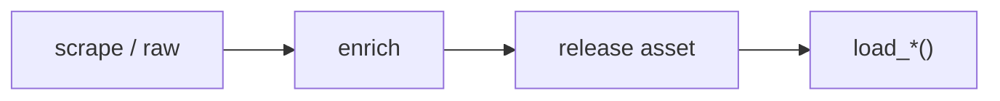

# WBB dataset loaders



## Automation status

| Dataset | Release tag | Pipeline |
|---|---|---|
| `load_wbb_pbp` | [espn_womens_college_basketball_pbp](https://github.com/sportsdataverse/sportsdataverse-data/releases/tag/espn_womens_college_basketball_pbp) | — |
| `load_wbb_player_boxscore` | [espn_womens_college_basketball_player_boxscores](https://github.com/sportsdataverse/sportsdataverse-data/releases/tag/espn_womens_college_basketball_player_boxscores) | — |
| `load_wbb_schedule` | [espn_womens_college_basketball_schedules](https://github.com/sportsdataverse/sportsdataverse-data/releases/tag/espn_womens_college_basketball_schedules) | — |
| `load_wbb_team_boxscore` | [espn_womens_college_basketball_team_boxscores](https://github.com/sportsdataverse/sportsdataverse-data/releases/tag/espn_womens_college_basketball_team_boxscores) | — |
| `load_wbb_ratings` | [wbb_ratings](https://github.com/sportsdataverse/sportsdataverse-data/releases/tag/wbb_ratings) | — |
| `load_wbb_player_value` | [wbb_player_value](https://github.com/sportsdataverse/sportsdataverse-data/releases/tag/wbb_player_value) | — |
| `load_wbb_game_rosters` | [espn_womens_college_basketball_game_rosters](https://github.com/sportsdataverse/sportsdataverse-data/releases/tag/espn_womens_college_basketball_game_rosters) | — |
| `load_wbb_officials` | [espn_womens_college_basketball_officials](https://github.com/sportsdataverse/sportsdataverse-data/releases/tag/espn_womens_college_basketball_officials) | — |
| `load_wbb_player_season_stats` | [espn_womens_college_basketball_player_season_stats](https://github.com/sportsdataverse/sportsdataverse-data/releases/tag/espn_womens_college_basketball_player_season_stats) | — |
| `load_wbb_rosters` | [espn_womens_college_basketball_rosters](https://github.com/sportsdataverse/sportsdataverse-data/releases/tag/espn_womens_college_basketball_rosters) | — |
| `load_wbb_shots` | [espn_womens_college_basketball_shots](https://github.com/sportsdataverse/sportsdataverse-data/releases/tag/espn_womens_college_basketball_shots) | — |
| `load_wbb_standings` | [espn_womens_college_basketball_standings](https://github.com/sportsdataverse/sportsdataverse-data/releases/tag/espn_womens_college_basketball_standings) | — |
| `load_wbb_team_season_stats` | [espn_womens_college_basketball_team_season_stats](https://github.com/sportsdataverse/sportsdataverse-data/releases/tag/espn_womens_college_basketball_team_season_stats) | — |
| `load_wbb_player_crosswalk` | [wbb_crosswalk](https://github.com/sportsdataverse/sportsdataverse-data/releases/tag/wbb_crosswalk) | — |
| `load_wbb_schedule_crosswalk` | [wbb_crosswalk](https://github.com/sportsdataverse/sportsdataverse-data/releases/tag/wbb_crosswalk) | — |
| `load_wbb_team_crosswalk` | [wbb_crosswalk](https://github.com/sportsdataverse/sportsdataverse-data/releases/tag/wbb_crosswalk) | — |
| `load_wbb_player_core` | [espn_womens_college_basketball_player_core](https://github.com/sportsdataverse/sportsdataverse-data/releases/tag/espn_womens_college_basketball_player_core) | — |
| `load_ncaa_wbb_pbp` | [ncaa_wbb_pbp](https://github.com/sportsdataverse/sportsdataverse-data/releases/tag/ncaa_wbb_pbp) | — |
| `load_ncaa_wbb_schedule` | [ncaa_wbb_schedule](https://github.com/sportsdataverse/sportsdataverse-data/releases/tag/ncaa_wbb_schedule) | — |
| `load_ncaa_wbb_player_box` | [ncaa_wbb_player_box](https://github.com/sportsdataverse/sportsdataverse-data/releases/tag/ncaa_wbb_player_box) | — |
| `load_ncaa_wbb_team_box` | [ncaa_wbb_team_box](https://github.com/sportsdataverse/sportsdataverse-data/releases/tag/ncaa_wbb_team_box) | — |
| `load_ncaa_wbb_rosters` | [ncaa_wbb_rosters](https://github.com/sportsdataverse/sportsdataverse-data/releases/tag/ncaa_wbb_rosters) | — |
| `load_ncaa_wbb_team_rosters` | [ncaa_wbb_team_rosters](https://github.com/sportsdataverse/sportsdataverse-data/releases/tag/ncaa_wbb_team_rosters) | — |
| `load_ncaa_wbb_team_ids` | [ncaa_wbb_team_ids](https://github.com/sportsdataverse/sportsdataverse-data/releases/tag/ncaa_wbb_team_ids) | — |
| `load_ncaa_wbb_possessions` | [ncaa_wbb_possessions](https://github.com/sportsdataverse/sportsdataverse-data/releases/tag/ncaa_wbb_possessions) | — |
| `load_ncaa_wbb_lineups` | [ncaa_wbb_lineups](https://github.com/sportsdataverse/sportsdataverse-data/releases/tag/ncaa_wbb_lineups) | — |
| `load_ncaa_wbb_matchup_stints` | [ncaa_wbb_matchup_stints](https://github.com/sportsdataverse/sportsdataverse-data/releases/tag/ncaa_wbb_matchup_stints) | — |
| `load_ncaa_wbb_shots` | [ncaa_wbb_shots](https://github.com/sportsdataverse/sportsdataverse-data/releases/tag/ncaa_wbb_shots) | — |
| `load_ncaa_wbb_rapm_within_team` | [ncaa_wbb_rapm_within_team](https://github.com/sportsdataverse/sportsdataverse-data/releases/tag/ncaa_wbb_rapm_within_team) | — |

## `load_wbb_pbp`

Release: [espn_womens_college_basketball_pbp](https://github.com/sportsdataverse/sportsdataverse-data/releases/tag/espn_womens_college_basketball_pbp) · asset `https://github.com/sportsdataverse/sportsdataverse-data/releases/download/espn_womens_college_basketball_pbp/play_by_play_{season}.parquet`
### Returns

| col_name | type | description |
|---|---|---|
| `game_play_number` | Int32 | Game play number |
| `id` | Int64 | Unique play identification number |
| `sequence_number` | Int32 | Sequence number representing a shot-possession (V3 PBP). |
| `type_id` | Int32 | Type identifier (numeric). |
| `type_text` | String | Play type text, passed through verbatim from ESPN. ESPN labels the free-throw play type "MadeFreeThrow" for made AND missed free throws; filter makes vs. misses with scoring_play, not type_text. |
| `text` | String | Text description of the play / record. |
| `away_score` | Int32 | Away team score at the time of the play. |
| `home_score` | Int32 | Home team score at the time of the play. |
| `period_number` | Int32 | Numeric period (1-4 for quarters; 5+ for OT). |
| `period_display_value` | String | Period display label (e.g. '1st Quarter', 'OT'). |
| `clock_display_value` | String | Game clock display string (e.g. '8:32'). |
| `scoring_play` | Boolean | TRUE if the play resulted in points scored. |
| `score_value` | Int32 | Point value of the attempt (1 / 2 / 3), carried even on misses (a missed free throw still shows 1); use scoring_play to identify points actually scored. |
| `wallclock` | String | Wallclock. |
| `shooting_play` | Boolean | TRUE if the play was a shooting attempt. |
| `coordinate_x_raw` | Float64 | X coordinate as returned by the API before any adjustment. |
| `coordinate_y_raw` | Float64 | Y coordinate as returned by the API before any adjustment. |
| `points_attempted` | Int32 |  |
| `short_description` | String |  |
| `team_id` | Int32 | Unique team identifier. |
| `athlete_id_1` | Int32 | Primary athlete identifier (e.g. shooter). |
| `athlete_id_2` | Int32 | Secondary athlete identifier (e.g. assister / fouler). |
| `game_id` | Int32 | Unique game identifier. |
| `season` | Int32 | Season identifier (4-digit year or 'YYYY-YY' string). |
| `season_type` | Int32 | Season type (1=pre-season, 2=regular season, 3=postseason, 4=off-season for ESPN; or string label for WNBA Stats). |
| `home_team_id` | Int32 | Unique identifier for the home team. |
| `home_team_name` | String | Home team name. |
| `home_team_mascot` | String | Home team mascot. |
| `home_team_abbrev` | String | Home team three-letter abbreviation. |
| `home_team_name_alt` | String | Alternate versions of the home team abbreviation |
| `away_team_id` | Int32 | Unique identifier for the away team. |
| `away_team_name` | String | Away team name. |
| `away_team_mascot` | String | Away team mascot. |
| `away_team_abbrev` | String | Away team three-letter abbreviation. |
| `away_team_name_alt` | String | Alternate versions of the away team abbreviation |
| `game_spread` | Float64 | Game spread in (-X Team) format. There are almost none, I would recommend not trusting any of these three columns |
| `home_favorite` | Boolean | Logical (TRUE/FALSE) indicating whether the home team is favored |
| `game_spread_available` | Boolean | Logical (TRUE/FALSE) indicating whether the spread was available from ESPN. Basically, I would just not recommend using any of the spread information, I think I defaulted a lot of them to -2.5 for the home team. Most games probably do not have spread information. This column should really be listed first |
| `home_team_spread` | Float64 | The game spread with respect to the home team |
| `qtr` | Int32 | Quarter of the game |
| `time` | String | Time left within the period |
| `clock_minutes` | Int32 | Clock minutes split from seconds for developer convenience |
| `clock_seconds` | Int32 | Clock seconds split from minutes for developer convenience |
| `home_timeout_called` | Boolean |  |
| `away_timeout_called` | Boolean |  |
| `half` | Int32 | Half of the game |
| `game_half` | Int32 | Half of the game |
| `lag_qtr` | Int32 | A lag column on the quarter |
| `lead_qtr` | Int32 | A lead column on the quarter |
| `lag_half` | Int32 | A lag column on the half |
| `lead_half` | Int32 | A lead column on the half |
| `start_quarter_seconds_remaining` | Int32 | Quarter seconds remaining at the start of the play (these are more or less code artifacts from other sports, but may eventually be used more seriously) |
| `start_half_seconds_remaining` | Int32 | Game half seconds remaining at the start of the play (these are more or less code artifacts from other sports, but may eventually be used more seriously) |
| `start_game_seconds_remaining` | Int32 | Game seconds remaining at the start of the play (''') |
| `end_quarter_seconds_remaining` | Int32 | Quarter seconds remaining at the end of the play (''') |
| `end_half_seconds_remaining` | Int32 | Game half seconds remaining at the end of the play (''') |
| `end_game_seconds_remaining` | Int32 | Game seconds remaining at the end of the play (''') |
| `period` | Int32 | Period of the game (1-4 quarters; 5+ for OT). |
| `coordinate_x` | Float64 | X coordinate on the court (half-court layout). |
| `coordinate_y` | Float64 | Y coordinate on the court (half-court layout). |
| `game_date` | Date | Game date (YYYY-MM-DD). |
| `game_date_time` | Datetime(time_unit='us', time_zone='America/New_York') | Game start date/time (ISO 8601). |
| `athlete_name_1` | String |  |
| `athlete_name_2` | String |  |
| `athlete_name_3` | String |  |

```python
load_wbb_pbp(seasons=2024)
```

## `load_wbb_player_boxscore`

Release: [espn_womens_college_basketball_player_boxscores](https://github.com/sportsdataverse/sportsdataverse-data/releases/tag/espn_womens_college_basketball_player_boxscores) · asset `https://github.com/sportsdataverse/sportsdataverse-data/releases/download/espn_womens_college_basketball_player_boxscores/player_box_{season}.parquet`
### Returns

| col_name | type | description |
|---|---|---|
| `game_id` | Int32 | Unique game identifier. |
| `season` | Int32 | Season identifier (4-digit year or 'YYYY-YY' string). |
| `season_type` | Int32 | Season type (1=pre-season, 2=regular season, 3=postseason, 4=off-season for ESPN; or string label for WNBA Stats). |
| `game_date` | Date | Game date (YYYY-MM-DD). |
| `game_date_time` | Datetime(time_unit='us', time_zone='America/New_York') | Game start date/time (ISO 8601). |
| `athlete_id` | Int32 | Unique athlete identifier (ESPN). |
| `athlete_display_name` | String | Athlete display name (full). |
| `team_id` | Int32 | Unique team identifier. |
| `team_name` | String | Full team display name (e.g. 'Las Vegas Aces'). |
| `team_location` | String | Team city or location string. |
| `team_short_display_name` | String | Short team display name (e.g. 'Aces'). |
| `minutes` | Float64 | Minutes played, formatted MM:SS (V3 PT-duration parsed) or decimal minutes (V2). |
| `field_goals_made` | Int32 | Field goals made (2-pt + 3-pt). |
| `field_goals_attempted` | Int32 | Field goal attempts (2-pt + 3-pt). |
| `three_point_field_goals_made` | Int32 | Three-point field goals made. |
| `three_point_field_goals_attempted` | Int32 | Three-point field goal attempts. |
| `free_throws_made` | Int32 | Free throws made. |
| `free_throws_attempted` | Int32 | Free throw attempts. |
| `offensive_rebounds` | Int32 | Offensive rebounds. |
| `defensive_rebounds` | Int32 | Defensive rebounds. |
| `rebounds` | Int32 | Total rebounds. |
| `assists` | Int32 | Total assists. |
| `steals` | Int32 | Total steals. |
| `blocks` | Int32 | Total blocks. |
| `turnovers` | Int32 | Total turnovers. |
| `fouls` | Int32 | Personal fouls. |
| `points` | Int32 | Points scored. |
| `starter` | Boolean | TRUE if the player was in the starting lineup; FALSE otherwise. |
| `ejected` | Boolean | TRUE if the player was ejected from the game. |
| `did_not_play` | Boolean | TRUE if the player did not appear in the game. |
| `active` | Boolean | TRUE if the row represents an active record (player / team / season). |
| `athlete_jersey` | String | Athlete jersey number. |
| `athlete_short_name` | String | Athlete short display name. |
| `athlete_headshot_href` | String | Athlete headshot image URL. |
| `athlete_position_name` | String | Athlete position ('Guard', 'Forward', 'Center'). |
| `athlete_position_abbreviation` | String | Athlete position abbreviation (G / F / C). |
| `team_display_name` | String | Full team display name. |
| `team_uid` | String | ESPN universal team identifier (UID format 's:40~l:...~t:...'). |
| `team_slug` | String | URL-safe team identifier (e.g. 'lasvegas-aces' / 'aces'). |
| `team_logo` | String | Team logo image URL. |
| `team_abbreviation` | String | Short team abbreviation (e.g. 'LAS'). |
| `team_color` | String | Team primary color (hex without leading '#'). |
| `team_alternate_color` | String | Team alternate color (hex without leading '#'). |
| `home_away` | String | Game venue label ('home' or 'away'). |
| `team_winner` | Boolean | TRUE if the team won this game. |
| `team_score` | Int32 | Team's score / final score. |
| `opponent_team_id` | Int32 | Unique identifier for the opponent team. |
| `opponent_team_name` | String | Opponent team display name. |
| `opponent_team_location` | String | Opponent team city / location. |
| `opponent_team_display_name` | String | Opponent team full display name. |
| `opponent_team_abbreviation` | String | Opponent team abbreviation. |
| `opponent_team_logo` | String | Opponent team logo URL. |
| `opponent_team_color` | String | Opponent team primary color (hex). |
| `opponent_team_alternate_color` | String | Opponent team alternate color (hex). |
| `opponent_team_score` | Int32 | Opponent team's score. |

```python
load_wbb_player_boxscore(seasons=2024)
```

## `load_wbb_schedule`

Release: [espn_womens_college_basketball_schedules](https://github.com/sportsdataverse/sportsdataverse-data/releases/tag/espn_womens_college_basketball_schedules) · asset `https://github.com/sportsdataverse/sportsdataverse-data/releases/download/espn_womens_college_basketball_schedules/wbb_schedule_{season}.parquet`
### Returns

| col_name | type | description |
|---|---|---|
| `id` | Int32 | Unique play identification number |
| `uid` | String | ESPN UID string. |
| `date` | String | Date in YYYY-MM-DD format. |
| `attendance` | Float64 | Reported attendance. |
| `time_valid` | Boolean | Time valid. |
| `neutral_site` | Boolean | Neutral site. |
| `conference_competition` | Boolean | Conference competition. |
| `play_by_play_available` | Boolean | Whether play-by-play data is available. |
| `recent` | Boolean | Recent. |
| `start_date` | String | Start date (YYYY-MM-DD). |
| `broadcast` | String | Broadcast information string. |
| `highlights` | String | Game highlight urls. |
| `notes_type` | String | Notes type. |
| `notes_headline` | String | Notes headline. |
| `broadcast_market` | String | Broadcast market label (e.g. 'national', 'home'). |
| `broadcast_name` | String | Broadcast name. |
| `type_id` | Int32 | Type identifier (numeric). |
| `type_abbreviation` | String | Play type abbreviation |
| `venue_id` | Int32 | Unique venue identifier. |
| `venue_full_name` | String | Venue full name. |
| `venue_address_city` | String | Venue address city. |
| `venue_address_state` | String | Venue address state / region. |
| `venue_indoor` | Boolean | TRUE if the venue is indoors. |
| `status_clock` | Float64 | Status clock. |
| `status_display_clock` | String | Status display clock. |
| `status_period` | Float64 | Status period. |
| `status_type_id` | Int32 | Unique identifier for status type. |
| `status_type_name` | String | Status type name. |
| `status_type_state` | String | Status type state. |
| `status_type_completed` | Boolean | Status type completed. |
| `status_type_description` | String | Status type description. |
| `status_type_detail` | String | Status type detail. |
| `status_type_short_detail` | String | Status type short detail. |
| `format_regulation_periods` | Float64 | Format regulation periods. |
| `home_id` | Int32 | Unique identifier for home. |
| `home_uid` | String | Home team's uid. |
| `home_location` | String | Home team's location. |
| `home_name` | String | Home name. |
| `home_abbreviation` | String | Home team's abbreviation. |
| `home_display_name` | String | Home display name. |
| `home_short_display_name` | String | Home short display name. |
| `home_color` | String | Color code (hex) for home. |
| `home_alternate_color` | String | Color code (hex) for home alternate. |
| `home_is_active` | Boolean | Home team's is active. |
| `home_venue_id` | Int32 | Unique identifier for home venue. |
| `home_logo` | String | Home team logo URL. |
| `home_conference_id` | Int32 | Unique identifier for home conference. |
| `home_score` | Int32 | Home team score at the time of the play. |
| `home_winner` | Boolean | Home team's winner. |
| `home_current_rank` | Float64 |  |
| `home_linescores` | String |  |
| `home_records` | String |  |
| `away_id` | Int32 | Unique identifier for away. |
| `away_uid` | String | Away team's uid. |
| `away_location` | String | Away team's location. |
| `away_name` | String | Away name. |
| `away_abbreviation` | String | Away team's abbreviation. |
| `away_display_name` | String | Away display name. |
| `away_short_display_name` | String | Away short display name. |
| `away_color` | String | Color code (hex) for away. |
| `away_alternate_color` | String | Color code (hex) for away alternate. |
| `away_is_active` | Boolean | Away team's is active. |
| `away_venue_id` | Int32 | Unique identifier for away venue. |
| `away_logo` | String | Away team logo URL. |
| `away_conference_id` | Int32 | Unique identifier for away conference. |
| `away_score` | Int32 | Away team score at the time of the play. |
| `away_winner` | Boolean | Away team's winner. |
| `away_current_rank` | Float64 |  |
| `away_linescores` | String |  |
| `away_records` | String |  |
| `game_id` | Int32 | Unique game identifier. |
| `season` | Int32 | Season identifier (4-digit year or 'YYYY-YY' string). |
| `season_type` | Int32 | Season type (1=pre-season, 2=regular season, 3=postseason, 4=off-season for ESPN; or string label for WNBA Stats). |
| `status_type_alt_detail` | String | Status type alt detail. |
| `tournament_id` | Int32 | ESPN tournament identifier. |
| `groups_id` | Int32 | Unique identifier for groups. |
| `groups_name` | String | Groups name. |
| `groups_short_name` | String | Groups short name. |
| `groups_is_conference` | Boolean | Groups is conference. |
| `game_json` | Boolean | Whether processed game JSON is available. |
| `game_json_url` | String | URL to the processed game JSON. |
| `game_date_time` | Datetime(time_unit='us', time_zone='America/New_York') | Game start date/time (ISO 8601). |
| `game_date` | Date | Game date (YYYY-MM-DD). |
| `PBP` | Boolean | Whether play-by-play data is available. |
| `team_box` | Boolean | Team box. |
| `player_box` | Boolean | Player box. |

```python
load_wbb_schedule(seasons=2024)
```

## `load_wbb_team_boxscore`

Release: [espn_womens_college_basketball_team_boxscores](https://github.com/sportsdataverse/sportsdataverse-data/releases/tag/espn_womens_college_basketball_team_boxscores) · asset `https://github.com/sportsdataverse/sportsdataverse-data/releases/download/espn_womens_college_basketball_team_boxscores/team_box_{season}.parquet`
### Returns

| col_name | type | description |
|---|---|---|
| `game_id` | Int32 | Unique game identifier. |
| `season` | Int32 | Season identifier (4-digit year or 'YYYY-YY' string). |
| `season_type` | Int32 | Season type (1=pre-season, 2=regular season, 3=postseason, 4=off-season for ESPN; or string label for WNBA Stats). |
| `game_date` | Date | Game date (YYYY-MM-DD). |
| `game_date_time` | Datetime(time_unit='us', time_zone='America/New_York') | Game start date/time (ISO 8601). |
| `team_id` | Int32 | Unique team identifier. |
| `team_uid` | String | ESPN universal team identifier (UID format 's:40~l:...~t:...'). |
| `team_slug` | String | URL-safe team identifier (e.g. 'lasvegas-aces' / 'aces'). |
| `team_location` | String | Team city or location string. |
| `team_name` | String | Full team display name (e.g. 'Las Vegas Aces'). |
| `team_abbreviation` | String | Short team abbreviation (e.g. 'LAS'). |
| `team_display_name` | String | Full team display name. |
| `team_short_display_name` | String | Short team display name (e.g. 'Aces'). |
| `team_color` | String | Team primary color (hex without leading '#'). |
| `team_alternate_color` | String | Team alternate color (hex without leading '#'). |
| `team_logo` | String | Team logo image URL. |
| `team_home_away` | String | Team home away. |
| `team_score` | Int32 | Team's score / final score. |
| `team_winner` | Boolean | TRUE if the team won this game. |
| `assists` | Int32 | Total assists. |
| `blocks` | Int32 | Total blocks. |
| `defensive_rebounds` | Int32 | Defensive rebounds. |
| `fast_break_points` | String | Fast-break points scored. |
| `field_goal_pct` | Float64 | Field goal percentage (0-1). |
| `field_goals_made` | Int32 | Field goals made (2-pt + 3-pt). |
| `field_goals_attempted` | Int32 | Field goal attempts (2-pt + 3-pt). |
| `fouls` | Int32 | Personal fouls. |
| `free_throw_pct` | Float64 | Free throw percentage (0-1). |
| `free_throws_made` | Int32 | Free throws made. |
| `free_throws_attempted` | Int32 | Free throw attempts. |
| `largest_lead` | String | Largest lead during the game. |
| `lead_changes` | String | Lead changes. |
| `lead_percentage` | String |  |
| `offensive_rebounds` | Int32 | Offensive rebounds. |
| `points_in_paint` | String | Points scored in the paint. |
| `steals` | Int32 | Total steals. |
| `team_turnovers` | Int32 | Team turnovers (turnovers credited to the team rather than a player). |
| `technical_fouls` | Int32 | Total technical fouls. |
| `three_point_field_goal_pct` | Float64 | Three-point field goal percentage (0-1). |
| `three_point_field_goals_made` | Int32 | Three-point field goals made. |
| `three_point_field_goals_attempted` | Int32 | Three-point field goal attempts. |
| `total_rebounds` | Int32 | Total rebounds. |
| `total_technical_fouls` | Int32 | Total technical fouls (player + team). |
| `total_turnovers` | Int32 | Total turnovers (player + team). |
| `turnover_points` | String | Turnover points. |
| `turnovers` | Int32 | Total turnovers. |
| `opponent_team_id` | Int32 | Unique identifier for the opponent team. |
| `opponent_team_uid` | String | Opponent team uid. |
| `opponent_team_slug` | String | Opponent team slug. |
| `opponent_team_location` | String | Opponent team city / location. |
| `opponent_team_name` | String | Opponent team display name. |
| `opponent_team_abbreviation` | String | Opponent team abbreviation. |
| `opponent_team_display_name` | String | Opponent team full display name. |
| `opponent_team_short_display_name` | String | Opponent team short display name. |
| `opponent_team_color` | String | Opponent team primary color (hex). |
| `opponent_team_alternate_color` | String | Opponent team alternate color (hex). |
| `opponent_team_logo` | String | Opponent team logo URL. |
| `opponent_team_score` | Int32 | Opponent team's score. |

```python
load_wbb_team_boxscore(seasons=2024)
```

## `load_wbb_ratings`

Release: [wbb_ratings](https://github.com/sportsdataverse/sportsdataverse-data/releases/tag/wbb_ratings) · asset `https://github.com/sportsdataverse/sportsdataverse-data/releases/download/wbb_ratings/wbb_ratings_{season}.parquet`
### Returns

| col_name | type | description |
|---|---|---|
| `season` | Int64 | Season identifier (4-digit year or 'YYYY-YY' string). |
| `team_id` | String | Unique team identifier. |
| `adj_o` | Float64 | Adj o. |
| `adj_d` | Float64 | Adj d. |
| `adj_em` | Float64 | Adj em. |
| `adj_tempo` | Float64 | Opponent-adjusted tempo in possessions per 40 minutes, produced by the same fixed-point adjustment as the efficiencies applied to game possessions under the additive model poss = tempo_i + tempo_j minus the league baseline. |
| `raw_o` | Float64 | Raw o. |
| `raw_d` | Float64 | Raw d. |
| `games` | Int64 | Games played. |
| `rank` | Int64 | Whether to include statistical ranks in the returned table. |
| `adj_em_z` | Float64 | Within-season z-score of adj_em, computed as adj_em minus the season mean divided by the season standard deviation over every team in the frame, so it is mean 0 and standard deviation 1 per season. |

```python
load_wbb_ratings(seasons=2025)
```

## `load_wbb_player_value`

Release: [wbb_player_value](https://github.com/sportsdataverse/sportsdataverse-data/releases/tag/wbb_player_value) · asset `https://github.com/sportsdataverse/sportsdataverse-data/releases/download/wbb_player_value/wbb_player_value_{season}.parquet`
### Returns

| col_name | type | description |
|---|---|---|
| `player_id` | String | Unique player identifier. |
| `player` | String | Player name. |
| `season` | Int64 | Season identifier (4-digit year or 'YYYY-YY' string). |
| `team_id` | String | Unique team identifier. |
| `min` | Float64 | Minutes played. |
| `box_obpm` | Float64 | Box-score offensive plus/minus for the player, the offensive half of box BPM. |
| `box_dbpm` | Float64 | Box-score defensive plus/minus for the player, the defensive half of box BPM. |
| `box_bpm` | Float64 | Total box plus/minus in points per 100 possessions above average, exactly box_obpm plus box_dbpm in every published row. |

```python
load_wbb_player_value(seasons=2025)
```

## `load_wbb_game_rosters`

Release: [espn_womens_college_basketball_game_rosters](https://github.com/sportsdataverse/sportsdataverse-data/releases/tag/espn_womens_college_basketball_game_rosters) · asset `https://github.com/sportsdataverse/sportsdataverse-data/releases/download/espn_womens_college_basketball_game_rosters/game_rosters_{season}.parquet`
### Returns

| col_name | type | description |
|---|---|---|
| `season` | Int32 | Season identifier (4-digit year or 'YYYY-YY' string). |
| `game_id` | String | Unique game identifier. |
| `team_id` | Int32 | Unique team identifier. |
| `team_slug` | String | URL-safe team identifier (e.g. 'lasvegas-aces' / 'aces'). |
| `team_abbreviation` | String | Short team abbreviation (e.g. 'LAS'). |
| `team_display_name` | String | Full team display name. |
| `home_away` | String | Game venue label ('home' or 'away'). |
| `athlete_id` | Int32 | Unique athlete identifier (ESPN). |
| `athlete_uid` | String | ESPN athlete UID (universal identifier). |
| `athlete_guid` | String | ESPN athlete GUID. |
| `athlete_display_name` | String | Athlete display name (full). |
| `athlete_short_name` | String | Athlete short display name. |
| `athlete_first_name` | String | Player first name; `athlete_detail = TRUE` only. |
| `athlete_last_name` | String | Athlete last name. |
| `athlete_jersey` | String | Athlete jersey number. |
| `athlete_position` | String | Athlete position. |
| `athlete_headshot` | String | URL of the player's ESPN headshot image on a.espncdn.com, whose filename is the athlete_id; null when ESPN publishes no headshot for that player. |
| `starter` | Boolean | TRUE if the player was in the starting lineup; FALSE otherwise. |
| `did_not_play` | Boolean | TRUE if the player did not appear in the game. |
| `active` | Boolean | TRUE if the row represents an active record (player / team / season). |
| `ejected` | Boolean | TRUE if the player was ejected from the game. |
| `reason` | String | Reason. |

```python
load_wbb_game_rosters(seasons=2026)
```

## `load_wbb_officials`

Release: [espn_womens_college_basketball_officials](https://github.com/sportsdataverse/sportsdataverse-data/releases/tag/espn_womens_college_basketball_officials) · asset `https://github.com/sportsdataverse/sportsdataverse-data/releases/download/espn_womens_college_basketball_officials/officials_{season}.parquet`
### Returns

| col_name | type | description |
|---|---|---|
| `season` | Int32 | Season identifier (4-digit year or 'YYYY-YY' string). |
| `game_id` | String | Unique game identifier. |
| `official_id` | Int32 | Unique official / referee identifier. |
| `official_uid` | String | ESPN's globally unique resource identifier for the official, read from the core-api items[] uid key; that payload never ships it, so the column is null for every published row. |
| `official_full_name` | String | ESPN's fullName for the official, falling back to displayName when fullName is absent; ESPN sometimes ships it with a middle initial or a doubled internal space, so it is not simply first plus last name. |
| `official_display_name` | String | ESPN's displayName for the official, which is identical to official_full_name in every published row of the released data. |
| `official_first_name` | String | The official's given name as ESPN splits it out separately from the full name, excluding any middle initial that appears in official_full_name. |
| `official_last_name` | String | The official's surname as ESPN splits it out; joined to official_first_name it reconstructs roughly 98 percent of official_full_name values, the rest differing by middle initials or spacing. |
| `official_order` | Int32 | ESPN's 1-based sequence of the official within that game's crew listing, unique within a game and running 1 to 3 for the standard three-person crew. |
| `position_name` | String | Listed roster position ('Guard', 'Forward', 'Center'). |
| `position_display_name` | String | Position display name. |

```python
load_wbb_officials(seasons=2026)
```

## `load_wbb_player_season_stats`

Release: [espn_womens_college_basketball_player_season_stats](https://github.com/sportsdataverse/sportsdataverse-data/releases/tag/espn_womens_college_basketball_player_season_stats) · asset `https://github.com/sportsdataverse/sportsdataverse-data/releases/download/espn_womens_college_basketball_player_season_stats/player_season_stats_{season}.parquet`
### Returns

| col_name | type | description |
|---|---|---|
| `season` | Int32 | Season identifier (4-digit year or 'YYYY-YY' string). |
| `athlete_id` | Int32 | Unique athlete identifier (ESPN). |
| `athlete_display_name` | String | Athlete display name (full). |
| `athlete_first_name` | String | Player first name; `athlete_detail = TRUE` only. |
| `athlete_last_name` | String | Athlete last name. |
| `athlete_position_abbreviation` | String | Athlete position abbreviation (G / F / C). |
| `athlete_jersey` | String | Athlete jersey number. |
| `team_id` | Int32 | Unique team identifier. |
| `team_display_name` | String | Full team display name. |
| `category` | String | Category label. |
| `stat_label` | String | Human-readable label of the statistic (e.g. 'At bats'). |
| `stat_name` | String | Internal stat key. |
| `stat_display_name` | String | Stat display name. |
| `stat_description` | String | ESPN's prose definition of the statistic named in stat_name, for example The average assists per game for avgAssists; combined made-attempted stats carry both definitions joined by a hyphen. |
| `display_value` | String | Display-formatted value. |
| `value` | Float64 | Numeric or string value field. |

```python
load_wbb_player_season_stats(seasons=2026)
```

## `load_wbb_rosters`

Release: [espn_womens_college_basketball_rosters](https://github.com/sportsdataverse/sportsdataverse-data/releases/tag/espn_womens_college_basketball_rosters) · asset `https://github.com/sportsdataverse/sportsdataverse-data/releases/download/espn_womens_college_basketball_rosters/rosters_{season}.parquet`
### Returns

| col_name | type | description |
|---|---|---|
| `season` | Int32 | Season identifier (4-digit year or 'YYYY-YY' string). |
| `team_id` | Int32 | Unique team identifier. |
| `team_slug` | String | URL-safe team identifier (e.g. 'lasvegas-aces' / 'aces'). |
| `team_abbreviation` | String | Short team abbreviation (e.g. 'LAS'). |
| `team_display_name` | String | Full team display name. |
| `team_short_display_name` | String | Short team display name (e.g. 'Aces'). |
| `team_color` | String | Team primary color (hex without leading '#'). |
| `team_alternate_color` | String | Team alternate color (hex without leading '#'). |
| `team_logo` | String | Team logo image URL. |
| `athlete_id` | String | Unique athlete identifier (ESPN). |
| `uid` | String | ESPN UID string. |
| `guid` | String | Stable cross-league team GUID. |
| `full_name` | String | Player's full name. |
| `display_name` | String | Display name. |
| `short_name` | String | Short display name. |
| `first_name` | String | Player's first name. |
| `last_name` | String | Player's last name. |
| `jersey` | String | Jersey number worn by the player. |
| `position_abbreviation` | String | Position abbreviation ('G' / 'F' / 'C'). |
| `position_name` | String | Listed roster position ('Guard', 'Forward', 'Center'). |
| `position_id` | String | Unique position identifier. |
| `height` | String | Player height (string e.g. '6-2' or inches). |
| `weight` | String | Player weight in pounds. |
| `age` | String | Player age (in years). |
| `date_of_birth` | String | Date of birth (YYYY-MM-DD). |
| `birth_place_city` | String | Birth place city. |
| `birth_place_state` | String | Birth place state. |
| `birth_place_country` | String | Birth place country. |
| `experience_years` | String | Experience years. |
| `experience_display_value` | String | Experience display value. |
| `headshot_href` | String | Headshot image URL. |
| `headshot_alt` | String | Alternative-text label for the headshot. |
| `link_web` | String | Web link / URL. |
| `status_id` | String | Status identifier. |
| `status_name` | String | Status label. |
| `status_type` | String | Status type. |

```python
load_wbb_rosters(seasons=2026)
```

## `load_wbb_shots`

Release: [espn_womens_college_basketball_shots](https://github.com/sportsdataverse/sportsdataverse-data/releases/tag/espn_womens_college_basketball_shots) · asset `https://github.com/sportsdataverse/sportsdataverse-data/releases/download/espn_womens_college_basketball_shots/shots_{season}.parquet`
### Returns

| col_name | type | description |
|---|---|---|
| `game_id` | Int32 | Unique game identifier. |
| `season` | Int32 | Season identifier (4-digit year or 'YYYY-YY' string). |
| `period_number` | Int32 | Numeric period (1-4 for quarters; 5+ for OT). |
| `clock_display_value` | String | Game clock display string (e.g. '8:32'). |
| `team_id` | Int32 | Unique team identifier. |
| `athlete_id_1` | Int32 | Primary athlete identifier (e.g. shooter). |
| `athlete_id_2` | Int32 | Secondary athlete identifier (e.g. assister / fouler). |
| `type_id` | Int32 | Type identifier (numeric). |
| `type_text` | String | Display text for the type field. |
| `scoring_play` | Boolean | TRUE if the play resulted in points scored. |
| `score_value` | Int32 | Point value of the play (2 / 3 / 1). |
| `coordinate_x` | Float64 | X coordinate on the court (half-court layout). |
| `coordinate_y` | Float64 | Y coordinate on the court (half-court layout). |
| `coordinate_x_raw` | Float64 | X coordinate as returned by the API before any adjustment. |
| `coordinate_y_raw` | Float64 | Y coordinate as returned by the API before any adjustment. |
| `athlete_name_1` | String |  |
| `athlete_name_2` | String |  |
| `team_name` | String | Full team display name (e.g. 'Las Vegas Aces'). |
| `team_mascot` | String |  |
| `team_abbrev` | String | Abbreviation for team. |

```python
load_wbb_shots(seasons=2026)
```

## `load_wbb_standings`

Release: [espn_womens_college_basketball_standings](https://github.com/sportsdataverse/sportsdataverse-data/releases/tag/espn_womens_college_basketball_standings) · asset `https://github.com/sportsdataverse/sportsdataverse-data/releases/download/espn_womens_college_basketball_standings/standings_{season}.parquet`
### Returns

| col_name | type | description |
|---|---|---|
| `season` | Int32 | Season identifier (4-digit year or 'YYYY-YY' string). |
| `group_id` | String | ESPN group id. |
| `group_name` | String | Group name (conference / division). |
| `group_abbreviation` | String | Group abbreviation. |
| `group_short_name` | String | Short display name of the conference or division grouping the row belongs to. |
| `team_id` | Int32 | Unique team identifier. |
| `team_uid` | String | ESPN universal team identifier (UID format 's:40~l:...~t:...'). |
| `team_slug` | String | URL-safe team identifier (e.g. 'lasvegas-aces' / 'aces'). |
| `team_location` | String | Team city or location string. |
| `team_name` | String | Full team display name (e.g. 'Las Vegas Aces'). |
| `team_abbreviation` | String | Short team abbreviation (e.g. 'LAS'). |
| `team_display_name` | String | Full team display name. |
| `team_short_display_name` | String | Short team display name (e.g. 'Aces'). |
| `team_color` | String | Team primary color (hex without leading '#'). |
| `team_alternate_color` | String | Team alternate color (hex without leading '#'). |
| `team_logo` | String | Team logo image URL. |
| `stat_name` | String | Internal stat key. |
| `stat_display_name` | String | Stat display name. |
| `stat_short_display_name` | String | Short human-readable stat name. |
| `stat_description` | String | ESPN's longer wording for the standings stat, for example Overall Record for the Team Season Record entry and Current Streak for Streak; null for stats ESPN ships without one, such as vs AP Top 25. |
| `stat_abbreviation` | String | ESPN's abbreviation for the standings stat, such as GB, OPP PPG or VS CONF; always populated and matching stat_short_display_name for about 90 percent of rows. |
| `stat_type` | String | Stat type code (e.g. "win", "loss"). |
| `display_value` | String | Display-formatted value. |
| `value` | Float64 | Numeric or string value field. |

```python
load_wbb_standings(seasons=2026)
```

## `load_wbb_team_season_stats`

Release: [espn_womens_college_basketball_team_season_stats](https://github.com/sportsdataverse/sportsdataverse-data/releases/tag/espn_womens_college_basketball_team_season_stats) · asset `https://github.com/sportsdataverse/sportsdataverse-data/releases/download/espn_womens_college_basketball_team_season_stats/team_season_stats_{season}.parquet`
### Returns

| col_name | type | description |
|---|---|---|
| `season` | Int32 | Season identifier (4-digit year or 'YYYY-YY' string). |
| `team_id` | Int32 | Unique team identifier. |
| `team_slug` | String | URL-safe team identifier (e.g. 'lasvegas-aces' / 'aces'). |
| `team_abbreviation` | String | Short team abbreviation (e.g. 'LAS'). |
| `team_display_name` | String | Full team display name. |
| `team_short_display_name` | String | Short team display name (e.g. 'Aces'). |
| `team_color` | String | Team primary color (hex without leading '#'). |
| `team_alternate_color` | String | Team alternate color (hex without leading '#'). |
| `team_logo` | String | Team logo image URL. |
| `category` | String | Category label. |
| `stat_label` | String | Human-readable label of the statistic (e.g. 'At bats'). |
| `stat_name` | String | Internal stat key. |
| `stat_display_name` | String | Stat display name. |
| `stat_description` | String | ESPN's prose definition of the team statistic named in stat_name, for example The average blocks per game for avgBlocks or the full sentence defining a blocked shot for blocks. |
| `display_value` | String | Display-formatted value. |
| `value` | Float64 | Numeric or string value field. |

```python
load_wbb_team_season_stats(seasons=2026)
```

## `load_wbb_player_crosswalk`

Release: [wbb_crosswalk](https://github.com/sportsdataverse/sportsdataverse-data/releases/tag/wbb_crosswalk) · asset `https://github.com/sportsdataverse/sportsdataverse-data/releases/download/wbb_crosswalk/wbb_player_crosswalk_{season}.parquet`
### Returns

| col_name | type | description |
|---|---|---|
| `season` | Int32 | Season identifier (4-digit year or 'YYYY-YY' string). |
| `espn_team_id` | Int32 | ESPN team id (canonical key). |
| `team_abbreviation` | String | Short team abbreviation (e.g. 'LAS'). |
| `player_name` | String | Player name. |
| `espn_athlete_id` | String | ESPN athlete id. |
| `espn_full_name` | String | ESPN full name. |
| `espn_jersey` | String | ESPN jersey number. |
| `espn_position` | String | ESPN position abbreviation. |
| `fox_athlete_id` | String | Fox athlete id (NA if unmatched). |
| `fox_player` | String | Fox player name (NA if unmatched). |
| `fox_jersey` | String | Fox jersey number (NA if unmatched). |
| `fox_position_group` | String | Fox position group label (NA if unmatched). |
| `yahoo_player_id` | String | Yahoo player id (NA placeholder). |
| `yahoo_player_name` | String | Yahoo player name (NA placeholder). |
| `match_method` | String | Combination of matched sources, e.g. "fox+bart" / "fox_only" / "bart_only" / "espn_only". |
| `match_confidence` | Float64 | Jaro-Winkler score or 1 for exact (NA if none). |
| `match_keys` | String | NA (reserved for future use). |

```python
load_wbb_player_crosswalk(seasons=2026)
```

## `load_wbb_schedule_crosswalk`

Release: [wbb_crosswalk](https://github.com/sportsdataverse/sportsdataverse-data/releases/tag/wbb_crosswalk) · asset `https://github.com/sportsdataverse/sportsdataverse-data/releases/download/wbb_crosswalk/wbb_schedule_crosswalk_{season}.parquet`
### Returns

| col_name | type | description |
|---|---|---|
| `season` | Int32 | Season identifier (4-digit year or 'YYYY-YY' string). |
| `game_date` | Date | Game date (YYYY-MM-DD). |
| `home_espn_team_id` | Int32 | ESPN home team id (NA for bart-only rows). |
| `away_espn_team_id` | Int32 | ESPN away team id (NA for bart-only rows). |
| `espn_game_id` | String | ESPN game id (NA for bart-only rows). |
| `bart_muid` | String | Torvik muid (NA for espn-only rows). |
| `bart_team1` | String | Torvik team1 name (NA for espn-only rows). |
| `bart_team2` | String | Torvik team2 name (NA for espn-only rows). |
| `bart_winner` | String | Torvik winner name (NA for espn-only rows). |
| `fox_game_id` | String | Fox game id (NA placeholder). |
| `yahoo_game_id` | String | Yahoo game id (NA placeholder). |
| `match_method` | String | Combination of matched sources, e.g. "fox+bart" / "fox_only" / "bart_only" / "espn_only". |
| `match_confidence` | Float64 | Jaro-Winkler score or 1 for exact (NA if none). |

```python
load_wbb_schedule_crosswalk(seasons=2026)
```

## `load_wbb_team_crosswalk`

Release: [wbb_crosswalk](https://github.com/sportsdataverse/sportsdataverse-data/releases/tag/wbb_crosswalk) · asset `https://github.com/sportsdataverse/sportsdataverse-data/releases/download/wbb_crosswalk/wbb_team_crosswalk_{season}.parquet`
### Returns

| col_name | type | description |
|---|---|---|
| `season` | Int32 | Season identifier (4-digit year or 'YYYY-YY' string). |
| `espn_team_id` | Int32 | ESPN team id (canonical key). |
| `espn_abbreviation` | String | ESPN abbreviation. |
| `espn_display_name` | String | ESPN display name (school + mascot). |
| `espn_short_name` | String | ESPN short name. |
| `espn_location` | String | ESPN school/location only. |
| `espn_mascot` | String | ESPN team mascot/nickname. |
| `espn_conference` | String | ESPN conference name. |
| `fox_team_id` | String | Fox Bifrost team id (NA if unmatched). |
| `fox_team_name` | String | Fox team name (NA if unmatched). |
| `fox_section` | String | Fox conference/section label (NA if unmatched). |
| `bart_team` | String | Torvik team name (NA if unmatched). |
| `bart_conf` | String | Torvik conference abbreviation (NA if unmatched). |
| `yahoo_team_id` | String | Yahoo team id (NA placeholder). |
| `yahoo_team_name` | String | Yahoo team name (NA placeholder). |
| `fox_match_confidence` | Float64 | 1 for matched, NA for unmatched. |
| `bart_match_confidence` | Float64 | 1 for matched, NA for unmatched. |
| `match_method` | String | Combination of matched sources, e.g. "fox+bart" / "fox_only" / "bart_only" / "espn_only". |

```python
load_wbb_team_crosswalk(seasons=2026)
```

## `load_wbb_player_core`

Release: [espn_womens_college_basketball_player_core](https://github.com/sportsdataverse/sportsdataverse-data/releases/tag/espn_womens_college_basketball_player_core) · asset `https://github.com/sportsdataverse/sportsdataverse-data/releases/download/espn_womens_college_basketball_player_core/player_core_{season}.parquet`
### Returns

| col_name | type | description |
|---|---|---|
| `season` | Int32 | Season identifier (4-digit year or 'YYYY-YY' string). |
| `athlete_id` | Int64 | Unique athlete identifier (ESPN). |
| `guid` | String | Stable cross-league team GUID. |
| `uid` | String | ESPN UID string. |
| `slug` | String | URL-safe identifier. |
| `type` | String | Record type / category. |
| `first_name` | String | Player's first name. |
| `last_name` | String | Player's last name. |
| `full_name` | String | Player's full name. |
| `display_name` | String | Display name. |
| `short_name` | String | Short display name. |
| `height` | Float64 | Player height (string e.g. '6-2' or inches). |
| `display_height` | String | Player height in display format (e.g. '6-2'). |
| `weight` | Float64 | Player weight in pounds. |
| `display_weight` | String | Player weight in display format (e.g. '180 lbs'). |
| `age` | Int32 | Player age (in years). |
| `date_of_birth` | String | Date of birth (YYYY-MM-DD). |
| `birth_city` | String | Birth city. |
| `birth_state` | String | Birth state / region. |
| `birth_country` | String | Player birth country. |
| `jersey` | String | Jersey number worn by the player. |
| `position_id` | Int32 | Unique position identifier. |
| `position_name` | String | Listed roster position ('Guard', 'Forward', 'Center'). |
| `position_abbreviation` | String | Position abbreviation ('G' / 'F' / 'C'). |
| `position_display_name` | String | Position display name. |
| `college_id` | Int32 | Unique identifier for college. |
| `current_team_id` | Int32 | Player's current team identifier. |
| `headshot_href` | String | Headshot image URL. |
| `experience_years` | Int32 | Experience years. |
| `status_id` | Int32 | Status identifier. |
| `status_name` | String | Status label. |
| `status_type` | String | Status type. |
| `draft_year` | Int32 | Draft year (4-digit). |
| `draft_round` | Int32 | Round of the draft selection. |
| `draft_selection` | Int32 | Draft selection. |
| `active` | Boolean | TRUE if the row represents an active record (player / team / season). |

```python
load_wbb_player_core(seasons=2025)
```

## `load_ncaa_wbb_pbp`

Release: [ncaa_wbb_pbp](https://github.com/sportsdataverse/sportsdataverse-data/releases/tag/ncaa_wbb_pbp) · asset `https://github.com/sportsdataverse/sportsdataverse-data/releases/download/ncaa_wbb_pbp/ncaa_wbb_pbp_{season}.parquet`
### Returns

| col_name | type | description |
|---|---|---|
| `game_date` | String | Game date (YYYY-MM-DD). |
| `home` | String | Home. |
| `away` | String | Away record. |
| `period` | Int64 | Period of the game (1-4 quarters; 5+ for OT). |
| `clock` | String | Game clock value. |
| `game_time` | String | Game start time. |
| `game_seconds` | Int64 | Elapsed seconds in the game. |
| `home_score` | Int64 | Home team score at the time of the play. |
| `away_score` | Int64 | Away team score at the time of the play. |
| `event_team` | String | Team associated with the shift change. |
| `event_description` | String | Human-readable event description. |
| `player_1` | String |  |
| `player_2` | String |  |
| `event_type` | String | Event / play type code (V2 PBP). |
| `event_result` | String |  |
| `shot_value` | Int64 | Point value of the shot (2 or 3). |
| `event_length` | Int64 |  |
| `poss_num` | Int64 |  |
| `poss_team` | String |  |
| `poss_length` | Int64 |  |
| `is_transition` | Boolean |  |
| `home_1` | String |  |
| `home_2` | String |  |
| `home_3` | String |  |
| `home_4` | String |  |
| `home_5` | String |  |
| `away_1` | String |  |
| `away_2` | String |  |
| `away_3` | String |  |
| `away_4` | String |  |
| `away_5` | String |  |
| `status` | String | Status label. |
| `is_garbage_time` | Boolean |  |
| `sub_deviate` | Int64 |  |
| `contest_id` | String | stats.ncaa.org contest (game) identifier. |
| `home_ncaa_team_id` | String |  |
| `home_espn_team_id` | String | ESPN home team id (NA for bart-only rows). |
| `away_ncaa_team_id` | String |  |
| `away_espn_team_id` | String | ESPN away team id (NA for bart-only rows). |
| `event_team_ncaa_team_id` | String |  |
| `event_team_espn_team_id` | String |  |
| `poss_team_ncaa_team_id` | String |  |
| `poss_team_espn_team_id` | String |  |
| `player_1_id` | String |  |
| `player_1_clean_name` | String |  |
| `player_2_id` | String |  |
| `player_2_clean_name` | String |  |
| `home_1_player_id` | String |  |
| `home_1_clean_name` | String |  |
| `home_2_player_id` | String |  |
| `home_2_clean_name` | String |  |
| `home_3_player_id` | String |  |
| `home_3_clean_name` | String |  |
| `home_4_player_id` | String |  |
| `home_4_clean_name` | String |  |
| `home_5_player_id` | String |  |
| `home_5_clean_name` | String |  |
| `away_1_player_id` | String |  |
| `away_1_clean_name` | String |  |
| `away_2_player_id` | String |  |
| `away_2_clean_name` | String |  |
| `away_3_player_id` | String |  |
| `away_3_clean_name` | String |  |
| `away_4_player_id` | String |  |
| `away_4_clean_name` | String |  |
| `away_5_player_id` | String |  |
| `away_5_clean_name` | String |  |
| `espn_game_id` | String | ESPN game id (NA for bart-only rows). |
| `is_fastbreak` | Boolean |  |
| `is_from_turnover` | Boolean |  |
| `is_paint` | Boolean |  |
| `is_second_chance` | Boolean |  |
| `assist_player` | String |  |
| `ft_number` | Int64 |  |
| `ft_attempts` | Int64 |  |
| `foul_class` | String |  |
| `is_shooting_foul` | Boolean |  |
| `is_looseball_foul` | Boolean |  |
| `is_one_and_one` | Boolean |  |
| `is_flagrant` | Boolean |  |
| `foul_tech_class` | String |  |
| `ft_awarded` | Int64 |  |
| `turnover_type` | String |  |
| `is_team_turnover` | Boolean |  |
| `timeout_type` | String |  |
| `challenge_outcome` | String |  |
| `season` | Int64 | Season identifier (4-digit year or 'YYYY-YY' string). |

```python
load_ncaa_wbb_pbp(seasons=2024)
```

## `load_ncaa_wbb_schedule`

Release: [ncaa_wbb_schedule](https://github.com/sportsdataverse/sportsdataverse-data/releases/tag/ncaa_wbb_schedule) · asset `https://github.com/sportsdataverse/sportsdataverse-data/releases/download/ncaa_wbb_schedule/ncaa_wbb_schedule_{season}.parquet`
### Returns

| col_name | type | description |
|---|---|---|
| `contest_id` | String | stats.ncaa.org contest (game) identifier. |
| `game_date` | String | Game date (YYYY-MM-DD). |
| `home` | String | Home. |
| `away` | String | Away record. |
| `home_score` | Int64 | Home team score at the time of the play. |
| `away_score` | Int64 | Away team score at the time of the play. |
| `season` | Int64 | Season identifier (4-digit year or 'YYYY-YY' string). |

```python
load_ncaa_wbb_schedule(seasons=2024)
```

## `load_ncaa_wbb_player_box`

Release: [ncaa_wbb_player_box](https://github.com/sportsdataverse/sportsdataverse-data/releases/tag/ncaa_wbb_player_box) · asset `https://github.com/sportsdataverse/sportsdataverse-data/releases/download/ncaa_wbb_player_box/ncaa_wbb_player_box_{season}.parquet`
### Returns

| col_name | type | description |
|---|---|---|
| `game_date` | String | Game date (YYYY-MM-DD). |
| `home` | String | Home. |
| `away` | String | Away record. |
| `team` | String | Team-side label or team identifier. |
| `player` | String | Player name. |
| `mins` | Float64 |  |
| `o_poss` | Float64 |  |
| `pts` | Float64 | Points scored. |
| `orb` | Float64 |  |
| `drb` | Float64 |  |
| `ast` | Float64 | Assists. |
| `stl` | Float64 | Steals. |
| `blk` | Float64 | Blocks. |
| `tov` | Float64 | Turnovers. |
| `pf` | Float64 | Personal fouls. |
| `ts_pct` | Float64 | True shooting percentage (0-1). |
| `efg_pct` | Float64 |  |
| `fgm` | Float64 | Field goals made. |
| `fga` | Float64 | Field goal attempts. |
| `fg_pct` | Float64 | Field goal percentage (0-1). |
| `tpm` | Float64 |  |
| `tpa` | Float64 |  |
| `tp_pct` | Float64 |  |
| `ftm` | Float64 | Free throws made. |
| `fta` | Float64 | Free throw attempts. |
| `ft_pct` | Float64 | Free throw percentage (0-1). |
| `rimm` | Float64 |  |
| `rima` | Float64 |  |
| `rim_pct` | Float64 |  |
| `midm` | Float64 |  |
| `mida` | Float64 |  |
| `mid_pct` | Float64 |  |
| `pbackm` | Float64 |  |
| `pbacka` | Float64 |  |
| `pback_pct` | Float64 |  |
| `blk_rim` | Float64 |  |
| `blk_mid` | Float64 |  |
| `blk_three` | Float64 |  |
| `pct_fga_trans` | Float64 |  |
| `pct_tpa_trans` | Float64 |  |
| `pct_rima_trans` | Float64 |  |
| `pct_fgm_trans` | Float64 |  |
| `pct_tpm_trans` | Float64 |  |
| `pct_rimm_trans` | Float64 |  |
| `pct_fgm_ast` | Float64 |  |
| `pct_tpm_ast` | Float64 |  |
| `pct_rimm_ast` | Float64 |  |
| `pts_trans` | Float64 |  |
| `orb_trans` | Float64 |  |
| `drb_trans` | Float64 |  |
| `ast_trans` | Float64 |  |
| `stl_trans` | Float64 |  |
| `blk_trans` | Float64 |  |
| `tov_trans` | Float64 |  |
| `ts_pct_trans` | Float64 |  |
| `efg_pct_trans` | Float64 |  |
| `fgm_trans` | Float64 |  |
| `fga_trans` | Float64 |  |
| `fg_pct_trans` | Float64 |  |
| `tpm_trans` | Float64 |  |
| `tpa_trans` | Float64 |  |
| `tp_pct_trans` | Float64 |  |
| `ftm_trans` | Float64 |  |
| `fta_trans` | Float64 |  |
| `ft_pct_trans` | Float64 |  |
| `rimm_trans` | Float64 |  |
| `rima_trans` | Float64 |  |
| `rim_pct_trans` | Float64 |  |
| `midm_trans` | Float64 |  |
| `mida_trans` | Float64 |  |
| `mid_pct_trans` | Float64 |  |
| `pts_half` | Float64 |  |
| `orb_half` | Float64 |  |
| `drb_half` | Float64 |  |
| `ast_half` | Float64 |  |
| `stl_half` | Float64 |  |
| `blk_half` | Float64 |  |
| `tov_half` | Float64 |  |
| `ts_pct_half` | Float64 |  |
| `efg_pct_half` | Float64 |  |
| `fgm_half` | Float64 |  |
| `fga_half` | Float64 |  |
| `fg_pct_half` | Float64 |  |
| `tpm_half` | Float64 |  |
| `tpa_half` | Float64 |  |
| `tp_pct_half` | Float64 |  |
| `ftm_half` | Float64 |  |
| `fta_half` | Float64 |  |
| `ft_pct_half` | Float64 |  |
| `rimm_half` | Float64 |  |
| `rima_half` | Float64 |  |
| `rim_pct_half` | Float64 |  |
| `midm_half` | Float64 |  |
| `mida_half` | Float64 |  |
| `mid_pct_half` | Float64 |  |
| `pts_ast` | Float64 |  |
| `fgm_ast` | Float64 |  |
| `tpm_ast` | Float64 |  |
| `rimm_ast` | Float64 |  |
| `midm_ast` | Float64 |  |
| `pts_unast` | Float64 |  |
| `efg_pct_unast` | Float64 |  |
| `fgm_unast` | Float64 |  |
| `fga_unast` | Float64 |  |
| `fg_pct_unast` | Float64 |  |
| `tpm_unast` | Float64 |  |
| `tpa_unast` | Float64 |  |
| `tp_pct_unast` | Float64 |  |
| `rimm_unast` | Float64 |  |
| `rima_unast` | Float64 |  |
| `rim_pct_unast` | Float64 |  |
| `midm_unast` | Float64 |  |
| `mida_unast` | Float64 |  |
| `mid_pct_unast` | Float64 |  |
| `contest_id` | String | stats.ncaa.org contest (game) identifier. |
| `home_ncaa_team_id` | String |  |
| `home_espn_team_id` | String | ESPN home team id (NA for bart-only rows). |
| `away_ncaa_team_id` | String |  |
| `away_espn_team_id` | String | ESPN away team id (NA for bart-only rows). |
| `team_ncaa_team_id` | String |  |
| `team_espn_team_id` | String |  |
| `player_id` | String | Unique player identifier. |
| `clean_name` | String |  |
| `espn_game_id` | String | ESPN game id (NA for bart-only rows). |
| `season` | Int64 | Season identifier (4-digit year or 'YYYY-YY' string). |

```python
load_ncaa_wbb_player_box(seasons=2024)
```

## `load_ncaa_wbb_team_box`

Release: [ncaa_wbb_team_box](https://github.com/sportsdataverse/sportsdataverse-data/releases/tag/ncaa_wbb_team_box) · asset `https://github.com/sportsdataverse/sportsdataverse-data/releases/download/ncaa_wbb_team_box/ncaa_wbb_team_box_{season}.parquet`
### Returns

| col_name | type | description |
|---|---|---|
| `home` | String | Home. |
| `away` | String | Away record. |
| `team` | String | Team-side label or team identifier. |
| `mins` | Float64 |  |
| `o_mins` | Float64 |  |
| `d_mins` | Float64 |  |
| `o_poss` | Float64 |  |
| `d_poss` | Float64 |  |
| `ortg` | Float64 |  |
| `drtg` | Float64 |  |
| `netrtg` | Float64 |  |
| `pts` | Float64 | Points scored. |
| `d_pts` | Float64 |  |
| `fga` | Float64 | Field goal attempts. |
| `d_fga` | Float64 |  |
| `fgm` | Float64 | Field goals made. |
| `d_fgm` | Float64 |  |
| `tpa` | Float64 |  |
| `d_tpa` | Float64 |  |
| `tpm` | Float64 |  |
| `d_tpm` | Float64 |  |
| `fta` | Float64 | Free throw attempts. |
| `d_fta` | Float64 |  |
| `ftm` | Float64 | Free throws made. |
| `d_ftm` | Float64 |  |
| `rima` | Float64 |  |
| `d_rima` | Float64 |  |
| `rimm` | Float64 |  |
| `d_rimm` | Float64 |  |
| `orb` | Float64 |  |
| `d_orb` | Float64 |  |
| `drb` | Float64 |  |
| `d_drb` | Float64 |  |
| `blk` | Float64 | Blocks. |
| `d_blk` | Float64 |  |
| `to` | Float64 | To. |
| `d_to` | Float64 |  |
| `ast` | Float64 | Assists. |
| `d_ast` | Float64 |  |
| `e_poss` | Float64 |  |
| `fg_pct` | Float64 | Field goal percentage (0-1). |
| `d_fg_pct` | Float64 |  |
| `tpp` | Float64 |  |
| `d_tpp` | Float64 |  |
| `ftp` | Float64 |  |
| `d_ftp` | Float64 |  |
| `efg_pct` | Float64 |  |
| `d_efg_pct` | Float64 |  |
| `ts_pct` | Float64 | True shooting percentage (0-1). |
| `d_ts_pct` | Float64 |  |
| `rim_pct` | Float64 |  |
| `d_rim_pct` | Float64 |  |
| `mid_pct` | Float64 |  |
| `d_mid_pct` | Float64 |  |
| `tp_rate` | Float64 |  |
| `d_tp_rate` | Float64 |  |
| `rim_rate` | Float64 |  |
| `d_rim_rate` | Float64 |  |
| `mid_rate` | Float64 |  |
| `d_mid_rate` | Float64 |  |
| `ft_rate` | Float64 | Ft rate. |
| `d_ft_rate` | Float64 |  |
| `ast_rate` | Float64 |  |
| `d_ast_rate` | Float64 |  |
| `to_rate` | Float64 | To rate. |
| `d_to_rate` | Float64 |  |
| `blk_rate` | Float64 |  |
| `o_blk_rate` | Float64 |  |
| `orb_pct` | Float64 | Offensive rebound percentage. |
| `drb_pct` | Float64 | Defensive rebound percentage. |
| `time_per_poss` | Float64 |  |
| `d_time_per_poss` | Float64 |  |
| `contest_id` | String | stats.ncaa.org contest (game) identifier. |
| `home_ncaa_team_id` | String |  |
| `home_espn_team_id` | String | ESPN home team id (NA for bart-only rows). |
| `away_ncaa_team_id` | String |  |
| `away_espn_team_id` | String | ESPN away team id (NA for bart-only rows). |
| `team_ncaa_team_id` | String |  |
| `team_espn_team_id` | String |  |
| `espn_game_id` | String | ESPN game id (NA for bart-only rows). |
| `season` | Int64 | Season identifier (4-digit year or 'YYYY-YY' string). |

```python
load_ncaa_wbb_team_box(seasons=2024)
```

## `load_ncaa_wbb_rosters`

Release: [ncaa_wbb_rosters](https://github.com/sportsdataverse/sportsdataverse-data/releases/tag/ncaa_wbb_rosters) · asset `https://github.com/sportsdataverse/sportsdataverse-data/releases/download/ncaa_wbb_rosters/ncaa_wbb_rosters_{season}.parquet`
### Returns

| col_name | type | description |
|---|---|---|
| `season` | Int64 | Season identifier (4-digit year or 'YYYY-YY' string). |
| `team` | String | Team-side label or team identifier. |
| `player` | String | Player name. |
| `games` | Int64 | Games played. |

```python
load_ncaa_wbb_rosters(seasons=2024)
```

## `load_ncaa_wbb_team_rosters`

Release: [ncaa_wbb_team_rosters](https://github.com/sportsdataverse/sportsdataverse-data/releases/tag/ncaa_wbb_team_rosters) · asset `https://github.com/sportsdataverse/sportsdataverse-data/releases/download/ncaa_wbb_team_rosters/ncaa_wbb_team_rosters_{season}.parquet`
### Returns

| col_name | type | description |
|---|---|---|
| `season` | Int64 | Season identifier (4-digit year or 'YYYY-YY' string). |
| `team_id` | String | Unique team identifier. |
| `team` | String | Team-side label or team identifier. |
| `player_id` | String | Unique player identifier. |
| `player` | String | Player name. |
| `clean_name` | String |  |
| `name` | String | Display name. |
| `jersey` | String | Jersey number worn by the player. |
| `class` | String | College class / draft eligibility note. |
| `position` | String | Listed roster position (G, F, C, etc.). |
| `height` | String | Player height (string e.g. '6-2' or inches). |
| `ht_inches` | Int64 |  |
| `hometown` | String | Player hometown. |
| `high_school` | String | High school |
| `gp` | String | Games played. |
| `gs` | String | Games started. |

```python
load_ncaa_wbb_team_rosters(seasons=2024)
```

## `load_ncaa_wbb_team_ids`

Release: [ncaa_wbb_team_ids](https://github.com/sportsdataverse/sportsdataverse-data/releases/tag/ncaa_wbb_team_ids) · asset `https://github.com/sportsdataverse/sportsdataverse-data/releases/download/ncaa_wbb_team_ids/ncaa_wbb_team_ids_{season}.parquet`
### Returns

| col_name | type | description |
|---|---|---|
| `team` | String | Team-side label or team identifier. |
| `conference` | String | Filter players or teams by conference. |
| `id` | String | Unique play identification number |
| `season` | Int64 | Season identifier (4-digit year or 'YYYY-YY' string). |

```python
load_ncaa_wbb_team_ids(seasons=2024)
```

## `load_ncaa_wbb_possessions`

Release: [ncaa_wbb_possessions](https://github.com/sportsdataverse/sportsdataverse-data/releases/tag/ncaa_wbb_possessions) · asset `https://github.com/sportsdataverse/sportsdataverse-data/releases/download/ncaa_wbb_possessions/ncaa_wbb_possessions_{season}.parquet`
### Returns

| col_name | type | description |
|---|---|---|
| `game_date` | String | Game date (YYYY-MM-DD). |
| `home` | String | Home. |
| `away` | String | Away record. |
| `period` | Int64 | Period of the game (1-4 quarters; 5+ for OT). |
| `poss_num` | Int64 |  |
| `poss_team` | String |  |
| `home_1` | String |  |
| `home_2` | String |  |
| `home_3` | String |  |
| `home_4` | String |  |
| `home_5` | String |  |
| `away_1` | String |  |
| `away_2` | String |  |
| `away_3` | String |  |
| `away_4` | String |  |
| `away_5` | String |  |
| `home_score` | Int64 | Home team score at the time of the play. |
| `away_score` | Int64 | Away team score at the time of the play. |
| `pts` | Int64 | Points scored. |
| `is_assisted` | Int64 |  |
| `is_transition` | Int64 |  |
| `is_garbage_time` | Int64 |  |
| `start_event_type` | String |  |
| `first_shot_time` | Int64 |  |
| `first_shot_type` | String |  |
| `last_event_time` | Int64 |  |
| `last_event_type` | String |  |
| `contest_id` | String | stats.ncaa.org contest (game) identifier. |
| `home_ncaa_team_id` | String |  |
| `home_espn_team_id` | String | ESPN home team id (NA for bart-only rows). |
| `away_ncaa_team_id` | String |  |
| `away_espn_team_id` | String | ESPN away team id (NA for bart-only rows). |
| `poss_team_ncaa_team_id` | String |  |
| `poss_team_espn_team_id` | String |  |
| `home_1_player_id` | String |  |
| `home_1_clean_name` | String |  |
| `home_2_player_id` | String |  |
| `home_2_clean_name` | String |  |
| `home_3_player_id` | String |  |
| `home_3_clean_name` | String |  |
| `home_4_player_id` | String |  |
| `home_4_clean_name` | String |  |
| `home_5_player_id` | String |  |
| `home_5_clean_name` | String |  |
| `away_1_player_id` | String |  |
| `away_1_clean_name` | String |  |
| `away_2_player_id` | String |  |
| `away_2_clean_name` | String |  |
| `away_3_player_id` | String |  |
| `away_3_clean_name` | String |  |
| `away_4_player_id` | String |  |
| `away_4_clean_name` | String |  |
| `away_5_player_id` | String |  |
| `away_5_clean_name` | String |  |
| `espn_game_id` | String | ESPN game id (NA for bart-only rows). |
| `season` | Int64 | Season identifier (4-digit year or 'YYYY-YY' string). |

```python
load_ncaa_wbb_possessions(seasons=2024)
```

## `load_ncaa_wbb_lineups`

Release: [ncaa_wbb_lineups](https://github.com/sportsdataverse/sportsdataverse-data/releases/tag/ncaa_wbb_lineups) · asset `https://github.com/sportsdataverse/sportsdataverse-data/releases/download/ncaa_wbb_lineups/ncaa_wbb_lineups_{season}.parquet`
### Returns

| col_name | type | description |
|---|---|---|
| `lineup_key` | String |  |
| `date` | String | Date in YYYY-MM-DD format. |
| `location_type` | String |  |
| `team` | String | Team-side label or team identifier. |
| `team_year` | Int64 |  |
| `opponent` | String | Opponent. |
| `lineup_id` | String |  |
| `start_min` | Float64 |  |
| `end_min` | Float64 |  |
| `duration_mins` | Float64 |  |
| `player_1` | String |  |
| `player_2` | String |  |
| `player_3` | String |  |
| `player_4` | String |  |
| `player_5` | String |  |
| `players_in` | String |  |
| `players_out` | String |  |
| `start_scored` | Int64 |  |
| `start_allowed` | Int64 |  |
| `end_scored` | Int64 |  |
| `end_allowed` | Int64 |  |
| `start_diff` | Int64 |  |
| `end_diff` | Int64 |  |
| `player_count_error` | Null |  |
| `poss` | Int64 | Poss. |
| `pts` | Int64 | Points scored. |
| `plus_minus` | Int64 | Plus/minus point differential while on court. |
| `fga` | Int64 | Field goal attempts. |
| `fgm` | Int64 | Field goals made. |
| `rima` | Int64 |  |
| `rimm` | Int64 |  |
| `rim_ast` | Int64 |  |
| `mida` | Int64 |  |
| `midm` | Int64 |  |
| `mid_ast` | Int64 |  |
| `fg2a` | Int64 |  |
| `fg2m` | Int64 |  |
| `tpa` | Int64 |  |
| `tpm` | Int64 |  |
| `tp_ast` | Int64 |  |
| `fta` | Int64 | Free throw attempts. |
| `ftm` | Int64 | Free throws made. |
| `orb` | Int64 |  |
| `drb` | Int64 |  |
| `to` | Int64 | To. |
| `stl` | Int64 | Steals. |
| `blk` | Int64 | Blocks. |
| `ast` | Int64 | Assists. |
| `foul` | Int64 |  |
| `opp_poss` | Int64 |  |
| `opp_pts` | Int64 | Opponent points. |
| `opp_plus_minus` | Int64 |  |
| `opp_fga` | Int64 |  |
| `opp_fgm` | Int64 |  |
| `opp_rima` | Int64 |  |
| `opp_rimm` | Int64 |  |
| `opp_rim_ast` | Int64 |  |
| `opp_mida` | Int64 |  |
| `opp_midm` | Int64 |  |
| `opp_mid_ast` | Int64 |  |
| `opp_fg2a` | Int64 |  |
| `opp_fg2m` | Int64 |  |
| `opp_tpa` | Int64 |  |
| `opp_tpm` | Int64 |  |
| `opp_tp_ast` | Int64 |  |
| `opp_fta` | Int64 |  |
| `opp_ftm` | Int64 |  |
| `opp_orb` | Int64 |  |
| `opp_drb` | Int64 |  |
| `opp_to` | Int64 |  |
| `opp_stl` | Int64 |  |
| `opp_blk` | Int64 |  |
| `opp_ast` | Int64 |  |
| `opp_foul` | Int64 |  |
| `stint_num` | Int64 |  |
| `contest_id` | String | stats.ncaa.org contest (game) identifier. |
| `season` | Int64 | Season identifier (4-digit year or 'YYYY-YY' string). |

```python
load_ncaa_wbb_lineups(seasons=2024)
```

## `load_ncaa_wbb_matchup_stints`

Release: [ncaa_wbb_matchup_stints](https://github.com/sportsdataverse/sportsdataverse-data/releases/tag/ncaa_wbb_matchup_stints) · asset `https://github.com/sportsdataverse/sportsdataverse-data/releases/download/ncaa_wbb_matchup_stints/ncaa_wbb_matchup_stints_{season}.parquet`
### Returns

| col_name | type | description |
|---|---|---|
| `contest_id` | String | stats.ncaa.org contest (game) identifier. |
| `season` | Int64 | Season identifier (4-digit year or 'YYYY-YY' string). |
| `game_date` | String | Game date (YYYY-MM-DD). |
| `home` | String | Home. |
| `away` | String | Away record. |
| `game_stint_num` | Int64 |  |
| `period` | Int64 | Period of the game (1-4 quarters; 5+ for OT). |
| `start_seconds` | Int64 |  |
| `end_seconds` | Int64 |  |
| `duration_seconds` | Int64 | Streak duration in seconds. |
| `matchup_key` | String |  |
| `home_lineup_key` | String |  |
| `away_lineup_key` | String |  |
| `home_lineup` | String |  |
| `away_lineup` | String |  |
| `end_home_score` | Int64 |  |
| `end_away_score` | Int64 |  |
| `n_events` | Int64 |  |
| `n_possessions` | Int64 |  |
| `start_home_score` | Int64 |  |
| `start_away_score` | Int64 |  |
| `home_pts` | Int64 |  |
| `away_pts` | Int64 |  |
| `home_1` | String |  |
| `home_2` | String |  |
| `home_3` | String |  |
| `home_4` | String |  |
| `home_5` | String |  |
| `away_1` | String |  |
| `away_2` | String |  |
| `away_3` | String |  |
| `away_4` | String |  |
| `away_5` | String |  |

```python
load_ncaa_wbb_matchup_stints(seasons=2024)
```

## `load_ncaa_wbb_shots`

Release: [ncaa_wbb_shots](https://github.com/sportsdataverse/sportsdataverse-data/releases/tag/ncaa_wbb_shots) · asset `https://github.com/sportsdataverse/sportsdataverse-data/releases/download/ncaa_wbb_shots/ncaa_wbb_shots_{season}.parquet`
### Returns

| col_name | type | description |
|---|---|---|
| `season` | Int64 | Season identifier (4-digit year or 'YYYY-YY' string). |
| `team_id` | String | Unique team identifier. |
| `shooter_id` | String | Unique identifier for shooter. |
| `shot_x` | Float64 |  |
| `shot_y` | Float64 |  |
| `dist_ft` | Float64 |  |
| `shot_zone` | String |  |
| `shot_type` | String | Shot type label (e.g. 'Jump Shot', 'Layup'). |
| `made` | Boolean |  |
| `point_value` | Int64 |  |
| `period` | Null | Period of the game (1-4 quarters; 5+ for OT). |
| `sec_left` | Null |  |
| `source` | String | News source. |
| `contest_id` | String | stats.ncaa.org contest (game) identifier. |
| `ncaa_team_id` | String |  |
| `espn_team_id` | String | ESPN team id (canonical key). |
| `shooter_player_id` | String |  |
| `shooter_clean_name` | String |  |
| `espn_game_id` | String | ESPN game id (NA for bart-only rows). |

```python
load_ncaa_wbb_shots(seasons=2024)
```

## `load_ncaa_wbb_rapm_within_team`

Release: [ncaa_wbb_rapm_within_team](https://github.com/sportsdataverse/sportsdataverse-data/releases/tag/ncaa_wbb_rapm_within_team) · asset `https://github.com/sportsdataverse/sportsdataverse-data/releases/download/ncaa_wbb_rapm_within_team/ncaa_wbb_rapm_within_team_{season}.parquet`
### Returns

| col_name | type | description |
|---|---|---|
| `team` | String | Team-side label or team identifier. |
| `player_code` | String |  |
| `rapm_off` | Float64 |  |
| `rapm_def` | Float64 |  |
| `team_off_poss` | Float64 |  |
| `num_players` | Int64 |  |
| `rapm_net` | Float64 |  |
| `season` | Int32 | Season identifier (4-digit year or 'YYYY-YY' string). |
| `player_id` | String | Unique player identifier. |
| `team_id` | String | Unique team identifier. |
| `person_id` | String | Unique player identifier (V3 endpoints). |

```python
load_ncaa_wbb_rapm_within_team(seasons=2024)
```
