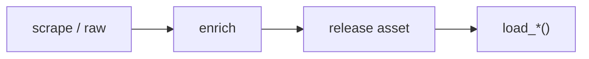

# WNBA dataset loaders



## Automation status

| Dataset | Release tag | Pipeline |
|---|---|---|
| `load_wnba_pbp` | [espn_wnba_pbp](https://github.com/sportsdataverse/sportsdataverse-data/releases/tag/espn_wnba_pbp) | — |
| `load_wnba_player_boxscore` | [espn_wnba_player_boxscores](https://github.com/sportsdataverse/sportsdataverse-data/releases/tag/espn_wnba_player_boxscores) | — |
| `load_wnba_schedule` | [espn_wnba_schedules](https://github.com/sportsdataverse/sportsdataverse-data/releases/tag/espn_wnba_schedules) | — |
| `load_wnba_team_boxscore` | [espn_wnba_team_boxscores](https://github.com/sportsdataverse/sportsdataverse-data/releases/tag/espn_wnba_team_boxscores) | — |
| `load_wnba_draft` | [espn_wnba_draft](https://github.com/sportsdataverse/sportsdataverse-data/releases/tag/espn_wnba_draft) | — |
| `load_wnba_game_rosters` | [espn_wnba_game_rosters](https://github.com/sportsdataverse/sportsdataverse-data/releases/tag/espn_wnba_game_rosters) | — |
| `load_wnba_officials` | [espn_wnba_officials](https://github.com/sportsdataverse/sportsdataverse-data/releases/tag/espn_wnba_officials) | — |
| `load_wnba_player_season_stats` | [espn_wnba_player_season_stats](https://github.com/sportsdataverse/sportsdataverse-data/releases/tag/espn_wnba_player_season_stats) | — |
| `load_wnba_rosters` | [espn_wnba_rosters](https://github.com/sportsdataverse/sportsdataverse-data/releases/tag/espn_wnba_rosters) | — |
| `load_wnba_shots` | [espn_wnba_shots](https://github.com/sportsdataverse/sportsdataverse-data/releases/tag/espn_wnba_shots) | — |
| `load_wnba_standings` | [espn_wnba_standings](https://github.com/sportsdataverse/sportsdataverse-data/releases/tag/espn_wnba_standings) | — |
| `load_wnba_team_season_stats` | [espn_wnba_team_season_stats](https://github.com/sportsdataverse/sportsdataverse-data/releases/tag/espn_wnba_team_season_stats) | — |
| `load_wnba_player_crosswalk` | [wnba_crosswalk](https://github.com/sportsdataverse/sportsdataverse-data/releases/tag/wnba_crosswalk) | — |
| `load_wnba_schedule_crosswalk` | [wnba_crosswalk](https://github.com/sportsdataverse/sportsdataverse-data/releases/tag/wnba_crosswalk) | — |
| `load_wnba_team_crosswalk` | [wnba_crosswalk](https://github.com/sportsdataverse/sportsdataverse-data/releases/tag/wnba_crosswalk) | — |
| `load_wnba_player_core` | [espn_wnba_player_core](https://github.com/sportsdataverse/sportsdataverse-data/releases/tag/espn_wnba_player_core) | — |
| `load_wnba_player_impact` | [wnba_player_impact](https://github.com/sportsdataverse/sportsdataverse-data/releases/tag/wnba_player_impact) | — |
| `load_wnba_stats_coaches` | [wnba_stats_coaches](https://github.com/sportsdataverse/sportsdataverse-data/releases/tag/wnba_stats_coaches) | — |
| `load_wnba_stats_draft` | [wnba_stats_draft](https://github.com/sportsdataverse/sportsdataverse-data/releases/tag/wnba_stats_draft) | — |
| `load_wnba_stats_game_rosters` | [wnba_stats_game_rosters](https://github.com/sportsdataverse/sportsdataverse-data/releases/tag/wnba_stats_game_rosters) | — |
| `load_wnba_stats_officials` | [wnba_stats_officials](https://github.com/sportsdataverse/sportsdataverse-data/releases/tag/wnba_stats_officials) | — |
| `load_wnba_stats_pbp` | [wnba_stats_pbp](https://github.com/sportsdataverse/sportsdataverse-data/releases/tag/wnba_stats_pbp) | — |
| `load_wnba_stats_possessions` | [wnba_stats_possessions](https://github.com/sportsdataverse/sportsdataverse-data/releases/tag/wnba_stats_possessions) | — |
| `load_wnba_stats_game_lineups` | [wnba_stats_game_lineups](https://github.com/sportsdataverse/sportsdataverse-data/releases/tag/wnba_stats_game_lineups) | — |
| `load_wnba_stats_player_boxscores` | [wnba_stats_player_boxscores](https://github.com/sportsdataverse/sportsdataverse-data/releases/tag/wnba_stats_player_boxscores) | — |
| `load_wnba_stats_player_game_logs` | [wnba_stats_player_game_logs](https://github.com/sportsdataverse/sportsdataverse-data/releases/tag/wnba_stats_player_game_logs) | — |
| `load_wnba_stats_rosters` | [wnba_stats_rosters](https://github.com/sportsdataverse/sportsdataverse-data/releases/tag/wnba_stats_rosters) | — |
| `load_wnba_stats_schedules` | [wnba_stats_schedules](https://github.com/sportsdataverse/sportsdataverse-data/releases/tag/wnba_stats_schedules) | — |
| `load_wnba_stats_shots` | [wnba_stats_shots](https://github.com/sportsdataverse/sportsdataverse-data/releases/tag/wnba_stats_shots) | — |
| `load_wnba_stats_team_boxscores` | [wnba_stats_team_boxscores](https://github.com/sportsdataverse/sportsdataverse-data/releases/tag/wnba_stats_team_boxscores) | — |

## `load_wnba_pbp`

Release: [espn_wnba_pbp](https://github.com/sportsdataverse/sportsdataverse-data/releases/tag/espn_wnba_pbp) · asset `https://github.com/sportsdataverse/sportsdataverse-data/releases/download/espn_wnba_pbp/play_by_play_{season}.parquet`
### Returns

| col_name | type | description |
|---|---|---|
| `game_play_number` | Int32 | Game play number |
| `id` | Int64 | Unique play identification number |
| `sequence_number` | Int32 | Sequence number representing a shot-possession (V3 PBP). |
| `type_id` | Int32 | Type identifier (numeric). |
| `type_text` | String | Display text for the type field. |
| `text` | String | Text description of the play / record. |
| `away_score` | Int32 | Away team score at the time of the play. |
| `home_score` | Int32 | Home team score at the time of the play. |
| `period_number` | Int32 | Numeric period (1-4 for quarters; 5+ for OT). |
| `period_display_value` | String | Period display label (e.g. '1st Quarter', 'OT'). |
| `clock_display_value` | String | Game clock display string (e.g. '8:32'). |
| `scoring_play` | Boolean | TRUE if the play resulted in points scored. |
| `score_value` | Int32 | Point value of the play (2 / 3 / 1). |
| `team_id` | Int32 | Unique team identifier. |
| `athlete_id_1` | Int32 | Primary athlete identifier (e.g. shooter). |
| `athlete_id_2` | Int32 | Secondary athlete identifier (e.g. assister / fouler). |
| `athlete_id_3` | Int32 | Athlete id 3. |
| `wallclock` | String | Wallclock. |
| `shooting_play` | Boolean | TRUE if the play was a shooting attempt. |
| `coordinate_x_raw` | Float64 | X coordinate as returned by the API before any adjustment. |
| `coordinate_y_raw` | Float64 | Y coordinate as returned by the API before any adjustment. |
| `points_attempted` | Int32 |  |
| `short_description` | String |  |
| `game_id` | Int32 | Unique game identifier. |
| `season` | Int32 | Season identifier (4-digit year or 'YYYY-YY' string). |
| `season_type` | Int32 | Season type (1=pre-season, 2=regular season, 3=postseason, 4=off-season for ESPN; or string label for WNBA Stats). |
| `home_team_id` | Int32 | Unique identifier for the home team. |
| `home_team_name` | String | Home team name. |
| `home_team_mascot` | String | Home team mascot. |
| `home_team_abbrev` | String | Home team three-letter abbreviation. |
| `home_team_name_alt` | String | Alternate versions of the home team abbreviation |
| `away_team_id` | Int32 | Unique identifier for the away team. |
| `away_team_name` | String | Away team name. |
| `away_team_mascot` | String | Away team mascot. |
| `away_team_abbrev` | String | Away team three-letter abbreviation. |
| `away_team_name_alt` | String | Alternate versions of the away team abbreviation |
| `game_spread` | Float64 | Game spread in (-X Team) format. There are almost none, I would recommend not trusting any of these three columns |
| `home_favorite` | Boolean | Logical (TRUE/FALSE) indicating whether the home team is favored |
| `game_spread_available` | Boolean | Logical (TRUE/FALSE) indicating whether the spread was available from ESPN. Basically, I would just not recommend using any of the spread information, I think I defaulted a lot of them to -2.5 for the home team. Most games probably do not have spread information. This column should really be listed first |
| `home_team_spread` | Float64 | The game spread with respect to the home team |
| `qtr` | Int32 | Quarter of the game |
| `time` | String | Time left within the period |
| `clock_minutes` | Int32 | Clock minutes split from seconds for developer convenience |
| `clock_seconds` | Float64 | Clock seconds split from minutes for developer convenience |
| `home_timeout_called` | Boolean |  |
| `away_timeout_called` | Boolean |  |
| `half` | Int32 | Half of the game |
| `game_half` | Int32 | Half of the game |
| `lag_qtr` | Int32 | A lag column on the quarter |
| `lead_qtr` | Int32 | A lead column on the quarter |
| `lag_half` | Int32 | A lag column on the half |
| `lead_half` | Int32 | A lead column on the half |
| `start_quarter_seconds_remaining` | Float64 | Quarter seconds remaining at the start of the play (these are more or less code artifacts from other sports, but may eventually be used more seriously) |
| `start_half_seconds_remaining` | Float64 | Game half seconds remaining at the start of the play (these are more or less code artifacts from other sports, but may eventually be used more seriously) |
| `start_game_seconds_remaining` | Float64 | Game seconds remaining at the start of the play (''') |
| `end_quarter_seconds_remaining` | Float64 | Quarter seconds remaining at the end of the play (''') |
| `end_half_seconds_remaining` | Float64 | Game half seconds remaining at the end of the play (''') |
| `end_game_seconds_remaining` | Float64 | Game seconds remaining at the end of the play (''') |
| `period` | Int32 | Period of the game (1-4 quarters; 5+ for OT). |
| `coordinate_x` | Float64 | X coordinate on the court (half-court layout). |
| `coordinate_y` | Float64 | Y coordinate on the court (half-court layout). |
| `game_date` | Date | Game date (YYYY-MM-DD). |
| `game_date_time` | Datetime(time_unit='us', time_zone='America/New_York') | Game start date/time (ISO 8601). |
| `athlete_name_1` | String |  |
| `athlete_name_2` | String |  |
| `athlete_name_3` | String |  |
| `type_abbreviation` | String | Play type abbreviation |

```python
load_wnba_pbp(seasons=2024)
```

## `load_wnba_player_boxscore`

Release: [espn_wnba_player_boxscores](https://github.com/sportsdataverse/sportsdataverse-data/releases/tag/espn_wnba_player_boxscores) · asset `https://github.com/sportsdataverse/sportsdataverse-data/releases/download/espn_wnba_player_boxscores/player_box_{season}.parquet`
### Returns

| col_name | type | description |
|---|---|---|
| `game_id` | Int32 | Unique game identifier. |
| `season` | Int32 | Season identifier (4-digit year or 'YYYY-YY' string). |
| `season_type` | Int32 | Season type (1=pre-season, 2=regular season, 3=postseason, 4=off-season for ESPN; or string label for WNBA Stats). |
| `game_date` | Date | Game date (YYYY-MM-DD). |
| `game_date_time` | Datetime(time_unit='us', time_zone='America/New_York') | Game start date/time (ISO 8601). |
| `athlete_id` | Int32 | Unique athlete identifier (ESPN). |
| `athlete_display_name` | String | Athlete display name (full). |
| `team_id` | Int32 | Unique team identifier. |
| `team_name` | String | Full team display name (e.g. 'Las Vegas Aces'). |
| `team_location` | String | Team city or location string. |
| `team_short_display_name` | String | Short team display name (e.g. 'Aces'). |
| `minutes` | Float64 | Minutes played, formatted MM:SS (V3 PT-duration parsed) or decimal minutes (V2). |
| `field_goals_made` | Int32 | Field goals made (2-pt + 3-pt). |
| `field_goals_attempted` | Int32 | Field goal attempts (2-pt + 3-pt). |
| `three_point_field_goals_made` | Int32 | Three-point field goals made. |
| `three_point_field_goals_attempted` | Int32 | Three-point field goal attempts. |
| `free_throws_made` | Int32 | Free throws made. |
| `free_throws_attempted` | Int32 | Free throw attempts. |
| `offensive_rebounds` | Int32 | Offensive rebounds. |
| `defensive_rebounds` | Int32 | Defensive rebounds. |
| `rebounds` | Int32 | Total rebounds. |
| `assists` | Int32 | Total assists. |
| `steals` | Int32 | Total steals. |
| `blocks` | Int32 | Total blocks. |
| `turnovers` | Int32 | Total turnovers. |
| `fouls` | Int32 | Personal fouls. |
| `plus_minus` | String | Plus/minus point differential while on court. |
| `points` | Int32 | Points scored. |
| `starter` | Boolean | TRUE if the player was in the starting lineup; FALSE otherwise. |
| `ejected` | Boolean | TRUE if the player was ejected from the game. |
| `did_not_play` | Boolean | TRUE if the player did not appear in the game. |
| `reason` | String | Reason. |
| `active` | Boolean | TRUE if the row represents an active record (player / team / season). |
| `athlete_jersey` | String | Athlete jersey number. |
| `athlete_short_name` | String | Athlete short display name. |
| `athlete_headshot_href` | String | Athlete headshot image URL. |
| `athlete_position_name` | String | Athlete position ('Guard', 'Forward', 'Center'). |
| `athlete_position_abbreviation` | String | Athlete position abbreviation (G / F / C). |
| `team_display_name` | String | Full team display name. |
| `team_uid` | String | ESPN universal team identifier (UID format 's:40~l:...~t:...'). |
| `team_slug` | String | URL-safe team identifier (e.g. 'lasvegas-aces' / 'aces'). |
| `team_logo` | String | Team logo image URL. |
| `team_abbreviation` | String | Short team abbreviation (e.g. 'LAS'). |
| `team_color` | String | Team primary color (hex without leading '#'). |
| `team_alternate_color` | String | Team alternate color (hex without leading '#'). |
| `home_away` | String | Game venue label ('home' or 'away'). |
| `team_winner` | Boolean | TRUE if the team won this game. |
| `team_score` | Int32 | Team's score / final score. |
| `opponent_team_id` | Int32 | Unique identifier for the opponent team. |
| `opponent_team_name` | String | Opponent team display name. |
| `opponent_team_location` | String | Opponent team city / location. |
| `opponent_team_display_name` | String | Opponent team full display name. |
| `opponent_team_abbreviation` | String | Opponent team abbreviation. |
| `opponent_team_logo` | String | Opponent team logo URL. |
| `opponent_team_color` | String | Opponent team primary color (hex). |
| `opponent_team_alternate_color` | String | Opponent team alternate color (hex). |
| `opponent_team_score` | Int32 | Opponent team's score. |

```python
load_wnba_player_boxscore(seasons=2024)
```

## `load_wnba_schedule`

Release: [espn_wnba_schedules](https://github.com/sportsdataverse/sportsdataverse-data/releases/tag/espn_wnba_schedules) · asset `https://github.com/sportsdataverse/sportsdataverse-data/releases/download/espn_wnba_schedules/wnba_schedule_{season}.parquet`
### Returns

| col_name | type | description |
|---|---|---|
| `id` | Int32 | Unique play identification number |
| `uid` | String | ESPN UID string. |
| `date` | String | Date in YYYY-MM-DD format. |
| `attendance` | Float64 | Reported attendance. |
| `time_valid` | Boolean | Time valid. |
| `neutral_site` | Boolean | Neutral site. |
| `conference_competition` | Boolean | Conference competition. |
| `play_by_play_available` | Boolean | Whether play-by-play data is available. |
| `recent` | Boolean | Recent. |
| `start_date` | String | Start date (YYYY-MM-DD). |
| `broadcast` | String | Broadcast information string. |
| `highlights` | String | Game highlight urls. |
| `notes_type` | String | Notes type. |
| `notes_headline` | String | Notes headline. |
| `broadcast_market` | String | Broadcast market label (e.g. 'national', 'home'). |
| `broadcast_name` | String | Broadcast name. |
| `type_id` | Int32 | Type identifier (numeric). |
| `type_abbreviation` | String | Play type abbreviation |
| `venue_id` | Int32 | Unique venue identifier. |
| `venue_full_name` | String | Venue full name. |
| `venue_address_city` | String | Venue address city. |
| `venue_address_state` | String | Venue address state / region. |
| `venue_indoor` | Boolean | TRUE if the venue is indoors. |
| `status_clock` | Float64 | Status clock. |
| `status_display_clock` | String | Status display clock. |
| `status_period` | Float64 | Status period. |
| `status_type_id` | Int32 | Unique identifier for status type. |
| `status_type_name` | String | Status type name. |
| `status_type_state` | String | Status type state. |
| `status_type_completed` | Boolean | Status type completed. |
| `status_type_description` | String | Status type description. |
| `status_type_detail` | String | Status type detail. |
| `status_type_short_detail` | String | Status type short detail. |
| `format_regulation_periods` | Float64 | Format regulation periods. |
| `home_id` | Int32 | Unique identifier for home. |
| `home_uid` | String | Home team's uid. |
| `home_location` | String | Home team's location. |
| `home_name` | String | Home name. |
| `home_abbreviation` | String | Home team's abbreviation. |
| `home_display_name` | String | Home display name. |
| `home_short_display_name` | String | Home short display name. |
| `home_color` | String | Color code (hex) for home. |
| `home_alternate_color` | String | Color code (hex) for home alternate. |
| `home_is_active` | Boolean | Home team's is active. |
| `home_venue_id` | Int32 | Unique identifier for home venue. |
| `home_logo` | String | Home team logo URL. |
| `home_score` | Int32 | Home team score at the time of the play. |
| `home_winner` | Boolean | Home team's winner. |
| `home_linescores` | String |  |
| `home_records` | String |  |
| `away_id` | Int32 | Unique identifier for away. |
| `away_uid` | String | Away team's uid. |
| `away_location` | String | Away team's location. |
| `away_name` | String | Away name. |
| `away_abbreviation` | String | Away team's abbreviation. |
| `away_display_name` | String | Away display name. |
| `away_short_display_name` | String | Away short display name. |
| `away_color` | String | Color code (hex) for away. |
| `away_alternate_color` | String | Color code (hex) for away alternate. |
| `away_is_active` | Boolean | Away team's is active. |
| `away_venue_id` | Int32 | Unique identifier for away venue. |
| `away_logo` | String | Away team logo URL. |
| `away_score` | Int32 | Away team score at the time of the play. |
| `away_winner` | Boolean | Away team's winner. |
| `away_linescores` | String |  |
| `away_records` | String |  |
| `game_id` | Int32 | Unique game identifier. |
| `season` | Int32 | Season identifier (4-digit year or 'YYYY-YY' string). |
| `season_type` | Int32 | Season type (1=pre-season, 2=regular season, 3=postseason, 4=off-season for ESPN; or string label for WNBA Stats). |
| `status_type_alt_detail` | String | Status type alt detail. |
| `game_json` | Boolean | Whether processed game JSON is available. |
| `game_json_url` | String | URL to the processed game JSON. |
| `game_date_time` | Datetime(time_unit='us', time_zone='America/New_York') | Game start date/time (ISO 8601). |
| `game_date` | Date | Game date (YYYY-MM-DD). |
| `PBP` | Boolean | Whether play-by-play data is available. |
| `team_box` | Boolean | Team box. |
| `player_box` | Boolean | Player box. |

```python
load_wnba_schedule(seasons=2024)
```

## `load_wnba_team_boxscore`

Release: [espn_wnba_team_boxscores](https://github.com/sportsdataverse/sportsdataverse-data/releases/tag/espn_wnba_team_boxscores) · asset `https://github.com/sportsdataverse/sportsdataverse-data/releases/download/espn_wnba_team_boxscores/team_box_{season}.parquet`
### Returns

| col_name | type | description |
|---|---|---|
| `game_id` | Int32 | Unique game identifier. |
| `season` | Int32 | Season identifier (4-digit year or 'YYYY-YY' string). |
| `season_type` | Int32 | Season type (1=pre-season, 2=regular season, 3=postseason, 4=off-season for ESPN; or string label for WNBA Stats). |
| `game_date` | Date | Game date (YYYY-MM-DD). |
| `game_date_time` | Datetime(time_unit='us', time_zone='America/New_York') | Game start date/time (ISO 8601). |
| `team_id` | Int32 | Unique team identifier. |
| `team_uid` | String | ESPN universal team identifier (UID format 's:40~l:...~t:...'). |
| `team_slug` | String | URL-safe team identifier (e.g. 'lasvegas-aces' / 'aces'). |
| `team_location` | String | Team city or location string. |
| `team_name` | String | Full team display name (e.g. 'Las Vegas Aces'). |
| `team_abbreviation` | String | Short team abbreviation (e.g. 'LAS'). |
| `team_display_name` | String | Full team display name. |
| `team_short_display_name` | String | Short team display name (e.g. 'Aces'). |
| `team_color` | String | Team primary color (hex without leading '#'). |
| `team_alternate_color` | String | Team alternate color (hex without leading '#'). |
| `team_logo` | String | Team logo image URL. |
| `team_home_away` | String | Team home away. |
| `team_score` | Int32 | Team's score / final score. |
| `team_winner` | Boolean | TRUE if the team won this game. |
| `assists` | Int32 | Total assists. |
| `blocks` | Int32 | Total blocks. |
| `defensive_rebounds` | Int32 | Defensive rebounds. |
| `fast_break_points` | String | Fast-break points scored. |
| `field_goal_pct` | Float64 | Field goal percentage (0-1). |
| `field_goals_made` | Int32 | Field goals made (2-pt + 3-pt). |
| `field_goals_attempted` | Int32 | Field goal attempts (2-pt + 3-pt). |
| `flagrant_fouls` | Int32 | Total flagrant fouls. |
| `fouls` | Int32 | Personal fouls. |
| `free_throw_pct` | Float64 | Free throw percentage (0-1). |
| `free_throws_made` | Int32 | Free throws made. |
| `free_throws_attempted` | Int32 | Free throw attempts. |
| `largest_lead` | String | Largest lead during the game. |
| `lead_changes` | String | Lead changes. |
| `lead_percentage` | String |  |
| `offensive_rebounds` | Int32 | Offensive rebounds. |
| `points_in_paint` | String | Points scored in the paint. |
| `steals` | Int32 | Total steals. |
| `team_turnovers` | Int32 | Team turnovers (turnovers credited to the team rather than a player). |
| `technical_fouls` | Int32 | Total technical fouls. |
| `three_point_field_goal_pct` | Float64 | Three-point field goal percentage (0-1). |
| `three_point_field_goals_made` | Int32 | Three-point field goals made. |
| `three_point_field_goals_attempted` | Int32 | Three-point field goal attempts. |
| `total_rebounds` | Int32 | Total rebounds. |
| `total_technical_fouls` | Int32 | Total technical fouls (player + team). |
| `total_turnovers` | Int32 | Total turnovers (player + team). |
| `turnover_points` | String | Turnover points. |
| `turnovers` | Int32 | Total turnovers. |
| `opponent_team_id` | Int32 | Unique identifier for the opponent team. |
| `opponent_team_uid` | String | Opponent team uid. |
| `opponent_team_slug` | String | Opponent team slug. |
| `opponent_team_location` | String | Opponent team city / location. |
| `opponent_team_name` | String | Opponent team display name. |
| `opponent_team_abbreviation` | String | Opponent team abbreviation. |
| `opponent_team_display_name` | String | Opponent team full display name. |
| `opponent_team_short_display_name` | String | Opponent team short display name. |
| `opponent_team_color` | String | Opponent team primary color (hex). |
| `opponent_team_alternate_color` | String | Opponent team alternate color (hex). |
| `opponent_team_logo` | String | Opponent team logo URL. |
| `opponent_team_score` | Int32 | Opponent team's score. |

```python
load_wnba_team_boxscore(seasons=2024)
```

## `load_wnba_draft`

Release: [espn_wnba_draft](https://github.com/sportsdataverse/sportsdataverse-data/releases/tag/espn_wnba_draft) · asset `https://github.com/sportsdataverse/sportsdataverse-data/releases/download/espn_wnba_draft/draft_{season}.parquet`
### Returns

| col_name | type | description |
|---|---|---|
| `season` | Int32 | Season identifier (4-digit year or 'YYYY-YY' string). |
| `round` | Int32 | Tournament / playoff round. |
| `round_display_name` | String | Human-readable label for the draft round, read from the ESPN round object's displayName falling back to its name; null whenever ESPN ships the modern flat picks array with no round objects, which is the case for every published season. |
| `pick` | Int32 | Pick. |
| `overall_pick` | Int32 | Overall pick. |
| `pick_traded` | String | ESPN's pick-level traded flag stringified as TRUE or FALSE, marking selections made with a pick that had changed hands (17 of the 45 published 2026 picks are TRUE). |
| `pick_notes` | String | Free-text annotation ESPN attaches to a pick, taken from notes and falling back to note; empty for every pick published so far. |
| `athlete_id` | Int32 | Unique athlete identifier (ESPN). |
| `athlete_uid` | String | ESPN athlete UID (universal identifier). |
| `athlete_guid` | String | ESPN athlete GUID. |
| `athlete_first_name` | String | Player first name; `athlete_detail = TRUE` only. |
| `athlete_last_name` | String | Athlete last name. |
| `athlete_full_name` | String | Drafted player full name. |
| `athlete_display_name` | String | Athlete display name (full). |
| `athlete_short_name` | String | Athlete short display name. |
| `athlete_height` | String | Athlete height. |
| `athlete_weight` | String | Athlete weight. |
| `athlete_position_abbreviation` | String | Athlete position abbreviation (G / F / C). |
| `athlete_position_name` | String | Athlete position ('Guard', 'Forward', 'Center'). |
| `athlete_headshot_href` | String | Athlete headshot image URL. |
| `college_id` | Int32 | Unique identifier for college. |
| `college_name` | String | College name. |
| `college_short_name` | String | College short name. |
| `college_abbreviation` | String | Short code for the drafted player's school, read from the athlete's ESPN college block; null throughout the published data because ESPN ships no college block on these picks. |
| `team_id` | Int32 | Unique team identifier. |
| `team_uid` | String | ESPN universal team identifier (UID format 's:40~l:...~t:...'). |
| `team_slug` | String | URL-safe team identifier (e.g. 'lasvegas-aces' / 'aces'). |
| `team_location` | String | Team city or location string. |
| `team_name` | String | Full team display name (e.g. 'Las Vegas Aces'). |
| `team_abbreviation` | String | Short team abbreviation (e.g. 'LAS'). |
| `team_display_name` | String | Full team display name. |
| `team_short_display_name` | String | Short team display name (e.g. 'Aces'). |
| `team_color` | String | Team primary color (hex without leading '#'). |
| `team_alternate_color` | String | Team alternate color (hex without leading '#'). |
| `team_logo` | String | Team logo image URL. |

```python
load_wnba_draft(seasons=2026)
```

## `load_wnba_game_rosters`

Release: [espn_wnba_game_rosters](https://github.com/sportsdataverse/sportsdataverse-data/releases/tag/espn_wnba_game_rosters) · asset `https://github.com/sportsdataverse/sportsdataverse-data/releases/download/espn_wnba_game_rosters/game_rosters_{season}.parquet`
### Returns

| col_name | type | description |
|---|---|---|
| `season` | Int32 | Season identifier (4-digit year or 'YYYY-YY' string). |
| `game_id` | String | Unique game identifier. |
| `team_id` | Int32 | Unique team identifier. |
| `team_slug` | String | URL-safe team identifier (e.g. 'lasvegas-aces' / 'aces'). |
| `team_abbreviation` | String | Short team abbreviation (e.g. 'LAS'). |
| `team_display_name` | String | Full team display name. |
| `home_away` | String | Game venue label ('home' or 'away'). |
| `athlete_id` | Int32 | Unique athlete identifier (ESPN). |
| `athlete_uid` | String | ESPN athlete UID (universal identifier). |
| `athlete_guid` | String | ESPN athlete GUID. |
| `athlete_display_name` | String | Athlete display name (full). |
| `athlete_short_name` | String | Athlete short display name. |
| `athlete_first_name` | String | Player first name; `athlete_detail = TRUE` only. |
| `athlete_last_name` | String | Athlete last name. |
| `athlete_jersey` | String | Athlete jersey number. |
| `athlete_position` | String | Athlete position. |
| `athlete_headshot` | String | Direct link to the player's ESPN headshot image, always of the form https://a.espncdn.com/i/headshots/wnba/players/full/{athlete_id}.png, and null for the few players ESPN has no photo for. |
| `starter` | Boolean | TRUE if the player was in the starting lineup; FALSE otherwise. |
| `did_not_play` | Boolean | TRUE if the player did not appear in the game. |
| `active` | Boolean | TRUE if the row represents an active record (player / team / season). |
| `ejected` | Boolean | TRUE if the player was ejected from the game. |
| `reason` | String | Reason. |

```python
load_wnba_game_rosters(seasons=2024)
```

## `load_wnba_officials`

Release: [espn_wnba_officials](https://github.com/sportsdataverse/sportsdataverse-data/releases/tag/espn_wnba_officials) · asset `https://github.com/sportsdataverse/sportsdataverse-data/releases/download/espn_wnba_officials/officials_{season}.parquet`
### Returns

| col_name | type | description |
|---|---|---|
| `season` | Int32 | Season identifier (4-digit year or 'YYYY-YY' string). |
| `game_id` | String | Unique game identifier. |
| `official_id` | Int32 | Unique official / referee identifier. |
| `official_uid` | String | ESPN's global uid string for the official, carried straight through from the officials payload; the Core v2 items ESPN serves omit it, so it is null in every published season. |
| `official_full_name` | String | The official's full name, taken from ESPN fullName and falling back to displayName; it equals first plus last name on every published row. |
| `official_display_name` | String | ESPN's display rendering of the official's name, which is byte-identical to official_full_name on every published row and therefore adds nothing. |
| `official_first_name` | String | Given name of the official as ESPN splits it out, the leading token of official_full_name. |
| `official_last_name` | String | Family name of the official as ESPN splits it out, the trailing token of official_full_name, with hyphenated surnames kept intact. |
| `official_order` | Int32 | ESPN's 1-based position of the official within that game's crew; most games run 1 through 3 for a three-person crew and 40 of 573 games in 2024-2025 add a fourth. |
| `position_name` | String | Listed roster position ('Guard', 'Forward', 'Center'). |
| `position_display_name` | String | Position display name. |

```python
load_wnba_officials(seasons=2024)
```

## `load_wnba_player_season_stats`

Release: [espn_wnba_player_season_stats](https://github.com/sportsdataverse/sportsdataverse-data/releases/tag/espn_wnba_player_season_stats) · asset `https://github.com/sportsdataverse/sportsdataverse-data/releases/download/espn_wnba_player_season_stats/player_season_stats_{season}.parquet`
### Returns

| col_name | type | description |
|---|---|---|
| `season` | Int32 | Season identifier (4-digit year or 'YYYY-YY' string). |
| `athlete_id` | Int32 | Unique athlete identifier (ESPN). |
| `athlete_display_name` | String | Athlete display name (full). |
| `athlete_first_name` | String | Player first name; `athlete_detail = TRUE` only. |
| `athlete_last_name` | String | Athlete last name. |
| `athlete_position_abbreviation` | String | Athlete position abbreviation (G / F / C). |
| `athlete_jersey` | String | Athlete jersey number. |
| `team_id` | Int32 | Unique team identifier. |
| `team_display_name` | String | Full team display name. |
| `category` | String | Category label. |
| `stat_label` | String | Human-readable label of the statistic (e.g. 'At bats'). |
| `stat_name` | String | Internal stat key. |
| `stat_display_name` | String | Stat display name. |
| `stat_description` | String | ESPN's prose definition of the statistic on this row, for example The average number of points scored per game for avgPoints; combined made-attempted stats carry both halves joined by a hyphen. |
| `display_value` | String | Display-formatted value. |
| `value` | Float64 | Numeric or string value field. |

```python
load_wnba_player_season_stats(seasons=2024)
```

## `load_wnba_rosters`

Release: [espn_wnba_rosters](https://github.com/sportsdataverse/sportsdataverse-data/releases/tag/espn_wnba_rosters) · asset `https://github.com/sportsdataverse/sportsdataverse-data/releases/download/espn_wnba_rosters/rosters_{season}.parquet`
### Returns

| col_name | type | description |
|---|---|---|
| `season` | Int32 | Season identifier (4-digit year or 'YYYY-YY' string). |
| `team_id` | Int32 | Unique team identifier. |
| `team_slug` | String | URL-safe team identifier (e.g. 'lasvegas-aces' / 'aces'). |
| `team_abbreviation` | String | Short team abbreviation (e.g. 'LAS'). |
| `team_display_name` | String | Full team display name. |
| `team_short_display_name` | String | Short team display name (e.g. 'Aces'). |
| `team_color` | String | Team primary color (hex without leading '#'). |
| `team_alternate_color` | String | Team alternate color (hex without leading '#'). |
| `team_logo` | String | Team logo image URL. |
| `athlete_id` | String | Unique athlete identifier (ESPN). |
| `uid` | String | ESPN UID string. |
| `guid` | String | Stable cross-league team GUID. |
| `full_name` | String | Player's full name. |
| `display_name` | String | Display name. |
| `short_name` | String | Short display name. |
| `first_name` | String | Player's first name. |
| `last_name` | String | Player's last name. |
| `jersey` | String | Jersey number worn by the player. |
| `position_abbreviation` | String | Position abbreviation ('G' / 'F' / 'C'). |
| `position_name` | String | Listed roster position ('Guard', 'Forward', 'Center'). |
| `position_id` | String | Unique position identifier. |
| `height` | String | Player height (string e.g. '6-2' or inches). |
| `weight` | String | Player weight in pounds. |
| `age` | String | Player age (in years). |
| `date_of_birth` | String | Date of birth (YYYY-MM-DD). |
| `birth_place_city` | String | Birth place city. |
| `birth_place_state` | String | Birth place state. |
| `birth_place_country` | String | Birth place country. |
| `experience_years` | String | Experience years. |
| `experience_display_value` | String | Experience display value. |
| `headshot_href` | String | Headshot image URL. |
| `headshot_alt` | String | Alternative-text label for the headshot. |
| `link_web` | String | Web link / URL. |
| `status_id` | String | Status identifier. |
| `status_name` | String | Status label. |
| `status_type` | String | Status type. |

```python
load_wnba_rosters(seasons=2024)
```

## `load_wnba_shots`

Release: [espn_wnba_shots](https://github.com/sportsdataverse/sportsdataverse-data/releases/tag/espn_wnba_shots) · asset `https://github.com/sportsdataverse/sportsdataverse-data/releases/download/espn_wnba_shots/shots_{season}.parquet`
### Returns

| col_name | type | description |
|---|---|---|
| `game_id` | Int32 | Unique game identifier. |
| `season` | Int32 | Season identifier (4-digit year or 'YYYY-YY' string). |
| `period_number` | Int32 | Numeric period (1-4 for quarters; 5+ for OT). |
| `clock_display_value` | String | Game clock display string (e.g. '8:32'). |
| `team_id` | Int32 | Unique team identifier. |
| `athlete_id_1` | Int32 | Primary athlete identifier (e.g. shooter). |
| `athlete_id_2` | Int32 | Secondary athlete identifier (e.g. assister / fouler). |
| `type_id` | Int32 | Type identifier (numeric). |
| `type_text` | String | Display text for the type field. |
| `scoring_play` | Boolean | TRUE if the play resulted in points scored. |
| `score_value` | Int32 | Point value of the play (2 / 3 / 1). |
| `coordinate_x` | Float64 | X coordinate on the court (half-court layout). |
| `coordinate_y` | Float64 | Y coordinate on the court (half-court layout). |
| `coordinate_x_raw` | Float64 | X coordinate as returned by the API before any adjustment. |
| `coordinate_y_raw` | Float64 | Y coordinate as returned by the API before any adjustment. |
| `athlete_name_1` | String |  |
| `athlete_name_2` | String |  |
| `team_name` | String | Full team display name (e.g. 'Las Vegas Aces'). |
| `team_mascot` | String |  |
| `team_abbrev` | String | Abbreviation for team. |

```python
load_wnba_shots(seasons=2024)
```

## `load_wnba_standings`

Release: [espn_wnba_standings](https://github.com/sportsdataverse/sportsdataverse-data/releases/tag/espn_wnba_standings) · asset `https://github.com/sportsdataverse/sportsdataverse-data/releases/download/espn_wnba_standings/standings_{season}.parquet`
### Returns

| col_name | type | description |
|---|---|---|
| `season` | Int32 | Season identifier (4-digit year or 'YYYY-YY' string). |
| `group_id` | String | ESPN group id. |
| `group_name` | String | Group name (conference / division). |
| `group_abbreviation` | String | Group abbreviation. |
| `group_short_name` | String | Short label of the standings group node the team sits under, read from ESPN shortName; the WNBA conference nodes ship only name and abbreviation, so it is null on every published row. |
| `team_id` | Int32 | Unique team identifier. |
| `team_uid` | String | ESPN universal team identifier (UID format 's:40~l:...~t:...'). |
| `team_slug` | String | URL-safe team identifier (e.g. 'lasvegas-aces' / 'aces'). |
| `team_location` | String | Team city or location string. |
| `team_name` | String | Full team display name (e.g. 'Las Vegas Aces'). |
| `team_abbreviation` | String | Short team abbreviation (e.g. 'LAS'). |
| `team_display_name` | String | Full team display name. |
| `team_short_display_name` | String | Short team display name (e.g. 'Aces'). |
| `team_color` | String | Team primary color (hex without leading '#'). |
| `team_alternate_color` | String | Team alternate color (hex without leading '#'). |
| `team_logo` | String | Team logo image URL. |
| `stat_name` | String | Internal stat key. |
| `stat_display_name` | String | Stat display name. |
| `stat_short_display_name` | String | Short human-readable stat name. |
| `stat_description` | String | ESPN's long-form explanation of the standings stat, such as Clinched Best League Record for clincher or Record last 10 games for lasttengames. |
| `stat_abbreviation` | String | ESPN's abbreviation for the standings stat, which can differ from stat_short_display_name (playoffSeed is SEED here but POS there) and is null on the record-split rows such as Home and vs. Conf. |
| `stat_type` | String | Stat type code (e.g. "win", "loss"). |
| `display_value` | String | Display-formatted value. |
| `value` | Float64 | Numeric or string value field. |

```python
load_wnba_standings(seasons=2024)
```

## `load_wnba_team_season_stats`

Release: [espn_wnba_team_season_stats](https://github.com/sportsdataverse/sportsdataverse-data/releases/tag/espn_wnba_team_season_stats) · asset `https://github.com/sportsdataverse/sportsdataverse-data/releases/download/espn_wnba_team_season_stats/team_season_stats_{season}.parquet`
### Returns

| col_name | type | description |
|---|---|---|
| `season` | Int32 | Season identifier (4-digit year or 'YYYY-YY' string). |
| `team_id` | Int32 | Unique team identifier. |
| `team_slug` | String | URL-safe team identifier (e.g. 'lasvegas-aces' / 'aces'). |
| `team_abbreviation` | String | Short team abbreviation (e.g. 'LAS'). |
| `team_display_name` | String | Full team display name. |
| `team_short_display_name` | String | Short team display name (e.g. 'Aces'). |
| `team_color` | String | Team primary color (hex without leading '#'). |
| `team_alternate_color` | String | Team alternate color (hex without leading '#'). |
| `team_logo` | String | Team logo image URL. |
| `category` | String | Category label. |
| `stat_label` | String | Human-readable label of the statistic (e.g. 'At bats'). |
| `stat_name` | String | Internal stat key. |
| `stat_display_name` | String | Stat display name. |
| `stat_description` | String | Human-readable description of the statistic the row reports. |
| `display_value` | String | Display-formatted value. |
| `value` | Float64 | Numeric or string value field. |

```python
load_wnba_team_season_stats(seasons=2024)
```

## `load_wnba_player_crosswalk`

Release: [wnba_crosswalk](https://github.com/sportsdataverse/sportsdataverse-data/releases/tag/wnba_crosswalk) · asset `https://github.com/sportsdataverse/sportsdataverse-data/releases/download/wnba_crosswalk/wnba_player_crosswalk_{season}.parquet`
### Returns

| col_name | type | description |
|---|---|---|
| `season` | Int32 | Season identifier (4-digit year or 'YYYY-YY' string). |
| `espn_team_id` | Int32 | ESPN team id (canonical key). |
| `team_abbreviation` | String | Short team abbreviation (e.g. 'LAS'). |
| `player_name` | String | Player name. |
| `espn_athlete_id` | String | ESPN athlete id. |
| `espn_full_name` | String | ESPN full name. |
| `espn_jersey` | String | ESPN jersey number. |
| `espn_position` | String | ESPN position abbreviation. |
| `wnba_player_id` | String |  |
| `wnba_player_name` | String |  |
| `wnba_jersey_num` | String |  |
| `wnba_position` | String |  |
| `fox_athlete_id` | String | Fox athlete id (NA if unmatched). |
| `fox_player` | String | Fox player name (NA if unmatched). |
| `fox_jersey` | String | Fox jersey number (NA if unmatched). |
| `fox_position_group` | String | Fox position group label (NA if unmatched). |
| `yahoo_player_id` | String | Yahoo player id (NA placeholder). |
| `yahoo_player_name` | String | Yahoo player name (NA placeholder). |
| `match_method` | String | Combination of matched sources, e.g. "fox+bart" / "fox_only" / "bart_only" / "espn_only". |
| `match_confidence` | Float64 | Jaro-Winkler score or 1 for exact (NA if none). |
| `match_keys` | String | NA (reserved for future use). |

```python
load_wnba_player_crosswalk(seasons=2026)
```

## `load_wnba_schedule_crosswalk`

Release: [wnba_crosswalk](https://github.com/sportsdataverse/sportsdataverse-data/releases/tag/wnba_crosswalk) · asset `https://github.com/sportsdataverse/sportsdataverse-data/releases/download/wnba_crosswalk/wnba_schedule_crosswalk_{season}.parquet`
### Returns

| col_name | type | description |
|---|---|---|
| `season` | Int32 | Season identifier (4-digit year or 'YYYY-YY' string). |
| `season_type` | String | Season type (1=pre-season, 2=regular season, 3=postseason, 4=off-season for ESPN; or string label for WNBA Stats). |
| `game_date` | Date | Game date (YYYY-MM-DD). |
| `home_espn_team_id` | Int32 | ESPN home team id (NA for bart-only rows). |
| `away_espn_team_id` | Int32 | ESPN away team id (NA for bart-only rows). |
| `espn_game_id` | String | ESPN game id (NA for bart-only rows). |
| `wnba_game_id` | String |  |
| `wnba_game_code` | String |  |
| `wnba_home_team_id` | String |  |
| `wnba_away_team_id` | String |  |
| `fox_game_id` | String | Fox game id (NA placeholder). |
| `fox_home_team_id` | String |  |
| `fox_away_team_id` | String |  |
| `yahoo_game_id` | String | Yahoo game id (NA placeholder). |
| `match_method` | String | Combination of matched sources, e.g. "fox+bart" / "fox_only" / "bart_only" / "espn_only". |
| `match_confidence` | Float64 | Jaro-Winkler score or 1 for exact (NA if none). |

```python
load_wnba_schedule_crosswalk(seasons=2026)
```

## `load_wnba_team_crosswalk`

Release: [wnba_crosswalk](https://github.com/sportsdataverse/sportsdataverse-data/releases/tag/wnba_crosswalk) · asset `https://github.com/sportsdataverse/sportsdataverse-data/releases/download/wnba_crosswalk/wnba_team_crosswalk_{season}.parquet`
### Returns

| col_name | type | description |
|---|---|---|
| `season` | Int32 | Season identifier (4-digit year or 'YYYY-YY' string). |
| `espn_team_id` | Int32 | ESPN team id (canonical key). |
| `espn_abbreviation` | String | ESPN abbreviation. |
| `espn_display_name` | String | ESPN display name (school + mascot). |
| `espn_short_name` | String | ESPN short name. |
| `espn_location` | String | ESPN school/location only. |
| `espn_mascot` | String | ESPN team mascot/nickname. |
| `wnba_team_id` | String | WNBA Stats team id. |
| `wnba_team_tricode` | String | WNBA Stats tricode. |
| `wnba_team_name` | String | WNBA Stats team name. |
| `wnba_team_city` | String | WNBA Stats team city. |
| `wnba_team_slug` | String | WNBA Stats team slug. |
| `fox_team_id` | String | Fox Bifrost team id (NA if unmatched). |
| `fox_team_name` | String | Fox team name (NA if unmatched). |
| `yahoo_team_id` | String | Yahoo team id (NA placeholder). |
| `yahoo_team_abbreviation` | String | Yahoo abbreviation (NA placeholder). |
| `yahoo_team_name` | String | Yahoo team name (NA placeholder). |
| `match_method` | String | Combination of matched sources, e.g. "fox+bart" / "fox_only" / "bart_only" / "espn_only". |
| `match_confidence` | Float64 | Jaro-Winkler score or 1 for exact (NA if none). |

```python
load_wnba_team_crosswalk(seasons=2026)
```

## `load_wnba_player_core`

Release: [espn_wnba_player_core](https://github.com/sportsdataverse/sportsdataverse-data/releases/tag/espn_wnba_player_core) · asset `https://github.com/sportsdataverse/sportsdataverse-data/releases/download/espn_wnba_player_core/player_core_{season}.parquet`
### Returns

| col_name | type | description |
|---|---|---|
| `season` | Int32 | Season identifier (4-digit year or 'YYYY-YY' string). |
| `athlete_id` | Int64 | Unique athlete identifier (ESPN). |
| `guid` | String | Stable cross-league team GUID. |
| `uid` | String | ESPN UID string. |
| `slug` | String | URL-safe identifier. |
| `type` | String | Record type / category. |
| `first_name` | String | Player's first name. |
| `last_name` | String | Player's last name. |
| `full_name` | String | Player's full name. |
| `display_name` | String | Display name. |
| `short_name` | String | Short display name. |
| `height` | Float64 | Player height (string e.g. '6-2' or inches). |
| `display_height` | String | Player height in display format (e.g. '6-2'). |
| `weight` | Float64 | Player weight in pounds. |
| `display_weight` | String | Player weight in display format (e.g. '180 lbs'). |
| `age` | Int32 | Player age (in years). |
| `date_of_birth` | String | Date of birth (YYYY-MM-DD). |
| `birth_city` | String | Birth city. |
| `birth_state` | String | Birth state / region. |
| `birth_country` | String | Player birth country. |
| `jersey` | String | Jersey number worn by the player. |
| `position_id` | Int32 | Unique position identifier. |
| `position_name` | String | Listed roster position ('Guard', 'Forward', 'Center'). |
| `position_abbreviation` | String | Position abbreviation ('G' / 'F' / 'C'). |
| `position_display_name` | String | Position display name. |
| `college_id` | Int32 | Unique identifier for college. |
| `current_team_id` | Int32 | Player's current team identifier. |
| `headshot_href` | String | Headshot image URL. |
| `experience_years` | Int32 | Experience years. |
| `status_id` | Int32 | Status identifier. |
| `status_name` | String | Status label. |
| `status_type` | String | Status type. |
| `draft_year` | Int32 | Draft year (4-digit). |
| `draft_round` | Int32 | Round of the draft selection. |
| `draft_selection` | Int32 | Draft selection. |
| `active` | Boolean | TRUE if the row represents an active record (player / team / season). |

```python
load_wnba_player_core(seasons=2025)
```

## `load_wnba_player_impact`

Release: [wnba_player_impact](https://github.com/sportsdataverse/sportsdataverse-data/releases/tag/wnba_player_impact) · asset `https://github.com/sportsdataverse/sportsdataverse-data/releases/download/wnba_player_impact/wnba_player_impact_{season}.parquet`
### Returns

| col_name | type | description |
|---|---|---|
| `player_id` | Int64 | Unique player identifier. |
| `player_name` | String | Player name. |
| `team_id` | Int64 | Unique team identifier. |
| `team_abbreviation` | String | Short team abbreviation (e.g. 'LAS'). |
| `team_name` | String | Full team display name (e.g. 'Las Vegas Aces'). |
| `teams` | String | Nested list of member-team membership spans. |
| `season` | Int64 | Season identifier (4-digit year or 'YYYY-YY' string). |
| `season_type` | String | Season type (1=pre-season, 2=regular season, 3=postseason, 4=off-season for ESPN; or string label for WNBA Stats). |
| `o_rapm` | Float64 |  |
| `d_rapm` | Float64 |  |
| `rapm` | Float64 |  |
| `off_poss` | Int64 |  |
| `def_poss` | Int64 |  |
| `o_adj_rapm` | Float64 |  |
| `d_adj_rapm` | Float64 |  |
| `adj_rapm` | Float64 |  |
| `ospm` | Float64 |  |
| `dspm` | Float64 |  |
| `spm` | Float64 |  |
| `min` | Float64 | Minutes played. |
| `gp` | Int64 | Games played. |
| `obpm` | Float64 | Offensive box plus/minus. |
| `dbpm` | Float64 | Defensive box plus/minus. |
| `bpm` | Float64 | Career box plus/minus. |
| `war` | Float64 |  |
| `darko_filtered_skill` | Float64 |  |
| `darko_projected_rating` | Float64 |  |
| `darko_projected_sd` | Float64 |  |

```python
load_wnba_player_impact(seasons=2024)
```

## `load_wnba_stats_coaches`

Release: [wnba_stats_coaches](https://github.com/sportsdataverse/sportsdataverse-data/releases/tag/wnba_stats_coaches) · asset `https://github.com/sportsdataverse/sportsdataverse-data/releases/download/wnba_stats_coaches/coaches_{season}.parquet`
### Returns

| col_name | type | description |
|---|---|---|
| `team_id` | Int64 | Unique team identifier. |
| `season` | Int32 | Season identifier (4-digit year or 'YYYY-YY' string). |
| `coach_id` | Int64 | Unique identifier for coach. |
| `first_name` | String | Player's first name. |
| `last_name` | String | Player's last name. |
| `coach_name` | String | Full name of the staff member as the feed renders it, exactly first_name plus a space plus last_name on every published row. |
| `is_assistant` | Int64 | Numeric staff-role code rather than a boolean flag: 1 head coach, 2 assistant coach, 3 trainer, 9 associate head coach, mapping one-to-one onto coach_type. |
| `coach_type` | String | Job title of the staff member, one of Head Coach, Associate Head Coach, Assistant Coach or Trainer in the published data. |
| `sort_sequence` | Null | Ordering field passed through unchanged from the stats.wnba.com coaches result set; it arrives empty, so every published row is null. |
| `sub_sort_sequence` | Int64 | Secondary display-ordering rank that tracks coach_type exactly: 1 head coach, 2 associate head coach, 5 assistant coach, 7 trainer. |
| `season_type` | String | Season type (1=pre-season, 2=regular season, 3=postseason, 4=off-season for ESPN; or string label for WNBA Stats). |

```python
load_wnba_stats_coaches(seasons=2026)
```

## `load_wnba_stats_draft`

Release: [wnba_stats_draft](https://github.com/sportsdataverse/sportsdataverse-data/releases/tag/wnba_stats_draft) · asset `https://github.com/sportsdataverse/sportsdataverse-data/releases/download/wnba_stats_draft/draft_{season}.parquet`
### Returns

| col_name | type | description |
|---|---|---|
| `person_id` | Int64 | Unique player identifier (V3 endpoints). |
| `player_name` | String | Player name. |
| `season` | Int32 | Season identifier (4-digit year or 'YYYY-YY' string). |
| `round_number` | Int64 | Numeric round. |
| `round_pick` | Int64 | Round pick. |
| `overall_pick` | Int64 | Overall pick. |
| `draft_type` | String | CONSTANT in the published asset: every row reads 'Draft', so it does not currently distinguish the main draft from any other selection event. |
| `team_id` | Int64 | Unique team identifier. |
| `team_city` | String | Team city or region (e.g. 'Las Vegas'). |
| `team_name` | String | Full team display name (e.g. 'Las Vegas Aces'). |
| `team_abbreviation` | String | Short team abbreviation (e.g. 'LAS'). |
| `organization` | String | Organization. |
| `organization_type` | String | Organization type. |
| `player_profile_flag` | Int64 | Player profile flag. |

```python
load_wnba_stats_draft(seasons=2025)
```

## `load_wnba_stats_game_rosters`

Release: [wnba_stats_game_rosters](https://github.com/sportsdataverse/sportsdataverse-data/releases/tag/wnba_stats_game_rosters) · asset `https://github.com/sportsdataverse/sportsdataverse-data/releases/download/wnba_stats_game_rosters/game_rosters_{season}.parquet`
### Returns

| col_name | type | description |
|---|---|---|
| `player_id` | Int64 | Unique player identifier. |
| `first_name` | String | Player's first name. |
| `last_name` | String | Player's last name. |
| `jersey_num` | String | Jersey number worn by the player. |
| `team_id` | Int64 | Unique team identifier. |
| `team_city` | String | Team city or region (e.g. 'Las Vegas'). |
| `team_name` | String | Full team display name (e.g. 'Las Vegas Aces'). |
| `team_abbreviation` | String | Short team abbreviation (e.g. 'LAS'). |
| `season` | Int32 | Season identifier (4-digit year or 'YYYY-YY' string). |
| `game_id` | String | Unique game identifier. |

```python
load_wnba_stats_game_rosters(seasons=2026)
```

## `load_wnba_stats_officials`

Release: [wnba_stats_officials](https://github.com/sportsdataverse/sportsdataverse-data/releases/tag/wnba_stats_officials) · asset `https://github.com/sportsdataverse/sportsdataverse-data/releases/download/wnba_stats_officials/officials_{season}.parquet`
### Returns

| col_name | type | description |
|---|---|---|
| `official_id` | Int64 | Unique official / referee identifier. |
| `first_name` | String | Player's first name. |
| `last_name` | String | Player's last name. |
| `jersey_num` | String | Jersey number worn by the player. |
| `season` | Int32 | Season identifier (4-digit year or 'YYYY-YY' string). |
| `game_id` | String | Unique game identifier. |

```python
load_wnba_stats_officials(seasons=2026)
```

## `load_wnba_stats_pbp`

Release: [wnba_stats_pbp](https://github.com/sportsdataverse/sportsdataverse-data/releases/tag/wnba_stats_pbp) · asset `https://github.com/sportsdataverse/sportsdataverse-data/releases/download/wnba_stats_pbp/wnba_play_by_play_{season}.parquet`
### Returns

| col_name | type | description |
|---|---|---|
| `order_index` | Int64 |  |
| `action_number` | Int64 | Sequential action number within a game (V3 PBP). |
| `clock` | String | Game clock value. |
| `period` | Int64 | Period of the game (1-4 quarters; 5+ for OT). |
| `team_id` | Int64 | Unique team identifier. |
| `team_tricode` | String | Three-letter team code (e.g. 'LAS' / 'NYL'). |
| `person_id` | Int64 | Unique player identifier (V3 endpoints). |
| `player_name` | String | Player name. |
| `player_name_i` | String | Player name i. |
| `x_legacy` | Int64 | V2-format X coordinate (preserved for V3-to-V2 compatibility). |
| `y_legacy` | Int64 | V2-format Y coordinate (preserved for V3-to-V2 compatibility). |
| `shot_distance` | Int64 | Shot distance from the basket, in feet. |
| `shot_result` | String | Shot result ('Made' / 'Missed'). |
| `is_field_goal` | Int64 | 1 if the action was a field goal; 0 otherwise. |
| `score_home` | String | Score home. |
| `score_away` | String | Score away. |
| `points_total` | Int64 | Running total of points scored. |
| `location` | String | Filter results by game location. |
| `description` | String | Long-form description text. |
| `action_type` | String | Action type label (e.g. 'Made Shot', 'Substitution'). |
| `sub_type` | String | Action sub-type label. |
| `video_available` | Int64 | Video available. |
| `shot_value` | Int64 | Point value of the shot (2 or 3). |
| `action_id` | Int64 | Unique action identifier within a game (V3 PBP). |
| `game_id` | String | Unique game identifier. |
| `seconds_remaining` | Float64 | Seconds remaining in the period. |
| `event_type` | String | Event / play type code (V2 PBP). |
| `is_made_shot` | Boolean |  |
| `is_missed_shot` | Boolean |  |
| `is_free_throw` | Boolean |  |
| `is_rebound` | Boolean |  |
| `is_turnover` | Boolean | `TRUE` if the play was a turnover. |
| `is_foul` | Boolean |  |
| `is_substitution` | Boolean |  |
| `is_jump_ball` | Boolean |  |
| `is_timeout` | Boolean |  |
| `is_period` | Boolean |  |
| `season` | Int64 | Season identifier (4-digit year or 'YYYY-YY' string). |

```python
load_wnba_stats_pbp(seasons=2025)
```

## `load_wnba_stats_possessions`

Release: [wnba_stats_possessions](https://github.com/sportsdataverse/sportsdataverse-data/releases/tag/wnba_stats_possessions) · asset `https://github.com/sportsdataverse/sportsdataverse-data/releases/download/wnba_stats_possessions/wnba_possessions_{season}.parquet`
### Returns

| col_name | type | description |
|---|---|---|
| `game_id` | String | Unique game identifier. |
| `period` | Int64 | Period of the game (1-4 quarters; 5+ for OT). |
| `possession_number` | Int64 | Possession number. |
| `offense_team_id` | Int64 | Unique identifier for offense team. |
| `defense_team_id` | Int64 |  |
| `start_order_index` | Int64 |  |
| `end_order_index` | Int64 |  |
| `start_seconds_remaining` | Float64 |  |
| `end_seconds_remaining` | Float64 |  |
| `points` | Int64 | Points scored. |
| `is_second_chance` | Boolean |  |
| `number_in_period` | Int64 |  |
| `possession_start_type` | String |  |
| `count_as_possession` | Boolean |  |
| `fg2a` | Int64 |  |
| `fg2m` | Int64 |  |
| `fg3a` | Int64 | Three-point field goal attempts. |
| `fg3m` | Int64 | Three-point field goals made. |
| `fta` | Int64 | Free throw attempts. |
| `ftm` | Int64 | Free throws made. |
| `oreb` | Int64 | Offensive rebounds. |
| `dreb` | Int64 | Defensive rebounds. |
| `tov` | Int64 | Turnovers. |
| `off_player_1` | Int64 |  |
| `off_player_2` | Int64 |  |
| `off_player_3` | Int64 |  |
| `off_player_4` | Int64 |  |
| `off_player_5` | Int64 |  |
| `def_player_1` | Int64 |  |
| `def_player_2` | Int64 |  |
| `def_player_3` | Int64 |  |
| `def_player_4` | Int64 |  |
| `def_player_5` | Int64 |  |
| `season` | Int64 | Season identifier (4-digit year or 'YYYY-YY' string). |

```python
load_wnba_stats_possessions(seasons=2025)
```

## `load_wnba_stats_game_lineups`

Release: [wnba_stats_game_lineups](https://github.com/sportsdataverse/sportsdataverse-data/releases/tag/wnba_stats_game_lineups) · asset `https://github.com/sportsdataverse/sportsdataverse-data/releases/download/wnba_stats_game_lineups/wnba_lineups_{season}.parquet`
### Returns

| col_name | type | description |
|---|---|---|
| `game_id` | String | Unique game identifier. |
| `action_number` | Int64 | Sequential action number within a game (V3 PBP). |
| `period` | Int64 | Period of the game (1-4 quarters; 5+ for OT). |
| `home_player_1` | Int64 |  |
| `home_player_2` | Int64 |  |
| `home_player_3` | Int64 |  |
| `home_player_4` | Int64 |  |
| `home_player_5` | Int64 |  |
| `away_player_1` | Int64 |  |
| `away_player_2` | Int64 |  |
| `away_player_3` | Int64 |  |
| `away_player_4` | Int64 |  |
| `away_player_5` | Int64 |  |
| `season` | Int64 | Season identifier (4-digit year or 'YYYY-YY' string). |

```python
load_wnba_stats_game_lineups(seasons=2025)
```

## `load_wnba_stats_player_boxscores`

Release: [wnba_stats_player_boxscores](https://github.com/sportsdataverse/sportsdataverse-data/releases/tag/wnba_stats_player_boxscores) · asset `https://github.com/sportsdataverse/sportsdataverse-data/releases/download/wnba_stats_player_boxscores/player_boxscores_{season}.parquet`
### Returns

| col_name | type | description |
|---|---|---|
| `team_id` | Int64 | Unique team identifier. |
| `team_name` | String | Full team display name (e.g. 'Las Vegas Aces'). |
| `team_tricode` | String | Three-letter team code (e.g. 'LAS' / 'NYL'). |
| `side` | String | Side label (e.g. 'home', 'away', or 'overUnder'). |
| `person_id` | Int64 | Unique player identifier (V3 endpoints). |
| `first_name` | String | Player's first name. |
| `family_name` | String | Player's family / last name. |
| `name_i` | String | Initialed name (e.g. 'A. Wilson'). |
| `player_slug` | String | URL-safe player identifier. |
| `position` | String | Listed roster position (G, F, C, etc.). |
| `comment` | String | Player status / inactive reason (e.g. 'DNP - Coach's Decision', 'Inactive'). |
| `jersey_num` | String | Jersey number worn by the player. |
| `minutes` | String | Minutes played, formatted MM:SS (V3 PT-duration parsed) or decimal minutes (V2). |
| `field_goals_made` | Int64 | Field goals made (2-pt + 3-pt). |
| `field_goals_attempted` | Int64 | Field goal attempts (2-pt + 3-pt). |
| `field_goals_percentage` | Float64 | Field goal percentage (0-1 decimal). |
| `three_pointers_made` | Int64 | Three-point field goals made. |
| `three_pointers_attempted` | Int64 | Three-point field goal attempts. |
| `three_pointers_percentage` | Float64 | Three-point field goal percentage (0-1 decimal). |
| `free_throws_made` | Int64 | Free throws made. |
| `free_throws_attempted` | Int64 | Free throw attempts. |
| `free_throws_percentage` | Float64 | Free throw percentage (0-1 decimal). |
| `rebounds_offensive` | Int64 | Offensive rebounds. |
| `rebounds_defensive` | Int64 | Defensive rebounds. |
| `rebounds_total` | Int64 | Total rebounds. |
| `assists` | Int64 | Total assists. |
| `steals` | Int64 | Total steals. |
| `blocks` | Int64 | Total blocks. |
| `turnovers` | Int64 | Total turnovers. |
| `fouls_personal` | Int64 | Personal fouls. |
| `points` | Int64 | Points scored. |
| `plus_minus_points` | Float64 | Plus/minus point differential while on court. |
| `game_id` | String | Unique game identifier. |
| `season` | Int32 | Season identifier (4-digit year or 'YYYY-YY' string). |

```python
load_wnba_stats_player_boxscores(seasons=2026)
```

## `load_wnba_stats_player_game_logs`

Release: [wnba_stats_player_game_logs](https://github.com/sportsdataverse/sportsdataverse-data/releases/tag/wnba_stats_player_game_logs) · asset `https://github.com/sportsdataverse/sportsdataverse-data/releases/download/wnba_stats_player_game_logs/player_game_logs_{season}.parquet`
### Returns

| col_name | type | description |
|---|---|---|
| `season_id` | String | Unique season identifier. |
| `team_id` | Int64 | Unique team identifier. |
| `team_abbreviation` | String | Short team abbreviation (e.g. 'LAS'). |
| `team_name` | String | Full team display name (e.g. 'Las Vegas Aces'). |
| `game_id` | String | Unique game identifier. |
| `game_date` | String | Game date (YYYY-MM-DD). |
| `matchup` | String | Matchup. |
| `wl` | String | Wl. |
| `min` | Int64 | Minutes played. |
| `fgm` | Int64 | Field goals made. |
| `fga` | Int64 | Field goals attempted. |
| `fg_pct` | Float64 | Field-goal percentage. |
| `fg3m` | Int64 | Three-point field goals made. |
| `fg3a` | Int64 | Three-point field goals attempted. |
| `fg3_pct` | Float64 | Three-point percentage. |
| `ftm` | Int64 | Free throws made. |
| `fta` | Int64 | Free throws attempted. |
| `ft_pct` | Float64 | Free-throw percentage. |
| `oreb` | Int64 | Offensive rebounds collected. |
| `dreb` | Int64 | Defensive rebounds collected. |
| `reb` | Int64 | Total rebounds collected. |
| `ast` | Int64 | Assists credited. |
| `stl` | Int64 | Steals recorded. |
| `blk` | Int64 | Total shots blocked. |
| `tov` | Int64 | Turnovers committed. |
| `pf` | Int64 | Personal fouls committed. |
| `pts` | Int64 | Total points scored. |
| `plus_minus` | Int64 | Plus-minus point differential. |
| `video_available` | Int64 | Video available. |
| `season` | Int32 | Season identifier (4-digit year or 'YYYY-YY' string). |
| `season_type` | String | Season type (1=pre-season, 2=regular season, 3=postseason, 4=off-season for ESPN; or string label for WNBA Stats). |
| `player_id` | Int64 | Unique player identifier. |
| `player_name` | String | Player name. |
| `fantasy_pts` | Float64 | Fantasy points. |
| `measure_type` | String |  |

```python
load_wnba_stats_player_game_logs(seasons=2025)
```

## `load_wnba_stats_rosters`

Release: [wnba_stats_rosters](https://github.com/sportsdataverse/sportsdataverse-data/releases/tag/wnba_stats_rosters) · asset `https://github.com/sportsdataverse/sportsdataverse-data/releases/download/wnba_stats_rosters/rosters_{season}.parquet`
### Returns

| col_name | type | description |
|---|---|---|
| `team_id` | Int64 | Unique team identifier. |
| `season` | Int32 | Season identifier (4-digit year or 'YYYY-YY' string). |
| `league_id` | String | League identifier ('10' = WNBA). |
| `player` | String | Player name. |
| `nickname` | String | Team or athlete nickname. |
| `player_slug` | String | URL-safe player identifier. |
| `num` | String | Jersey number worn by the player. |
| `position` | String | Listed roster position (G, F, C, etc.). |
| `height` | String | Player height (string e.g. '6-2' or inches). |
| `weight` | String | Player weight in pounds. |
| `birth_date` | String | Date of birth (YYYY-MM-DD). |
| `age` | Float64 | Player age (in years). |
| `exp` | String | Years of WNBA playing experience entering the season ('R' = rookie). |
| `school` | String | Player's school / college (when distinct from 'college'). |
| `player_id` | Int64 | Unique player identifier. |
| `how_acquired` | String | How the team acquired the player (draft, trade, free agency). |
| `supplemental_status` | Int64 |  |
| `season_type` | String | Season type (1=pre-season, 2=regular season, 3=postseason, 4=off-season for ESPN; or string label for WNBA Stats). |

```python
load_wnba_stats_rosters(seasons=2026)
```

## `load_wnba_stats_schedules`

Release: [wnba_stats_schedules](https://github.com/sportsdataverse/sportsdataverse-data/releases/tag/wnba_stats_schedules) · asset `https://github.com/sportsdataverse/sportsdataverse-data/releases/download/wnba_stats_schedules/wnba_schedule_{season}.parquet`
### Returns

| col_name | type | description |
|---|---|---|
| `game_id` | String | Unique game identifier. |
| `season` | Int64 | Season identifier (4-digit year or 'YYYY-YY' string). |
| `season_type` | String | Season type (1=pre-season, 2=regular season, 3=postseason, 4=off-season for ESPN; or string label for WNBA Stats). |
| `game_date` | String | Game date (YYYY-MM-DD). |
| `matchup` | String | Matchup. |
| `home_team_id` | Int64 | Unique identifier for the home team. |
| `home_team_abbreviation` | String | Home team abbreviation; `team_detail = TRUE` only. |
| `home_team_name` | String | Home team name. |
| `home_pts` | Int64 |  |
| `home_wl` | String |  |
| `away_team_id` | Int64 | Unique identifier for the away team. |
| `away_team_abbreviation` | String | Away team abbreviation; `team_detail = TRUE` only. |
| `away_team_name` | String | Away team name. |
| `away_pts` | Int64 |  |
| `away_wl` | String |  |

```python
load_wnba_stats_schedules(seasons=2025)
```

## `load_wnba_stats_shots`

Release: [wnba_stats_shots](https://github.com/sportsdataverse/sportsdataverse-data/releases/tag/wnba_stats_shots) · asset `https://github.com/sportsdataverse/sportsdataverse-data/releases/download/wnba_stats_shots/shots_{season}.parquet`
### Returns

| col_name | type | description |
|---|---|---|
| `game_id` | String | Unique game identifier. |
| `season` | Int32 | Season identifier (4-digit year or 'YYYY-YY' string). |
| `period` | Int64 | Period of the game (1-4 quarters; 5+ for OT). |
| `clock` | String | Game clock value. |
| `team_id` | Int64 | Unique team identifier. |
| `team_tricode` | String | Three-letter team code (e.g. 'LAS' / 'NYL'). |
| `person_id` | Int64 | Unique player identifier (V3 endpoints). |
| `player_name` | String | Player name. |
| `action_type` | String | Action type label (e.g. 'Made Shot', 'Substitution'). |
| `sub_type` | String | Action sub-type label. |
| `shot_result` | String | Shot result ('Made' / 'Missed'). |
| `shot_value` | Int64 | Point value of the shot (2 or 3). |
| `shot_distance` | Int64 | Shot distance from the basket, in feet. |
| `x_legacy` | Int64 | V2-format X coordinate (preserved for V3-to-V2 compatibility). |
| `y_legacy` | Int64 | V2-format Y coordinate (preserved for V3-to-V2 compatibility). |
| `description` | String | Long-form description text. |
| `score_home` | String | Score home. |
| `score_away` | String | Score away. |

```python
load_wnba_stats_shots(seasons=2026)
```

## `load_wnba_stats_team_boxscores`

Release: [wnba_stats_team_boxscores](https://github.com/sportsdataverse/sportsdataverse-data/releases/tag/wnba_stats_team_boxscores) · asset `https://github.com/sportsdataverse/sportsdataverse-data/releases/download/wnba_stats_team_boxscores/team_boxscores_{season}.parquet`
### Returns

| col_name | type | description |
|---|---|---|
| `team_id` | Int64 | Unique team identifier. |
| `team_name` | String | Full team display name (e.g. 'Las Vegas Aces'). |
| `team_tricode` | String | Three-letter team code (e.g. 'LAS' / 'NYL'). |
| `side` | String | Side label (e.g. 'home', 'away', or 'overUnder'). |
| `minutes` | String | Minutes played, formatted MM:SS (V3 PT-duration parsed) or decimal minutes (V2). |
| `field_goals_made` | Int64 | Field goals made (2-pt + 3-pt). |
| `field_goals_attempted` | Int64 | Field goal attempts (2-pt + 3-pt). |
| `field_goals_percentage` | Float64 | Field goal percentage (0-1 decimal). |
| `three_pointers_made` | Int64 | Three-point field goals made. |
| `three_pointers_attempted` | Int64 | Three-point field goal attempts. |
| `three_pointers_percentage` | Float64 | Three-point field goal percentage (0-1 decimal). |
| `free_throws_made` | Int64 | Free throws made. |
| `free_throws_attempted` | Int64 | Free throw attempts. |
| `free_throws_percentage` | Float64 | Free throw percentage (0-1 decimal). |
| `rebounds_offensive` | Int64 | Offensive rebounds. |
| `rebounds_defensive` | Int64 | Defensive rebounds. |
| `rebounds_total` | Int64 | Total rebounds. |
| `assists` | Int64 | Total assists. |
| `steals` | Int64 | Total steals. |
| `blocks` | Int64 | Total blocks. |
| `turnovers` | Int64 | Total turnovers. |
| `fouls_personal` | Int64 | Personal fouls. |
| `points` | Int64 | Points scored. |
| `plus_minus_points` | Float64 | Plus/minus point differential while on court. |
| `game_id` | String | Unique game identifier. |
| `season` | Int32 | Season identifier (4-digit year or 'YYYY-YY' string). |

```python
load_wnba_stats_team_boxscores(seasons=2026)
```
