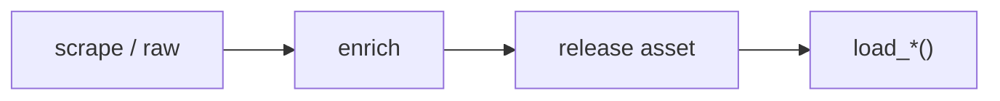

# WNBA dataset loaders



## Automation status

| Dataset | Release tag | Pipeline |
|---|---|---|
| `load_wnba_pbp` | [espn_wnba_pbp](https://github.com/sportsdataverse/sportsdataverse-data/releases/tag/espn_wnba_pbp) | — |
| `load_wnba_player_boxscore` | [espn_wnba_player_boxscores](https://github.com/sportsdataverse/sportsdataverse-data/releases/tag/espn_wnba_player_boxscores) | — |
| `load_wnba_schedule` | [espn_wnba_schedules](https://github.com/sportsdataverse/sportsdataverse-data/releases/tag/espn_wnba_schedules) | — |
| `load_wnba_team_boxscore` | [espn_wnba_team_boxscores](https://github.com/sportsdataverse/sportsdataverse-data/releases/tag/espn_wnba_team_boxscores) | — |
| `load_wnba_draft` | [espn_wnba_draft](https://github.com/sportsdataverse/sportsdataverse-data/releases/tag/espn_wnba_draft) | — |
| `load_wnba_game_rosters` | [espn_wnba_game_rosters](https://github.com/sportsdataverse/sportsdataverse-data/releases/tag/espn_wnba_game_rosters) | — |
| `load_wnba_officials` | [espn_wnba_officials](https://github.com/sportsdataverse/sportsdataverse-data/releases/tag/espn_wnba_officials) | — |
| `load_wnba_player_season_stats` | [espn_wnba_player_season_stats](https://github.com/sportsdataverse/sportsdataverse-data/releases/tag/espn_wnba_player_season_stats) | — |
| `load_wnba_rosters` | [espn_wnba_rosters](https://github.com/sportsdataverse/sportsdataverse-data/releases/tag/espn_wnba_rosters) | — |
| `load_wnba_shots` | [espn_wnba_shots](https://github.com/sportsdataverse/sportsdataverse-data/releases/tag/espn_wnba_shots) | — |
| `load_wnba_standings` | [espn_wnba_standings](https://github.com/sportsdataverse/sportsdataverse-data/releases/tag/espn_wnba_standings) | — |
| `load_wnba_team_season_stats` | [espn_wnba_team_season_stats](https://github.com/sportsdataverse/sportsdataverse-data/releases/tag/espn_wnba_team_season_stats) | — |
| `load_wnba_stats_coaches` | [wnba_stats_coaches](https://github.com/sportsdataverse/sportsdataverse-data/releases/tag/wnba_stats_coaches) | — |
| `load_wnba_stats_draft` | [wnba_stats_draft](https://github.com/sportsdataverse/sportsdataverse-data/releases/tag/wnba_stats_draft) | — |
| `load_wnba_stats_game_rosters` | [wnba_stats_game_rosters](https://github.com/sportsdataverse/sportsdataverse-data/releases/tag/wnba_stats_game_rosters) | — |
| `load_wnba_stats_officials` | [wnba_stats_officials](https://github.com/sportsdataverse/sportsdataverse-data/releases/tag/wnba_stats_officials) | — |
| `load_wnba_stats_pbp` | [wnba_stats_pbp](https://github.com/sportsdataverse/sportsdataverse-data/releases/tag/wnba_stats_pbp) | — |
| `load_wnba_stats_player_game_logs` | [wnba_stats_player_game_logs](https://github.com/sportsdataverse/sportsdataverse-data/releases/tag/wnba_stats_player_game_logs) | — |
| `load_wnba_stats_rosters` | [wnba_stats_rosters](https://github.com/sportsdataverse/sportsdataverse-data/releases/tag/wnba_stats_rosters) | — |
| `load_wnba_stats_schedules` | [wnba_stats_schedules](https://github.com/sportsdataverse/sportsdataverse-data/releases/tag/wnba_stats_schedules) | — |
| `load_wnba_stats_shots` | [wnba_stats_shots](https://github.com/sportsdataverse/sportsdataverse-data/releases/tag/wnba_stats_shots) | — |

## `load_wnba_pbp`

Release: [espn_wnba_pbp](https://github.com/sportsdataverse/sportsdataverse-data/releases/tag/espn_wnba_pbp) · asset `https://github.com/sportsdataverse/sportsdataverse-data/releases/download/espn_wnba_pbp/play_by_play_{season}.parquet`
### Returns

| col_name | type |
|---|---|
| `id` | Float64 |
| `sequence_number` | String |
| `type_id` | Int32 |
| `type_text` | String |
| `text` | String |
| `away_score` | Int32 |
| `home_score` | Int32 |
| `period_number` | Int32 |
| `period_display_value` | String |
| `clock_display_value` | String |
| `scoring_play` | Boolean |
| `score_value` | Int32 |
| `shooting_play` | Boolean |
| `coordinate_x_raw` | Float64 |
| `coordinate_y_raw` | Float64 |
| `season` | Int32 |
| `season_type` | Int32 |
| `away_team_id` | Int32 |
| `away_team_name` | String |
| `away_team_mascot` | String |
| `away_team_abbrev` | String |
| `away_team_name_alt` | String |
| `home_team_id` | Int32 |
| `home_team_name` | String |
| `home_team_mascot` | String |
| `home_team_abbrev` | String |
| `home_team_name_alt` | String |
| `home_team_spread` | Float64 |
| `game_spread` | Float64 |
| `home_favorite` | Boolean |
| `game_spread_available` | Boolean |
| `game_id` | Int32 |
| `qtr` | Int32 |
| `time` | String |
| `clock_minutes` | Int32 |
| `clock_seconds` | Float64 |
| `half` | String |
| `game_half` | String |
| `lead_qtr` | Int32 |
| `lead_game_half` | String |
| `start_quarter_seconds_remaining` | Int32 |
| `start_half_seconds_remaining` | Int32 |
| `start_game_seconds_remaining` | Int32 |
| `game_play_number` | Int32 |
| `end_quarter_seconds_remaining` | Int32 |
| `end_half_seconds_remaining` | Int32 |
| `end_game_seconds_remaining` | Int32 |
| `period` | Int32 |
| `team_id` | Int32 |
| `athlete_id_1` | Int32 |
| `athlete_id_2` | Int32 |
| `athlete_id_3` | Int32 |
| `lag_qtr` | Int32 |
| `lag_game_half` | String |
| `coordinate_x` | Float64 |
| `coordinate_y` | Float64 |
| `game_date` | Date |
| `game_date_time` | Datetime(time_unit='us', time_zone='America/New_York') |
| `type_abbreviation` | String |

```python
load_wnba_pbp(seasons=2024)
```

## `load_wnba_player_boxscore`

Release: [espn_wnba_player_boxscores](https://github.com/sportsdataverse/sportsdataverse-data/releases/tag/espn_wnba_player_boxscores) · asset `https://github.com/sportsdataverse/sportsdataverse-data/releases/download/espn_wnba_player_boxscores/player_box_{season}.parquet`
### Returns

| col_name | type |
|---|---|
| `athlete_display_name` | String |
| `team_short_display_name` | String |
| `min` | String |
| `fg` | String |
| `fg3` | String |
| `ft` | String |
| `oreb` | String |
| `dreb` | String |
| `reb` | String |
| `ast` | String |
| `stl` | String |
| `blk` | String |
| `to` | String |
| `pf` | String |
| `plus_minus` | String |
| `pts` | String |
| `starter` | Boolean |
| `ejected` | Boolean |
| `did_not_play` | Boolean |
| `active` | Boolean |
| `athlete_jersey` | String |
| `athlete_id` | String |
| `athlete_short_name` | String |
| `athlete_position_name` | String |
| `athlete_position_abbreviation` | String |
| `team_name` | String |
| `team_logo` | String |
| `team_id` | String |
| `team_abbreviation` | String |
| `team_color` | String |
| `game_id` | Int32 |
| `season` | Int32 |
| `season_type` | Int32 |
| `game_date` | Date |
| `athlete_headshot_href` | String |

```python
load_wnba_player_boxscore(seasons=2024)
```

## `load_wnba_schedule`

Release: [espn_wnba_schedules](https://github.com/sportsdataverse/sportsdataverse-data/releases/tag/espn_wnba_schedules) · asset `https://github.com/sportsdataverse/sportsdataverse-data/releases/download/espn_wnba_schedules/wnba_schedule_{season}.parquet`
### Returns

| col_name | type |
|---|---|
| `id` | Int32 |
| `uid` | String |
| `date` | String |
| `attendance` | Float64 |
| `time_valid` | Boolean |
| `neutral_site` | Boolean |
| `conference_competition` | Boolean |
| `recent` | Boolean |
| `start_date` | String |
| `notes_type` | String |
| `notes_headline` | String |
| `type_id` | Int32 |
| `type_abbreviation` | String |
| `status_clock` | Float64 |
| `status_display_clock` | String |
| `status_period` | Float64 |
| `status_type_id` | Int32 |
| `status_type_name` | String |
| `status_type_state` | String |
| `status_type_completed` | Boolean |
| `status_type_description` | String |
| `status_type_detail` | String |
| `status_type_short_detail` | String |
| `format_regulation_periods` | Float64 |
| `home_id` | Int32 |
| `home_uid` | String |
| `home_location` | String |
| `home_name` | String |
| `home_abbreviation` | String |
| `home_display_name` | String |
| `home_short_display_name` | String |
| `home_color` | String |
| `home_alternate_color` | String |
| `home_is_active` | Boolean |
| `home_venue_id` | Int32 |
| `home_logo` | String |
| `home_score` | Int32 |
| `home_winner` | Boolean |
| `away_id` | Int32 |
| `away_uid` | String |
| `away_location` | String |
| `away_name` | String |
| `away_abbreviation` | String |
| `away_display_name` | String |
| `away_short_display_name` | String |
| `away_is_active` | Boolean |
| `away_venue_id` | Int32 |
| `away_score` | Int32 |
| `away_winner` | Boolean |
| `game_id` | Int32 |
| `season` | Int32 |
| `season_type` | Int32 |
| `venue_id` | Int32 |
| `venue_full_name` | String |
| `venue_address_city` | String |
| `venue_address_state` | String |
| `venue_capacity` | Float64 |
| `venue_indoor` | Boolean |
| `away_color` | String |
| `away_alternate_color` | String |
| `away_logo` | String |
| `status_type_alt_detail` | String |
| `game_json` | Boolean |
| `game_json_url` | String |
| `game_date_time` | Datetime(time_unit='us', time_zone='America/New_York') |
| `game_date` | Date |
| `PBP` | Boolean |
| `team_box` | Boolean |
| `player_box` | Boolean |

```python
load_wnba_schedule(seasons=2024)
```

## `load_wnba_team_boxscore`

Release: [espn_wnba_team_boxscores](https://github.com/sportsdataverse/sportsdataverse-data/releases/tag/espn_wnba_team_boxscores) · asset `https://github.com/sportsdataverse/sportsdataverse-data/releases/download/espn_wnba_team_boxscores/team_box_{season}.parquet`
### Returns

| col_name | type |
|---|---|
| `game_id` | Int32 |
| `season` | Int32 |
| `season_type` | Int32 |
| `game_date` | Date |
| `game_date_time` | Datetime(time_unit='us', time_zone='America/New_York') |
| `team_id` | Int32 |
| `team_uid` | String |
| `team_slug` | String |
| `team_location` | String |
| `team_name` | String |
| `team_abbreviation` | String |
| `team_display_name` | String |
| `team_short_display_name` | String |
| `team_color` | String |
| `team_alternate_color` | String |
| `team_logo` | String |
| `team_home_away` | String |
| `team_score` | Int32 |
| `team_winner` | Boolean |
| `assists` | Int32 |
| `blocks` | Int32 |
| `defensive_rebounds` | Int32 |
| `fast_break_points` | String |
| `field_goal_pct` | Float64 |
| `field_goals_made` | Int32 |
| `field_goals_attempted` | Int32 |
| `flagrant_fouls` | Int32 |
| `fouls` | Int32 |
| `free_throw_pct` | Float64 |
| `free_throws_made` | Int32 |
| `free_throws_attempted` | Int32 |
| `largest_lead` | String |
| `offensive_rebounds` | Int32 |
| `points_in_paint` | String |
| `steals` | Int32 |
| `team_turnovers` | Int32 |
| `technical_fouls` | Int32 |
| `three_point_field_goal_pct` | Float64 |
| `three_point_field_goals_made` | Int32 |
| `three_point_field_goals_attempted` | Int32 |
| `total_rebounds` | Int32 |
| `total_technical_fouls` | Int32 |
| `total_turnovers` | Int32 |
| `turnover_points` | String |
| `turnovers` | Int32 |
| `opponent_team_id` | Int32 |
| `opponent_team_uid` | String |
| `opponent_team_slug` | String |
| `opponent_team_location` | String |
| `opponent_team_name` | String |
| `opponent_team_abbreviation` | String |
| `opponent_team_display_name` | String |
| `opponent_team_short_display_name` | String |
| `opponent_team_color` | String |
| `opponent_team_alternate_color` | String |
| `opponent_team_logo` | String |
| `opponent_team_score` | Int32 |

```python
load_wnba_team_boxscore(seasons=2024)
```

## `load_wnba_draft`

Release: [espn_wnba_draft](https://github.com/sportsdataverse/sportsdataverse-data/releases/tag/espn_wnba_draft) · asset `https://github.com/sportsdataverse/sportsdataverse-data/releases/download/espn_wnba_draft/draft_{season}.parquet`
### Returns

| col_name | type |
|---|---|
| `season` | Int32 |
| `round` | Int32 |
| `round_display_name` | String |
| `pick` | Int32 |
| `overall_pick` | Int32 |
| `pick_traded` | String |
| `pick_notes` | String |
| `athlete_id` | Int32 |
| `athlete_uid` | String |
| `athlete_guid` | String |
| `athlete_first_name` | String |
| `athlete_last_name` | String |
| `athlete_full_name` | String |
| `athlete_display_name` | String |
| `athlete_short_name` | String |
| `athlete_height` | String |
| `athlete_weight` | String |
| `athlete_position_abbreviation` | String |
| `athlete_position_name` | String |
| `athlete_headshot_href` | String |
| `college_id` | Int32 |
| `college_name` | String |
| `college_short_name` | String |
| `college_abbreviation` | String |
| `team_id` | Int32 |
| `team_uid` | String |
| `team_slug` | String |
| `team_location` | String |
| `team_name` | String |
| `team_abbreviation` | String |
| `team_display_name` | String |
| `team_short_display_name` | String |
| `team_color` | String |
| `team_alternate_color` | String |
| `team_logo` | String |

```python
load_wnba_draft(seasons=2026)
```

## `load_wnba_game_rosters`

Release: [espn_wnba_game_rosters](https://github.com/sportsdataverse/sportsdataverse-data/releases/tag/espn_wnba_game_rosters) · asset `https://github.com/sportsdataverse/sportsdataverse-data/releases/download/espn_wnba_game_rosters/game_rosters_{season}.parquet`
### Returns

| col_name | type |
|---|---|
| `season` | Int32 |
| `game_id` | String |
| `team_id` | Int32 |
| `team_slug` | String |
| `team_abbreviation` | String |
| `team_display_name` | String |
| `home_away` | String |
| `athlete_id` | Int32 |
| `athlete_uid` | String |
| `athlete_guid` | String |
| `athlete_display_name` | String |
| `athlete_short_name` | String |
| `athlete_first_name` | String |
| `athlete_last_name` | String |
| `athlete_jersey` | String |
| `athlete_position` | String |
| `athlete_headshot` | String |
| `starter` | Boolean |
| `did_not_play` | Boolean |
| `active` | Boolean |
| `ejected` | Boolean |
| `reason` | String |

```python
load_wnba_game_rosters(seasons=2024)
```

## `load_wnba_officials`

Release: [espn_wnba_officials](https://github.com/sportsdataverse/sportsdataverse-data/releases/tag/espn_wnba_officials) · asset `https://github.com/sportsdataverse/sportsdataverse-data/releases/download/espn_wnba_officials/officials_{season}.parquet`
### Returns

| col_name | type |
|---|---|
| `season` | Int32 |
| `game_id` | String |
| `official_id` | Int32 |
| `official_uid` | String |
| `official_full_name` | String |
| `official_display_name` | String |
| `official_first_name` | String |
| `official_last_name` | String |
| `official_order` | Int32 |
| `position_name` | String |
| `position_display_name` | String |

```python
load_wnba_officials(seasons=2024)
```

## `load_wnba_player_season_stats`

Release: [espn_wnba_player_season_stats](https://github.com/sportsdataverse/sportsdataverse-data/releases/tag/espn_wnba_player_season_stats) · asset `https://github.com/sportsdataverse/sportsdataverse-data/releases/download/espn_wnba_player_season_stats/player_season_stats_{season}.parquet`
### Returns

| col_name | type |
|---|---|
| `season` | Int32 |
| `athlete_id` | Int32 |
| `athlete_display_name` | String |
| `athlete_first_name` | String |
| `athlete_last_name` | String |
| `athlete_position_abbreviation` | String |
| `athlete_jersey` | String |
| `team_id` | Int32 |
| `team_display_name` | String |
| `category` | String |
| `stat_label` | String |
| `stat_name` | String |
| `stat_display_name` | String |
| `stat_description` | String |
| `display_value` | String |
| `value` | Float64 |

```python
load_wnba_player_season_stats(seasons=2024)
```

## `load_wnba_rosters`

Release: [espn_wnba_rosters](https://github.com/sportsdataverse/sportsdataverse-data/releases/tag/espn_wnba_rosters) · asset `https://github.com/sportsdataverse/sportsdataverse-data/releases/download/espn_wnba_rosters/rosters_{season}.parquet`
### Returns

| col_name | type |
|---|---|
| `season` | Int32 |
| `team_id` | Int32 |
| `team_slug` | String |
| `team_abbreviation` | String |
| `team_display_name` | String |
| `team_short_display_name` | String |
| `team_color` | String |
| `team_alternate_color` | String |
| `team_logo` | String |
| `athlete_id` | String |
| `uid` | String |
| `guid` | String |
| `full_name` | String |
| `display_name` | String |
| `short_name` | String |
| `first_name` | String |
| `last_name` | String |
| `jersey` | String |
| `position_abbreviation` | String |
| `position_name` | String |
| `position_id` | String |
| `height` | String |
| `weight` | String |
| `age` | String |
| `date_of_birth` | String |
| `birth_place_city` | String |
| `birth_place_state` | String |
| `birth_place_country` | String |
| `experience_years` | String |
| `experience_display_value` | String |
| `headshot_href` | String |
| `headshot_alt` | String |
| `link_web` | String |
| `status_id` | String |
| `status_name` | String |
| `status_type` | String |

```python
load_wnba_rosters(seasons=2024)
```

## `load_wnba_shots`

Release: [espn_wnba_shots](https://github.com/sportsdataverse/sportsdataverse-data/releases/tag/espn_wnba_shots) · asset `https://github.com/sportsdataverse/sportsdataverse-data/releases/download/espn_wnba_shots/shots_{season}.parquet`
### Returns

| col_name | type |
|---|---|
| `game_id` | Int32 |
| `season` | Int32 |
| `period_number` | Int32 |
| `clock_display_value` | String |
| `team_id` | Int32 |
| `athlete_id_1` | Int32 |
| `athlete_id_2` | Int32 |
| `type_id` | Int32 |
| `type_text` | String |
| `scoring_play` | Boolean |
| `score_value` | Int32 |
| `coordinate_x` | Float64 |
| `coordinate_y` | Float64 |
| `coordinate_x_raw` | Float64 |
| `coordinate_y_raw` | Float64 |

```python
load_wnba_shots(seasons=2024)
```

## `load_wnba_standings`

Release: [espn_wnba_standings](https://github.com/sportsdataverse/sportsdataverse-data/releases/tag/espn_wnba_standings) · asset `https://github.com/sportsdataverse/sportsdataverse-data/releases/download/espn_wnba_standings/standings_{season}.parquet`
### Returns

| col_name | type |
|---|---|
| `season` | Int32 |
| `group_id` | String |
| `group_name` | String |
| `group_abbreviation` | String |
| `group_short_name` | String |
| `team_id` | Int32 |
| `team_uid` | String |
| `team_slug` | String |
| `team_location` | String |
| `team_name` | String |
| `team_abbreviation` | String |
| `team_display_name` | String |
| `team_short_display_name` | String |
| `team_color` | String |
| `team_alternate_color` | String |
| `team_logo` | String |
| `stat_name` | String |
| `stat_display_name` | String |
| `stat_short_display_name` | String |
| `stat_description` | String |
| `stat_abbreviation` | String |
| `stat_type` | String |
| `display_value` | String |
| `value` | Float64 |

```python
load_wnba_standings(seasons=2024)
```

## `load_wnba_team_season_stats`

Release: [espn_wnba_team_season_stats](https://github.com/sportsdataverse/sportsdataverse-data/releases/tag/espn_wnba_team_season_stats) · asset `https://github.com/sportsdataverse/sportsdataverse-data/releases/download/espn_wnba_team_season_stats/team_season_stats_{season}.parquet`
### Returns

| col_name | type |
|---|---|
| `season` | Int32 |
| `team_id` | Int32 |
| `team_slug` | String |
| `team_abbreviation` | String |
| `team_display_name` | String |
| `team_short_display_name` | String |
| `team_color` | String |
| `team_alternate_color` | String |
| `team_logo` | String |
| `category` | String |
| `stat_label` | String |
| `stat_name` | String |
| `stat_display_name` | String |
| `stat_description` | String |
| `display_value` | String |
| `value` | Float64 |

```python
load_wnba_team_season_stats(seasons=2024)
```

## `load_wnba_stats_coaches`

Release: [wnba_stats_coaches](https://github.com/sportsdataverse/sportsdataverse-data/releases/tag/wnba_stats_coaches) · asset `https://github.com/sportsdataverse/sportsdataverse-data/releases/download/wnba_stats_coaches/coaches_{season}.parquet`
### Returns

| col_name | type |
|---|---|
| `team_id` | String |
| `season` | Int32 |
| `coach_id` | String |
| `first_name` | String |
| `last_name` | String |
| `coach_name` | String |
| `is_assistant` | String |
| `coach_type` | String |
| `sort_sequence` | String |
| `sub_sort_sequence` | String |
| `season_2` | Int32 |
| `team_id_lookup` | Int32 |

```python
load_wnba_stats_coaches(seasons=2026)
```

## `load_wnba_stats_draft`

Release: [wnba_stats_draft](https://github.com/sportsdataverse/sportsdataverse-data/releases/tag/wnba_stats_draft) · asset `https://github.com/sportsdataverse/sportsdataverse-data/releases/download/wnba_stats_draft/draft_{season}.parquet`
### Returns

| col_name | type |
|---|---|
| `person_id` | String |
| `player_name` | String |
| `season` | Int32 |
| `round_number` | String |
| `round_pick` | String |
| `overall_pick` | String |
| `draft_type` | String |
| `team_id` | String |
| `team_city` | String |
| `team_name` | String |
| `team_abbreviation` | String |
| `organization` | String |
| `organization_type` | String |
| `player_profile_flag` | String |
| `season_2` | Int32 |

```python
load_wnba_stats_draft(seasons=2025)
```

## `load_wnba_stats_game_rosters`

Release: [wnba_stats_game_rosters](https://github.com/sportsdataverse/sportsdataverse-data/releases/tag/wnba_stats_game_rosters) · asset `https://github.com/sportsdataverse/sportsdataverse-data/releases/download/wnba_stats_game_rosters/game_rosters_{season}.parquet`
### Returns

| col_name | type |
|---|---|
| `player_id` | String |
| `first_name` | String |
| `last_name` | String |
| `jersey_num` | String |
| `team_id` | String |
| `team_city` | String |
| `team_name` | String |
| `team_abbreviation` | String |
| `game_id` | String |
| `season` | Int32 |

```python
load_wnba_stats_game_rosters(seasons=2026)
```

## `load_wnba_stats_officials`

Release: [wnba_stats_officials](https://github.com/sportsdataverse/sportsdataverse-data/releases/tag/wnba_stats_officials) · asset `https://github.com/sportsdataverse/sportsdataverse-data/releases/download/wnba_stats_officials/officials_{season}.parquet`
### Returns

| col_name | type |
|---|---|
| `official_id` | String |
| `first_name` | String |
| `last_name` | String |
| `jersey_num` | String |
| `game_id` | String |
| `season` | Int32 |

```python
load_wnba_stats_officials(seasons=2026)
```

## `load_wnba_stats_pbp`

Release: [wnba_stats_pbp](https://github.com/sportsdataverse/sportsdataverse-data/releases/tag/wnba_stats_pbp) · asset `https://github.com/sportsdataverse/sportsdataverse-data/releases/download/wnba_stats_pbp/play_by_play_{season}.parquet`
### Returns

| col_name | type |
|---|---|
| `game_id` | String |
| `event_num` | String |
| `event_type` | String |
| `event_action_type` | String |
| `period` | Int32 |
| `clock` | String |
| `minute_game` | Float64 |
| `time_remaining` | Float64 |
| `time_quarter` | String |
| `minute_remaining_quarter` | Int32 |
| `seconds_remaining_quarter` | Int32 |
| `action_type` | String |
| `sub_type` | String |
| `neutral_description` | String |
| `description` | String |
| `location` | String |
| `score` | String |
| `away_score` | Int32 |
| `home_score` | Int32 |
| `score_margin` | String |
| `person1type` | String |
| `player1_id` | String |
| `player1_name` | String |
| `player1_team_id` | String |
| `player1_team_abbreviation` | String |
| `video_available_flag` | String |
| `team_leading` | String |
| `x_legacy` | Int32 |
| `y_legacy` | Int32 |
| `shot_distance` | Int32 |
| `shot_result` | String |
| `is_field_goal` | Int32 |
| `points_total` | Int32 |
| `shot_value` | Int32 |
| `action_number` | Int32 |
| `team_id` | Int32 |
| `team_tricode` | String |
| `person_id` | Int32 |
| `player_name` | String |
| `player_name_i` | String |
| `score_home` | String |
| `score_away` | String |
| `video_available` | Int32 |
| `action_id` | Int32 |
| `away_player1` | Int32 |
| `away_player2` | Int32 |
| `away_player3` | Int32 |
| `away_player4` | Int32 |
| `away_player5` | Int32 |
| `home_player1` | Int32 |
| `home_player2` | Int32 |
| `home_player3` | Int32 |
| `home_player4` | Int32 |
| `home_player5` | Int32 |
| `home_description` | String |
| `player1_team_city` | String |
| `player1_team_nickname` | String |
| `visitor_description` | String |
| `player2_id` | String |
| `player2_name` | String |
| `player2_team_id` | String |
| `player2_team_city` | String |
| `player2_team_nickname` | String |
| `player2_team_abbreviation` | String |
| `player3_id` | String |
| `player3_name` | String |
| `player3_team_id` | String |
| `player3_team_city` | String |
| `player3_team_nickname` | String |
| `player3_team_abbreviation` | String |
| `score_value` | Int32 |
| `msg_type` | Int32 |
| `act_type` | Int32 |
| `slug_team` | String |
| `shot_pts` | Int32 |
| `secs_passed_game` | Float64 |
| `team_away` | String |
| `team_home` | String |
| `off_slug_team` | String |
| `number_event` | Int32 |
| `possession` | Int32 |
| `total_starters_home` | Int32 |
| `total_starters_away` | Int32 |
| `garbage_time` | Int32 |
| `season` | Int32 |

```python
load_wnba_stats_pbp(seasons=2026)
```

## `load_wnba_stats_player_game_logs`

Release: [wnba_stats_player_game_logs](https://github.com/sportsdataverse/sportsdataverse-data/releases/tag/wnba_stats_player_game_logs) · asset `https://github.com/sportsdataverse/sportsdataverse-data/releases/download/wnba_stats_player_game_logs/player_game_logs_{season}.parquet`
### Returns

| col_name | type |
|---|---|
| `season_id` | String |
| `player_id` | Int32 |
| `player_name` | String |
| `team_id` | Int32 |
| `team_abbreviation` | String |
| `team_name` | String |
| `game_id` | String |
| `game_date` | String |
| `matchup` | String |
| `wl` | String |
| `min` | String |
| `fgm` | String |
| `fga` | String |
| `fg_pct` | String |
| `fg3m` | String |
| `fg3a` | String |
| `fg3_pct` | String |
| `ftm` | String |
| `fta` | String |
| `ft_pct` | String |
| `oreb` | String |
| `dreb` | String |
| `reb` | String |
| `ast` | String |
| `stl` | String |
| `blk` | String |
| `tov` | String |
| `pf` | String |
| `pts` | String |
| `plus_minus` | String |
| `fantasy_pts` | String |
| `video_available` | String |
| `team_location` | String |
| `season` | Int32 |

```python
load_wnba_stats_player_game_logs(seasons=2025)
```

## `load_wnba_stats_rosters`

Release: [wnba_stats_rosters](https://github.com/sportsdataverse/sportsdataverse-data/releases/tag/wnba_stats_rosters) · asset `https://github.com/sportsdataverse/sportsdataverse-data/releases/download/wnba_stats_rosters/rosters_{season}.parquet`
### Returns

| col_name | type |
|---|---|
| `team_id` | String |
| `season` | Int32 |
| `league_id` | String |
| `player` | String |
| `nickname` | String |
| `player_slug` | String |
| `num` | String |
| `position` | String |
| `height` | String |
| `weight` | String |
| `birth_date` | String |
| `age` | String |
| `exp` | String |
| `school` | String |
| `player_id` | String |
| `how_acquired` | String |
| `season_2` | Int32 |
| `team_id_lookup` | Int32 |

```python
load_wnba_stats_rosters(seasons=2026)
```

## `load_wnba_stats_schedules`

Release: [wnba_stats_schedules](https://github.com/sportsdataverse/sportsdataverse-data/releases/tag/wnba_stats_schedules) · asset `https://github.com/sportsdataverse/sportsdataverse-data/releases/download/wnba_stats_schedules/wnba_stats_schedule_{season}.parquet`
### Returns

| col_name | type |
|---|---|
| `SEASON_ID` | String |
| `TEAM_ID` | String |
| `TEAM_ABBREVIATION` | String |
| `TEAM_NAME` | String |
| `GAME_ID` | String |
| `GAME_DATE` | String |
| `MATCHUP` | String |
| `WL` | String |
| `MIN` | String |
| `PTS` | String |
| `FGM` | String |
| `FGA` | String |
| `FG_PCT` | String |
| `FG3M` | String |
| `FG3A` | String |
| `FG3_PCT` | String |
| `FTM` | String |
| `FTA` | String |
| `FT_PCT` | String |
| `OREB` | String |
| `DREB` | String |
| `REB` | String |
| `AST` | String |
| `STL` | String |
| `BLK` | String |
| `TOV` | String |
| `PF` | String |
| `PLUS_MINUS` | String |
| `season` | Int32 |

```python
load_wnba_stats_schedules(seasons=2025)
```

## `load_wnba_stats_shots`

Release: [wnba_stats_shots](https://github.com/sportsdataverse/sportsdataverse-data/releases/tag/wnba_stats_shots) · asset `https://github.com/sportsdataverse/sportsdataverse-data/releases/download/wnba_stats_shots/shots_{season}.parquet`
### Returns

| col_name | type |
|---|---|
| `game_id` | String |
| `season` | Int32 |
| `period` | Int32 |
| `clock` | String |
| `team_id` | Int32 |
| `person_id` | Int32 |
| `action_type` | String |
| `sub_type` | String |
| `description` | String |
| `x_legacy` | Int32 |
| `y_legacy` | Int32 |
| `shot_distance` | Int32 |
| `shot_value` | Int32 |
| `shot_result` | String |
| `points_total` | Int32 |

```python
load_wnba_stats_shots(seasons=2026)
```
