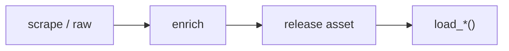

<!-- START doctoc generated TOC please keep comment here to allow auto update -->
<!-- DON'T EDIT THIS SECTION, INSTEAD RE-RUN doctoc TO UPDATE -->
**Table of Contents**  *generated with [DocToc](https://github.com/thlorenz/doctoc)*

- [Generated Docs Site + Notebooks + Drift CI Implementation Plan](#generated-docs-site--notebooks--drift-ci-implementation-plan)
  - [File Structure](#file-structure)
  - [Task 1: `_reference_block.jinja` — the full 8-section function block](#task-1-_reference_blockjinja--the-full-8-section-function-block)
  - [Task 2: Index, loaders, parameters, packages, category templates](#task-2-index-loaders-parameters-packages-category-templates)
  - [Automation status](#automation-status)
  - [`{{ ld.fn }}`](#-ldfn-)
    - [Returns](#returns)
  - [Task 3: `generate.py --docs` — regenerate the whole `docs/docs/{league}/` subtree](#task-3-generatepy---docs--regenerate-the-whole-docsdocsleague-subtree)
  - [Task 4: Autogenerated sidebar + delete `create_docs.sh`/`Sphinx-docs`](#task-4-autogenerated-sidebar--delete-create_docsshsphinx-docs)
  - [Task 5: Navbar package dropdown from `projects.json`](#task-5-navbar-package-dropdown-from-projectsjson)
  - [Task 6: Example-notebook expansion + CI execution](#task-6-example-notebook-expansion--ci-execution)
  - [Task 7: Pre-commit drift hook + CI workflow + doc-parity test](#task-7-pre-commit-drift-hook--ci-workflow--doc-parity-test)
  - [Self-Review](#self-review)

<!-- END doctoc generated TOC please keep comment here to allow auto update -->

# Generated Docs Site + Notebooks + Drift CI Implementation Plan

> **For agentic workers:** REQUIRED SUB-SKILL: Use superpowers:subagent-driven-development (recommended) or superpowers:executing-plans. Steps use checkbox (`- [ ]`) syntax. **Prerequisite:** Plans 1–4 complete — all API + loader modules generate; `parameters.yaml`/`releases.yaml`/schemas/vocab exist; `_reference_block` data (example URLs, `@return` tables) is available on `_EndpointView`/`Loader`.

**Goal:** Generate the entire `docs/docs/{league}/` subtree (overview + per-API reference + loaders page with diagram & automation badges + parameter reference + packages page) from the metadata, wire an autogenerated Docusaurus sidebar (incl. the full package list from `projects.json`), expand `examples/notebooks/` with CI-executed tutorials, delete the legacy `create_docs.sh`/`Sphinx-docs`, and lock everything behind a pre-commit + CI drift gate.

**Architecture:** Shared Jinja macros (`_docstring.jinja` already exists; add `_reference_block.jinja`) render every function's 8-section reference. `generate.py --docs` deletes + rewrites `docs/docs/{league}/` (index, `reference/{api}.md`, `reference/loaders.md`, `_category_.json`) + `docs/docs/reference/parameters.md` + `docs/docs/packages.mdx`. The `docs` sidebar switches to `{type:'autogenerated'}` so the tree self-registers. The package list is fetched from `sportsdataverse-web/projects.json`. Notebooks are hand-authored, CI-executed (`nbmake`), and cross-linked from module pages. A `local` pre-commit hook regenerates on any `tools/codegen/**` input change; CI runs `--check` + `docusaurus build` + `pytest`.

**Tech Stack:** Python ≥3.10, Jinja2, PyYAML, Docusaurus 3, `nbmake`, pytest, ruff, pre-commit, GitHub Actions.

---

## File Structure

**Create:**

- `tools/codegen/templates/_reference_block.jinja` — per-function docs block (shared macro).
- `tools/codegen/templates/{league_index,loaders_page,parameter_reference}.md.jinja`, `packages_page.mdx.jinja`, `category_json.jinja`.
- `tools/codegen/fetch_packages.py` — fetch `projects.json` → `tools/codegen/packages.json` snapshot.
- `examples/notebooks/{08_espn_endpoints,09_nhl_native,10_mlb_stats,11_loaders}.ipynb`.
- `.github/workflows/codegen.yml` — `--check` + `docusaurus build` + `--audit-releases` + notebook execution.
- `tests/codegen/test_docs.py`, `tests/codegen/test_doc_parity.py`.

**Modify:**

- `tools/codegen/generate.py` — `--docs` (full subtree regen) + packages + parameters page; `--check` covers docs.
- `docs/sidebars.ts` — `docs` sidebar → `{type:'autogenerated'}`; navbar SDV dropdown from packages snapshot.
- `examples/notebooks/01_quickstart … 07_nhl_intro.ipynb` — update renamed functions.
- `.pre-commit-config.yaml` — broaden the `sdv-codegen` hook to full `generate.py` (code + docs).
- `pyproject.toml` — add `nbmake` to dev deps.
- `CLAUDE.md` / `CONTRIBUTING.md` — document the edit-YAML→generate→commit workflow.

**Delete:**

- `create_docs.sh`, `Sphinx-docs/` (the autodoc pipeline).

---

## Task 1: `_reference_block.jinja` — the full 8-section function block

**Files:**

- Create: `tools/codegen/templates/_reference_block.jinja`
- Modify: `tools/codegen/generate.py` (attach `param_rows`, `valid_url`, `return_table`, `r_equivalent`, `notebook` to views)
- Test: `tests/codegen/test_docs.py`

- [ ] **Step 1: Write the failing test**

`tests/codegen/test_docs.py`:

```python
from tools.codegen import generate

def test_reference_block_has_all_sections():
    md = generate.render_reference_page("nba", "espn_site_v2")
    assert "## `espn_nba_scoreboard`" in md
    assert "Endpoint URL" in md
    assert "Valid URL" in md
    assert "| API Parameter | Python | Pattern | Required | Nullable |" in md  # nba_api-style param table
    assert "### Returns" in md
    assert "Last validated" in md
    assert "```python" in md  # runnable example
```

- [ ] **Step 2: Run → fail**

Run: `pytest tests/codegen/test_docs.py::test_reference_block_has_all_sections -v`
Expected: FAIL — `render_reference_page` / `_reference_block.jinja` missing.

- [ ] **Step 3: Write `_reference_block.jinja`**

```jinja

## `{{ ep.fn_name }}`

{{ ep.summary }}

**Endpoint URL:** `GET {{ ep.endpoint_url }}`
**Valid URL:** [{{ ep.valid_url }}]({{ ep.valid_url }})

**R equivalent:** `{{ pkg }}::{{ fn }}()`, 


| API Parameter | Python | Pattern | Required | Nullable |
|---|---|:---:|:---:|:---:|
| `{{ r.api }}` | `{{ r.python }}` | `{{ r.pattern }}` | `Y` | `Y` |


### Returns

{{ ep.return_table }}
{{ ep.returns_prose or "Raw JSON `Dict` (no parser registered)." }}


### Example
```python

{{ ep.example_call }}

```

> See the [{{ ep.notebook }} notebook](../../../examples/notebooks/{{ ep.notebook }}.ipynb) for a runnable walkthrough.


_Last validated {{ ep.last_validated or "n/a" }}._

```

- [ ] **Step 4: Implement `render_reference_page` + view enrichment in `generate.py`**

Add to `_EndpointView` (and the loader equivalent) the doc fields: `endpoint_url` (host+path template), `valid_url` (`_example_url`, already computed), `param_rows` (merge path+query params → `{api, python, pattern, required, nullable}`), `return_table` (markdown table rendered from the `returns_schema` columns; `kind: frames` → multiple tables), `r_equivalent`, `last_validated`, `notebook`. Add `render_reference_page(prefix, api)` that loads the api YAML, builds views for the league, and renders a page with the `_reference_block` macro per function + frontmatter.

```python
def _return_table(schema_name):
    if not schema_name:
        return ""
    import yaml
    p = ROOT / "tools" / "codegen" / "schemas" / f"{schema_name}.yaml"
    if not p.exists():
        return ""
    d = yaml.safe_load(p.read_text(encoding="utf-8"))
    def tbl(cols):
        head = "| col_name | type | description |\n|---|---|---|\n"
        return head + "".join(f"| `{c['name']}` | {c['type']} | {c.get('description','')} |\n" for c in cols)
    if d.get("kind") == "frames":
        return "\n".join(f"**{name}**\n\n{tbl(blk['columns'])}" for name, blk in d["datasets"].items())
    return tbl(d["columns"])
```

- [ ] **Step 5: Run → pass; commit**

Run: `pytest tests/codegen/test_docs.py -v` → PASS

```bash
git add tools/codegen/templates/_reference_block.jinja tools/codegen/generate.py tests/codegen/test_docs.py
git commit -m "feat(codegen): _reference_block macro — 8-section function reference (param table, @return, valid URL)"
```

---

## Task 2: Index, loaders, parameters, packages, category templates

**Files:**

- Create: `tools/codegen/templates/{league_index.md.jinja,loaders_page.md.jinja,parameter_reference.md.jinja,packages_page.mdx.jinja,category_json.jinja}`, `tools/codegen/fetch_packages.py`
- Modify: `tools/codegen/generate.py`
- Test: `tests/codegen/test_docs.py` (extend)

- [ ] **Step 1: `league_index.md.jinja`** (overview + API table + example-notebook links)

```jinja
---
title: {{ prefix|upper }}
sidebar_label: {{ prefix|upper }}
---
# {{ prefix|upper }} (`sportsdataverse.{{ prefix }}`)

| API | Functions | Base URL |
|---|---:|---|
| [{{ a.label }}](reference/{{ a.slug }}) | {{ a.count }} | `{{ a.base }}` |


## Examples
- [{{ nb }}](../../examples/notebooks/{{ nb }}.ipynb)

```

- [ ] **Step 2: `loaders_page.md.jinja`** (links + Mermaid diagram + automation badges + per-loader block)

```jinja
---
title: Dataset loaders
sidebar_label: Loaders
---
# {{ prefix|upper }} dataset loaders



## Automation status

| Dataset | Release tag | Pipeline | Status |
|---|---|---|---|
| `{{ ld.fn }}` | [{{ ld.tag }}](https://github.com/sportsdataverse/sportsdataverse-data/releases/tag/{{ ld.tag }}) | {{ ld.automation.repo }} |  |



## `{{ ld.fn }}`
Release: [{{ ld.tag }}](https://github.com/sportsdataverse/sportsdataverse-data/releases/tag/{{ ld.tag }}) · asset `{{ ld.url }}`

### Returns
{{ ld.return_table }}

```python

{{ ld.fn }}(seasons={{ ld.example_args.get('seasons', 2024) }})

```

```

- [ ] **Step 3: `parameter_reference.md.jinja`** (from `parameters.yaml`)

```jinja
---
title: Parameters
---
# Parameter reference

| Python | API | Type | Default | Pattern | Nullable |
|---|---|---|---|---|:---:|
| `{{ p.python_name }}` | `{{ p.api }}` | {{ p.type }} | `{{ p.default }}` | `{{ p.pattern }}` | `Y` |

```

- [ ] **Step 4: `packages_page.mdx.jinja` + `fetch_packages.py`**

`tools/codegen/fetch_packages.py` fetches the projects.json the website renders and snapshots it:

```python
"""Snapshot sportsdataverse.org/packages source (projects.json)."""
from __future__ import annotations
import json, urllib.request
from pathlib import Path

URL = "https://raw.githubusercontent.com/sportsdataverse/sportsdataverse-web/with-data/frontend/data/projects.json"

def fetch():
    with urllib.request.urlopen(URL, timeout=20) as r:
        data = json.loads(r.read())
    items = data if isinstance(data, list) else next(v for v in data.values() if isinstance(v, list))
    pkgs = [{"name": p["name"], "language": p.get("language", ""),
             "url": (p.get("urls") or {}).get("site") or (p.get("urls") or {}).get("repo") or ""}
            for p in items]
    Path("tools/codegen/packages.json").write_text(json.dumps(pkgs, indent=2), encoding="utf-8")
    return pkgs

if __name__ == "__main__":
    fetch()
```

`packages_page.mdx.jinja`:

```jinja
---
title: SportsDataVerse Packages
---
# SportsDataVerse Packages

| Package | Language | Link |
|---|---|---|
| {{ p.name }} | {{ p.language }} | [{{ p.url }}]({{ p.url }}) |

```

- [ ] **Step 5: `category_json.jinja`** (`_category_.json`)

```jinja
{
  "label": "{{ label }}",
  "position": {{ position }},
  "collapsed": {{ collapsed|lower }}
}
```

- [ ] **Step 6: Test the index/loaders/packages render + commit**

Add tests asserting: index lists the API rows + notebook links; loaders page contains a `badge.svg` URL + a Mermaid block; packages page lists all 26 names from a committed `packages.json` fixture. Run → PASS.

```bash
git add tools/codegen/templates/ tools/codegen/fetch_packages.py tools/codegen/generate.py tests/codegen/test_docs.py
git commit -m "feat(codegen): index/loaders/parameters/packages/category doc templates + packages fetch"
```

---

## Task 3: `generate.py --docs` — regenerate the whole `docs/docs/{league}/` subtree

**Files:**

- Modify: `tools/codegen/generate.py`
- Test: `tests/codegen/test_docs.py` (extend)

- [ ] **Step 1: Implement `build_docs()`**

```python
import shutil

DOCS = ROOT / "docs" / "docs"

def build_docs() -> None:
    cfg = spec.load_leagues(ENDPOINTS / "leagues.yaml")
    leagues = [lg.prefix for lg in cfg.leagues] + ["pwhl"]
    for i, prefix in enumerate(leagues):
        ldir = DOCS / prefix
        # wholesale clobber of the generated subtree (nothing here is hand-edited)
        if ldir.exists():
            shutil.rmtree(ldir)
        (ldir / "reference").mkdir(parents=True)
        (ldir / "index.md").write_text(render_league_index(prefix), encoding="utf-8")
        (ldir / "_category_.json").write_text(render_category(prefix.upper(), 10 + i, True), encoding="utf-8")
        for api in _apis_for(prefix):
            (ldir / "reference" / f"{api.slug}.md").write_text(render_reference_page(prefix, api.name), encoding="utf-8")
        if _has_loaders(prefix):
            (ldir / "reference" / "loaders.md").write_text(render_loaders_page(prefix), encoding="utf-8")
        (ldir / "reference" / "_category_.json").write_text(render_category("Reference", 1, True), encoding="utf-8")
    (DOCS / "reference").mkdir(exist_ok=True)
    (DOCS / "reference" / "parameters.md").write_text(render_parameters_page(), encoding="utf-8")
    (DOCS / "packages.mdx").write_text(render_packages_page(), encoding="utf-8")
```

Wire `--docs` into `main()` and include the docs subtree in `--check` (compare each generated file byte-for-byte; for `--docs` regen-to-temp + diff).

- [ ] **Step 2: Run a docs build + verify structure**

Run: `python tools/codegen/generate.py --docs && ls docs/docs/nhl docs/docs/nhl/reference docs/docs/reference docs/docs/packages.mdx`
Expected: `index.md`, `_category_.json`, `reference/{espn,api_web,edge,stats_rest,records}.md`, `reference/loaders.md`, `reference/_category_.json`; top-level `parameters.md` + `packages.mdx`.

- [ ] **Step 3: Docusaurus build sanity**

Run: `cd docs && yarn install --frozen-lockfile && yarn build`
Expected: build succeeds (no MDX errors). Fix any MDX-escaping issues by hardening `render.py`'s escaper over mined free-text.

- [ ] **Step 4: Commit**

```bash
git add tools/codegen/generate.py docs/docs/ tests/codegen/test_docs.py
git commit -m "feat(codegen): generate full docs/docs/{league}/ subtree (index/reference/loaders/parameters/packages)"
```

---

## Task 4: Autogenerated sidebar + delete `create_docs.sh`/`Sphinx-docs`

**Files:**

- Modify: `docs/sidebars.ts`
- Delete: `create_docs.sh`, `Sphinx-docs/`

- [ ] **Step 1: Switch the `docs` sidebar to autogenerated**

In `docs/sidebars.ts`, replace the hand-maintained `docs:` array with a single autogenerated entry (the generated `_category_.json` files supply labels/order), keeping the conceptual pages explicit:

```ts
const sidebars: SidebarsConfig = {
  tutorialSidebar: [{type: 'autogenerated', dirName: '.'}],
  docs: [
    {type: 'doc', id: 'intro', label: 'Getting Started'},
    {type: 'doc', id: 'quality-of-life', label: 'Quality-of-life helpers'},
    {type: 'category', label: 'Architecture', items: ['architecture/espn-cross-league', 'architecture/building-blocks']},
    {type: 'category', label: 'Parsers', items: ['parsers/index', 'parsers/fixtures']},
    {type: 'autogenerated', dirName: '.'},   // league dirs + reference/parameters + packages self-register
  ],
};
```

(Resolve any duplicate-id warning by scoping the autogenerated entry to the generated dirs, or by removing the now-redundant hand-listed league entries.)

- [ ] **Step 2: Delete the legacy pipeline**

```bash
git rm create_docs.sh
git rm -r Sphinx-docs
```

- [ ] **Step 3: Rebuild docs to confirm sidebar + no broken refs**

Run: `cd docs && yarn build`
Expected: build succeeds; the sidebar shows each league → Reference → (apis + loaders), plus Parameters + Packages.

- [ ] **Step 4: Commit**

```bash
git add docs/sidebars.ts
git commit -m "feat(docs)!: autogenerated sidebar from generated subtree; delete create_docs.sh + Sphinx-docs"
```

---

## Task 5: Navbar package dropdown from `projects.json`

**Files:**

- Modify: `tools/codegen/generate.py` (emit navbar block), `docs/docusaurus.config.ts`

- [ ] **Step 1: Generate the navbar SDV-dropdown items from `packages.json`**

Add `generate.render_navbar_packages()` that writes a small JSON/TS partial (`docs/src/generated/packages-navbar.json`) listing all packages (name+url) from `packages.json`, and import it in `docusaurus.config.ts`'s navbar `items` so the "SDV" dropdown is data-driven (all 26), replacing the hand-maintained subset.

```ts
// docusaurus.config.ts
import sdvPackages from './src/generated/packages-navbar.json';
// ... in navbar.items, the SDV dropdown:
{ type: 'dropdown', label: 'SDV', position: 'right',
  items: sdvPackages.map(p => ({ label: p.name, href: p.url })) },
```

- [ ] **Step 2: Build + verify the dropdown has the previously-missing packages**

Run: `python tools/codegen/fetch_packages.py && python tools/codegen/generate.py --docs && cd docs && yarn build`
Expected: build OK; the SDV dropdown now includes softballR, hockeyR, cfbplotR, mlbplotR, cfb4th, puntr, gamezoneR, nwslR, usfootballR, chessR (the previously-missing ten).

- [ ] **Step 3: Commit**

```bash
git add tools/codegen/generate.py tools/codegen/packages.json docs/src/generated/packages-navbar.json docs/docusaurus.config.ts
git commit -m "feat(docs): data-driven SDV package dropdown from projects.json (all 26)"
```

---

## Task 6: Example-notebook expansion + CI execution

**Files:**

- Create: `examples/notebooks/{08_espn_endpoints,09_nhl_native,10_mlb_stats,11_loaders}.ipynb`
- Modify: `examples/notebooks/01_quickstart … 07_nhl_intro.ipynb`, `pyproject.toml`
- Test: notebook execution (Task 7 CI)

- [ ] **Step 1: Update existing notebooks for renamed functions**

Sweep `examples/notebooks/*.ipynb` for any function renamed by `rename_map.yaml` (Plans 2–3) and update the calls. Run each updated notebook headless to confirm:

Run: `uv run --group dev jupyter nbconvert --to notebook --execute --inplace examples/notebooks/01_quickstart.ipynb`
Expected: executes without error (network-gated cells use small known ids).

- [ ] **Step 2: Author the four new notebooks**

- `08_espn_endpoints.ipynb` — tour of `espn_{league}_*` incl. the new `espn_nhl_*` (scoreboard/teams/standings/summary → `return_parsed`).
- `09_nhl_native.ipynb` — `nhl_pbp`, `nhl_club_schedule`, `nhl_edge_*`, `nhl_stats_rest_*`.
- `10_mlb_stats.ipynb` — `mlb_api_schedule`/`mlb_attendance`/`mlb_meta` + `hydrate`/`fields`.
- `11_loaders.ipynb` — 404-safe `load_wnba_*`, `load_pwhl_*`, `load_nhl_*` with a `seasons=range(...)` partial-coverage demo (shows the skip+warn behavior).

Each ends with a short markdown cell linking back to the relevant docs reference page.

- [ ] **Step 3: Add `nbmake` to dev deps + execute all**

Add `"nbmake>=1.5"` to `[dependency-groups] dev`; `uv sync --group dev`.
Run: `uv run --group dev pytest --nbmake examples/notebooks/ -q` (network-gated; in CI guard with the same env var as live tests)
Expected: all notebooks execute.

- [ ] **Step 4: Commit**

```bash
git add examples/notebooks/ pyproject.toml uv.lock
git commit -m "docs(examples): expand notebooks (ESPN/NHL/MLB endpoints + 404-safe loaders); nbmake CI"
```

---

## Task 7: Pre-commit drift hook + CI workflow + doc-parity test

**Files:**

- Modify: `.pre-commit-config.yaml`, `CLAUDE.md`/`CONTRIBUTING.md`
- Create: `.github/workflows/codegen.yml`, `tests/codegen/test_doc_parity.py`

- [ ] **Step 1: Broaden the pre-commit hook to full generate (code + docs)**

In `.pre-commit-config.yaml`, update the `sdv-codegen` hook (added in Plan 1) so its entry regenerates everything (modules + parsed + docs) when any input changes:

```yaml
  - repo: local
    hooks:
      - id: sdv-codegen
        name: regenerate API wrappers + loaders + docs from endpoint metadata
        entry: python tools/codegen/generate.py --target live --docs
        language: system
        pass_filenames: false
        files: ^tools/codegen/(endpoints|schemas|templates|packages\.json)/?.*$
```

- [ ] **Step 2: Write the doc-parity test (all families, 8 sections)**

`tests/codegen/test_doc_parity.py`:

```python
from tools.codegen import generate

def test_every_reference_page_has_required_sections():
    cfg = generate.spec.load_leagues(generate.ENDPOINTS / "leagues.yaml")
    for lg in cfg.leagues:
        for api in generate._apis_for(lg.prefix):
            md = generate.render_reference_page(lg.prefix, api.name)
            for needed in ("Endpoint URL", "### Returns", "### Example", "Last validated"):
                assert needed in md, f"{lg.prefix}/{api.name} missing {needed!r}"
```

- [ ] **Step 3: Write the CI workflow**

`.github/workflows/codegen.yml`:

```yaml
name: codegen
on: [pull_request, push]
jobs:
  drift:
    runs-on: ubuntu-latest
    steps:
      - uses: actions/checkout@v4
      - uses: astral-sh/setup-uv@v6
      - run: uv sync --group dev
      - run: uv run python tools/codegen/generate.py --check          # code + parsed + docs current
      - run: uv run pytest tests/codegen -q                            # golden + parity + doc-parity
      - run: cd docs && yarn install --frozen-lockfile && yarn build   # MDX build gate
  release-audit:                                                       # network; non-blocking informational
    runs-on: ubuntu-latest
    continue-on-error: true
    steps:
      - uses: actions/checkout@v4
      - uses: astral-sh/setup-uv@v6
      - run: uv sync --group dev
      - env: { GH_TOKEN: "${{ github.token }}" }
        run: uv run python tools/codegen/generate.py --audit-releases  # manifest vs live release list
```

- [ ] **Step 4: Document the workflow**

In `CLAUDE.md` (and `CONTRIBUTING.md`) add a "Codegen" section: *edit `tools/codegen/endpoints/*.yaml` (or run a refresh tool) → `python tools/codegen/generate.py --target live --docs` → `pytest` → commit. Never hand-edit generated modules or `docs/docs/{league}/**`. `--check` (CI + pre-commit) guards drift.* Regenerate the doctoc TOC for `CLAUDE.md` after editing.

- [ ] **Step 5: Run the full gate locally + commit**

Run: `python tools/codegen/generate.py --check && pytest tests/codegen -q && pre-commit run --all-files`
Expected: check clean; tests pass; hooks pass.

```bash
git add .pre-commit-config.yaml .github/workflows/codegen.yml tests/codegen/test_doc_parity.py CLAUDE.md CONTRIBUTING.md
git commit -m "ci(codegen): full generate in pre-commit + --check/docusaurus-build/audit CI + doc-parity test"
```

---

## Self-Review

- **Spec coverage:** §5.4 full reference (param table, Valid URL, `@return`, validated date, notebook link) → Task 1; index/loaders(diagram+badges)/parameters/packages pages → Task 2; phase 10 (regen subtree, delete create_docs.sh/Sphinx) → Tasks 3,4; §11 autogenerated sidebar + packages from projects.json (all 26) → Tasks 4,5; phase 11 notebooks (update + 4 new + cross-link + nbmake) → Task 6; phase 12 pre-commit full-generate + `--check` + docusaurus build + doc-parity + audit-releases + docs in CLAUDE → Task 7. Per-module notebook links → Tasks 1,2 (`notebook` field rendered in index + reference).
- **Placeholder scan:** notebook authoring (Task 6) is inherent tutorial-writing with concrete required cells (named functions per notebook); MDX-escaping hardening (Task 3 Step 3) references the existing `render.py` escaper. All template/code steps are complete.
- **Type consistency:** `_reference_block` view fields (`fn_name`, `endpoint_url`, `valid_url`, `r_equivalent`, `param_rows`, `return_table`, `example_call`, `notebook`, `last_validated`) match the macro reads and `render_reference_page` enrichment; `build_docs`/`render_league_index`/`render_loaders_page`/`render_parameters_page`/`render_packages_page`/`render_category` names consistent across Tasks 2–3; the pre-commit `sdv-codegen` hook (Plan 1 → broadened Task 7) and `--check`/`--docs`/`--target live`/`--audit-releases` flags match `generate.main()` across Plans 1–5.
